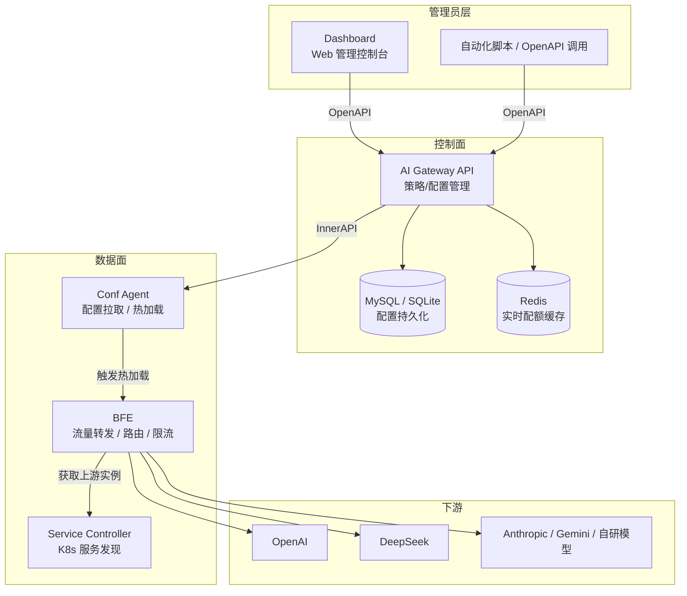
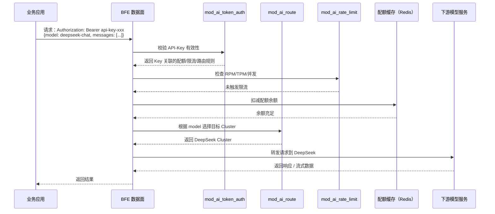

# 第一章 壬远 AI 网关简介

## 本章目标

通过阅读本章，你将能够：

- 理解什么是壬远 AI 网关（Rainway AI Gateway）以及它要解决的核心问题。
- 了解企业在规模化使用大语言模型（Large Language Model，LLM）时的常见痛点。
- 掌握壬远 AI 网关的核心能力边界，包括 AI 路由、API-Key 管理、配额与限流、模型定价、可观测性等。
- 初步认识系统的五大组成部分：AI Gateway API、Dashboard、BFE、Conf Agent、Service Controller。
- 理解壬远 AI 网关与 BFE 开源项目的关系，并建立对典型应用场景的直观认知。

本章面向所有读者，不假设你具备深厚的网关或 AI 背景。技术术语首次出现时给出英文原名，后续章节再逐步深入。

## 什么是壬远 AI 网关

### 定义

**壬远 AI 网关（Rainway AI Gateway）** 是一款面向大模型应用场景的统一流量网关解决方案。它位于企业应用与各类大模型服务提供方（Provider）之间，向上提供统一接入入口，向下屏蔽不同模型厂商在协议、认证、计费和接口形态上的差异。

可以把它理解为 AI 时代的"智能路由器"：根据请求中的模型名、API-Key、用户身份和流量策略，把大模型调用转发到最合适的后端服务，同时完成认证、配额扣减、限流保护和成本核算。

从系统定位上看，壬远 AI 网关包含两个核心平面：

- **控制面（Control Plane）**：负责策略和配置的录入、存储、版本控制与下发，核心组件是 **AI Gateway API**。运维人员通过 Dashboard 或 OpenAPI 管理 API-Key、路由规则、配额和限流策略等。
- **数据面（Data Plane）**：负责流量转发、接入控制、配额校验与限流执行，核心组件是 **BFE**（Beyond Front End）。Conf Agent 负责将控制面配置同步到数据面，实现热加载。

### 名称含义

"壬远"寓意"任重而道远"，谐音"任远"，代表对下一代 AI 基础设施的探索。英文名 **Rainway** 由 "Rain"（雨水，象征 AI 能力润泽万物）与 "Way"（道路）组合，表达"让 AI 能力的接入之路更加通畅"的愿景。

"AI 网关"直接点明产品形态：它不是训练平台，也不是推理引擎本身，而是**连接应用与模型之间的网关层**，专注于接入治理、流量调度和成本管控。

### 项目背景

壬远 AI 网关诞生于企业对大模型能力快速接入和统一治理的现实需求。随着 OpenAI、DeepSeek、Anthropic、Google Gemini 等国内外模型服务的蓬勃发展，企业内部往往同时对接多个提供方。各厂商的接入地址、认证方式、计费单位和协议细节各不相同，直接集成会带来大量重复工作。

在此背景下，壬远 AI 网关基于开源 BFE 项目构建，将传统流量网关的稳定性、可扩展性与 AI 场景特有的路由、认证、配额、定价等能力相结合，为企业提供可私有化部署、可二次开发的 AI 接入基础设施。项目遵循 Apache License 2.0 开源，控制面核心代码位于 `ai-gateway-api/` 仓库。

## 为什么需要壬远 AI 网关

企业规模化使用大模型时，通常会遇到以下痛点：

- **多厂商接入复杂**：OpenAI、DeepSeek、Anthropic 等厂商的接口路径、认证头、请求体格式和错误码各不相同，业务代码维护多套客户端成本高、风险大。
- **API-Key 管理混乱**：Key 分散在多个团队、配置文件或代码仓库中，泄露后难以快速吊销，也缺乏按团队/项目划分的权限与审计。
- **成本不可控**：按 Token 或人民币计费，如无统一配额（Quota）和预算控制，测试脚本误循环或业务突增流量可能导致预算超支。
- **流量缺乏调度能力**：传统负载均衡器不理解模型语义，无法根据 `model` 字段或请求特征做智能路由，也难以在厂商故障时切换。
- **安全与合规风险**：需限制 Key 只能访问特定模型、网段或有效期，并保留调用日志用于审计，分散实现难以保证一致性。
- **可观测性不足**：延迟、Token 消耗、错误率、成本分布等指标分散在各家后台或应用日志中，难以聚合。

壬远 AI 网关通过统一接入层，将多厂商差异、认证授权、配额成本、流量调度、安全审计和可观测性集中管理，使应用开发者专注业务逻辑，平台工程师专注策略配置。

## 壬远 AI 网关的核心能力

### AI 路由

壬远 AI 网关支持基于模型提供方（Provider）、模型名、集群（Cluster）和路由规则的智能转发。控制面通过 Provider 统一管理下游厂商的接入地址、密钥、模型列表和协议类型；通过 Cluster 定义转发策略，包括模型映射、Key 选择策略、Key 亲和性等。

例如，`model=gpt-4o` 可路由到 OpenAI 集群，`model=deepseek-chat` 可路由到 DeepSeek 集群。管理员还可通过路由规则实现灰度发布、A/B 测试、故障转移等高级流量调度。

### API-Key 管理

API-Key 是 AI 网关的入口凭证。壬远 AI 网关提供 API-Key 的全生命周期管理：创建、查询、更新、删除、启用/禁用、有效期控制和校验。创建 API-Key 时可关联配额计划、限流策略和路由规则，实现"一个 Key 一套策略"。API-Key 还支持关联到 Entity（实体），Entity 可表示部门、团队或个人，支持最多 5 级层级结构，便于按组织架构进行权限和成本分摊。

### 配额与限流

配额（Quota）用于控制一段时间内可消耗的总量，支持按 Token 数量（`total_token`）或人民币（`RMB`）计量。每个 API-Key 或 Entity 可绑定独立的配额计划，系统实时扣减余额并在达到阈值时拒绝请求。

限流（Rate Limit）用于控制瞬时并发和请求速率，支持 **TPM**（Tokens Per Minute，每分钟 Token 数）、**RPM**（Requests Per Minute，每分钟请求数）和最大并发数限制。配额与限流相互配合，既能防止预算超支，也能防止突发流量压垮后端模型服务。

### 模型定价

壬远 AI 网关内置模型定价管理（`/model-prices`），支持导入 `model-list.yaml`、单条增删改查以及按提供方归集价格。模型定价是 RMB 配额核算和 BFE 成本统计的数据源，企业可按模型、团队、时间段分析 AI 调用成本。

### 域名与证书管理

作为统一入口，网关通常需要暴露自定义域名并启用 HTTPS。壬远 AI 网关支持域名绑定、TLS 证书上传与默认证书设置，并通过 InnerAPI 将证书配置导出给 BFE 数据面。

### 可观测性

控制面暴露 Prometheus 监控端口（默认 8284），数据面 BFE 也具备成熟的日志和指标能力。结合网关层采集的请求日志，运维人员可观测到各模型/API-Key 的请求量、成功率、Token 消耗、成本分布、延迟百分位（P50/P99）、配额余量和限流触发次数，为容量规划、成本优化和故障定位提供数据基础。

### 配置版本控制与增量下发

控制面通过 `iversion_control` 模块为每一次配置变更生成版本号。Conf Agent 从 InnerAPI 拉取配置时可携带本地版本号，版本一致时直接返回空数据，避免不必要的网络传输和 BFE 重载。该机制在大规模部署场景下尤为重要。

## 系统组成

壬远 AI 网关由五个核心组件协同工作：

| 组件 | 角色 | 主要职责 |
|------|------|----------|
| **AI Gateway API** | 控制面（Control Plane） | 对外暴露 OpenAPI 与 InnerAPI，完成策略/配置的创建、存储、版本控制和下发 |
| **Dashboard** | 管理控制台 | 基于 Web 的可视化管理界面，调用 OpenAPI 完成配置操作 |
| **BFE** | 数据面（Data Plane） | 负责流量转发、接入控制、AI 路由、配额校验、限流执行等 |
| **Conf Agent** | 配置代理 | 从 InnerAPI 拉取最新配置并触发 BFE 热加载，无需重启数据面 |
| **Service Controller** | 服务发现 | 在 Kubernetes 环境中发现并同步后端服务实例，动态更新 BFE 的上游集群 |

这五个组件的关系可以用下图概括：

### AI Gateway API

AI Gateway API 是控制面核心组件，基于 Go 1.22+ 开发，采用经典的三层架构：

- **接口层（`endpoints/`）**：处理 HTTP 请求，包含 OpenAPI v1 和 InnerAPI v1 两个接口族。
- **模型层（`model/`）**：封装 API-Key、Entity、Provider、Cluster、Quota、RateLimitPolicy、ModelPrice 等业务逻辑。
- **存储层（`storage/rdb/`）**：负责关系型数据库读写，支持 MySQL 与 SQLite。

启动后，默认 API 端口为 `8183`，监控端口为 `8284`。

### Dashboard

Dashboard 是面向运维人员和管理员的 Web 界面，通常与 AI Gateway API 打包在同一镜像中。它通过调用 OpenAPI 完成 Provider、Cluster、API-Key、Entity、配额、限流、路由规则的可视化配置。

### BFE

BFE 是百度开源的现代七层负载均衡器，也是壬远 AI 网关的数据面引擎。壬远 AI 网关在 BFE 基础上扩展了 `mod_ai_route`（AI 路由）、`mod_ai_token_auth`（API-Key 认证）、`mod_ai_rate_limit`（AI 限流）等模块。BFE 负责接收应用请求，执行控制面下发的策略，并将请求转发到合适的后端模型服务。

### Conf Agent

Conf Agent 部署在 BFE 节点上，定期向 InnerAPI 拉取最新配置。当检测到配置版本变化时，它将新配置写入本地并通知 BFE 热加载，在不中断流量的情况下更新策略。

### Service Controller

在 Kubernetes 环境中，后端模型服务常以 Pod 形式动态扩缩容。Service Controller 监听 K8s Service 和 Endpoints 变化，将可用实例同步给 BFE，确保数据面拥有正确的上游地址列表。

## 与 BFE 开源项目的关系

壬远 AI 网关与 BFE 开源项目是"站在巨人肩膀上"的关系：

- **BFE 提供基础能力**：作为成熟的七层负载均衡和流量网关，BFE 提供高性能 HTTP 转发、TLS 接入、丰富的路由模块、日志与监控等基础设施。
- **壬远 AI 网关提供 AI 场景增强**：在 BFE 之上增加了 Provider/Cluster 抽象、AI 路由语义、API-Key 认证、Token 级配额与限流、模型定价、AI 可观测等企业级能力。
- **双向协同**：控制面通过 InnerAPI 为 BFE 生成专用配置；BFE 的新模块（如 `mod_ai_route`）则为控制面的策略提供执行载体。

换句话说，BFE 是壬远 AI 网关的"引擎"，而壬远 AI 网关是面向大模型场景的"整车"，将引擎、控制系统、仪表盘和传感器整合在一起，为企业提供开箱即用的 AI 接入体验。

## 典型应用场景

### 场景一：企业统一 AI 接入中台

某科技公司内部有多个业务线，分别使用 OpenAI、DeepSeek、文心一言等模型。通过部署壬远 AI 网关，公司可为所有业务提供统一的 API 入口和认证方式：

- 每个业务线申请独立的 API-Key，绑定不同配额计划。
- 平台团队统一维护 Provider 和 Cluster，业务无需关心厂商接入细节。
- 通过 Entity 层级结构，按部门汇总成本和使用量。

该场景下的请求流程如下图所示：

### 场景二：多模型灰度与故障转移

某智能客服系统希望将 10% 的流量从旧模型切换到新模型观察效果。管理员可配置 AI 路由规则按权重或请求特征分流；当旧模型提供方出现故障时，也可快速将流量切到备用模型，无需修改应用代码。

### 场景三：成本敏感型业务的配额管控

某财务分析工具按 RMB 计量大模型调用成本。平台团队为每个租户创建 RMB 配额计划，预算耗尽时网关自动拒绝后续请求。模型定价数据也让租户能比较不同模型单价，选择性价比更高的模型。

### 场景四：私有部署与合规审计

金融、医疗等行业对数据安全和合规要求较高。壬远 AI 网关支持私有化部署，所有 API-Key、调用日志和配置数据都保存在企业自有基础设施中。安全团队可通过 BFE 日志与 Prometheus 指标审计每一次模型调用的来源、目标模型、Token 消耗和响应状态。

## 本章小结

本章从"是什么""为什么""能做什么"三个维度介绍壬远 AI 网关：

- **定义**：面向大模型场景的统一流量网关，位于应用与模型提供方之间，负责接入治理、流量调度和成本管控。
- **名称与背景**："壬远"寓意探索远方，Rainway 寓意让 AI 能力的接入之路更通畅；项目基于开源 BFE 构建，解决企业多厂商、大规模使用大模型时的管理难题。
- **痛点**：多厂商接入复杂、API-Key 管理混乱、成本不可控、流量缺乏调度、安全合规风险、可观测性不足。
- **核心能力**：AI 路由、API-Key 管理、配额与限流、模型定价、域名与证书管理、可观测性、配置版本控制与增量下发。
- **系统组成**：控制面 AI Gateway API 与 Dashboard，数据面 BFE，配置代理 Conf Agent，服务发现 Service Controller。
- **与 BFE 的关系**：BFE 是基础引擎，壬远 AI 网关是面向 AI 场景的完整解决方案。
- **典型场景**：统一 AI 接入中台、多模型灰度与故障转移、成本配额管控、私有部署与合规审计。

后续章节将围绕这些概念展开：第五章深入整体架构设计，第六章讲解控制面核心设计，第九至十一章分别介绍 Provider/Cluster、路由、配额与限流的设计原理，操作篇和实现篇则带你完成部署、配置与代码阅读。

## 参考文档

- `ai-gateway-api/README.md`
- `ai-gateway-api/README_CN.md`
- `ai-gateway-api/design-docs/sys-design/总体设计文档.md`
- `ai-gateway-api/CHANGELOG.md`
- `ai-gateway-api/AGENTS.md`
