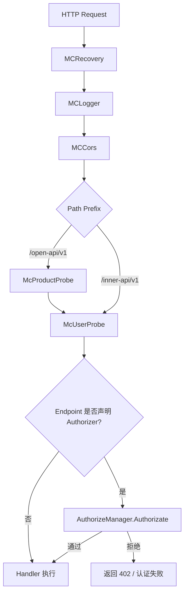
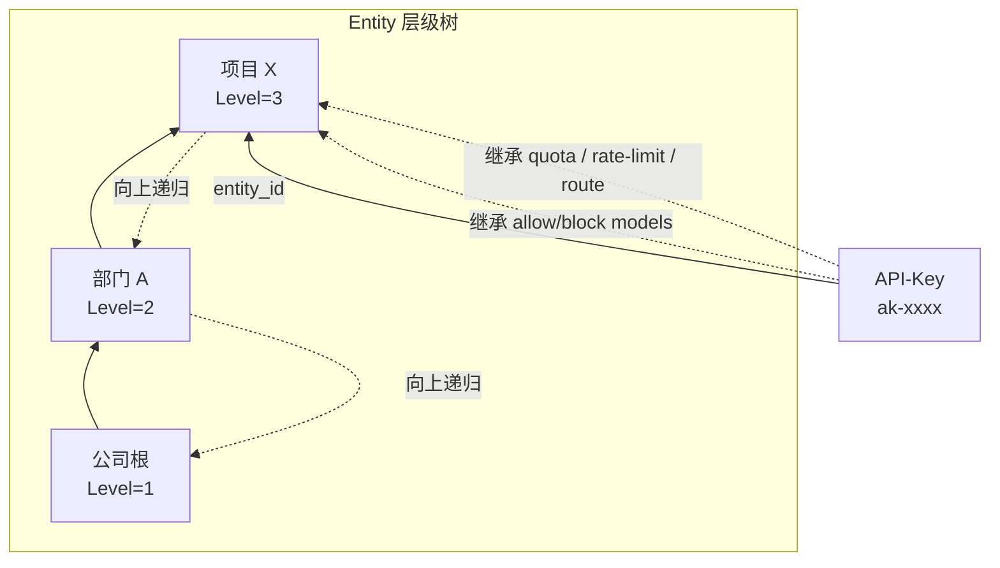

# 第八章 API-Key 与认证授权设计

## 本章目标

AI 网关既要面向内部管理员和开发者提供控制能力，又要面向下游大模型服务传递调用凭证。本章将解决以下问题：

- 控制面如何识别请求方身份，并按最小权限原则进行访问控制；
- 面向业务方的一次性调用凭证（API-Key）如何生成、校验与回收；
- 业务组织单元 Entity 如何形成层级树，并把模型白名单、配额、限流、路由策略继承给挂载其上的 API-Key；
- API-Key 与配额、限流、路由规则如何绑定并导出到 BFE 数据面。

阅读本章后，读者应能理解 AI Gateway API 的认证授权体系、API-Key 与 Entity 的关联继承机制，以及数据面最终生效规则的形成过程。

## 认证授权的整体设计

`ai-gateway-api` 的认证授权模块位于 `model/iauth`，同时负责 OpenAPI（控制台/第三方集成）与 InnerAPI（BFE / Conf Agent 拉取配置）的访问者身份识别与权限控制。

该模块复用了 BFE 历史代码中 `users` 表同时存储“用户”与“Token”的设计，通过 `type` 字段区分两类访问者：

- `type=0`：普通用户，主要用于 Dashboard 管理员登录、人工运维操作；
- `type=1`：Token，主要用于程序化调用、Conf Agent / BFE 拉取 InnerAPI。

在业务层，二者分别映射为 `iauth.User` 与 `iauth.Token`，并通过 `Visitor` 结构体统一抽象。`Visitor` 实现 `Loginer` 接口，统一提供 `GetName`、`GetScopes`、`GetType`、`IsAdmin` 方法。后续授权校验只关心 `Visitor`，不关心底层是用户还是 Token。

控制面的 HTTP 请求在进入路由 handler 之前，会先经过中间件链完成认证与产品线上下文注入，流程见下图。



`McUserProbe` 读取 `Authorization` Header，按空格切分为 `Type` 和 `Identify`，调用 `AuthenticateManager.Authenticate` 得到 `Visitor` 并写入 context。若 Endpoint 声明了 `Authorizer`，则在子路由上挂载鉴权中间件，调用 `AuthorizeManager.Authorizate` 校验 Feature-Action 权限及产品线绑定。

## 用户、Token 与 Scope 设计

### 用户与 Token 共用表

`users` 表同时存储两类记录，核心字段如下：

| 字段 | 说明 |
|------|------|
| `id` | 主键 |
| `name` | 用户名 / Token 名 |
| `type` | `0`=用户，`1`=Token |
| `password` | 用户密码（当前为明文存储） |
| `ticket` | Session Key 或 Token 值 |
| `ticket_created_at` | Session Key 创建时间 |
| `scopes` | 权限作用域，多个用逗号拼接 |

### 四种认证方式

认证层定义了四种认证方式：

```go
const (
    AuthTypePassword   = "Password" // 密码登录
    AuthTypeSessionKey = "Session"  // Session Key 校验
    AuthTypeToken      = "Token"    // 长期 Token 校验
    AuthTypeSkip       = "Skip"     // 调试跳过
)
```

| 方式 | 请求头示例 | 适用场景 | 是否写入 Session |
|------|-----------|---------|----------------|
| `Password` | `Authorization: Password <base64(user:pass)>` | 登录获取 Session Key | 是，生成新 Session Key 并写入 `ticket` |
| `Session` | `Authorization: Session <session_key>` | 常规 OpenAPI 调用 | 否，仅校验 `ticket` 是否过期 |
| `Token` | `Authorization: Token <token_value>` | 程序化调用 / InnerAPI | 否，Token 长期有效 |
| `Skip` | `Authorization: Skip System` | 调试（需 `SkipTokenValidate=true`） | 否，生成伪造 Visitor |

Session Key 由 15 字节随机数经 `base64.URLEncoding` 编码生成，有效期由 `RunTime.SessionExpireInDay` 控制。Token 本质上是 `type=1` 的一条记录，`ticket` 字段即为 Token 值，长期有效。

### Feature-Action 权限模型

权限由 **Feature（功能维度）** 和 **Action（操作维度）** 组合描述：

```go
type FeatureAuthorition struct {
    Feature Feature
    Action  Action
}
```

`Feature` 为字符串，例如 `FeatureAPIKey`、`FeatureRoute`、`FeatureToken`。`Action` 使用位掩码：

```go
const (
    ActionDeny    Action = 1 << iota // 000001
    ActionRead                        // 000010
    ActionReadAll                     // 000010（与 Read 同值）
    ActionUpdate                      // 000100
    ActionCreate                      // 001000
    ActionDelete                      // 010000
    ActionExport                      // 100000
)
```

每个 `xreq.Endpoint` 通过 `Authorizer` 声明所需权限，例如 API-Key 创建接口声明为：

```go
var APIKeyCreateRoute = &xreq.Endpoint{
    Path:   "/api-keys",
    Method: http.MethodPost,
    Authorizer: iauth.FA(iauth.FeatureAPIKey, iauth.ActionCreate),
}
```

`FA(Feature, Action)` 仅校验 Feature-Action；`FAP(Feature, Action)` 额外校验 Visitor 与当前产品线的绑定关系。

全局 `scope2permission` 定义了 Scope 到权限的映射：

| Scope | 含义 | 权限范围 |
|-------|------|---------|
| `System` | 系统管理员 | 所有 Feature 的全部 Action |
| `Support` | 导出/支持类 Token | 仅部分 Feature 拥有 `ActionExport` |

`AuthorizeManager.Authorizate` 执行步骤如下：

1. 从 context 取出 `Visitor`；
2. 若 `Visitor.IsAdmin()` 为 true，直接放行；
3. 遍历 `Visitor.GetScopes()`，在 `scope2permission` 中查找对应 Feature 的 Action 位图；
4. 判断所需 Action 是否被允许；
5. 若 `authorizer.ValidateProduct == true`，再调用 `IsVisitorProductGranted` 校验产品线绑定关系。

> 注：当前 OpenAPI 已移除 `Product` Scope，用户 `is_admin` 仅支持 `true`，Token `scope` 仅保留 `System` 与 `Support`。`user_products` 表继续保留，供未来多租户扩展。

## API-Key 的生成、校验与生命周期

### 数据模型

API-Key 是面向业务方的实际调用凭证，核心字段如下：

| 字段 | 类型 | 说明 |
|------|------|------|
| `id` | string | 系统生成的唯一标识，内部使用 |
| `key` | string | 用于请求头鉴权的 API-Key 值 |
| `description` | string | 描述 |
| `enabled` | bool | 是否启用 |
| `expired_time` | int64 | `-1` 表示永不过期，否则为 Unix 秒级过期时间 |
| `unlimited_quota` | bool | 是否跳过配额检查 |
| `models` | []string | 允许访问的模型白名单，`["*"]` 表示不限制 |
| `subnet` | []string | 允许的客户端子网，`["*"]` 表示不限制 |
| `entity_id` | string | 挂载的 Entity ID，为空表示未挂载 |

### 生成与校验

创建 API-Key 时，可通过 `key` 参数导入外部已有 Key；若未传入，则由后台生成新的 Key 值。对 `key` 的合法性约束如下：

- 长度 1–128 字符；
- 仅允许大小写字母、数字、连字符 `-`、下划线 `_`；
- 全局唯一。

后端生成逻辑伪代码如下：

```go
if param.Key != nil && *param.Key != "" {
    // 校验格式与全局唯一性
}
// 生成默认 Key 并绑定 QuotaPlan、RateLimitPolicy、RouteRules
```

数据面 BFE 在转发请求时，通过 `mod_ai_token_auth` 模块校验 API-Key：检查 Key 是否有效、是否过期、是否在允许的子网内。校验通过后，再进入配额、限流、路由阶段。

### 生命周期

API-Key 的生命周期由以下 OpenAPI 接口管理：

| 接口 | 方法 | 说明 |
|------|------|------|
| `POST /api-keys` | 创建 | 可导入外部 Key，级联创建配额/限流/路由配置 |
| `GET /api-keys` | 列表查询 | 支持按启用状态、Entity、是否无限配额过滤 |
| `GET /api-keys/{id}` | 详情查询 | 返回完整嵌套结构，包含 QuotaPlan Balance |
| `PUT /api-keys/{id}` | 全量更新 | 替换除 `key` 外的所有字段 |
| `PATCH /api-keys/{id}` | 部分更新 | 仅更新传入字段 |
| `DELETE /api-keys/{id}` | 删除 | 级联删除其专属配置，并清理 Redis Key |
| `POST /api-keys/{id}/quota-plan/reset` | 重置配额 | 重置 used/remaining，可修改 quota |

关键状态变更规则：

- `enabled=false` 或 `expired_time` 到达后，数据面校验失败，请求被拒绝；
- 删除 API-Key 时，级联删除其专属的 `quota_plan`、`rate_limit_policy`、`route_rules` 及底层资源（若未被其他对象引用），并通过 `quotaCache.DeleteKeys` 清理对应 Redis Key；
- 修改 `quota_plan.quota`（单位不变）时保留 `used`，按 `remaining = max(0, 新 quota - used)` 调整；修改 `unit` 或 `unlimited` 时重置 `used=0`。

## Entity 层级树与模型继承

### Entity 与 Entity-Type

Entity 是业务组织单元，如公司、部门、项目组、个人。Entity 通过 `parent_id` 字段自底向上形成层级树，其类型由 `entity_types` 表定义，每个 Entity-Type 拥有一个 `Level`（1–5，数字越小级别越高）。

创建或更新 Entity 时必须满足层级约束：

- 父 Entity 必须存在；
- 父 Entity 的 Entity-Type Level 必须 **小于** 当前 Entity 的 Level。

即层级只能从高级别指向低级别，不允许同级或反向引用，从而避免成环。

### 模型继承规则

Entity 可以配置 `allow_models` 与 `block_models`，挂载到其上的 API-Key 会继承这些模型策略：

- `allow_models`：取交集继承。层级中所有非空且不含 `*` 的 `allow_models` 取交集；若某一层级为 `*` 或空数组，则视为不限制，不参与交集。
- `block_models`：取并集继承。层级中所有非空的 `block_models` 取并集。
- API-Key 自身的 `models` 也会参与最终的交集计算。

例如，某 Entity 层级如下：

| Entity | allow_models | block_models |
|--------|-------------|--------------|
| 公司根 | `["*"]` | `[]` |
| 部门 A | `["gpt-4", "gpt-3.5-turbo"]` | `["gpt-4-32k"]` |
| 项目 X | `["gpt-4", "claude-3"]` | `["davinci"]` |
| API-Key | `[]`（未设置） | `[]` |

最终允许的模型为部门 A 与项目 X 的交集 `["gpt-4"]`；最终禁止的模型为 `["gpt-4-32k", "davinci"]`。若 API-Key 自身也设置了非空白名单，则再与上述结果取交集；交集为空时，该 API-Key 在导出时会被禁用（`Enabled=false`）。

### Entity 级策略绑定

每个 Entity 均可独立配置：

- `quota_plan_id`：配额计划；
- `rate_limit_policy_id`：限流策略；
- `route_rules_id`：路由规则。

这些策略与 API-Key 自身策略共同作用，形成多层策略叠加的效果。下节将说明导出到 BFE 时的合并逻辑。

## API-Key 与 Entity 的关联关系

API-Key 通过 `api_keys.entity_id` 字段挂载到某个 Entity。挂载后，API-Key 既保留自身配置，又继承 Entity 层级向上的策略。



关联后的核心行为包括：

1. **模型白名单/黑名单合并**：按交集/并集规则生成最终可调用模型列表；
2. **配额计划层级收集**：自 API-Key 自身向上遍历 Entity 链，收集所有非无限配额计划；
3. **限流策略层级收集**：同样向上遍历，收集所有启用的限流策略；
4. **路由规则层级绑定**：按 API-Key 级 → 直接 Entity 级 → 父 Entity 级 → Global 级的优先级绑定。

`APIKeyManager.populateAssociatedData` 在查询 API-Key 详情时会自动填充：

- `QuotaPlan`（含实时 Balance）；
- `RateLimitPolicy`；
- `RouteRules`；
- `Entity` 摘要（id、name、type）。

## API-Key 与配额、限流、路由规则的绑定

### 配额计划层级合并

导出到 BFE 时，`APIKeyRuleManager.fetchQuotaPlansWithEntityHierarchy` 执行以下收集逻辑：

1. 若 API-Key 自身配置了非无限配额计划，先加入结果；
2. 若 API-Key 挂载了 Entity，递归向上收集 Entity 层级中所有非无限配额计划；
3. 所有无限配额计划不参与导出，但仍会影响 Entity 层级的标签收集。

每个配额计划导出为 BFE 的 `QuotaPlan`：

```go
type QuotaPlan struct {
    Id          string
    Unlimited   bool
    PassNoQuota bool
    RedisKey    string
    ExpiredTime int64 // -1 表示永不过期
    Quota       int64
    Unit        string
}
```

- API-Key 自身配额计划的 `RedisKey` 为 `QUOTA_<api_key_value>`；
- Entity 配额计划的 `RedisKey` 为 `QUOTA_<entity_id>`。

这意味着单个 API-Key 可能同时受多个 Redis Key 的配额控制，BFE 侧需支持多配额校验。

边界兜底：若 API-Key 的 `unlimited_quota=false`，但所有相关 quota plan 均为 `unlimited=true`，导出到 BFE 的 `QuotaPlans` 为空。BFE 视 `UnlimitedQuota=false & QuotaPlans=[]` 为非法，因此导出层会兜底将该 Token 的 `UnlimitedQuota` 修正为 `true`，保证配置可加载。该兜底不修改数据库中原始值。

### 限流策略层级合并

限流策略的收集逻辑与配额计划类似，`RateLimitPolicyManager.fetchRateLimitPolicyIDsWithEntityHierarchy` 先收集 API-Key 自身策略，再向上递归收集 Entity 层级中所有启用的策略。导出时每个策略生成 `rlp-<policy_id>` 并与 API-Key 绑定。

### 路由规则层级绑定

AI 路由导出时，API-Key 按以下优先级绑定路由表：

1. API-Key 级路由规则；
2. Entity 层级路由规则（自底向上遍历）；
3. Global 级路由规则。

绑定顺序为 `apikey_xxx` → `entity_xxx`（直接 Entity）→ `entity_<parent>` → …… → `global_default`。BFE 按此顺序匹配，通常先命中 API-Key 级规则，再依次命中各级 Entity 规则，最后命中 Global 兜底规则。

## 关键数据模型示例

### `users` 表

```sql
CREATE TABLE users (
    id BIGINT PRIMARY KEY AUTO_INCREMENT,
    name VARCHAR(255) NOT NULL COMMENT '用户名/Token名',
    type TINYINT NOT NULL DEFAULT 0 COMMENT '0=用户, 1=Token',
    password VARCHAR(255) DEFAULT NULL COMMENT '用户密码',
    ticket VARCHAR(255) DEFAULT NULL COMMENT 'Session Key 或 Token 值',
    ticket_created_at DATETIME DEFAULT NULL,
    scopes VARCHAR(255) DEFAULT NULL COMMENT '权限作用域，逗号拼接',
    UNIQUE KEY uk_name_type (name, type)
);
```

### `api_keys` 表

```sql
CREATE TABLE api_keys (
    id VARCHAR(64) PRIMARY KEY,
    key VARCHAR(128) NOT NULL UNIQUE,
    description VARCHAR(512) NOT NULL,
    enabled TINYINT NOT NULL DEFAULT 1,
    expired_time BIGINT DEFAULT -1,
    unlimited_quota TINYINT NOT NULL DEFAULT 0,
    models TEXT COMMENT 'JSON 数组',
    subnet TEXT COMMENT 'JSON 数组',
    quota_plan_id BIGINT DEFAULT NULL,
    rate_limit_policy_id BIGINT DEFAULT NULL,
    route_rules_id BIGINT DEFAULT NULL,
    entity_id VARCHAR(64) DEFAULT NULL COMMENT '挂载的 Entity ID',
    create_time BIGINT NOT NULL,
    update_time BIGINT NOT NULL
);
```

### `entities` 表

```sql
CREATE TABLE entities (
    id VARCHAR(64) PRIMARY KEY,
    name VARCHAR(255) NOT NULL UNIQUE,
    type VARCHAR(64) NOT NULL,
    parent_id VARCHAR(64) DEFAULT NULL,
    allow_models TEXT COMMENT 'JSON 数组',
    block_models TEXT COMMENT 'JSON 数组',
    quota_plan_id BIGINT DEFAULT NULL,
    rate_limit_policy_id BIGINT DEFAULT NULL,
    route_rules_id BIGINT DEFAULT NULL,
    create_time BIGINT NOT NULL,
    update_time BIGINT NOT NULL
);
```

## 本章小结

本章介绍了壬远 AI 网关的认证授权体系与 API-Key 设计：

- **认证授权**：`model/iauth` 同时面向 OpenAPI 与 InnerAPI，用户与 Token 共用 `users` 表，通过 `Visitor` 统一抽象，采用 Feature-Action 位掩码权限模型。Session Key 有过期时间，Token 长期有效，调试场景支持 `Skip` 认证。
- **API-Key 生命周期**：支持生成/导入、启用/禁用、过期、全量/部分更新、删除及配额重置。删除时会级联清理专属配置与 Redis Key。
- **Entity 层级树**：Entity 按 Entity-Type Level 组织为树，支持模型白名单交集继承、黑名单并集继承，以及配额、限流、路由策略的向上层级合并。
- **策略绑定**：API-Key 挂载到 Entity 后，数据面导出时会合并 API-Key 自身策略与 Entity 层级策略，形成最终生效的模型列表、多 Redis Key 配额、多限流策略以及多级路由绑定。

理解这些机制，有助于在后续章节中正确配置配额、限流与路由规则，并排查因 Entity 继承导致的权限与策略问题。

## 参考文档

- `ai-gateway-api/design-docs/sys-design/details/认证授权机制.md`
- `ai-gateway-api/design-docs/sys-design/details/API-Key与Entity关联及模型继承.md`
- `ai-gateway-api/design-docs/api-define/OpenAPI接口定义/api-keys.md`
- `ai-gateway-api/design-docs/api-define/OpenAPI接口定义/auth.md`
- `ai-gateway-api/design-docs/api-define/OpenAPI接口定义/entities.md`
