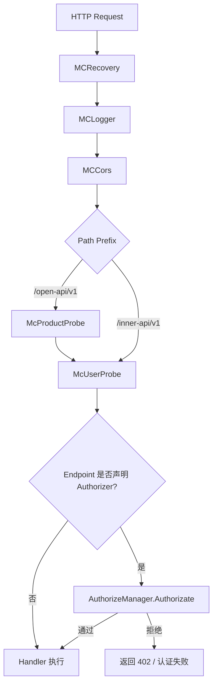

# 第八章 认证授权设计

## 本章目标

AI 网关的控制面既要面向内部管理员和开发者提供管理能力，又要面向数据面组件（BFE、Conf Agent）暴露配置导出接口。本章聚焦控制面的认证授权机制，通过阅读本章，读者将理解：

- 控制面如何识别请求方身份；
- 用户、Session Key、Token 三类访问者如何统一管理；
- Feature-Action 权限模型如何工作；
- OpenAPI 与 InnerAPI 在认证授权上的差异；
- 认证中间件链的执行流程。

---

## 认证授权的整体设计

`ai-gateway-api` 的认证授权模块位于 `model/iauth`，同时负责 OpenAPI（控制台/第三方集成）与 InnerAPI（BFE / Conf Agent 拉取配置）的访问者身份识别与权限控制。

该模块复用了 BFE 历史代码中 `users` 表同时存储“用户”与“Token”的设计，通过 `type` 字段区分两类访问者：

- `type=0`：普通用户，主要用于 Dashboard 管理员登录、人工运维操作；
- `type=1`：Token，主要用于程序化调用、Conf Agent / BFE 拉取 InnerAPI。

在业务层，二者分别映射为 `iauth.User` 与 `iauth.Token`，并通过 `Visitor` 结构体统一抽象。`Visitor` 实现 `Loginer` 接口，统一提供 `GetName`、`GetScopes`、`GetType`、`IsAdmin` 方法。后续授权校验只关心 `Visitor`，不关心底层是用户还是 Token。

控制面的 HTTP 请求在进入路由 handler 之前，会先经过中间件链完成认证与产品线上下文注入，流程见下图。



`McUserProbe` 读取 `Authorization` Header，按空格切分为 `Type` 和 `Identify`，调用 `AuthenticateManager.Authenticate` 得到 `Visitor` 并写入 context。若 Endpoint 声明了 `Authorizer`，则在子路由上挂载鉴权中间件，调用 `AuthorizeManager.Authorizate` 校验 Feature-Action 权限及产品线绑定。

---

## 用户、Token 与 Scope 设计

### 用户与 Token 共用表

`users` 表同时存储两类记录，核心字段如下：

| 字段 | 说明 |
|------|------|
| `id` | 主键 |
| `name` | 用户名 / Token 名 |
| `type` | `0`=用户，`1`=Token |
| `password` | 用户密码（当前为明文存储） |
| `ticket` | Session Key 或 Token 值 |
| `ticket_created_at` | Session Key 创建时间 |
| `scopes` | 权限作用域，多个用逗号拼接 |

### 四种认证方式

认证层定义了四种认证方式：

```go
const (
    AuthTypePassword   = "Password" // 密码登录
    AuthTypeSessionKey = "Session"  // Session Key 校验
    AuthTypeToken      = "Token"    // 长期 Token 校验
    AuthTypeSkip       = "Skip"     // 调试跳过
)
```

| 方式 | 请求头示例 | 适用场景 | 是否写入 Session |
|------|-----------|---------|----------------|
| `Password` | `Authorization: Password <base64(user:pass)>` | 登录获取 Session Key | 是，生成新 Session Key 并写入 `ticket` |
| `Session` | `Authorization: Session <session_key>` | 常规 OpenAPI 调用 | 否，仅校验 `ticket` 是否过期 |
| `Token` | `Authorization: Token <token_value>` | 程序化调用 / InnerAPI | 否，Token 长期有效 |
| `Skip` | `Authorization: Skip System` | 调试（需 `SkipTokenValidate=true`） | 否，生成伪造 Visitor |

Session Key 由 15 字节随机数经 `base64.URLEncoding` 编码生成，有效期由 `RunTime.SessionExpireInDay` 控制。Token 本质上是 `type=1` 的一条记录，`ticket` 字段即为 Token 值，长期有效。

### Feature-Action 权限模型

权限由 **Feature（功能维度）** 和 **Action（操作维度）** 组合描述：

```go
type FeatureAuthorition struct {
    Feature Feature
    Action  Action
}
```

`Feature` 为字符串，例如 `FeatureAPIKey`、`FeatureRoute`、`FeatureToken`。`Action` 使用位掩码：

```go
const (
    ActionDeny    Action = 1 << iota // 000001
    ActionRead                        // 000010
    ActionReadAll                     // 000010（与 Read 同值）
    ActionUpdate                      // 000100
    ActionCreate                      // 001000
    ActionDelete                      // 010000
    ActionExport                      // 100000
)
```

每个 `xreq.Endpoint` 通过 `Authorizer` 声明所需权限，例如 API-Key 创建接口声明为：

```go
var APIKeyCreateRoute = &xreq.Endpoint{
    Path:   "/api-keys",
    Method: http.MethodPost,
    Authorizer: iauth.FA(iauth.FeatureAPIKey, iauth.ActionCreate),
}
```

`FA(Feature, Action)` 仅校验 Feature-Action；`FAP(Feature, Action)` 额外校验 Visitor 与当前产品线的绑定关系。

全局 `scope2permission` 定义了 Scope 到权限的映射：

| Scope | 含义 | 权限范围 |
|-------|------|---------|
| `System` | 系统管理员 | 所有 Feature 的全部 Action |
| `Support` | 导出/支持类 Token | 仅部分 Feature 拥有 `ActionExport` |

`AuthorizeManager.Authorizate` 执行步骤如下：

1. 从 context 取出 `Visitor`；
2. 若 `Visitor.IsAdmin()` 为 true，直接放行；
3. 遍历 `Visitor.GetScopes()`，在 `scope2permission` 中查找对应 Feature 的 Action 位图；
4. 判断所需 Action 是否被允许；
5. 若 `authorizer.ValidateProduct == true`，再调用 `IsVisitorProductGranted` 校验产品线绑定关系。

> 注：当前 OpenAPI 已移除 `Product` Scope，用户 `is_admin` 仅支持 `true`，Token `scope` 仅保留 `System` 与 `Support`。`user_products` 表继续保留，供未来多租户扩展。

---

## OpenAPI 与 InnerAPI 的授权差异

| 维度 | OpenAPI (`/open-api/v1`) | InnerAPI (`/inner-api/v1`) |
|------|--------------------------|----------------------------|
| 访问者 | Dashboard 用户 / 第三方集成 Token | Conf Agent / BFE Token |
| 中间件 | `McProductProbe` + `McUserProbe` | 仅 `McUserProbe` |
| 权限粒度 | Feature-Action + 产品线绑定 | 通常仅 Feature-Action |
| Token Scope | `System` / `Support` | `System` / `Support` |
| 典型用途 | 配置管理 | 配置导出 |

InnerAPI 的导出接口（如 `/configs/mod-api-key`）虽然也对访问者做认证授权，但 Conf Agent 通常使用 `Support` Scope 的 Token 拉取配置，权限范围较窄，避免暴露管理面能力。

---

## 关键数据模型

### `users` 表

```sql
CREATE TABLE users (
    id BIGINT PRIMARY KEY AUTO_INCREMENT,
    name VARCHAR(255) NOT NULL COMMENT '用户名/Token名',
    type TINYINT NOT NULL DEFAULT 0 COMMENT '0=用户, 1=Token',
    password VARCHAR(255) DEFAULT NULL COMMENT '用户密码',
    ticket VARCHAR(255) DEFAULT NULL COMMENT 'Session Key 或 Token 值',
    ticket_created_at DATETIME DEFAULT NULL,
    scopes VARCHAR(255) DEFAULT NULL COMMENT '权限作用域，逗号拼接',
    UNIQUE KEY uk_name_type (name, type)
);
```

### `user_products` 表

```sql
CREATE TABLE user_products (
    id BIGINT PRIMARY KEY AUTO_INCREMENT,
    user_id BIGINT NOT NULL,
    product_name VARCHAR(255) NOT NULL,
    UNIQUE KEY uk_user_product (user_id, product_name)
);
```

`user_products` 用于记录用户与产品线的绑定关系，当前版本保留表结构，为未来多租户扩展做准备。

---

## 本章小结

本章介绍了壬远 AI 网关控制面的认证授权设计：

- `model/iauth` 同时面向 OpenAPI 与 InnerAPI，用户与 Token 共用 `users` 表，通过 `Visitor` 统一抽象；
- 认证方式包括 Password、Session、Token、Skip 四种，分别适用于登录、常规调用、程序化调用和调试场景；
- 授权采用 Feature-Action 位掩码模型，每个 Endpoint 声明所需权限，Scope 决定权限范围；
- OpenAPI 与 InnerAPI 的认证授权链路存在差异，InnerAPI 通常只走 `McUserProbe`；
- `user_products` 表保留，为未来多租户扩展做准备。

API-Key 作为面向业务方的实际调用凭证，其生成、校验、生命周期及与 Entity 的关联继承机制将在 [第十一章 API-Key 设计](./chapter09-apikey-design.md) 中详细说明。

---

## 参考文档

- `ai-gateway-api/design-docs/sys-design/details/认证授权机制.md`
- `ai-gateway-api/design-docs/api-define/OpenAPI接口定义/auth.md`
- `ai-gateway-api/model/iauth/`
- `ai-gateway-api/endpoints/middleware/`
