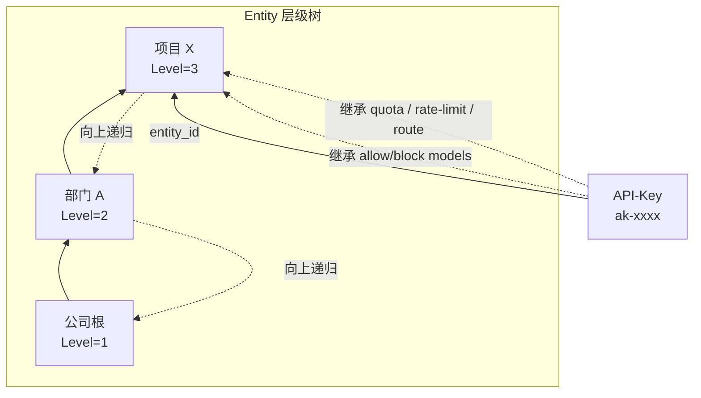

# 第九章 Entity 与 API-Key 设计

## 本章目标

Entity 与 API-Key 是壬远 AI 网关消费者侧的两个核心概念。Entity 表达业务组织架构（如公司、部门、团队、项目），是模型白名单、配额、限流、路由等策略的承载单元；API-Key 是业务系统面向数据面的核心调用凭证，通过挂载到 Entity 继承其策略，也可拥有独立配置。两者共同构成后续配额、限流、路由、成本核算等能力的挂载点。通过阅读本章，读者将理解：

- Entity 的数据模型、层级树约束与模型继承规则；
- API-Key 的数据模型、生成校验与完整生命周期；
- API-Key 如何挂载到 Entity，并继承其策略；
- API-Key 与配额、限流、路由规则如何绑定并导出到 BFE 数据面；
- 数据面最终生效规则的形成过程。

---

## Entity 数据模型与层级树

### Entity 与 Entity-Type

Entity 是业务组织单元，如公司、部门、项目组、个人。Entity 通过 `parent_id` 字段自底向上形成层级树，其类型由 `entity_types` 表定义，每个 Entity-Type 拥有一个 `Level`（1–5，数字越小级别越高）。

创建或更新 Entity 时必须满足层级约束：

- 父 Entity 必须存在；
- 父 Entity 的 Entity-Type Level 必须 **小于** 当前 Entity 的 Level。

即层级只能从高级别指向低级别，不允许同级或反向引用，从而避免成环。

### 模型继承规则

Entity 可以配置 `allow_models` 与 `block_models`，挂载到其上的 API-Key 会继承这些模型策略：

- `allow_models`：取交集继承。层级中所有非空且不含 `*` 的 `allow_models` 取交集；若某一层级为 `*` 或空数组，则视为不限制，不参与交集。
- `block_models`：取并集继承。层级中所有非空的 `block_models` 取并集。
- API-Key 自身的 `models` 也会参与最终的交集计算。

例如，某 Entity 层级如下：

| Entity | allow_models | block_models |
|--------|-------------|--------------|
| 公司根 | `["*"]` | `[]` |
| 部门 A | `["gpt-4", "gpt-3.5-turbo"]` | `["gpt-4-32k"]` |
| 项目 X | `["gpt-4", "claude-3"]` | `["davinci"]` |
| API-Key | `[]`（未设置） | `[]` |

最终允许的模型为部门 A 与项目 X 的交集 `["gpt-4"]`；最终禁止的模型为 `["gpt-4-32k", "davinci"]`。若 API-Key 自身也设置了非空白名单，则再与上述结果取交集；交集为空时，该 API-Key 在导出时会被禁用（`Enabled=false`）。

### Entity 级策略绑定

每个 Entity 均可独立配置：

- `quota_plan_id`：配额计划；
- `rate_limit_policy_id`：限流策略；
- `route_rules_id`：路由规则。

这些策略与 API-Key 自身策略共同作用，形成多层策略叠加的效果。

---

## API-Key 数据模型

API-Key 是业务系统调用大模型服务时使用的凭证，其核心字段如下：

| 字段 | 类型 | 说明 |
|------|------|------|
| `id` | string | 系统生成的唯一标识，内部使用 |
| `key` | string | 用于请求头鉴权的 API-Key 值 |
| `description` | string | 描述 |
| `enabled` | bool | 是否启用 |
| `expired_time` | int64 | `-1` 表示永不过期，否则为 Unix 秒级过期时间 |
| `unlimited_quota` | bool | 是否跳过配额检查 |
| `models` | []string | 允许访问的模型白名单，`["*"]` 表示不限制 |
| `subnet` | []string | 允许的客户端子网，`["*"]` 表示不限制 |
| `entity_id` | string | 挂载的 Entity ID，为空表示未挂载 |

这些字段决定了 API-Key 在数据面是否可用、可调用的模型范围、可发起的客户端网络范围，以及是否受配额约束。`key` 字段是业务方实际放入 HTTP 请求头的凭证值，而 `id` 仅用于控制面内部关联。

---

## API-Key 的生成与校验

### 生成规则

创建 API-Key 时，可通过 `key` 参数导入外部已有 Key；若未传入，则由后台生成新的 Key 值。对 `key` 的合法性约束如下：

- 长度 1–128 字符；
- 仅允许大小写字母、数字、连字符 `-`、下划线 `_`；
- 全局唯一。

后端生成逻辑伪代码如下：

```go
if param.Key != nil && *param.Key != "" {
    // 校验格式与全局唯一性
}
// 生成默认 Key 并绑定 QuotaPlan、RateLimitPolicy、RouteRules
```

### 数据面校验

数据面 BFE 在转发请求时，通过 `mod_ai_token_auth` 模块校验 API-Key：

1. 从请求头 `Authorization: Bearer <api-key>` 中提取 Key 值；
2. 检查 Key 是否存在于导出的 API-Key 配置中；
3. 检查 `enabled` 是否为 true；
4. 检查 `expired_time` 是否到达；
5. 检查请求来源 IP 是否在 `subnet` 允许范围内。

校验通过后，再进入配额、限流、路由阶段。任一校验失败都会返回对应的错误响应。

---

## API-Key 的生命周期

API-Key 的生命周期由以下 OpenAPI 接口管理：

| 接口 | 方法 | 说明 |
|------|------|------|
| `POST /api-keys` | 创建 | 可导入外部 Key，级联创建配额/限流/路由配置 |
| `GET /api-keys` | 列表查询 | 支持按启用状态、Entity、是否无限配额过滤 |
| `GET /api-keys/{id}` | 详情查询 | 返回完整嵌套结构，包含 QuotaPlan Balance |
| `PUT /api-keys/{id}` | 全量更新 | 替换除 `key` 外的所有字段 |
| `PATCH /api-keys/{id}` | 部分更新 | 仅更新传入字段 |
| `DELETE /api-keys/{id}` | 删除 | 级联删除其专属配置，并清理 Redis Key |
| `POST /api-keys/{id}/quota-plan/reset` | 重置配额 | 重置 used/remaining，可修改 quota |

关键状态变更规则：

- `enabled=false` 或 `expired_time` 到达后，数据面校验失败，请求被拒绝；
- 删除 API-Key 时，级联删除其专属的 `quota_plan`、`rate_limit_policy`、`route_rules` 及底层资源（若未被其他对象引用），并通过 `quotaCache.DeleteKeys` 清理对应 Redis Key；
- 修改 `quota_plan.quota`（单位不变）时保留 `used`，按 `remaining = max(0, 新 quota - used)` 调整；修改 `unit` 或 `unlimited` 时重置 `used=0`。

---

## API-Key 与 Entity 的关联关系

API-Key 通过 `api_keys.entity_id` 字段挂载到某个 Entity。挂载后，API-Key 既保留自身配置，又继承 Entity 层级向上的策略。



关联后的核心行为包括：

1. **模型白名单/黑名单合并**：按交集/并集规则生成最终可调用模型列表；
2. **配额计划层级收集**：自 API-Key 自身向上遍历 Entity 链，收集所有非无限配额计划；
3. **限流策略层级收集**：同样向上遍历，收集所有启用的限流策略；
4. **路由规则层级绑定**：按 API-Key 级 → 直接 Entity 级 → 父 Entity 级 → Global 级的优先级绑定。

`APIKeyManager.populateAssociatedData` 在查询 API-Key 详情时会自动填充：

- `QuotaPlan`（含实时 Balance）；
- `RateLimitPolicy`；
- `RouteRules`；
- `Entity` 摘要（id、name、type）。

---

## API-Key 与配额、限流、路由规则的绑定

### 配额计划层级合并

导出到 BFE 时，`APIKeyRuleManager.fetchQuotaPlansWithEntityHierarchy` 执行以下收集逻辑：

1. 若 API-Key 自身配置了非无限配额计划，先加入结果；
2. 若 API-Key 挂载了 Entity，递归向上收集 Entity 层级中所有非无限配额计划；
3. 所有无限配额计划不参与导出，但仍会影响 Entity 层级的标签收集。

每个配额计划导出为 BFE 的 `QuotaPlan`：

```go
type QuotaPlan struct {
    Id          string
    Unlimited   bool
    PassNoQuota bool
    RedisKey    string
    ExpiredTime int64 // -1 表示永不过期
    Quota       int64
    Unit        string
}
```

- API-Key 自身配额计划的 `RedisKey` 为 `QUOTA_<api_key_value>`；
- Entity 配额计划的 `RedisKey` 为 `QUOTA_<entity_id>`。

这意味着单个 API-Key 可能同时受多个 Redis Key 的配额控制，BFE 侧需支持多配额校验。

边界兜底：若 API-Key 的 `unlimited_quota=false`，但所有相关 quota plan 均为 `unlimited=true`，导出到 BFE 的 `QuotaPlans` 为空。BFE 视 `UnlimitedQuota=false & QuotaPlans=[]` 为非法，因此导出层会兜底将该 Token 的 `UnlimitedQuota` 修正为 `true`，保证配置可加载。该兜底不修改数据库中原始值。

### 限流策略层级合并

限流策略的收集逻辑与配额计划类似，`RateLimitPolicyManager.fetchRateLimitPolicyIDsWithEntityHierarchy` 先收集 API-Key 自身策略，再向上递归收集 Entity 层级中所有启用的策略。导出时每个策略生成 `rlp-<policy_id>` 并与 API-Key 绑定。

### 路由规则层级绑定

AI 路由导出时，API-Key 按以下优先级绑定路由表：

1. API-Key 级路由规则；
2. Entity 层级路由规则（自底向上遍历）；
3. Global 级路由规则。

绑定顺序为 `apikey_xxx` → `entity_xxx`（直接 Entity）→ `entity_<parent>` → …… → `global_default`。BFE 按此顺序匹配，通常先命中 API-Key 级规则，再依次命中各级 Entity 规则，最后命中 Global 兜底规则。

---

## 关键数据模型示例

### `entity_types` 表

```sql
CREATE TABLE entity_types (
    id BIGINT PRIMARY KEY AUTO_INCREMENT,
    name VARCHAR(64) NOT NULL UNIQUE,
    level INT NOT NULL COMMENT '层级级别，数字越小级别越高',
    create_time BIGINT NOT NULL,
    update_time BIGINT NOT NULL
);
```

### `entities` 表

```sql
CREATE TABLE entities (
    id VARCHAR(64) PRIMARY KEY,
    name VARCHAR(255) NOT NULL UNIQUE,
    type VARCHAR(64) NOT NULL,
    parent_id VARCHAR(64) DEFAULT NULL,
    allow_models TEXT COMMENT 'JSON 数组',
    block_models TEXT COMMENT 'JSON 数组',
    quota_plan_id BIGINT DEFAULT NULL,
    rate_limit_policy_id BIGINT DEFAULT NULL,
    route_rules_id BIGINT DEFAULT NULL,
    create_time BIGINT NOT NULL,
    update_time BIGINT NOT NULL
);
```

### `api_keys` 表

```sql
CREATE TABLE api_keys (
    id VARCHAR(64) PRIMARY KEY,
    key VARCHAR(128) NOT NULL UNIQUE,
    description VARCHAR(512) NOT NULL,
    enabled TINYINT NOT NULL DEFAULT 1,
    expired_time BIGINT DEFAULT -1,
    unlimited_quota TINYINT NOT NULL DEFAULT 0,
    models TEXT COMMENT 'JSON 数组',
    subnet TEXT COMMENT 'JSON 数组',
    quota_plan_id BIGINT DEFAULT NULL,
    rate_limit_policy_id BIGINT DEFAULT NULL,
    route_rules_id BIGINT DEFAULT NULL,
    entity_id VARCHAR(64) DEFAULT NULL COMMENT '挂载的 Entity ID',
    create_time BIGINT NOT NULL,
    update_time BIGINT NOT NULL
);
```

---

## 本章小结

本章详细介绍了壬远 AI 网关消费者侧的两个核心概念——Entity 与 API-Key：

- **Entity 数据模型**：`entities` 表与 `entity_types` 表共同表达业务组织架构，通过 `parent_id` 与 `level` 约束形成层级树；
- **模型继承**：Entity 层级中的 `allow_models` 取交集、`block_models` 取并集，最终与 API-Key 自身白名单共同决定可用模型；
- **Entity 级策略绑定**：每个 Entity 可独立绑定配额计划、限流策略与路由规则，作为 API-Key 继承策略的来源；
- **API-Key 数据模型**：`api_keys` 表记录 Key 值、启用状态、过期时间、模型白名单、子网限制、挂载 Entity 等关键字段；
- **生成与校验**：支持外部 Key 导入和后台生成，数据面 BFE 在 `mod_ai_token_auth` 中完成有效性、过期、子网等多维度校验；
- **生命周期**：通过 OpenAPI 完成创建、查询、更新、删除、配额重置，删除时会级联清理专属配置与 Redis Key；
- **策略绑定与导出**：API-Key 挂载到 Entity 后，自身策略与 Entity 层级策略合并，形成最终生效的多 Redis Key 配额、多限流策略和多级路由绑定。

理解 Entity 与 API-Key 的设计，是正确配置配额、限流与路由规则的基础，也是排查数据面权限与策略问题的关键。

---

## 参考文档

- `ai-gateway-api/design-docs/sys-design/details/API-Key与Entity关联及模型继承.md`
- `ai-gateway-api/design-docs/api-define/OpenAPI接口定义/api-keys.md`
- `ai-gateway-api/design-docs/api-define/OpenAPI接口定义/entities.md`
- `ai-gateway-api/model/api_key/`
- `ai-gateway-api/model/entity/`
