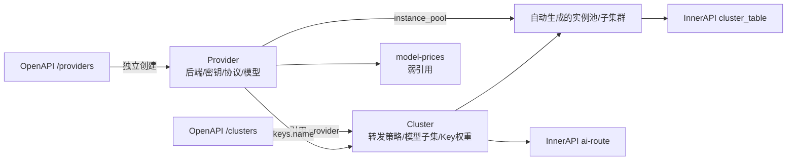
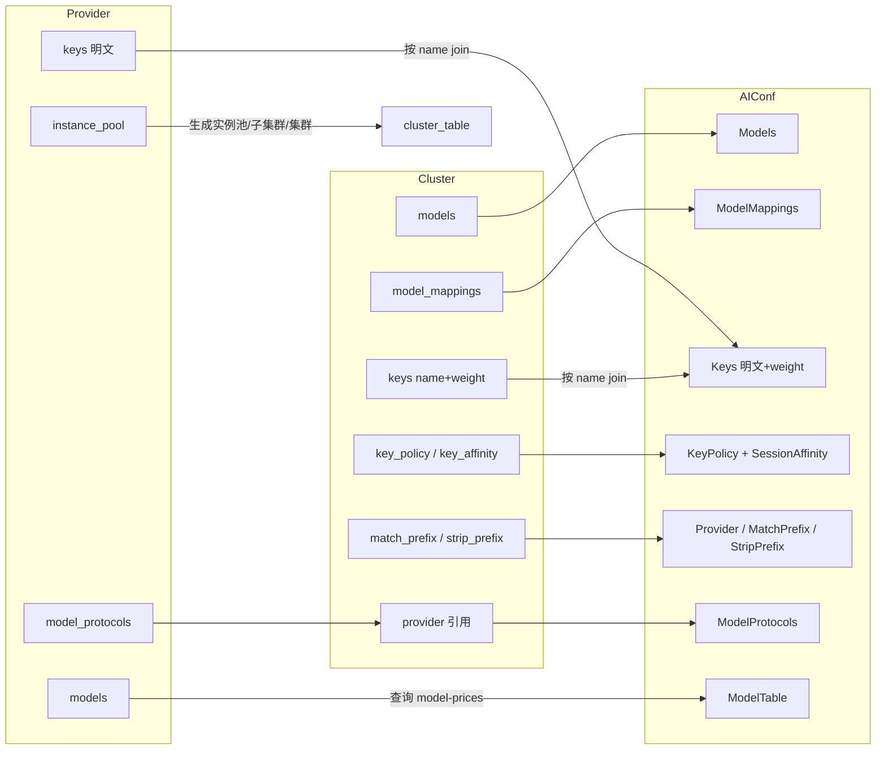

# 第九章 Provider 与 Cluster 设计

## 本章目标

在壬远 AI 网关（Rainway AI Gateway）的控制面（Control Plane）中，模型提供方（Provider）与转发集群（Cluster）曾经是同一个 `/clusters` 资源的两面。本章将解释为什么要把这两个概念拆分开来，以及拆分后各自承担什么职责。阅读完本章，你将能够：

- 理解 Provider 与 Cluster 的数据模型和字段含义。
- 理解二者解耦的设计动机、实现方式和带来的收益。
- 掌握控制面如何根据 Provider + Cluster 生成 BFE 数据面所需的 `AIConf`。
- 了解模型发现、Key 引用与权重、Key Policy、Key Affinity 等关键机制。
- 能够写出符合规范的实际配置。

## Provider 的设计目标与数据模型

### 设计目标

Provider（提供商）回答的是“下游是谁、能访问哪些模型、如何认证、后端在哪里”这几个问题。它把过去分散在 cluster 里的 provider 相关字段收敛到一个独立资源中，具备以下设计目标：

- **身份与能力声明**：Provider 持有名称、描述、支持的模型列表、模型访问协议（`model_protocols`）、模型发现端点（`model_endpoint`）等元信息。
- **认证信息归集**：Provider 是 API-Key 明文的唯一持有者，cluster 只通过 `name` 引用，不再暴露 key 内容。
- **后端实例归集**：Provider 维护 `instance_pool`，供多个 cluster 复用同一套后端地址。
- **独立生命周期**：Provider 可以独立创建、更新、删除；删除前由控制面检查是否有 cluster 引用。

### 数据模型

一个 Provider 的 JSON 表示如下（字段细节参见 `ai-gateway-api/design-docs/api-define/OpenAPI接口定义/providers.md`）：

```json
{
    "name": "deepseek",
    "description": "DeepSeek 官方 API",
    "model_endpoint": {
        "schema": "https",
        "uri": "/v1/models"
    },
    "models": ["deepseek-chat", "deepseek-coder"],
    "keys": [
        {"name": "key-primary", "key": "sk-aaaaaaaaaaaa"},
        {"name": "key-secondary", "key": "sk-bbbbbbbbbbbb"}
    ],
    "instance_pool": [
        {"addr": "api.deepseek.com", "weight": 100, "port": 443}
    ],
    "model_protocols": ["openai"],
    "time_zone": "Asia/Shanghai",
    "tiers": [
        {
            "name": "peak",
            "time_ranges": [
                {"weekdays": [1,2,3,4,5], "start": "09:00", "end": "12:00"},
                {"weekdays": [1,2,3,4,5], "start": "14:00", "end": "18:00"}
            ]
        }
    ],
    "create_time": 1716883200,
    "update_time": 1716883200
}
```

关键字段说明：

- `name`：Provider 唯一标识，全局唯一。
- `model_endpoint`：模型发现端点，默认 `{schema: "https", uri: "/v1/models"}`。
- `models`：该 provider 支持的模型列表，可以是手动维护，也可以由模型发现接口回填。
- `keys`：API-Key 列表，每项包含 `name` 与 `key` 明文。`name` 用于 cluster 引用。
- `instance_pool`：后端实例池，至少包含一个实例，且至少有一个实例的 `weight > 0`。
- `model_protocols`：支持的模型访问协议，首期枚举为 `openai`、`anthropic`。
- `time_zone` / `tiers`：用于高峰/闲时价格匹配，初期只支持 `peak` tier。

## Cluster 的设计目标与数据模型

### 设计目标

Cluster（集群）回答的是“流量如何转发、用哪些模型、key 权重如何分配”的问题。Provider 与 Cluster 解耦后，Cluster 专注于转发语义：

- **路由与转发策略**：包括超时、重试、会话保持、被动健康检查等 BFE 集群参数。
- **模型选择**：通过 `llm_config.models` 声明该 cluster 可转发的模型，必须是所属 provider `models` 的子集。
- **Key 权重与策略**：通过 `llm_config.keys` 引用 provider 中的 key，并配置权重；通过 `key_policy` 控制选择策略和重试退避；通过 `key_affinity` 控制会话级 Key 亲和性。
- **前缀处理**：通过 `match_prefix` 与 `strip_prefix` 处理聚合 provider（如 OpenRouter）的模型名前缀。

### 数据模型

一个 Cluster 的 JSON 表示如下（字段细节参见 `ai-gateway-api/design-docs/api-define/OpenAPI接口定义/clusters.md`）：

```json
{
    "name": "my-cluster",
    "description": "示例集群",
    "basic": {
        "protocol": "http",
        "connection": {"max_idle_conn_per_rs": 0, "cancel_on_client_close": false},
        "retries": {"max_retry_in_cluster": 2},
        "buffers": {"req_write_buffer_size": 512},
        "timeouts": {
            "timeout_conn_serv": 50000,
            "timeout_response_header": 50000,
            "timeout_readbody_client": 30000,
            "timeout_read_client_again": 30000,
            "timeout_write_client": 60000
        }
    },
    "sticky_sessions": {"enabled": false, "hash_strategy": "CLIENT_IP_ONLY", "hash_header": ""},
    "passive_health_check": {"interval": 1000, "failnum": 3, "host": "", "uri": "/", "statuscode": 0},
    "llm_config": {
        "models": ["deepseek-chat", "deepseek-coder"],
        "model_mappings": [
            {"source_model": "gpt-4", "target_model": "deepseek-chat"}
        ],
        "keys": [
            {"name": "key-primary", "weight": 70},
            {"name": "key-secondary", "weight": 30}
        ],
        "key_policy": {
            "strategy": "weighted_random",
            "max_retries": 3,
            "retry_backoff_initial": 500,
            "retry_backoff_max": 5000
        },
        "key_affinity": {
            "enabled": true,
            "ttl": 600,
            "redis_prefix": "bfe:ai:key_affinity",
            "penalty_enable": true
        },
        "provider": "deepseek",
        "match_prefix": "deepseek/",
        "strip_prefix": true
    }
}
```

关键字段说明：

- `name`：集群名，全局唯一。
- `basic`：连接、重试、超时、缓冲等基本参数。例如 `connection.max_idle_conn_per_rs` 控制每个 BFE 实例为每个 RS 维持的空闲长连接数；`timeouts` 控制连接后端、读响应头、读请求体等超时；`retries.max_retry_in_cluster` 控制同一集群内的重试次数。
- `sticky_sessions`：会话保持配置。`enabled=false` 时关闭；开启后可根据 `CLIENT_IP_ONLY`、`CLIENT_ID_ONLY` 或 `CLIENT_ID_PREFERED` 策略保持会话；使用 `CLIENT_ID_*` 策略时需要指定 `hash_header`。
- `passive_health_check`：被动健康检查配置。当连续转发失败次数达到 `failnum` 后，BFE 会按 `interval` 周期对下游 RS 发起探活，直到恢复。`host` 为空时默认使用所属 provider 首个实例的 `addr`。
- `llm_config`：AI LLM 服务配置，必须包含 `provider`，且 `models` 必须是所属 provider `models` 的子集。
- `llm_config.keys`：只保留 `name` 与 `weight`，`name` 必须引用 provider 中存在的 key。
- `llm_config.key_policy`：多 Key 选择策略与重试退避，当前 `strategy` 仅支持 `weighted_random`。
- `llm_config.key_affinity`：基于 Redis + `ClientKeyId` 的会话级 Key 亲和性。

## Provider 与 Cluster 解耦的原因与收益

### 解耦前的痛点

在早期的 `/clusters` 资源中，Provider 与 Cluster 的职责是混合的：

- `/clusters` 既描述下游模型提供商标识、后端实例池、模型端点、API-Key 明文，又描述路由/转发策略、连接超时、健康检查等 BFE 集群参数。
- 同一 provider 被多个 cluster 引用时，`instance_pool`、`keys`、`model_endpoint` 需要重复配置。
- cluster 接口暴露 API-Key 明文，且无法通过引用复用 provider 的 key。
- `model-prices` 的 `provider` 字段语义不清，强引用关系导致配置顺序僵化。
- 新增 provider 类型或协议时，cluster 模型不断膨胀。

### 解耦后的架构

下面这张图展示了 Provider 与 Cluster 解耦后的关系：



在这个架构中：

- Provider 是“能力提供者”，Cluster 是“转发策略”。
- Cluster 通过 `llm_config.provider` 强引用 Provider。
- 控制面在创建 Cluster 时，根据 Provider 的 `instance_pool` 自动生成实例池、子集群并绑定到集群。
- `model-prices` 只按名称弱关联 Provider，不阻塞删除。

### 核心收益

| 收益 | 说明 |
|------|------|
| 职责分离 | Provider = “我是谁、我能访问哪些模型、我的后端和密钥是什么”；Cluster = “我如何转发、用哪些模型、key 权重如何分配”。 |
| 独立生命周期 | Provider 可独立创建、更新、删除；Cluster 通过引用获取后端能力。 |
| 数据安全 | Cluster 不再存储 key 明文，只通过 name 引用 Provider 中的 key。 |
| BFE 无感知 | 生成给 BFE 的配置保持原结构；变化仅在控制面内部做“provider → 老配置”的转换。 |
| 弱引用 model-prices | `/model-prices` 的 `provider` 字段不再强制引用 `/providers`，降低配置顺序约束。 |
| 减少重复配置 | 同一 provider 被多个 cluster 引用时，后端实例池和 key 只需维护一份。 |

### 生命周期与引用完整性

Provider 与 Cluster 解耦后，二者各自拥有独立的生命周期，但控制面必须在关键操作点维护引用完整性，避免配置不一致。

**Provider 更新时的反向校验**

当调用 `PATCH /providers/{provider_name}` 修改 `instance_pool`、`keys` 或 `models` 时，控制面会执行以下校验：

- `instance_pool` 变更：会同步刷新所有引用该 provider 的 cluster 所生成的实例池（EPP 子集群除外）。
- `keys` 删除/重命名：会校验没有 cluster 仍引用旧 key name；否则返回 `409 Conflict`。
- `models` 删除：会校验没有 cluster 仍引用已被移除的 model；否则返回 `409 Conflict`。

这些校验通过 `model/icluster_conf/ClusterManager` 向 `ProviderManager.UpdateProvider` 注册 hook 实现，包括 `ProviderInstancePoolSyncer`、`ProviderKeyRefChecker`、`ProviderModelRefChecker`。

**Provider 删除**

删除 provider 前，控制面必须校验该 provider 未被任何 `/clusters` 引用。`/model-prices` 中的同名 provider 不再作为阻塞条件，因为它们之间是弱引用关系。

**Cluster 删除**

删除 cluster 时，系统会先检查该集群是否被 AI 路由规则（global / entity / api-key 级别）引用；若被引用，删除失败并返回引用冲突错误。通过引用检查后，系统自动级联清理关联的子集群和实例池。

**更新接口的 name 约束**

无论是 `PATCH /providers/{provider_name}` 还是 `PATCH /clusters/{cluster_name}`，请求体中都不能包含 `name` 字段。名称由 URI 路径参数唯一指定，若请求体携带 `name`，接口返回 `422 Unprocessable Entity`。

## AIConf 的生成

BFE 数据面消费的配置结构与重构前保持一致。控制面通过 `model/icluster_conf/exporter.go` 将 Provider 与 Cluster 的数据合并，生成最终的 `AIConf`。下面这张图展示了生成过程：



各字段的生成来源如下：

| BFE 配置项 | 来源（新模型） |
|------------|----------------|
| 实例池 / 子集群 / 集群 | Cluster + Provider.instance_pool |
| `AIConf.Models` | `cluster.llm_config.models` |
| `AIConf.ModelMappings` | `cluster.llm_config.model_mappings` |
| `AIConf.Keys` | `provider.keys`（key 明文） + `cluster.llm_config.keys`（weight）按 name join |
| `AIConf.KeyPolicy` | `cluster.llm_config.key_policy` + `cluster.llm_config.key_affinity` |
| `AIConf.Provider` | `cluster.llm_config.provider` |
| `AIConf.MatchPrefix` / `StripPrefix` | `cluster.llm_config.match_prefix` / `strip_prefix` |
| `AIConf.ModelProtocols` | `provider.model_protocols` 按 cluster 的 provider 引用透传 |
| `AIConf.ModelTable` | 由 provider 查询 `model-prices` 自动填充 |

### ModelTable 的自动填充

`ModelTable` 不在 OpenAPI `/clusters` 端点中展示，仅通过 InnerAPI 根据 `provider` 自动填充后下发给 BFE。控制面会依据 cluster 引用的 provider 名称，到 `model-prices` 中查询对应的 (model, mode) 价格记录，填充为 BFE 可识别的模型价格表。

### MatchPrefix 与 StripPrefix

这两个字段主要用于聚合 provider 场景，例如 OpenRouter 会把模型名统一加上 `openrouter/` 前缀：

- `match_prefix`：用于路由匹配，例如 `openrouter/`。
- `strip_prefix`：为 `true` 时，转发给下游前会从请求 `model` 字段中去掉该前缀；为 `false` 时仅用于路由标识，不裁剪。

当 `strip_prefix=true` 时，`match_prefix` 必填且非空，且必须以 `/` 结尾。

### ModelProtocols

`ModelProtocols` 来自 Provider 的 `model_protocols`，控制面按 cluster 的 `provider` 引用透传到 `AIConf`。BFE 据此判断请求协议风格（如 OpenAI 兼容格式或 Anthropic Messages API）。

## 模型发现机制

模型发现（Model Discovery）是 Provider 的一个辅助能力，用于自动探测第三方 AI 提供商支持的模型列表，减少手工维护成本。

### 触发方式

通过 OpenAPI 端点 `POST /providers/tools/discover-models` 触发。该接口为无状态工具接口，不直接读写 Provider 资源，返回模型名列表后，调用方需要再调用 `PATCH /providers/{provider_name}` 将结果回填到 Provider 的 `models` 字段。

### 输入参数

| 参数 | 说明 |
|------|------|
| `model_protocol` | 模型访问协议，必填，枚举 `openai`、`anthropic` |
| `schema` | 请求协议，必填，`http` 或 `https` |
| `addr` | 目标实例地址 |
| `port` | 目标实例端口 |
| `uri` | 模型列表接口 URI，默认 `/v1/models` |
| `apikey` | 调用模型列表接口的 API Key |

### 执行流程

1. 若 `uri` 为空，默认使用 `/v1/models`；构造请求 URL：`{schema}://{addr}:{port}{uri}`。
2. 若 `apikey` 非空，根据 `model_protocol` 生成认证头：
   - `openai`：`Authorization: Bearer {apikey}`
   - `anthropic`：`x-api-key: {apikey}`
3. 携带认证头调用第三方模型列表接口。
4. 根据 `model_protocol` 选择对应的响应解析器，提取模型名列表。
5. 返回模型名列表。

模型发现失败后不会影响已有 cluster 的正常运行，管理员仍可手动维护 `models`。

## Key 引用与权重、Key Policy、Key Affinity

### Key 引用与权重

解耦后，Cluster 不再持有 API-Key 明文，而是通过 `llm_config.keys` 引用 Provider 中的 key：

```json
"keys": [
    {"name": "key-primary", "weight": 70},
    {"name": "key-secondary", "weight": 30}
]
```

规则：

- `name` 必须对应 provider `keys` 中存在的 name。
- 同一 `keys` 数组内 `name` 唯一。
- `weight` 取值范围 `[0,100]`，`0` 表示该 Key 不接收流量（等效于禁用）。
- 所有 Key 的 `weight` 之和必须等于 `100`。

### Key Policy

`key_policy` 控制多 Key 时的选择策略和重试退避：

```json
"key_policy": {
    "strategy": "weighted_random",
    "max_retries": 3,
    "retry_backoff_initial": 500,
    "retry_backoff_max": 5000
}
```

字段说明：

- `strategy`：Key 选择策略，当前仅支持 `weighted_random`。BFE 会根据 `weight` 做加权随机选择。
- `max_retries`：该 cluster 在当前请求内的总额外重试次数，不是单个 Key 的重试次数。当某个 Key 因网络异常或后端限流失败时，BFE 可以在重试次数上限内切换到另一个 Key。
- `retry_backoff_initial` / `retry_backoff_max`：初始退避时间和最大退避时间，单位毫秒。实际退避时间通常按指数退避计算，但不超过 `retry_backoff_max`，且必须满足 `retry_backoff_max >= retry_backoff_initial`。

Key Policy 与 Key Affinity 配合使用：Affinity 保证同一客户端优先使用同一个 Key，而 Policy 在 Key 失败时提供重试与切换能力。

### Key Affinity

`key_affinity` 提供基于 Redis + `ClientKeyId` 的会话级 Key 亲和性，确保同一客户端在一段时间内持续使用同一个 Key，便于配额管理和故障隔离。

```json
"key_affinity": {
    "enabled": true,
    "ttl": 600,
    "redis_prefix": "bfe:ai:key_affinity",
    "penalty_enable": true
}
```

字段说明：

- `enabled`：是否开启会话级 Key 亲和性。
- `ttl`：绑定空闲超时时间，单位秒；命中绑定后 BFE 会刷新 TTL，持续请求则绑定保持。
- `redis_prefix`：Redis key 前缀。
- `penalty_enable`：是否开启 Key 惩罚；为 `true` 时，近期返回 429/401/403 的 Key 会被跳过。

Key Affinity 最终会映射到 `AIConf` 的 `SessionAffinity*` 相关字段下发给 BFE。

## 配置示例

### 配置顺序

推荐按以下顺序配置：

```
/providers → /model-prices → /clusters → 路由规则
```

其中 `/model-prices` 与 `/providers` 之间为弱引用关系，实际配置时无需等待 `/providers` 数据就绪即可写入 `/model-prices`。

### 创建 Provider

```bash
curl -X POST "http://api-server:8183/api/v1/providers" \
  -H "Content-Type: application/json" \
  -d '{
    "name": "deepseek",
    "description": "DeepSeek 官方 API",
    "model_endpoint": {"schema": "https", "uri": "/v1/models"},
    "models": ["deepseek-chat", "deepseek-coder"],
    "keys": [
        {"name": "key-primary", "key": "sk-aaaaaaaaaaaa"},
        {"name": "key-secondary", "key": "sk-bbbbbbbbbbbb"}
    ],
    "instance_pool": [
        {"addr": "api.deepseek.com", "weight": 100, "port": 443}
    ],
    "model_protocols": ["openai"]
}'
```

### 创建 Cluster

```bash
curl -X POST "http://api-server:8183/api/v1/clusters" \
  -H "Content-Type: application/json" \
  -d '{
    "name": "my-cluster",
    "description": "示例集群",
    "llm_config": {
        "models": ["deepseek-chat", "deepseek-coder"],
        "model_mappings": [
            {"source_model": "gpt-4", "target_model": "deepseek-chat"}
        ],
        "keys": [
            {"name": "key-primary", "weight": 70},
            {"name": "key-secondary", "weight": 30}
        ],
        "key_policy": {
            "strategy": "weighted_random",
            "max_retries": 3,
            "retry_backoff_initial": 500,
            "retry_backoff_max": 5000
        },
        "key_affinity": {
            "enabled": true,
            "ttl": 600,
            "redis_prefix": "bfe:ai:key_affinity",
            "penalty_enable": true
        },
        "provider": "deepseek",
        "match_prefix": "deepseek/",
        "strip_prefix": true
    }
}'
```

### 触发模型发现

```bash
curl -X POST "http://api-server:8183/api/v1/providers/tools/discover-models" \
  -H "Content-Type: application/json" \
  -d '{
    "model_protocol": "openai",
    "schema": "https",
    "addr": "api.deepseek.com",
    "port": 443,
    "uri": "/v1/models",
    "apikey": "sk-aaaaaaaaaaaa"
}'
```

返回示例：

```json
{
    "ErrNum": 200,
    "ErrMsg": "success",
    "Data": {
        "models": ["deepseek-chat", "deepseek-coder", "deepseek-reasoner"]
    }
}
```

## 本章小结

本章详细介绍了壬远 AI 网关中 Provider 与 Cluster 的设计。

- **Provider** 负责描述下游模型提供方的身份、模型列表、API-Key 明文、后端实例池和模型访问协议，是“能力提供者”。
- **Cluster** 负责描述转发策略，包括模型子集、Key 引用与权重、Key Policy、Key Affinity、超时/重试/健康检查等，是“转发策略”。
- **解耦收益**：职责更清晰、配置更少重复、Cluster 不再暴露 key 明文、BFE 无感知、model-prices 与 provider 之间可弱引用。
- **AIConf 生成**：控制面将 Provider 与 Cluster 的数据按 name join，生成 BFE 所需的实例池、子集群、`AIConf.Keys`、`AIConf.ModelTable`、`AIConf.ModelProtocols` 等字段。
- **模型发现**：通过 `/providers/tools/discover-models` 探测第三方模型列表，再回填到 Provider。
- **Key 机制**：Cluster 通过 `name` 引用 Provider 的 key 并设置权重；`key_policy` 控制选择策略与重试退避；`key_affinity` 提供基于 Redis 的会话级 Key 亲和性。

理解 Provider 与 Cluster 的边界，是正确配置壬远 AI 网关、实现多模型提供商灵活调度的基础。

## 参考文档

- `ai-gateway-api/design-docs/sys-design/details/provider与cluster概念分离.md`
- `ai-gateway-api/design-docs/api-define/OpenAPI接口定义/providers.md`
- `ai-gateway-api/design-docs/api-define/OpenAPI接口定义/clusters.md`
- `ai-gateway-api/design-docs/api-define/InnerAPI接口定义/cluster-table.md`
- `ai-gateway-api/design-docs/api-define/InnerAPI接口定义/ai-route.md`
- [第六章 控制面核心设计：AI Gateway API](./chapter06-control-plane-design.md)
- [第十八章 Provider 配置](./chapter18-provider-configuration.md)
- [第十九章 Cluster 配置](./chapter19-cluster-configuration.md)
- [第二十八章 mod_ai_route 实现](../implementation/chapter28-mod-ai-route.md)
