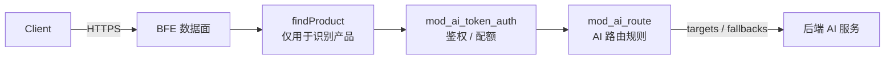
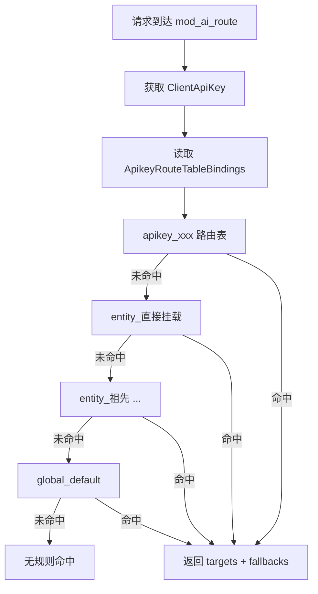

# 第十一章 AI 路由规则设计

## 本章目标

在 AI 网关场景下，请求的转发目标完全由 AI 路由规则决定。本章将帮助读者：

- 理解 AI 路由规则在请求处理链路中的位置；
- 理解 Global / Entity / API-Key 三级 AI 路由表的组织方式；
- 掌握 `route_rules` 表的数据模型、校验规则与生命周期一致性；
- 了解 AI 路由规则如何导出到 BFE、绑定顺序与文件格式；
- 掌握 Fallback 与默认路由的设计与配置方法。

## AI 路由规则在请求处理链路中的位置

在 AI 网关模式下，BFE 通过独立的 `ServeHTTPForAI()` 路径处理请求。该路径会调用 `findProduct()` 完成产品线识别，供中间件和配置加载使用，但**不会使用传统的产品级 BFE 路由规则来选择目标 Cluster**。请求最终转发到哪个模型与集群，完全由 `mod_ai_route` 模块根据 AI 路由规则决定。

AI 路由规则在 `HandleFoundProduct` 阶段执行，位于 `mod_ai_token_auth` 鉴权之后、`mod_ai_rate_limit` 限流之前。每条规则包含：

- 命中条件 `Cond`；
- 一个或多个 `targets`（集群 + 模型 + 权重）；
- 可选的 `fallbacks`（降级目标列表）。



上图展示了 AI 网关模式下的请求链路：产品识别仅为中间件和配置上下文服务，真正的转发目标由 AI 路由规则决定。

## Global / Entity / API-Key 三级 AI 路由表

AI 路由表（Route Table）是一组 AI 路由规则的集合，在 `route_rules` 表中通过 `type` 和 `owner` 区分层级。

### Global 路由表

- 唯一记录：`type=global, owner=global`。
- OpenAPI 端点：`GET /global-route-rules`、`PUT /global-route-rules`。
- 系统初始化时，`stateful/container/rdb/components.go:Init()` 会调用 `RouteRulesManager.EnsureGlobalRouteRules` 自动创建一条默认记录（`enabled=false`、`rules=[]`），保证管理员首次进入路由管理页即可看到 Global 路由表。
- 若记录已存在则不会覆盖；不存在时 `PUT` 会自动创建。
- Global 路由表是所有请求的最后兜底，通常配置一条 `default_t()` 规则作为默认路由。

### Entity 路由表

- 记录标识：`type=entity, owner=<entity_id>`。
- Entity 路由表不通过独立端点维护，而是在 Entity 创建/更新时作为内嵌对象一起写入，对应 `entities.route_rules_id` 外键。
- 创建 Entity 时，若未传入 `route_rules`，系统会默认写入 `enabled=false`、`rules=[]`。

### API-Key 路由表

- 记录标识：`type=apikey, owner=<apikey_id>`。
- 与 Entity 类似，API-Key 路由表在 API-Key 创建/更新时作为内嵌对象写入，对应 `api_keys.route_rules_id`。
- 未传入时同样默认写入 `enabled=false`、`rules=[]`。

### 路由表列表

`GET /route-tables` 用于分页列出所有路由表的元信息，仅返回 `type`、`owner`、`enabled`，不返回 `rules` 详情：

```json
{
    "id": 1,
    "type": "global",
    "owner": "global",
    "enabled": true
}
```

### 绑定优先级

对每个 API-Key，BFE 最终看到的查找顺序为：

1. `apikey_<key>`（API-Key 级）
2. `entity_<entity_name>`（直接挂载的 Entity）
3. `entity_<parent_name>` ……（沿 `parent_id` 向上遍历的所有祖先 Entity）
4. `global_default`（Global 级）

BFE 按列表顺序匹配，通常先命中 API-Key 级规则，再依次命中各级 Entity 规则，最后命中 Global 兜底规则。

这种自顶向下的优先级设计符合组织管理习惯：API-Key 级规则最细粒度，能够满足个别应用或用户的特殊需求；Entity 级规则承上启下，适用于部门或项目层面的统一调度；Global 级规则则作为全系统的默认策略，避免任何请求因未命中规则而被直接拒绝。



上图是 AI 路由表的三级查找流程：只有当前级全部规则都不命中时，才会继续下一级；任何一级命中都会立即返回结果。

## route_rules 表的设计与管理

### 表结构

```sql
CREATE TABLE route_rules (
    id BIGINT AUTO_INCREMENT PRIMARY KEY,
    type VARCHAR(64) NOT NULL COMMENT 'global / entity / apikey',
    owner VARCHAR(255) NOT NULL COMMENT '全局写 global，Entity 写 entity_id，API-Key 写 apikey_id',
    enabled TINYINT(1) NOT NULL DEFAULT 1,
    rules JSON NOT NULL COMMENT '规则数组',
    created_at DATETIME NOT NULL DEFAULT CURRENT_TIMESTAMP,
    updated_at DATETIME NOT NULL DEFAULT CURRENT_TIMESTAMP ON UPDATE CURRENT_TIMESTAMP,
    UNIQUE KEY uk_route_rules_type_owner (type, owner)
);
```

字段说明：

- `type`：路由表类型，取值为 `global`、`entity`、`apikey`。
- `owner`：所有者标识。Global 固定为 `global`；Entity 为 `entity_id`；API-Key 为 `apikey_id`。
- `enabled`：是否启用。禁用的路由表不会导出到 BFE，也不会加入绑定列表。
- `rules`：规则 JSON 数组。

### 规则 JSON 结构

单条 AI 路由规则的 JSON 结构如下：

```json
{
    "name": "rule-1",
    "cond": "req_body_json_in(\"model\", \"gpt-4\", false)",
    "targets": [
        {"cluster_name": "cluster-openai", "model": "gpt-4", "weight": 80},
        {"cluster_name": "cluster-azure", "model": "gpt-4", "weight": 20}
    ],
    "fallbacks": [
        {"cluster_name": "cluster-fallback", "model": "gpt-3.5-turbo"}
    ]
}
```

字段说明：

- `name`：规则名称，在同一张路由表中唯一。
- `cond`：BFE 条件表达式，命中后使用该规则。
- `targets`：转发目标列表，包含 `cluster_name`、`model`、`weight`。`model` 为空表示透传原始模型；同一规则内所有 `weight` 之和必须等于 100。
- `fallbacks`：降级目标列表，可选，按顺序尝试。

### Go 模型

控制面对应的 Go 结构定义位于 `ai-gateway-api/model/shared/types.go`：

```go
type AiRouteRuleParam struct {
    Name      *string                `json:"name"`
    Cond      *string                `json:"cond"`
    Targets   []*AiRouteTargetParam  `json:"targets"`
    Fallbacks []*AiRouteFallbackParam `json:"fallbacks,omitempty"`
}

type AiRouteTargetParam struct {
    ClusterName *string `json:"cluster_name"`
    Model       *string `json:"model"`
    Weight      *int    `json:"weight"`
}

type AiRouteFallbackParam struct {
    ClusterName *string `json:"cluster_name"`
    Model       *string `json:"model"`
}
```

### 管理方式

- **Global 路由表**：通过 `GET /global-route-rules`、`PUT /global-route-rules` 独立管理。
- **Entity / API-Key 路由表**：通过 Entity 或 API-Key 的创建/更新接口内嵌管理，不暴露独立端点。
- **路由表元信息**：通过 `GET /route-tables` 分页查看。

## 路由规则校验与生命周期一致性

### 校验规则

在创建或更新路由规则时，`RouteRulesManager.validateRouteRules` 会执行统一校验：

1. 规则名称必填，且在同一张路由表中不能重复；
2. `cond` 必填且不能空；
3. `targets` 不能为空；
4. 每个 target 必须有 `weight`；
5. 同一条规则内所有 target 的 `weight` 之和必须等于 100；
6. Fallback 的 `cluster_name` 不能为空。

OpenAPI 层面额外要求：

- `cond` 必须是合法的 BFE 条件表达式；
- `cluster_name` 必须是已存在的集群；
- `model` 若不为空，必须是该集群 `llm_config.models` 中已配置的模型；
- 同一 `targets` 数组内 `(cluster_name, model)` 组合不能重复。

> 注意：保存阶段会通过 `validate.ConditionExpression` 对 `cond` 做 BFE 表达式语法校验（内部调用 `condition.Build`），语法错误的表达式无法写入数据库。Dashboard 或 `RouteRuleManager.ExpressionVerify` 也提供了同样的前置校验能力。

### 生命周期一致性

AI 路由规则与 API-Key / Entity 的生命周期保持一致：

- **创建**：创建 API-Key 或 Entity 时，若传入 `route_rules`，会同步创建 `route_rules` 记录，并把生成的 `id` 写回 `api_keys.route_rules_id` 或 `entities.route_rules_id`。
- **更新**：更新时若传入 `route_rules`，已有 `route_rules_id` 则更新，没有则创建新记录并写入外键。
- **删除**：删除 API-Key 或 Entity 时，会级联删除其关联的 `route_rules` 记录。
- **切换 Entity**：API-Key 从一个 Entity 切换到另一个 Entity 时，API-Key 自身的 `route_rules_id` 不变，导出时自动绑定新 Entity 的路由表。
- **Entity 名称变更**：导出 Key `entity_<name>` 会变化，BFE 需重新加载。

| 场景 | 行为 |
|---|---|
| 路由表 `enabled=false` | 不导出到 BFE，也不加入绑定列表 |
| API-Key 未挂载 Entity | 仅绑定自身路由表 + Global 路由表 |
| API-Key 与 Entity 都未配置路由表 | 仅绑定 Global 路由表（若启用） |
| Global 路由表禁用 | 无全局兜底，可能导致请求无规则可匹配 |
| 引用的 Cluster 被删除 | 删除集群时校验失败，需先解除引用或删除规则 |

## 导出到 BFE 的绑定顺序与文件格式

### 导出结构

控制面通过 InnerAPI 将 AI 路由规则导出为 `ai_route.json`（最终落地为 BFE 的 `ai_route.data`）。导出的 Go 结构为：

```go
type AiRouteDataExport struct {
    Version                  string                    `json:"Version"`
    RouteRules               map[string]*RouteTableExport `json:"RouteRules"`
    ApikeyRouteTableBindings map[string][]string       `json:"ApikeyRouteTableBindings"`
}
```

### 路由表命名

| 类型 | 导出 Key | Owner 字段 | `route_rules.type` 值 |
|---|---|---|---|
| API-Key | `apikey_<api_key_value>` | API-Key 的 key 值 | `apikey` |
| Entity | `entity_<entity_name>` | Entity 的 name | `entity` |
| Global | `global_default` | `global` | `global` |

> 注：`RouteRulesTypeAPIKey` 常量已由 `"api_key"` 修正为 `"apikey"`，与导出 Key 及 BFE 侧约定保持一致。历史 `type="api_key"` 记录建议迁移为 `"apikey"`。

### 绑定顺序

对每个 API-Key，绑定列表按以下顺序追加：

1. `apikey_<key>`（API-Key 级）
2. `entity_<entity_name>`（直接挂载的 Entity）
3. `entity_<parent_name>` ……（沿 `parent_id` 向上遍历的所有祖先 Entity）
4. `global_default`（Global 级）

核心逻辑可简化为：

```go
for _, apiKey := range apiKeys {
    var bindingList []string

    // 1. API-Key 级
    if apiKey.RouteRulesID != nil && enabled {
        bindingList = append(bindingList, fmt.Sprintf("apikey_%s", *apiKey.Key))
    }

    // 2. Entity 级（自底向上遍历层级）
    currentEntityID := apiKey.EntityID
    for currentEntityID != nil && *currentEntityID != "" {
        entity := entityMap[*currentEntityID]
        if entity.RouteRulesID != nil && *entity.RouteRulesID != "" {
            bindingList = append(bindingList, fmt.Sprintf("entity_%s", *entity.Name))
        }
        currentEntityID = entity.ParentID
    }

    // 3. Global 级
    if globalRouteRules != nil && enabled {
        bindingList = append(bindingList, "global_default")
    }

    bindings[*apiKey.Key] = bindingList
}
```

### 文件格式

`ai_route.data` 是 BFE `mod_ai_route` 模块的规则配置文件，字段说明见 `bfe/docs/zh_cn/configuration/mod_ai_route/ai_route.data.md`：

- `Version`：配置文件版本，通常采用时间戳格式；
- `route_rules`：路由表集合，Key 为路由表名称；
- `route_rules[k].type`：路由表类型，取值 `apikey`、`entity`、`global`；
- `route_rules[k].owner`：路由表所有者；
- `route_rules[k].rules`：规则列表，按顺序匹配；
- `ApikeyRouteTableBindings`：API-Key 到路由表名称列表的绑定关系，按顺序匹配。

## Fallback 与默认路由

### Fallback 机制

Fallback 用于当规则的 `targets` 全部不可用时进行降级。触发 Fallback 的典型错误包括：

- 连接失败；
- 超时；
- 后端返回 5xx。

不触发 Fallback 的场景包括：

- 客户端 4xx；
- 鉴权失败；
- 限流拒绝。

当触发 Fallback 时，BFE 会按 `fallbacks` 列表顺序依次构造新的 target，重新调用 `clusterInvoke()`，第一个成功即停止；全部失败则返回最后一个 fallback 的错误响应。

设计 Fallback 时需要注意两点：一是 Fallback 列表本身不再做加权选择，而是严格按数组顺序线性尝试；二是 Fallback 中的 `model` 同样可以为空，表示透传原始模型。运维人员通常会把成本更低或容量更充裕的集群放在 Fallback 中，以便在主目标异常时快速承接流量。

### 默认路由

Global 路由表通常配置一条 `default_t()` 规则作为默认路由，确保任何未命中更细粒度规则的请求都有去处。例如：

```json
{
    "name": "global-default",
    "cond": "default_t()",
    "targets": [
        {"cluster_name": "cluster_global", "model": "", "weight": 100}
    ],
    "fallbacks": []
}
```

如果 Global 路由表被禁用或未配置默认规则，而 API-Key 与 Entity 路由表也全部未命中，则请求可能无规则可匹配，最终返回 404。因此生产环境强烈建议启用 Global 兜底路由。

## 路由规则配置示例

### Global 路由表示例

```json
{
    "enabled": true,
    "rules": [
        {
            "name": "global-default",
            "cond": "default_t()",
            "targets": [
                {"cluster_name": "cluster_global", "model": "", "weight": 100}
            ],
            "fallbacks": []
        }
    ]
}
```

### Entity 路由表示例

```json
{
    "enabled": true,
    "rules": [
        {
            "name": "dept-ai-default",
            "cond": "req_host_in(\"ai.dept.example.com\")",
            "targets": [
                {"cluster_name": "cluster_dept_ai", "model": "", "weight": 100}
            ],
            "fallbacks": []
        }
    ]
}
```

### API-Key 路由表示例

```json
{
    "enabled": true,
    "rules": [
        {
            "name": "user-a-deepseek",
            "cond": "req_body_json_in(\"model\", \"deepseek-v4-pro\", false)",
            "targets": [
                {"cluster_name": "cluster_deepseek_a", "model": "deepseek-v4-pro", "weight": 70},
                {"cluster_name": "cluster_deepseek_b", "model": "deepseek-v4-pro", "weight": 30}
            ],
            "fallbacks": [
                {"cluster_name": "cluster_deepseek_c", "model": "deepseek-v3.2"}
            ]
        }
    ]
}
```

### 导出后的 `ai_route.data` 示例

```json
{
    "Version": "20260720150000",
    "route_rules": {
        "apikey_ak_user_a": {
            "type": "apikey",
            "owner": "ak_user_a",
            "rules": [
                {
                    "name": "user-a-deepseek",
                    "Cond": "req_body_json_in(\"model\", \"deepseek-v4-pro\", false)",
                    "targets": [
                        {"ClusterName": "cluster_deepseek_a", "Model": "deepseek-v4-pro", "Weight": 70},
                        {"ClusterName": "cluster_deepseek_b", "Model": "deepseek-v4-pro", "Weight": 30}
                    ],
                    "fallbacks": [
                        {"ClusterName": "cluster_deepseek_c", "Model": "deepseek-v3.2"}
                    ]
                }
            ]
        },
        "entity_dept_ai": {
            "type": "entity",
            "owner": "dept_ai",
            "rules": [
                {
                    "name": "dept_ai-default",
                    "Cond": "default_t()",
                    "targets": [
                        {"ClusterName": "cluster_dept_ai", "Model": "", "Weight": 100}
                    ],
                    "fallbacks": []
                }
            ]
        },
        "global_default": {
            "type": "global",
            "owner": "global",
            "rules": [
                {
                    "name": "global-default",
                    "Cond": "default_t()",
                    "targets": [
                        {"ClusterName": "cluster_global", "Model": "", "Weight": 100}
                    ],
                    "fallbacks": []
                }
            ]
        }
    },
    "ApikeyRouteTableBindings": {
        "ak_user_a": [
            "apikey_ak_user_a",
            "entity_dept_ai",
            "global_default"
        ]
    }
}
```

> 注意：InnerAPI 导出给 BFE 的路由配置保持 `Cond`、`ClusterName`、`Model`、`Weight` 等大写命名，这是 BFE 数据平面强制要求的字段名，属于 `00-common.md` 中说明的例外情况。

## 本章小结

本章介绍了壬远 AI 网关的 AI 路由规则设计：

- 在 AI 网关模式下，请求转发目标完全由 AI 路由规则决定，传统产品级 BFE 路由规则不参与 Cluster 选择；
- AI 路由表分为 Global、Entity、API-Key 三级，绑定顺序为 API-Key → Entity（自底向上）→ Global；
- `route_rules` 表通过 `type` 和 `owner` 区分层级，规则以 JSON 数组形式存储；
- 控制面在保存时校验规则名称、条件、权重与 Fallback，并与 API-Key / Entity 生命周期保持一致；
- AI 路由规则通过 InnerAPI 导出为 `ai_route.json`，BFE 落地为 `ai_route.data`，`ApikeyRouteTableBindings` 决定查找顺序；
- Fallback 用于 target 不可用时的有序降级，Global 默认路由用于兜底，二者共同提升路由可靠性。

## 参考文档

- `ai-gateway-api/design-docs/sys-design/details/路由规则管理.md`
- `ai-gateway-api/design-docs/api-define/OpenAPI接口定义/global-route-rules.md`
- `ai-gateway-api/design-docs/api-define/OpenAPI接口定义/route-tables.md`
- `ai-gateway-api/design-docs/api-define/OpenAPI接口定义/00-common.md`
- `bfe/docs/zh_cn/configuration/mod_ai_route/ai_route.data.md`
- `bfe/docs/zh_cn/sys_design/mod_ai_route.md`
- `ai-gateway-api/model/shared/types.go`
- `ai-gateway-api/model/route_rules/route_rules.go`
- `ai-gateway-api/model/imods/ai_route_exporter.go`
- `bfe/bfe_modules/mod_ai_route/mod_ai_route.go`
