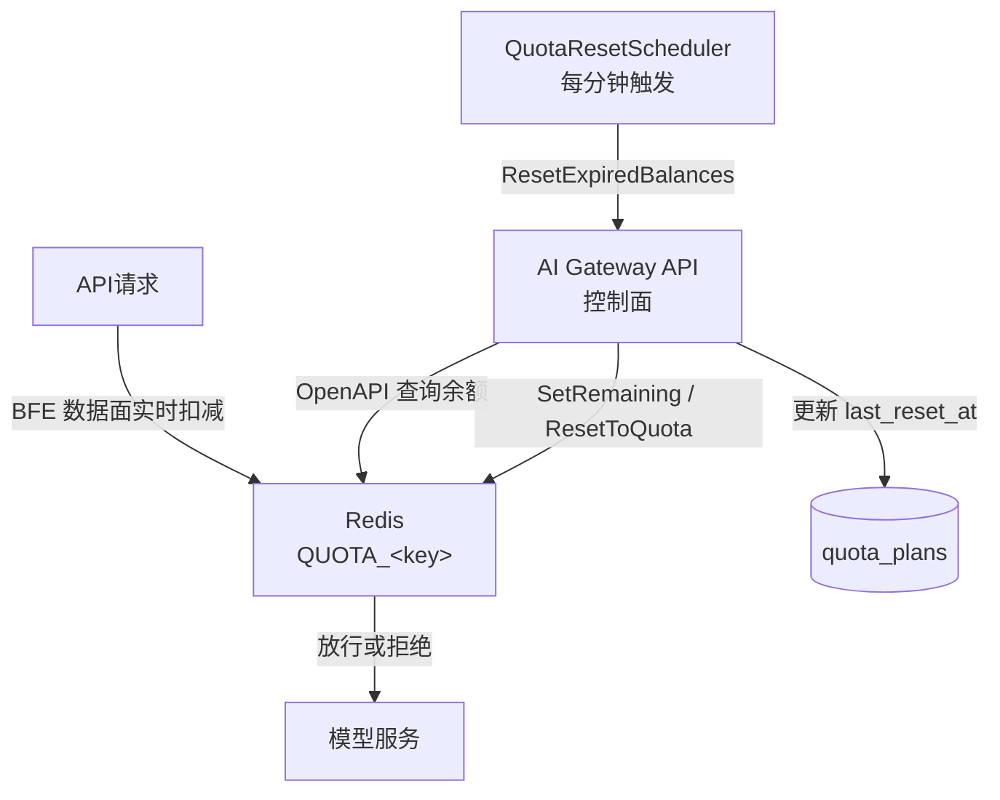
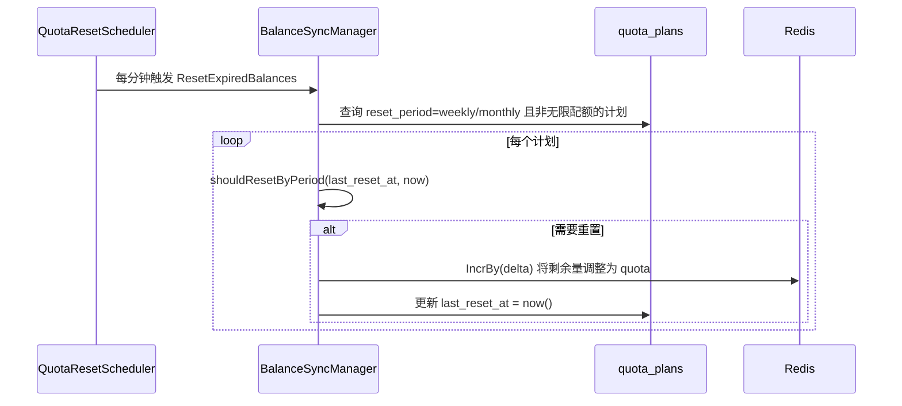
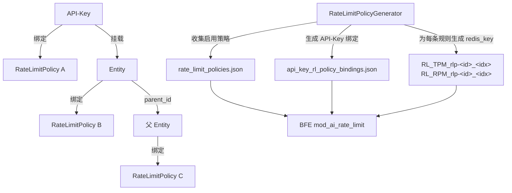
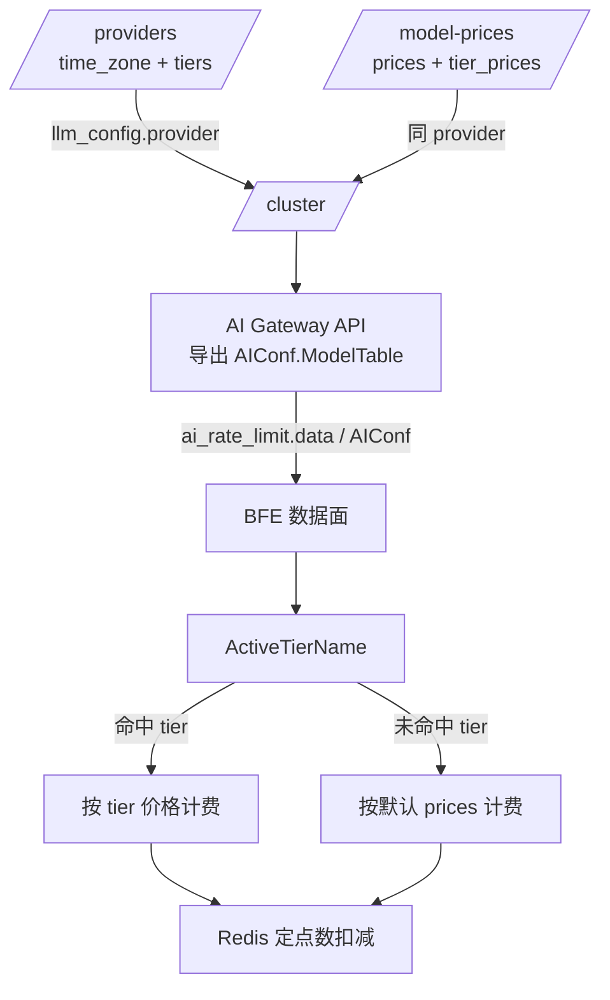

# 第十二章 配额与限流设计

## 本章目标

通过本章，读者将理解：

- 壬远AI网关如何通过 `QuotaPlan` 为 API-Key 与 Entity 分配 Token 或 RMB 两种单位的配额；
- 为什么把 **Redis** 作为配额余额的唯一真实来源，以及管理面如何在不维护冷数据副本的情况下查询实时余额；
- 自然周、自然月的周期重置逻辑，以及 `last_reset_at` 在重置边界判断中的作用；
- `RateLimitPolicy` 的 TPM、RPM、并发限制模型，以及策略如何按 Entity 层级向上合并并导出到 BFE；
- RMB 配额如何结合 Provider 时段模板与 Model 分时段价格实现高峰/空闲差异化计费；
- 典型的配额与限流配置示例。

---

## 为什么需要配额与限流

企业在统一接入大模型服务后，通常面临两类资源失控风险：

1. **预算失控**：某个业务团队或某个 API-Key 短期内消耗大量 Token 或产生高额费用，导致整体预算被击穿；
2. **流量失控**：突发请求淹没后端模型服务，造成延迟升高、错误率增加，甚至触发上游限流。

配额（Quota）解决的是"一共能用多少"的问题，限流（Rate Limit）解决的是"单位时间内能用多少"的问题。两者相辅相成：配额保证总体预算可控，限流保证瞬时流量平滑。壬远AI网关把配额计划与限流策略都绑定到 API-Key 或 Entity 上，使管理员能够按应用、按团队、按模型细粒度地控制资源使用。

---

## QuotaPlan 模型：total_token 与 RMB 两种单位

`QuotaPlan`（配额计划）是壬远AI网关中最基础的配额抽象。它既可以按 Token 总量计费，也可以按人民币金额计费，分别对应 `unit = total_token` 与 `unit = RMB`。

### 数据表结构

配额计划持久化在 `quota_plans` 表中，核心字段如下（完整定义见 `ai-gateway-api/design-docs/sys-design/details/配额余额同步机制.md`）：

```sql
CREATE TABLE `quota_plans` (
  `id` BIGINT NOT NULL AUTO_INCREMENT,
  `unlimited` TINYINT(1) DEFAULT 1,
  `pass_when_no_enough_quota` TINYINT(1) DEFAULT 0,
  `quota` DECIMAL(18,8) DEFAULT 0,
  `unit` VARCHAR(32) DEFAULT 'total_token',
  `reset_period` VARCHAR(16) DEFAULT 'never',
  `last_reset_at` DATETIME DEFAULT NULL,
  `created_at` DATETIME NOT NULL DEFAULT CURRENT_TIMESTAMP,
  `updated_at` DATETIME NOT NULL DEFAULT CURRENT_TIMESTAMP ON UPDATE CURRENT_TIMESTAMP,
  PRIMARY KEY (`id`),
  INDEX `idx_unlimited` (`unlimited`)
) ENGINE=InnoDB DEFAULT CHARSET=utf8mb4 COMMENT='配额计划表';
```

| 字段 | 说明 |
|------|------|
| `unlimited` | 是否为无限配额。`true` 时不执行配额检查，余额展示为 sentinel 值 `100000000`。 |
| `pass_when_no_enough_quota` | 配额不足时是否仍放行请求，常用于灰度或测试场景。 |
| `quota` | 配额总量。`total_token` 时存整数，`RMB` 时最多保留 8 位小数。 |
| `unit` | 配额单位，可选 `total_token` 或 `RMB`。 |
| `reset_period` | 重置周期，可选 `never`、`weekly`、`monthly`。 |
| `last_reset_at` | 上次重置时间，周期重置据此判断是否跨越自然周/月边界。 |

### 两种单位的适用场景

- **`total_token`**：适用于按 Token 计费的模型（如 OpenAI、Anthropic）。管理员可以直接限制每月可用的输入+输出 Token 总量。
- **`RMB`**：适用于需要把不同模型、不同价格统一折算为成本的场景。系统会根据请求消耗的 Token 和模型单价，实时折算为人民币并从余额中扣减。

### RMB 配额精度

为了避免浮点误差，`ai-gateway-api` 与 BFE 在 Redis 内部统一把 RMB 金额乘以 `1e8` 后转为定点整数存储；对外展示时统一按 4 位小数输出。例如 `0.0000015` 元在内部表示为 `150`，序列化时通过 `strconv.FormatFloat(v, 'f', -1, 64)` 强制使用十进制表示法，避免科学计数法导致可读性问题或中间层截断。

---

## Redis 作为余额唯一真实来源

### 核心矛盾

配额消耗发生在请求链路（BFE 数据面实时扣减），需要高并发、低延迟；而管理面（AI Gateway API）需要向 OpenAPI 展示 `used` / `remaining`，又希望数据实时、一致。

早期实现会维护一张 `quota_balances` 冷数据表，并通过定时任务把 Redis 中的剩余量回写到数据库。这种方案的问题在于：

- 定时同步存在延迟，OpenAPI 查到的余额不是实时值；
- 同步任务本身增加系统复杂度和出错概率；
- 周期重置时需要同时更新两张表，容易不一致。

### 新架构：Redis 唯一真实来源

当前架构废弃了 `quota_balances` 表，由 Redis 直接作为余额的唯一真实来源：

- Redis 存储当前剩余配额，请求链路直接读写；
- OpenAPI 查询余额时直接读取 Redis，不再维护冷数据副本；
- `last_reset_at` 只保存在 `quota_plans` 表中，周期重置只操作这一张表；
- 手动重置 / 周期重置时，同步更新 Redis 与 `quota_plans.last_reset_at`。



在该架构中，`QuotaCache` 接口（定义于 `ai-gateway-api/model/quotacache/quotacache.go`，实现于 `ai-gateway-api/model/quotacache/redis.go`）封装了对 Redis 的所有操作，包括 `GetRemaining`、`BatchGetRemaining`、`SetRemaining`、`ResetToQuota` 和 `DeleteKeys`。

### Redis Key 规则

Redis Key 由 `AIUsedQuotaKey` 生成（`ai-gateway-api/stateful/config_redis.go`）：

```go
func AIUsedQuotaKey(key string) string {
    return fmt.Sprintf("QUOTA_%s", key)
}
```

| 对象类型 | Redis Key 示例 | 说明 |
|----------|----------------|------|
| API-Key | `QUOTA_AI_ak-2v8x9k3m7p` | 以 API-Key 的实际 `key` 值作为后缀 |
| Entity | `QUOTA_entity-1` | 以 `entity_id` 作为后缀 |
| 值语义 | 当前剩余配额 | `total_token` 为整数，`RMB` 为 1e-8 元定点整数 |

Key 不再拼接 `KeyCreateAt` 时间戳，生命周期与 API-Key / Entity 保持一致，避免 Key 膨胀。API-Key 或 Entity 删除时，会调用 `DeleteKeys` 主动清理对应 Redis Key。

### 原子扣减与归零策略

无论是周期重置还是手动重置，系统都使用原子 `IncrBy(delta)` 而非 `SET 0`。原因如下：

- 并发场景下，`SET` 会覆盖其他请求刚刚扣减的计数，导致配额透支；
- `IncrBy(delta)` 基于当前值做增量调整，可与其他扣减操作串行化；
- Key 不存在时直接 `IncrBy(quotaTotal)` 即可完成初始化。

---

## 自然周/月重置与过期重置

### 周期重置策略

`QuotaPlan.reset_period` 支持三种取值：

- `never`：不自动重置；
- `weekly`：自然周，每周一 00:00:00 重置；
- `monthly`：自然月，每月 1 日 00:00:00 重置。

`QuotaResetScheduler`（`ai-gateway-api/model/quota/scheduler.go`）每分钟执行一次 `ResetExpiredBalances`，仅对需要重置的计划进行处理，不再执行旧实现中的全量同步。

### 重置边界判断

`BalanceSyncManager`（`ai-gateway-api/model/quota/balance_sync.go`）通过注入的 `Clock` 接口获取当前时间，再调用 `shouldResetByPeriod` 判断是否跨越周期边界：

```go
func (m *BalanceSyncManager) shouldResetByPeriod(
    lastResetAt *time.Time,
    resetPeriod string,
    now time.Time,
) bool {
    if lastResetAt == nil {
        return true
    }
    switch resetPeriod {
    case "weekly":
        return getWeekStart(now).After(getWeekStart(*lastResetAt))
    case "monthly":
        return getMonthStart(now).After(getMonthStart(*lastResetAt))
    }
    return false
}
```

`getWeekStart` 与 `getMonthStart` 将时间归一化为周一或每月 1 日的 00:00:00（本地时区）。由于判断基于周/月起始时间点的比较，即使调度器因故错过某个时刻，只要当前周期起始点晚于上次重置时的周期起始点，就会触发重置，具备自愈能力。

### 重置执行流程



### 手动重置接口

除了周期重置，系统还提供手动重置接口：

- `POST /api-keys/{id}/quota-plan/reset`
- `POST /entities/{id}/quota-plan/reset`

手动重置调用 `QuotaPlanManager.ResetBalance(..., updateLastResetAt=false)`，即只重置 Redis 余额，不更新 `last_reset_at`，避免干扰周期调度器对自然周/月的判断。若传入新的 `quota`，则同时更新 `quota_plans.quota`。

### 多实例部署说明

当前 `QuotaResetScheduler` 在每个 AI Gateway API 实例中独立启动。多实例部署时，所有实例都会尝试执行 `ResetExpiredBalances()`，存在重复重置的风险。由于重置基于 Redis 的 `IncrBy(delta)` 操作，重复执行通常不会导致数据错误（幂等），但会产生不必要的日志和 Redis 操作。后续如需严格避免重复执行，可引入 Redis 分布式锁或单实例调度器。

---

## RateLimitPolicy：TPM、RPM、并发限制

### 策略模型

`RateLimitPolicy`（限流策略）用于控制 API-Key 或 Entity 对后端 AI 模型的访问速率，支持三类限制：

- **TPM**（Tokens Per Minute）：每分钟 Token 消耗上限；
- **RPM**（Requests Per Minute）：每分钟请求次数上限；
- **并发数**（Max Concurrency）：同时处理的请求数上限。

策略持久化在 `rate_limit_policies` 表中（完整定义见 `ai-gateway-api/design-docs/sys-design/details/限流策略与导出.md`）：

```sql
CREATE TABLE rate_limit_policies (
    id BIGINT AUTO_INCREMENT PRIMARY KEY,
    name VARCHAR(255) NOT NULL,
    description VARCHAR(255) DEFAULT NULL,
    product_name VARCHAR(255) NOT NULL,
    enabled TINYINT(1) NOT NULL DEFAULT 1,
    max_concurrency INT DEFAULT NULL,
    tpm_configs JSON DEFAULT NULL,
    rpm_configs JSON DEFAULT NULL,
    create_time DATETIME NOT NULL DEFAULT CURRENT_TIMESTAMP,
    update_time DATETIME NOT NULL DEFAULT CURRENT_TIMESTAMP ON UPDATE CURRENT_TIMESTAMP
);
```

### TPM 与 RPM 规则结构

TPM 与 RPM 规则以 JSON 数组形式存储在 `tpm_configs` 与 `rpm_configs` 字段中：

```json
{
  "tpm_configs": [
    {
      "name": "tpm_gpt4",
      "model": "gpt-4",
      "window_minutes": 1,
      "max_tokens": 100000,
      "step_minutes": 1
    }
  ],
  "rpm_configs": [
    {
      "name": "rpm_gpt4",
      "model": "gpt-4",
      "window_minutes": 1,
      "max_requests": 1000,
      "burst": 1
    }
  ]
}
```

`model` 支持具体模型名或通配符 `*`，未命中具体模型时使用默认限制。`name` 在同一策略内唯一且创建后不可修改，是规则导出的稳定标识。

### 校验规则

`RateLimitPolicyManager` 在创建/更新时执行严格校验：

- `name` 在 `product_name` 内唯一；
- `max_concurrency` 必须 ≥ 0；
- 每条规则的 `name` 必填、非空、长度 1-128 字符，字符集限制为 `[a-zA-Z0-9_-]`；
- `name` 在同一策略内唯一且不可修改；
- `model` 不能为空，`limit` 必须 ≥ 0。

---

## 层级合并与导出

### 引用关系

API-Key 与 Entity 均通过 `rate_limit_policy_id` 字段引用限流策略：

| 维度 | 配额计划 | 限流策略 |
|------|----------|----------|
| 表 | `quota_plans` | `rate_limit_policies` |
| 引用字段 | `quota_plan_id` | `rate_limit_policy_id` |
| 层级合并 | 收集所有层级 QuotaPlan | 收集所有层级 Policy ID |
| 导出 Redis Key | `QUOTA_xxx` | `RL_TPM_rlp-<id>_<idx>` / `RL_RPM_rlp-<id>_<idx>` |
| 余额同步 | 有 | 无 |

### Entity 层级向上合并

导出时，`RateLimitPolicyGenerator`（`ai-gateway-api/model/rate_limit_policy/rate_limit_policy_manager.go`）对每个 API-Key 递归收集其自身及所有父 Entity 绑定的策略 ID：

```go
func (m *RateLimitPolicyManager) fetchEntityRateLimitPolicyIDs(ctx context.Context, entity *EntityParam) ([]int64, error) {
    policyIDs := make([]int64, 0)
    if entity.RateLimitPolicyID != nil {
        policyIDs = append(policyIDs, *entity.RateLimitPolicyID)
    }
    if entity.ParentID != nil && *entity.ParentID != "" {
        parent, err := m.entityStorager.FetchEntity(ctx, &EntityFilter{EntityID: entity.ParentID})
        if parent != nil {
            parentPolicyIDs, _ := m.fetchEntityRateLimitPolicyIDs(ctx, parent)
            policyIDs = append(policyIDs, parentPolicyIDs...)
        }
    }
    return policyIDs, nil
}
```

### 导出文件

导出结果写入两个文件：

- `rate_limit_policies.json`：所有启用状态的限流策略；
- `api_key_rl_policy_bindings.json`：API-Key 到策略的绑定关系。

导出的策略名称统一格式为 `rlp-<policy_id>`，避免命名冲突并便于 BFE 索引。只有 `enabled=true` 的策略才会被导出并生成绑定。

### Redis Key 稳定性

为了消除"改名/改 model 导致计数器重置"的问题，控制面在导出时为每条规则生成稳定的 Redis Key：

```go
RedisKey: fmt.Sprintf("RL_RPM_rlp-%d_%d", policyID, idx)
RedisKey: fmt.Sprintf("RL_TPM_rlp-%d_%d", policyID, idx)
```

Key 基于不会随用户编辑而变化的 `(policy_id, rule_index)`，因此修改规则名或 `model` 不会重置计数器。BFE 侧优先使用配置中的 `redis_key` 构建 Redis Key；对旧配置保留按规则名兜底的兼容逻辑。



### BFE 侧预期行为

BFE 收到配置后：

1. 根据 `api_key_rl_policy_bindings.json` 找到 API-Key 对应的策略列表；
2. 请求到达时，按模型匹配 `rules.tpm` / `rules.rpm` 中的规则，优先匹配具体模型名，未命中时使用 `*` 默认限制；
3. 命中规则后，使用规则中的 `redis_key` 构建 Redis 计数器 key 进行限流检查；
4. 同时检查 `max_concurrency`；
5. 任一限制超出时返回 429 Too Many Requests。

---

## RMB 配额分时段定价

### 背景

随着 DeepSeek 等模型提供商采用"高峰 / 空闲"分时段定价策略，BFE RMB 配额扣费需要具备按请求发生时刻匹配不同价格的能力。壬远AI网关把时段模板放在 `/providers`，把分时段价格放在 `/model-prices`，实现 Provider 与价格的分离管理。

### 核心概念

| 概念 | 说明 |
|------|------|
| **Tier** | 按时间维度划分的价格层级，如 `peak`（高峰）。 |
| **TimeRange** | 一个时段定义，包含 `weekdays`（0=周日）、`start` / `end`（HH:MM，左闭右开）。 |
| **Provider 时段模板** | 定义在 `/providers` 上的 `time_zone` 和 `tiers`，同一 provider 下所有模型共享。 |
| **Model tier 价格** | 定义在 `/model-prices` 上的 `tier_prices`，描述某个模型在某个 tier 下的价格。 |

### 配置归属与下发链路



多个 cluster 引用同一个 provider 时，会各自得到一份相同的 `ModelTable` 数据；provider 的时段规则变更后，所有引用它的 cluster 在下一次配置导出时自动生效。

### BFE ModelTable 结构

导出后的 `AIConf.ModelTable` 结构如下（定义于 BFE 侧相关配置加载代码）：

```go
type ModelTable struct {
    Currency string      // 固定 "RMB"
    TimeZone string      // 默认 "Asia/Shanghai"
    Tiers    []PriceTier // 时段定义
    Models   []ModelPrice
}

type PriceTier struct {
    Name       string
    TimeRanges []TimeRange
}

type ModelPrice struct {
    Provider   string
    Model      string
    Prices     PriceMap     // 默认价格
    TierPrices TierPriceMap // tier name -> 价格表
}
```

### 运行时时段匹配

BFE 加载阶段解析 `TimeZone` 并校验 `Tiers`，运行时使用 `ActiveTierName` 根据请求发生时刻匹配 tier：

```go
func (table *ModelTable) ActiveTierName(now time.Time) string {
    if table == nil || len(table.Tiers) == 0 {
        return ""
    }
    t := now.In(table.tz)
    wd := int(t.Weekday())
    hour, min := t.Hour(), t.Minute()
    cur := hour*60 + min

    for i := range table.Tiers {
        tier := &table.Tiers[i]
        for _, tr := range tier.TimeRanges {
            if len(tr.Weekdays) > 0 && !containsInt(tr.Weekdays, wd) {
                continue
            }
            start := parseHHMM(tr.Start)
            end := parseHHMM(tr.End)
            if start <= cur && cur < end {
                return tier.Name
            }
        }
    }
    return ""
}
```

命中 tier 且该 tier 配置了对应价格键时，使用 tier 价格；否则 fallback 到默认 `Prices`。时间区间左闭右开，跨午夜需拆成两段。

### 向后兼容

- `/providers` 不填 `time_zone` / `tiers` 时，`ModelTable.TimeZone` / `Tiers` 为空，行为与固定价格一致；
- `/model-prices` 不填 `tier_prices` 时，按默认 `Prices` 计费；
- 命中 tier 但该 tier 未配置某个价格键时，自动 fallback 到默认 `Prices` 中的对应键；
- `TokenUsage.UsedCost`、Lua 扣减逻辑、Redis 定点数存储均不需要修改。

---

## 配额与限流配置示例

### QuotaPlan 示例

以下是一个按月重置、总量为 1 亿 Token 的配额计划：

```json
{
  "quota_plan": {
    "unlimited": false,
    "pass_when_no_enough_quota": false,
    "quota": 100000000,
    "unit": "total_token",
    "reset_period": "monthly",
    "balance": {
      "used": 50000000,
      "remaining": 50000000
    }
  }
}
```

以下是一个按 RMB 计费、每月 5000 元预算的配额计划：

```json
{
  "quota_plan": {
    "unlimited": false,
    "pass_when_no_enough_quota": false,
    "quota": 5000.00,
    "unit": "RMB",
    "reset_period": "monthly",
    "balance": {
      "used": 1234.56,
      "remaining": 3765.44
    }
  }
}
```

### RateLimitPolicy 示例

以下是一个限制 gpt-4 模型 TPM/RPM 并设置最大并发为 50 的策略：

```json
{
  "rate_limit_policy": {
    "enabled": true,
    "rules": {
      "tpm": [
        {
          "name": "tpm_gpt4",
          "model": "gpt-4",
          "window_minutes": 1,
          "max_tokens": 100000,
          "step_minutes": 1
        },
        {
          "name": "tpm_default",
          "model": "*",
          "window_minutes": 1,
          "max_tokens": 500000,
          "step_minutes": 1
        }
      ],
      "rpm": [
        {
          "name": "rpm_gpt4",
          "model": "gpt-4",
          "window_minutes": 1,
          "max_requests": 1000,
          "burst": 1
        },
        {
          "name": "rpm_default",
          "model": "*",
          "window_minutes": 1,
          "max_requests": 5000,
          "burst": 1
        }
      ],
      "max_concurrency": 50
    }
  }
}
```

### RMB 分时段定价示例

Provider 时段模板：

```json
{
  "name": "deepseek",
  "time_zone": "Asia/Shanghai",
  "tiers": [
    {
      "name": "peak",
      "time_ranges": [
        { "weekdays": [1, 2, 3, 4, 5], "start": "09:00", "end": "12:00" },
        { "weekdays": [1, 2, 3, 4, 5], "start": "14:00", "end": "18:00" }
      ]
    }
  ]
}
```

Model 价格：

```json
{
  "provider": "deepseek",
  "model": "deepseek-v4-pro",
  "mode": "chat",
  "prices": {
    "input_cost_per_token": 0.000001,
    "output_cost_per_token": 0.000002,
    "cache_read_input_token_cost": 0.0000005
  },
  "tier_prices": {
    "peak": {
      "input_cost_per_token": 0.000002,
      "output_cost_per_token": 0.000004,
      "cache_read_input_token_cost": 0.000001
    }
  }
}
```

---

## 本章小结

- `QuotaPlan` 支持 `total_token` 与 `RMB` 两种配额单位，分别适用于按 Token 计费和按成本计费场景。RMB 配额在 Redis 内部以 1e-8 元定点整数存储，对外统一按 4 位小数展示。
- Redis 是配额余额的唯一真实来源，OpenAPI 查询直接读取 Redis，不再维护 `quota_balances` 冷数据表；周期重置与手动重置都通过原子 `IncrBy(delta)` 完成，避免并发覆盖。
- 周期重置支持 `weekly`（每周一）和 `monthly`（每月 1 日），由 `QuotaResetScheduler` 每分钟触发，基于 `last_reset_at` 判断周期边界；手动重置不更新 `last_reset_at`，避免干扰周期调度。
- `RateLimitPolicy` 提供 TPM、RPM、并发数三类限制，规则支持具体模型名或 `*` 默认匹配；导出时按 Entity 层级向上合并，生成 `rate_limit_policies.json` 与 `api_key_rl_policy_bindings.json`。
- 控制面为每条 TPM/RPM 规则生成稳定的 Redis Key（`RL_TPM_rlp-<id>_<idx>` / `RL_RPM_rlp-<id>_<idx>`），修改规则名或 `model` 不会导致计数器重置。
- RMB 配额支持分时段定价：Provider 维护 `time_zone` 与 `tiers`，Model 维护 `tier_prices`，导出后由 BFE 根据请求时刻匹配 tier 并选择对应价格，未命中时 fallback 到默认价格。

---

## 参考文档

- `ai-gateway-api/design-docs/sys-design/details/配额余额同步机制.md`
- `ai-gateway-api/design-docs/sys-design/details/限流策略与导出.md`
- `ai-gateway-api/design-docs/sys-design/details/RMB配额分时段定价.md`
- `ai-gateway-api/design-docs/api-define/OpenAPI接口定义/api-keys.md`
- `bfe/docs/zh_cn/sys_design/ai_rate_limit_redis_key.md`
- `ai-gateway-api/model/quotacache/quotacache.go`
- `ai-gateway-api/model/quotacache/redis.go`
- `ai-gateway-api/model/quota/balance_sync.go`
- `ai-gateway-api/model/quota/scheduler.go`
- `ai-gateway-api/model/rate_limit_policy/rate_limit_policy.go`
- `ai-gateway-api/model/rate_limit_policy/rate_limit_policy_manager.go`
- `bfe/bfe_modules/mod_ai_rate_limit/data_load.go`
- `bfe/bfe_modules/mod_ai_rate_limit/policy_limiter.go`
