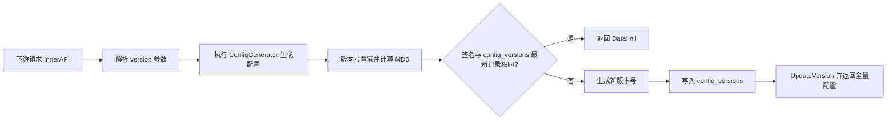

# 第十四章 配置导出与版本控制设计

## 本章目标

通过本章，读者将理解：

- 壬远AI网关如何通过 InnerAPI 向数据面暴露运行时配置；
- `VersionControlManager` 如何利用 MD5 签名与版本号实现增量同步；
- `config_versions` 表在版本控制中的作用，以及下游如何基于该表判断配置是否变化；
- 九类配置导出主题各自的职责与导出格式；
- `mod-api-key` 导出时采用的批量预加载与内存回溯优化手段；
- Conf Agent 如何拉取配置并与 BFE 热加载机制衔接；
- 一条配置从数据库到 BFE 生效的完整链路。

---

## InnerAPI 的配置导出机制

AI Gateway API 除了面向管理员的管理面 OpenAPI（`/open-api/v1`）之外，还提供了一组面向数据面的 **InnerAPI**（路由前缀 `/inner-api/v1`）。BFE、Conf Agent 等下游组件通过这组只读接口拉取运行时配置，因此 InnerAPI 也被称为控制面与数据面之间的配置同步协议。

InnerAPI 具有以下特点：

- **只读导出**：所有接口均为 `GET`，用于批量导出 BFE 可消费的配置结构；
- **按主题组织**：每个接口对应一个配置主题（Topic），例如 `route_rule`、`mod_api_key_rule`、`ai_route` 等；
- **版本控制**：每次导出计算配置数据的 MD5 签名，并与历史签名比较；若未变化则返回空响应，避免重复下发；
- **鉴权**：调用方需携带 Token，由 McUserProbe 中间件完成身份校验。

InnerAPI 与 OpenAPI 的对比如 `ai-gateway-api/design-docs/api-define/InnerAPI接口定义/00-overview.md` 所述：OpenAPI 面向管理操作，数据粒度为单个资源；InnerAPI 面向数据面同步，数据粒度为批量配置导出。

配置导出的入口是 `model/iversion_control/version_control.go` 中定义的 `VersionControlManager`，它为每个主题提供统一的导出框架，而具体的配置生成逻辑由各自的 `ConfigGenerator` 回调实现。

---

## VersionControlManager 的 MD5 签名与版本号

`VersionControlManager` 是配置导出的核心协调器，其结构定义如下：

```go
type VersionControlManager struct {
    storager VersionControlStorager
    txn      itxn.TxnStorager
}

func (vcm *VersionControlManager) ExportConfig(
    ctx context.Context,
    configTopic string,
    generator ConfigGenerator,
) (*ExportData, error)
```

其中 `ConfigGenerator` 是由各业务模块提供的配置生成函数：

```go
type ConfigGenerator func(ctx context.Context) (*ExportData, error)
```

导出的结果包装在 `ExportData` 中：

```go
type ExportData struct {
    Topic                  string
    DataWithoutVersion     VersionValuable
    version                string
    DataSignWithoutVersion string
}
```

各字段含义如下：

- `Topic`：配置主题，对应 `config_versions.name`；
- `DataWithoutVersion`：最终返回给下游的配置结构体，需实现 `UpdateVersion(version string) error`；
- `DataSignWithoutVersion`：对配置数据（版本号置零后）计算的 MD5 签名；
- `version`：由版本控制管理器写入的实际版本号。

签名的计算逻辑位于 `model/iversion_control/version_control.go`：

```go
func Sign(data interface{}) (string, error) {
    bs, err := json.Marshal(data)
    if err != nil {
        return "", err
    }
    return fmt.Sprintf("%x", md5.Sum(bs)), nil
}

func Version(t time.Time) string {
    return t.Format("20060102150405")
}

var ZeroVersion = Version(time.Time{})
```

在计算签名前，系统会先把配置结构体中的版本号字段替换为 `ZeroVersion`（即 `"00010101000000"`）。这样即使版本号本身发生变化，只要配置内容不变，签名就保持不变，从而避免无意义的配置下发。

版本号采用时间戳格式 `YYYYMMDDHHMMSS`，由 `VersionControlManager` 在发现签名变化时生成。由于版本号基于当前时间，新的配置必然伴随新的版本号，下游可以安全地以版本号作为配置是否变化的唯一标识。

---

## config_versions 表与增量同步

`config_versions` 表是持久化配置版本信息的载体，其字段含义如下：

| 字段        | 说明                              |
|-------------|-----------------------------------|
| `id`        | 自增主键                          |
| `name`      | 配置主题（Topic）                 |
| `data_sign` | 配置数据（去版本号后）的 MD5 签名 |
| `version`   | 签名对应的版本号                  |

同一 Topic 下可以存在多条记录，按时间顺序递增。`VersionControlStorager.UpsertConfigLastExportedVersion` 的行为是：

- 如果当前签名在表中已存在，则返回该签名对应的版本号；
- 如果当前签名不存在，则插入一条新记录，并生成新的版本号。

下游组件通过携带 `version` 查询参数实现增量同步。请求示例如下：

```http
GET /inner-api/v1/configs/mod-api-key?version=20260101120000
Authorization: Token <token>
```

响应分为两种情况。当配置未变化时：

```json
{
  "ErrNum": 200,
  "ErrMsg": "success",
  "Data": null
}
```

当配置发生变化时：

```json
{
  "ErrNum": 200,
  "ErrMsg": "success",
  "Data": {
    "version": "20260102120000",
    "config": {...},
    "QuotaPlans": {...},
    "tokens": {...}
  }
}
```

增量同步的工作流程如下图所示。



这种机制的好处是：

- 下游首次拉取时不传 `version` 或传空，可获取全量配置与当前版本号；
- 后续定时拉取时携带上一次返回的 `version`，若配置未变化则直接跳过更新；
- 控制面无需主动推送，天然适应跨网络区域的部署场景。

---

## 九类配置导出主题

InnerAPI 当前共导出九类配置主题，详细信息见 `ai-gateway-api/design-docs/sys-design/details/InnerAPI配置导出与版本控制.md`。它们分别对应 BFE 的不同模块或配置文件：

| 接口路径                                 | 对应 Manager                | 配置主题              | 说明                                            |
|------------------------------------------|-----------------------------|-----------------------|-------------------------------------------------|
| `/configs/tls_conf/server_data_conf`     | `RouteRuleManager`          | `route_rule`          | 域名、基础/高级路由规则、集群配置               |
| `/configs/gslb_data/gslb`                | `ClusterManager`            | `gslb.<bfe_cluster>`  | GSLB 调度配置，依赖 `bfe_cluster` 参数          |
| `/configs/gslb_data/cluster_table`       | `ClusterManager`            | `cluster_table`       | 集群表，即后端实例列表                          |
| `/configs/protocol/server_cert_conf`     | `CertificateManager`        | `certificate`         | TLS 证书配置                                    |
| `/configs/extra_files/{filename}`        | `ExtraFileManager`          | 无                    | 附加文件原始内容，不参与版本控制                |
| `/configs/mod-api-key`                   | `APIKeyRuleManager`         | `mod_api_key_rule`    | API-Key 校验规则与配额计划                      |
| `/configs/mod-body-process`              | `ModBodyProcessManager`     | `mod_body_process`    | 请求体处理模块配置                              |
| `/configs/rate-limit-policy`             | `RateLimitPolicyManager`    | `mod_ai_rate_limit`   | 限流策略配置                                    |
| `/configs/ai-route`                      | `AIRouteExporter`           | `ai_route`            | AI 路由规则与绑定关系                           |

其中 `gslb.<bfe_cluster>` 因为依赖 BFE 集群名参数，不同 BFE 集群拥有独立的版本线；`extra_files` 按文件名原样返回内容，不走版本控制流程。

### Server Data

`route_rule` 主题导出 BFE 的 Server Data 配置，由 `model/iroute_conf/exporter.go` 实现。导出结构体包含：

```go
type RouteRuleExportData struct {
    Version     string
    HostTable   *host_rule_conf.HostTableConf
    RouteTable  *route_rule_conf.RouteTableFile
    ClusterConf *cluster_conf.BfeClusterConf
}
```

生成流程为：查询所有 `domains`、`clusters`、`products`，组装成 HostTable、RouteTable 和 ClusterConf，再调用 `VersionControlManager.ExportConfig`。当 Cluster 配置了 `llm_config` 时，导出的 `ClusterConf.Config.<cluster_name>.AIConf` 会包含模型映射、认证密钥、模型定价表、协议风格列表以及 Key 亲和性策略，供 BFE 的 AI 转发模块消费。

### GSLB 与 Cluster Table

`gslb.<bfe_cluster>` 与 `cluster_table` 由 `model/icluster_conf/exporter.go` 实现。`gslb` 根据请求的 `bfe_cluster` 参数返回对应集群的调度矩阵；`cluster_table` 导出所有集群的后端实例，其中 IPv6 地址会自动用 `[]` 包裹，实例 `Weight=0` 表示不接收流量。

### Server Cert

`certificate` 主题由 `model/iprotocol/exporter.go` 实现。导出时将所有证书/密钥文件路径写入配置，并在 `UpdateVersion` 时对路径做版本化替换（例如 `tls_conf_<version>/...`），便于 BFE 按版本加载。

### mod-api-key、mod-body-process、rate-limit-policy、ai-route

这四个主题面向 BFE 的 AI 专用模块，导出逻辑集中在 `model/imods/` 与 `model/rate_limit_policy/` 下。其中 `mod-api-key` 的配置量最大、关联关系最复杂，因此采用了专门的性能优化，将在下一节详细说明。

---

## mod-api-key 批量预加载与内存回溯优化

`mod-api-key` 主题导出 BFE `mod_ai_token_auth` 模块所需的全部 API-Key 规则、配额计划与 Token 列表。该主题的数据特点是：需要跨越多张表（`api_keys`、`entities`、`quota_plans`、`entity_types` 等）并沿 Entity 层级向上回溯。

如果每次导出都按 API-Key 逐条查询其 Entity 祖先与配额计划，会产生严重的 N+1 查询问题。为此，`model/imods/mod_api_key_rule.go` 采用了以下优化策略：

1. **批量预加载**：一次性加载全部 `api_keys`、`entities`、`quota_plans`、`entity_types` 到内存索引（Map）中，避免逐条查询数据库；
2. **内存回溯**：在内存 Map 中沿 `parent_id` 回溯 Entity 层级，计算 `allow_models` 的交集与 `block_models` 的并集；
3. **跳过 unlimited 配额计划**：收集 API-Key 自身及 Entity 层级向上的配额计划时，跳过 `unlimited=true` 的计划，减少导出体积；
4. **TagLevel 补充**：为每个 Entity 标签从内存 Map 中读取对应 `EntityType.Level`，直接填充到 `TokenFile`。

导出结构体如下：

```go
type ModAPIKeyRuleConf struct {
    Version    *string                            `json:"version"`
    Config     map[string][]*TokenRuleFile        `json:"config"`
    QuotaPlans map[string][]*QuotaPlan            `json:"QuotaPlans"`
    Tokens     map[string]map[string]*TokenFile   `json:"tokens"`
}
```

生成流程的关键步骤为：

1. 构造 AI 路由对应的 API-Key 规则；
2. 批量预加载全部相关表到内存 Map；
3. 遍历所有 `api_keys`，为每个 key 生成 `TokenFile`；
4. 根据 API-Key 的 `enabled` 字段与 Entity 层级的 `allow_models` 交集结果，确定导出的 `enabled` 布尔值；
5. 合并 Entity 层级的 `allow_models`（交集）与 `block_models`（并集）；
6. 收集向上的配额计划，跳过 `unlimited=true` 的计划；
7. 输出 `QuotaPlans`、`Tokens` 与 `Config`。

`expired`/`exhausted` 等运行时状态不再由导出层计算，而是由 BFE 根据 `expired_time` 和实时 Redis 配额余额自行判断。这样既减轻了控制面导出压力，也保证了状态判定的实时性。

---

## Conf Agent 拉取与 BFE 热加载的衔接

Conf Agent 是部署在 BFE 侧的 Sidecar 组件，负责将 InnerAPI 导出的配置转换为 BFE 可加载的本地文件，并在配置变化时触发 BFE 热加载。其整体流程见 `conf-agent/AGENTS.md`。

每个配置主题对应一个 `Reloader`，每个 `Reloader` 内部包含三个子模块：

- **prober**（`conf_reload/prober/`）：定期轮询 AI Gateway API 的 InnerAPI，比较本地版本号与远程版本号；
- **file_store**（`conf_reload/file_store/`）：将新配置写入临时版本目录，通过 Symlink 原子切换到 `mod_{name}`，并按 `VersionKeepCount` 清理旧版本；
- **trigger**（`conf_reload/trigger/`）：调用 BFE `/reload/{module}` 监控端口接口完成热加载。

Conf Agent 到 BFE 的配置生效链路如下图所示。

```mermaid
flowchart LR
    A[Conf Agent prober] -->|GET /inner-api/v1/configs/xxx?version=...| B[AI Gateway API InnerAPI]
    B --> C{版本是否变化?}
    C -- 无变化 --> D[返回 Data: null]
    C -- 有变化 --> E[返回新配置 + 新版本]
    E --> F[file_store 写入新版本目录]
    F --> G[切换 symlink mod_xxx]
    G --> H[trigger 调用 BFE /reload/{module}]
    H --> I[BFE 热加载生效]
```

这种拉取式设计的优点在于：

- 控制面无需感知数据面节点数量，降低了耦合；
- BFE 在控制面短暂不可用时仍可使用本地缓存配置继续转发；
- Symlink 切换保证配置文件替换的原子性，避免 BFE 加载到半截文件；
- 版本目录保留一定数量的历史版本，便于故障时快速回滚。

具体而言，`file_store` 会为新版本配置分配独立的目录（目录名通常包含版本号），写入完成后再原子地修改 `mod_{name}` 软链接指向该目录。BFE 始终通过软链接读取配置，因此新旧版本的切换对运行中的转发进程是透明的。若新配置加载后出现问题，运维人员可直接将软链接指向上一个版本目录并再次触发重载，无需重新从控制面拉取数据。

---

## 配置导出示例

下面以 `mod-api-key` 主题为例，展示一次完整的增量同步过程。

首次拉取时，Conf Agent 不传 `version` 参数：

```http
GET /inner-api/v1/configs/mod-api-key HTTP/1.1
Authorization: Token <token>
```

返回全量配置：

```json
{
  "ErrNum": 200,
  "ErrMsg": "success",
  "Data": {
    "version": "20260101120000",
    "config": {
      "default": [
        {
          "cond": "req_host_in(\"api.example.com\")",
          "actions": [
            {
              "cmd": "CHECK_API_KEY",
              "params": ["default"]
            }
          ]
        }
      ]
    },
    "QuotaPlans": {
      "plan_basic": [
        {"metric": "token", "interval": 86400, "limit": 1000000}
      ]
    },
    "tokens": {
      "default": {
        "sk-abc123": {
          "enabled": true,
          "expired_time": "2026-12-31T23:59:59+08:00",
          "quota_plans": ["plan_basic"],
          "allow_models": ["gpt-4o", "deepseek-chat"],
          "block_models": [],
          "tags": [{"tag": "team-a", "tag_level": 2}]
        }
      }
    }
  }
}
```

后续拉取时携带上一次返回的版本号：

```http
GET /inner-api/v1/configs/mod-api-key?version=20260101120000 HTTP/1.1
Authorization: Token <token>
```

如果配置未发生变化，返回：

```json
{
  "ErrNum": 200,
  "ErrMsg": "success",
  "Data": null
}
```

Conf Agent 接收到 `Data: null` 后跳过本次写入与热加载；当管理员通过 Dashboard 修改了 API-Key 配额后，下一次拉取将返回包含新 `version` 的全量配置，Conf Agent 再触发 BFE 热加载。

---

## 本章小结

- InnerAPI 是控制面向数据面暴露运行时配置的只读接口，路径前缀为 `/inner-api/v1`；
- `VersionControlManager` 为每个配置主题统一完成 MD5 签名计算与版本号生成，签名计算前会先将版本号置零，避免版本号变化干扰内容比较；
- `config_versions` 表按主题记录配置签名与版本号的映射关系，是增量同步的依据；
- 当前 InnerAPI 共导出九类配置主题，分别对应 BFE 的 Server Data、GSLB、Cluster Table、证书、附加文件、`mod_ai_token_auth`、`mod_body_process`、`mod_ai_rate_limit` 与 `mod_ai_route`；
- `mod-api-key` 通过批量预加载与内存回溯优化，解决了跨表查询与 Entity 层级回溯带来的性能问题；
- Conf Agent 以拉取方式获取配置，通过版本目录、Symlink 切换与 BFE `/reload/{module}` 接口完成配置热加载；
- 拉取式设计使控制面与数据面解耦，支持跨网络区域部署与快速故障恢复。

---

## 参考文档

- `ai-gateway-api/design-docs/sys-design/details/InnerAPI配置导出与版本控制.md`
- `ai-gateway-api/design-docs/api-define/InnerAPI接口定义/README.md`
- `ai-gateway-api/design-docs/api-define/InnerAPI接口定义/00-overview.md`
- `conf-agent/AGENTS.md`
