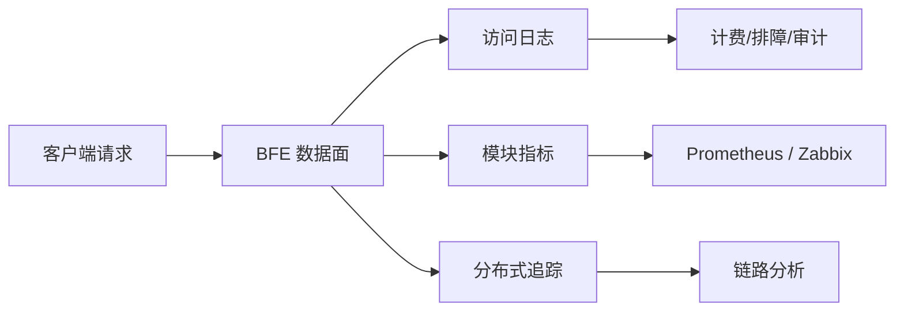

# 第十五章 可观测性设计

## 本章目标

AI 网关承接大量大模型调用流量，请求链路涉及认证、路由、限流、配额扣减、上游转发、流式响应等多个阶段。任何一个环节出现异常，都可能影响下游业务并带来计费争议。本章将介绍壬远 AI 网关的可观测性体系，帮助读者理解以下问题：

- 可观测性的三个支柱（日志、指标、追踪）如何在 AI 网关中落地；
- BFE 数据面访问日志中包含哪些 AI 专属字段，以及这些字段的采集链路；
- 应当关注哪些关键监控指标，覆盖路由命中、配额命中、限流触发等场景；
- 如何将 BFE 与 Prometheus、Zabbix 等监控系统集成；
- AI 网关错误码体系的分类与排查思路；
- 基于日志与指标的告警配置建议；
- 报表系统的两种部署形态（轻量形态与标准形态）及其数据链路差异；
- 内置报表查询 API（`/report/*`）的功能与关键设计（查询层抽象、分钟聚合、分区管理、双后端一致性）。

阅读本章后，读者应能独立完成 AI 网关可观测性方案的规划、配置与日常排障。

## 可观测性的三个支柱

业界通常将可观测性（Observability）拆分为三个支柱：日志（Logs）、指标（Metrics）和追踪（Traces）。壬远 AI 网关在数据面（BFE）与控制面（AI Gateway API）均对这三者做了针对性设计。

### 日志（Logs）

日志用于记录每个请求的完整生命周期。BFE 数据面通过访问日志（Access Log）输出请求在认证、路由、转发、计费各阶段的关键信息，支持下游进行故障排查、计费对账和安全审计。AI 专属字段统一占用 `bfe-access-pb` 协议的 701-900 编号区间，当前已定义 29 个字段，详见 [BFE AI 访问日志可观测字段设计](../bfe/docs/zh_cn/sys_design/ai_access_log_fields.md)。

### 指标（Metrics）

指标用于量化系统运行状态，支持趋势分析和阈值告警。BFE 各 AI 模块会暴露计数器类监控项，例如 `REQ_TOTAL`（请求总数）、`REQ_HIT_APIKEY`（命中 apikey 路由的请求数）、`REQ_HIT_ENTITY`（命中 entity 路由的请求数）等。这些指标可通过 BFE 内置监控接口被 Prometheus、Zabbix 等系统采集。

### 追踪（Traces）

追踪用于刻画请求在分布式系统中的完整调用路径。虽然当前 BFE 访问日志已经记录了 `ai_cluster_key_names` 等字段来反映请求尝试过的 cluster 与 key，但对于需要跨服务定位延迟瓶颈的场景，建议结合 OpenTelemetry 等分布式追踪框架做扩展。追踪可与日志、指标互补，形成三维立体的可观测能力。



## BFE 访问日志字段与 AI 专属字段

BFE 作为 AI 网关时，访问日志不再只包含传统的 HTTP 字段（如状态码、响应大小、耗时），还会附加一系列 AI 专属字段。这些字段由 `bfe_basic.Request` 中的 AI 上下文承载，最终由 `mod_access_pb3` 统一组装输出。

### 字段编号规划

AI 可观测字段统一占用 `bfe-access-pb` 的 701-900 编号区间，按用途划分为多个子区间：

| 编号区间 | 用途 |
|----------|------|
| 701 - 713 | 已投入使用字段，如 API Key 标识、模型名、Token 数、限流命中等 |
| 714 - 760 | 模型与请求基础信息，如 provider、protocol、stream、retry、cache 等 |
| 761 - 800 | Token 与成本计量，包括普通 token/cost 及 cache/audio/image/video 子项 |
| 801 - 840 | 路由、转换与插件，如路由规则命中、cluster/key 尝试列表 |
| 841 - 880 | 安全、合规与隐私，如命中/拒绝的 Quota Plan ID |
| 881 - 900 | 厂商扩展与预留 |

### 核心 AI 访问日志字段

下表列举了日常排障与计费对账中最常用的一批字段：

| 字段名 | 编号 | 类型 | 说明 | 采集模块 |
|--------|------|------|------|----------|
| `ai_apikey_id` | 701 | string | API Key 内部标识（`key_id`），不记录原始 key 值 | `mod_ai_token_auth` |
| `ai_apikeytags` | 702 | repeated | API Key 关联的 Entity 层级标签 | `mod_ai_token_auth` |
| `ai_requested_model` | 703 | string | 客户端请求原始模型名 | `bfe_server/http_conn.go` |
| `ai_target_model` | 704 | string | 网关实际路由/映射后的目标模型名 | `bfe_server/reverseproxy.go` |
| `ai_stream` | 705 | bool | 是否为流式响应 | `bfe_basic.Request.IsSse` |
| `ai_input_tokens` | 706 | int64 | 输入 Token 数 | `mod_ai_token_auth` / `mod_body_process` |
| `ai_output_tokens` | 707 | int64 | 输出 Token 数 | `mod_ai_token_auth` / `mod_body_process` |
| `ai_total_tokens` | 708 | int64 | 总 Token 消耗 | `mod_ai_token_auth` |
| `ai_ttft_us` | 709 | int64 | 首 Token 延迟（微秒），仅流式 | `mod_body_process` |
| `ai_tpot_us` | 710 | int64 | 平均输出 Token 延迟（微秒），仅流式 | `mod_body_process` |
| `ai_rate_limit_hits` | 711 | repeated | 触发的限流策略列表 | `mod_ai_rate_limit` |
| `ai_auth_reject_reason` | 712 | string | 鉴权拒绝原因 | `mod_ai_token_auth` |
| `ai_auth_reject_quota_plans` | 713 | repeated | 拒绝时余额不足的 Quota Plan ID 列表 | `mod_ai_token_auth` |
| `ai_provider` | 714 | string | 上游模型提供商标识 | `bfe_server/reverseproxy.go` |
| `ai_retry_count` | 715 | uint32 | 模型调用层 key-level 重试次数 | `bfe_server/reverseproxy.go` |
| `ai_mode` | 716 | string | AI 请求模式，如 `chat`、`image_generation` | `bfe_server/http_conn.go` |
| `ai_protocol` | 717 | string | AI 协议/认证风格，如 `openai`、`anthropic` | `bfe_basic.GetApiKey` / `bfe_server/reverseproxy.go` |
| `ai_cost_value` | 761 | int64 | 估算成本（定点整数，RMB 精度为 1e-8 元） | `mod_ai_token_auth` |
| `ai_cost_currency` | 762 | string | 成本币种，如 `RMB` / `USD` | `bfe_server/reverseproxy.go` |
| `ai_route_rule_hits` | 801 | repeated | 命中的 AI 路由规则列表 | `mod_ai_route` |
| `ai_cluster_key_names` | 802 | repeated | 请求处理过程中尝试过的 (cluster, key) 列表 | `bfe_server/reverseproxy.go` |
| `ai_auth_hit_quota_plans` | 841 | repeated | 正常请求时命中的 Quota Plan ID 列表 | `mod_ai_token_auth` |

需要特别强调的是，访问日志中的 `ai_apikey_id` 只记录 API Key 的内部标识，不会记录原始 key 值，从而避免敏感信息泄露。原始 key 仍保留在内存中用于向上游注入，但不会被写入日志。

除上表列出的核心字段外，761-800 区间的 781-790 子段用于计量拆分项，覆盖缓存、音频、图像与视频生成场景：

| 字段名 | 编号 | 类型 | 说明 |
|--------|------|------|------|
| `ai_cache_read_tokens` | 781 | int64 | 从 cache 读取的 Token 数（已包含在 `ai_input_tokens` 中） |
| `ai_cache_write_tokens` | 782 | int64 | 写入 cache 的 Token 数（独立附加项） |
| `ai_audio_input_tokens` | 783 | int64 | 音频输入 Token 数（已包含在 `ai_input_tokens` 中） |
| `ai_audio_output_tokens` | 784 | int64 | 音频输出 Token 数（已包含在 `ai_output_tokens` 中） |
| `ai_image_count` | 785 | int64 | 生成的图像张数（image_generation 模式） |
| `ai_image_input_tokens` | 786 | int64 | 图片输入 Token 数（已包含在 `ai_input_tokens` 中） |
| `ai_video_count` | 787 | int64 | 生成视频数量（video_generation 模式） |

其中 `ai_image_input_tokens` 与 `ai_video_count` 依赖 `bfe-access-pb` v0.3.5，采集逻辑位于 `bfe_modules/mod_access_pb3/request_log.go` 的 `reqAiInfoGen()`，取值来自 `bfe_basic.TokenUsage` 的 `ImageInputTokens` 与 `VideoCount`，由 `mod_ai_token_auth` 在响应阶段解析 usage 时填充。

### 耗时字段的零值语义

访问日志的五个耗时字段 `ClusterServeTime` / `BackendServeTime` / `WriteClientTime` / `SessionOffsetTime` / `ProxyDelayTime` 统一经 `bfe_modules/mod_access_pb3/request_log.go` 的 `durationMsUint32` 收口：任一端点为零值时间或差值为负时一律写 0。

`ProxyDelayTime`（`proxy_delay_time`）衡量"读完请求到收到后端首字节"的代理延迟，计时终点 `Stat.BackendFirst` 只在请求真正调用过后端时才会设置：鉴权拒绝（401）、无路由（404）、redirect、连接被关闭等未调用后端即结束的请求中它保持零值。若直接对"真实时间戳 − 零值时间戳"的负差值做 uint32 毫秒转换，会回绕成 21 亿毫秒量级的垃圾值（观测值 2217714954，约 25 天），超过 MySQL INT 列上限（2147483647），导致 log-reader `mod_log_mysql` 批量 INSERT 访问日志时整批失败。`durationMsUint32` 以 IsZero + 非负双防护统一防护上述五个字段：未调用后端或差值为负的耗时输出 0，下游 MySQL / Doris 落库与计费对账不受脏数据影响。

### Responses API 缓存计量的 subset 语义

Responses API 的 `input_tokens` 已包含 `cached_tokens`（`total_tokens = input_tokens + output_tokens`，与 Chat Completions / Gemini 的总输入口径一致）。协议适配层（`bfe/bfe_model_protocol/utils/usage_parse.go` 的 `ParseOpenAIUsageFields`）对 Responses 链直接取 `input_tokens` 作为 `PromptTokens`，不再叠加缓存拆分项——访问日志中 `ai_input_tokens` 为总输入、`ai_cache_read_tokens` 为其子集。Anthropic 协议则不同：`input_tokens` 只统计未命中缓存的新鲜 Token，不含 `cache_read_input_tokens` / `cache_creation_input_tokens`，协议适配层（`ParseAnthropicUsageFields`）保留 additive 归一化（`PromptTokens = input_tokens + cache_read + cache_creation`），与 OpenAI `prompt_tokens` 的总输入语义对齐。两种口径的差异在解析层统一收口，下游计费拆分与报表无需按协议区分。

### 控制面操作日志（审计数据源）

访问日志刻画的是数据面的请求生命周期；控制面（AI Gateway API）的每一次配置变更则由操作日志（Operation Log）模块记录，形成审计观测数据源，并提供查询接口 `GET /open-api/v1/operation-logs`（接口定义见 [附1 OpenAPI 接口速查](../appendix/appendix01-openapi-quick-reference.md)）。

各资源的写操作（覆盖 `/entities`、`/api-keys`、`/providers`、`/clusters`、`/routes`、`/global-route-rules`、`/certificates`、`/quota-plans`、`/model-prices`、`/auth` 等模块的创建、更新、删除等）在执行成功或失败后都会由系统自动写入一条操作日志，接口层不暴露写入接口。每条日志记录：

- 操作者信息：`operator_type`（user/token）、`operator_id`、`operator_name`；
- 资源信息：`action`（create/update/delete/reset/import/bind/unbind）、`resource_type`、`resource_id`、`resource_name`、`resource_parent_id`；
- 执行结果：`status`（1 成功/2 失败），失败时附 `error_msg`；
- 变更摘要：`change_summary`，包含变更前后内容（`before`/`after`）与变更字段列表（`diff_keys`），其中 API-Key Token、密码、证书私钥等敏感字段已脱敏；
- 请求上下文：`request_path`、`request_method`、`client_ip`、`user_agent` 与 `created_at`。

操作日志存储于控制面数据库的 `operation_logs` 表，`log_id` 与 BFE 访问日志中的 LogID 一致，审计场景下可按操作人、资源、时间区间等条件分页查询，实现"配置变更—请求行为"的双向追溯。

## 关键监控指标

BFE 各 AI 模块在运行时会统计并暴露关键指标。下表汇总了 `mod_ai_route` 与 `mod_ai_rate_limit` 的主要监控项。

### 路由模块监控项

`mod_ai_route` 用于根据 AI 路由规则将请求路由到不同后端集群和模型，其监控项如下：

| 监控项 | 描述 |
|--------|------|
| `REQ_TOTAL` | 请求总数 |
| `REQ_HIT_APIKEY` | 命中 apikey 路由的请求数 |
| `REQ_HIT_ENTITY` | 命中 entity 路由的请求数 |
| `REQ_HIT_GLOBAL` | 命中 global 路由的请求数 |
| `REQ_MISS` | 未命中路由的请求数 |
| `REQ_FALLBACK` | 命中 fallback 的请求数 |

通过 `REQ_HIT_*` 与 `REQ_MISS` 的占比，运维人员可以快速判断路由规则配置是否合理；`REQ_FALLBACK` 则反映了兜底路由的触发频率，过高时提示上游集群或规则优先级需要调整。

### 限流与配额监控项

`mod_ai_rate_limit` 支持基于 Redis 的分布式限流，可按产品、apikey 等维度配置 TPM、RPM 和最大并发数限制。虽然该模块文档未逐一列出监控项名称，但结合 `ai_rate_limit_hits` 日志字段与 BFE 模块框架，可重点关注以下指标：

| 指标类别 | 说明 |
|----------|------|
| 限流触发次数 | 各策略、各维度（RPM/TPM/并发）触发限流的总次数 |
| 限流拒绝率 | 返回 429 的请求数占总请求数的比例 |
| 配额命中次数 | 正常请求命中的 Quota Plan 数量，对应 `ai_auth_hit_quota_plans` |
| 配额拒绝次数 | 因余额不足或过期被拒绝的请求数，对应 `ai_auth_reject_quota_plans` |
| Token 消耗速率 | 按 model、provider、apikey 聚合的 `ai_total_tokens` 速率 |
| TTFT / TPOT 分位值 | 流式响应的首 Token 延迟与平均输出 Token 延迟 |

建议将上述指标按 `product`、`apikey_id`、`model`、`provider` 等维度进行聚合，以便在多租户场景下快速定位问题租户或模型。

## Prometheus / Zabbix 集成方式

### BFE 监控接口

BFE 数据面内置监控接口，默认通过配置暴露模块监控数据。Prometheus 可通过 HTTP 拉取（Pull）方式采集这些指标；Zabbix 则可以通过 HTTP Agent 类型监控项或自定义脚本实现数据采集。

### Prometheus 集成示例

在 `prometheus.yml` 中为 BFE 增加 scrape 配置：

```yaml
scrape_configs:
  - job_name: 'bfe-ai-gateway'
    static_configs:
      - targets: ['bfe-node-1:8421', 'bfe-node-2:8421']
    metrics_path: /monitor/metrics
    scrape_interval: 15s
```

采集后可在 Prometheus 中定义如下告警规则：

```yaml
groups:
  - name: ai_gateway_alerts
    rules:
      - alert: AIRouteMissRateHigh
        expr: rate(bfe_mod_ai_route_req_miss[5m]) / rate(bfe_mod_ai_route_req_total[5m]) > 0.05
        for: 2m
        labels:
          severity: warning
        annotations:
          summary: "AI 路由未命中率过高"

      - alert: AIRateLimitTriggered
        expr: rate(bfe_mod_ai_rate_limit_rejected[5m]) > 0
        for: 1m
        labels:
          severity: info
        annotations:
          summary: "AI 限流策略被触发"
```

### Zabbix 集成示例

在 Zabbix 中可创建一个类型为 `HTTP agent` 的监控项：

| 配置项 | 示例值 |
|--------|--------|
| 名称 | BFE AI REQ_TOTAL |
| 类型 | HTTP agent |
| 键值 | bfe.req_total |
| URL | `http://{HOST.IP}:8421/monitor/metrics` |
| 更新间隔 | 30s |
| 预处理 | 正则匹配 `bfe_mod_ai_route_REQ_TOTAL\s+(\d+)` |

对于复杂的指标解析，也可使用 Zabbix UserParameter 调用本地脚本，将 BFE 监控接口输出转换为 Zabbix Sender 可接收的格式。

## 报表系统：轻量形态与标准形态

日志与指标解决的是"数据采集"，报表解决的是"数据消费"。传统链路中，访问日志经 Kafka、Doris、Grafana 三个外部组件才能转化为可读的大盘，对小规模与私有化部署过重。为此，壬远 AI 网关将报表设计为两种可切换的部署形态，共享同一套查询 API 与控制台页面：

| 项 | 轻量形态 | 标准形态 |
|----|----------|----------|
| 数据链路 | BFE 访问日志 → log-reader `mod_log_mysql` 插件 → MySQL | BFE 访问日志 → log-reader `mod_kafka` → Kafka → Doris Routine Load → Doris |
| 明细表 | MySQL `bfe_ai_request_log`（89 列，与 Doris **同名同列**） | Doris `bfe_ai_request_log` |
| 预聚合 | ai-gateway-api 内置分钟聚合 JOB | Doris 侧 INSERT JOB |
| 报表展示 | ai-gateway-web 报表页（调用 `/report/*` API） | Grafana Dashboard（`/report/*` 也可直接查询 Doris） |
| 外部依赖 | 仅需 MySQL | Kafka + Doris（+ Grafana） |
| 适用场景 | 小规模 / 私有化部署，建议日均日志量 ≤ 百万级 | 大规模部署，日志量超 MySQL 容量时 |

标准形态的官方组件（ai-gateway-observability 仓库）命名如下：Doris 侧建库 `bfe_observability`，含明细表 `bfe_ai_request_log` 与分钟聚合表 `bfe_ai_metrics_1m`；明细经 Routine Load `bfe_ai_log_load` 从 Kafka 灌入，分钟预聚合由 INSERT JOB `bfe_ai_metrics_1m_job` 在 Doris 侧完成；Grafana 以 MySQL 协议直连 Doris FE 查询端口（默认 9030）作为数据源，Dashboard 配置为 `grafana/dashboards/bfe-ai-gateway-observability.json`。部署入口为 `doris/setup.sh` 与 `grafana/setup.sh`：操作手册见 `doris/docs/user/HOWTO.md`、`grafana/docs/user/HOWTO.md`，表结构设计见 `doris/docs/design/TABLE_DESIGN.md`，Dashboard 面板与 SQL 见 `grafana/docs/design/DASHBOARD_DESIGN.md`，PB 字段 → log-reader JSON 字段映射见 `api/depends_api/req_log.md`。

两条链路的关键设计取舍：

- **插件直写数据库，不经控制面中转**。log-reader 随 BFE 部署在数据面，日志链路可用性不能依赖控制面（ai-gateway API）的发布与负载；访问日志是数据面最高吞吐的数据流，经 api 中转会形成汇聚瓶颈。这与既有 `mod_kafka` 直写 Kafka 的惯例一致。
- **同名同列的表设计**。MySQL 明细表与 Doris 明细表同名同列，`ARRAY<STRUCT>` 列在 MySQL 侧以 JSON 列承载（仅用于明细展示，不做过滤条件）。查询 API 对两种后端返回结构一致的响应，差异仅在可选字段的有无。
- **幂等写入**。唯一键 `(hostid, log_time, ai_apikey_id, ai_requested_model)` 与 Doris UNIQUE KEY 一致，写入采用 `INSERT ... ON DUPLICATE KEY UPDATE` 覆盖语义，log-reader 重发或 `-b` 补读不会产生重复数据。
- **单集群单形态**。同一集群同时启用两种落库形态时，两套报表会因各自的数据缺口窗口而不一致，部署上应二选一。
- **schema-first**。两张报表表（明细表 + 分钟聚合表）的 DDL 由 ai-gateway-api 仓库随版本发布（`db_ddl_report_mysql.sql`），部署流程先执行建表，再启用 log-reader 插件，插件自身不提供自动建表。
- **最小权限账号**。log-reader 写入账号仅持有目标库目标表的 INSERT/UPDATE 权限（幂等覆盖需要 UPDATE），无 DDL/DELETE；ai-gateway-api 查询/聚合账号持有 SELECT 与聚合表 INSERT/DELETE、明细表 DELETE（非分区降级清理）及 ALTER TABLE（分区管理）。

## 报表查询 API 设计

报表查询 API 随 AI Gateway API v0.0.10 提供，统一挂载在 `/open-api/v1/report/*` 下，指标口径与既有 Grafana Dashboard 面板同源（QPS、错误率、Token 吞吐、平均/分位延迟、成本等）。无论底层是 MySQL 还是 Doris，同一套 API 与控制台页面均可使用。

### 端点概览

| 端点 | 功能 | 说明 |
|------|------|------|
| `GET /report/overview` | 总览指标卡 | 请求总量、错误率、Token 合计、平均/分位延迟、TTFT/TPOT、成本（按币种）、限流命中、鉴权拒绝等 |
| `GET /report/timeseries` | 时序数据 | 按 `metric`（`qps`/`tokens`/`latency`/`ttft`/`tpot`/`cost`）返回桶化序列；桶由服务端按窗口自动计算（≤6h→1min，≤3d→5min，≤7d→30min） |
| `GET /report/rankings` | TopN 排行 | 按维度（模型/请求模型/提供商/API Key/主机/状态码/协议/模式）排行，默认 10 条、上限 50 |
| `GET /report/distribution` | 占比分布 | 状态码、协议、模式、是否流式的占比饼图数据，空值归一为 `unknown` |
| `GET /report/logs` | 日志明细分页 | 明细行投影（字段名与表列名一致），支持 `err_only`、`keyword` 模糊匹配，`log_time` 倒序 |

通用约定：`start`/`end` 为 Unix 秒、窗口上限 7 天；`models`、`apikey_ids`、`providers`、`hosts`、`stream`、`status_codes` 等过滤项可组合；所有端点要求 `FeatureReport + ActionReadAll` 权限（System scope 授予管理员，Product scope 预留 `Read` 给租户自助用量报表）。

### 查询层抽象与双后端

查询层定义 `ReportStorager` 接口（`Overview`/`TimeSeries`/`Rankings`/`Distribution`/`Logs` 五个方法），MySQL 与 Doris 各一套实现（`storage/mysqlreport`、`storage/dorisreport`），通过 `[Report].Backend` 配置切换。`ReportManager`（`model/ireport`）只做参数绑定校验（go-playground/validator 惯例）、窗口与枚举校验、bucket 计算和指标口径常量，自身不含 SQL。两后端的 SQL 方言差异（时间桶函数、分位数函数等）被封在各自实现内：

- **分位数降级**：MySQL 无原生分位数，`latency_p50/p90/p99` 字段恒不存在，前端按字段有无降级展示；Doris 后端返回完整分位数。
- **时区无关渲染**：DATETIME → Unix 秒统一采用 `TIMESTAMPDIFF(SECOND, '1970-01-01 00:00:00', col)` 算术差（不做时区解读），避免会话时区导致的时间偏移——log-reader 按 UTC 墙钟存储，两侧口径一致。

### MySQL 形态的后台 JOB（仅轻量形态）

MySQL 没有 Doris 的定时 INSERT 聚合，预聚合由 ai-gateway-api 内嵌 JOB 完成（Doris 形态不启动 JOB）：

- **分钟聚合 JOB**：按 `AggregateIntervalSec`（默认 60s）周期，把上一整分钟的明细 `GROUP BY` 37 个维度写入聚合表 `bfe_ai_metrics_1m`（37 维 + 24 指标，与 Doris 聚合表维度集合一致）。写入采用「`DELETE` 时间窗 + `INSERT SELECT`」单事务，窗口重放幂等；多副本部署用 MySQL `GET_LOCK('report_agg_job', 0)` 抢锁防重。进程重启不补历史窗口（接受 ≤1 分钟空洞，与 Doris INSERT JOB 语义对称）。
- **分区管理 JOB**：每 6h 巡检，向前预建 3 天分区、DROP 超出 `RetentionDays`（默认 7 天）的过期分区；探测到非分区表时自动降级为 `DELETE ... LIMIT` 分批清理。分区必须先于数据到达建好（MySQL 无动态分区，缺分区写入直接报错），因此 JOB 启动时会立即补建一次。
- **DDL 归属**：两张表的 DDL 归 ai-gateway-api 仓库发布。理由是其对 schema 依赖面最广（聚合 JOB 按列取数、分区管理执行 ALTER、明细查询三处依赖），且是该代码库唯一有 MySQL DDL 管理传统的仓库。

### 模块装配与发布顺序

`[Report]` 配置缺省时报表模块整体不装配，`/report/*` 路由不注册（404），属纯增量能力。发布顺序为：发布含 DDL 与报表模块的 api 版本 → 部署流程执行 DDL（schema-first，初始分区覆盖建表日后 3 天）→ 启用 log-reader `mod_log_mysql` 插件 → 配置 `[Report].Backend = "mysql"`（或 `"doris"` 接存量 Doris）→ ai-gateway-web 报表页同步发布。

## 错误码体系

BFE 数据面在 AI 网关场景下返回统一的 OpenAI 兼容格式错误响应。错误码定义位于 `bfe_basic/request_ai_basic.go`，主要由 `mod_ai_token_auth`、`mod_ai_rate_limit` 与 `bfe_server/reverseproxy.go` 产生。

### 错误响应体结构

```json
{
  "error": {
    "code": "QUOTA_EXHAUSTED",
    "type": "quota_error",
    "message": "Quota plan qplan-0001 exhausted.",
    "param": null,
    "details": {
      "api_key": "ak-2v8x9k3m7p",
      "key_id": "key-001",
      "quota_plan_id": "qplan-0001",
      "limit_type": "api_key_quota",
      "model": "gpt-4",
      "retry_after_seconds": 0
    }
  }
}
```

### 错误码分类

| 层级 | 主要错误码 | HTTP 状态码 | 触发场景 |
|------|------------|-------------|----------|
| 认证与准入 | `INVALID_REQUEST`、`NO_API_KEY`、`INVALID_API_KEY`、`KEY_DISABLED`、`KEY_EXPIRED`、`SUBNET_NOT_ALLOWED`、`MODEL_NOT_ALLOWED` | 400 / 401 / 403 | 产品线不存在、缺少 API Key、Key 无效/被禁用/过期、IP 不在白名单、模型不在白名单 |
| 限流检查 | `RPM_LIMIT_EXCEEDED`、`TPM_LIMIT_EXCEEDED`、`CONCURRENCY_LIMIT_EXCEEDED`、`RATE_LIMIT_REDIS_ERROR` | 429 / 500 | RPM/TPM/并发限流触发、Redis 限流访问失败 |
| 配额扣减 | `QUOTA_EXHAUSTED`、`QUOTA_EXPIRED`、`INTERNAL_QUOTA_ERROR` | 429 / 500 | Quota Plan 余额不足、已过期、Redis 配额查询异常 |
| 转发与协议适配 | `PROVIDER_PROTOCOL_MISMATCH` | 400 | 请求的 AuthStyle 不在目标集群 `AIConf.ModelProtocols` 支持范围内 |

错误码与访问日志字段存在直接对应关系：`ai_auth_reject_reason` 记录认证/配额拒绝时的错误码，`ai_auth_reject_quota_plans` 记录余额不足的 Quota Plan ID，`ai_rate_limit_hits` 记录触发的限流策略。

## 告警建议

基于日志与指标，建议建立以下告警规则：

| 告警名称 | 触发条件 | 级别 | 处理建议 |
|----------|----------|------|----------|
| 错误率突增 | 5 分钟内 5xx/4xx 占比超过阈值 | critical | 检查后端模型服务健康状态、Redis 连通性、配额配置 |
| 限流频繁触发 | RPM/TPM/并发限流次数持续大于 0 | warning | 评估限流阈值是否合理，必要时提升配额或扩容 |
| 配额余额不足 | `QUOTA_EXHAUSTED` 错误出现 | warning | 通知用户充值或调整 Quota Plan |
| 路由未命中率高 | `REQ_MISS` 占比超过 5% | warning | 检查路由规则是否覆盖新增模型或 API Key |
| 首 Token 延迟高 | `ai_ttft_us` P99 超过业务 SLA | warning | 排查网络延迟、后端模型负载、是否命中冷启动 |
| 平均输出 Token 延迟高 | `ai_tpot_us` P99 超过阈值 | warning | 检查模型实例负载、流式响应带宽 |
| 重试次数高 | `ai_retry_count` 平均值异常升高 | info | 检查上游 key 可用性、模型服务稳定性 |

告警通知建议按产品线或租户拆分，避免全局告警淹没关键信息。同时，对于计费相关告警（如配额不足），应优先通知业务方而非仅通知运维团队。

## 日志与指标配置示例

### BFE 访问日志配置

在 BFE 配置中启用 `mod_access_pb3` 模块，并指定访问日志输出路径与格式：

```toml
[Server]
# ...

[Modules]
mod_access_pb3 = true
mod_ai_token_auth = true
mod_ai_route = true
mod_ai_rate_limit = true
mod_body_process = true

[Log]
AccessLogPrefix = "./log/access"
```

访问日志以 `bfe-access-pb` 协议输出，下游可对接日志平台做解析、归档与告警。

### AI Gateway API 日志配置

AI Gateway API 控制面的日志配置位于 `ai_gateway_api.toml`，示例如下：

```toml
[Server]
ServerPort          = 8183
GracefulTimeoutInMs = 5000
MonitorPort         = 8284

[Loggers.access]
LogName     = "access"
LogLevel    = "INFO"
RotateWhen  = "MIDNIGHT"
BackupCount = 7
Format      = "[%D %T] [%L] [%S] %M"
StdOut      = false
```

控制面的 `MonitorPort` 用于暴露自身健康检查与运行时指标，运维人员可通过该端口集成 Prometheus 或自定义探活。

### 日志平台解析提示

由于 BFE 访问日志采用 Protocol Buffers 编码，日志平台需要加载对应的 `.proto` 文件进行解码。解码后可基于 `ai_apikey_id`、`ai_route_rule_hits`、`ai_rate_limit_hits` 等字段构建实时大盘与告警。

## 本章小结

本章介绍了壬远 AI 网关的可观测性设计，核心要点如下：

- 可观测性由日志、指标、追踪三个支柱构成，BFE 数据面当前在日志与指标方面做了深度定制；
- AI 访问日志包含 29 个专属字段，覆盖认证、路由、限流、Token 计量（含图像/视频生成子项）、成本估算等全生命周期信息，且不会记录原始 API Key；
- 控制面操作日志记录每一次配置变更的操作者、资源、变更摘要（含 diff_keys）与请求上下文，敏感字段已脱敏，可通过 `GET /open-api/v1/operation-logs` 审计查询；
- 关键监控指标包括 `REQ_TOTAL`、路由命中/未命中/兜底、限流触发、配额命中与拒绝、Token 消耗速率、TTFT/TPOT 等；
- Prometheus 可通过 Pull 方式采集 BFE 指标，Zabbix 可通过 HTTP Agent 或自定义脚本接入；
- 报表系统提供轻量（log-reader 直写 MySQL，无需 Kafka/Doris/Grafana）与标准（Kafka → Doris → Grafana）两种形态，单集群应只启用一种；两形态明细表同名同列，共享同一套 `/report/*` 查询 API 与控制台报表页；
- 报表查询 API 通过 `ReportStorager` 接口屏蔽 MySQL/Doris 方言差异，MySQL 形态由内置分钟聚合 JOB 与分区管理 JOB 提供预聚合与生命周期管理，`[Report]` 缺省时模块不装配（端点 404）；
- 错误码体系分为认证与准入、限流检查、配额扣减、转发与协议适配四个层级，与访问日志字段存在明确对应关系；
- 告警应覆盖错误率、限流、配额、路由命中率、延迟与重试等维度，并按产品线或租户拆分通知。

可观测性不是一次性建设，而是随着业务规模与模型种类增长持续迭代。建议在上线初期即规划好日志存储周期、指标聚合维度与告警分级策略，为后续容量规划、成本优化和故障定位打好基础。

## 参考文档

- `bfe/docs/zh_cn/sys_design/ai_access_log_fields.md` — BFE AI 访问日志可观测字段设计
- `bfe/docs/zh_cn/sys_design/ai_error_codes.md` — BFE AI 网关错误码说明
- `bfe/docs/zh_cn/modules/mod_ai_route/mod_ai_route.md` — AI 路由模块文档
- `bfe/docs/zh_cn/modules/mod_ai_rate_limit/mod_ai_rate_limit.md` — AI 限流模块文档
- `ai-gateway-api/docs/zh_cn/config_param.md` — AI Gateway API 配置文件说明
- `ai-gateway-api/design-docs/api-define/OpenAPI接口定义/operation-logs.md` — 操作日志接口定义
- `ai-gateway-api/design-docs/api-define/OpenAPI接口定义/report.md` — 报表查询接口定义
- `ai-gateway-api/design-docs/modifications/2026-09-15-report-query-api/change-summary.md` — 报表查询 API 变更摘要
- `ai-gateway-api/db_ddl_report_mysql.sql` — 报表明细表与聚合表 DDL（MySQL 形态）
- `log-reader/doc/modules/mod_log_mysql/mod_log_mysql.md` — mod_log_mysql 插件说明
- `ai-gateway-observability/doris/docs/user/HOWTO.md` — Doris 部署手册（标准形态）
- `ai-gateway-observability/doris/docs/design/TABLE_DESIGN.md` — Doris 表结构设计
- `ai-gateway-observability/grafana/docs/design/DASHBOARD_DESIGN.md` — Grafana Dashboard 面板与 SQL 设计
- `ai-gateway-observability/api/depends_api/req_log.md` — PB 字段 → log-reader JSON 字段映射
- `bfe_basic/request_ai_basic.go` — AI 上下文与错误码 Go 语言定义
- `bfe_modules/mod_access_pb3/` — 访问日志输出模块
