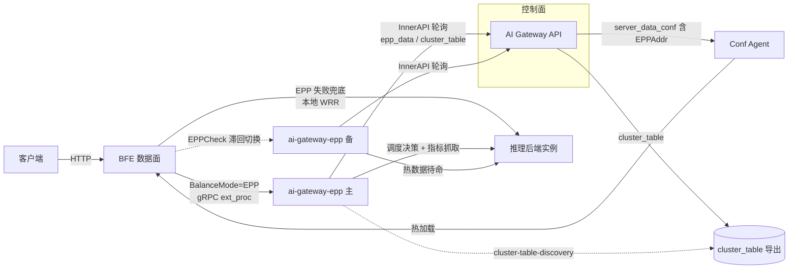
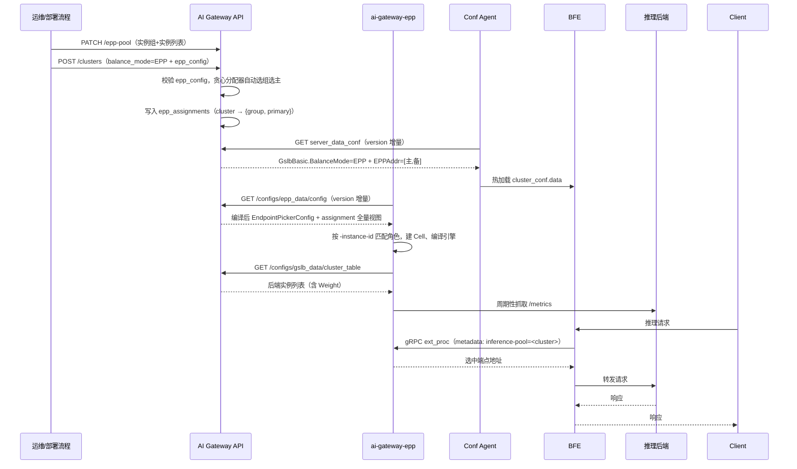

# 第十六章 EPP智能调度设计

## 本章目标

通过本章，读者将理解：

- 为什么需要 EPP 智能调度：BFE 本地 WRR（加权轮询）在大模型推理场景下的局限；
- EPP 的技术渊源：CNCF llm-d 项目，以及 ai-gateway-epp 与上游 EPP 的关系；
- EPP（Endpoint Picker）在壬远AI网关整体架构中的位置，以及它与传统负载均衡的分工；
- 控制面（AI Gateway API）如何管理 EPP 实例池、编译调度配置、分配实例组并双向下发配置；
- 数据面（BFE）如何通过 gRPC ext_proc 协议接入 EPP，以及故障时的兜底语义；
- ai-gateway-epp 组件内部的配置消费、调度插件链与亲和机制；
- EPP 调度链路的端到端流程与边界语义。

---

## 背景：WRR 的局限与 EPP 的定位

壬远AI网关的 Cluster 默认使用 BFE 内置的 WRR（Weighted Round Robin，加权轮询）进行后端选择。WRR 的实现简单、行为确定，但它对后端状态一无所知，在 LLM（Large Language Model，大语言模型）推理场景下存在三个明显局限：

1. **无负载感知**：WRR 只按权重轮询分发，无法感知推理后端的实时压力。GPU 推理服务的排队长度与 KV cache 利用率随请求变化剧烈，轮询会把请求继续发往已经饱和的后端，导致排队延迟飙升。
2. **无 prefix cache 亲和**：大模型推理中，相同 prompt 前缀的请求若落在同一后端，可直接复用已缓存的 KV cache，显著降低首 Token 延迟。WRR 的轮询天然打散相同前缀的请求，浪费了这部分缓存收益。
3. **无 session 亲和**：多轮对话（同一会话的多轮请求）在后端复用 KV cache 的收益更高。WRR 无法把同一 session 的请求收敛到同一后端。

承担智能调度职责的是 EPP（Endpoint Picker，端点选择器）组件 ai-gateway-epp。它以"多 Cluster 单进程"形态运行：BFE 在转发请求前，通过 gRPC ext_proc（External Processing，外部处理）协议把请求交给 EPP，由 EPP 依据后端利用率、队列长度、前缀缓存与 session 绑定等信号选出最优后端，BFE 再按决策结果转发。路由与调度的基本原理见 [第四章 AI网关的路由与调度原理](../principle/chapter04-routing-and-scheduling.md)。

### EPP 的技术渊源：CNCF llm-d 项目

EPP 的概念与调度引擎来自 [llm-d](https://llm-d.ai/)：一个 Kubernetes 原生的分布式 LLM 推理框架，2026 年 3 月由 Google Cloud、Red Hat、IBM Research、CoreWeave、NVIDIA 等联合捐赠给云原生计算基金会（CNCF），现为 CNCF Sandbox 项目。llm-d 构建在 vLLM 与 Kubernetes Gateway API Inference Extension（网关 API 推理扩展，GAIE）之上，其中 Endpoint Picker（EPP）是该推理扩展的参考调度实现：网关在转发请求前，通过 Envoy ext_proc 协议回调 EPP，由 EPP 以 Filter → Score → Pick 插件流水线完成后端选择。EPP 的调度模型专为推理负载设计——以 KV cache 利用率、请求队列长度为决策信号，内置 prefix cache 感知、session 亲和等推理特有的调度优化。

上游 EPP 面向 Kubernetes 环境：推理后端实例列表来自 InferencePool CRD（Custom Resource Definition，自定义资源），调度策略与实例角色由 Kubernetes 侧的控制组件决定。

### ai-gateway-epp 与上游 EPP 的关系

ai-gateway-epp 复用 llm-d（llm-d-router 引擎包）的调度引擎与插件体系，重新组合为适配壬远AI网关控制面的多 Cluster 调度进程。两者共享 ext_proc 协议与 Filter → Score → Pick 插件流水线，KV cache / prefix cache / session 亲和等推理调度语义完全一致；ai-gateway-epp 消费的调度配置（编译产物 EndpointPickerConfig）即上游 EPP 的配置格式，llm-d 的调度能力与插件生态由此平滑继承。

两者的差异集中在编排环境与生命周期管理：

| 维度 | 上游 EPP（llm-d） | ai-gateway-epp |
|------|------------------|----------------|
| 运行环境 | Kubernetes：后端实例来自 InferencePool CRD，调度策略来自推理扩展配置 | 无 Kubernetes 依赖：后端实例来自 AI Gateway API InnerAPI 的 cluster_table 导出，调度配置与主备角色来自 `epp_data/config` 接口（epp_config 编译产物 + assignment 全量视图）——CRD reconciler 不存在 |
| 进程模型 | 一个 EPP 进程服务一个推理池（InferencePool） | 一个进程服务多个 Cluster：每个被分配的 Cluster 对应一个 Cell（数据面常驻：datastore + 指标采集；引擎按配置版本原子热切换），ext_proc 请求按 BFE 注入的 inference-pool metadata 路由到对应 Cell |
| 配置生效 | CRD 更新经 Kubernetes reconcile 逐步生效 | `epp_config` 变更编译为新引擎后原子切换，旧引擎 drain（流控队列逐出 + 在飞请求等待上限），单 Cluster 编译失败不影响其他 Cluster |
| 实例角色 | 由 Kubernetes 侧组件决定 | 由 assignment 全量视图决定：实例以 `-instance-id` 在视图中自匹配，定位自己持有哪些 Cluster 的主/备角色 |

EPP 调度是 Cluster 级的一等配置：Cluster 的 `balance_mode` 字段取 `EPP` 时，该 Cluster 的后端选择由 EPP 接管；取 `WRR`（默认）时由 BFE 本地加权轮询处理。两种模式可在 Cluster 生命周期内切换。

---

## 总体架构

EPP 智能调度涉及四个组件：控制面 AI Gateway API、数据面 BFE、调度器 ai-gateway-epp 以及配置代理 Conf Agent。总体架构如下：



各组件职责：

- **AI Gateway API**：维护 EPP 实例池（`/epp-pool`）、Cluster 的 `balance_mode` 与 `epp_config`、Cluster→实例组分配（`epp_assignments`）；经 InnerAPI 向 EPP 下发编译后的调度配置与分配视图，经 server_data_conf 向 BFE 下发 `GslbBasic` 的 `BalanceMode=EPP` 与有序 `EPPAddr`。
- **BFE**：命中 EPP 模式 Cluster 的请求经 gRPC ext_proc 发往当前活跃 EPP 地址（主）；EPP 调用失败或无候选时静默回退本地 WRR，业务不中断。
- **ai-gateway-epp（EPP 组件）**：以实例组（每组 2 实例，互为主备）为部署单元运行；轮询 InnerAPI 获取调度配置与分配视图，按 assignment 决定本实例持有哪些 Cluster 的调度权；经 `cluster-table-discovery` 插件从 cluster_table 导出发现推理后端，周期性抓取后端 `/metrics` 指标驱动调度。
- **Conf Agent**：把 server_data_conf（含 `GslbBasic`）下发到 BFE 并触发热加载，机制与 [第十四章 配置导出与版本控制设计](./chapter14-config-export-and-version-control.md) 所述一致。

---

## 控制面设计

控制面的核心问题有三个：EPP 实例池如何管理、每个 Cluster 的调度配置如何表达与下发、Cluster 与 EPP 实例组之间如何分配。本节依次说明。

### balance_mode 与 epp_config：Cluster 级的调度入口

Cluster 资源携带两个与 EPP 相关的字段：

| 字段 | 类型 | 语义 |
|------|------|------|
| `balance_mode` | string | 集群均衡模式：`WRR`（默认，BFE 本地加权轮询）或 `EPP`（EPP 调度器接管后端选择）。该字段是 EPP 模式的唯一判定来源 |
| `epp_config` | object | EPP 调度配置，采用简化用户形态（见下）。`balance_mode=EPP` 时必填并生效；`balance_mode=WRR` 时可选，传入则保留并做格式校验，但不编译、不导出 |

`epp_config` 不直接暴露 llm-d `EndpointPickerConfig` 的插件声明细节，而是以"调度档位 + 少量一等公民调优参数"表达意图：

| 字段 | 默认值 | 说明 |
|------|--------|------|
| `scheduling_profile` | `balanced` | 调度档位：`latency-first`（低延迟优先，队列权重最高）/ `balanced`（均衡）/ `throughput-first`（吞吐优先，KV cache 权重最高） |
| `cache_affinity` | 缺省（跟随档位） | scorer 权重覆盖项：`low` / `medium` / `high`；未显式设置时跟随 `scheduling_profile`，显式设置后覆盖其权重 |
| `prefix_cache_affinity` | `true` | 前缀缓存亲和开关（软亲和） |
| `session_affinity_enabled` | `false` | 会话亲和开关 |
| `session_affinity_header` | - | session id 来源请求头；`enabled=true` 时必填，二者成对出现 |
| `kv_cache_utilization_max` | `0.9` | 端点过滤阈值 `(0,1]`：KV cache 利用率超过该值的端点被过滤 |
| `flow_control` | - | 流控参数：`max_requests`（缺省不限，`-1` 显式不限）、`queue_ttl`（秒）、`no_endpoint_queue_ttl`（秒）、`enable_eviction` |

两个字段的取值规则：

- `balance_mode=EPP`：`epp_config` 必填且须通过字段校验（缺省时创建请求返回 422，杜绝"EPP Cluster 无调度配置"的悬空状态）。
- `WRR → EPP` 切换：须同时提供合法的 `epp_config`。
- `EPP → WRR` 切换：仅修改 `balance_mode` 即可；`epp_config` 与分配记录保留（休眠：不编译、不导出），再切回 `EPP` 时原配置与原分配继续生效。
- `epp_config` 非空即须通过字段校验，与 `balance_mode` 无关——休眠保留的配置同样保持合法。

存储上，`clusters` 表包含 `balance_mode` 列（默认 `'WRR'`）与 `epp_config` 列（JSON，可空）。系统保留用户写入的原始 JSON，未显式携带的字段不落盘，GET 回读与写入一致，默认值只体现在导出编译时。

### /epp-pool：EPP 实例池

EPP 实例池是单例资源，管理面模式对齐 `/alb-pool`：`GET` 详情 + `PATCH` 全量替换。实例池由实例组（group）与实例列表构成：

```json
{
    "name": "EPP.pool",
    "groups": [
        {
            "name": "g1",
            "instances": [
                { "id": "epp-a", "host": "10.0.0.1", "port": 9002 },
                { "id": "epp-b", "host": "10.0.0.2", "port": 9002 }
            ]
        }
    ]
}
```

设计要点：

- **实例 id 约定**：EPP 以 StatefulSet 部署，实例 id 即 Pod hostname（`-instance-id` 启动参数缺省取 hostname）；`/epp-pool` 登记时实例 id 取 Pod 名。非 K8s 部署显式传 `-instance-id`。
- **静态配置模式（无注册/心跳）**：实例列表是部署事实，由部署流程在实例变更（扩缩容、换机）后调用 `PATCH` 维护，天然幂等。系统不提供注册/心跳接口，AI Gateway API 侧不做存活标记——实例存活感知由 BFE 侧 `EPPAddr` 连接滞回驱动。
- **组规模**：生产环境每组恰 2 实例（互为主备）；测试环境允许单实例组（仅主、无备）。
- **校验**：组名非空唯一；实例 id 池内全局唯一；`(host, port)` 组合池内全局唯一；host 为 Hostname 或 IP（IPv6 字面量不带括号）。
- 实例池变更不直接 bump `ConfigTopicEppData` topic（实例增减不改变 cluster→role 映射）。

实例展开存储于 `epp_instances` 表（id、host、port、group_name），生成 `EPPAddr` 时经 `net.JoinHostPort` 拼接为 `host:port`（IPv6 自动加括号）。

### /epp-assignments：分配模型与分配器

Cluster 与 EPP 实例组的关联存储于 `epp_assignments` 表：

```
cluster（唯一键）, group_name, primary_instance_id
```

分配**只存主**：standby 不持久化，读时展开为同组除 primary 外的实例，避免双写不一致。管理面 `GET /epp-assignments` 返回读时 join 的全量视图：per-cluster 展开 `{group, primary, standby}`，并汇总 `unassigned_clusters`（EPP 模式但无有效分配）与 `idle_groups`（未承担任何分配的组）；primary 指向的实例已被移出池时该条目标记 `degraded`。

分配由**分配器自动生成**，`PUT /epp-assignments/{cluster}` 手工覆写仅作运维干预入口。自动分配采用贪心 + 确定性 tie-break 算法：

```
输入：实例池（组→实例列表）、现有分配（epp_assignments）、目标 cluster
1. 候选组过滤：实例数满足部署形态要求（生产=2，测试≥1）
2. 选组：组负载 = 组内各实例"作为 primary 承担的 cluster 数"之和
        → 选负载最小的组；并列取组名字典序最小（组间均衡）
3. 选主：组内选"作为 primary 承担的 cluster 数最少"的实例
        → 并列取实例 id 字典序最小（组内均衡）
4. 写入 epp_assignments（cluster 唯一键 upsert）
```

算法全程无随机，结果可重放、可单测。互为主备是合法输出：同组两实例可在不同 Cluster 间互为主备（cluster-a 主=epp-a、cluster-b 主=epp-b），分配以 Cluster 为单位，不做组↔Cluster 一对一约束。

自动分配的触发与修复路径：

| 触发点 | 行为 |
|--------|------|
| cluster 创建为 EPP 模式，或 `WRR → EPP` 变更 | 无分配记录 → 自动分配 |
| `/epp-pool` PATCH 后分配悬空（primary 已被移出池） | 组仍存在 → 同组剩余实例中重选 primary（不换组）；组已不存在 → 跨组重分配（对整个池重跑贪心算法）；池无可分配候选组 → 清除分配，进入未分配态 |
| 周期对账 reconciler（30 秒，可配） | 扫描全部 EPP Cluster，无有效分配即自动补分配（幂等，大部分轮次零写入） |
| `PUT /epp-assignments/{cluster}` | 手工覆写 `{group_name, primary_instance_id}`，触发 server_data_conf version bump |

### epp_data 统一下发：编译后的配置 + 分配全量视图

EPP 实例经单个 InnerAPI 端点拉取全部控制面配置：

```http
GET /inner-api/v1/configs/epp_data/config?version=<上次版本号>
Authorization: Token <token>
```

响应 `Config` 含两段，`epp_config` 为 `map[cluster名]EndpointPickerConfig`（由简化 `epp_config` 在导出时确定性编译而来），`assignment` 为 `map[cluster名]{primary, standby}`（全量视图）。核心语义：

- **version 增量**：走既有 `ExportConfig` 框架（topic `ConfigTopicEppData`，MD5 签名比对），未变化返回 `Data: null`。
- **所有 EPP 实例返回完全相同的 assignment 内容**（同一 version 快照），由实例以自身 `-instance-id` 逐 Cluster 匹配得出角色：`primary == 本实例 id` → 主；`standby == 本实例 id` → 备；均未命中 → 跳过该 Cluster。服务端因此无需校验实例身份，也不存在 per-instance 视图的边缘错误。
- **单端点合并下发**：Cluster 创建、模式变更、分配变更往往同时改变两段配置，单 topic 天然保证两段配置同一 version 原子快照，消除跨 topic 版本偏移导致的角色/配置错配窗口；数据量极小，全量重发代价可忽略。
- **未分配异常态**：`epp_config` 中存在但 `assignment` 中无条目的 Cluster 为未分配，EPP 侧本地告警、不为该 Cluster 建立调度引擎。

简化配置到 `EndpointPickerConfig` 的编译规则固化在 AI Gateway API 代码模板中并单测覆盖：

| 简化字段 | 编译产物 |
|----------|----------|
| 固定部分 | 注入 `cluster-table-discovery` 端点发现插件（clusterName 取本 Cluster）、`utilization-filter`（阈值取 `kv_cache_utilization_max`）、`kv-cache-utilization-scorer` + `queue-scorer` 两个 scorer、`max-score-picker` picker、`openai-parser` |
| `scheduling_profile` → scorer 权重 (kv, queue) | `latency-first` → (0.2, 1.0)；`balanced` → (1.0, 0.5)；`throughput-first` → (1.0, 0.2) |
| `cache_affinity` → scorer 权重（显式设置时覆盖档位） | `low` → (0.2, 1.0)；`medium` → (0.6, 0.6)；`high` → (1.0, 0.2) |
| `prefix_cache_affinity=true` | scorer 链追加 `prefix-cache-scorer`（权重固定 1.0） |
| `session_affinity_enabled=true` | scorer 链追加 `session-affinity-scorer`（strategy=session_id，session id 取自 `session_affinity_header`，权重固定 1.0） |
| `flow_control` 存在时 | 生成 `flowControl` 段（秒数转为 Go duration），`featureGates` 追加 `flowControl`；`max_requests` 缺省或 `-1` 时不生成 `maxRequests` 字段 |

亲和类 scorer 是特性开关（开/关 + 固定权重 1.0），与档位权重正交：档位只调节 (kv, queue) 两个基础 scorer 的权重。

### cluster_table 导出：EPP 发现推理后端的来源

EPP 模式 Cluster 的实例池类型标记为 `Role=EPP`，但池实例列表照常同步 Provider 的 `instance_pool`（由 `ProviderInstancePoolSyncer` 在 Provider 实例池变更时同步到所有引用该 Provider 的 Cluster，含 EPP 池）。这些实例服务于两个消费方：

1. **cluster_table 导出**（`/configs/gslb_data/cluster_table`）：EPP 的 `cluster-table-discovery` 插件经它发现推理后端；实例 `Weight=0` 表示摘流。
2. **BFE 兜底 WRR**：EPP 全挂或无候选时，BFE 回退本地 WRR 所用的后端列表。

`BalanceMode=EPP` 下 BFE 不做本地 WRR，实例列表不参与正常均衡，仅作上述两类用途。

### server_data_conf 导出：EPPAddr 与降级语义

EPP 模式 Cluster 在 server_data_conf 中导出 `GslbBasic`：

```json
"GslbBasic": {
    "BalanceMode": "EPP",
    "EPPAddr": ["10.0.0.1:9002", "10.0.0.2:9002"]
}
```

- `EPPAddr` 为**有序主备列表**：`[0]`=主、`[1]`=备（取自 `epp_assignments` 分配，单实例组仅 `[主]`）。地址由 `epp_instances` 的 host/port 经 `net.JoinHostPort` 拼接。
- **无有效分配时降级导出**：该 Cluster `BalanceMode` 置为 `WRR`、不生成 `EPPAddr`，同时 AI Gateway API 输出 error 级日志（含 Cluster 名与原因）。这是显式降级而非静默错误：单 Cluster 降级不阻塞整份 server_data_conf 下发，降级期间 BFE 以本地 WRR 调度该 Cluster 池中的 Provider 实例（请求仍可服务，仅失去 EPP 智能调度），分配恢复后下轮导出自动回到 `EPP`。

### 设计取舍：为什么不直接暴露 EndpointPickerConfig

`EndpointPickerConfig` 是 llm-d 的内部实现抽象，包含插件实例、pluginRef 引用图、DAG 层序与 Quantity 格式。把它直接暴露给用户的代价是：用户需要理解整套插件体系才能正确组装配置，而 AI Gateway API 只能做 JSON Schema 结构校验，引用错误要到 EPP 编译期才暴露。

采用"档位 + 调优参数"的简化形态后：用户表达成本从"组装插件链"降为"选一个档位、填几个数字"；编译产物由代码模板确定性生成，引用完整性与 DAG 无环由构造保证，配置出厂即合法；EPP 侧消费格式不变。本期不提供原样透传的高级模式，如未来出现自定义插件链需求再开放。

---

## 数据面设计：BFE 的 ext_proc 接入

### GslbBasic 的 EPP 字段

BFE 的 `cluster_conf.data` 中每个 Cluster 的 `GslbBasic` 节携带 EPP 相关字段（全部可选、带缺省值）：

| 字段 | 说明 |
|------|------|
| `BalanceMode` | `"EPP"` 时本 Cluster 走 ext_proc 调度；缺省为 WRR，EPP 字段被忽略 |
| `EPPAddr` | 有序主备地址列表，`[0]`=主、`[1]`=备；`BalanceMode=EPP` 时非空（加载校验：元素须为 `host:port`、列表内去重） |
| `EPPCheck` | 健康检查与滞回参数：`CheckInterval`（默认 2s）、`FailThreshold`（默认 3）、`Cooldown`（默认 45s）、`SuccessThreshold`（默认 2） |
| `EPPTimeout` | 调用超时：`Connect`（默认 500ms）、`Call`（默认 3s） |
| `EPPTLS` | 传输安全：`Insecure`（测试环境）/ `CAFile`（生产环境校验 EPP 服务端证书） |
| `EPPBreaker` | 熔断参数（滑动窗口错误率），与地址级 failover 互补 |

### 请求处理流程

命中 EPP 模式 Cluster 的请求按以下流程处理：

1. BFE 构造首个 ext_proc 消息（RequestHeaders），在 metadata 中注入 `"llm-d.ai": {"inference-pool": "<cluster名>"}`，EPP 的 demux 按 pool 名把流路由到对应 Cluster 的调度 Cell。
2. BFE 将请求经 gRPC ext_proc 发往当前活跃 EPP 地址（初始为主，即 `EPPAddr[0]`），等待 EPP 返回决策。
3. EPP 在响应 `dynamic_metadata` 的 `envoy.lb → x-gateway-destination-endpoint` 中给出选中端点地址。
4. BFE 按决策地址在本地 cluster_table 中构造临时 backend，向后端转发请求；响应路径上经 ResponseHeaders 与 body filter 把流式响应回传给 EPP（供 token 计量等用途）。

### 故障切换与兜底语义

- **滞回切换（EPPCheck）**：每个 EPP 地址有后台健康检查（gRPC health）。活跃地址连续失败 `FailThreshold` 次即 failover 到下一地址；切换后进入 `Cooldown` 冷却期不回切；冷却期后更高优先级地址连续通过 `SuccessThreshold` 次检查才 failback。冷却期是主备方案的硬要求，防止 flapping。
- **错误驱动的即时重试**：对 `Unavailable / cell is not serving`（备实例拒绝服务）与 `unknown inference pool` 错误，BFE 不等健康检查周期，直接在同 Cluster 的下一 EPP 地址上重试该请求。
- **静默回退本地 WRR**：EPP 调用失败（transport 错误、超时、全部地址不可用）或 EPP 无候选（fail-closed）时，BFE 回退本地 `Balance()` 用 Cluster RS（即 Provider 实例）继续服务，业务不中断、失去智能调度。回退是静默的，正常流量不受打扰。
- **可观测**：BFE 监控端口提供 `/monitor/epp_metrics`（Prometheus 文本格式），核心指标为 `epp_calls_total{cluster,result}`（result ∈ ok/no_pool/unknown_pool/draining/transport）与 `epp_fallback_local_total{cluster}`，另有 failover/failback 计数与活跃地址索引。

---

## ai-gateway-epp 侧设计

### 双 poller 与 Cell 引擎

ai-gateway-epp 进程内运行两个配置轮询器（poller），均基于统一的 `Source[T]` 增量轮询框架（version 协商 + 失败退避 + fail-static 保留本地已知配置）：

- **epp_data poller**：轮询 `/configs/epp_data/config`，获得编译后的调度配置与分配全量视图。配置变化时按 Cluster 重新编译调度引擎并原子热交换（旧引擎 drain 后销毁，默认等待 60 秒）；分配变化时按本地角色 diff 驱动 Cell 生命周期（Ensure/Promote/Demote/Drop）。
- **cluster_table discovery poller**：轮询 `/configs/gslb_data/cluster_table`，将后端实例列表 diff 到各 Cluster 的 `cluster-table-discovery` 插件；实例 `Weight=0` 视为摘流（跳过该实例，已从列表消失的实例随之摘除）。

assignment 决定本实例持有哪些 Cluster：primary 角色的 Cell 对外提供调度服务；standby 角色的 Cell 同样加载配置、建好引擎（热数据待命），但 demux 对调度请求返回 `ErrCellDraining` 拒绝服务，failover 后"开闸即服务"。

### 调度插件链

编译后的 `EndpointPickerConfig` 定义每 Cluster 的调度管线，按档位组合的插件包括：

- **cluster-table-discovery**：端点发现，数据源即 cluster_table 导出；
- **utilization-filter**：过滤 KV cache 利用率超过 `kv_cache_utilization_max` 的端点（fail-closed：全部端点被过滤时无候选）；后端指标缺失时相应得分中性化（kv 得分视为 1.0、filter 不生效），调度正常退化；
- **kv-cache-utilization-scorer / queue-scorer**：基础打分项，权重由档位（及 `cache_affinity` 覆盖）决定；
- **prefix-cache-scorer**：前缀缓存亲和（软亲和）。索引为 EPP 本地内存中的 per-endpoint LRU（由 `approx-prefix-cache` producer 自主学习写入），无需 Redis 等外部存储；
- **session-affinity-filter / session-affinity-scorer**：会话亲和。binding 状态同样为 EPP 本地内存，session id 从 `session_affinity_header` 指定的请求头解析；
- **max-score-picker**：加权求和取最高总分端点，同分确定性轮转让位。

调度语义是"加权求和 + 最高分选取"，且 filter 先于打分执行。因此前缀/session 亲和均为**尽力收敛**而非硬路由：匹配后端被 utilization-filter 过滤、匹配率低而被其他后端总分反超、首次请求无亲和数据等情况下，请求会被调度到非匹配后端。这是期望行为——负载/利用率因素可打断亲和，避免热点后端被拖死。

### 运行时指标管道

kv/queue scorer 消费的利用率与队列指标由 EPP 周期性 HTTP 抓取各推理后端 `/metrics`（Prometheus 格式）获得（`RefreshMetricsInterval` 刷新，默认 50ms，本地内存缓存），指标 source/extractor 由 ai-gateway-epp 默认注入。EPP 全链路的对外依赖仅两类无状态拉取：控制面配置（epp_data / cluster_table）与数据面指标（后端 `/metrics`）。prefix 亲和 LRU、session binding、流控队列与在飞计数均为进程内状态，failover/重启后冷启动重新收敛。

---

## 端到端流程

一次 EPP 模式 Cluster 从创建到请求调度的完整时序如下：



---

## 边界语义

| 场景 | 行为 |
|------|------|
| 双后端全过载 | utilization-filter fail-closed 过滤全部端点 → EPP 无候选 → BFE 静默回退本地 WRR 继续服务（`epp_fallback_local_total` 增长） |
| 单实例组（测试环境） | `EPPAddr` 仅 `[主]`；主失联时 BFE 降级本地均衡 |
| EPP 实例故障 | BFE 经 EPPCheck 滞回切 standby 地址；**standby 不自动承担调度**——分配为配置驱动，standby Cell 拒绝服务（`cell is not serving`），切换后的 200 响应由 BFE 本地 WRR 兜底产生，属设计内行为 |
| 分配悬空（primary 实例被移出池） | `/epp-pool` PATCH 触发自动重分配；池无可分配候选时清除分配，导出降级 WRR + error 日志，容量恢复后自动修复路径重新分配 |
| `EPP → WRR` 再切回 | epp_config 与分配记录休眠保留，切回 EPP 时原配置原分配继续生效 |
| `-instance-id` 与 /epp-pool 不一致 | EPP 所有 Cluster 未命中角色，无 Cell、不服务；启动日志与 `ai_epp_assignment_no_match` 指标告警 |

---

## 本章小结

- EPP 智能调度解决 WRR 无负载感知、无 prefix cache 亲和、无 session 亲和的三重局限；BFE 经 gRPC ext_proc 把后端选择委托给 ai-gateway-epp。
- Cluster 的 `balance_mode`（WRR/EPP）是 EPP 模式的唯一判定来源；`epp_config` 采用"档位 + 调优参数"的简化用户形态，导出时确定性编译为 llm-d `EndpointPickerConfig`，出厂即合法。
- `/epp-pool` 以单例 + 全量替换模式静态登记实例池；分配器以贪心 + 确定性 tie-break 自动生成 Cluster→实例组分配，只存主、standby 读时展开，悬空时自动修复。
- epp_data 单端点合并下发编译配置与分配全量视图（version 增量），所有 EPP 实例同一快照、本地自匹配角色。
- server_data_conf 向 BFE 导出有序 `EPPAddr`；无有效分配时单 Cluster 显式降级为 WRR + error 日志，不阻塞整份下发。
- BFE 侧 EPPCheck 滞回驱动主备切换，EPP 失败或无候选时静默回退本地 WRR，业务不中断；standby 不自动提升，failover 后的流量由兜底 WRR 承接。

实现细节见 [第三十六章 EPP组件实现](../implementation/chapter36-epp-implementation.md)，配置与运维操作见 [第二十六章 EPP调度配置与运维](../operation/chapter26-epp-scheduling-operation.md)。

---

## 参考文档

- [llm-d 项目主页](https://llm-d.ai/)与 [CNCF llm-d 项目页](https://www.cncf.io/projects/llm-d/)
- [Kubernetes Gateway API Inference Extension](https://github.com/kubernetes-sigs/gateway-api-inference-extension)（EPP 协议与 InferencePool API）
- `ai-gateway-epp/README.md`（ai-gateway-epp 与上游 EPP 的差异）
- `ai-gateway-api/design-docs/modifications/2026-09-08-epp-scheduling-integration/change-summary.md`
- `ai-gateway-api/design-docs/modifications/2026-09-08-epp-scheduling-integration/api-changes.md`
- `ai-gateway-api/design-docs/modifications/2026-09-08-epp-scheduling-integration/design-changes.md`
- `ai-gateway-api/design-docs/sys-design/details/EPP调度对接.md`
- `ai-gateway-api/design-docs/api-define/OpenAPI接口定义/epp-pool.md`
- `ai-gateway-api/design-docs/api-define/OpenAPI接口定义/epp-assignments.md`
- `ai-gateway-api/design-docs/api-define/OpenAPI接口定义/clusters.md`
- `ai-gateway-api/design-docs/api-define/InnerAPI接口定义/epp-data.md`
- `ai-gateway-api/design-docs/api-define/InnerAPI接口定义/server-data-conf.md`
- `ai-gateway-epp/docs/zh_cn/modifications/2026-09-08-epp-scheduling-integration/change-summary.md`
- `ai-gateway-epp/docs/zh_cn/modifications/2026-09-08-epp-scheduling-integration/design-changes.md`
- `bfe/docs/zh_cn/modifications/2026-09-06-epp-ai-gateway-integration/design-changes.md`
- `integration-test/test-cases/测试设计文档/scenario-SC28-EPP调度端到端/场景说明.md`
