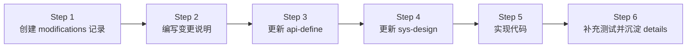
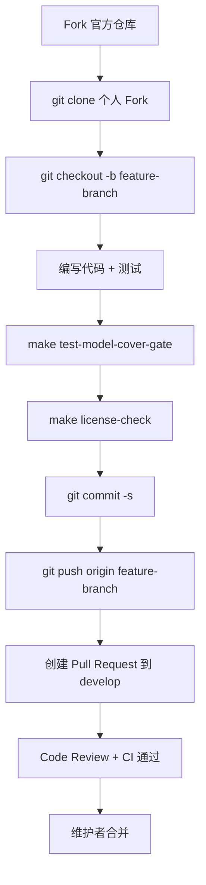

# 第三十四章 如何向壬远AI网关贡献代码

## 本章目标

本章面向希望参与壬远AI网关（Rainway AI Gateway）开源社区的后端开发者，系统说明从环境准备、代码获取、设计先行、测试覆盖到提交 Pull Request 的完整贡献流程。阅读本章后，读者将能够：

- 搭建本地开发环境并编译 `ai-gateway-api`。
- 遵循“设计先行”的六步变更方法论完成非平凡特性开发。
- 编写符合项目规范的单元测试，并保证 `model/` 层语句覆盖率不低于 70%。
- 处理跨仓库变更（AI Gateway API、BFE、Conf Agent）的协作事项。
- 使用 `make`、`license-eye` 等工具完成代码风格与合规检查。

## 开发环境搭建

壬远AI网关主要采用 Go 语言开发，控制面依赖 MySQL 与 Redis，构建依赖 `make`。建议贡献者在开始编码前准备以下环境。

### 必备工具与版本

| 工具 | 建议版本 | 说明 |
|---|---|---|
| Go | 1.22 | `ai-gateway-api/go.mod` 指定版本，BFE 与 Conf Agent 亦使用 Go |
| MySQL | 5.7+ | 控制面持久化存储 |
| Redis | 6.0+ | 配额同步、限流计数等共享状态 |
| make | GNU Make | 构建、测试、打包入口 |
| license-eye | 最新版 | Apache SkyWalking Eyes，检查/修复 License 头 |
| pre-commit | 可选 | 提交前自动执行 `gofmt` 等格式化 |

### 初始化数据库

AI Gateway API 在 `ai-gateway-api/db_ddl.sql` 中提供 MySQL 建表脚本，本地初始化命令如下：

```bash
mysql -u{user} -p{password} < ai-gateway-api/db_ddl.sql
```

若使用 SQLite，可执行 `ai-gateway-api/db_ddl_sqlite.sql`。本地启动服务示例：

```bash
cd ai-gateway-api
./ai-gateway-api -c ./conf -sc ai_gateway_api.toml -l ./log
```

默认监听 Open API 端口 `8183`、监控端口 `8284`。

### 安装 license-eye

`ai-gateway-api/Makefile` 提供自动安装目标，也可手动安装：

```bash
go install github.com/apache/skywalking-eyes/cmd/license-eye@latest
```

检查与修复 License 头的命令：

```bash
make license-check
make license-fix
```

### 验证编译

环境就绪后，在 `ai-gateway-api/` 目录执行 `make` 即可下载依赖并编译出二进制：

```bash
cd ai-gateway-api
make
```

若编译通过，当前目录会生成 `ai-gateway-api` 可执行文件。首次编译通常需要下载较多 Go module，建议在稳定的网络环境下进行。

## 代码获取与仓库结构

壬远AI网关由多个仓库组成，贡献者通常需要关注以下三个核心仓库：

| 仓库 | 角色 | 主要变更场景 |
|---|---|---|
| `rainway-ai-gateway/ai-gateway-api` | 控制面（Control Plane） | API、业务模型、配置导出、版本控制 |
| `bfenetworks/bfe` | 数据面（Data Plane） | 流量转发、AI 路由、Token 认证、限流模块 |
| `bfenetworks/conf-agent` | 配置拉取代理 | 热加载配置、下发配置到 BFE |

### Fork 与 Clone

三个仓库均采用 [Git Flow 分支模型](http://nvie.com/posts/a-successful-git-branching-model/)，日常开发在 `develop` 分支进行。贡献者应先 Fork 官方仓库，再 Clone 自己的 Fork：

```bash
git clone https://github.com/your-github-account/ai-gateway-api
cd ai-gateway-api
git remote add upstream https://github.com/rainway-ai-gateway/ai-gateway-api
```

创建本地特性分支：

```bash
git checkout -b my-cool-stuff
```

### ai-gateway-api 目录速览

```text
ai-gateway-api/
├── endpoints/          # HTTP 路由与 handler
│   ├── openapi_v1/     # 面向用户的 Open API
│   └── innerapi_v1/    # 内部 API（配置导出、GSLB 数据等）
├── model/              # 业务逻辑 Manager
│   ├── quota/
│   ├── iai_route/
│   ├── imods/
│   └── ...
├── storage/rdb/        # MySQL/SQLite DAO
├── stateful/           # 配置、DB/Redis 客户端、生命周期
├── design-docs/        # API 定义、系统设计、变更记录
│   ├── api-define/
│   ├── sys-design/
│   └── modifications/
├── Makefile
├── db_ddl.sql
└── db_ddl_sqlite.sql
```

控制面请求流为：`endpoints/` → `model/` → `storage/rdb/` → `stateful/`。新增或修改 API 时，通常需要按此顺序改动。

## 设计先行：六步变更方法论

对于非平凡的代码变更，`ai-gateway-api/design-docs/README.md` 要求遵循“六步变更方法论”，确保设计文档、接口定义与代码实现始终一致。

### 方法总览



### Step 1：创建 modifications 记录

在 `ai-gateway-api/design-docs/modifications/` 下新建目录，命名格式为：

```text
YYYYMMDD-<变更目的简述>
```

例如 `20260728-apikey-rate-limit/`。目录名应使用英文或拼音，避免特殊字符。

### Step 2：编写本次变更说明

目录中至少包含 `change-summary.md`，必要时增加：

| 文件 | 内容 |
|---|---|
| `change-summary.md` | 背景、目标、影响范围、关键决策 |
| `api-changes.md` | 新增/修改/删除的接口、字段、错误码 |
| `design-changes.md` | 数据模型、流程、算法、约束变化 |

### Step 3：更新接口定义

基于变更说明修改 `design-docs/api-define/` 下的 OpenAPI / InnerAPI 定义。Review 检查项包括：

- 接口路径、方法、参数与变更说明一致；
- 字段命名符合现有规范；
- 错误码覆盖新增失败场景；
- 不破坏已有接口兼容性（若涉及）。

### Step 4：更新系统设计

修改 `design-docs/sys-design/` 中相关文档，必要时新增 `sys-design/details/` 细节文档，并同步更新 `design-docs/sys-design/summary.md` 索引。

### Step 5：实现代码

按照“接口层 → 模型层 → 存储层”的顺序实现。`ai-gateway-api/AGENTS.md` 给出典型模式：

- Open API 变更：`endpoints/openapi_v1/<domain>/` → 注册 `endpoints/openapi_v1/endpoints.go` → `model/<domain>/` → `storage/rdb/<domain>/`。
- Inner API 变更：`endpoints/innerapi_v1/<domain>/` → `model/imods/`、`model/iversion_control/`。
- 新增 domain：`model/<domain>/` → 定义 storager 接口 → `storage/rdb/<domain>/` → 更新 `db_ddl.sql`。

在模型层实现时，应优先通过构造函数注入 `itxn.TxnStorager` 与具体 storager 接口，避免在 manager 内部直接开启事务或访问全局单例。这样既能保持业务逻辑可测试，也便于在单元测试中使用 `fakeTxn` 与手写 mock。若实现过程中发现设计需要调整，应回到 Step 3/Step 4 更新设计文档，而非直接偏离设计。

### Step 6：总结并决定是否加入长期设计文档

代码变更完成后，评估是否有可复用、可沉淀的设计知识，例如：

- 新的核心机制（配额同步、限流策略、路由规则）；
- 复杂的继承/合并逻辑（Entity 层级、模型黑白名单）；
- 关键的导出/版本控制流程。

若值得沉淀，在 `design-docs/sys-design/details/` 下新建文档，并更新 `sys-design/summary.md`。

## 单元测试组织、Mock 模式与覆盖率要求

`ai-gateway-api/TESTING.md` 定义了控制面的单元测试规范，贡献者应严格遵守。

### 测试组织

- 测试文件与被测代码同包：`xxx.go` 对应 `xxx_test.go`，位于同一目录。
- 共享 mock 写在 `mocks_test.go`。
- 单元测试不应依赖外部服务（MySQL、Redis、真实配置文件或二进制）。

示例目录结构：

```text
ai-gateway-api/model/quota/
├── entity_manager.go
├── entity_manager_test.go
└── mocks_test.go
```

### Mock 模式

项目采用**手写 callback mock**，例如 `model/quota/mocks_test.go` 中的 `fakeTxn` 与 `fakeEntityStorager`：

```go
// ai-gateway-api/model/quota/mocks_test.go
type fakeTxn struct{}

func (f *fakeTxn) AtomExecute(ctx context.Context, do func(context.Context) error) error {
    return do(ctx)
}

type fakeEntityStorager struct {
    createFn func(ctx context.Context, param *EntityParam) (int64, error)
    fetchFn  func(ctx context.Context, filter *EntityFilter) (*EntityParam, error)
}

func (s *fakeEntityStorager) CreateEntity(ctx context.Context, param *EntityParam) (int64, error) {
    if s.createFn != nil {
        return s.createFn(ctx, param)
    }
    return 0, nil
}
```

Manager 层应优先通过构造函数注入依赖，避免直接读取 `stateful.DefaultConfig` 或 `stateful.DefaultClientSet`，以便测试替换。

### 覆盖率要求

`ai-gateway-api/Makefile` 中定义 `MODEL_COVERAGE_THRESHOLD := 70`，CI 使用 `make test-model-cover-gate` 强制门禁。当前 `model/` 整体语句覆盖率约为 87.6%。

| 模块类型 | 目标覆盖率 |
|---|---|
| Manager 层核心模块 | ≥ 70% |
| 工具/纯函数模块 | ≥ 80% |

常用测试命令：

```bash
# 全部单元测试
go test ./...

# 仅 model 层
go test ./model/...

# 覆盖率门禁
make test-model-cover-gate
```

> `coverage.out` 是生成文件，不应提交到仓库。

## License 头与代码风格

壬远AI网关遵循 [Golang style guide](https://github.com/golang/go/wiki/Style)，所有 Go 源文件需包含 Apache 2.0 / Rainway AI Gateway License 头。`ai-gateway-api/Makefile` 中示例头如下：

```go
// Copyright(c) 2024 The Rainway AI Gateway (壬远AI网关) Authors. All rights reserved.
// Copyright (c) 2019 The BFE Authors.
//
// Licensed under the Apache License, Version 2.0 (the "License");
// ...
```

贡献者可通过 `make license-fix` 自动修复缺失的 License 头，通过 `make license-check` 在 CI 前自查。BFE 仓库建议使用 `pre-commit` 自动执行 `gofmt`：

```bash
pip install pre-commit
pre-commit install
```

BFE 还要求提交带 `Signed-off-by:` 签名，以确认贡献者接受 [Developer Certificate of Origin](https://developercertificate.org/)。

## 提交信息规范与 PR 流程

三个核心仓库的 `CONTRIBUTING.md` 均采用 Git Flow 分支模型，PR 流程相似。本节以 `ai-gateway-api` 为例说明。

### 本地工作流



### 提交与 PR 注意事项

- 从个人 Fork 的 `feature-branch` 向官方仓库 `develop` 分支提交 PR。
- 提交前频繁同步上游：`git pull upstream develop`。
- 若修复某个 issue，在 PR 描述中写 `Fixes <issue-URL>`，合并后 GitHub 会自动关闭对应 issue。
- 指定 reviewer；如不确定，遵循 GitHub 推荐。
- 减少无意义提交，可使用 `git commit --amend` 合并小修改。
- 对 reviewer 的每条评论都要回复；若已采纳，回复“Done”；若不采纳，说明理由。
- 分支合并后可清理本地与远端分支：

```bash
git push origin :my-cool-stuff
git checkout develop
git pull upstream develop
git branch -d my-cool-stuff
```

## 跨仓库协作注意事项

AI 网关功能通常同时涉及控制面、数据面与配置下发。贡献者在设计阶段就应判断是否跨仓库，并协调修改。

| 变更范围 | 涉及仓库 | 典型文件 |
|---|---|---|
| AI 路由规则 | ai-gateway-api + bfe | `model/iai_route/`、`bfe/bfe_modules/mod_ai_route/` |
| Token 认证 | ai-gateway-api + bfe | `model/imods/`、`bfe/bfe_modules/mod_ai_token_auth/` |
| 限流策略 | ai-gateway-api + bfe | `model/quota/`、`bfe/bfe_modules/mod_ai_rate_limit/` |
| 配置下发 | ai-gateway-api + conf-agent | `endpoints/innerapi_v1/export_util/`、`conf-agent/` |

跨仓库贡献建议：

1. **先在 `ai-gateway-api` 完成设计文档**：`design-docs/modifications/`、`api-define/`、`sys-design/`。
2. **同步更新 BFE 配置格式**：若导出给数据面的 JSON/TOML 结构变化，需同步修改 `bfe/` 中对应模块的配置解析。
3. **同步更新 Conf Agent**：若配置下发路径或版本号规则变化，需在 `conf-agent/` 中同步。
4. **分别提交 PR**：每个仓库独立 PR，PR 描述中相互引用（如 `Depends on rainway-ai-gateway/ai-gateway-api#123`）。
5. **统一 reviewer**：跨仓库变更建议找同一位或同一组 reviewer，保证设计一致性。

跨仓库变更最容易出现的问题包括：控制面导出的字段名与数据面解析不一致、版本号或配置路径改动后 Conf Agent 无法识别、以及错误码或默认值在两个仓库中语义不同。设计阶段应在 `design-changes.md` 中明确数据面消费的配置格式与版本策略，并在 PR 中提供端到端验证方案。

## 完整的新手贡献示例流程

以下以“为 AI 网关新增 API-Key 级别限流策略”为例，演示从 0 到 PR 的完整流程。

### 1. 创建变更记录

```bash
cd ai-gateway-api/design-docs/modifications
mkdir 20260728-apikey-rate-limit
cd 20260728-apikey-rate-limit
cat > change-summary.md <<EOF
# 背景与目标
为 API-Key 增加独立限流策略，支持按 token/min 与 token/day 双维度限制。

# 影响范围
- model/quota/
- storage/rdb/quota/
- endpoints/openapi_v1/quota/
- bfe/bfe_modules/mod_ai_rate_limit/
EOF
```

### 2. 更新 api-define 与 sys-design

在 `design-docs/api-define/` 中新增 `/rate-limit-policies` 接口定义；在 `design-docs/sys-design/` 中更新限流模型与导出格式说明；必要时新增 `sys-design/details/限流策略与导出.md`。

### 3. 实现控制面代码

按接口层 → 模型层 → 存储层顺序实现：

- `endpoints/openapi_v1/quota/rate_limit_policy.go`
- `model/quota/rate_limit_policy_manager.go`
- `storage/rdb/quota/rate_limit_policy.go`
- 更新 `db_ddl.sql` 增加限流策略表

### 4. 实现数据面代码

在 `bfe/bfe_modules/mod_ai_rate_limit/` 中新增 API-Key 限流规则解析与执行逻辑。

### 5. 编写单元测试

```go
// ai-gateway-api/model/quota/rate_limit_policy_manager_test.go
func TestRateLimitPolicyManager_Create(t *testing.T) {
    ctx := context.Background()
    t.Run("success", func(t *testing.T) {
        store := &fakeRateLimitPolicyStorager{
            createFn: func(ctx context.Context, p *RateLimitPolicyParam) (int64, error) { return 1, nil },
        }
        m := NewRateLimitPolicyManager(&fakeTxn{}, store)
        id, err := m.CreatePolicy(ctx, &RateLimitPolicyParam{Name: lib.PString("key-policy-1")})
        require.NoError(t, err)
        assert.Equal(t, int64(1), id)
    })
}
```

### 6. 本地验证

```bash
cd ai-gateway-api
make test-model-cover-gate
make license-check
cd ../bfe
make
```

### 7. 提交 PR

在两个仓库分别创建 PR，并在描述中相互引用。PR 合并后清理分支。

## 提交前自查清单

在点击“Create Pull Request”之前，建议对照以下清单完成最后一轮检查：

- [ ] 已在 `design-docs/modifications/` 下创建本次变更目录并填写说明。
- [ ] 若涉及 API 变更，`design-docs/api-define/` 已更新并通过 review。
- [ ] 若涉及架构或数据模型变更，`design-docs/sys-design/` 与 `summary.md` 已同步。
- [ ] 代码已按“接口层 → 模型层 → 存储层”顺序实现，且与设计文档一致。
- [ ] 新增或修改的 manager 已补充单元测试，`make test-model-cover-gate` 通过。
- [ ] 全部单元测试 `make test` 通过（至少覆盖改动相关包）。
- [ ] `make license-check` 通过，或已运行 `make license-fix`。
- [ ] 未提交生成文件（如 `coverage.out`、二进制、`.exe`）。
- [ ] 提交信息包含 `Signed-off-by:`（BFE 仓库要求）。
- [ ] PR 描述清晰，关联 issue（如有），并指定 reviewer。

## 本章小结

向壬远AI网关贡献代码需要同时关注代码质量与设计文档一致性。核心要点如下：

- 本地环境以 Go 1.22、MySQL、Redis、make 为基础，配合 license-eye 完成 License 头检查。
- 非平凡变更必须遵循 `design-docs/README.md` 的六步方法论，先写设计文档再写代码。
- 单元测试使用同包测试 + 手写 callback mock，Manager 层覆盖率不得低于 70%。
- 代码风格遵循 Golang style guide，新文件必须包含 License 头。
- PR 从个人 Fork 的 feature 分支指向官方 `develop` 分支，注意 `Signed-off-by:` 与 reviewer 沟通。
- AI 路由、Token 认证、限流、配置导出等功能通常跨仓库，需同步更新 `ai-gateway-api`、`bfe` 与 `conf-agent`。

遵循上述流程，既能保证个人贡献顺利通过 CI 与 Code Review，也能维护整个项目长期可维护的架构与文档体系。

## 参考文档

- `ai-gateway-api/CONTRIBUTING.md` — 贡献流程与代码风格
- `ai-gateway-api/TESTING.md` — 单元测试规范、mock 模式、覆盖率要求
- `ai-gateway-api/AGENTS.md` — 控制面架构与常见修改模式
- `ai-gateway-api/design-docs/README.md` — 六步变更方法论
- `ai-gateway-api/Makefile` — 构建、测试、License 检查目标
- `bfe/CONTRIBUTING.md` — BFE 数据面贡献流程
- `conf-agent/CONTRIBUTING.md` — Conf Agent 贡献流程
