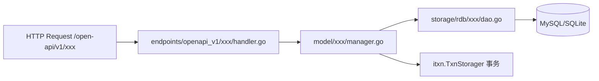
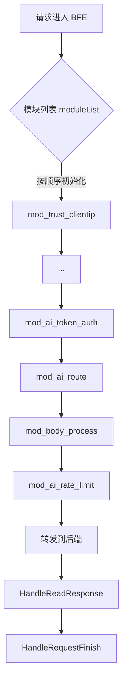
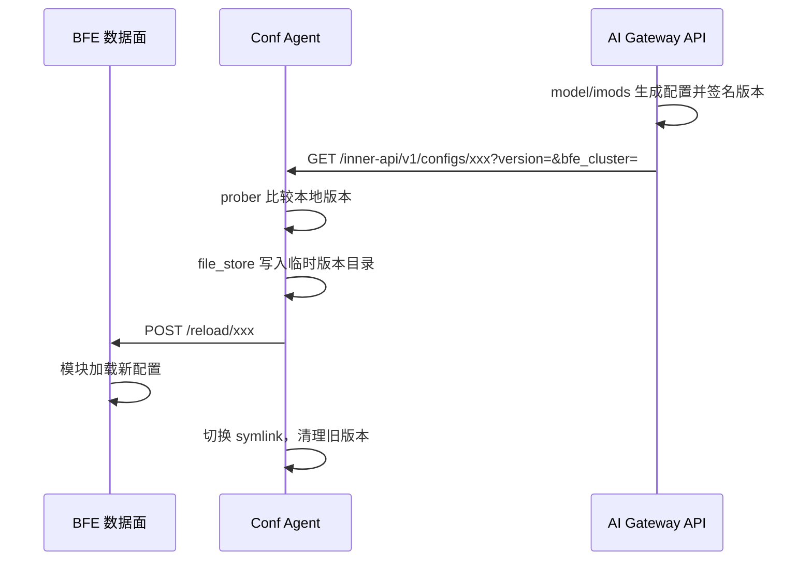
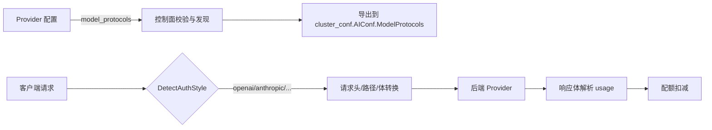

# 第三十四章 如何扩展壬远AI网关

## 本章目标

壬远AI网关由控制面（AI Gateway API）、数据面（BFE）和配置代理（Conf Agent）三个核心仓库组成，各仓库之间通过 OpenAPI、InnerAPI 和配置文件三种契约协作。扩展网关时，开发者往往需要同时改动多个仓库：在控制面新增管理能力、在数据面新增转发行为、在 Conf Agent 新增配置拉取主题，或者让网关支持一种新的模型 Provider 协议。

通过本章，读者将掌握以下四种最常见的扩展场景：

- 在 `ai-gateway-api` 中新增一个 OpenAPI 管理接口；
- 在 `bfe` 中新增一个处理请求/响应的模块；
- 在 `ai-gateway-api` 中新增一个 InnerAPI 配置导出主题，并打通 Conf Agent 与 BFE 的消费链路；
- 扩展一种新的 Provider 协议支持（如新的模型发现协议、请求/响应转换）。

本章将给出每个场景的关键代码路径、实现步骤、测试要点，并通过流程图展示跨组件协作关系。阅读本章前，建议先回顾 [第三十一章 代码组织与启动流程](../implementation/chapter25-code-layout-and-startup.md)、[第三十一章 接口层实现：OpenAPI与InnerAPI](../implementation/chapter26-endpoints-implementation.md) 以及 [第三十五章 Conf Agent实现](../implementation/chapter33-conf-agent-implementation.md)。

## 33.1 扩展前的准备工作

### 33.1.1 开发环境

三个仓库均使用 Go 1.22，构建入口都是 `Makefile`。扩展开发前，请确认本地环境满足以下要求：

- Go 1.22 及以上版本；
- `make` 可用；
- MySQL 或 SQLite（控制面单元测试通常使用 mock，集成测试需要真实数据库）；
- Redis（BFE 的 quota、token auth、rate limit 模块依赖 Redis）；
- `pre-commit`（BFE 仓库要求提交前执行 `gofmt`，详见 `bfe/CONTRIBUTING.md`）。

常用本地验证命令如下：

```bash
# ai-gateway-api
make test-model-cover-gate
make test

# bfe
make prepare
make test

# conf-agent
go test ./...
cd test/integration && go test -v -count=1 ./tests/...
```

### 33.1.2 代码结构理解

扩展前需要理解三个仓库的分层结构：

| 仓库 | 关键目录 | 职责 |
|------|---------|------|
| `ai-gateway-api/` | `endpoints/openapi_v1/` | 管理面 OpenAPI 路由与 Handler |
| `ai-gateway-api/` | `endpoints/innerapi_v1/` | 数据面 InnerAPI（配置导出） |
| `ai-gateway-api/` | `model/` | 业务 Manager 与 Storager 接口 |
| `ai-gateway-api/` | `storage/rdb/` | MySQL/SQLite DAO 实现 |
| `ai-gateway-api/` | `design-docs/` | API 定义、系统设计、变更说明 |
| `bfe/` | `bfe_modules/` | 数据面模块 |
| `bfe/` | `bfe_module/` | 模块框架与回调点定义 |
| `bfe/` | `bfe_config/` | 配置加载器 |
| `conf-agent/` | `conf_reload/prober/` | 从控制面拉取配置 |
| `conf-agent/` | `conf_reload/file_store/` | 本地版本化持久化 |
| `conf-agent/` | `conf_reload/trigger/` | 触发 BFE 热加载 |

对于非平凡的改动，`ai-gateway-api/design-docs/README.md` 规定了“六步变更法”：创建变更说明 → 更新 API 定义 → 更新系统设计 → 按设计实现代码 → 补充测试 → 沉淀细节文档。本章的四个场景都建议遵循这一流程。

## 33.2 场景一：新增一个 OpenAPI 接口

OpenAPI 面向控制台和外部调用方，新增接口的实质是按“接口层 → 模型层 → 存储层”的顺序补齐代码，并在 `endpoints/openapi_v1/endpoints.go` 中注册路由。



### 步骤清单

以新增一个管理“模型标签（Model Tag）”的接口为例，推荐按以下步骤实现：

1. **设计接口**：在 `design-docs/api-define/OpenAPI接口定义/` 中补充接口路径、方法、请求/响应字段和错误码；若涉及表结构变化，同步更新 `design-docs/sys-design/`。
2. **定义模型**：在 `model/imodel_tag/` 下创建 `model_tag.go`，定义 `ModelTag`、`ModelTagParam`、`ModelTagFilter` 以及 `ModelTagManager`。
3. **定义存储接口与实现**：在 `model/imodel_tag/` 中定义 `ModelTagStorager` 接口；在 `storage/rdb/model_tag/` 中实现 DAO。
4. **实现 Handler**：在 `endpoints/openapi_v1/model_tag/` 中创建 `create.go`、`list.go`、`delete.go` 等文件，使用 `xreq.Endpoint` 描述接口。
5. **注册路由**：在 `endpoints/openapi_v1/endpoints.go` 的 `endpoints()` 函数中追加 `model_tag.Endpoints`。
6. **依赖注入**：在 `stateful/container/` 中创建 `ModelTagManager` 实例，供 Handler 使用。
7. **更新数据库脚本**：修改 `db_ddl.sql` 与 `db_ddl_sqlite.sql`，新增对应表。
8. **补充测试**：为 Manager 编写 `mocks_test.go` 与 `*_test.go`，保持 `model/` 覆盖率不低于 70%。
9. **更新文档**：在 `design-docs/modifications/` 下记录本次变更。

### 关键代码路径

`ai-gateway-api/lib/xreq/result.go` 中的 `Endpoint` 抽象是所有 OpenAPI 的基础：

```go
// ai-gateway-api/lib/xreq/result.go
type Handler func(req *http.Request) (interface{}, error)

type Endpoint struct {
    Path    string
    Method  string
    Handler func(*http.Request) *Result
    Authorizer *iauth.Authorization
}
```

一个典型的 Handler 写法参考 `endpoints/openapi_v1/provider/create.go`：

```go
// ai-gateway-api/endpoints/openapi_v1/provider/create.go
var CreateEndpoint = &xreq.Endpoint{
    Path:       "/providers",
    Method:     http.MethodPost,
    Handler:    xreq.Convert(CreateAction),
    Authorizer: iauth.FA(iauth.FeatureProvider, iauth.ActionCreate),
}

func CreateAction(req *http.Request) (interface{}, error) {
    param := &iprovider.ProviderParam{}
    if err := xreq.BindJSON(req, param); err != nil {
        return nil, err
    }
    iprovider.FillDefaults(param)
    id, err := container.ProviderManager.CreateProvider(req.Context(), param)
    if err != nil {
        return nil, err
    }
    return container.ProviderManager.FetchProvider(req.Context(), &iprovider.ProviderFilter{ID: &id})
}
```

模型层通常通过 `itxn.TxnStorager` 控制事务，如 `model/iprovider/provider.go`：

```go
// ai-gateway-api/model/iprovider/provider.go
func (m *ProviderManager) CreateProvider(ctx context.Context, param *ProviderParam) (int64, error) {
    if err := ValidateProviderParam(param); err != nil {
        return 0, err
    }
    var id int64
    err := m.txn.AtomExecute(ctx, func(ctx context.Context) error {
        existing, err := m.storager.FetchProvider(ctx, &ProviderFilter{Name: param.Name})
        if err != nil {
            return err
        }
        if existing != nil {
            return xerror.WrapRecordExisted("provider")
        }
        id, err = m.storager.CreateProvider(ctx, param)
        return err
    })
    return id, err
}
```

### 模型层与存储层实现

新增领域时，通常在 `model/<domain>/` 下定义三类内容：领域结构体、`Storager` 接口、Manager。以模型标签为例，可在 `model/imodel_tag/model_tag.go` 中声明：

```go
// ai-gateway-api/model/imodel_tag/model_tag.go
type ModelTagStorager interface {
    CreateModelTag(ctx context.Context, param *ModelTagParam) (int64, error)
    FetchModelTag(ctx context.Context, filter *ModelTagFilter) (*ModelTag, error)
    FetchModelTagList(ctx context.Context, filter *ModelTagFilter) ([]*ModelTag, int64, error)
    UpdateModelTag(ctx context.Context, id int64, param *ModelTagParam) error
    DeleteModelTag(ctx context.Context, id int64) error
}

type ModelTagManager struct {
    txn      itxn.TxnStorager
    storager ModelTagStorager
}
```

DAO 实现放在 `storage/rdb/model_tag/model_tag.go`，直接操作 `db_ddl.sql` 与 `db_ddl_sqlite.sql` 中定义的表。Manager 不直接写 SQL，而是通过 `itxn.TxnStorager` 开启事务后再调用 Storager。这种分层让单元测试只需 mock `Storager` 接口，无需启动真实数据库。新增表后，记得同步更新 `stateful/container/` 中的初始化逻辑，把 Manager 注入到 Handler 可访问的容器里。

### 测试要点

`ai-gateway-api/TESTING.md` 推荐为每个 Manager 编写 `mocks_test.go`，用手写 callback mock 替换 Storager。例如：

```go
// ai-gateway-api/model/quota/mocks_test.go（示例风格）
type fakeTxn struct{}

func (f *fakeTxn) AtomExecute(ctx context.Context, do func(context.Context) error) error {
    return do(ctx)
}
```

新增 OpenAPI 后，务必执行 `make test-model-cover-gate`，确保 `model/` 语句覆盖率不低于 70%。

## 33.3 场景二：新增一个 BFE 模块

BFE 的扩展点以模块（Module）形式存在。新增模块需要实现 `bfe_module.BfeModule` 接口，在合适的回调点注册处理函数，并加入 `bfe_modules/bfe_modules.go` 的模块列表。

### 模块框架回顾

`bfe_module/bfe_module.go` 定义了模块接口：

```go
// bfe/bfe_module/bfe_module.go
type BfeModule interface {
    Name() string
    Init(cbs *BfeCallbacks, whs *web_monitor.WebHandlers, cr string) error
}
```

`bfe_module/bfe_callback.go` 定义了 9 个回调点：

```go
// bfe/bfe_module/bfe_callback.go
const (
    HandleAccept = iota
    HandleHandshake
    HandleBeforeLocation
    HandleFoundProduct
    HandleAfterLocation
    HandleForward
    HandleReadResponse
    HandleRequestFinish
    HandleFinish
)
```

AI 网关常用回调点为：

- `HandleFoundProduct`：用于认证、路由选择；
- `HandleReadResponse`：用于解析后端响应体；
- `HandleRequestFinish`：用于请求结束时扣减配额。

### 步骤清单

假设新增一个 `mod_ai_header_rewrite` 模块，用于在转发前改写 AI 请求头：

1. **创建模块包**：在 `bfe/bfe_modules/mod_ai_header_rewrite/` 下创建 `mod_ai_header_rewrite.go` 与 `conf_load.go`。
2. **实现 `BfeModule` 接口**：提供 `Name()` 与 `Init()` 方法。
3. **定义配置结构**：使用 `gcfg` 加载 `conf/mod_ai_header_rewrite/mod_ai_header_rewrite.conf`。
4. **注册回调**：在 `Init()` 中通过 `cbs.AddFilter(bfe_module.HandleForward, m.rewriteHandler)` 注册处理函数。
5. **注册监控与热加载 Handler**：通过 `web_monitor.RegisterHandlers` 注册 `/reload/mod_ai_header_rewrite` 与状态查询接口。
6. **加入模块列表**：在 `bfe/bfe_modules/bfe_modules.go` 的 `moduleList` 中按顺序插入，注意与相邻模块的依赖注释。
7. **补充示例配置**：在 `bfe/conf/mod_ai_header_rewrite/` 下放置 `.conf` 与 `.data` 文件。
8. **编写单元测试**：覆盖配置加载、回调逻辑、热加载路径。
9. **执行 `make test`**：确保不破坏现有模块。

### 关键代码路径

`bfe/bfe_modules/mod_ai_route/mod_ai_route.go` 展示了一个典型模块的骨架：

```go
// bfe/bfe_modules/mod_ai_route/mod_ai_route.go
type ModuleAiRoute struct {
    name       string
    conf       *ConfModAiRoute
    routeTable *AiRouteTable
    state      ModuleAiRouteState
    metrics    metrics.Metrics
}

func NewModuleAiRoute() *ModuleAiRoute {
    m := new(ModuleAiRoute)
    m.name = ModAiRoute
    m.metrics.Init(&m.state, ModAiRoute, 0)
    m.routeTable = NewAiRouteTable()
    return m
}

func (m *ModuleAiRoute) Name() string {
    return m.name
}

func (m *ModuleAiRoute) Init(cbs *bfe_module.BfeCallbacks, whs *web_monitor.WebHandlers, cr string) error {
    confPath := bfe_module.ModConfPath(cr, m.name)
    var err error
    if m.conf, err = ConfLoad(confPath, cr); err != nil {
        return fmt.Errorf("%s: conf load err %v", m.name, err)
    }
    if err := m.loadRouteRuleConf(nil); err != nil {
        return fmt.Errorf("%s: loadRouteRuleConf err %v", m.name, err)
    }
    if err := cbs.AddFilter(bfe_module.HandleFoundProduct, m.routeFoundProductHandler); err != nil {
        return fmt.Errorf("%s.Init(): AddFilter(routeFoundProductHandler): %s", m.name, err.Error())
    }
    // 注册监控与热加载接口
    monitorHandlers := map[string]interface{}{m.name: m.getState}
    web_monitor.RegisterHandlers(whs, web_monitor.WebHandleMonitor, monitorHandlers)
    reloadHandlers := map[string]interface{}{m.name: m.loadRouteRuleConf}
    web_monitor.RegisterHandlers(whs, web_monitor.WebHandleReload, reloadHandlers)
    return nil
}
```

模块注册顺序位于 `bfe/bfe_modules/bfe_modules.go`，`mod_ai_route` 与 `mod_ai_token_auth` 的相对位置如下：

```go
// bfe/bfe_modules/bfe_modules.go
// mod_ai_token_auth
mod_ai_token_auth.NewModuleAITokenAuth(),

// mod_ai_route
// Requirement: after mod_ai_token_auth (needs ClientApiKey)
mod_ai_route.NewModuleAiRoute(),
```

新增模块时，务必在注释中说明依赖关系，避免调整顺序导致运行时上下文缺失。



## 33.4 场景三：扩展配置导出主题（InnerAPI）

InnerAPI 是控制面向数据面“吐出”配置的主题。新增一个导出主题，意味着控制面要把某个管理对象转换成 BFE 可消费的 `.data` 文件，Conf Agent 要拉取该文件并触发 BFE 热加载，BFE 模块要消费该文件。



### 控制面导出逻辑

以 `mod_api_key` 的导出为例，`endpoints/innerapi_v1/mod_api_key/export.go` 只负责参数解析与调用 Manager：

```go
// ai-gateway-api/endpoints/innerapi_v1/mod_api_key/export.go
var ExportRoute = &xreq.Endpoint{
    Path:       "/configs/mod-api-key",
    Method:     http.MethodGet,
    Handler:    xreq.Convert(ExportAction),
    Authorizer: iauth.FA(iauth.FeatureAPIKey, iauth.ActionExport),
}

func exportActionProcess(req *http.Request) (interface{}, error) {
    param, err := export_util.NewExportFromReq(req)
    if err != nil {
        return nil, err
    }
    return container.APIKeyRuleManager.ConfigExport(req.Context(), param.Version)
}
```

真正的导出逻辑在 `model/imods/exporter.go` 中，通过 `model/iversion_control/version_control.go` 的版本控制接口生成带签名的配置：

```go
// ai-gateway-api/model/iversion_control/version_control.go
func (vcm *VersionControlManager) ExportConfig(ctx context.Context, configTopic string,
    generator ConfigGenerator) (lrv *ExportData, err error) {
    err = vcm.txn.AtomExecute(ctx, func(ctx context.Context) error {
        lrv, err = generator(ctx)
        if err != nil {
            return err
        }
        if err = lrv.DataWithoutVersion.UpdateVersion(ZeroVersion); err != nil {
            return err
        }
        lrv.DataSignWithoutVersion, err = Sign(lrv.DataWithoutVersion)
        if err != nil {
            return err
        }
        lrv.version, err = vcm.storager.UpsertConfigLastExportedVersion(ctx, lrv)
        if err != nil {
            return err
        }
        return lrv.DataWithoutVersion.UpdateVersion(lrv.version)
    })
    return
}
```

新增主题的步骤如下：

1. 在 `model/` 下新增 Manager（如 `model/icustom/`），实现 `ConfigGenerator` 函数，返回 `iversion_control.ExportData`。
2. 定义导出的数据结构，实现 `UpdateVersion(version string) error` 方法。
3. 在 `endpoints/innerapi_v1/` 下新增导出 Handler，路径建议为 `/configs/<topic>`。
4. 在 `endpoints/innerapi_v1/endpoints.go` 中注册该导出路由。
5. 在 `stateful/container/` 中初始化新的 Manager。

### Conf Agent 拉取配置

Conf Agent 的拉取行为由 `conf-agent/conf/conf-agent.toml` 中的 `Reloader` 定义。以 `mod_ai_route` 为例：

```toml
# conf-agent/conf/conf-agent.toml
[Reloaders.mod_ai_route]
BFEReloadAPI    = "/reload/mod_ai_route"
ReloadFile      = "ai_route.data"
CopyFiles       = ["ai_route.data", "mod_ai_route.conf"]
[[Reloaders.mod_ai_route.NormalFileTasks]]
ConfAPI         = "/inner-api/v1/configs/ai-route"
ConfFileName    = "ai_route.data"
```

新增主题时，通常新增一个 `NormalFileTask`：

```toml
[Reloaders.mod_custom]
BFEReloadAPI    = "/reload/mod_custom"
ReloadFile      = "custom.data"
CopyFiles       = ["custom.data", "mod_custom.conf"]
[[Reloaders.mod_custom.NormalFileTasks]]
ConfAPI         = "/inner-api/v1/configs/custom"
ConfFileName    = "custom.data"
```

`conf_reload/prober/task_normal.go` 会带着本地版本号和 `bfe_cluster` 参数访问 InnerAPI，若控制面返回新版本则写入临时目录：

```go
// conf-agent/conf_reload/prober/task_normal.go
func (task *NormalFileTask) FetchConfFiles(ctx context.Context) ([]*FetchFileResult, error) {
    localVersion, err := loadLocalVersion(path.Join(config.ConfDir, fileName))
    if err != nil {
        return nil, err
    }
    raw, err := obtainRemoteConfig(ctx, task.commonConfig, config.ConfAPI, localVersion)
    if err != nil {
        return nil, err
    }
    if raw == nil || string(raw) == `null` {
        return nil, nil
    }
    version, err := calculateVersion(raw)
    if err != nil {
        return nil, err
    }
    return []*FetchFileResult{{Name: fileName, Version: version, Content: raw}}, nil
}
```

### BFE 消费配置

BFE 模块在 `Init()` 中加载初始配置，并通过 `web_monitor.WebHandleReload` 注册热加载函数。`mod_ai_route` 的热加载入口如下：

```go
// bfe/bfe_modules/mod_ai_route/mod_ai_route.go
func (m *ModuleAiRoute) loadRouteRuleConf(query url.Values) error {
    path := query.Get("path")
    if path == "" {
        path = m.conf.Basic.RouteRulePath
    }
    data, err := AiRouteDataLoad(path)
    if err != nil {
        return fmt.Errorf("err in AiRouteDataLoad(%s): %s", path, err)
    }
    return m.routeTable.Update(data)
}
```

新增主题的完整消费链路可总结为：

1. 控制面 Manager 生成配置并签名版本；
2. Conf Agent `prober` 定期轮询 InnerAPI；
3. `file_store` 把新配置写入版本目录并切换 symlink；
4. `trigger` 调用 BFE `/reload/<module>`；
5. BFE 模块通过注册的重载函数读取新配置并更新运行时结构。

## 33.5 场景四：扩展 Provider 协议支持

Provider 协议扩展是 AI 网关特有的场景，通常需要同时修改控制面的协议校验、模型发现，以及数据面的鉴权方式、请求/响应转换。



### 控制面协议适配

控制面在 `model/iprovider/provider.go` 中维护有效协议集合：

```go
// ai-gateway-api/model/iprovider/provider.go
var ValidModelProtocols = map[string]bool{
    "openai":    true,
    "anthropic": true,
}

func ValidateProviderParam(param *ProviderParam) error {
    // ...
    for i, p := range param.ModelProtocols {
        if !ValidModelProtocols[p] {
            return xerror.WrapParamErrorWithMsg("invalid model_protocols[%d]: %s", i, p)
        }
    }
    // ...
}
```

新增协议时，首先在 `ValidModelProtocols` 中注册，并在 `BuildAuthHeader` 中指定该协议的鉴权头：

```go
// ai-gateway-api/model/iprovider/provider.go
func BuildAuthHeader(protocol, key string) (string, string) {
    switch protocol {
    case "anthropic":
        return "x-api-key", key
    case "openai":
        fallthrough
    default:
        return "Authorization", "Bearer " + key
    }
}
```

模型发现协议由 `model/iprovider/discover.go` 中的 `modelProtocolParsers` 描述：

```go
// ai-gateway-api/model/iprovider/discover.go
var modelProtocolParsers = map[string]modelParser{
    "openai": {
        ListPath:  "data",
        IDField:   "id",
        NameField: "object",
    },
    "anthropic": {
        ListPath:  "models",
        IDField:   "model_id",
        NameField: "display_name",
    },
}
```

新增协议需要加入对应的 `modelParser`，告诉控制面如何从 `/v1/models` 类接口的响应中提取模型列表。`DiscoverModels` 会按协议选择解析器：

```go
// ai-gateway-api/model/iprovider/discover.go
func (m *ProviderManager) DiscoverModelsWithCaller(ctx context.Context, param *DiscoverModelsParam,
    caller DiscoverCaller) ([]string, error) {
    // ...
    headers := make(map[string]string)
    if param.APIKey != "" {
        headerName, headerValue := BuildAuthHeader(param.ModelProtocol, param.APIKey)
        headers[headerName] = headerValue
    }
    body, err := caller.Call(ctx, http.MethodGet, url, headers)
    // ...
    return ParseModelDiscoveryResponse(body, param.ModelProtocol)
}
```

控制面导出到 BFE 的 `cluster_conf.AIConf.ModelProtocols` 在 `model/icluster_conf/cluster.go` 中完成：

```go
// ai-gateway-api/model/icluster_conf/cluster.go
func newAIConf(llmConfig *LLMConfig, modelTable *cluster_conf.ModelTable,
    providerKeys []iprovider.ProviderKey, providerModelProtocols []string) *cluster_conf.AIConf {
    aiConf := &cluster_conf.AIConf{
        Type:           0,
        ModelMapping:   convertToBFEModelMapping(llmConfig.ModelMappings),
        Keys:           []cluster_conf.AIKey{},
        ModelProtocols: providerModelProtocols,
    }
    // ...
}
```

### 数据面请求/响应转换

数据面在 `bfe_basic/request_ai_basic.go` 中根据请求路径和头推断协议风格：

```go
// bfe/bfe_basic/request_ai_basic.go
func DetectAuthStyle(req *Request) string {
    path := req.HttpRequest.URL.Path
    if strings.HasPrefix(path, "/v1/messages") {
        return AuthStyleAnthropic
    }
    if req.HttpRequest.Header.Get("x-api-key") != "" &&
        req.HttpRequest.Header.Get("Authorization") == "" {
        return AuthStyleAnthropic
    }
    return AuthStyleOpenAI
}
```

转发前，`bfe_server/reverseproxy.go` 的 `doSingleAIForward` 会校验 cluster 是否支持该协议，并执行协议相关的头注入：

```go
// bfe/bfe_server/reverseproxy.go
if cluster.AIConf != nil && !clusterSupportsAuthStyle(cluster.AIConf.ModelProtocols, aiMeta.AuthStyle) {
    err := bfe_basic.NewAiError(
        bfe_basic.CodeProviderProtocolMismatch,
        bfe_basic.TypeInvalidRequestError,
        fmt.Sprintf("request protocol %s not supported by cluster provider", aiMeta.AuthStyle),
    )
    return err.CreateErrorResponse(basicReq), closeAfterReply, nil, bodyModel
}

if selectedKey.Key != "" {
    mod_ai_token_auth.SetApiKey(outreq, selectedKey.Key, aiMeta.AuthStyle)
}

if aiMeta.AuthStyle == bfe_basic.AuthStyleAnthropic {
    if outreq.Header.Get("anthropic-version") == "" {
        outreq.Header.Set("anthropic-version", "2023-06-01")
    }
}
```

响应侧，`mod_ai_token_auth` 中的 `UpdateCtxByUsage` 负责从后端响应中提取 token 使用量，不同协议的 usage 字段路径不同：

```go
// bfe/bfe_modules/mod_ai_token_auth/mod_ai_token_auth.go
func UpdateCtxByUsage(ctx *TokenAuthContext, data []byte) {
    used = gjson.GetBytes(data, "usage.total_tokens").Int()
    prompt = gjson.GetBytes(data, "usage.prompt_tokens").Int()
    completion = gjson.GetBytes(data, "usage.completion_tokens").Int()
    // Claude fallback
    if prompt == 0 && completion == 0 {
        prompt = gjson.GetBytes(data, "usage.input_tokens").Int()
        completion = gjson.GetBytes(data, "usage.output_tokens").Int()
    }
}
```

新增协议时，通常需要：

1. 在 `ValidModelProtocols` 中注册；
2. 在 `modelProtocolParsers` 中补充模型发现解析规则；
3. 在 `BuildAuthHeader` 中补充鉴权头；
4. 在 `DetectAuthStyle` 中识别请求协议；
5. 在 `doSingleAIForward` 中补充协议特有的请求转换（路径、头、体字段）；
6. 在 `UpdateCtxByUsage` 或 `mod_body_process` 中补充 usage 提取逻辑；
7. 更新 `model/icluster_conf/cluster.go` 导出逻辑，确保 `ModelProtocols` 正确下发；
8. 补充单元测试与集成测试（参考 `bfe/tests/integration/implementation/scenario-SC06-claude-protocol-support/`）。

## 33.6 本章小结

扩展壬远AI网关时，最关键的是识别改动会跨越哪些组件，并维护好组件之间的契约：

- **OpenAPI 扩展**遵循“接口层 → 模型层 → 存储层”的顺序，使用 `xreq.Endpoint` 注册路由，使用 `itxn.TxnStorager` 管理事务，使用手写 mock 保证模型层单测覆盖率。
- **BFE 模块扩展**需要实现 `bfe_module.BfeModule`，在正确的回调点注册处理函数，并在 `bfe_modules/bfe_modules.go` 中维护模块顺序。
- **InnerAPI 配置导出主题扩展**需要同时在控制面实现 `ConfigGenerator`、在 Conf Agent 增加 `NormalFileTask`、在 BFE 模块中实现热加载回调，三者通过版本号与 `/reload/<module>` 接口联动。
- **Provider 协议扩展**贯穿控制面的协议校验/模型发现、数据面的鉴权风格检测、请求/响应转换以及 usage 提取，是最典型的跨仓库改动。

无论哪种场景，都建议先按 `ai-gateway-api/design-docs/README.md` 的六步变更法完成设计文档，再动手编码，并保持设计文档、代码、测试三者同步。

## 参考文档

- `ai-gateway-api/AGENTS.md`
- `ai-gateway-api/CONTRIBUTING.md`
- `ai-gateway-api/TESTING.md`
- `ai-gateway-api/design-docs/README.md`
- `bfe/AGENTS.md`
- `bfe/CONTRIBUTING.md`
- `conf-agent/AGENTS.md`
- [第三十一章 接口层实现：OpenAPI与InnerAPI](../implementation/chapter26-endpoints-implementation.md)
- [第三十一章 AI路由模块实现：mod_ai_route](../implementation/chapter29-mod-ai-route.md)
- [第三十五章 Conf Agent实现](../implementation/chapter33-conf-agent-implementation.md)
