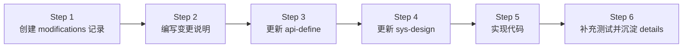
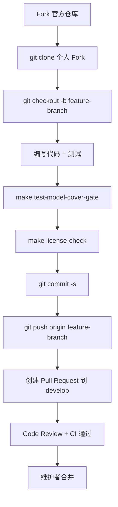

# 第三十五章 如何向壬远AI网关贡献代码

## 本章目标

本章面向希望参与壬远AI网关（Rainway AI Gateway）开源社区的后端开发者，系统说明从环境准备、代码获取、设计先行、测试覆盖到提交 Pull Request 的完整贡献流程。阅读本章后，读者将能够：

- 搭建本地开发环境并编译 `ai-gateway-api`。
- 遵循“设计先行”的六步变更方法论完成非平凡特性开发。
- 编写符合项目规范的单元测试，并保证 `model/` 层语句覆盖率不低于 70%。
- 处理跨仓库变更（AI Gateway API、BFE、Conf Agent）的协作事项。
- 使用 `make`、`license-eye` 等工具完成代码风格与合规检查。

## 开发环境搭建

壬远AI网关主要采用 Go 语言开发，控制面依赖 MySQL 与 Redis，构建依赖 `make`。建议贡献者在开始编码前准备以下环境。

### 必备工具与版本

| 工具 | 建议版本 | 说明 |
|---|---|---|
| Go | 1.22 | `ai-gateway-api/go.mod` 指定版本，BFE 与 Conf Agent 亦使用 Go |
| MySQL | 5.7+ | 控制面持久化存储 |
| Redis | 6.0+ | 配额同步、限流计数等共享状态 |
| make | GNU Make | 构建、测试、打包入口 |
| license-eye | 最新版 | Apache SkyWalking Eyes，检查/修复 License 头 |
| pre-commit | 可选 | 提交前自动执行 `gofmt` 等格式化 |

### 初始化数据库

AI Gateway API 在 `ai-gateway-api/db_ddl.sql` 中提供 MySQL 建表脚本，本地初始化命令如下：

```bash
mysql -u{user} -p{password} < ai-gateway-api/db_ddl.sql
```

若使用 SQLite，可执行 `ai-gateway-api/db_ddl_sqlite.sql`。本地启动服务示例：

```bash
cd ai-gateway-api
./ai-gateway-api -c ./conf -sc ai_gateway_api.toml -l ./log
```

默认监听 Open API 端口 `8183`、监控端口 `8284`。

### 安装 license-eye

`ai-gateway-api/Makefile` 提供自动安装目标，也可手动安装：

```bash
go install github.com/apache/skywalking-eyes/cmd/license-eye@latest
```

检查与修复 License 头的命令：

```bash
make license-check
make license-fix
```

### 验证编译

环境就绪后，在 `ai-gateway-api/` 目录执行 `make` 即可下载依赖并编译出二进制：

```bash
cd ai-gateway-api
make
```

若编译通过，当前目录会生成 `ai-gateway-api` 可执行文件。首次编译通常需要下载较多 Go module，建议在稳定的网络环境下进行。

## 代码获取与仓库结构

壬远AI网关由多个仓库组成，贡献者通常需要关注以下三个核心仓库：

| 仓库 | 角色 | 主要变更场景 |
|---|---|---|
| `rainway-ai-gateway/ai-gateway-api` | 控制面（Control Plane） | API、业务模型、配置导出、版本控制 |
| `bfenetworks/bfe` | 数据面（Data Plane） | 流量转发、AI 路由、Token 认证、限流模块 |
| `bfenetworks/conf-agent` | 配置拉取代理 | 热加载配置、下发配置到 BFE |

### Fork 与 Clone

三个仓库均采用 [Git Flow 分支模型](http://nvie.com/posts/a-successful-git-branching-model/)，日常开发在 `develop` 分支进行。贡献者应先 Fork 官方仓库，再 Clone 自己的 Fork：

```bash
git clone https://github.com/your-github-account/ai-gateway-api
cd ai-gateway-api
git remote add upstream https://github.com/rainway-ai-gateway/ai-gateway-api
```

创建本地特性分支：

```bash
git checkout -b my-cool-stuff
```

### ai-gateway-api 目录速览

```text
ai-gateway-api/
├── endpoints/          # HTTP 路由与 handler
│   ├── openapi_v1/     # 面向用户的 Open API
│   └── innerapi_v1/    # 内部 API（配置导出、GSLB 数据等）
├── model/              # 业务逻辑 Manager
│   ├── quota/
│   ├── iai_route/
│   ├── imods/
│   └── ...
├── storage/rdb/        # MySQL/SQLite DAO
├── stateful/           # 配置、DB/Redis 客户端、生命周期
├── design-docs/        # API 定义、系统设计、变更记录
│   ├── api-define/
│   ├── sys-design/
│   └── modifications/
├── Makefile
├── db_ddl.sql
└── db_ddl_sqlite.sql
```

控制面请求流为：`endpoints/` → `model/` → `storage/rdb/` → `stateful/`。新增或修改 API 时，通常需要按此顺序改动。

## 设计先行：六步变更方法论

对于非平凡的代码变更，`ai-gateway-api/design-docs/README.md` 要求遵循“六步变更方法论”，确保设计文档、接口定义与代码实现始终一致。

### 方法总览



### Step 1：创建 modifications 记录

在 `ai-gateway-api/design-docs/modifications/` 下新建目录，命名格式为：

```text
YYYYMMDD-<变更目的简述>
```

例如 `20260728-apikey-rate-limit/`。目录名应使用英文或拼音，避免特殊字符。

### Step 2：编写本次变更说明

目录中至少包含 `change-summary.md`，必要时增加：

| 文件 | 内容 |
|---|---|
| `change-summary.md` | 背景、目标、影响范围、关键决策 |
| `api-changes.md` | 新增/修改/删除的接口、字段、错误码 |
| `design-changes.md` | 数据模型、流程、算法、约束变化 |

### Step 3：更新接口定义

基于变更说明修改 `design-docs/api-define/` 下的 OpenAPI / InnerAPI 定义。Review 检查项包括：

- 接口路径、方法、参数与变更说明一致；
- 字段命名符合现有规范；
- 错误码覆盖新增失败场景；
- 不破坏已有接口兼容性（若涉及）。

### Step 4：更新系统设计

修改 `design-docs/sys-design/` 中相关文档，必要时新增 `sys-design/details/` 细节文档，并同步更新 `design-docs/sys-design/summary.md` 索引。

### Step 5：实现代码

按照“接口层 → 模型层 → 存储层”的顺序实现。`ai-gateway-api/AGENTS.md` 给出典型模式：

- Open API 变更：`endpoints/openapi_v1/<domain>/` → 注册 `endpoints/openapi_v1/endpoints.go` → `model/<domain>/` → `storage/rdb/<domain>/`。
- Inner API 变更：`endpoints/innerapi_v1/<domain>/` → `model/imods/`、`model/iversion_control/`。
- 新增 domain：`model/<domain>/` → 定义 storager 接口 → `storage/rdb/<domain>/` → 更新 `db_ddl.sql`。

在模型层实现时，应优先通过构造函数注入 `itxn.TxnStorager` 与具体 storager 接口，避免在 manager 内部直接开启事务或访问全局单例。这样既能保持业务逻辑可测试，也便于在单元测试中使用 `fakeTxn` 与手写 mock。若实现过程中发现设计需要调整，应回到 Step 3/Step 4 更新设计文档，而非直接偏离设计。

### Step 6：总结并决定是否加入长期设计文档

代码变更完成后，评估是否有可复用、可沉淀的设计知识，例如：

- 新的核心机制（配额同步、限流策略、路由规则）；
- 复杂的继承/合并逻辑（Entity 层级、模型黑白名单）；
- 关键的导出/版本控制流程。

若值得沉淀，在 `design-docs/sys-design/details/` 下新建文档，并更新 `sys-design/summary.md`。

## 单元测试组织、Mock 模式与覆盖率要求

`ai-gateway-api/TESTING.md` 定义了控制面的单元测试规范，贡献者应严格遵守。

### 测试组织

- 测试文件与被测代码同包：`xxx.go` 对应 `xxx_test.go`，位于同一目录。
- 共享 mock 写在 `mocks_test.go`。
- 单元测试不应依赖外部服务（MySQL、Redis、真实配置文件或二进制）。

示例目录结构：

```text
ai-gateway-api/model/quota/
├── entity_manager.go
├── entity_manager_test.go
└── mocks_test.go
```

### Mock 模式

项目采用**手写 callback mock**，例如 `model/quota/mocks_test.go` 中的 `fakeTxn` 与 `fakeEntityStorager`：

```go
// ai-gateway-api/model/quota/mocks_test.go
type fakeTxn struct{}

func (f *fakeTxn) AtomExecute(ctx context.Context, do func(context.Context) error) error {
    return do(ctx)
}

type fakeEntityStorager struct {
    createFn func(ctx context.Context, param *EntityParam) (int64, error)
    fetchFn  func(ctx context.Context, filter *EntityFilter) (*EntityParam, error)
}

func (s *fakeEntityStorager) CreateEntity(ctx context.Context, param *EntityParam) (int64, error) {
    if s.createFn != nil {
        return s.createFn(ctx, param)
    }
    return 0, nil
}
```

Manager 层应优先通过构造函数注入依赖，避免直接读取 `stateful.DefaultConfig` 或 `stateful.DefaultClientSet`，以便测试替换。

### 覆盖率要求

`ai-gateway-api/Makefile` 中定义 `MODEL_COVERAGE_THRESHOLD := 70`，CI 使用 `make test-model-cover-gate` 强制门禁。当前 `model/` 整体语句覆盖率约为 87.6%。

| 模块类型 | 目标覆盖率 |
|---|---|
| Manager 层核心模块 | ≥ 70% |
| 工具/纯函数模块 | ≥ 80% |

常用测试命令：

```bash
# 全部单元测试
go test ./...

# 仅 model 层
go test ./model/...

# 覆盖率门禁
make test-model-cover-gate
```

> `coverage.out` 是生成文件，不应提交到仓库。

## 集成测试

除了单元测试，壬远AI网关在 `ai-gateway-api` 与 `bfe` 两个仓库还维护着集成测试，用于验证控制面 API 与数据面转发链路的真实行为。贡献者在提交跨仓库特性时，应视情况补充对应的集成测试。

### AI Gateway API 集成测试（本地离线测试）

`ai-gateway-api/test/integration/` 是控制面的本地集成测试环境。它通过 `make build` 编译出真实的 `ai-gateway-api` 二进制运行完整的 API 测试。默认配置使用 SQLite 本地数据库与内嵌的 miniredis，无需外部 MySQL / Redis；同时支持通过配置文件切换到真实的 MySQL 与 Redis，便于在更接近生产环境的场景下回归验证。

#### 目录结构

```text
ai-gateway-api/test/integration/
├── go.mod / go.sum                # 独立 Go module，通过 replace 指向主项目
├── conf/                          # 测试专用配置（默认 SQLite + miniredis + SkipTokenValidate）
├── data/                          # 运行时数据文件（自动创建与清理）
├── testutil/                      # 测试工具包
│   ├── server.go                  # 编译/复制二进制、子进程启动/关闭管理
│   ├── client.go                  # HTTP 客户端封装
│   ├── assert.go                  # 断言函数
│   ├── fixture.go                 # 测试数据工厂
│   └── db.go                      # 数据库初始化/清理（SQLite / MySQL）
├── tests/                         # 测试用例代码 + 设计文档（按模块组织）
│   ├── api_key/
│   ├── ai_route/
│   ├── auth/
│   ├── entity/
│   ├── route_tables/
│   ├── expression_verify/
│   ├── innerapi/
│   └── ...
└── tests/schema/                  # Schema 集成测试
    ├── openapi/
    └── innerapi/
```

#### 测试环境特点

| 特点 | 说明 |
|---|---|
| 独立 Go module | `integration/go.mod` 通过 `replace github.com/rainway-ai-gateway/ai-gateway-api => ../../` 引用主项目源码，不污染生产代码 |
| 真实二进制子进程 | 使用 `exec.CommandContext` 启动 `make build` 编译出的真实二进制，覆盖完整启动链路 |
| 数据库可切换：SQLite / MySQL | 默认采用 `glebarez/go-sqlite` 纯 Go 驱动，无需 CGO，每个测试进程使用独立数据库文件（含 PID），测试结束后自动清理；修改 `conf/ai_gateway_api.toml` 亦可对接真实 MySQL |
| Redis 可切换：miniredis / Redis | 默认启动内嵌 miniredis，无需外部 Redis；修改配置后可对接真实 Redis，用于验证配额、限流等依赖 Redis 的链路 |
| 跳过认证 | 配置 `SkipTokenValidate = true`，测试请求无需真实 Token 认证 |
| 按模块组织 | 同一模块的测试代码与 `design.md` 放在同一目录，降低维护成本 |

#### 常用命令

```bash
# 在 ai-gateway-api 根目录编译二进制
make build

# 下载测试依赖
cd ai-gateway-api/test/integration
go mod tidy

# 运行全部集成测试
../scripts/run_all_tests.sh
# 或: go test -v -count=1 -timeout 300s ./tests/...

# 运行指定模块测试
../scripts/run_module_tests.sh api_key
# 或: go test -v -count=1 -timeout 120s ./tests/api_key/...

# 运行单个接口测试
go test -v -count=1 -timeout 120s ./tests/api_key/create/

# 清理运行时数据
../scripts/clean.sh
```

#### 测试代码模板

每个接口一个子目录，模块内通过 `TestMain` 共享一个服务器实例：

```go
package create

import (
    "os"
    "testing"
    "github.com/rainway-ai-gateway/ai-gateway-api/integration/testutil"
)

var sm *testutil.ServerManager

func TestMain(m *testing.M) {
    var err error
    sm, err = testutil.StartServer()
    if err != nil {
        panic("failed to start server: " + err.Error())
    }
    code := m.Run()
    sm.Shutdown()
    os.Exit(code)
}

func TestCreate_NormalCase(t *testing.T) {
    body := map[string]interface{}{"field": "value"}
    resp, err := testutil.GetClient().Post("/open-api/v1/xxx", body)
    if err != nil {
        t.Fatalf("request failed: %v", err)
    }
    testutil.AssertSuccess(t, resp)
    testutil.AssertDataFieldEquals(t, resp, "field", "value")
}
```

`testutil` 同时提供 `AssertErrCode`、`AssertListLen`、`AssertPagination` 等断言，以及 `UniqueName`、`RandomString`、`GenerateTestCert` 等辅助函数。

#### Schema 集成测试

为严格校验每个接口返回值是否符合 `design-docs/api-define` 中的定义，项目维护了一组 schema 集成测试：

```bash
# 全部 schema 测试
go test -v -count=1 -timeout 300s ./tests/schema/...

# 仅 OpenAPI schema 测试
go test -v -count=1 -timeout 300s ./tests/schema/openapi/...

# 仅 InnerAPI schema 测试
go test -v -count=1 -timeout 300s ./tests/schema/innerapi/...
```

通用校验器位于 `testutil/schema.go`，支持对象字段存在性、类型、必填字段、可选字段、嵌套对象、数组元素、枚举值以及分页结构的校验。

### BFE 集成测试（真实进程级）

`bfe/tests/integration/` 是数据面的真实进程级集成测试。与仓库中 `integration-test/` 目录不同，它仅启动真实的 `bfe` 进程，不引入 `ai-gateway-api`、`conf-agent` 等外部组件；测试所需的 BFE 配置文件直接由测试代码或静态 `testdata` 提供，请求通过真实 HTTP 发送到 BFE 监听端口，验证转发行为与后端命中统计。

#### 目录结构

```text
bfe/tests/integration/
├── common/                                    # 公共 harness
│   ├── process_env.go                         # 编译/启动/停止真实 BFE 进程
│   ├── bfe_config_builder.go                  # 生成临时 BFE 配置
│   ├── mock_backend.go                        # 本地 mock AI 后端
│   └── util.go                                # 工具函数
├── implementation/                            # Go 实现代码
│   └── scenario-SC01-route-table-lookup/
│       ├── sc01_route_table_lookup_test.go
│       └── testdata/                          # 静态 BFE 配置模板
└── 测试设计文档/                               # 中文测试设计文档
    ├── 测试场景总体说明.md
    └── scenario-SC01-路由表查找与绑定/
        ├── 场景说明.md
        └── TC-*.md
```

#### 运行方式

```bash
# 在 bfe 目录下运行全部集成测试
go test ./tests/integration/... -v

# 运行单个场景
go test ./tests/integration/implementation/scenario-SC01-route-table-lookup/... -v

# 运行单个测试例
go test ./tests/integration/implementation/scenario-SC01-route-table-lookup/ -run TestTC01 -v
```

首次运行会自动编译 `bfe` 二进制并缓存到 `bfe/tests/integration/.integration-test-bin/`。

#### 当前覆盖

| 场景 | 说明 |
|---|---|
| SC01 路由表查找与绑定 | 验证 `mod_ai_route` 在多级路由表（API-Key / Entity / Global）中的搜索与回退顺序，以及 fallback 时的 body 回绕行为 |

### 贡献集成测试时的注意事项

1. **优先补充单元测试**：单元测试仍是 CI 门禁的核心，`model/` 层语句覆盖率不得低于 70%。集成测试用于覆盖真实进程、完整链路或 schema 契约，不应替代单元测试。
2. **AI Gateway API 变更**：若新增或修改 OpenAPI / InnerAPI 接口，应在 `ai-gateway-api/test/integration/tests/` 对应模块下补充用例，并在 `tests/schema/` 中补充 schema 校验。
3. **BFE 模块变更**：若修改 `mod_ai_route`、`mod_ai_token_auth`、`mod_ai_rate_limit` 等数据面模块，应评估是否需要在 `bfe/tests/integration/` 新增场景，覆盖真实转发行为。
4. **磁盘空间**：`modernc.org/sqlite` / `glebarez/go-sqlite` 纯 Go 实现编译时需要较大临时空间，若构建失败请先检查磁盘并清理 Go 缓存：
   ```bash
   go clean -cache -testcache
   ```
5. **不要提交生成文件**：`coverage.out`、`.integration-test-bin/`、SQLite 数据库文件、WAL/SHM 文件等均不应提交到仓库。

## License 头与代码风格

壬远AI网关遵循 [Golang style guide](https://github.com/golang/go/wiki/Style)，所有 Go 源文件需包含 Apache 2.0 / Rainway AI Gateway License 头。`ai-gateway-api/Makefile` 中示例头如下：

```go
// Copyright(c) 2024 The Rainway AI Gateway (壬远AI网关) Authors. All rights reserved.
//
// Licensed under the Apache License, Version 2.0 (the "License");
// ...
```

贡献者可通过 `make license-fix` 自动修复缺失的 License 头，通过 `make license-check` 在 CI 前自查。BFE 仓库建议使用 `pre-commit` 自动执行 `gofmt`：

```bash
pip install pre-commit
pre-commit install
```

BFE 还要求提交带 `Signed-off-by:` 签名，以确认贡献者接受 [Developer Certificate of Origin](https://developercertificate.org/)。

## 提交信息规范与 PR 流程

三个核心仓库的 `CONTRIBUTING.md` 均采用 Git Flow 分支模型，PR 流程相似。本节以 `ai-gateway-api` 为例说明。

### 本地工作流



### 提交与 PR 注意事项

- 从个人 Fork 的 `feature-branch` 向官方仓库 `develop` 分支提交 PR。
- 提交前频繁同步上游：`git pull upstream develop`。
- 若修复某个 issue，在 PR 描述中写 `Fixes <issue-URL>`，合并后 GitHub 会自动关闭对应 issue。
- 指定 reviewer；如不确定，遵循 GitHub 推荐。
- 减少无意义提交，可使用 `git commit --amend` 合并小修改。
- 对 reviewer 的每条评论都要回复；若已采纳，回复“Done”；若不采纳，说明理由。
- 分支合并后可清理本地与远端分支：

```bash
git push origin :my-cool-stuff
git checkout develop
git pull upstream develop
git branch -d my-cool-stuff
```

## 跨仓库协作注意事项

AI 网关功能通常同时涉及控制面、数据面与配置下发。贡献者在设计阶段就应判断是否跨仓库，并协调修改。

| 变更范围 | 涉及仓库 | 典型文件 |
|---|---|---|
| AI 路由规则 | ai-gateway-api + bfe | `model/iai_route/`、`bfe/bfe_modules/mod_ai_route/` |
| Token 认证 | ai-gateway-api + bfe | `model/imods/`、`bfe/bfe_modules/mod_ai_token_auth/` |
| 限流策略 | ai-gateway-api + bfe | `model/quota/`、`bfe/bfe_modules/mod_ai_rate_limit/` |
| 配置下发 | ai-gateway-api + conf-agent | `endpoints/innerapi_v1/export_util/`、`conf-agent/` |

跨仓库贡献建议：

1. **先在 `ai-gateway-api` 完成设计文档**：`design-docs/modifications/`、`api-define/`、`sys-design/`。
2. **同步更新 BFE 配置格式**：若导出给数据面的 JSON/TOML 结构变化，需同步修改 `bfe/` 中对应模块的配置解析。
3. **同步更新 Conf Agent**：若配置下发路径或版本号规则变化，需在 `conf-agent/` 中同步。
4. **分别提交 PR**：每个仓库独立 PR，PR 描述中相互引用（如 `Depends on rainway-ai-gateway/ai-gateway-api#123`）。
5. **统一 reviewer**：跨仓库变更建议找同一位或同一组 reviewer，保证设计一致性。

跨仓库变更最容易出现的问题包括：控制面导出的字段名与数据面解析不一致、版本号或配置路径改动后 Conf Agent 无法识别、以及错误码或默认值在两个仓库中语义不同。设计阶段应在 `design-changes.md` 中明确数据面消费的配置格式与版本策略，并在 PR 中提供端到端验证方案。

## 完整的新手贡献示例流程

以下以 `ai-gateway-api` 仓库一次真实提交为例，演示从 0 到 PR 的完整流程。

> 参考提交：
> - Commit：`51cded34dae072b6c909a4a08f30ceb0199deea9`
> - 作者：`zhangmiao <zhangmiao@yf-networks.com>`
> - 时间：`2026-08-31`
> - 提交信息：`feat(operation-log): add operation log module and update sys-design docs; bump version to 0.0.9`
> - 变更规模：`58 files changed, 4759 insertions(+), 70 deletions(-)`

该提交为控制面新增“操作日志（Operation Log）”能力：记录 entity、api-key、provider 等配置域的写操作，并提供 `GET /open-api/v1/operation-logs` 查询接口。它不涉及 BFE 数据面，因此示例流程以单仓库控制面变更为主。

### 1. 创建变更记录

在 `ai-gateway-api/design-docs/modifications/` 下新建目录，命名格式为 `YYYYMMDD-<变更目的简述>`。一次非平凡变更至少应包含 `change-summary.md`，若涉及接口或数据模型变化，还应同时创建 `api-changes.md` 与 `design-changes.md`。

```bash
cd ai-gateway-api/design-docs/modifications
mkdir 2026-08-31-operation-log
cd 2026-08-31-operation-log
cat > change-summary.md <<EOF
# 操作日志（Operation Log）变更摘要

## 1. 背景

`ai-gateway-api` 当前仅记录 HTTP access log，缺少面向配置变更的结构化审计能力。当 entity、api-key、provider、route 等配置被修改后，无法快速回答“谁在什么时间做了什么修改、修改了哪些字段、结果如何”等问题。

## 2. 目标

- 对控制面所有会产生写操作的配置域记录操作日志，并持久化到数据库。
- 提供结构化查询接口，支持按操作人、资源类型、资源 ID、动作类型、时间范围等维度检索。
- 对 api-key token、密码、私钥等敏感字段进行脱敏，避免日志泄露。
- 采用异步批量写入，尽量降低对主业务请求的延迟影响。

## 3. 范围

| 范围 | 说明 |
|------|------|
| 涉及仓库 | `ai-gateway-api` |
| 涉及模块 | `model/ioperlog`、`storage/rdb/ioperlog`、`endpoints/openapi_v1/operation_log`、各配置域 Manager |
| 涉及接口 | 新增 `GET /open-api/v1/operation-logs`；各既有写接口内部接入操作日志记录 |
| 数据迁移 | 新增 `operation_logs` 表，无历史数据迁移 |
| 数据面影响 | 无 |

## 4. 关键决策

| 决策 | 说明 |
|------|------|
| Manager 层主动记录 | 由业务 Manager 在写操作成功后构造 `OperationLogEntry`，可携带资源 ID、名称、变更摘要等业务语义，优于纯 Middleware 解析 |
| 异步批量落库 | `OperationLogManager` 通过内存缓冲 + 后台 worker 批量写入数据库，默认 200 条或 5 秒触发一次 INSERT |
| 全量域一期接入 | 第一期即覆盖 entity、entity_type、api_key、provider、cluster、route、domain、certificate、quota_plan、rate_limit_policy、model_price、user、token 等全部配置域 |
| 失败操作一并记录 | 写操作失败时同样记录日志（`status = 2`），保留失败审计证据 |
| 敏感字段统一脱敏 | 提供 `maskSensitiveFields` 工具函数，对 token、密码、私钥等字段进行掩码或排除 |
| 查询接口仅对管理员开放 | 先按系统管理员权限控制；待权限体系重构后，再按 entity 维度细化 |

## 5. 关联文档

- `design-docs/modifications/2026-08-31-operation-log/api-changes.md`
- `design-docs/modifications/2026-08-31-operation-log/design-changes.md`
EOF
```

`change-summary.md` 是后续讨论和 review 的入口，建议写清楚背景、目标、范围与关键决策，避免 reviewer 从代码中反推设计意图。若变更涉及接口契约或字段变更，`api-changes.md` 应详细列出新增/修改/删除的接口、请求响应字段与错误码；若涉及数据模型、流程或算法变更，`design-changes.md` 应给出表结构、状态机、调用链路或关键算法说明。

### 2. 更新 api-define 与 sys-design

参考提交中的设计文档更新包括：

- 在 `design-docs/api-define/` 中补充 `GET /open-api/v1/operation-logs` 的接口定义（请求参数、响应字段、错误码、权限控制）。
- 在 `design-docs/sys-design/summary.md` 中索引新增的操作日志设计文档。
- 在 `design-docs/sys-design/details/` 中新增或更新相关细节说明，例如异步缓冲、批量写入、脱敏规则、降级策略、监控指标等。

### 3. 实现控制面代码

按接口层 → 模型层 → 存储层顺序实现。参考提交涉及的关键文件如下：

- **接口层**
  - `endpoints/openapi_v1/operation_log/endpoints.go`：注册 endpoint。
  - `endpoints/openapi_v1/operation_log/list.go`：实现 `GET /open-api/v1/operation-logs` handler。
  - `endpoints/openapi_v1/endpoints.go`：将新 endpoint 注册到全局路由表。

- **模型层**
  - `model/ioperlog/types.go`：定义 `OperationLogEntry`、`OperationLogFilter`、`OperationLogQueryResult` 等类型。
  - `model/ioperlog/storager.go`：定义 `OperationLogStorager` 接口。
  - `model/ioperlog/manager.go`：实现 `OperationLogManager`，包括异步 `Record`、同步 `RecordSync`、`QueryLogs`、后台 worker 批量 INSERT 等。
  - `model/ioperlog/mask.go`：实现敏感字段脱敏工具函数。
  - 各配置域 Manager（如 `model/entity/entity_manager.go`、`model/api_key/api_key.go` 等）：在写操作成功后调用 `OperationLogManager.Record()`。

- **存储层**
  - `storage/rdb/ioperlog/operation_log.go`：实现 `OperationLogStorager`。
  - `storage/rdb/internal/dao/table_operation_logs.go`：新增 `TOperationLog*` 辅助函数。
  - `db_ddl.sql` / `db_ddl_sqlite.sql`：新增 `operation_logs` 表及索引。

- **容器初始化**
  - `stateful/container/components.go` 与 `stateful/container/rdb/components.go`：初始化 `OperationLogStorager` 与 `OperationLogManager`，并将其注入到各配置域 Manager。

- **版本号**
  - `version/version.go`：如有版本发布节奏，同步更新版本号。

### 4. 编写单元测试

参考提交中，单元测试与被测代码同包，覆盖核心逻辑与边界场景：

```text
model/ioperlog/
├── manager.go
├── manager_test.go       # 测试异步缓冲、批量写入、队列满降级、优雅关闭 flush
├── mask.go
└── mask_test.go          # 测试敏感字段脱敏规则

model/entity/
├── entity_manager.go
├── entity_manager_test.go
└── operation_log_test.go # 验证写操作后是否正确调用 OperationLogManager.Record()
```

测试应关注：

- `model/ioperlog` 语句覆盖率需达到 70% 以上。
- 验证异步缓冲、批量写入、队列满降级、优雅关闭 flush 等行为。
- 验证所有接入域的 Manager 在写操作后正确调用 `OperationLogManager.Record()`。
- 验证 api-key token、密码、私钥等敏感字段脱敏效果。

### 5. 编写集成测试例

控制面接口变更应补充 SQLite 离线集成测试。参考提交在 `ai-gateway-api/test/integration/tests/operation_log/` 下新增了设计文档与测试代码：

```text
test/integration/tests/operation_log/
├── design.md             # 测试用例设计（接口列表、参数说明、场景设计）
└── list/
    └── list_test.go      # GET /open-api/v1/operation-logs 接口测试
```

典型测试代码结构：

```go
package list

import (
    "os"
    "testing"

    "github.com/rainway-ai-gateway/ai-gateway-api/integration/testutil"
)

var sm *testutil.ServerManager

func TestMain(m *testing.M) {
    var err error
    sm, err = testutil.StartServer()
    if err != nil {
        panic("failed to start server: " + err.Error())
    }
    code := m.Run()
    sm.Shutdown()
    os.Exit(code)
}

func TestListOperationLogs_NormalCase(t *testing.T) {
    resp, err := testutil.GetClient().Get("/open-api/v1/operation-logs?page=1&page_size=20")
    if err != nil {
        t.Fatalf("request failed: %v", err)
    }
    testutil.AssertSuccess(t, resp)
    testutil.AssertPagedListSchema(t, resp, "list", "pagination")
}
```

若变更涉及数据面转发逻辑，还应在 `bfe/tests/integration/` 新增或扩展场景，验证真实 BFE 进程在路由、认证、限流等规则下的转发行为。

### 6. 本地验证

```bash
cd ai-gateway-api

# 1. 单元测试与覆盖率门禁
make test-model-cover-gate

# 2. License 头检查
make license-check

# 3. 运行新增集成测试
cd test/integration
go test -v -count=1 -timeout 120s ./tests/operation_log/...
```

由于本次变更不涉及 BFE 数据面，无需在 `bfe/` 目录执行构建验证；若变更跨仓库，则需在对应仓库分别运行构建与测试。

### 7. 提交 PR

单仓库变更只需在 `ai-gateway-api` 提交一个 PR。提交信息可参考真实提交：

```text
feat(operation-log): add operation log module and update sys-design docs; bump version to 0.0.9
```

PR 描述中应说明：

- 变更背景与目标（可引用 `change-summary.md`）。
- 主要改动点（接口、模型、存储、测试、设计文档）。
- 测试覆盖情况（单元测试、集成测试）。
- 是否涉及数据面或 Conf Agent（本次不涉及）。

PR 合并后清理本地与远端分支：

```bash
git push origin :feature-operation-log
git checkout develop
git pull upstream develop
git branch -d feature-operation-log
```

## 提交前自查清单

在点击“Create Pull Request”之前，建议对照以下清单完成最后一轮检查：

- [ ] 已在 `design-docs/modifications/` 下创建本次变更目录并填写说明。
- [ ] 若涉及 API 变更，`design-docs/api-define/` 已更新并通过 review。
- [ ] 若涉及架构或数据模型变更，`design-docs/sys-design/` 与 `summary.md` 已同步。
- [ ] 代码已按“接口层 → 模型层 → 存储层”顺序实现，且与设计文档一致。
- [ ] 新增或修改的 manager 已补充单元测试，`make test-model-cover-gate` 通过。
- [ ] 全部单元测试 `make test` 通过（至少覆盖改动相关包）。
- [ ] `make license-check` 通过，或已运行 `make license-fix`。
- [ ] 未提交生成文件（如 `coverage.out`、二进制、`.exe`）。
- [ ] 提交信息包含 `Signed-off-by:`（BFE 仓库要求）。
- [ ] PR 描述清晰，关联 issue（如有），并指定 reviewer。

## 本章小结

向壬远AI网关贡献代码需要同时关注代码质量与设计文档一致性。核心要点如下：

- 本地环境以 Go 1.22、MySQL、Redis、make 为基础，配合 license-eye 完成 License 头检查。
- 非平凡变更必须遵循 `design-docs/README.md` 的六步方法论，先写设计文档再写代码。
- 单元测试使用同包测试 + 手写 callback mock，Manager 层覆盖率不得低于 70%。
- 代码风格遵循 Golang style guide，新文件必须包含 License 头。
- PR 从个人 Fork 的 feature 分支指向官方 `develop` 分支，注意 `Signed-off-by:` 与 reviewer 沟通。
- AI 路由、Token 认证、限流、配置导出等功能通常跨仓库，需同步更新 `ai-gateway-api`、`bfe` 与 `conf-agent`。

遵循上述流程，既能保证个人贡献顺利通过 CI 与 Code Review，也能维护整个项目长期可维护的架构与文档体系。

## 参考文档

- `ai-gateway-api/CONTRIBUTING.md` — 贡献流程与代码风格
- `ai-gateway-api/TESTING.md` — 单元测试规范、mock 模式、覆盖率要求
- `ai-gateway-api/AGENTS.md` — 控制面架构与常见修改模式
- `ai-gateway-api/design-docs/README.md` — 六步变更方法论
- `ai-gateway-api/Makefile` — 构建、测试、License 检查目标
- `bfe/CONTRIBUTING.md` — BFE 数据面贡献流程
- `conf-agent/CONTRIBUTING.md` — Conf Agent 贡献流程
