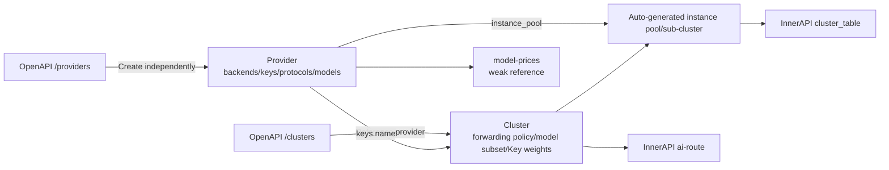
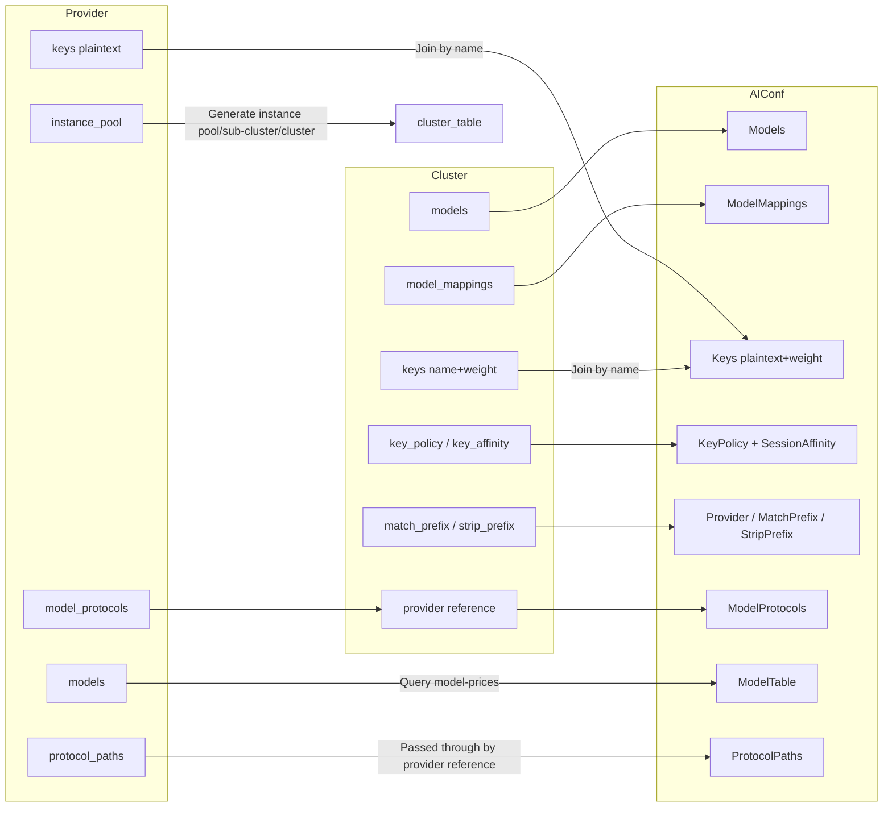

# Chapter 10: Provider and Cluster Design

## Chapter Goals

In the Control Plane of Rainway AI Gateway, the model Provider and the forwarding Cluster used to be two faces of the same `/clusters` resource. This chapter explains why these two concepts were split apart, and what responsibilities each takes on after the split. After reading this chapter, you will be able to:

- Understand the data models of Provider and Cluster and the meaning of their fields.
- Understand the design motivation, implementation, and benefits of decoupling the two.
- Understand how the Control Plane generates the `AIConf` required by the BFE Data Plane from Provider + Cluster.
- Learn about key mechanisms such as model discovery, Key references and weights, Key Policy, and Key Affinity.
- Understand the semantics, validation rules, and Data Plane execution of `protocol_paths` protocol path rewriting.
- Write practical configurations that conform to the specification.

## Provider Design Goals and Data Model

### Design Goals

A Provider answers the questions "who is the downstream, which models can be accessed, how to authenticate, and where the backends are." It consolidates the provider-related fields previously scattered across clusters into an independent resource, with the following design goals:

- **Identity and capability declaration**: A Provider holds metadata such as name, description, supported model list, model access protocols (`model_protocols`), and model discovery endpoint (`model_endpoint`).
- **Authentication consolidation**: A Provider is the sole holder of API-Key plaintext; clusters reference it only by `name` and no longer expose key content.
- **Backend instance consolidation**: A Provider maintains an `instance_pool`, allowing multiple clusters to reuse the same set of backend addresses.
- **Independent lifecycle**: A Provider can be created, updated, and deleted independently; before deletion, the Control Plane checks whether any cluster references it.

### Data Model

The JSON representation of a Provider is as follows (see `ai-gateway-api/design-docs/api-define/OpenAPI接口定义/providers.md` for field details):

```json
{
    "name": "deepseek",
    "description": "DeepSeek official API",
    "model_endpoint": {
        "schema": "https",
        "uri": "/v1/models"
    },
    "models": ["deepseek-chat", "deepseek-coder"],
    "keys": [
        {"name": "key-primary", "key": "sk-aaaaaaaaaaaa"},
        {"name": "key-secondary", "key": "sk-bbbbbbbbbbbb"}
    ],
    "instance_pool": [
        {"addr": "api.deepseek.com", "weight": 100, "port": 443}
    ],
    "model_protocols": ["openai"],
    "time_zone": "Asia/Shanghai",
    "tiers": [
        {
            "name": "peak",
            "time_ranges": [
                {"weekdays": [1,2,3,4,5], "start": "09:00", "end": "12:00"},
                {"weekdays": [1,2,3,4,5], "start": "14:00", "end": "18:00"}
            ]
        }
    ],
    "create_time": 1716883200,
    "update_time": 1716883200
}
```

Key field descriptions:

- `name`: The unique identifier of a Provider, globally unique.
- `model_endpoint`: The model discovery endpoint, defaulting to `{schema: "https", uri: "/v1/models"}`.
- `models`: The list of models supported by this provider; it can be maintained manually or backfilled by the model discovery interface.
- `keys`: A list of API-Keys, each containing a `name` and the plaintext `key`. The `name` is used for cluster references.
- `instance_pool`: The backend instance pool, containing at least one instance, and at least one instance must have `weight > 0`.
- `model_protocols`: The supported model access protocols; the initial enum values are `openai` and `anthropic`.
- `protocol_paths`: Optional. A declarative mapping of protocol -> upstream base path, used to rewrite the standard entry `/v1/...` to the provider's native prefix; see "Protocol Path Rewriting" below.
- `time_zone` / `tiers`: Used for peak/off-peak price matching; only the `peak` tier is supported initially.

## Cluster Design Goals and Data Model

### Design Goals

A Cluster answers the questions "how traffic is forwarded, which models are used, and how key weights are distributed." After Provider and Cluster are decoupled, a Cluster focuses on forwarding semantics:

- **Routing and forwarding policy**: Includes BFE cluster parameters such as timeouts, retries, session stickiness, and passive health checks.
- **Model selection**: Declares the models this cluster can forward via `llm_config.models`, which must be a subset of the owning provider's `models`.
- **Key weights and policy**: References keys in the provider via `llm_config.keys` and configures weights; controls selection policy and retry backoff via `key_policy`; controls session-level Key affinity via `key_affinity`.
- **Prefix handling**: Handles model name prefixes of aggregated providers (such as OpenRouter) via `match_prefix` and `strip_prefix`.

### Data Model

The JSON representation of a Cluster is as follows (see `ai-gateway-api/design-docs/api-define/OpenAPI接口定义/clusters.md` for field details):

```json
{
    "name": "my-cluster",
    "description": "Example cluster",
    "basic": {
        "protocol": "http",
        "connection": {"max_idle_conn_per_rs": 0, "cancel_on_client_close": false},
        "retries": {"max_retry_in_cluster": 2},
        "buffers": {"req_write_buffer_size": 512},
        "timeouts": {
            "timeout_conn_serv": 50000,
            "timeout_response_header": 50000,
            "timeout_readbody_client": 30000,
            "timeout_read_client_again": 30000,
            "timeout_write_client": 60000
        }
    },
    "sticky_sessions": {"enabled": false, "hash_strategy": "CLIENT_IP_ONLY", "hash_header": ""},
    "passive_health_check": {"interval": 1000, "failnum": 3, "host": "", "uri": "/", "statuscode": 0},
    "llm_config": {
        "models": ["deepseek-chat", "deepseek-coder"],
        "model_mappings": [
            {"source_model": "gpt-4", "target_model": "deepseek-chat"}
        ],
        "keys": [
            {"name": "key-primary", "weight": 70},
            {"name": "key-secondary", "weight": 30}
        ],
        "key_policy": {
            "strategy": "weighted_random",
            "max_retries": 3,
            "retry_backoff_initial": 500,
            "retry_backoff_max": 5000
        },
        "key_affinity": {
            "enabled": true,
            "ttl": 600,
            "redis_prefix": "bfe:ai:key_affinity",
            "penalty_enable": true
        },
        "provider": "deepseek",
        "match_prefix": "deepseek/",
        "strip_prefix": true
    }
}
```

Key field descriptions:

- `name`: The cluster name, globally unique.
- `basic`: Basic parameters for connection, retries, timeouts, and buffers. For example, `connection.max_idle_conn_per_rs` controls the number of idle long connections each BFE instance maintains per RS; `timeouts` controls timeouts for connecting to the backend, reading response headers, reading request bodies, etc.; `retries.max_retry_in_cluster` controls the number of retries within the same cluster.
- `sticky_sessions`: Session stickiness configuration. Disabled when `enabled=false`; when enabled, sessions can be kept based on the `CLIENT_IP_ONLY`, `CLIENT_ID_ONLY`, or `CLIENT_ID_PREFERED` strategy; using a `CLIENT_ID_*` strategy requires specifying `hash_header`.
- `passive_health_check`: Passive health check configuration. When the number of consecutive forwarding failures reaches `failnum`, BFE probes the downstream RS at the `interval` period until it recovers. When `host` is empty, the `addr` of the first instance of the owning provider is used by default.
- `llm_config`: The AI LLM service configuration; must include `provider`, and `models` must be a subset of the owning provider's `models`.
- `llm_config.keys`: Only `name` and `weight` are kept; `name` must reference an existing key in the provider.
- `llm_config.key_policy`: Multi-Key selection policy and retry backoff; currently `strategy` only supports `weighted_random`.
- `llm_config.key_affinity`: Session-level Key affinity based on Redis + `ClientKeyId`.

## Why Provider and Cluster Are Decoupled, and the Benefits

### Pain Points Before Decoupling

In the early `/clusters` resource, the responsibilities of Provider and Cluster were mixed:

- `/clusters` described both the downstream model provider identifier, backend instance pool, model endpoint, and API-Key plaintext, and BFE cluster parameters such as routing/forwarding policy, connection timeouts, and health checks.
- When the same provider was referenced by multiple clusters, `instance_pool`, `keys`, and `model_endpoint` had to be configured repeatedly.
- The cluster API exposed API-Key plaintext, and provider keys could not be reused by reference.
- The `provider` field of `model-prices` had unclear semantics, and the strong reference relationship rigidified configuration ordering.
- When adding new provider types or protocols, the cluster model kept growing.

### Architecture After Decoupling

The diagram below shows the relationship between Provider and Cluster after decoupling:



In this architecture:

- A Provider is the "capability provider"; a Cluster is the "forwarding policy."
- A Cluster strongly references a Provider via `llm_config.provider`.
- When the Control Plane creates a Cluster, it automatically generates instance pools and sub-clusters from the Provider's `instance_pool` and binds them to the cluster.
- `model-prices` associates with a Provider by name only as a weak reference, which does not block deletion.

### Core Benefits

| Benefit | Description |
|---------|-------------|
| Separation of responsibilities | Provider = "who I am, which models I can access, what my backends and keys are"; Cluster = "how I forward, which models I use, how key weights are distributed." |
| Independent lifecycle | A Provider can be created, updated, and deleted independently; a Cluster obtains backend capabilities by reference. |
| Data security | A Cluster no longer stores key plaintext; it references keys in the Provider only by name. |
| Transparent to BFE | The configuration generated for BFE keeps the original structure; the change is only a "provider → legacy config" conversion inside the Control Plane. |
| Weakly referenced model-prices | The `provider` field of `/model-prices` no longer strongly references `/providers`, reducing configuration ordering constraints. |
| Reduced duplicate configuration | When the same provider is referenced by multiple clusters, the backend instance pool and keys need to be maintained in only one place. |

### Lifecycle and Referential Integrity

After Provider and Cluster are decoupled, each has its own independent lifecycle, but the Control Plane must maintain referential integrity at key operation points to avoid configuration inconsistency.

**Reverse validation on Provider updates**

When `PATCH /providers/{provider_name}` is called to modify `instance_pool`, `keys`, or `models`, the Control Plane performs the following validations:

- `instance_pool` changes: The instance pools generated for all clusters referencing this provider are refreshed in sync (except EPP sub-clusters).
- `keys` deletion/rename: It is validated that no cluster still references the old key name; otherwise `409 Conflict` is returned.
- `models` deletion: It is validated that no cluster still references a model that has been removed; otherwise `409 Conflict` is returned.

These validations are implemented by registering hooks with `ProviderManager.UpdateProvider` via `model/icluster_conf/ClusterManager`, including `ProviderInstancePoolSyncer`, `ProviderKeyRefChecker`, and `ProviderModelRefChecker`.

**Provider deletion**

Before deleting a provider, the Control Plane must verify that the provider is not referenced by any `/clusters`. A provider of the same name in `/model-prices` is no longer a blocking condition, because the relationship between them is a weak reference.

**Cluster deletion**

When deleting a cluster, the system first checks whether the cluster is referenced by AI routing rules (global / entity / api-key level); if so, the deletion fails with `409 Conflict`. After passing the reference check, the system automatically cascades the cleanup of associated sub-clusters and instance pools.

**Name constraint on update APIs**

For both `PATCH /providers/{provider_name}` and `PATCH /clusters/{cluster_name}`, the request body must not contain the `name` field. The name is uniquely specified by the URI path parameter; if the request body carries `name`, the API returns `422 Unprocessable Entity`.

## AIConf Generation

The configuration structure consumed by the BFE Data Plane remains consistent with the pre-refactoring structure. The Control Plane merges the data of Providers and Clusters via `model/icluster_conf/exporter.go` to generate the final `AIConf`. The diagram below shows the generation process:



The generation sources of each field are as follows:

| BFE Configuration Item | Source (New Model) |
|------------------------|--------------------|
| Instance pool / sub-cluster / cluster | Cluster + Provider.instance_pool |
| `AIConf.Models` | `cluster.llm_config.models` |
| `AIConf.ModelMappings` | `cluster.llm_config.model_mappings` |
| `AIConf.Keys` | `provider.keys` (key plaintext) joined by name with `cluster.llm_config.keys` (weight) |
| `AIConf.KeyPolicy` | `cluster.llm_config.key_policy` + `cluster.llm_config.key_affinity` |
| `AIConf.Provider` | `cluster.llm_config.provider` |
| `AIConf.MatchPrefix` / `StripPrefix` | `cluster.llm_config.match_prefix` / `strip_prefix` |
| `AIConf.ModelProtocols` | `provider.model_protocols` passed through by the cluster's provider reference |
| `AIConf.ProtocolPaths` | `provider.protocol_paths` passed through by the cluster's provider reference |
| `AIConf.ModelTable` | Auto-populated by querying `model-prices` from the provider |

### Automatic Population of ModelTable

`ModelTable` is not exposed in the OpenAPI `/clusters` endpoint; it is populated automatically via InnerAPI based on `provider` and then delivered to BFE. Based on the provider name referenced by the cluster, the Control Plane queries the corresponding (model, mode) price records in `model-prices` and populates them as a model price table recognizable by BFE.

### MatchPrefix and StripPrefix

These two fields are mainly used in aggregated provider scenarios. For example, OpenRouter uniformly adds an `openrouter/` prefix to model names:

- `match_prefix`: Used for routing matching, e.g., `openrouter/`.
- `strip_prefix`: When `true`, the prefix is removed from the request's `model` field before forwarding downstream; when `false`, it is only used as a routing identifier and not stripped.

When `strip_prefix=true`, `match_prefix` is required, must be non-empty, and must end with `/`.

### ModelProtocols

`ModelProtocols` comes from the Provider's `model_protocols`; the Control Plane passes it through to `AIConf` according to the cluster's `provider` reference. BFE uses it to determine the request protocol style (such as the OpenAI-compatible format or the Anthropic Messages API).

The data plane validates every cluster's `AIConf.ModelProtocols` at both startup load and hot reload: `validateClusterModelProtocols` in `bfe_server/bfe_confdata_load.go` calls `bfe_model_protocol.ValidateProtocols`, requiring every protocol in the list to be registered in the `bfe_model_protocol` adapter registry (built-in: `openai`, `anthropic`). If any unknown protocol name appears, the load or hot reload fails, reporting which cluster's configuration is invalid. An empty list is valid and treated as the default `["openai"]`. The design of the protocol adapter layer is covered in [Chapter 7: Data Plane Forwarding Design: BFE](./chapter07-data-plane-design.md).

### Protocol Path Rewriting (protocol_paths)

Different providers (and different protocols of the same provider) use different upstream path prefixes: Bailian exposes OpenAI compatibility under `/compatible-mode/v1` and Anthropic compatibility under `/apps/anthropic`; Kimi Code membership uses `/coding/v1` and `/coding`; Volcano Ark pay-as-you-go uses `/api/v3` and `/api/compatible`. By default the BFE Data Plane forwards upstream paths unchanged, so without this feature clients must send requests using each provider's native path, and a single client SDK configuration (uniformly hitting the standard entry `/v1/...`) cannot be reused across providers.

For this reason, the Provider carries an optional field `protocol_paths`: a declarative mapping of protocol -> upstream base path. The semantic convention: `protocol_paths[protocol]` is the path part of that protocol's official SDK `base_url` — `openai` includes the `/v1` tail (`/compatible-mode/v1`, `/api/v3`, `/coding/v1`); `anthropic` does not (`/apps/anthropic`, `/coding`, `/anthropic`, since the Anthropic SDK appends `/v1/messages` itself). The configured value can be copied directly from the base_url column of the provider's official documentation.

At forwarding time, BFE rewrites the upstream path according to the detected request protocol; the two protocol branches follow different rules. The anthropic branch still recognizes only the standard entry: `/v1/messages` -> `{anthropic value}/v1/messages`. The openai branch first strips the optional `/v1` version prefix (`/v1/chat/completions` and `/chat/completions` are equivalent) and then consults the shared OpenAI endpoint table in `bfe_basic` (`openAIEndpointModes` in `bfe_basic/openai_endpoint.go`): a path that hits the endpoint table is rewritten to `{openai value} + stripped path`, e.g., both `/v1/chat/completions` and `/chat/completions` rewrite to `/compatible-mode/v1/chat/completions`; a custom path that misses the endpoint table passes through unchanged. When `protocol_paths` is unconfigured or has no entry for the protocol, the path is likewise forwarded unchanged; pseudo-standard entries such as `/v10/xxx` are never rewritten in either branch. The rewrite only changes the URL path of the outbound request: it does not touch the request/response body or the host/scheme, and the gemini protocol does not enter `protocol_paths` (its native path is already the standard path and pass-through works).

Control Plane validation: the key must be `openai` or `anthropic` already declared in `model_protocols`; the value must start with `/`, must not end with `/`, must not contain `..`/`?`/`#`, and must be at most 128 characters. For export, `provider.protocol_paths` is passed through unchanged to `AIConf.ProtocolPaths` by the cluster's provider reference (same pattern as `ModelProtocols`; clusters do not hold path configuration separately, keeping a single source of truth). BFE additionally validates the key whitelist and value format at load time as a safety net, rejecting invalid configurations.

Reference values for common providers:

| Provider | protocol_paths |
|----------|----------------|
| Bailian DashScope | `{"openai": "/compatible-mode/v1", "anthropic": "/apps/anthropic"}` |
| Kimi Open Platform (api.moonshot.cn) | `{"openai": "/v1", "anthropic": "/anthropic"}` |
| Kimi Code Membership (api.kimi.com) | `{"openai": "/coding/v1", "anthropic": "/coding"}` |
| DeepSeek | `{"openai": "/v1", "anthropic": "/anthropic"}` |
| Volcano Ark · Pay-as-you-go | `{"openai": "/api/v3", "anthropic": "/api/compatible"}` |
| Volcano Ark · Coding Plan | `{"openai": "/api/coding/v3", "anthropic": "/api/coding"}` |

Two caveats: on some providers the path carries billing semantics (Volcano `/api/v3` pay-as-you-go vs `/api/coding` subscription), so a subscription Key mistakenly configured with a pay-as-you-go prefix will be billed incorrectly — verify the Key type against the path when configuring; and the model discovery endpoint (`model_endpoint`) is not derived from `protocol_paths` — for example, Anthropic-protocol model discovery on Bailian requires manually configuring `/apps/anthropic/v1/models`.

The execution details and fallback recomputation semantics are covered in [Chapter 7: Data Plane Forwarding Design: BFE](./chapter07-data-plane-design.md).

## Model Discovery

Model Discovery is an auxiliary capability of a Provider, used to automatically probe the list of models supported by a third-party AI provider, reducing manual maintenance costs.

### Triggering

It is triggered via the OpenAPI endpoint `POST /providers/tools/discover-models`. This endpoint is a stateless tool interface that does not directly read or write Provider resources. After returning the model name list, the caller needs to call `PATCH /providers/{provider_name}` to backfill the result into the Provider's `models` field.

### Input Parameters

| Parameter | Description |
|-----------|-------------|
| `model_protocol` | Model access protocol, required, enum: `openai`, `anthropic` |
| `schema` | Request protocol, required, `http` or `https` |
| `addr` | Target instance address |
| `port` | Target instance port |
| `uri` | Model list API URI, default `/v1/models` |
| `apikey` | API Key for calling the model list API |

### Execution Flow

1. If `uri` is empty, `/v1/models` is used by default; construct the request URL: `{schema}://{addr}:{port}{uri}`.
2. If `apikey` is non-empty, generate the authentication header according to `model_protocol`:
   - `openai`: `Authorization: Bearer {apikey}`
   - `anthropic`: `x-api-key: {apikey}`
3. Call the third-party model list API with the authentication header.
4. Select the corresponding response parser according to `model_protocol` and extract the model name list.
5. Return the model name list.

A failed model discovery does not affect the normal operation of existing clusters; administrators can still maintain `models` manually.

## Key References and Weights, Key Policy, and Key Affinity

### Key References and Weights

After decoupling, a Cluster no longer holds API-Key plaintext; instead, it references keys in the Provider via `llm_config.keys`:

```json
"keys": [
    {"name": "key-primary", "weight": 70},
    {"name": "key-secondary", "weight": 30}
]
```

Rules:

- `name` must correspond to an existing name in the provider's `keys`.
- `name` must be unique within the same `keys` array.
- `weight` ranges in `[0,100]`; `0` means the Key receives no traffic (equivalent to disabled).
- The sum of the `weight` of all Keys must equal `100`.

### Key Policy

`key_policy` controls the selection policy and retry backoff when multiple Keys are used:

```json
"key_policy": {
    "strategy": "weighted_random",
    "max_retries": 3,
    "retry_backoff_initial": 500,
    "retry_backoff_max": 5000
}
```

Field descriptions:

- `strategy`: The Key selection policy; currently only `weighted_random` is supported. BFE performs weighted random selection based on `weight`.
- `max_retries`: The total number of additional retries within the current request for this cluster, not the retry count for a single Key. When a Key fails due to a network error or backend rate limiting, BFE can switch to another Key within the retry limit.
- `retry_backoff_initial` / `retry_backoff_max`: The initial backoff time and maximum backoff time, in milliseconds. The actual backoff time is usually computed with exponential backoff, but does not exceed `retry_backoff_max`, and must satisfy `retry_backoff_max >= retry_backoff_initial`.

Key Policy works together with Key Affinity: Affinity ensures that the same client prefers to use the same Key, while Policy provides retry and switching capability when a Key fails.

### Key Affinity

`key_affinity` provides session-level Key affinity based on Redis + `ClientKeyId`, ensuring that the same client keeps using the same Key for a period of time, which facilitates quota management and fault isolation.

```json
"key_affinity": {
    "enabled": true,
    "ttl": 600,
    "redis_prefix": "bfe:ai:key_affinity",
    "penalty_enable": true
}
```

Field descriptions:

- `enabled`: Whether to enable session-level Key affinity.
- `ttl`: The binding idle timeout, in seconds; after a binding is hit, BFE refreshes the TTL, and the binding persists as long as requests continue.
- `redis_prefix`: The Redis key prefix.
- `penalty_enable`: Whether to enable Key penalty; when `true`, Keys that have recently returned 429/401/403 are skipped.

Key Affinity is ultimately mapped to the `SessionAffinity*` related fields of `AIConf` and delivered to BFE.

## Configuration Examples

### Configuration Order

It is recommended to configure in the following order:

```
/providers → /model-prices → /clusters → routing rules
```

The relationship between `/model-prices` and `/providers` is a weak reference, so in practice `/model-prices` can be written without waiting for the `/providers` data to be ready.

### Creating a Provider

```bash
curl -X POST "http://api-server:8183/api/v1/providers" \
  -H "Content-Type: application/json" \
  -d '{
    "name": "deepseek",
    "description": "DeepSeek official API",
    "model_endpoint": {"schema": "https", "uri": "/v1/models"},
    "models": ["deepseek-chat", "deepseek-coder"],
    "keys": [
        {"name": "key-primary", "key": "sk-aaaaaaaaaaaa"},
        {"name": "key-secondary", "key": "sk-bbbbbbbbbbbb"}
    ],
    "instance_pool": [
        {"addr": "api.deepseek.com", "weight": 100, "port": 443}
    ],
    "model_protocols": ["openai"]
}'
```

### Creating a Cluster

```bash
curl -X POST "http://api-server:8183/api/v1/clusters" \
  -H "Content-Type: application/json" \
  -d '{
    "name": "my-cluster",
    "description": "Example cluster",
    "llm_config": {
        "models": ["deepseek-chat", "deepseek-coder"],
        "model_mappings": [
            {"source_model": "gpt-4", "target_model": "deepseek-chat"}
        ],
        "keys": [
            {"name": "key-primary", "weight": 70},
            {"name": "key-secondary", "weight": 30}
        ],
        "key_policy": {
            "strategy": "weighted_random",
            "max_retries": 3,
            "retry_backoff_initial": 500,
            "retry_backoff_max": 5000
        },
        "key_affinity": {
            "enabled": true,
            "ttl": 600,
            "redis_prefix": "bfe:ai:key_affinity",
            "penalty_enable": true
        },
        "provider": "deepseek",
        "match_prefix": "deepseek/",
        "strip_prefix": true
    }
}'
```

### Triggering Model Discovery

```bash
curl -X POST "http://api-server:8183/api/v1/providers/tools/discover-models" \
  -H "Content-Type: application/json" \
  -d '{
    "model_protocol": "openai",
    "schema": "https",
    "addr": "api.deepseek.com",
    "port": 443,
    "uri": "/v1/models",
    "apikey": "sk-aaaaaaaaaaaa"
}'
```

Example response:

```json
{
    "ErrNum": 200,
    "ErrMsg": "success",
    "Data": {
        "models": ["deepseek-chat", "deepseek-coder", "deepseek-reasoner"]
    }
}
```

## Chapter Summary

This chapter detailed the design of Provider and Cluster in Rainway AI Gateway.

- **Provider** describes the identity, model list, API-Key plaintext, backend instance pool, and model access protocols of a downstream model provider; it is the "capability provider."
- **Cluster** describes the forwarding policy, including model subsets, Key references and weights, Key Policy, Key Affinity, timeouts/retries/health checks, etc.; it is the "forwarding policy."
- **Decoupling benefits**: clearer responsibilities, less duplicate configuration, clusters no longer expose key plaintext, transparent to BFE, and weak references between model-prices and provider.
- **AIConf generation**: The Control Plane joins the data of Providers and Clusters by name to generate the instance pools, sub-clusters, `AIConf.Keys`, `AIConf.ModelTable`, `AIConf.ModelProtocols`, and other fields required by BFE.
- **Model discovery**: Probes the third-party model list via `/providers/tools/discover-models` and then backfills it into the Provider.
- **Key mechanisms**: A Cluster references the Provider's keys by `name` and sets weights; `key_policy` controls the selection policy and retry backoff; `key_affinity` provides Redis-based session-level Key affinity.

Understanding the boundary between Provider and Cluster is the foundation for correctly configuring Rainway AI Gateway and achieving flexible scheduling across multiple model providers.

## References

- `ai-gateway-api/design-docs/sys-design/details/provider与cluster概念分离.md`
- `ai-gateway-api/design-docs/api-define/OpenAPI接口定义/providers.md`
- `ai-gateway-api/design-docs/api-define/OpenAPI接口定义/clusters.md`
- `ai-gateway-api/design-docs/api-define/InnerAPI接口定义/cluster-table.md`
- `ai-gateway-api/design-docs/api-define/InnerAPI接口定义/ai-route.md`
- [Chapter 6: Control Plane Core Design: AI Gateway API](./chapter06-control-plane-design.md)
- [Chapter 20: Provider Configuration](../operation/chapter20-provider-and-model-config.md)
- [Chapter 21: Cluster Configuration](../operation/chapter21-cluster-and-route-config.md)
- [Chapter 31: mod_ai_route Implementation](../implementation/chapter31-mod-ai-route.md)
