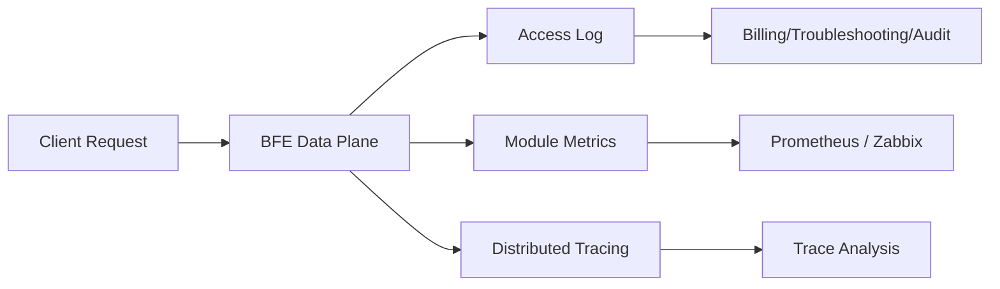

# Chapter 15: Observability Design

## Chapter Goals

An AI Gateway carries a large volume of large-model call traffic, and the request path involves multiple stages: authentication, routing, rate limiting, quota deduction, upstream forwarding, and streaming responses. An anomaly in any of these stages can affect downstream business and cause billing disputes. This chapter introduces the observability system of the Rainway AI Gateway and helps readers understand the following questions:

- How the three pillars of observability (logs, metrics, and traces) are implemented in the AI Gateway;
- Which AI-specific fields are included in the BFE Data Plane access logs, and how these fields are collected;
- Which key monitoring metrics should be tracked, covering route hits, quota hits, and rate limit triggers;
- How to integrate BFE with monitoring systems such as Prometheus and Zabbix;
- The classification of the AI Gateway error code system and troubleshooting approaches;
- Recommended alert configurations based on logs and metrics;
- The reporting system design of "one query API and four storage backends" (MySQL / Doris / ClickHouse / StarRocks) and the data pipeline differences of each form;
- The capabilities and key design of the built-in report query API (`/report/*`): query-layer abstraction, minute-level aggregation, partition management, and four-backend capability alignment.

After reading this chapter, readers should be able to independently plan, configure, and troubleshoot the observability solution of the AI Gateway.

## The Three Pillars of Observability

The industry typically divides observability into three pillars: Logs, Metrics, and Traces. The Rainway AI Gateway has made targeted designs for all three pillars in both the Data Plane (BFE) and the Control Plane (AI Gateway API).

### Logs

Logs are used to record the complete lifecycle of every request. The BFE Data Plane outputs key information about each stage of a request — authentication, routing, forwarding, and billing — through the Access Log, enabling downstream troubleshooting, billing reconciliation, and security auditing. AI-specific fields uniformly occupy field numbers 701-900 of the `bfe-access-pb` protocol, covering dimensions such as authentication, routing, rate limiting, quota, cache, mirror, intent, context compression, token metering, and cost; the full set of observable fields is in `bfe/docs/zh_cn/sys_design/ai_access_log_fields.md`.

### Metrics

Metrics are used to quantify system operation status and support trend analysis and threshold-based alerting. Each BFE AI module exposes counter-style monitoring items, such as `REQ_TOTAL` (total requests), `REQ_HIT_APIKEY` (requests hitting apikey routes), and `REQ_HIT_ENTITY` (requests hitting entity routes). These metrics can be collected by systems such as Prometheus and Zabbix through BFE's built-in monitoring interface.

### Traces

Traces are used to depict the complete call path of a request in a distributed system. Although the current BFE access log already records fields such as `ai_cluster_key_names` to reflect the clusters and keys a request has tried, for scenarios that require cross-service latency bottleneck analysis, it is recommended to extend with distributed tracing frameworks such as OpenTelemetry. Traces complement logs and metrics, forming a three-dimensional observability capability.



## BFE Access Log Fields and AI-Specific Fields

When BFE serves as an AI Gateway, the access log no longer contains only traditional HTTP fields (such as status code, response size, and latency); it also appends a series of AI-specific fields. These fields are carried by the AI context in `bfe_basic.Request` and are ultimately assembled and output by `mod_access_pb3`.

### Field Number Planning

AI observability fields uniformly occupy field numbers 701-900 of `bfe-access-pb`, divided into multiple sub-ranges by purpose:

| Number Range | Purpose |
|----------|------|
| 701 - 713 | Fields in use, such as API Key identifier, model name, token counts, rate limit hits |
| 714 - 760 | Model and request basic information, such as provider, protocol, stream, retry, cache |
| 761 - 800 | Token and cost metering, including regular token/cost, cache/audio/image/video metering sub-items, as well as cache hit status, semantic cache, and context compression fields |
| 801 - 840 | Routing, transformation, plugins, and intent, such as route rule hits, cluster/key attempt lists, and intent classification results |
| 841 - 880 | Security, compliance, privacy, and traffic mirroring, such as hit/rejected Quota Plan IDs and mirror hit/target cluster |
| 881 - 900 | Vendor extensions and reserved |

### Core AI Access Log Fields

The following table lists the most commonly used fields in daily troubleshooting and billing reconciliation:

| Field Name | Number | Type | Description | Collection Module |
|--------|------|------|------|----------|
| `ai_apikey_id` | 701 | string | Internal identifier of the API Key (`key_id`); the raw key value is not recorded | `mod_ai_token_auth` |
| `ai_apikeytags` | 702 | repeated | Entity hierarchy tags associated with the API Key | `mod_ai_token_auth` |
| `ai_requested_model` | 703 | string | Original model name requested by the client | `bfe_server/http_conn.go` |
| `ai_target_model` | 704 | string | Target model name after gateway routing/mapping | `bfe_server/reverseproxy.go` |
| `ai_stream` | 705 | bool | Whether it is a streaming response | `bfe_basic.Request.IsSse` |
| `ai_input_tokens` | 706 | int64 | Number of input tokens | `mod_ai_token_auth` / `mod_body_process` |
| `ai_output_tokens` | 707 | int64 | Number of output tokens | `mod_ai_token_auth` / `mod_body_process` |
| `ai_total_tokens` | 708 | int64 | Total token consumption | `mod_ai_token_auth` |
| `ai_ttft_us` | 709 | int64 | Time to first token (microseconds), streaming only | `mod_body_process` |
| `ai_tpot_us` | 710 | int64 | Average output token latency (microseconds), streaming only | `mod_body_process` |
| `ai_rate_limit_hits` | 711 | repeated | List of triggered rate limit policies | `mod_ai_rate_limit` |
| `ai_auth_reject_reason` | 712 | string | Authentication rejection reason | `mod_ai_token_auth` |
| `ai_auth_reject_quota_plans` | 713 | repeated | List of Quota Plan IDs with insufficient balance at rejection | `mod_ai_token_auth` |
| `ai_provider` | 714 | string | Upstream model provider identifier | `bfe_server/reverseproxy.go` |
| `ai_retry_count` | 715 | uint32 | Number of key-level retries at the model invocation layer | `bfe_server/reverseproxy.go` |
| `ai_mode` | 716 | string | AI request mode, such as `chat`, `image_generation` | `bfe_server/http_conn.go` |
| `ai_protocol` | 717 | string | AI protocol/auth style, such as `openai`, `anthropic` | `bfe_basic.GetApiKey` / `bfe_server/reverseproxy.go` |
| `ai_cost_value` | 761 | int64 | Estimated cost (fixed-point integer, RMB precision is 1e-8 yuan) | `mod_ai_token_auth` |
| `ai_cost_currency` | 762 | string | Cost currency, such as `RMB` / `USD` | `bfe_server/reverseproxy.go` |
| `ai_route_rule_hits` | 801 | repeated | List of hit AI routing rules | `mod_ai_route` |
| `ai_cluster_key_names` | 802 | repeated | List of (cluster, key) pairs tried during request processing | `bfe_server/reverseproxy.go` |
| `ai_auth_hit_quota_plans` | 841 | repeated | List of Quota Plan IDs hit by normal requests | `mod_ai_token_auth` |

It is worth emphasizing that `ai_apikey_id` in the access log only records the internal identifier of the API Key and never the raw key value, thereby avoiding leakage of sensitive information. The raw key is still kept in memory for injection into upstream requests, but it is never written to the logs.

In addition to the core fields listed above, the 781-788 sub-range of the 761-800 range is used for metering sub-items, covering cache, audio, image, and video generation scenarios:

| Field Name | Number | Type | Description |
|--------|------|------|------|
| `ai_cache_read_tokens` | 781 | int64 | Tokens read from cache (already included in `ai_input_tokens`) |
| `ai_cache_write_tokens` | 782 | int64 | Tokens written to cache (independent add-on item) |
| `ai_audio_input_tokens` | 783 | int64 | Audio input tokens (already included in `ai_input_tokens`) |
| `ai_audio_output_tokens` | 784 | int64 | Audio output tokens (already included in `ai_output_tokens`) |
| `ai_image_count` | 785 | int64 | Number of images generated (image_generation mode) |
| `ai_image_input_tokens` | 786 | int64 | Image input tokens (already included in `ai_input_tokens`) |
| `ai_video_count` | 787 | int64 | Number of videos generated (video_generation mode) |
| `ai_cache_write_1h_tokens` | 788 | int64 | Tokens written to the 1h-TTL cache (already included in `ai_cache_write_tokens`) |

`ai_image_input_tokens` and `ai_video_count` depend on `bfe-access-pb` v0.3.5. Their collection logic is located in `reqAiInfoGen()` of `bfe_modules/mod_access_pb3/request_log.go`; the values come from `ImageInputTokens` and `VideoCount` of `bfe_basic.TokenUsage`, which are filled by `mod_ai_token_auth` when parsing the usage in the response phase. `ai_cache_write_1h_tokens` depends on `bfe-access-pb` v0.3.6 and is used for cost-tiered metering of 1h-TTL cache writes.

### Cache, Context Compression, Intent, and Mirror Fields

Beyond the metering sub-items, the access log also records the processing results of gateway-level AI enhancement capabilities, for troubleshooting and report drill-down.

Fields related to `mod_ai_cache` (exact cache and semantic cache) and `mod_ai_context` (context compression):

| Field Name | Number | Type | Description | Collection Module |
|--------|------|------|------|----------|
| `ai_cache_status` | 789 | string | Cache status: `hit` / `hit_semantic` / `miss` / `skip`; empty when caching is not enabled | `mod_ai_cache` |
| `ai_cache_key` | 790 | string | Cache key; recorded only when debug is enabled, and not recorded by default to avoid log bloat | `mod_ai_cache` |
| `ai_cache_semantic` | 791 | bool | Semantic cache hit flag; true when the hit comes from the semantic cache (`hit_semantic`) | `mod_ai_cache` |
| `ai_cache_similarity` | 792 | double | Normalized similarity [0,1] of the semantic hit; not written when no semantic retrieval was performed | `mod_ai_cache` |
| `ai_context_compress_status` | 793 | string | Context compression status: not triggered / trimmed / rewritten / skipped (with reason code) / rolled back | `mod_ai_context` |
| `ai_context_tokens_before` | 794 | int64 | Estimated token count before compression | `mod_ai_context` |
| `ai_context_tokens_after` | 795 | int64 | Estimated token count after compression | `mod_ai_context` |
| `ai_context_compress_mode` | 796 | string | The compression tier that took effect | `mod_ai_context` |

Fields related to `mod_ai_intent` (intent classification). These record the classification result of the first intent question actually consumed by routing, and are recorded whether or not a match occurs:

| Field Name | Number | Type | Description | Collection Module |
|--------|------|------|------|----------|
| `ai_intent_question` | 803 | string | Name of the first intent question actually consumed by routing; empty when the intent was not evaluated | `mod_ai_intent` |
| `ai_intent_answer` | 804 | string | The answer option for that question; `unknown` when below the confidence threshold | `mod_ai_intent` |
| `ai_intent_confidence` | 805 | double | Post-gating answer confidence (for calibrating MinConfidence) | `mod_ai_intent` |
| `ai_intent_source` | 806 | string | Answer source: `explicit_header` / `classifier` / `cache` | `mod_ai_intent` |
| `ai_intent_latency_us` | 807 | int64 | Classification latency (microseconds); written only when greater than 0 | `mod_ai_intent` |
| `ai_intent_cache_hit` | 808 | bool | Intent answer hit the in-process cache; written true only for the cache source | `mod_ai_intent` |
| `ai_intent_questions_version` | 809 | string | Version of the intent question configuration (for configuration rollback tracing) | `mod_ai_intent` |

The access log of `mod_traffic_mirror` (traffic mirroring) records only fields that are synchronously available. Latency, tokens, and other asynchronous execution metrics of mirroring are exposed by the module's private Prometheus registry and are not written back to the access log:

| Field Name | Number | Type | Description | Collection Module |
|--------|------|------|------|----------|
| `mirror_hit` | 842 | bool | Whether the request was mirrored (recorded true as soon as submission succeeds) | `mod_traffic_mirror` |
| `mirror_cluster` | 843 | string | Name of the mirror target cluster | `mod_traffic_mirror` |

Among the above fields, 10 columns — `ai_cache_status` (789), the seven `ai_intent_*` fields (803-809), and `mirror_hit` / `mirror_cluster` (842/843) — are registered and written to the reporting database by log-reader `mod_log_mysql`. The MySQL detail table `bfe_ai_request_log` has 99 columns, with column order identical to the ai-gateway-api `db_ddl_report_mysql.sql`; `ai_cache_key` / `ai_cache_semantic` / `ai_cache_similarity` (790-792) and the four `ai_context_*` fields (793-796) are visible only at the access-log layer and do not land in the reporting database. On the Kafka side, the default field set of `mod_kafka` is aligned with the MySQL write columns (92 fields); among them, `ai_intent_confidence` / `ai_intent_latency_us` / `ai_intent_cache_hit` are proto optional numerics that output JSON `null` when not evaluated, semantically consistent with NULL on the MySQL side.

### Zero-Value Semantics of Duration Fields

The five duration fields of the access log — `ClusterServeTime` / `BackendServeTime` / `WriteClientTime` / `SessionOffsetTime` / `ProxyDelayTime` — are all funneled through `durationMsUint32` in `bfe_modules/mod_access_pb3/request_log.go`: when either endpoint is a zero time or the difference is negative, the value is written as 0.

`ProxyDelayTime` (`proxy_delay_time`) measures the proxy delay from "request fully read" to "first byte from the backend". Its end timestamp `Stat.BackendFirst` is only set when the request actually invoked a backend; for requests that end without any backend call — auth rejection (401), no route (404), redirect, or connection close — it stays zero. A naive uint32 millisecond conversion of the negative difference "real timestamp − zero timestamp" wraps into a garbage value on the order of 2.1 billion milliseconds (observed: 2217714954, about 25 days), which exceeds the MySQL INT column limit (2147483647) and makes log-reader's `mod_log_mysql` fail the entire batch INSERT of access logs. `durationMsUint32` guards all five fields with an IsZero + non-negativity double check: durations with no backend call or a negative difference are emitted as 0, so downstream MySQL / Doris writes and billing reconciliation are unaffected by dirty data.

### Subset Semantics of Responses API Cache Metering

For the Responses API, `input_tokens` already includes `cached_tokens` (`total_tokens = input_tokens + output_tokens`, consistent with the total-input semantics of Chat Completions / Gemini). The protocol adaptation layer (`ParseOpenAIUsageFields` in `bfe/bfe_model_protocol/utils/usage_parse.go`) takes `input_tokens` directly as `PromptTokens` for the Responses chain without stacking cache sub-items on top — in the access log, `ai_input_tokens` is the total input and `ai_cache_read_tokens` is its subset. The Anthropic protocol differs: its `input_tokens` counts only fresh (cache-missing) tokens and excludes `cache_read_input_tokens` / `cache_creation_input_tokens`, so the adaptation layer (`ParseAnthropicUsageFields`) keeps the additive normalization (`PromptTokens = input_tokens + cache_read + cache_creation`) to align with the total-input semantics of OpenAI's `prompt_tokens`. The two accounting conventions are unified at the parsing layer, so downstream billing splits and reports do not need to distinguish protocols.

### Control Plane Operation Logs (Audit Data Source)

The access log captures the request lifecycle of the Data Plane, while every configuration change in the Control Plane (AI Gateway API) is recorded by the Operation Log module, forming an audit observability data source. The Control Plane records every configuration change via the `operation_logs` module and exposes the query interface `GET /open-api/v1/operation-logs` (see [Appendix 1: OpenAPI Quick Reference](../appendix/appendix01-openapi-quick-reference.md) for the interface definition).

Write operations on each resource (covering create/update/delete on modules such as `/entities`, `/api-keys`, `/providers`, `/clusters`, `/routes`, `/global-route-rules`, `/certificates`, `/quota-plans`, `/model-prices`, and `/auth`) automatically produce an operation log entry upon success or failure; no write interface is exposed at the API layer. Each log entry records:

- Operator information: `operator_type` (user/token), `operator_id`, `operator_name`;
- Resource information: `action` (create/update/delete/reset/import/bind/unbind), `resource_type`, `resource_id`, `resource_name`, `resource_parent_id`;
- Execution result: `status` (1 success / 2 failed), with `error_msg` attached on failure;
- Change summary: `change_summary`, including the content before and after the change (`before`/`after`) and the list of changed fields (`diff_keys`); sensitive fields such as API-Key tokens, passwords, and certificate private keys are masked;
- Request context: `request_path`, `request_method`, `client_ip`, `user_agent`, and `created_at`.

Operation logs are stored in the `operation_logs` table of the Control Plane database. The `log_id` is consistent with the LogID in the BFE access log, so audit scenarios can query by operator, resource, time range, and other criteria with pagination, enabling two-way tracing between "configuration changes" and "request behavior".

## Key Monitoring Metrics

Each BFE AI module collects and exposes key metrics at runtime. The following tables summarize the main monitoring items of `mod_ai_route` and `mod_ai_rate_limit`.

### Routing Module Monitoring Items

`mod_ai_route` routes requests to different backend clusters and models based on AI routing rules. Its monitoring items are as follows:

| Monitoring Item | Description |
|--------|------|
| `REQ_TOTAL` | Total number of requests |
| `REQ_HIT_APIKEY` | Number of requests hitting apikey routes |
| `REQ_HIT_ENTITY` | Number of requests hitting entity routes |
| `REQ_HIT_GLOBAL` | Number of requests hitting global routes |
| `REQ_MISS` | Number of requests that hit no route |
| `REQ_FALLBACK` | Number of requests hitting fallback |

By examining the ratio of `REQ_HIT_*` to `REQ_MISS`, operators can quickly determine whether the routing rule configuration is reasonable; `REQ_FALLBACK` reflects the trigger frequency of the fallback route, and an excessively high value indicates that upstream clusters or rule priorities need adjustment.

### Rate Limit and Quota Monitoring Items

`mod_ai_rate_limit` supports Redis-based distributed rate limiting, with TPM, RPM, and max concurrency limits configurable by dimensions such as product and apikey. Although the module documentation does not list monitoring item names one by one, combining the `ai_rate_limit_hits` log field with the BFE module framework, the following metrics deserve attention:

| Metric Category | Description |
|----------|------|
| Rate limit trigger count | Total number of rate limit triggers per policy and per dimension (RPM/TPM/concurrency) |
| Rate limit rejection ratio | Ratio of requests returning 429 to total requests |
| Quota hit count | Number of Quota Plans hit by normal requests, corresponding to `ai_auth_hit_quota_plans` |
| Quota rejection count | Number of requests rejected due to insufficient balance or expiration, corresponding to `ai_auth_reject_quota_plans` |
| Token consumption rate | Rate of `ai_total_tokens` aggregated by model, provider, and apikey |
| TTFT / TPOT percentiles | Time to first token and average output token latency of streaming responses |

It is recommended to aggregate the above metrics by dimensions such as `product`, `apikey_id`, `model`, and `provider`, so that problematic tenants or models can be quickly located in multi-tenant scenarios.

## Prometheus / Zabbix Integration

### BFE Monitoring Interface

The BFE Data Plane has a built-in monitoring interface that exposes module monitoring data through configuration by default. Prometheus can collect these metrics via HTTP pull; Zabbix can collect data via HTTP agent type monitoring items or custom scripts.

### Prometheus Integration Example

Add a scrape configuration for BFE in `prometheus.yml`:

```yaml
scrape_configs:
  - job_name: 'bfe-ai-gateway'
    static_configs:
      - targets: ['bfe-node-1:8421', 'bfe-node-2:8421']
    metrics_path: /monitor/metrics
    scrape_interval: 15s
```

After collection, the following alert rules can be defined in Prometheus:

```yaml
groups:
  - name: ai_gateway_alerts
    rules:
      - alert: AIRouteMissRateHigh
        expr: rate(bfe_mod_ai_route_req_miss[5m]) / rate(bfe_mod_ai_route_req_total[5m]) > 0.05
        for: 2m
        labels:
          severity: warning
        annotations:
          summary: "AI route miss rate too high"

      - alert: AIRateLimitTriggered
        expr: rate(bfe_mod_ai_rate_limit_rejected[5m]) > 0
        for: 1m
        labels:
          severity: info
        annotations:
          summary: "AI rate limit policy triggered"
```

### Zabbix Integration Example

In Zabbix, you can create a monitoring item of type `HTTP agent`:

| Configuration Item | Example Value |
|--------|--------|
| Name | BFE AI REQ_TOTAL |
| Type | HTTP agent |
| Key | bfe.req_total |
| URL | `http://{HOST.IP}:8421/monitor/metrics` |
| Update interval | 30s |
| Preprocessing | Regex match `bfe_mod_ai_route_REQ_TOTAL\s+(\d+)` |

For complex metric parsing, you can also use Zabbix UserParameter to call a local script that converts the BFE monitoring interface output into a format acceptable to Zabbix Sender.

## Reporting System: One Query API and Four Storage Backends

Logs and metrics solve "data collection"; reporting solves "data consumption". In the traditional pipeline, access logs only become readable dashboards after passing through three external components: Kafka, Doris, and Grafana — too heavy for small-scale or private deployments, while a standalone MySQL cannot carry large log volumes. For this reason, the Rainway AI Gateway reporting system adopts a design of "one report API and console pages, four storage backends": the query layer and the frontend stay unchanged, and `[Report].Backend` switches among `mysql` / `doris` / `clickhouse` / `starrocks` (when absent, the report module stays unassembled and `/report/*` returns 404).

| Item | `mysql` (lightweight form) | `doris` (standard form) | `clickhouse` (standard form) | `starrocks` (standard form) |
|----|---------------------|---------------------|--------------------------|-------------------------|
| Data pipeline | BFE access logs → log-reader `mod_log_mysql` → MySQL | BFE access logs → log-reader `mod_kafka` → Kafka → Doris Routine Load | BFE access logs → log-reader `mod_kafka` → Kafka → Kafka engine table + consuming MV | BFE access logs → log-reader `mod_kafka` → Kafka → StarRocks Routine Load |
| Detail table | MySQL `bfe_ai_request_log` (99 columns) | Doris `bfe_ai_request_log` (UNIQUE KEY) | ClickHouse `bfe_ai_request_log` (MergeTree) | StarRocks `bfe_ai_request_log` (DUPLICATE KEY, 102 columns) |
| Pre-aggregation | Built-in minute-level aggregation JOB in AI Gateway API | Doris-side INSERT JOB | ClickHouse-side materialized view (minute buckets) | StarRocks-side async materialized view (refreshed every minute) |
| Presentation | Console report pages (`/report/*`) | Console report pages + Grafana Dashboard | Console report pages | Console report pages |
| External dependencies | MySQL only | Kafka + Doris (+ Grafana optional) | Kafka + ClickHouse | Kafka + StarRocks |
| Applicable scenarios | Small-scale / private deployments, recommended for up to ~1M log entries per day | Large-scale deployments | Large-scale deployments | Large-scale deployments |

The aggregation table is unified across the four backends at 40 dimensions + 24 metrics. Drill-down dimensions include `ai_cache_status` / `mirror_hit` / `ai_intent_answer` (cache, mirror, intent), with identical semantics on the Doris / ClickHouse / StarRocks sides. The detail tables share the name `bfe_ai_request_log`, with column sets aligned to the log-reader output fields (the MySQL side has 99 columns including 10 cache/mirror/intent columns; the Doris / StarRocks sides have 3 additional flattened rate-limit columns for 102 columns total; `ARRAY<STRUCT>`-like nested columns are carried as JSON text columns on the MySQL / StarRocks sides, for detail display only and never used as filter conditions).

### Connection and Backend-Specific Configuration

- **mysql**: connects directly to a local or intranet MySQL reporting database. It is the only form that enables in-process aggregation and partition management — `EnableAggregateJob` / `AggregateIntervalSec` / `RetentionDays` / `EnablePartitionMgmt` take effect only for this form.
- **doris**: connects via the Doris FE MySQL-protocol port (9030 by default), `Driver = "mysql"`. The DSN must explicitly set `Net = "tcp"` (when Net is empty, the driver's `FormatDSN` drops the address segment and falls back to `127.0.0.1:3306`) and `AllowNativePasswords = true` (Doris FE authenticates with `mysql_native_password`), and it is recommended to explicitly enable `InterpolateParams = true` to use the text protocol. It is a query-only backend: minute-level aggregation is maintained by the Doris INSERT JOB, and JOB configuration items such as `EnableAggregateJob` do not apply to this form.
- **clickhouse**: `Driver = "clickhouse"` (clickhouse-go/v2 stdlib driver, native TCP protocol); `Addr` points to the native TCP port 9000, not the HTTP port 8123. It is a query-only backend: minute-level aggregation is maintained by ClickHouse materialized views.
- **starrocks**: connects via the StarRocks FE MySQL-protocol port (9030 by default), `Driver = "mysql"`. The DSN requires the same three keys as Doris (`Net = "tcp"`, `AllowNativePasswords = true`, `InterpolateParams = true`), of which `InterpolateParams = true` is mandatory: the StarRocks FE COM_STMT binary row packets have an encoding defect when JSON columns are adjacent to NULL columns, so the reporting side settles on the text-protocol workaround, and the accompanying go-sql-driver upgrade to v1.9.3 fixes the NULL bitmap misalignment at the root. Minute-level aggregation is maintained by the async materialized view. StarRocks and Doris have mutually exclusive ports and cannot be deployed on the same host.

The official components of the standard form (ai-gateway-observability repository) are named as follows: on the Doris side, the database `bfe_observability` is created, containing the detail table `bfe_ai_request_log` and the minute-aggregation table `bfe_ai_metrics_1m`; details are loaded from Kafka via the Routine Load `bfe_ai_log_load`, and minute pre-aggregation is done on the Doris side by the INSERT JOB `bfe_ai_metrics_1m_job`; Grafana uses a MySQL-protocol connection to the Doris FE query port (9030 by default) as its data source, with the dashboard configured as `grafana/dashboards/bfe-ai-gateway-observability.json`. On the ClickHouse side, `clickhouse/setup.sh` creates the database and five kinds of objects in six steps: the detail table (MergeTree, 7-day TTL), the Kafka engine staging table, the consuming materialized view (flattens JSON into the detail table), the aggregation table (SummingMergeTree), and the aggregation materialized view (minute buckets); the Kafka consumer groups for detail and aggregation are `clickhouse_bfe_ai_log`. On the StarRocks side, `starrocks/setup.sh` creates in four steps the database, the detail table (DUPLICATE KEY), the async materialized view `bfe_ai_metrics_1m` (`REFRESH ASYNC EVERY (INTERVAL 1 MINUTE)` — the name is the report query contract name), and the Routine Load `bfe_ai_log_load`; the consumer group is `starrocks_bfe_ai_log`. Deployment guides for the three sides are in `doris/docs/user/HOWTO.md`, `clickhouse/docs/user/HOWTO.md`, and `starrocks/docs/user/HOWTO.md`; table designs are in the `docs/design/TABLE_DESIGN.md` of each directory; Grafana panels and SQL are in `grafana/docs/design/DASHBOARD_DESIGN.md`; and the PB-field → log-reader-JSON-field mapping is in `api/depends_api/req_log.md`.

Key design trade-offs of the four pipelines:

- **The plugin writes directly to the database, without routing through the Control Plane**. log-reader is deployed with BFE in the Data Plane, and the availability of the log pipeline must not depend on the release and load of the Control Plane (AI Gateway API). Access logs are the highest-throughput data stream of the Data Plane; relaying them through the API would create a convergence bottleneck. This is consistent with the existing convention of `mod_kafka` writing directly to Kafka.
- **Same-name, same-column table design**. The detail tables of the four backends share the same name, with column sets aligned to the same set of log-reader output fields. The query API returns identically structured responses for each backend, differing only in the presence of optional fields (e.g., MySQL provides no percentiles).
- **Idempotent writes**. The unique key `(hostid, log_time, ai_apikey_id, ai_requested_model)` is enforced differently on each side: on the MySQL side, writes use `INSERT ... ON DUPLICATE KEY UPDATE` overwrite semantics, so log-reader redeliveries or `-b` re-reads produce no duplicates; on the Doris / StarRocks sides, the Routine Load guarantees by message offset; on the ClickHouse side, the consumption pipeline is at-least-once, and the query side falls back on dimensional aggregation.
- **One landing form per cluster**. If multiple landing forms are enabled for the same cluster, the reports become inconsistent due to their respective data-gap windows. Multiple storage backends can be deployed in parallel against the same Kafka topic for grayscale comparison, but production environments should follow "one landing form per cluster".
- **Schema-first**. The DDL of the two report tables (detail table + minute aggregation table) is released before the plugin is enabled: for the MySQL form, it is released with the ai-gateway-api repository (`db_ddl_report_mysql.sql`); for the Doris / ClickHouse / StarRocks forms, it is released from the ai-gateway-observability repository (the `sqls/` directories and `setup.sh`). The deployment pipeline creates the tables before enabling the log-reader plugin; the plugin itself provides no auto table creation.
- **Least-privilege accounts**. The log-reader write account holds only INSERT/UPDATE on the target table (overwrite needs UPDATE), with no DDL/DELETE. The AI Gateway API query account needs only SELECT on query-only backends (Doris / ClickHouse / StarRocks); for the MySQL form it additionally needs INSERT/DELETE on the aggregation table, DELETE on the detail table (non-partitioned fallback cleanup), and ALTER TABLE (partition management).

## Report Query API Design

The report query API is provided by AI Gateway API, mounted uniformly under `/open-api/v1/report/*`. Its metric definitions are aligned with the existing Grafana Dashboard panels (QPS, error rate, token throughput, average/percentile latency, cost, etc.). The same API and console pages work regardless of whether the backend is MySQL, Doris, ClickHouse, or StarRocks.

### Endpoint Overview

| Endpoint | Function | Description |
|------|------|------|
| `GET /report/overview` | Overview metric cards | Total requests, error rate, token totals, average/percentile latency, TTFT/TPOT, cost (by currency), rate limit hits, auth rejections, plus three metric groups: cache (hit/miss/skip counts, hit rate, read/write tokens), mirror (hit count), and intent (classified/unrecognized counts and unrecognized ratio) |
| `GET /report/timeseries` | Time series | Bucketed series per `metric` (`qps`/`tokens`/`latency`/`ttft`/`tpot`/`cost`/`cache_tokens`); `cache_tokens` splits into two series by `kind` (`cache_read`/`cache_write`); the optional `dimension` parameter splits series by cache/mirror/intent dimensions (`ai_cache_status`/`mirror_hit`/`ai_intent_answer`, each point carrying a `name` to distinguish dimension values); buckets computed server-side by window (≤6h→1min, ≤3d→5min, ≤7d→30min) |
| `GET /report/rankings` | TopN rankings | Rankings by dimension (model/requested model/provider/API Key/host/status code/protocol/mode/cache status/mirror/intent answer), default 10, up to 50 |
| `GET /report/distribution` | Ratio distribution | Pie chart data for status code, protocol, mode, stream flag, cache status, mirror, and intent answer; empty values normalized to `unknown` |
| `GET /report/logs` | Log detail pagination | Detail-row projection (field names identical to table column names), supporting `err_only`, `keyword` fuzzy match, and exact filters `cache_status`/`mirror_hit`/`intent_question`/`intent_answer`/`intent_source`, ordered by `log_time` descending |

Common conventions: `start`/`end` are Unix seconds with a maximum 7-day window; filters such as `models`, `apikey_ids`, `providers`, `hosts`, `stream`, and `status_codes` can be combined; all endpoints require `FeatureReport + ActionReadAll` (System scope grants it to administrators; Product scope reserves `Read` for tenant self-service usage reports). Metric definitions: `cache.hit_rate = hit/(hit+miss)`, with `skip` excluded from the denominator; `intent` counts the intents actually consumed by routing (not the classification volume of all configured questions), and `unknown` is an answer below the confidence threshold.

### Query-Layer Abstraction and Four Backends

The query layer defines a `ReportStorager` interface (`Overview`/`TimeSeries`/`Rankings`/`Distribution`/`Logs`), with one implementation per backend (`storage/mysqlreport`, `storage/dorisreport`, `storage/clickhousereport`, `storage/starrocksreport`), switched by `[Report].Backend`. `ReportManager` (`model/ireport`) only performs parameter binding validation (go-playground/validator convention), window and enum validation, bucket calculation, and metric definition constants (error rate = `error_count/request_count`; TTFT/TPOT aggregated over streaming requests only); it contains no SQL. SQL dialect differences (time-bucket functions, percentile functions) of the four backends are encapsulated in the respective implementations:

- **Capability gating**: the `Capabilities()` method of `ReportStorager` returns `BackendCaps` (backend identifier + supported dimension set). Before querying, dimension support is validated against the declaration, so an "empty report" is never misread as "no data". The four backends have been aligned to the full dimension set; the gating is retained as defense-in-depth for future dimension extensions.
- **Percentile degradation**: MySQL has no native percentile functions; `latency_p50/p90/p99` fields are always absent, and the frontend degrades accordingly. The Doris, ClickHouse, and StarRocks backends return full percentiles.
- **Timezone-neutral rendering**: DATETIME → Unix seconds uniformly uses `TIMESTAMPDIFF(SECOND, '1970-01-01 00:00:00', col)` arithmetic (no timezone interpretation), avoiding offsets caused by session timezone — log-reader stores UTC wall-clock, and all backends use the same convention.

### Division of Labor for Minute-Level Aggregation

The aggregation table `bfe_ai_metrics_1m` is unified at 40 dimensions + 24 metrics, with drill-down dimensions consistent across the Doris / ClickHouse / StarRocks sides:

- **MySQL form**: without a scheduled aggregation capability from an external data warehouse, pre-aggregation is performed by JOBs embedded in AI Gateway API (see the next section); the other three forms do not start local JOBs.
- **Doris form**: minute-level aggregation is performed by the Doris INSERT JOB `bfe_ai_metrics_1m_job`, which aggregates the previous minute's detail rows into the minute table every minute.
- **ClickHouse form**: minute-level aggregation is performed by the aggregation materialized view; `toStartOfMinute(log_time)` naturally aligns to UTC whole minutes, writing into the aggregation table with second-level latency.
- **StarRocks form**: minute-level aggregation is performed by the async materialized view `bfe_ai_metrics_1m` (`REFRESH ASYNC EVERY (INTERVAL 1 MINUTE)`), with 1–2 minutes end-to-end latency; the MV name is the report query contract name, so queries are unaware of it.

### Background JOBs of the MySQL Form (Lightweight Form Only)

MySQL lacks Doris's scheduled INSERT aggregation, so pre-aggregation is performed by JOBs embedded in AI Gateway API (the other three forms do not start these JOBs):

- **Minute aggregation JOB**: on each `AggregateIntervalSec` cycle (default 60s), it writes the previous full minute's detail rows into the aggregation table `bfe_ai_metrics_1m` (40 dimensions + 24 metrics, including the three cache/mirror/intent drill-down dimensions `ai_cache_status` / `mirror_hit` / `ai_intent_answer`, with the same dimension set as the Doris / ClickHouse / StarRocks aggregation tables) via `GROUP BY` over 40 dimensions. The write uses a "DELETE time window + INSERT SELECT" single transaction, making window replays idempotent. Multi-replica deployments use MySQL `GET_LOCK('report_agg_job', 0)` to elect a single runner. Process restarts do not backfill historical windows (accepting a ≤1-minute gap, symmetric with the Doris INSERT JOB semantics).
- **Partition management JOB**: inspects every 6 hours, pre-creates partitions 3 days ahead, and DROPs partitions older than `RetentionDays` (default 7 days); it automatically falls back to batched `DELETE ... LIMIT` when the target table is non-partitioned. Partitions must exist before data arrives (MySQL has no dynamic partitioning; writes to a missing partition fail outright), so the JOB pre-creates them immediately at startup.
- **DDL ownership**: the DDL of both tables is released from the ai-gateway-api repository, because it has the widest schema dependency surface (the aggregation JOB reads by column, partition management executes ALTER, and detail queries) and is the only repository in the codebase with a MySQL DDL management tradition.

### log-reader Write Resilience (mod_log_mysql / mod_kafka)

The availability of the reporting pipeline depends on log-reader writing continuously. For MySQL failures, mod_log_mysql adopts a resilience design of "long-running process + background reconnect + prioritized backfill":

- **Startup connection tolerance**: when MySQL is temporarily unreachable, the process does not exit; `connSupervisor` keeps retrying in the background at `ConnectRetryIntervalMs` (default 3000ms), and the monitoring key `MYSQL_CONN_STATE` is `DOWN`. New logs accumulate in the buffer queue until the connection succeeds, then are drained and backfilled automatically. Configuration errors (empty `Addr`/`User`/`DBName`/`Table`, missing or malformed configuration file) still fail fast: `Init` returns an error and the process exits.
- **Automatic reconnect on runtime disconnects**: after write retries are exhausted, `markDown` sets `MYSQL_CONN_STATE` to `DOWN`, counts `MYSQL_CONN_LOST`, and holds the batch without occupying `QueueSize`; the supervisor reconnects in the background at `ConnectRetryIntervalMs`, and after success the failed batch is backfilled first — only if the backfill still fails is `SEND_MYSQL_FAILED` counted and the batch dropped. Writes use `INSERT ... ON DUPLICATE KEY UPDATE` idempotent overwrite, so backfills/replays produce no duplicate rows. Within a disconnect window, row order may differ from arrival order; consumers should rely on `log_time` + `logid`, and minute-aggregation reports are unaffected.
- **Optional health probing**: when `HealthPingIntervalMs > 0`, the supervisor periodically calls `PingContext` while UP and marks down on failure, detecting half-open connections (firewall drops, NAT timeouts) earlier; the default 0 disables it.
- **Connection-related configuration keys**: `[mysql]` section `ConnectTimeoutMs = 3000`, `ConnectRetryIntervalMs = 3000`, `HealthPingIntervalMs = 0`; `[Writer]` section `BatchTimeoutMs = 30000`.
- **Connection monitoring keys**: `MYSQL_CONN_STATE` (`UP`/`DOWN`), `MYSQL_CONN_RETRY` (cumulative connect retries), `MYSQL_CONN_OK` (cumulative connect successes), `MYSQL_CONN_LOST` (runtime disconnect count). Alerts are recommended on `MYSQL_CONN_STATE` transitions or sustained `DOWN`; runtime disconnects themselves do not contribute to `SEND_MYSQL_FAILED` (a positive count there means a structural error, such as a dropped table or revoked privileges).
- **mod_kafka field alignment**: the default field set has 92 fields, aligned with the `mod_log_mysql` write columns; fields such as `log_tag` / `client_network` / `user_agent` / `vip` also have values in the Kafka JSON. The three proto optional numerics `ai_intent_confidence` / `ai_intent_latency_us` / `ai_intent_cache_hit` output JSON `null` when not evaluated, semantically consistent with NULL (not evaluated) on the MySQL side.

### Module Assembly and Release Order

If the `[Report]` configuration is absent, the report module is not assembled at all and the `/report/*` routes are not registered (404) — a purely incremental capability. The release order is: release the API version containing the DDL and the report module → the deployment pipeline executes the DDL (schema-first, with the initial partition covering 3 days after table creation) → enable the log-reader `mod_log_mysql` plugin (lightweight form) or the `mod_kafka` plugin plus the data-warehouse-side objects (standard form) → configure `[Report].Backend = "mysql"` / `"doris"` / `"clickhouse"` / `"starrocks"` → release the ai-gateway-web report pages in sync.

## Error Code System

In the AI Gateway scenario, the BFE Data Plane returns unified OpenAI-compatible format error responses. The error code definitions are located in `bfe_basic/request_ai_basic.go` and are mainly produced by `mod_ai_token_auth`, `mod_ai_rate_limit`, and `bfe_server/reverseproxy.go`.

### Error Response Body Structure

```json
{
  "error": {
    "code": "QUOTA_EXHAUSTED",
    "type": "quota_error",
    "message": "Quota plan qplan-0001 exhausted.",
    "param": null,
    "details": {
      "api_key": "ak-2v8x9k3m7p",
      "key_id": "key-001",
      "quota_plan_id": "qplan-0001",
      "limit_type": "api_key_quota",
      "model": "gpt-4",
      "retry_after_seconds": 0
    }
  }
}
```

### Error Code Classification

| Layer | Main Error Codes | HTTP Status Code | Trigger Scenarios |
|------|------------|-------------|----------|
| Authentication and admission | `INVALID_REQUEST`, `NO_API_KEY`, `INVALID_API_KEY`, `KEY_DISABLED`, `KEY_EXPIRED`, `SUBNET_NOT_ALLOWED`, `MODEL_NOT_ALLOWED` | 400 / 401 / 403 | Product line does not exist, missing API Key, key invalid/disabled/expired, IP not in allowlist, model not in allowlist |
| Rate limit check | `RPM_LIMIT_EXCEEDED`, `TPM_LIMIT_EXCEEDED`, `CONCURRENCY_LIMIT_EXCEEDED`, `RATE_LIMIT_REDIS_ERROR` | 429 / 500 | RPM/TPM/concurrency rate limit triggered, Redis rate limit access failure |
| Quota deduction | `QUOTA_EXHAUSTED`, `QUOTA_EXPIRED`, `INTERNAL_QUOTA_ERROR` | 429 / 500 | Quota Plan insufficient balance, expired, Redis quota query anomaly |
| Forwarding and protocol adaptation | `PROVIDER_PROTOCOL_MISMATCH` | 400 | The requested AuthStyle is not within the `AIConf.ModelProtocols` supported range of the target cluster |

There is a direct correspondence between error codes and access log fields: `ai_auth_reject_reason` records the error code at authentication/quota rejection, `ai_auth_reject_quota_plans` records the Quota Plan IDs with insufficient balance, and `ai_rate_limit_hits` records the triggered rate limit policies.

## Alerting Recommendations

Based on logs and metrics, the following alert rules are recommended:

| Alert Name | Trigger Condition | Severity | Suggested Action |
|----------|----------|------|----------|
| Error rate surge | 5xx/4xx ratio exceeds threshold within 5 minutes | critical | Check backend model service health, Redis connectivity, quota configuration |
| Frequent rate limit triggers | RPM/TPM/concurrency rate limit count stays above 0 | warning | Evaluate whether rate limit thresholds are reasonable; raise quotas or scale out if necessary |
| Insufficient quota balance | `QUOTA_EXHAUSTED` errors appear | warning | Notify users to top up or adjust the Quota Plan |
| High route miss rate | `REQ_MISS` ratio exceeds 5% | warning | Check whether routing rules cover newly added models or API Keys |
| High time to first token | `ai_ttft_us` P99 exceeds business SLA | warning | Investigate network latency, backend model load, cold start hits |
| High average output token latency | `ai_tpot_us` P99 exceeds threshold | warning | Check model instance load, streaming response bandwidth |
| High retry count | `ai_retry_count` average rises abnormally | info | Check upstream key availability, model service stability |

Alert notifications should be split by product line or tenant to avoid global alerts drowning out critical information. Meanwhile, for billing-related alerts (such as insufficient quota), the business party should be notified first rather than only the operations team.

## Log and Metric Configuration Examples

### BFE Access Log Configuration

Enable the `mod_access_pb3` module in the BFE configuration and specify the access log output path and format:

```toml
[Server]
# ...

[Modules]
mod_access_pb3 = true
mod_ai_token_auth = true
mod_ai_route = true
mod_ai_rate_limit = true
mod_body_process = true

[Log]
AccessLogPrefix = "./log/access"
```

The access log is output in the `bfe-access-pb` protocol format, and downstream systems can connect it to a log platform for parsing, archiving, and alerting.

### AI Gateway API Log Configuration

The log configuration of the AI Gateway API Control Plane is located in `ai_gateway_api.toml`, as shown below:

```toml
[Server]
ServerPort          = 8183
GracefulTimeoutInMs = 5000
MonitorPort         = 8284

[Loggers.access]
LogName     = "access"
LogLevel    = "INFO"
RotateWhen  = "MIDNIGHT"
BackupCount = 7
Format      = "[%D %T] [%L] [%S] %M"
StdOut      = false
```

The Control Plane's `MonitorPort` is used to expose its own health checks and runtime metrics. Operators can integrate Prometheus or custom health probes through this port.

### Log Platform Parsing Tips

Since BFE access logs are encoded with Protocol Buffers, the log platform needs to load the corresponding `.proto` files for decoding. After decoding, real-time dashboards and alerts can be built based on fields such as `ai_apikey_id`, `ai_route_rule_hits`, and `ai_rate_limit_hits`.

## Chapter Summary

This chapter introduced the observability design of the Rainway AI Gateway. The key points are as follows:

- Observability consists of three pillars: logs, metrics, and traces. The BFE Data Plane currently has deep customization in logs and metrics;
- The AI-specific fields of the access log cover the full lifecycle information of authentication, routing, rate limiting, quota, cache, mirror, intent, context compression, token metering (including image/video generation sub-items), and cost estimation, and the log does not record the raw API Key;
- Control Plane operation logs record the operator, resource, change summary (with diff_keys), and request context of every configuration change, with sensitive fields masked, and can be queried for audit via `GET /open-api/v1/operation-logs`;
- Key monitoring metrics include `REQ_TOTAL`, route hit/miss/fallback, rate limit triggers, quota hits and rejections, token consumption rate, TTFT/TPOT, etc.;
- Prometheus can collect BFE metrics via pull, and Zabbix can integrate via HTTP agent or custom scripts;
- The reporting system adopts one query API and console pages with four storage backends (MySQL / Doris / ClickHouse / StarRocks), switched by `[Report].Backend`; when absent, the module stays unassembled (endpoints 404). Production follows "one landing form per cluster", while multiple storage backends can be deployed in parallel against the same Kafka topic for grayscale comparison;
- The aggregation table is unified across the four backends at 40 dimensions + 24 metrics (including cache/mirror/intent drill-down dimensions), with pre-aggregation divided by form: MySQL relies on the built-in minute-aggregation JOB and partition-management JOB, Doris on the INSERT JOB, ClickHouse on materialized views, and StarRocks on the async materialized view;
- The report query API shields the dialect differences of the four backends behind the `ReportStorager` interface and `BackendCaps` capability gating; the overview/timeseries/rankings/distribution/logs endpoints provide three metric groups (cache, mirror, intent) and filter parameters; log-reader `mod_log_mysql` guarantees write resilience with "long-running process + background reconnect + failed-batch-first backfill";
- The error code system is divided into four layers: authentication and admission, rate limit check, quota deduction, and forwarding and protocol adaptation, with a clear correspondence to access log fields;
- Alerts should cover error rate, rate limiting, quota, route hit rate, latency, and retries, and notifications should be split by product line or tenant.

Observability is not a one-time effort; it evolves continuously as business scale and model variety grow. It is recommended to plan the log retention period, metric aggregation dimensions, and alert severity strategy early in the launch phase, laying a solid foundation for subsequent capacity planning, cost optimization, and fault localization.

## References

- `bfe/docs/zh_cn/sys_design/ai_access_log_fields.md` — BFE AI Access Log Observability Fields Design
- `bfe/docs/zh_cn/sys_design/ai_error_codes.md` — BFE AI Gateway Error Codes
- `bfe/docs/zh_cn/modules/mod_ai_route/mod_ai_route.md` — AI Routing Module Documentation
- `bfe/docs/zh_cn/modules/mod_ai_rate_limit/mod_ai_rate_limit.md` — AI Rate Limit Module Documentation
- `ai-gateway-api/docs/zh_cn/config_param.md` — AI Gateway API Configuration File Documentation
- `ai-gateway-api/design-docs/api-define/OpenAPI接口定义/operation-logs.md` — Operation Log Interface Definition
- `ai-gateway-api/design-docs/api-define/OpenAPI接口定义/report.md` — Report Query Interface Definition
- `ai-gateway-api/design-docs/modifications/2026-09-15-report-query-api/change-summary.md` — Report Query API Change Summary
- `ai-gateway-api/db_ddl_report_mysql.sql` — Report Detail and Aggregation Table DDL (MySQL Form)
- `log-reader/doc/modules/mod_log_mysql/mod_log_mysql.md` — mod_log_mysql plugin documentation (connection tolerance, write batching, and monitoring keys)
- `log-reader/doc/modules/mod_kafka/output-fields.md` — mod_kafka default output fields (92) and optional-null semantics
- `ai-gateway-observability/doris/docs/user/HOWTO.md` — Doris deployment guide (standard form)
- `ai-gateway-observability/doris/docs/design/TABLE_DESIGN.md` — Doris table design
- `ai-gateway-observability/clickhouse/docs/user/HOWTO.md` — ClickHouse deployment guide (standard form)
- `ai-gateway-observability/clickhouse/docs/design/TABLE_DESIGN.md` — ClickHouse table design
- `ai-gateway-observability/starrocks/docs/user/HOWTO.md` — StarRocks deployment guide (standard form)
- `ai-gateway-observability/starrocks/docs/design/TABLE_DESIGN.md` — StarRocks table design
- `ai-gateway-observability/grafana/docs/design/DASHBOARD_DESIGN.md` — Grafana dashboard panel and SQL design
- `ai-gateway-observability/api/depends_api/req_log.md` — PB-field → log-reader-JSON-field mapping
- `bfe_basic/request_ai_basic.go` — AI Context and Error Code Definitions in Go
- `bfe_modules/mod_access_pb3/` — Access Log Output Module
