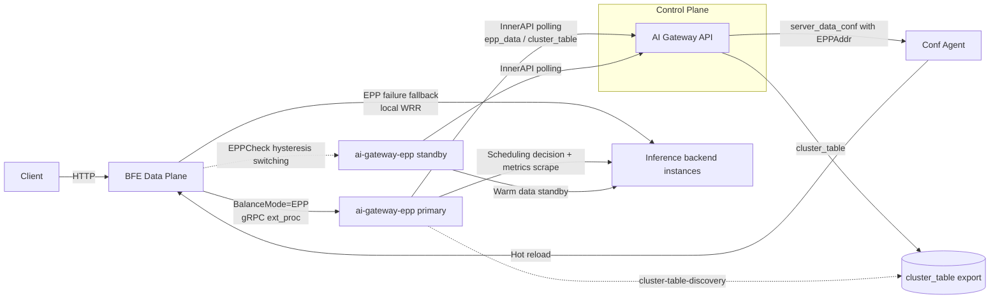
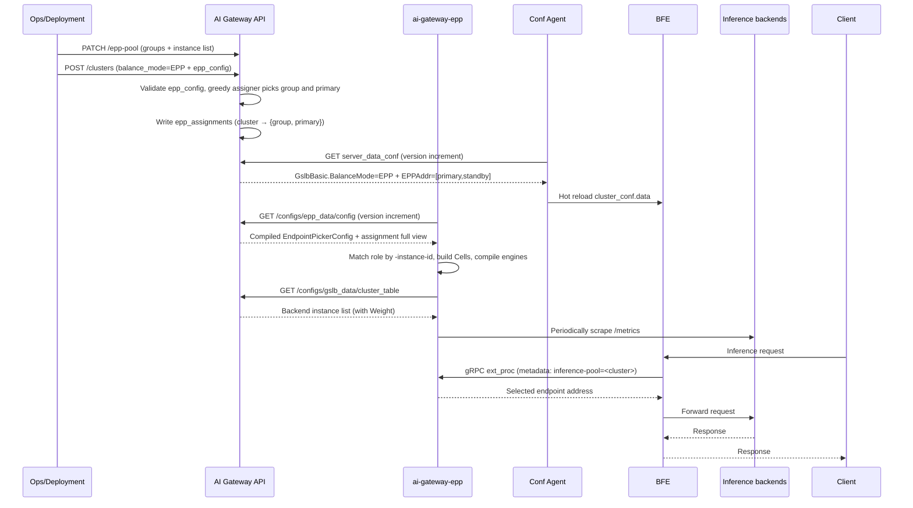

# Chapter 16 EPP Scheduling Design

## Chapter Goals

Through this chapter, the reader will understand:

- Why EPP intelligent scheduling is needed: the limitations of BFE's local WRR (Weighted Round Robin) in LLM inference scenarios;
- The technical origins of EPP: the CNCF llm-d project, and the relationship between ai-gateway-epp and the upstream EPP;
- Where EPP (Endpoint Picker) sits in the overall architecture of Rainway AI Gateway, and how it divides responsibilities with traditional load balancing;
- How the Control Plane (AI Gateway API) manages the EPP instance pool, compiles scheduling configuration, assigns instance groups, and distributes configuration in both directions;
- How the Data Plane (BFE) connects to EPP via the gRPC ext_proc protocol, and the fallback semantics upon failure;
- Configuration consumption, the scheduling plugin chain, and affinity mechanisms inside the ai-gateway-epp component;
- The end-to-end flow of the EPP scheduling path and its boundary semantics.

---

## Background: Limitations of WRR and the Positioning of EPP

A Cluster in Rainway AI Gateway uses BFE's built-in WRR (Weighted Round Robin) for backend selection by default. WRR is simple and deterministic, but it knows nothing about backend state, and has three obvious limitations in LLM (Large Language Model) inference scenarios:

1. **No load awareness**: WRR distributes requests purely by weight in rotation and cannot perceive the real-time pressure of inference backends. The queue length and KV cache utilization of GPU inference services fluctuate sharply with requests; round robin keeps sending requests to already saturated backends, causing queuing delay to spike.
2. **No prefix cache affinity**: in LLM inference, requests sharing the same prompt prefix can directly reuse the cached KV cache if they land on the same backend, significantly reducing time to first token. WRR's round robin naturally scatters requests with the same prefix, wasting this cache benefit.
3. **No session affinity**: multi-turn conversations (multiple requests of the same session) gain even more from reusing KV cache on a backend. WRR cannot converge requests of the same session onto the same backend.

The component that takes on intelligent scheduling is EPP (Endpoint Picker), ai-gateway-epp. It runs in a "multi-Cluster, single process" form: before forwarding a request, BFE hands it to EPP via the gRPC ext_proc (External Processing) protocol; EPP selects the optimal backend based on signals such as backend utilization, queue length, prefix cache, and session binding; BFE then forwards according to the decision. For the basic principles of routing and scheduling, see [Chapter 4 Routing and Scheduling Principles of the AI Gateway](../principle/chapter04-routing-and-scheduling.md).

### Technical Origins of EPP: The CNCF llm-d Project

The concept and scheduling engine of EPP come from [llm-d](https://llm-d.ai/): a Kubernetes-native distributed LLM inference framework, jointly donated to the Cloud Native Computing Foundation (CNCF) by Google Cloud, Red Hat, IBM Research, CoreWeave, NVIDIA, and others in March 2026, and now a CNCF Sandbox project. llm-d builds on vLLM and the Kubernetes Gateway API Inference Extension (GAIE), in which the Endpoint Picker (EPP) is the reference scheduling implementation of that inference extension: before forwarding a request, the gateway calls back to EPP via the Envoy ext_proc protocol, and EPP completes backend selection with a Filter → Score → Pick plugin pipeline. EPP's scheduling model is designed specifically for inference workloads — it uses KV cache utilization and request queue length as decision signals, and ships inference-specific scheduling optimizations such as prefix cache awareness and session affinity.

The upstream EPP targets Kubernetes environments: the list of inference backend instances comes from the InferencePool CRD (Custom Resource Definition), and scheduling policies and instance roles are determined by control components on the Kubernetes side.

### The Relationship Between ai-gateway-epp and the Upstream EPP

ai-gateway-epp reuses the scheduling engine and plugin system of llm-d (the llm-d-router engine package), recombined into a multi-Cluster scheduling process adapted to the Rainway AI Gateway Control Plane. The two share the ext_proc protocol and the Filter → Score → Pick plugin pipeline, and the inference scheduling semantics of KV cache / prefix cache / session affinity are identical; the scheduling configuration consumed by ai-gateway-epp (the compiled artifact EndpointPickerConfig) is exactly the upstream EPP configuration format, so llm-d's scheduling capabilities and plugin ecosystem are inherited smoothly.

The differences between the two concentrate on orchestration environment and lifecycle management:

| Dimension | Upstream EPP (llm-d) | ai-gateway-epp |
|-----------|----------------------|----------------|
| Runtime environment | Kubernetes: backend instances come from the InferencePool CRD, scheduling policies come from the inference extension configuration | No Kubernetes dependency: backend instances come from the cluster_table export of the AI Gateway API InnerAPI, scheduling configuration and primary/standby roles come from the `epp_data/config` interface (epp_config compiled artifact + assignment full view) — there is no CRD reconciler |
| Process model | One EPP process serves one inference pool (InferencePool) | One process serves multiple Clusters: each assigned Cluster maps to one Cell (resident in the data plane: datastore + metrics collection; the engine switches atomically on configuration version), ext_proc requests are routed to the corresponding Cell by the inference-pool metadata injected by BFE |
| Configuration activation | CRD updates take effect gradually through Kubernetes reconcile | `epp_config` changes are compiled into a new engine and switched atomically; the old engine drains (flow-control queue eviction + in-flight request wait cap); a compile failure of a single Cluster does not affect other Clusters |
| Instance roles | Determined by components on the Kubernetes side | Determined by the assignment full view: instances self-match by `-instance-id` in the view to determine which Clusters' primary/standby roles they hold |

EPP scheduling is a first-class, Cluster-level configuration: when a Cluster's `balance_mode` field is `EPP`, backend selection of that Cluster is taken over by EPP; when it is `WRR` (the default), BFE's local weighted round robin handles it. The two modes can be switched during the Cluster lifecycle.

---

## Overall Architecture

EPP intelligent scheduling involves four components: the Control Plane AI Gateway API, the Data Plane BFE, the scheduler ai-gateway-epp, and the configuration agent Conf Agent. The overall architecture is as follows:



Responsibilities of each component:

- **AI Gateway API**: maintains the EPP instance pool (`/epp-pool`), each Cluster's `balance_mode` and `epp_config`, and the Cluster→instance-group assignments (`epp_assignments`); distributes the compiled scheduling configuration and the assignment view to EPP via InnerAPI, and distributes `GslbBasic` with `BalanceMode=EPP` and the ordered `EPPAddr` to BFE via server_data_conf.
- **BFE**: requests hitting an EPP-mode Cluster are sent via gRPC ext_proc to the currently active EPP address (primary); if the EPP call fails or there is no candidate, it silently falls back to local WRR without interrupting business.
- **ai-gateway-epp (EPP component)**: runs with the instance group (2 instances per group, primary/standby for each other) as the deployment unit; polls InnerAPI for the scheduling configuration and the assignment view, and decides which Clusters' scheduling rights this instance holds according to the assignment; discovers inference backends via the `cluster-table-discovery` plugin from the cluster_table export, and periodically scrapes backend `/metrics` metrics to drive scheduling.
- **Conf Agent**: delivers server_data_conf (including `GslbBasic`) to BFE and triggers hot reload; the mechanism is consistent with [Chapter 14 Config Export and Version Control Design](./chapter14-config-export-and-version-control.md).

---

## Control Plane Design

The Control Plane has three core problems: how the EPP instance pool is managed, how each Cluster's scheduling configuration is expressed and distributed, and how Clusters are assigned to EPP instance groups. This section explains them in turn.

### balance_mode and epp_config: The Cluster-Level Scheduling Entry

The Cluster resource carries two EPP-related fields:

| Field | Type | Semantics |
|-------|------|-----------|
| `balance_mode` | string | Cluster balancing mode: `WRR` (default, BFE local weighted round robin) or `EPP` (the EPP scheduler takes over backend selection). This field is the sole source of truth for EPP mode |
| `epp_config` | object | EPP scheduling configuration in a simplified user-facing form (see below). Required and effective when `balance_mode=EPP`; optional when `balance_mode=WRR` — if provided it is retained and format-validated, but not compiled and not exported |

`epp_config` does not expose the plugin declaration details of the llm-d `EndpointPickerConfig` directly; instead it expresses intent as "scheduling profile + a few first-class tuning parameters":

| Field | Default | Description |
|-------|---------|-------------|
| `scheduling_profile` | `balanced` | Scheduling profile: `latency-first` (low latency first, queue weight highest) / `balanced` / `throughput-first` (throughput first, KV cache weight highest) |
| `cache_affinity` | unset (follows the profile) | Scorer weight override: `low` / `medium` / `high`; when not set explicitly it follows `scheduling_profile`, and when set explicitly it overrides its weights |
| `prefix_cache_affinity` | `true` | Prefix cache affinity switch (soft affinity) |
| `session_affinity_enabled` | `false` | Session affinity switch |
| `session_affinity_header` | - | Request header carrying the session id; required when `enabled=true`, the two appear in pairs |
| `kv_cache_utilization_max` | `0.9` | Endpoint filter threshold `(0,1]`: endpoints whose KV cache utilization exceeds this value are filtered out |
| `flow_control` | - | Flow control parameters: `max_requests` (unlimited by default, `-1` for explicitly unlimited), `queue_ttl` (seconds), `no_endpoint_queue_ttl` (seconds), `enable_eviction` |

Value rules of the two fields:

- `balance_mode=EPP`: `epp_config` is required and must pass field validation (a create request without it returns 422, eliminating the dangling state of "an EPP Cluster without scheduling configuration").
- `WRR → EPP` switch: a valid `epp_config` must be provided at the same time.
- `EPP → WRR` switch: only `balance_mode` needs to be modified; `epp_config` and assignment records are retained (dormant: not compiled, not exported), and the original configuration and assignments continue to take effect when switching back to `EPP`.
- A non-empty `epp_config` must pass field validation regardless of `balance_mode` — dormant retained configurations remain valid as well.

In storage, the `clusters` table contains a `balance_mode` column (default `'WRR'`) and an `epp_config` column (JSON, nullable). The system preserves the raw JSON written by the user; fields not explicitly carried are not persisted; GET reads back exactly what was written; defaults only materialize at export compile time.

### /epp-pool: The EPP Instance Pool

The EPP instance pool is a singleton resource, with management-plane semantics aligned to `/alb-pool`: `GET` for detail + `PATCH` for full replacement. The pool consists of instance groups (groups) and instance lists:

```json
{
    "name": "EPP.pool",
    "groups": [
        {
            "name": "g1",
            "instances": [
                { "id": "epp-a", "host": "10.0.0.1", "port": 9002 },
                { "id": "epp-b", "host": "10.0.0.2", "port": 9002 }
            ]
        }
    ]
}
```

Design points:

- **Instance id convention**: EPP is deployed as a StatefulSet; the instance id is the Pod hostname (the `-instance-id` startup parameter defaults to the hostname); when registering in `/epp-pool`, the instance id is the Pod name. For non-K8s deployments, pass `-instance-id` explicitly.
- **Static configuration mode (no registration/heartbeat)**: the instance list is a deployment fact, maintained by the deployment pipeline calling `PATCH` after instance changes (scaling, machine replacement); it is naturally idempotent. The system provides no registration/heartbeat interfaces, and the AI Gateway API performs no liveness marking — instance liveness is driven by BFE-side `EPPAddr` connection hysteresis.
- **Group size**: exactly 2 instances per group in production (primary/standby for each other); single-instance groups are allowed in test environments (primary only, no standby).
- **Validation**: group names are non-empty and unique within the pool; instance ids are globally unique within the pool; `(host, port)` combinations are globally unique within the pool; host is a Hostname or IP (IPv6 literals without brackets).
- Instance pool changes do not directly bump the `ConfigTopicEppData` topic (instance additions/removals do not change the cluster→role mapping).

Instances are expanded and stored in the `epp_instances` table (id, host, port, group_name); when generating `EPPAddr`, they are joined as `host:port` via `net.JoinHostPort` (IPv6 gets brackets automatically).

### /epp-assignments: Assignment Model and Assigner

The association between Clusters and EPP instance groups is stored in the `epp_assignments` table:

```
cluster (unique key), group_name, primary_instance_id
```

Assignments **store only the primary**: standby is not persisted; at read time it is expanded to the instances of the same group other than the primary, avoiding dual-write inconsistency. The management plane `GET /epp-assignments` returns the full view joined at read time: per-cluster expansion of `{group, primary, standby}`, together with aggregated `unassigned_clusters` (EPP-mode Clusters without a valid assignment) and `idle_groups` (groups bearing no assignment); when the primary instance has been removed from the pool, that entry is marked `degraded`.

Assignments are **generated automatically by the assigner**; the manual override `PUT /epp-assignments/{cluster}` serves only as an operations intervention entry. Automatic assignment uses a greedy + deterministic tie-break algorithm:

```
Input: instance pool (group → instance list), existing assignments (epp_assignments), target cluster
1. Candidate group filtering: instance count satisfies the deployment shape requirement (production=2, test≥1)
2. Group selection: group load = sum of "number of clusters each instance in the group serves as primary for"
        → pick the group with the smallest load; ties break by smallest group name (inter-group balance)
3. Primary selection: within the group, pick the instance with the fewest "number of clusters served as primary for"
        → ties break by smallest instance id (intra-group balance)
4. Write epp_assignments (upsert on the cluster unique key)
```

The algorithm is fully deterministic with no randomness; results are replayable and unit-testable. Mutual primary/standby is a legal output: two instances of the same group can serve as each other's primary across different Clusters (cluster-a primary=epp-a, cluster-b primary=epp-b); assignments are per-Cluster, with no one-to-one group↔Cluster constraint.

Triggers and repair paths of automatic assignment:

| Trigger | Behavior |
|---------|----------|
| A cluster is created in EPP mode, or a `WRR → EPP` change | No assignment record → automatic assignment |
| After a `/epp-pool` PATCH leaves an assignment dangling (primary removed from the pool) | Group still exists → reselect primary among remaining instances of the same group (no group change); group no longer exists → reassign across groups (rerun the greedy algorithm over the whole pool); no assignable candidate group in the pool → clear the assignment and enter the unassigned state |
| Periodic reconciliation reconciler (30 seconds, configurable) | Scans all EPP Clusters; automatically fills any without a valid assignment (idempotent, zero writes in most rounds) |
| `PUT /epp-assignments/{cluster}` | Manual override of `{group_name, primary_instance_id}`, triggers a server_data_conf version bump |

### epp_data Unified Distribution: Compiled Configuration + Assignment Full View

EPP instances pull all Control Plane configuration through a single InnerAPI endpoint:

```http
GET /inner-api/v1/configs/epp_data/config?version=<last version number>
Authorization: Token <token>
```

The response `Config` contains two sections: `epp_config` is `map[cluster name]EndpointPickerConfig` (deterministically compiled from the simplified `epp_config` at export time), and `assignment` is `map[cluster name]{primary, standby}` (full view). Core semantics:

- **Version increment**: goes through the existing `ExportConfig` framework (topic `ConfigTopicEppData`, MD5 signature comparison); returns `Data: null` when nothing changed.
- **All EPP instances receive exactly the same assignment content** (same version snapshot); each instance derives its role by matching its own `-instance-id` per Cluster: `primary == own instance id` → primary; `standby == own instance id` → standby; neither matches → skip that Cluster. The server therefore needs no instance identity validation, and there are no edge-case errors of per-instance views.
- **Single-endpoint merged distribution**: Cluster creation, mode changes, and assignment changes often change both sections at once; a single topic naturally guarantees both sections share the same version as an atomic snapshot, eliminating the role/configuration mismatch window caused by cross-topic version skew; the data volume is tiny, so full redistribution costs are negligible.
- **Unassigned abnormal state**: a Cluster present in `epp_config` but absent from `assignment` is unassigned; EPP raises a local alert and does not build a scheduling engine for that Cluster.

The compilation rules from the simplified configuration to `EndpointPickerConfig` are fixed in the AI Gateway API code template and covered by unit tests:

| Simplified field | Compiled artifact |
|------------------|-------------------|
| Fixed part | Injects the `cluster-table-discovery` endpoint discovery plugin (clusterName taken from this Cluster), `utilization-filter` (threshold from `kv_cache_utilization_max`), two scorers `kv-cache-utilization-scorer` + `queue-scorer`, the `max-score-picker` picker, and `openai-parser` |
| `scheduling_profile` → scorer weights (kv, queue) | `latency-first` → (0.2, 1.0); `balanced` → (1.0, 0.5); `throughput-first` → (1.0, 0.2) |
| `cache_affinity` → scorer weights (overrides the profile when set explicitly) | `low` → (0.2, 1.0); `medium` → (0.6, 0.6); `high` → (1.0, 0.2) |
| `prefix_cache_affinity=true` | A `prefix-cache-scorer` is appended to the scorer chain (weight fixed at 1.0) |
| `session_affinity_enabled=true` | A `session-affinity-scorer` is appended to the scorer chain (strategy=session_id, session id taken from `session_affinity_header`, weight fixed at 1.0) |
| `flow_control` present | Generates the `flowControl` section (seconds converted to Go duration), appends `flowControl` to `featureGates`; when `max_requests` is unset or `-1`, the `maxRequests` field is not generated |

Affinity scorers are feature switches (on/off + fixed weight 1.0), orthogonal to the profile weights: the profile only tunes the weights of the two base scorers (kv, queue).

### cluster_table Export: The Source for EPP to Discover Inference Backends

An EPP-mode Cluster's instance pool is marked with type `Role=EPP`, but the pool instance list still syncs the Provider's `instance_pool` as usual (the `ProviderInstancePoolSyncer` syncs it to all Clusters referencing that Provider when the Provider instance pool changes, including EPP pools). These instances serve two consumers:

1. **cluster_table export** (`/configs/gslb_data/cluster_table`): EPP's `cluster-table-discovery` plugin discovers inference backends through it; an instance `Weight=0` means the instance is drained.
2. **BFE fallback WRR**: the backend list used by BFE's local WRR fallback when EPP is entirely down or has no candidates.

Under `BalanceMode=EPP`, BFE performs no local WRR and the instance list does not participate in normal balancing; it serves only the two purposes above.

### server_data_conf Export: EPPAddr and Degradation Semantics

An EPP-mode Cluster exports `GslbBasic` in server_data_conf:

```json
"GslbBasic": {
    "BalanceMode": "EPP",
    "EPPAddr": ["10.0.0.1:9002", "10.0.0.2:9002"]
}
```

- `EPPAddr` is an **ordered primary/standby list**: `[0]`=primary, `[1]`=standby (taken from the `epp_assignments` assignment; a single-instance group has only `[primary]`). Addresses are joined from the host/port of `epp_instances` via `net.JoinHostPort`.
- **Degraded export when there is no valid assignment**: the Cluster's `BalanceMode` is set to `WRR` and no `EPPAddr` is generated; meanwhile AI Gateway API outputs an error-level log (including the Cluster name and reason). This is explicit degradation rather than a silent error: degrading a single Cluster does not block the whole server_data_conf distribution; during degradation BFE schedules the Provider instances in that Cluster's pool with local WRR (requests remain servable, only losing EPP intelligent scheduling); after the assignment recovers, the next export automatically returns to `EPP`.

### Design Trade-off: Why Not Expose EndpointPickerConfig Directly

`EndpointPickerConfig` is an internal implementation abstraction of llm-d, containing plugin instances, the pluginRef reference graph, DAG layer ordering, and Quantity formats. Exposing it directly to users costs: users need to understand the whole plugin system to assemble a correct configuration, while AI Gateway API can only perform JSON Schema structural validation — reference errors surface only at EPP compile time.

With the simplified "profile + tuning parameters" form: the user's expression cost drops from "assembling a plugin chain" to "pick a profile and fill in a few numbers"; the compiled artifact is deterministically generated from a code template, with reference integrity and DAG acyclicity guaranteed by construction, so the configuration is valid out of the box; the EPP-side consumption format stays unchanged. There is no advanced pass-through mode; if a need for custom plugin chains emerges in the future, it can be opened up then.

---

## Data Plane Design: BFE's ext_proc Integration

### The EPP Fields of GslbBasic

Each Cluster's `GslbBasic` section in BFE's `cluster_conf.data` carries EPP-related fields (all optional, with defaults):

| Field | Description |
|-------|-------------|
| `BalanceMode` | `"EPP"` means this Cluster goes through ext_proc scheduling; defaults to WRR, in which case EPP fields are ignored |
| `EPPAddr` | Ordered primary/standby address list, `[0]`=primary, `[1]`=standby; non-empty when `BalanceMode=EPP` (load validation: elements must be `host:port`, deduplicated within the list) |
| `EPPCheck` | Health check and hysteresis parameters: `CheckInterval` (default 2s), `FailThreshold` (default 3), `Cooldown` (default 45s), `SuccessThreshold` (default 2) |
| `EPPTimeout` | Call timeouts: `Connect` (default 500ms), `Call` (default 3s) |
| `EPPTLS` | Transport security: `Insecure` (test environments) / `CAFile` (verifies the EPP server certificate in production) |
| `EPPBreaker` | Circuit breaker parameters (sliding-window error rate), complementary to address-level failover |

### Request Processing Flow

Requests hitting an EPP-mode Cluster are processed as follows:

1. BFE constructs the first ext_proc message (RequestHeaders), injecting `"llm-d.ai": {"inference-pool": "<cluster name>"}` into the metadata; EPP's demux routes the stream to the scheduling Cell of the corresponding Cluster by pool name.
2. BFE sends the request via gRPC ext_proc to the currently active EPP address (initially the primary, i.e. `EPPAddr[0]`), and waits for EPP's decision.
3. EPP returns the selected endpoint address in `dynamic_metadata` of the response, at `envoy.lb → x-gateway-destination-endpoint`.
4. BFE constructs a temporary backend in the local cluster_table according to the decided address and forwards the request; on the response path, it relays the streaming response back to EPP via ResponseHeaders and the body filter (for purposes such as token metering).

### Failover and Fallback Semantics

- **Hysteresis switching (EPPCheck)**: each EPP address has a background health check (gRPC health). If the active address fails consecutively `FailThreshold` times, failover moves to the next address; after switching it enters a `Cooldown` period during which it does not switch back; after the cooldown, a higher-priority address must pass the health check consecutively `SuccessThreshold` times before failback. The cooldown period is a hard requirement of the primary/standby scheme, preventing flapping.
- **Error-driven immediate retry**: for `Unavailable / cell is not serving` (standby instance refusing service) and `unknown inference pool` errors, BFE does not wait for the health check cycle; it retries the request directly on the next EPP address of the same Cluster.
- **Silent fallback to local WRR**: when the EPP call fails (transport error, timeout, all addresses unavailable) or EPP has no candidate (fail-closed), BFE falls back to the local `Balance()` using the Cluster RS (i.e. Provider instances) to continue serving; business is uninterrupted, only losing intelligent scheduling. The fallback is silent and normal traffic is undisturbed.
- **Observability**: BFE's monitoring port provides `/monitor/epp_metrics` (Prometheus text format); the core metrics are `epp_calls_total{cluster,result}` (result ∈ ok/no_pool/unknown_pool/draining/transport) and `epp_fallback_local_total{cluster}`, plus failover/failback counters and the active address index.

---

## Design on the ai-gateway-epp Side

### Dual Poller and Cell Engines

The ai-gateway-epp process runs two configuration pollers, both based on the unified `Source[T]` incremental polling framework (version negotiation + failure backoff + fail-static retention of locally known configuration):

- **epp_data poller**: polls `/configs/epp_data/config` for the compiled scheduling configuration and the assignment full view. When configuration changes, it recompiles the scheduling engine per Cluster and swaps it atomically (the old engine drains and is destroyed, waiting 60 seconds by default); when the assignment changes, it drives the Cell lifecycle (Ensure/Promote/Demote/Drop) by diffing against local roles.
- **cluster_table discovery poller**: polls `/configs/gslb_data/cluster_table`, diffing the backend instance list into each Cluster's `cluster-table-discovery` plugin; an instance `Weight=0` is treated as drained (the instance is skipped, and instances already gone from the list are removed accordingly).

The assignment determines which Clusters this instance holds: Cells with the primary role provide scheduling service; Cells with the standby role also load configuration and build engines (warm data standby), but demux returns `ErrCellDraining` for scheduling requests, refusing service; after failover they "open the gate and serve" immediately.

### The Scheduling Plugin Chain

The compiled `EndpointPickerConfig` defines each Cluster's scheduling pipeline. Plugins composed by profile include:

- **cluster-table-discovery**: endpoint discovery, whose data source is the cluster_table export;
- **utilization-filter**: filters out endpoints whose KV cache utilization exceeds `kv_cache_utilization_max` (fail-closed: no candidate when all endpoints are filtered); when backend metrics are missing, the corresponding scores are neutralized (kv score treated as 1.0, the filter not applied) and scheduling degrades gracefully;
- **kv-cache-utilization-scorer / queue-scorer**: base scoring items, with weights determined by the profile (and overridden by `cache_affinity`);
- **prefix-cache-scorer**: prefix cache affinity (soft affinity). The index is a per-endpoint LRU in EPP's local memory (written autonomously by the `approx-prefix-cache` producer), requiring no external storage such as Redis;
- **session-affinity-filter / session-affinity-scorer**: session affinity. Binding state is likewise in EPP's local memory; the session id is parsed from the request header specified by `session_affinity_header`;
- **max-score-picker**: takes the endpoint with the highest total weighted score; ties yield deterministically in rotation.

The scheduling semantics are "weighted sum + highest score wins", and filters run before scoring. Therefore both prefix and session affinities are **best-effort convergence** rather than hard routing: when the matching backend is filtered by utilization-filter, when its match rate is low and another backend overtakes its total score, or when the first request has no affinity data, the request is scheduled to a non-matching backend. This is expected behavior — load/utilization factors can break affinity to avoid dragging a hot backend to death.

### Runtime Metrics Pipeline

The utilization and queue metrics consumed by the kv/queue scorers are obtained by EPP periodically scraping each inference backend's `/metrics` (Prometheus format) over HTTP (refreshed at `RefreshMetricsInterval`, default 50ms, cached in local memory); the metrics source/extractor is injected by ai-gateway-epp by default. EPP's external dependencies across the whole chain are only two kinds of stateless pulls: Control Plane configuration (epp_data / cluster_table) and Data Plane metrics (backend `/metrics`). The prefix affinity LRU, session bindings, flow-control queues, and in-flight counts are all in-process state; after failover/restart they converge from scratch on cold start.

---

## End-to-End Flow

The complete sequence of an EPP-mode Cluster from creation to request scheduling is as follows:



---

## Boundary Semantics

| Scenario | Behavior |
|----------|----------|
| Both backends fully overloaded | utilization-filter fail-closed filters all endpoints → EPP has no candidate → BFE silently falls back to local WRR and continues serving (`epp_fallback_local_total` grows) |
| Single-instance group (test environment) | `EPPAddr` has only `[primary]`; when the primary is lost, BFE degrades to local balancing |
| EPP instance failure | BFE switches to the standby address via EPPCheck hysteresis; **the standby does not automatically take over scheduling** — assignments are configuration-driven, the standby Cell refuses service (`cell is not serving`), and the 200 responses after switching are produced by BFE's local WRR fallback; this is by design |
| Dangling assignment (primary instance removed from pool) | `/epp-pool` PATCH triggers automatic reassignment; when the pool has no assignable candidate group, the assignment is cleared, export degrades to WRR + error log, and the automatic repair path reassigns after capacity recovers |
| `EPP → WRR` and switching back | epp_config and assignment records remain dormant; switching back to EPP continues with the original configuration and assignments |
| `-instance-id` inconsistent with /epp-pool | The EPP instance matches no role in any Cluster: no Cells, no service; startup logs and the `ai_epp_assignment_no_match` metric alert |

---

## Chapter Summary

- EPP intelligent scheduling solves the three limitations of WRR: no load awareness, no prefix cache affinity, and no session affinity; BFE delegates backend selection to ai-gateway-epp via gRPC ext_proc.
- A Cluster's `balance_mode` (WRR/EPP) is the sole source of truth for EPP mode; `epp_config` uses a simplified "profile + tuning parameters" user-facing form, deterministically compiled into the llm-d `EndpointPickerConfig` at export time, valid out of the box.
- `/epp-pool` statically registers the instance pool in singleton + full-replacement mode; the assigner automatically generates Cluster→instance-group assignments with greedy + deterministic tie-break, storing only the primary and expanding standby at read time, with automatic repair when dangling.
- epp_data distributes the compiled configuration and the assignment full view merged in a single endpoint (version increment); all EPP instances share the same snapshot and self-match roles locally.
- server_data_conf exports the ordered `EPPAddr` to BFE; when there is no valid assignment, a single Cluster degrades explicitly to WRR + error log without blocking the whole distribution.
- On the BFE side, EPPCheck hysteresis drives primary/standby switching; when EPP fails or has no candidate, BFE silently falls back to local WRR without interrupting business; the standby does not promote automatically, and traffic after failover is carried by the fallback WRR.

For implementation details see [Chapter 36 EPP Component Implementation](../implementation/chapter36-epp-implementation.md); for configuration and operations see [Chapter 26 EPP Scheduling Configuration and Operations](../operation/chapter26-epp-scheduling-operation.md).

---

## References

- [llm-d project homepage](https://llm-d.ai/) and [CNCF llm-d project page](https://www.cncf.io/projects/llm-d/)
- [Kubernetes Gateway API Inference Extension](https://github.com/kubernetes-sigs/gateway-api-inference-extension) (EPP protocol and InferencePool API)
- `ai-gateway-epp/README.md` (differences between ai-gateway-epp and the upstream EPP)
- `ai-gateway-api/design-docs/modifications/2026-09-08-epp-scheduling-integration/change-summary.md`
- `ai-gateway-api/design-docs/modifications/2026-09-08-epp-scheduling-integration/api-changes.md`
- `ai-gateway-api/design-docs/modifications/2026-09-08-epp-scheduling-integration/design-changes.md`
- `ai-gateway-api/design-docs/sys-design/details/EPP调度对接.md`
- `ai-gateway-api/design-docs/api-define/OpenAPI接口定义/epp-pool.md`
- `ai-gateway-api/design-docs/api-define/OpenAPI接口定义/epp-assignments.md`
- `ai-gateway-api/design-docs/api-define/OpenAPI接口定义/clusters.md`
- `ai-gateway-api/design-docs/api-define/InnerAPI接口定义/epp-data.md`
- `ai-gateway-api/design-docs/api-define/InnerAPI接口定义/server-data-conf.md`
- `ai-gateway-epp/docs/zh_cn/modifications/2026-09-08-epp-scheduling-integration/change-summary.md`
- `ai-gateway-epp/docs/zh_cn/modifications/2026-09-08-epp-scheduling-integration/design-changes.md`
- `bfe/docs/zh_cn/modifications/2026-09-06-epp-ai-gateway-integration/design-changes.md`
- `integration-test/test-cases/测试设计文档/scenario-SC28-EPP调度端到端/场景说明.md`
