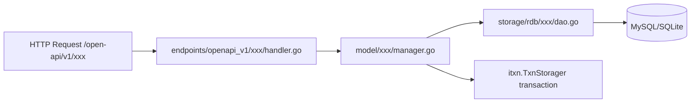
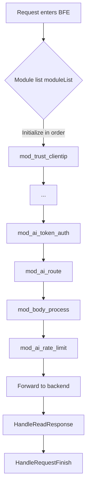
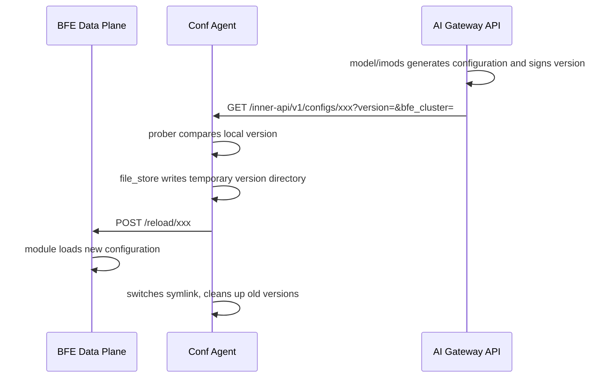
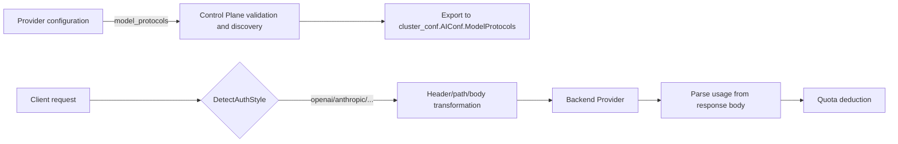

# Chapter 34: How to Extend the Rainway AI Gateway

## Chapter Goals

The Rainway AI Gateway consists of three core repositories: the Control Plane (AI Gateway API), the Data Plane (BFE), and the configuration agent (Conf Agent). These repositories collaborate through three kinds of contracts: OpenAPI, InnerAPI, and configuration files. Extending the gateway often requires changes across multiple repositories at once: adding management capabilities in the Control Plane, adding forwarding behavior in the Data Plane, adding a new configuration topic for Conf Agent to pull, or making the gateway support a new model Provider protocol.

Through this chapter, readers will master the four most common extension scenarios:

- Adding a new OpenAPI management endpoint in `ai-gateway-api`;
- Adding a new request/response processing module in `bfe`;
- Adding a new InnerAPI configuration export topic in `ai-gateway-api`, and wiring the consumption chain through Conf Agent and BFE;
- Extending support for a new Provider protocol (e.g., a new model discovery protocol, request/response transformation).

This chapter provides the key code paths, implementation steps, and testing points for each scenario, and uses flow diagrams to show cross-component collaboration. Before reading, it is recommended to review [Chapter 31: Code Organization and Startup Flow](../implementation/chapter25-code-layout-and-startup.md), [Chapter 31: Endpoint Layer Implementation: OpenAPI and InnerAPI](../implementation/chapter26-endpoints-implementation.md), and [Chapter 35: Conf Agent Implementation](../implementation/chapter33-conf-agent-implementation.md).

## Preparation Before Extending

### Development Environment

All three repositories use Go 1.22, and the build entry point is the `Makefile`. Before starting extension development, make sure your local environment meets the following requirements:

- Go 1.22 or later;
- `make` is available;
- MySQL or SQLite (Control Plane unit tests usually use mocks; integration tests require a real database);
- Redis (BFE's quota, token auth, and rate limit modules depend on Redis);
- `pre-commit` (the BFE repository requires `gofmt` to run before commits; see `bfe/CONTRIBUTING.md`).

Common local verification commands:

```bash
# ai-gateway-api
make test-model-cover-gate
make test

# bfe
make prepare
make test

# conf-agent
go test ./...
cd test/integration && go test -v -count=1 ./tests/...
```

### Understanding the Code Structure

Before extending, you need to understand the layered structure of the three repositories:

| Repository | Key Directory | Responsibility |
|------------|---------------|----------------|
| `ai-gateway-api/` | `endpoints/openapi_v1/` | Management-plane OpenAPI routes and Handlers |
| `ai-gateway-api/` | `endpoints/innerapi_v1/` | Data-plane InnerAPI (configuration export) |
| `ai-gateway-api/` | `model/` | Business Managers and Storager interfaces |
| `ai-gateway-api/` | `storage/rdb/` | MySQL/SQLite DAO implementations |
| `ai-gateway-api/` | `design-docs/` | API definitions, system design, change notes |
| `bfe/` | `bfe_modules/` | Data-plane modules |
| `bfe/` | `bfe_model_protocol/` | Protocol adapter layer: per-protocol adapters (credential injection, usage extraction, error normalization) |
| `bfe/` | `bfe_module/` | Module framework and callback point definitions |
| `bfe/` | `bfe_config/` | Configuration loaders |
| `conf-agent/` | `conf_reload/prober/` | Pulls configuration from the Control Plane |
| `conf-agent/` | `conf_reload/file_store/` | Local versioned persistence |
| `conf-agent/` | `conf_reload/trigger/` | Triggers BFE hot reload |

For non-trivial changes, `ai-gateway-api/design-docs/README.md` specifies the "six-step change process": create a change note → update API definitions → update system design → implement code per design → add tests → consolidate detailed documentation. All four scenarios in this chapter are recommended to follow this process.

## Scenario 1: Adding a New OpenAPI Endpoint

OpenAPI serves the Dashboard and external callers. Adding a new endpoint essentially means filling in code in the order "endpoint layer → model layer → storage layer", and registering the route in `endpoints/openapi_v1/endpoints.go`.



### Step Checklist

Taking a new endpoint for managing "Model Tags" as an example, the recommended implementation steps are:

1. **Design the endpoint**: In `design-docs/api-define/OpenAPI接口定义/`, add the endpoint path, method, request/response fields, and error codes; if table structure changes are involved, update `design-docs/sys-design/` accordingly.
2. **Define the model**: Under `model/imodel_tag/`, create `model_tag.go` defining `ModelTag`, `ModelTagParam`, `ModelTagFilter`, and `ModelTagManager`.
3. **Define the storage interface and implementation**: Define the `ModelTagStorager` interface in `model/imodel_tag/`; implement the DAO in `storage/rdb/model_tag/`.
4. **Implement the Handler**: In `endpoints/openapi_v1/model_tag/`, create files such as `create.go`, `list.go`, `delete.go`, describing endpoints with `xreq.Endpoint`.
5. **Register the route**: In the `endpoints()` function of `endpoints/openapi_v1/endpoints.go`, append `model_tag.Endpoints`.
6. **Dependency injection**: Create the `ModelTagManager` instance in `stateful/container/` for Handlers to use.
7. **Update database scripts**: Modify `db_ddl.sql` and `db_ddl_sqlite.sql` to add the corresponding table.
8. **Add tests**: Write `mocks_test.go` and `*_test.go` for the Manager, keeping `model/` statement coverage no lower than 70%.
9. **Update documentation**: Record this change under `design-docs/modifications/`.

### Key Code Paths

The `Endpoint` abstraction in `ai-gateway-api/lib/xreq/result.go` is the foundation of all OpenAPI endpoints:

```go
// ai-gateway-api/lib/xreq/result.go
type Handler func(req *http.Request) (interface{}, error)

type Endpoint struct {
    Path    string
    Method  string
    Handler func(*http.Request) *Result
    Authorizer *iauth.Authorization
}
```

A typical Handler implementation can be found in `endpoints/openapi_v1/provider/create.go`:

```go
// ai-gateway-api/endpoints/openapi_v1/provider/create.go
var CreateEndpoint = &xreq.Endpoint{
    Path:       "/providers",
    Method:     http.MethodPost,
    Handler:    xreq.Convert(CreateAction),
    Authorizer: iauth.FA(iauth.FeatureProvider, iauth.ActionCreate),
}

func CreateAction(req *http.Request) (interface{}, error) {
    param := &iprovider.ProviderParam{}
    if err := xreq.BindJSON(req, param); err != nil {
        return nil, err
    }
    iprovider.FillDefaults(param)
    id, err := container.ProviderManager.CreateProvider(req.Context(), param)
    if err != nil {
        return nil, err
    }
    return container.ProviderManager.FetchProvider(req.Context(), &iprovider.ProviderFilter{ID: &id})
}
```

The model layer usually controls transactions via `itxn.TxnStorager`, as in `model/iprovider/provider.go`:

```go
// ai-gateway-api/model/iprovider/provider.go
func (m *ProviderManager) CreateProvider(ctx context.Context, param *ProviderParam) (int64, error) {
    if err := ValidateProviderParam(param); err != nil {
        return 0, err
    }
    var id int64
    err := m.txn.AtomExecute(ctx, func(ctx context.Context) error {
        existing, err := m.storager.FetchProvider(ctx, &ProviderFilter{Name: param.Name})
        if err != nil {
            return err
        }
        if existing != nil {
            return xerror.WrapRecordExisted("provider")
        }
        id, err = m.storager.CreateProvider(ctx, param)
        return err
    })
    return id, err
}
```

### Model Layer and Storage Layer Implementation

When adding a new domain, you typically define three kinds of content under `model/<domain>/`: domain structs, the `Storager` interface, and the Manager. Taking model tags as an example, you can declare in `model/imodel_tag/model_tag.go`:

```go
// ai-gateway-api/model/imodel_tag/model_tag.go
type ModelTagStorager interface {
    CreateModelTag(ctx context.Context, param *ModelTagParam) (int64, error)
    FetchModelTag(ctx context.Context, filter *ModelTagFilter) (*ModelTag, error)
    FetchModelTagList(ctx context.Context, filter *ModelTagFilter) ([]*ModelTag, int64, error)
    UpdateModelTag(ctx context.Context, id int64, param *ModelTagParam) error
    DeleteModelTag(ctx context.Context, id int64) error
}

type ModelTagManager struct {
    txn      itxn.TxnStorager
    storager ModelTagStorager
}
```

The DAO implementation goes in `storage/rdb/model_tag/model_tag.go`, operating directly on the tables defined in `db_ddl.sql` and `db_ddl_sqlite.sql`. The Manager does not write SQL directly; instead it opens a transaction via `itxn.TxnStorager` and then calls the Storager. This layering means unit tests only need to mock the `Storager` interface without starting a real database. After adding a table, remember to update the initialization logic in `stateful/container/` so the Manager is injected into a container accessible to Handlers.

### Testing Points

`ai-gateway-api/TESTING.md` recommends writing `mocks_test.go` for each Manager, using handwritten callback mocks to replace the Storager. For example:

```go
// ai-gateway-api/model/quota/mocks_test.go (example style)
type fakeTxn struct{}

func (f *fakeTxn) AtomExecute(ctx context.Context, do func(context.Context) error) error {
    return do(ctx)
}
```

After adding a new OpenAPI endpoint, be sure to run `make test-model-cover-gate` to ensure `model/` statement coverage stays no lower than 70%.

## Scenario 2: Adding a New BFE Module

BFE's extension points take the form of modules. Adding a module requires implementing the `bfe_module.BfeModule` interface, registering handler functions at the appropriate callback points, and adding the module to the module list in `bfe_modules/bfe_modules.go`.

### Module Framework Recap

`bfe_module/bfe_module.go` defines the module interface:

```go
// bfe/bfe_module/bfe_module.go
type BfeModule interface {
    Name() string
    Init(cbs *BfeCallbacks, whs *web_monitor.WebHandlers, cr string) error
}
```

`bfe_module/bfe_callback.go` defines 9 callback points:

```go
// bfe/bfe_module/bfe_callback.go
const (
    HandleAccept = iota
    HandleHandshake
    HandleBeforeLocation
    HandleFoundProduct
    HandleAfterLocation
    HandleForward
    HandleReadResponse
    HandleRequestFinish
    HandleFinish
)
```

The callback points commonly used by the AI gateway are:

- `HandleFoundProduct`: used for authentication and route selection;
- `HandleReadResponse`: used for parsing backend response bodies;
- `HandleRequestFinish`: used for deducting quota when a request finishes.

### Step Checklist

Suppose we add a `mod_ai_header_rewrite` module, used to rewrite AI request headers before forwarding:

1. **Create the module package**: Under `bfe/bfe_modules/mod_ai_header_rewrite/`, create `mod_ai_header_rewrite.go` and `conf_load.go`.
2. **Implement the `BfeModule` interface**: Provide `Name()` and `Init()` methods.
3. **Define the config structure**: Use `gcfg` to load `conf/mod_ai_header_rewrite/mod_ai_header_rewrite.conf`.
4. **Register callbacks**: In `Init()`, register the handler via `cbs.AddFilter(bfe_module.HandleForward, m.rewriteHandler)`.
5. **Register monitoring and hot-reload Handlers**: Register `/reload/mod_ai_header_rewrite` and a status query endpoint via `web_monitor.RegisterHandlers`.
6. **Add to the module list**: Insert into `moduleList` in `bfe/bfe_modules/bfe_modules.go` in order, noting the dependency comments with adjacent modules.
7. **Add sample configuration**: Place `.conf` and `.data` files under `bfe/conf/mod_ai_header_rewrite/`.
8. **Write unit tests**: Cover config loading, callback logic, and the hot-reload path.
9. **Run `make test`**: Ensure existing modules are not broken.

### Key Code Paths

`bfe/bfe_modules/mod_ai_route/mod_ai_route.go` shows the skeleton of a typical module:

```go
// bfe/bfe_modules/mod_ai_route/mod_ai_route.go
type ModuleAiRoute struct {
    name       string
    conf       *ConfModAiRoute
    routeTable *AiRouteTable
    state      ModuleAiRouteState
    metrics    metrics.Metrics
}

func NewModuleAiRoute() *ModuleAiRoute {
    m := new(ModuleAiRoute)
    m.name = ModAiRoute
    m.metrics.Init(&m.state, ModAiRoute, 0)
    m.routeTable = NewAiRouteTable()
    return m
}

func (m *ModuleAiRoute) Name() string {
    return m.name
}

func (m *ModuleAiRoute) Init(cbs *bfe_module.BfeCallbacks, whs *web_monitor.WebHandlers, cr string) error {
    confPath := bfe_module.ModConfPath(cr, m.name)
    var err error
    if m.conf, err = ConfLoad(confPath, cr); err != nil {
        return fmt.Errorf("%s: conf load err %v", m.name, err)
    }
    if err := m.loadRouteRuleConf(nil); err != nil {
        return fmt.Errorf("%s: loadRouteRuleConf err %v", m.name, err)
    }
    if err := cbs.AddFilter(bfe_module.HandleFoundProduct, m.routeFoundProductHandler); err != nil {
        return fmt.Errorf("%s.Init(): AddFilter(routeFoundProductHandler): %s", m.name, err.Error())
    }
    // Register monitoring and hot-reload endpoints
    monitorHandlers := map[string]interface{}{m.name: m.getState}
    web_monitor.RegisterHandlers(whs, web_monitor.WebHandleMonitor, monitorHandlers)
    reloadHandlers := map[string]interface{}{m.name: m.loadRouteRuleConf}
    web_monitor.RegisterHandlers(whs, web_monitor.WebHandleReload, reloadHandlers)
    return nil
}
```

Module registration order lives in `bfe/bfe_modules/bfe_modules.go`; the relative positions of `mod_ai_route` and `mod_ai_token_auth` look like:

```go
// bfe/bfe_modules/bfe_modules.go
// mod_ai_token_auth
mod_ai_token_auth.NewModuleAITokenAuth(),

// mod_ai_route
// Requirement: after mod_ai_token_auth (needs ClientApiKey)
mod_ai_route.NewModuleAiRoute(),
```

When adding a new module, be sure to document the dependency relationships in comments, to avoid runtime context missing due to order adjustments.



## Scenario 3: Extending a Configuration Export Topic (InnerAPI)

InnerAPI is the topic through which the Control Plane "emits" configuration to the Data Plane. Adding a new export topic means the Control Plane must convert some management object into a `.data` file consumable by BFE, Conf Agent must pull that file and trigger a BFE hot reload, and a BFE module must consume that file.



### Control Plane Export Logic

Taking the export of `mod_api_key` as an example, `endpoints/innerapi_v1/mod_api_key/export.go` is only responsible for parameter parsing and calling the Manager:

```go
// ai-gateway-api/endpoints/innerapi_v1/mod_api_key/export.go
var ExportRoute = &xreq.Endpoint{
    Path:       "/configs/mod-api-key",
    Method:     http.MethodGet,
    Handler:    xreq.Convert(ExportAction),
    Authorizer: iauth.FA(iauth.FeatureAPIKey, iauth.ActionExport),
}

func exportActionProcess(req *http.Request) (interface{}, error) {
    param, err := export_util.NewExportFromReq(req)
    if err != nil {
        return nil, err
    }
    return container.APIKeyRuleManager.ConfigExport(req.Context(), param.Version)
}
```

The actual export logic is in `model/imods/exporter.go`, which generates a signed configuration through the version control interface in `model/iversion_control/version_control.go`:

```go
// ai-gateway-api/model/iversion_control/version_control.go
func (vcm *VersionControlManager) ExportConfig(ctx context.Context, configTopic string,
    generator ConfigGenerator) (lrv *ExportData, err error) {
    err = vcm.txn.AtomExecute(ctx, func(ctx context.Context) error {
        lrv, err = generator(ctx)
        if err != nil {
            return err
        }
        if err = lrv.DataWithoutVersion.UpdateVersion(ZeroVersion); err != nil {
            return err
        }
        lrv.DataSignWithoutVersion, err = Sign(lrv.DataWithoutVersion)
        if err != nil {
            return err
        }
        lrv.version, err = vcm.storager.UpsertConfigLastExportedVersion(ctx, lrv)
        if err != nil {
            return err
        }
        return lrv.DataWithoutVersion.UpdateVersion(lrv.version)
    })
    return
}
```

Steps for adding a new topic:

1. Add a Manager under `model/` (e.g., `model/icustom/`) that implements the `ConfigGenerator` function and returns `iversion_control.ExportData`.
2. Define the exported data structure and implement the `UpdateVersion(version string) error` method.
3. Add an export Handler under `endpoints/innerapi_v1/`, with the path recommended as `/configs/<topic>`.
4. Register the export route in `endpoints/innerapi_v1/endpoints.go`.
5. Initialize the new Manager in `stateful/container/`.

### Conf Agent Pulling Configuration

Conf Agent's pull behavior is defined by `Reloader` in `conf-agent/conf/conf-agent.toml`. Taking `mod_ai_route` as an example:

```toml
# conf-agent/conf/conf-agent.toml
[Reloaders.mod_ai_route]
BFEReloadAPI    = "/reload/mod_ai_route"
ReloadFile      = "ai_route.data"
CopyFiles       = ["ai_route.data", "mod_ai_route.conf"]
[[Reloaders.mod_ai_route.NormalFileTasks]]
ConfAPI         = "/inner-api/v1/configs/ai-route"
ConfFileName    = "ai_route.data"
```

When adding a new topic, you typically add a `NormalFileTask`:

```toml
[Reloaders.mod_custom]
BFEReloadAPI    = "/reload/mod_custom"
ReloadFile      = "custom.data"
CopyFiles       = ["custom.data", "mod_custom.conf"]
[[Reloaders.mod_custom.NormalFileTasks]]
ConfAPI         = "/inner-api/v1/configs/custom"
ConfFileName    = "custom.data"
```

`conf_reload/prober/task_normal.go` accesses InnerAPI with the local version number and the `bfe_cluster` parameter; if the Control Plane returns a new version, it writes to a temporary directory:

```go
// conf-agent/conf_reload/prober/task_normal.go
func (task *NormalFileTask) FetchConfFiles(ctx context.Context) ([]*FetchFileResult, error) {
    localVersion, err := loadLocalVersion(path.Join(config.ConfDir, fileName))
    if err != nil {
        return nil, err
    }
    raw, err := obtainRemoteConfig(ctx, task.commonConfig, config.ConfAPI, localVersion)
    if err != nil {
        return nil, err
    }
    if raw == nil || string(raw) == `null` {
        return nil, nil
    }
    version, err := calculateVersion(raw)
    if err != nil {
        return nil, err
    }
    return []*FetchFileResult{{Name: fileName, Version: version, Content: raw}}, nil
}
```

### BFE Consuming Configuration

A BFE module loads the initial configuration in `Init()` and registers a hot-reload function via `web_monitor.WebHandleReload`. The hot-reload entry of `mod_ai_route` is as follows:

```go
// bfe/bfe_modules/mod_ai_route/mod_ai_route.go
func (m *ModuleAiRoute) loadRouteRuleConf(query url.Values) error {
    path := query.Get("path")
    if path == "" {
        path = m.conf.Basic.RouteRulePath
    }
    data, err := AiRouteDataLoad(path)
    if err != nil {
        return fmt.Errorf("err in AiRouteDataLoad(%s): %s", path, err)
    }
    return m.routeTable.Update(data)
}
```

The complete consumption chain for a new topic can be summarized as:

1. The Control Plane Manager generates the configuration and signs the version;
2. Conf Agent `prober` polls InnerAPI periodically;
3. `file_store` writes the new configuration to a version directory and switches the symlink;
4. `trigger` calls BFE `/reload/<module>`;
5. The BFE module reads the new configuration through the registered reload function and updates runtime structures.

## Scenario 4: Extending Provider Protocol Support

Provider protocol extension is a scenario unique to AI gateways. In the Data Plane, all protocol knowledge (credential injection, supplementary headers, usage extraction, error normalization) is converged into per-protocol adapters in the protocol adapter layer `bfe/bfe_model_protocol/`, so the change surface for a new protocol is small; the Control Plane still needs to relax the protocol enum and add model discovery parser rules in sync.

First, one conceptual boundary must be clear: **model_protocol (protocol knowledge) ≠ provider (user-defined cluster-level entity)**. A provider is managed by the Control Plane and carries user-defined information such as name, key pool, price table, and address; a model_protocol describes protocol knowledge such as how credentials are injected, which version headers are added, and what usage fields look like. Brands in the OpenAI-compatible ecosystem such as Groq, DeepSeek, and OpenRouter all use the `openai` protocol: onboarding such a provider requires **zero code changes** — just `model_protocols: ["openai"]` in the cluster configuration (usually carried automatically by the Control Plane when the Provider is created) — with no new adapter needed.



### Control Plane Protocol Adaptation

The Control Plane maintains the set of valid protocols in `model/iprovider/provider.go`:

```go
// ai-gateway-api/model/iprovider/provider.go
var ValidModelProtocols = map[string]bool{
    "openai":    true,
    "anthropic": true,
}

func ValidateProviderParam(param *ProviderParam) error {
    // ...
    for i, p := range param.ModelProtocols {
        if !ValidModelProtocols[p] {
            return xerror.WrapParamErrorWithMsg("invalid model_protocols[%d]: %s", i, p)
        }
    }
    // ...
}
```

When adding a new protocol, first register it in `ValidModelProtocols`, and specify the protocol's authentication header in `BuildAuthHeader`:

```go
// ai-gateway-api/model/iprovider/provider.go
func BuildAuthHeader(protocol, key string) (string, string) {
    switch protocol {
    case "anthropic":
        return "x-api-key", key
    case "openai":
        fallthrough
    default:
        return "Authorization", "Bearer " + key
    }
}
```

The model discovery protocol is described by `modelProtocolParsers` in `model/iprovider/discover.go`:

```go
// ai-gateway-api/model/iprovider/discover.go
var modelProtocolParsers = map[string]modelParser{
    "openai": {
        ListPath:  "data",
        IDField:   "id",
        NameField: "object",
    },
    "anthropic": {
        ListPath:  "models",
        IDField:   "model_id",
        NameField: "display_name",
    },
}
```

Adding a new protocol requires adding the corresponding `modelParser`, telling the Control Plane how to extract the model list from responses of `/v1/models`-like endpoints. `DiscoverModels` selects the parser by protocol:

```go
// ai-gateway-api/model/iprovider/discover.go
func (m *ProviderManager) DiscoverModelsWithCaller(ctx context.Context, param *DiscoverModelsParam,
    caller DiscoverCaller) ([]string, error) {
    // ...
    headers := make(map[string]string)
    if param.APIKey != "" {
        headerName, headerValue := BuildAuthHeader(param.ModelProtocol, param.APIKey)
        headers[headerName] = headerValue
    }
    body, err := caller.Call(ctx, http.MethodGet, url, headers)
    // ...
    return ParseModelDiscoveryResponse(body, param.ModelProtocol)
}
```

The Control Plane's export of `cluster_conf.AIConf.ModelProtocols` to BFE is done in `model/icluster_conf/cluster.go`:

```go
// ai-gateway-api/model/icluster_conf/cluster.go
func newAIConf(llmConfig *LLMConfig, modelTable *cluster_conf.ModelTable,
    providerKeys []iprovider.ProviderKey, providerModelProtocols []string) *cluster_conf.AIConf {
    aiConf := &cluster_conf.AIConf{
        Type:           0,
        ModelMapping:   convertToBFEModelMapping(llmConfig.ModelMappings),
        Keys:           []cluster_conf.AIKey{},
        ModelProtocols: providerModelProtocols,
    }
    // ...
}
```

### Data Plane Request/Response Transformation

Data Plane protocol detection lives in `bfe/bfe_model_protocol/detect.go`; `bfe_basic.DetectAuthStyle` and `GetApiKey` keep their original signatures and delegate to it:

```go
// bfe/bfe_model_protocol/detect.go
func DetectProtocol(req *bfe_http.Request) string {
	if req == nil || req.URL == nil {
		return ProtocolUnknown
	}

	path := req.URL.Path
	if strings.HasPrefix(path, "/v1/messages") {
		return ProtocolAnthropic
	}

	// x-api-key without Authorization indicates Anthropic style
	if req.Header.Get("x-api-key") != "" &&
		req.Header.Get("Authorization") == "" {
		return ProtocolAnthropic
	}

	return ProtocolOpenAI
}
```

Before forwarding, `doSingleAIForward` in `bfe_server/reverseproxy.go` picks the protocol adapter for the request's `AuthStyle`, checks whether the cluster supports the protocol, and performs credential and supplementary header injection through the adapter:

```go
// bfe/bfe_server/reverseproxy.go
adapter := modelprotocol.Get(aiMeta.AuthStyle)

if cluster.AIConf != nil && !clusterSupportsAuthStyle(cluster.AIConf.ModelProtocols, aiMeta.AuthStyle) {
	err := bfe_basic.NewAiError(
		bfe_basic.CodeProviderProtocolMismatch,
		bfe_basic.TypeInvalidRequestError,
		fmt.Sprintf("request protocol %s not supported by cluster provider (model_protocols=%v)",
			aiMeta.AuthStyle, cluster.AIConf.ModelProtocols),
	)
	return err.CreateErrorResponse(basicReq), closeAfterReply, nil, bodyModel
}

// Credential injection: the openai adapter writes Authorization: Bearer,
// the anthropic adapter writes x-api-key
if selectedKey.Key != "" {
	if err := adapter.InjectAuth(outreq, selectedKey.Key); err != nil {
		log.Logger.Warn("doSingleAIForward: inject auth failed: %v", err)
	}
}

// Supplementary headers, e.g. anthropic-version; an explicit value on
// the request takes precedence
for k, v := range adapter.ExtraHeaders() {
	if outreq.Header.Get(k) == "" {
		outreq.Header.Set(k, v)
	}
}
```

Note that `doSingleAIForward` no longer imports `mod_ai_token_auth`; `mod_ai_token_auth.SetApiKey` keeps its original signature and likewise delegates to `adapter.InjectAuth` internally.

On the response side, `UpdateCtxByUsage` in `mod_ai_token_auth` selects the adapter's usage field chain (`ExtractUsageFields`) by the identified protocol; the subsequent accumulation and normalization logic is unchanged:

```go
// bfe/bfe_modules/mod_ai_token_auth/mod_ai_token_auth.go
func UpdateCtxByUsage(ctx *TokenAuthContext, data []byte) {
	fields := modelprotocol.Get(ctx.aiBasicInfo.AuthStyle).ExtractUsageFields(data)
	used := fields.UsedQuota
	prompt := fields.PromptTokens
	completion := fields.CompletionTokens
	// ... cache_read/cache_write, audio, image, video fields are taken the
	// same way; the used>0 / else if prompt>0... accumulation branches are
	// preserved line by line (writing bfe_basic.TokenUsage)
}
```

On the streaming side, `SSEEvent/RawEvent.GetQuotaUsage` in `mod_body_process` composes the adapter field chains through the shared helper `extractUsageFields` (the openai chain first, falling back to the anthropic chain when prompt/completion are both zero); the `isguess` / `EstimateContentToken` logic is unchanged.

### Steps to Add a New Model Protocol

Taking the gemini protocol as an example, the Data Plane framework code (reverseproxy / mod_body_process / mod_ai_token_auth) requires **zero modifications** — only three steps are needed:

1. Add the `ProtocolGemini` constant in `bfe/bfe_model_protocol/utils/protocol.go`;
2. Create the adapter package `bfe/bfe_model_protocol/gemini/` implementing the `ProtocolAdapter` interface: `InjectAuth` (e.g. `x-goog-api-key` injection), `ExtraHeaders`, `ExtractUsageFields` (extraction and normalization of `promptTokenCount` / `candidatesTokenCount` / `cachedContentTokenCount`);
3. Add one detection rule in `detect.go` (e.g. recognize by the `x-goog-api-key` header);
4. Add one line `Register(gemini.New())` in the `init()` of `registry.go`.

Then, as needed:

5. To customize degradation semantics based on the error body, implement an `ErrorNormalizer` (the seam in `shouldTriggerFallback` is already in place; the default implementation always returns `nil`, preserving the status-code whitelist behavior);
6. In the Control Plane (ai-gateway-api), relax the `model_protocols` enum constraint in `ValidModelProtocols` in `model/iprovider/provider.go`, and add model discovery parser rules in `modelProtocolParsers` in `model/iprovider/discover.go`.

The `cluster_conf.AIConf.ModelProtocols` exported from the Control Plane to BFE is assembled in `model/icluster_conf/cluster.go` (`newAIConf` passes the Provider's protocol list through directly); no per-protocol export logic changes are needed:

```go
// ai-gateway-api/model/icluster_conf/cluster.go
func newAIConf(llmConfig *LLMConfig, modelTable *cluster_conf.ModelTable,
    providerKeys []iprovider.ProviderKey, providerModelProtocols []string) *cluster_conf.AIConf {
    aiConf := &cluster_conf.AIConf{
        Type:           0,
        ModelMapping:   convertToBFEModelMapping(llmConfig.ModelMappings),
        Keys:           []cluster_conf.AIKey{},
        ModelProtocols: providerModelProtocols,
    }
    // ...
}
```

Also note: `bfe_server/bfe_confdata_load.go` validates at startup (`InitDataLoad`) and hot reload (`serverDataConfReload`) that every cluster's `AIConf.ModelProtocols` contains only registry-known protocols. A new protocol must be registered in the registry first, otherwise the configuration load fails.

For unit tests and integration tests, refer to the existing `*_test.go` files under `bfe/bfe_model_protocol/` and `bfe/tests/integration/implementation/scenario-SC06-claude-protocol-support/`.

## Chapter Summary

When extending the Rainway AI Gateway, the most important thing is to identify which components the change spans and to maintain the contracts between components:

- **OpenAPI extensions** follow the order "endpoint layer → model layer → storage layer", use `xreq.Endpoint` to register routes, use `itxn.TxnStorager` to manage transactions, and use handwritten mocks to ensure model-layer unit test coverage.
- **BFE module extensions** require implementing `bfe_module.BfeModule`, registering handler functions at the correct callback points, and maintaining module order in `bfe_modules/bfe_modules.go`.
- **InnerAPI configuration export topic extensions** require implementing `ConfigGenerator` in the Control Plane, adding a `NormalFileTask` in Conf Agent, and implementing the hot-reload callback in the BFE module; the three are coordinated through version numbers and the `/reload/<module>` interface.
- **Provider protocol extensions** require distinguishing model_protocol from provider: onboarding a new OpenAI-compatible provider is zero-code and only needs `model_protocols: ["openai"]` in the cluster configuration; adding a new protocol means adding one adapter package, one detection rule, and one registration line in `bfe_model_protocol` (adapter + `detect.go` + `registry.go`), plus relaxing the protocol enum and model discovery parser rules in the Control Plane.

Whatever the scenario, it is recommended to first complete the design documents following the six-step change process in `ai-gateway-api/design-docs/README.md` before writing code, and to keep design documents, code, and tests in sync.

## References

- `ai-gateway-api/AGENTS.md`
- `ai-gateway-api/CONTRIBUTING.md`
- `ai-gateway-api/TESTING.md`
- `ai-gateway-api/design-docs/README.md`
- `bfe/AGENTS.md`
- `bfe/CONTRIBUTING.md`
- `bfe/docs/zh_cn/sys_design/model_protocol_adapter.md`
- `conf-agent/AGENTS.md`
- [Chapter 31: Endpoint Layer Implementation: OpenAPI and InnerAPI](../implementation/chapter26-endpoints-implementation.md)
- [Chapter 31: AI Routing Module Implementation: mod_ai_route](../implementation/chapter29-mod-ai-route.md)
- [Chapter 35: Conf Agent Implementation](../implementation/chapter33-conf-agent-implementation.md)
