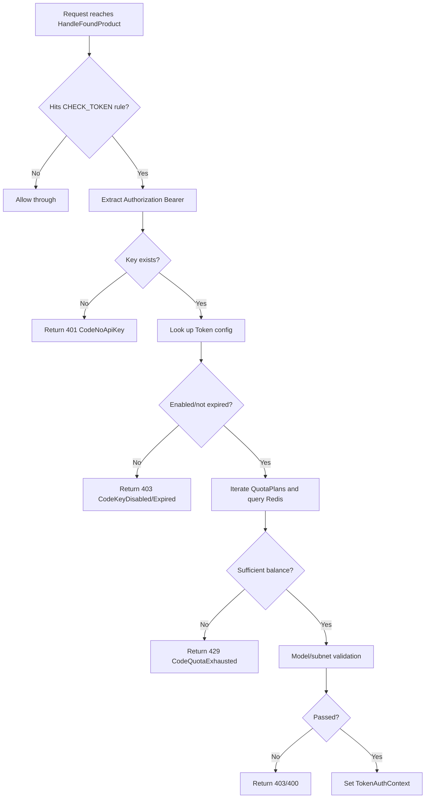
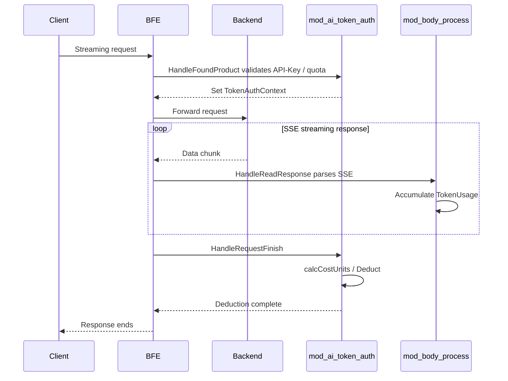

# Chapter 30: Token Authentication and Quota Module Implementation: mod_ai_token_auth

## Chapter Goals

Through this chapter, readers will understand the complete implementation of the `mod_ai_token_auth` module in the Rainway AI Gateway Data Plane:

- Where the module sits in the BFE request processing chain and when it is registered;
- How to validate the API-Key carried by a request and return a structured error response on failure;
- How to bind an API-Key to `QuotaPlan`s and query real-time balances via Redis;
- How to deduct quota at request end based on actual Token usage or RMB cost;
- The reliability semantics of deduction idempotency, no billing on client abort, and `/count_tokens` skipping billing;
- How RMB quota achieves differentiated billing by combining Provider time-period templates with time-period model prices;
- How `mod_ai_token_auth` cooperates with `mod_body_process` in streaming and non-streaming responses.

## Responsibilities of mod_ai_token_auth

`mod_ai_token_auth` (the AI Token authentication module) is the core module in the Data Plane BFE responsible for API-Key authentication and quota deduction. An API-Key represents a business party's access credential to a specific large-model service, and is associated with several `QuotaPlan`s that determine how many resources the credential can consume within a period.

The module's core responsibilities include:

1. **API-Key extraction and validation**: extract the Key from the request's `Authorization: Bearer <api-key>` header, and check its existence, enabled state, expiration time, model allowlist/blocklist, source IP subnets, etc. When validation fails, a structured error response is constructed and returned to the client immediately, preventing invalid requests from reaching the backend.
2. **Quota balance pre-check**: before a request enters the backend, query the remaining quota of each `QuotaPlan` in Redis, and reject the request when the balance is insufficient or the plan has expired. This step runs only after the request is successfully authenticated; requests that do not hit an authentication rule do not trigger a quota check.
3. **Deduction at request end**: after the response completes, deduct the `total_token` quota based on the `usage` field in the response body or the Token count estimated from content length; for the `RMB` quota, first convert the cost at the model unit price, then deduct. Requests aborted by the client without a final usage are not billed, `/count_tokens`-style endpoints skip billing, and the `deducted` flag makes deduction idempotent. Deduction failures are caught and recorded as Warn logs, and do not affect the response delivery.
4. **Structured error information**: record the rejection reason and the hit quota plan in `AiBasicInfo.AiAuthInfo`, facilitating access-log and monitoring analysis. These fields are also output by access-log modules such as `mod_access`, providing complete context for troubleshooting.

## Position of the Module in the BFE Module Chain

BFE modules are registered in a fixed order in `bfe_modules/bfe_modules.go`. `mod_ai_token_auth` sits after `mod_unified_waf` and before `mod_ai_route`:

```go
// bfe/bfe_modules/bfe_modules.go
var moduleList = []bfe_module.BfeModule{
    // ... preceding modules ...

    // mod_ai_token_auth
    mod_ai_token_auth.NewModuleAITokenAuth(),

    // mod_ai_route
    // Requirement: after mod_ai_token_auth (needs ClientApiKey)
    mod_ai_route.NewModuleAiRoute(),

    // mod_body_process
    mod_body_process.NewModuleBodyProcess(),

    //depends on token calc
    mod_ai_rate_limit.NewModuleAiRateLimit(),

    // ... subsequent modules ...
}
```

The reason `mod_ai_token_auth` is placed before `mod_ai_route` is that the routing module needs to select dedicated routing rules based on the authenticated API-Key; while `mod_ai_rate_limit` sits after `mod_body_process` because the rate-limit module relies on the Token usage parsed by `mod_body_process` for TPM calculation.

`HandleRequestFinish` is the last callback point in the BFE request lifecycle, at which point all response data (including streaming accumulated Token usage and RMB cost) is ready, so placing quota deduction here ensures it happens exactly once with an accurate amount. If deduction were moved earlier to `HandleReadResponse`, the streaming response would not have ended yet, leading to under-deduction or duplicate deduction.

`mod_ai_token_auth` registers three callbacks during initialization:

- `HandleFoundProduct`: `tokenFoundProductHandler`, completes API-Key validation and the quota pre-check;
- `HandleReadResponse`: `tokenReadResponseHandler`, parses Token usage from the response body in non-streaming scenarios;
- `HandleRequestFinish`: `tokenRequestFinishHandler`, performs the final quota deduction after all response processing completes.

```mermaid
flowchart LR
    A[Request enters] --> B[mod_unified_waf]
    B --> C[mod_ai_token_auth<br/>HandleFoundProduct]
    C --> D[mod_ai_route]
    D --> E[Backend model service]
    E --> F[mod_body_process<br/>HandleReadResponse]
    F --> G[mod_ai_token_auth<br/>HandleReadResponse]
    G --> H[mod_ai_rate_limit]
    H --> I[mod_ai_token_auth<br/>HandleRequestFinish]
    I --> J[Return to client]
```



## API-Key Validation Flow

The API-Key in the request header must follow this format:

```http
Authorization: Bearer <api-key>
```

`tokenFoundProductHandler` is the module's entry point; its processing logic is located in `bfe/bfe_modules/mod_ai_token_auth/mod_ai_token_auth.go`:

```go
func (m *ModuleAITokenAuth) tokenFoundProductHandler(req *bfe_basic.Request) (int, *bfe_http.Response) {
    meta := req.GetAiBasicInfo()
    if meta == nil {
        return bfe_module.BfeHandlerGoOn, nil
    }

    matched := m.matchTokenRule(req)
    if !matched {
        return bfe_module.BfeHandlerGoOn, nil
    }

    m.state.ReqAuth.Inc(1)
    tok, err := m.ValidateUserTokenByReq(req)
    if err != nil {
        m.state.ReqAuthFail.Inc(1)
        resp := err.CreateErrorResponse(req)
        return bfe_module.BfeHandlerResponse, resp
    }

    promptToken := 0
    if meta.IsAllowEstimateToken() {
        promptToken = int(GetPromptToken(req))
    }
    SetTokenAuthContext(req, tok, int64(promptToken), tok.Tags)

    return bfe_module.BfeHandlerGoOn, nil
}
```

`matchTokenRule` matches rules from the rule table by product; only rules that hit the `CHECK_TOKEN` action trigger subsequent authentication. This design lets administrators flexibly enable or disable authentication per product — for example, allowing internal test products through while enforcing authentication on online products.

The actual validation logic is in `ValidateUserTokenByReq` in `bfe/bfe_modules/mod_ai_token_auth/token_rule_table.go`, executed in the following order:

1. **Extract the API-Key**: call `bfe_basic.GetApiKey(req)`; if empty, return `CodeNoApiKey`.
2. **Look up the Token**: search by `product + key` in the rule table `TokenRuleTable`; if not found, return `CodeInvalidApiKey`. Before a validation failure occurs, the module writes `KeyId` into `AiBasicInfo` as early as possible, so that even if the request is later rejected, the access log can be correlated to the specific Key.
3. **State validation**: check `Enabled` and `ExpiredTime`; a disabled or expired Key returns `CodeKeyDisabled` or `CodeKeyExpired` respectively.
4. **Quota pre-check**: iterate over `token.QuotaPlans`, skipping `Unlimited` and `PassNoQuota` plans; for finite plans, call `plan.HasBalance` to query Redis — insufficient balance returns `CodeQuotaExhausted`, and an expired plan returns `CodeQuotaExpired`. Multiple quota plans are checked in sequence, and the request is allowed only if all of them pass.
5. **Model permission validation**: if the Token configures `Models` or `BlockModels`, read the `model` field of the request body and match it against the allowlist/blocklist; a mismatch returns `CodeModelNotAllowed`. When configured as `*`, all models are allowed.
6. **IP subnet validation**: if `Subnet` is configured, check whether `ClientAddr` or `RemoteAddr` is within the allowed subnets; if not, return `CodeSubnetNotAllowed`. Subnets support CIDR notation, and multiple can be configured.



After validation succeeds, `SetTokenAuthContext` writes information such as `KeyId`, `ApikeyTags`, and the estimated `PromptTokens` into `AiBasicInfo` for use by subsequent modules. For image/video generation modes, it also pre-reads the `n` field of the request body (`GetImageCountFromReq` / `GetVideoCountFromReq`) at the authentication stage to populate `ImageCount` / `VideoCount` as a fallback; when `n` is missing or `<= 0`, it takes 1, preventing under-billing when the response carries no usage:

```go
if aiBasicInfo.Mode == bfe_basic.ModeImageGeneration {
    tusage.ImageCount = GetImageCountFromReq(req)
}
if aiBasicInfo.Mode == bfe_basic.ModeVideoGeneration {
    tusage.VideoCount = GetVideoCountFromReq(req)
}
```

## Quota Plan Binding and Balance Query (Redis)

### Configuration Structure

The runtime definition of `QuotaPlan` in BFE is located in `bfe/bfe_modules/mod_ai_token_auth/token.go`:

```go
type QuotaPlan struct {
    Id          string
    Unlimited   bool
    PassNoQuota bool
    RedisKey    string
    ExpiredTime int64  // -1 means never expired
    Quota       int64  // fixed-point integer: Token count for total_token; 1e-8 RMB for RMB
    Unit        string // "total_token" or "RMB"
}
```

When exporting configuration, the Control Plane already generates a stable `RedisKey` for each quota plan, in the format `QUOTA_<stableId>`, where `stableId` is the API-Key value for API-Key-level quota, or `entity_id` for Entity-level quota. BFE uses the delivered `RedisKey` directly and no longer assembles it from the plan name or ID itself, thereby avoiding counter resets caused by renames. This principle is consistent with the Redis key stability design of `mod_ai_rate_limit`: counter keys must not depend on any user-editable business field. For the related design, see `bfe/docs/zh_cn/sys_design/ai_rate_limit_redis_key.md`.

When `Unit` in `QuotaPlan` is empty, `token_rule_load.go` defaults it to `total_token`, ensuring backward compatibility with old configurations. During configuration validation, the validity of `Quota` is also checked based on the unit type: both `RMB` and `total_token` must be no less than 0. A `total_token` quota is allowed to be 0, which means a "no-balance plan" — an API-Key bound to such a plan is rejected at the quota pre-check with insufficient balance (429 `CodeQuotaExhausted`), suitable for scenarios where the Key is created first and quota is granted later.

### Balance Query

`QuotaPlan.HasBalance` uses the Redis client to read the current remaining amount:

```go
func (q *QuotaPlan) HasBalance(client redis_client.Client) (bool, int64, error) {
    if q.Unlimited {
        return true, q.Quota, nil
    }

    if q.RedisKey == "" {
        return false, 0, errors.New("RedisKey is empty")
    }

    current, err := client.GetInt64(q.RedisKey)
    if err != nil {
        // A missing key (e.g. a zero-quota plan never synced to Redis)
        // means no balance, not an internal error
        if redis_client.IsKeyNotFound(err) {
            return false, 0, nil
        }
        return false, 0, err
    }

    return current > 0, current, nil
}
```

For a `total_token` quota, the Redis value is the remaining Token count; for an `RMB` quota, the Redis value is a fixed-point integer in units of `1e-8` RMB. `Unlimited` plans return `true` directly and do not participate in balance checks. Note that the pre-check reads the real-time balance in Redis rather than the `Quota` field in the configuration: when the balance key does not exist (for example, a zero-quota plan that was never synced to Redis), it is treated as no balance, and the request is rejected with 429 `CodeQuotaExhausted` at the pre-check stage instead of returning a 500 internal error.

### Control Plane Balance Synchronization

When creating an API-Key / Entity, the Control Plane `ai-gateway-api` writes the initial balance to Redis via `QuotaCache.SetRemaining`; on periodic or manual resets, it uses `IncrBy(delta)` to atomically adjust the balance instead of issuing a direct `SET`, to avoid overwriting counters that concurrent requests have just deducted. For details, see `ai-gateway-api/design-docs/sys-design/details/配额余额同步机制.md`.

## Quota Deduction at Request End

Quota deduction happens in `HandleRequestFinish`, when the response has already been fully returned to the client. `tokenRequestFinishHandler` only handles HTTP 200 requests, and prefers the actually parsed Token usage; if the response has no `usage`, estimation is allowed, and the response completed normally, it estimates based on content length. The processing order is: skip `/count_tokens` endpoints first, then check the idempotency mark, then handle client-abort scenarios, and finally enter the normal usage settlement:

```go
func (m *ModuleAITokenAuth) tokenRequestFinishHandler(req *bfe_basic.Request, res *bfe_http.Response) int {
    // /count_tokens endpoints only count tokens and are never billed
    if strings.Contains(req.HttpRequest.RequestURI, "/count_tokens") {
        return bfe_module.BfeHandlerGoOn
    }

    if res == nil || res.StatusCode != bfe_http.StatusOK {
        // only count used quota for successful requests
        return bfe_module.BfeHandlerGoOn
    }

    ctx := GetTokenAuthContext(req)
    if ctx == nil {
        return bfe_module.BfeHandlerGoOn
    }

    // HandleRequestFinish may be triggered more than once; deduct only once
    if ctx.deducted {
        return bfe_module.BfeHandlerGoOn
    }

    // Client aborted (RST/close/write-fail) before the final usage was
    // seen: never bill by full-request estimation
    aborted := isClientAbortErr(req.ErrCode)
    if aborted && !ctx.aiBasicInfo.IsFinalUsageSeen() {
        ctx.deducted = true
        return bfe_module.BfeHandlerGoOn
    }

    tokenUsage := ctx.aiBasicInfo.GetTokenUsage()
    // Estimated values are billable only when the response completed
    // normally; otherwise reset the estimate fields, since calcCostUnits
    // below bills from the token fields directly
    estimateBillable := ctx.aiBasicInfo.IsAllowEstimateToken() &&
        ctx.aiBasicInfo.IsResponseCompleted()
    if !ctx.aiBasicInfo.IsFinalUsageSeen() && !estimateBillable {
        tokenUsage.PromptTokens = 0
        tokenUsage.CompletionTokens = 0
        tokenUsage.UsedQuota = 0
    }
    if tokenUsage.UsedQuota <= 0 && estimateBillable {
        tokenUsage.UsedQuota = CalcReqUsedQuota(req, tokenUsage.PromptTokens, tokenUsage.CompletionTokens)
    }

    // Calculate RMB cost from the TokenUsage already populated by
    // mod_body_process (streaming) or tokenReadResponseHandler (non-streaming)
    if tokenUsage.UsedCost <= 0 && hasRMBPlan(ctx.Token.QuotaPlans) {
        tokenUsage.UsedCost = m.calcCostUnits(req, ctx.serverConf, tokenUsage)
    }

    costUnits := tokenUsage.UsedCost

    if tokenUsage.UsedQuota > 0 || costUnits > 0 {
        for _, plan := range ctx.Token.QuotaPlans {
            if plan.Unlimited {
                continue
            }
            if quota.IsRMB(plan.Unit) {
                if costUnits > 0 {
                    _, err := plan.Deduct(m.redisClient, costUnits)
                    if err != nil {
                        log.Logger.Warn("deduct rmb quota failed: %v", err)
                    }
                }
            } else {
                if tokenUsage.UsedQuota > 0 {
                    _, err := plan.Deduct(m.redisClient, tokenUsage.UsedQuota)
                    if err != nil {
                        log.Logger.Warn("deduct token quota failed: %v", err)
                    }
                }
            }
        }
    }

    ctx.deducted = true
    return bfe_module.BfeHandlerGoOn
}
```

Here `isClientAbortErr` determines client-side abort errors:

```go
func isClientAbortErr(err error) bool {
    return err == bfe_basic.ErrClientWrite ||
        err == bfe_basic.ErrClientClose ||
        err == bfe_basic.ErrClientReset
}
```

### Deduction Idempotency

`TokenAuthContext` carries a `deducted` flag. `HandleRequestFinish` can be triggered multiple times in some scenarios (for example, abnormal connection teardown); the handler checks `ctx.deducted` at entry and returns immediately if already deducted, and sets the flag after the deduction loop on the normal path. This guarantees that a single request is deducted at most once no matter how many times the handler fires.

### No Billing on Client Abort and Estimation Reliability Semantics

Estimating Tokens from content length (`EstimateToken`: `Content-Length/4` of the request body for input, response body length for output) is only a fallback and is allowed to participate in billing only when the response completed normally. For this purpose, `bfe_basic.AiBasicInfo` maintains two sets of state marks:

- `MarkResponseCompleted` / `IsResponseCompleted`: set when the response finishes normally. In streaming scenarios, `mod_body_process` sets it when a termination event is seen (Anthropic `message_stop`, OpenAI `[DONE]`); in non-streaming scenarios, `tokenReadResponseHandler` sets it after the full response body is read.
- `MarkFinalUsageSeen` / `IsFinalUsageSeen`: set when the final usage is parsed from the response. In streaming scenarios, `QuotaUsageProcessor` sets it when the final usage event arrives (such as Anthropic `message_delta`, or an event carrying `image_count` / `video_count`); in non-streaming scenarios, it is set after a non-zero `UsedQuota` is parsed. The initial usage of Anthropic `message_start` (`output_tokens = 0`) does not count as final usage.

The settlement rules are:

1. **Client aborted and no final usage seen** (`req.ErrCode ∈ {ErrClientWrite, ErrClientClose, ErrClientReset}` and `IsFinalUsageSeen() == false`): set `deducted` and return without billing. When the client disconnects midway, the response body is incomplete, and full-request estimation would greatly overestimate;
2. **Not aborted but the response did not complete** (for example, abnormal backend teardown): reset the estimate fields `PromptTokens` / `CompletionTokens` / `UsedQuota` before billing with the normal formula, preventing estimate values from polluting the RMB cost calculation (`calcCostUnits` reads the token fields directly, so guarding `UsedQuota` alone is not enough);
3. **Response completed normally**: estimates are usable; `UsedQuota` is computed via `CalcReqUsedQuota` and deduction proceeds.

### /count_tokens Skips Billing

Endpoints such as Anthropic's `/v1/messages/count_tokens` are used to pre-count Tokens and do not represent real calls. `tokenRequestFinishHandler` detects this via `RequestURI` containing `/count_tokens` and passes through directly, preventing token-counting requests from being counted against the quota.

### total_token Deduction

`total_token` quota is deducted atomically using a Lua script, located in `bfe/bfe_modules/mod_ai_token_auth/token.go`:

```go
func (q *QuotaPlan) deductToken(client redis_client.Client, amount int64) (int64, error) {
    lua := `
        local current = tonumber(redis.call('GET', KEYS[1]) or '0')
        local amount = tonumber(ARGV[1])
        local deduct = math.min(current, amount)
        if deduct > 0 then
            redis.call('DECRBY', KEYS[1], deduct)
        end
        return math.max(0, current - deduct)
    `
    script := client.NewScript(lua)
    result, err := script.Run(q.RedisKey, amount)
    // ...
}
```

The script uses `math.min(current, amount)` to ensure the balance never goes negative even when insufficient, and returns the remaining amount after deduction. The Lua script executes in Redis's single thread, so reading the balance and deducting are atomic — this prevents over-deduction where multiple requests concurrently read the same balance and both judge it sufficient under high concurrency.

### RMB Deduction

RMB quota deduction needs to handle the case where the Key does not exist (for example, the first request after Redis data is cleaned, or a newly created API-Key whose balance has not been initialized). The Lua script first initializes the Key with the total quota amount, then performs the deduction:

```go
func (q *QuotaPlan) deductRMB(client redis_client.Client, amount int64) (int64, error) {
    lua := `
        local raw = redis.call('GET', KEYS[1])
        local current
        if raw == false then
            current = tonumber(ARGV[2])
            redis.call('SET', KEYS[1], current)
        else
            current = tonumber(raw)
        end
        local cost = tonumber(ARGV[1])
        local deduct = math.min(current, cost)
        if deduct > 0 then
            redis.call('DECRBY', KEYS[1], deduct)
        end
        return math.max(0, current - deduct)
    `
    script := client.NewScript(lua)
    result, err := script.Run(q.RedisKey, amount, q.Quota)
    // ...
}
```

### Non-200 Requests Are Not Billed

`tokenRequestFinishHandler` returns immediately when `res.StatusCode != 200`, preventing requests that fail at the backend, time out, or are rejected by authentication from incorrectly consuming quota. This is consistent with the behavior of `NewQuotaUsageProcessor` in `mod_body_process`, which also returns `nil` immediately when `res.StatusCode != 200`.

## RMB Quota and Time-Period Pricing

The core of RMB quota is to convert Token usage into RMB cost at the model unit price, then deduct it from the Redis balance. To support peak/off-peak time-period pricing for models such as DeepSeek, BFE maintains a complete set of time-period templates and price tables in `AIConf.ModelTable`.

### ModelTable Structure

`bfe/bfe_config/bfe_cluster_conf/cluster_conf/cluster_conf_load.go` defines the runtime price structures:

```go
type ModelTable struct {
    Currency string      // always "RMB"
    TimeZone string      // default "Asia/Shanghai"
    Tiers    []PriceTier // time-period definitions, e.g. peak
    Models   []ModelPrice
}

type ModelPrice struct {
    Provider            string
    Model               string
    BaseModel           string
    Mode                string
    Prices              PriceMap     // default prices
    TierPrices          TierPriceMap // tier name -> price table
    // ...
}
```

During configuration loading, all floating-point prices are converted to fixed-point integers via `quota.RmbToFixedPoint` and stored in `pricesInt` and `tierPricesInt`, avoiding floating-point arithmetic at runtime.

### Time-Period Matching

`ModelTable.ActiveTierName` determines whether the current moment (based on `time.Now()`) falls into a tier, using the configured time zone:

```go
func (table *ModelTable) ActiveTierName(now time.Time) string {
    if table == nil || len(table.Tiers) == 0 || table.tz == nil {
        return ""
    }
    t := now.In(table.tz)
    wd := int(t.Weekday())
    cur := t.Hour()*60 + t.Minute()

    for i := range table.Tiers {
        tier := &table.Tiers[i]
        for _, tr := range tier.TimeRanges {
            if len(tr.Weekdays) > 0 && !containsInt(tr.Weekdays, wd) {
                continue
            }
            start, _ := minutesFromHHMM(tr.Start)
            end, _ := minutesFromHHMM(tr.End)
            if start <= cur && cur < end {
                return tier.Name
            }
        }
    }
    return ""
}
```

If no tier is hit, or a tier is missing a price key, it falls back to the default `Prices`. This fallback mechanism guarantees that: administrators can configure differentiated prices only for peak periods first, with off-peak periods automatically using default prices; they can also migrate existing fixed-price configurations gradually, without filling in all tier prices at once.

Time zone parsing happens at configuration load time, via the Go standard library `time.LoadLocation`. When building the deployment container image, make sure the IANA time zone database is included; otherwise time zone parsing will fail and fall back to UTC, which may shift peak-period determination.

### Cost Calculation

`calcCostUnits` is located in `bfe/bfe_modules/mod_ai_token_auth/mod_ai_token_auth.go`. It looks up the corresponding `ModelPrice` based on the target Cluster, target model, and request mode, then dispatches to a mode-specific billing function:

```go
switch mode {
case bfe_basic.ModeImageGeneration:
    return calcImageGenerationCost(entry, usage, tierName)
case bfe_basic.ModeVideoGeneration:
    return calcVideoGenerationCost(entry, usage, tierName)
case bfe_basic.ModeResponses:
    return calcResponsesCost(entry, usage, tierName)
default:
    return calcChatCost(entry, usage, tierName)
}
```

The mode is determined by `bfe_basic.DetectModeFromPath` from the request path, including `/v1/responses` → `ModeResponses` and `/v1/video/generations` → `ModeVideoGeneration`.

`calcChatCost` supports multiple fine-grained billing dimensions:

- Normal input / output Tokens (`input_cost_per_token`, `output_cost_per_token`)
- Cache-hit input Tokens (`cache_read_input_token_cost`)
- Cache-write input Tokens (`cache_creation_input_token_cost`)
- Image input Tokens (`input_cost_per_image_token`)
- Audio input / output Tokens (`input_cost_per_audio_token`, `output_cost_per_audio_token`)

Before calculation, sanitization is performed: each component is ensured to be non-negative and not to exceed its corresponding total; then cache read/write, image input, and audio input Tokens are split out of the total input and priced separately. When `input_cost_per_image_token` or an audio input price is configured, the corresponding input Tokens are split out of `normalInput` and priced individually; when these refinement prices are not configured, image/audio input Tokens are billed as regular input Tokens. When none of the cache / audio / image refinement price keys is configured, it falls back to the legacy formula `promptTokens × inputCost + completionTokens × outputCost`. All operations are fixed-point integer arithmetic, producing no floating-point error.

One prerequisite of the cache split deserves emphasis: `PromptTokens` must be the total input Token count. The Anthropic protocol's `input_tokens` excludes cache read/write Tokens, and the protocol adapter layer (`ParseAnthropicUsageFields` in `bfe/bfe_model_protocol/utils/usage_parse.go`) has normalized it to `input_tokens + cache_read_input_tokens + cache_creation_input_tokens`, aligning with the semantics of OpenAI's `prompt_tokens`. The unified extraction of usage fields also now lives in the protocol adapter layer (see [Chapter 7: Data Plane Forwarding Design: BFE](../design/chapter07-data-plane-design.md) and [Chapter 29: AI Routing Module Implementation: mod_ai_route](./chapter29-mod-ai-route.md)); this chapter focuses only on the settlement logic.

`calcResponsesCost` directly reuses chat billing; `calcVideoGenerationCost` bills `VideoCount × output_cost_per_video`, where `VideoCount` is taken from `usage.video_count` in the response, falling back to `data.#`; `calcImageGenerationCost` bills `ImageCount × output_cost_per_image + ImageInputTokens × input_cost_per_image_token`.

For how the Control Plane generates and delivers time-period configurations, see `ai-gateway-api/design-docs/sys-design/details/RMB配额分时段定价.md`.

## Cooperation with mod_body_process

`mod_body_process` is responsible for parsing Token usage from streaming (SSE) response bodies, while `mod_ai_token_auth` handles parsing of non-streaming response bodies and the final quota deduction. The two share data via `AiBasicInfo.TokenUsage`.

### Non-Streaming Responses

For non-streaming requests, `mod_ai_token_auth` reads the complete response body directly in `HandleReadResponse`:

```go
func (m *ModuleAITokenAuth) tokenReadResponseHandler(req *bfe_basic.Request, res *bfe_http.Response) int {
    ctx := GetTokenAuthContext(req)
    if ctx == nil {
        return bfe_module.BfeHandlerGoOn
    }
    tokenUsage := ctx.aiBasicInfo.GetTokenUsage()
    if res.StatusCode == bfe_http.StatusOK && res.ContentLength >= 0 {
        // The full response body was read: the response is complete
        ctx.aiBasicInfo.MarkResponseCompleted()
        if bodyAccessor, err := res.GetBodyAccessor(); err == nil {
            body, _ := bodyAccessor.GetBytes()
            UpdateCtxByUsage(ctx, body)
        }
        if tokenUsage.UsedQuota > 0 {
            ctx.aiBasicInfo.MarkFinalUsageSeen()
        }
        // If still no usage and estimation is allowed
        if tokenUsage.UsedQuota <= 0 && ctx.aiBasicInfo.IsAllowEstimateToken() {
            tokenUsage.CompletionTokens = int64(res.ContentLength) / 4
            tokenUsage.UsedQuota = CalcReqUsedQuota(req, tokenUsage.PromptTokens, tokenUsage.CompletionTokens)
        }
    }

    return bfe_module.BfeHandlerGoOn
}
```

`UpdateCtxByUsage` no longer embeds a long gjson extraction chain; instead it delegates to the protocol adapter layer: based on the `AiBasicInfo.AuthStyle` identified at the request stage, it picks the corresponding adapter (`modelprotocol.Get(authStyle).ExtractUsageFields`), and `bfe_model_protocol` extracts the usage fields of each protocol — `PromptTokens`, `CompletionTokens`, cache read/write, image input, image/video counts, etc. — and writes them back into `TokenUsage`. This both accommodates usage differences across protocols such as OpenAI, DeepSeek, and Anthropic (e.g. DeepSeek's `prompt_cache_hit_tokens`, Anthropic's `message.usage` nesting), and allows usage extraction for new protocols to be extended independently within the adapter layer.

When the response body truly has no `usage` field (for example, some privately deployed models do not return usage), and estimation is allowed, the module roughly estimates the output Token count as `Content-Length / 4` and combines it with the input Token count estimated from the request body to produce an approximate usage. Estimation serves only as a last resort and is not recommended for precise billing scenarios.

### Streaming Responses

For streaming responses, `mod_body_process` parses SSE events segment by segment in `HandleReadResponse`, and accumulates Token usage into `AiBasicInfo.TokenUsage` via `QuotaUsageProcessor.Process`. Because a streaming response has not ended yet at the `HandleReadResponse` stage, `tokenReadResponseHandler` of `mod_ai_token_auth` usually cannot obtain the complete usage; the final deduction is performed by `tokenRequestFinishHandler` at the `HandleRequestFinish` stage, reading the already populated `TokenUsage`.

While parsing each SSE event, `QuotaUsageProcessor` also maintains the billing-reliability state: it calls `MarkResponseCompleted` when a termination event is seen (Anthropic `message_stop`, OpenAI `[DONE]`), and calls `MarkFinalUsageSeen` when a final usage event arrives. In Anthropic streaming, `message_start` carries only the initial usage (`output_tokens = 0`), and `message_delta` carries the final output tokens but no prompt fields — the Processor always processes the final usage event, and in the `message_delta` scenario it retains the `PromptTokens`, `CacheReadTokens`, `CacheWriteTokens`, and other fields parsed at the `message_start` stage, updating only the completion part, avoiding cache Token loss or double counting. These two state marks are exactly the basis on which `tokenRequestFinishHandler` decides "no billing on client abort, estimates usable only on normal completion".



This division of labor guarantees that, whether streaming or non-streaming, `TokenUsage` is already available at the `HandleRequestFinish` stage, and `mod_ai_token_auth` only needs to execute the unified deduction logic.

## Monitoring Metrics

`mod_ai_token_auth` exposes three core counters in `ModuleAITokenAuthState` (defined in `bfe/bfe_modules/mod_ai_token_auth/mod_ai_token_auth.go`):

| Metric Name | Type | Description |
| ----------- | ---- | ----------- |
| `REQ_TOTAL` | Counter | Total number of requests entering the module |
| `REQ_AUTH` | Counter | Number of requests hitting an authentication rule and triggering validation |
| `REQ_AUTH_FAIL` | Counter | Number of requests failing authentication or the quota pre-check |

These metrics are output through BFE's built-in web monitoring interface. Operators can use them to compute the authentication failure rate, break down failure reasons by product and Key dimensions, and set alert thresholds. For example, a spike in `REQ_AUTH_FAIL` may indicate a large number of requests with invalid Keys, or that some quota plan has been exhausted.

## Key Code Snippets

### Module Initialization and Callback Registration

`bfe/bfe_modules/mod_ai_token_auth/mod_ai_token_auth.go`:

```go
func (m *ModuleAITokenAuth) Init(cbs *bfe_module.BfeCallbacks, whs *web_monitor.WebHandlers,
    cr string) error {
    // Load base configuration and rules
    confPath := bfe_module.ModConfPath(cr, m.name)
    m.conf, err = ConfLoad(confPath, cr)
    // Create Redis client
    client := redis_client.NewRedisClient(options)
    m.redisClient = client
    m.loadProductRuleConf(nil)

    // Register three callbacks
    cbs.AddFilter(bfe_module.HandleFoundProduct, m.tokenFoundProductHandler)
    cbs.AddFilter(bfe_module.HandleReadResponse, m.tokenReadResponseHandler)
    cbs.AddFilter(bfe_module.HandleRequestFinish, m.tokenRequestFinishHandler)

    // Register monitoring and hot reload interfaces
    web_monitor.RegisterHandlers(whs, web_monitor.WebHandleMonitor, m.monitorHandlers())
    web_monitor.RegisterHandlers(whs, web_monitor.WebHandleReload, m.reloadHandlers())
    return nil
}
```

### Token Validation and Quota Pre-Check

`bfe/bfe_modules/mod_ai_token_auth/token_rule_table.go`:

```go
func (m *ModuleAITokenAuth) ValidateUserTokenByReq(req *bfe_basic.Request) (token *Token, err *bfe_basic.AiError) {
    key := bfe_basic.GetApiKey(req)
    if key == "" {
        return nil, bfe_basic.NewAiError(bfe_basic.CodeNoApiKey, ...)
    }

    token, ok := m.ruleTable.GetToken(product, key)
    if !ok {
        return nil, bfe_basic.NewAiErrorWithDetails(bfe_basic.CodeInvalidApiKey, ...)
    }

    // State validation ...

    for _, plan := range token.QuotaPlans {
        if plan.Unlimited || plan.PassNoQuota {
            continue
        }
        hasBalance, _, err := plan.HasBalance(m.redisClient)
        if err != nil {
            return nil, bfe_basic.NewAiErrorWithDetails(bfe_basic.CodeInternalQuotaError, ...)
        }
        if !hasBalance {
            return nil, bfe_basic.NewAiErrorWithDetails(bfe_basic.CodeQuotaExhausted, ...)
        }
    }

    // Model/subnet validation ...
}
```

### Response Body Usage Extraction

`bfe/bfe_modules/mod_ai_token_auth/mod_ai_token_auth.go`:

```go
func UpdateCtxByUsage(ctx *TokenAuthContext, data []byte) {
    // Pick the protocol adapter based on the AuthStyle identified at the
    // request stage; the adapter layer uniformly extracts usage fields
    fields := modelprotocol.Get(ctx.aiBasicInfo.AuthStyle).ExtractUsageFields(data)
    // fields contains UsedQuota / PromptTokens / CompletionTokens /
    // CacheReadTokens / CacheWriteTokens / AudioInputTokens /
    // AudioOutputTokens / ImageInputTokens / ImageCount / VideoCount
    tokenUsage := ctx.aiBasicInfo.GetTokenUsage()
    if fields.UsedQuota > 0 {
        // Write all fields back to TokenUsage
        // ...
    } else if fields.PromptTokens > 0 || fields.CompletionTokens > 0 ||
        fields.ImageCount > 0 || fields.VideoCount > 0 {
        // Without total_tokens, compose UsedQuota from components:
        // image/video generation uses the count as quota, text uses
        // prompt + completion
        // ...
    }
}
```

### Deduction Idempotency Mark

`bfe/bfe_modules/mod_ai_token_auth/mod_ai_token_auth.go`:

```go
type TokenAuthContext struct {
    Token       *Token
    aiBasicInfo *bfe_basic.AiBasicInfo
    // serverConf caches SvrDataConf for RMB cost calculation at request finish time
    serverConf bfe_basic.ServerDataConfInterface
    // deducted marks whether deduction has already been executed for this
    // request, preventing duplicate charges when HandleRequestFinish fires
    // multiple times
    deducted bool
}
```

### Configuration Example

`bfe/bfe_modules/mod_ai_token_auth/testdata/mod_ai_token_auth/token_rule.data` gives a minimal configuration example, containing three top-level fields: `Config`, `QuotaPlans`, and `Tokens`:

```json
{
    "Version": "1.0",
    "Config": {
        "AI_product": [
            {
                "cond": "default_t()",
                "action": { "cmd": "CHECK_TOKEN" }
            }
        ]
    },
    "QuotaPlans": {
        "AI_product": [
            {
                "id": "plan-total-token",
                "unlimited": false,
                "pass_no_quota": false,
                "redis_key": "QUOTA_ak-2v8x9k3m7p",
                "expired_time": -1,
                "quota": 100000000,
                "unit": "total_token"
            }
        ]
    },
    "Tokens": {
        "AI_product": {
            "ak-2v8x9k3m7p": {
                "key": "ak-2v8x9k3m7p",
                "key_id": "apikey-001",
                "enabled": true,
                "expired_time": -1,
                "unlimited_quota": false,
                "allow_models": "gpt-4,gpt-3.5-turbo",
                "block_models": null,
                "subnet": null,
                "tags": [],
                "quota_plans": ["plan-total-token"]
            }
        }
    }
}
```

## Chapter Summary

`mod_ai_token_auth` is the key module in the Rainway AI Gateway Data Plane that connects authentication and billing. The main points of this chapter are:

- In the BFE module chain, the module sits before `mod_ai_route` and is responsible for completing API-Key validation and the quota pre-check before request routing.
- Through three callbacks — `HandleFoundProduct`, `HandleReadResponse`, and `HandleRequestFinish` — it completes authentication, usage parsing, and quota deduction respectively.
- The API-Key is extracted from `Authorization: Bearer <api-key>`; validation items include existence, enabled state, expiration time, model allowlist/blocklist, source subnets, and the Redis balance of each `QuotaPlan`.
- `QuotaPlan.RedisKey` is generated and delivered by the Control Plane and used directly by BFE, avoiding counter resets caused by renames; the `total_token` and `RMB` units use different Lua scripts for deduction.
- RMB quota computes cost based on model prices and the current time-period tier in `AIConf.ModelTable`; all operations use fixed-point integers to avoid floating-point error. Chat billing splits cache read/write and image/audio input dimensions out of the total input, falling back to the legacy formula when none are configured; `responses` reuses chat billing, and `video_generation` is billed as `output_cost_per_video` × video count.
- Billing reliability is supported by the two sets of marks on `AiBasicInfo` — `MarkResponseCompleted` / `MarkFinalUsageSeen`: no billing when the client aborts without a final usage, and estimates are usable only when the response completes normally; `TokenAuthContext.deducted` makes deduction idempotent; `/count_tokens` endpoints skip billing.
- A `total_token` quota is allowed to be 0 (a no-balance plan whose bound requests are rejected with 429), and a missing Redis balance key is treated as no balance rather than an internal error.
- Token usage of streaming responses is parsed and accumulated by `mod_body_process` (`message_delta` retains the prompt/cache fields from `message_start`), while non-streaming responses are parsed directly by `mod_ai_token_auth`; usage extraction is uniformly delegated to the `bfe_model_protocol` protocol adapter layer, and deduction is unified in `HandleRequestFinish`.

Understanding the implementation of `mod_ai_token_auth` helps troubleshoot problems such as API-Key authentication failures, incorrect quota deduction, and inaccurate RMB billing, and lays the foundation for extending new authentication methods or billing dimensions.

## References

- `bfe/bfe_modules/mod_ai_token_auth/mod_ai_token_auth.go`
- `bfe/bfe_modules/mod_ai_token_auth/token.go`
- `bfe/bfe_modules/mod_ai_token_auth/token_rule_table.go`
- `bfe/bfe_modules/mod_ai_token_auth/token_rule_load.go`
- `bfe/bfe_modules/mod_ai_token_auth/conf_mod_ai_token_auth.go`
- `bfe/bfe_modules/mod_body_process/content_quota_usage.go`
- `bfe/bfe_modules/mod_body_process/mod_body_process.go`
- `bfe/bfe_config/bfe_cluster_conf/cluster_conf/cluster_conf_load.go`
- `bfe/bfe_basic/request_ai_basic.go`
- `bfe/bfe_model_protocol/utils/usage_parse.go`
- `bfe/bfe_modules/bfe_modules.go`
- `bfe/docs/zh_cn/modules/mod_ai_token_auth/mod_ai_token_auth.md`
- `bfe/docs/zh_cn/sys_design/ai_rate_limit_redis_key.md`
- `ai-gateway-api/design-docs/sys-design/details/配额余额同步机制.md`
- `ai-gateway-api/design-docs/sys-design/details/RMB配额分时段定价.md`
- [Chapter 21: Quota and Rate Limit Design](../design/chapter12-quota-and-rate-limit.md)
- [Chapter 21: API-Key and Quota Configuration](../operation/chapter21-apikey-and-quota-config.md)
