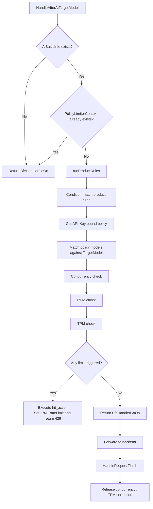
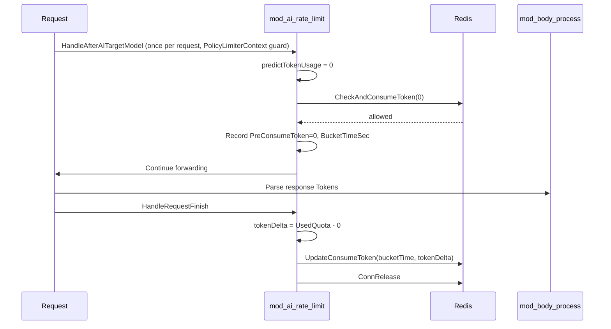

# Chapter 33: Rate Limit Module Implementation: mod_ai_rate_limit

## Chapter Goals

Through this chapter, readers will understand the complete implementation of the rate limit module `mod_ai_rate_limit` in the Rainway AI Gateway Data Plane. After reading this chapter, readers will be able to:

- Understand the position of `mod_ai_rate_limit` in the BFE module pipeline and the boundaries of its responsibilities;
- Master the Redis implementation principles of the three rate limiting algorithms: TPM, RPM, and concurrency;
- Understand how the Control Plane (AI Gateway API) generates stable Redis rate limit Keys and delivers them to BFE;
- Trace the construction flow of the 429 response after rate limiting is triggered;
- Master the loading, validation, and hot reload mechanisms of the module configuration;
- Understand the monitoring items exposed by the module and the meaning of the Prometheus metrics.

This chapter corresponds to [Chapter 21: Quota and Rate Limit Design](../design/chapter12-quota-and-rate-limit.md) in the Design section and [Chapter 23: Rate Limit Policy Configuration](../operation/chapter23-rate-limit-config.md) in the Operation section, focusing on Data Plane implementation details.

## Responsibilities of the mod_ai_rate_limit Module

`mod_ai_rate_limit` is a built-in module of the BFE Data Plane responsible for AI request rate limiting, located in `bfe/bfe_modules/mod_ai_rate_limit/`. It performs distributed rate limiting on requests entering the AI gateway path, supporting three types of limits configured by dimensions such as product, API-Key, and model: TPM (Tokens Per Minute), RPM (Requests Per Minute), and maximum concurrency.

In the BFE module pipeline, `mod_ai_rate_limit` registers at the `HandleAfterAITargetModel` callback point. This callback fires after the target model is resolved and before forwarding, once per cluster attempt (every `doSingleAIForward` call, including API-Key rotation and cluster fallback). `mod_ai_token_auth` and `mod_ai_rate_limit` both fire at `HandleAfterAITargetModel`, and the registration order guarantees that `mod_ai_token_auth` runs before rate limiting (see `moduleList` in `bfe/bfe_modules/bfe_modules.go`: `mod_ai_token_auth` → `mod_ai_route` → `mod_body_process` → `mod_ai_rate_limit`), so the model allowlist/blocklist check always precedes rate limiting. The rate limit decision depends on two kinds of data: `ClientApiKey`, written by `mod_ai_token_auth` at the `HandleFoundProduct` stage, and the post-forwarding target model `AiBasicInfo.TargetModel` resolved at the routing stage. Any change to this order would break the dependency chain.

The core responsibilities of the module can be summarized as follows:

1. **Policy matching**: match the product-line rules and rate limit policies in `ai_rate_limit.data` based on the request's `product`, `ClientApiKey`, and the post-forwarding target model (`TargetModel`);
2. **Rate limit checks**: for a matched policy, perform concurrency, RPM, and TPM checks in sequence; the request is rejected if any limit is exceeded;
3. **Post-processing**: in the `HandleRequestFinish` phase, release the concurrency count and correct the TPM pre-consumed value based on the actual Token consumption.

Because the callback fires per cluster attempt while the rate limit check must run at most once per request, `PolicyLimiterContext` (stored in `Request.Context` as `mod_ai_rate_limit.policy_limiter_ctx`) doubles as an idempotency guard: the callback entry first checks whether this Context already exists and passes through immediately if so, ensuring that repeated callbacks from key rotation and fallback never count twice.

The module state machine is as follows:



## TPM, RPM, and Concurrency Rate Limit Algorithms

All three types of rate limiting in `mod_ai_rate_limit` ultimately rely on Redis counters. BFE executes Lua scripts through `RedisLRAgent` in `bfe_util/limit_rate/` to guarantee the atomicity of counter operations. The three algorithms are described below.

### Overall Comparison of the Limiters

| Dimension | Concurrency | RPM | TPM |
|-----------|-------------|-----|-----|
| Object limited | Number of requests being processed simultaneously | Request count per unit window | Token consumption per unit window |
| Redis data structure | `STRING` (INCR/DECR) | `ZSET` (sorted set of timestamps) | `HASH` (bucketed counting) |
| Window type | No window; relies on TTL | Sliding window | Sliding window + sub-bucket peak |
| When the actual value is obtained | `HandleAfterAITargetModel` | `HandleAfterAITargetModel` | Pre-consumed at `HandleAfterAITargetModel`, corrected at `HandleRequestFinish` |
| Release on failure | `HandleRequestFinish` calls `ConnRelease` | No release needed | No release needed |

### Concurrency Rate Limiting

Concurrency rate limiting is implemented with a single Redis counter. When a request arrives (at the `HandleAfterAITargetModel` stage, fired per cluster attempt, with the `PolicyLimiterContext` idempotency guard ensuring only one acquire per request), `ConcurrencyLimiter.ConnAcquire` is called to perform an atomic `INCR` on the counter; when the request finishes, `ConnRelease` is called in `HandleRequestFinish` to perform a `DECRBY`. `ConcurrencyLimiter` is defined in `bfe/bfe_util/limit_rate/redis_concurrency_limiter.go`:

```go
func (l *ConcurrencyLimiter) ConnAcquire(agent *RedisLRAgent) (bool, int64, int64, error) {
    // ...
    currentTime, isAllowed, curCount, err := agent.ConAcquire(l.redisKey, connThreshold, l.ttl)
    // ...
}
```

The core logic of the corresponding Lua script `redis_concurrency_limit_acquire.lua` is: read the current counter value; if it is already greater than or equal to the threshold, reject; otherwise `INCR` and set the TTL via `EXPIRE`. During release at the `HandleRequestFinish` phase, the script `redis_concurrency_limit_release.lua` checks whether the current value is less than or equal to 0, avoiding negative values caused by concurrent releases after the Key has expired.

### RPM Rate Limiting

RPM rate limiting implements a sliding window based on a Redis sorted set (ZSET). Each request is added to the set with the current timestamp as the score, and members outside the window are cleaned up. `QPMLimiter` is defined in `bfe/bfe_util/limit_rate/redis_qpm_limiter.go`:

```go
func (l *QPMLimiter) Check(reqToConsume int64, agent *RedisLRAgent) (bool, int64, float64, error) {
    currentTime, isAllowed, tat, err := agent.QpmCheck(l.redisKey, period, limit, reqToConsume)
    // ...
}
```

The key steps of the Lua script `redis_qpm_limit_check.lua` are as follows:

1. Call `ZREMRANGEBYSCORE` to remove timestamps earlier than `now - period`;
2. Call `ZCARD` to get the number of requests already within the window;
3. If the existing request count is greater than or equal to `limit`, return a rejection;
4. Otherwise, write the current request timestamp into the ZSET and set the expiration time.

This approach has per-request precision and can limit the request count per unit window fairly accurately. The `burst` field is used for initialization in `QPMLimiter`, but the actual rate limiting is mainly controlled by `limit` and the window.

### TPM Rate Limiting

TPM rate limiting is the most complex scenario, because Token consumption cannot be determined until the request is actually complete. `mod_ai_rate_limit` adopts a two-phase "pre-consume + correction" approach: at the `HandleAfterAITargetModel` phase, it predicts the possible Token consumption based on the request's prompt Token count and pre-consumes it; at the `HandleRequestFinish` phase, it corrects the counter via `UpdateTokenUsage` based on the difference between the actual Token consumption parsed by `mod_body_process` and the pre-consumed value.

`TPMLimiter` is defined in `bfe/bfe_util/limit_rate/redis_tpm_limiter.go`:

```go
func (l *TPMLimiter) TryCheck(tokensToConsume int64, agent *RedisLRAgent) (bool, int64, int64, error) {
    currentTime, _, _, _, _, isFinalAllowed, err := agent.CheckAndConsumeToken(...)
    if isFinalAllowed {
        preconsumeToken = tokensToConsume
    }
    return isFinalAllowed, currentTime, preconsumeToken, nil
}

func (l *TPMLimiter) UpdateTokenUsage(bucketTime int64, tokensConsumeDelta int64, agent *RedisLRAgent) error {
    _, err := agent.UpdateConsumeToken(l.key, bucketTime, l.bucketSizeSec, tokensConsumeDelta)
    return err
}
```

The pre-consumed Token count is computed by `tpmLimiterItem.predictTokenUsage`; the current implementation is a linear prediction:

```go
func (r *tpmLimiterItem) predictTokenUsage(promptToken int64) int64 {
    return int64(r.ReservedOff + r.ReservedX*float64(promptToken))
}
```

Here `ReservedX` and `ReservedOff` are currently fixed at 0, so the predicted value is actually 0. This means the current implementation mainly writes the actual Token consumption during the post-completion correction phase, and the TPM check at the `HandleAfterAITargetModel` phase does not become the primary interception mechanism. These two fields are reserved to support a prediction model based on prompt Tokens in the future.

The Redis data structure for TPM is a Hash, where the Key is the Redis Key, each Field is the start timestamp of a sub-bucket, and the Value is the number of Tokens consumed in that bucket. The Lua script `redis_tpm_limit_check.lua` maintains both the overall window threshold and the sub-bucket peak threshold:

- Overall window threshold `tpm_threshold`: the maximum number of Tokens allowed within the entire sliding window;
- Sub-bucket peak `bucket_peak_limit`: the maximum number of Tokens allowed within each `bucket_size_sec` sub-bucket.

The script first cleans up Fields outside the window, then checks whether the current sub-bucket and the overall window both allow the consumption; only when both allow it does it perform `HINCRBY`. The `UpdateConsumeToken` script then applies an incremental or decremental correction to the corresponding sub-bucket based on the difference between the actual consumption and the pre-consumed value after the request completes.

The two-phase TPM flow is as follows:



## Redis Rate Limit Key Design

### The Control Plane Generates the Full Key

When the Control Plane exports the rate-limit configuration, it generates a full Redis Key for every rule and delivers it with the configuration. The generation logic lives in `model/shared/rate_limit_redis_key.go`:

```go
func BuildBFERateLimitRedisKey(policyID int64, ruleType string, name string) string {
    return fmt.Sprintf("default_bfe_rlp-%d_%s_rlp-%d_%s", policyID, ruleType, policyID, name)
}
```

TPM / RPM rules pass `RL_TPM` / `RL_RPM` as `ruleType` and the rule name as `name`, producing keys such as `default_bfe_rlp-1_RL_TPM_rlp-1_tpm_1min`. The rule name is part of the Key: renaming a rule is equivalent to deleting the old rule and adding a new one — the new rule uses a new Key and its counters start over; changing other fields such as `model` does not change the Key, and counters are not reset.

On the BFE side, the `redis_key` field in the configuration takes priority; if the configuration does not carry this field, it falls back to the local construction logic described below. This design is detailed in `bfe/docs/zh_cn/sys_design/ai_rate_limit_redis_key.md`.

### Key Construction on the BFE Side

`buildTpmRedisKey` and `buildRpmRedisKey` in `bfe/bfe_modules/mod_ai_rate_limit/policy_limiter.go` implement the Key construction and compatibility logic:

```go
func buildRedisKey(policyId string, suffix string) string {
    return fmt.Sprintf("%s_%s_%s", "default_bfe", policyId, suffix)
}

func buildTpmRedisKey(policyId string, rule *TPMRuleConf) string {
    if rule.RedisKey != "" {
        if strings.HasPrefix(rule.RedisKey, "default_bfe_") {
            return rule.RedisKey
        }
        return buildRedisKey(policyId, rule.RedisKey)
    }
    return buildRedisKey(policyId, fmt.Sprintf("tpm_%s", buildTpmInstId(rule)))
}
```

In `newPolicyLimiterSet`, each policy's TPM/RPM rules are instantiated into the corresponding limiters, with the Redis Key generated by the functions above:

```go
redisKey := buildTpmRedisKey(policyId, rule)
limiter := limit_rate.NewTPMLimiter(redisKey, rule.Threshold, rule.TimeWindow, ...)
```

The concurrency rate limit Key is uniformly `default_bfe_<policyId>_con`.

### Compatibility Notes

| Scenario | Behavior |
|----------|----------|
| Configuration carries `redis_key` | BFE uses this field directly to build the Redis Key |
| Configuration lacks `redis_key` | Falls back to the legacy Key based on `name` (or the threshold tuple when the rule is unnamed); counter behavior unchanged |
| Rule renamed (other fields unchanged) | The rule name is encoded in the Key; renaming is equivalent to deleting the old rule and adding a new one — a new Key is used and counters start over |
| Model modified (other fields unchanged) | `redis_key` unchanged; counters not reset |
| Rule deleted/added | The Control Plane cleans up the deleted rule's Key; the new rule uses a new Key and counters start over |

## Rate Limit Triggering and the Response (429)

### Hit Action

The `hit_action` in the product-line rules determines the behavior after rate limiting is triggered. The actions supported by `mod_ai_rate_limit` are `PASS`, `FINISH`, and `CLOSE`, defined in `bfe/bfe_modules/mod_ai_rate_limit/action.go`:

```go
var allowReqActions map[string]bool = map[string]bool{
    action.ActionClose:  true,
    action.ActionFinish: true,
    action.ActionPass:   true,
}
```

- `PASS`: allow the request after a hit, commonly used for monitoring-only scenarios without actual rate limiting;
- `FINISH`: construct a 429 response and finish the request after a hit;
- `CLOSE`: close the connection directly.

Production configurations typically use `FINISH`.

### 429 Response Construction

When `executePolicyAction` receives a `FINISH` instruction, the module constructs the error code and response based on the currently hit rate limit type. The code is located in `bfe/bfe_modules/mod_ai_rate_limit/mod_ai_rate_limit.go`:

```go
func (m *ModuleAiRateLimit) executePolicyAction(...) (int, *bfe_http.Response) {
    if rule.hitAction.Cmd == action.ActionFinish {
        // Determine the rate limit type based on the hit information
        if policyHitInfo.IsConcurrency {
            errorCode = bfe_basic.CodeConcurrencyLimitExceeded
            limitType = bfe_basic.LimitTypeConcurrency
        } else if len(policyHitInfo.RpmRules) > 0 {
            errorCode = bfe_basic.CodeRpmLimitExceeded
            limitType = bfe_basic.LimitTypeRpm
        } else if len(policyHitInfo.TpmRules) > 0 {
            errorCode = bfe_basic.CodeTpmLimitExceeded
            limitType = bfe_basic.LimitTypeTpm
        }

        aiError := bfe_basic.NewAiErrorWithDetails(
            errorCode,
            bfe_basic.TypeRateLimitError,
            fmt.Sprintf("Rate limit exceeded for policy %s", policy.Name),
            &bfe_basic.AiErrorDetail{
                ApiKey:    apiKey,
                LimitType: limitType,
            },
        )
        resp := aiError.CreateErrorResponse(req)
        return bfe_module.BfeHandlerFinish, resp
    }
}
```

The final response has the HTTP status code `429 Too Many Requests`. The response body carries metadata such as the error code, the rate limit type, and the API-Key, making it easy for clients to identify the cause of the rate limit.

### Distinguishing Local Rate Limits from Upstream 429

A local rate limit rejection and an upstream 429 follow completely different paths in the forwarding loop. When `runProductRules` decides a limit is hit, besides constructing the 429 response it also sets `req.ErrCode = bfe_basic.ErrAiRateLimit` (a global sentinel error marker defined in `bfe_basic/error_code.go`). The `ServeHTTPForAI()` forwarding loop recognizes this marker in two places:

- **Cluster fallback guard**: when an attempt ends with a local rate limit, `ErrCode == bfe_basic.ErrAiRateLimit` terminates the attempt list immediately, with no degradation to a backup cluster;
- **Key rotation guard**: the key-level retry inside `aiClusterInvoke` recognizes this marker and stops rotating, returning as-is (the key is not marked used, and no session-affinity penalty is applied).

An upstream 429 returned by the model service does not carry this marker and is still handled by the original logic: the current key is marked used and rotation moves to another key in the same cluster; cluster-level fallback is decided by `shouldTriggerFallback()` only after rotation still fails. This distinction ensures that a rejection comes from the gateway's own quota control rather than transient noise from an upstream key.

### Behavior on Redis Failure

The module configuration `IsRejectOnRedisError` controls whether requests are rejected when Redis fails. When a Redis call fails and this switch is `true`, the module records `IsRedisError` and triggers the `FINISH` action to return 429; when it is `false`, the request is allowed to pass, avoiding a complete service outage caused by a Redis failure.

## Configuration Loading and Hot Reload

### Two-Layer Configuration Structure

The configuration of `mod_ai_rate_limit` has two layers:

1. **Module basic configuration** `mod_ai_rate_limit.conf` (INI format): specifies the product rule file path, Redis connection parameters, `IsRejectOnRedisError`, and logging switches;
2. **Product rule data** `ai_rate_limit.data` (JSON format): contains product-line rules, rate limit policies, and API-Key binding relationships.

An example of the module basic configuration:

```ini
[basic]
ProductRulePath = ../conf/mod_ai_rate_limit/ai_rate_limit.data
IsRejectOnRedisError = true

[redis]
bns = BFE.poc-redis-wx
connectTimeout = 20
readTimeout = 20
writeTimeout = 20
maxIdle = 20

[log]
OpenDebug = false
```

### Startup Loading Flow

`ModuleAiRateLimit.Init` is the module startup entry point, located in `bfe/bfe_modules/mod_ai_rate_limit/mod_ai_rate_limit.go`. Its loading flow is as follows:

1. Call `ConfLoad` to read `mod_ai_rate_limit.conf`;
2. Create `redisClient` and `redisAgent` based on the Redis configuration;
3. Call `loadProductRuleTable` to load `ai_rate_limit.data`;
4. Register `targetModelCheckHandler` with `HandleAfterAITargetModel` (`mod_ai_token_auth`'s target model check is also registered at this point, before this module, so the whitelist check always precedes rate limiting);
5. Register `limitRequestFinishHandler` with `HandleRequestFinish`;
6. Register the monitoring and hot reload Web Handlers.

```go
func (m *ModuleAiRateLimit) Init(cbs *bfe_module.BfeCallbacks, whs *web_monitor.WebHandlers, cr string) error {
    conf, err := ConfLoad(confPath, cr)
    // ...
    client := redis_client.NewRedisClient(options)
    m.redisClient = client
    m.redisAgent = limit_rate.NewRedisLRAgent(m.redisClient)

    if _, err := m.loadProductRuleTable(nil); err != nil {
        return err
    }

    cbs.AddFilter(bfe_module.HandleAfterAITargetModel, m.targetModelCheckHandler)
    cbs.AddFilter(bfe_module.HandleRequestFinish, m.limitRequestFinishHandler)
    // ...
}
```

### Data File Loading and Validation

The loading and validation of `ai_rate_limit.data` is handled by `bfe/bfe_modules/mod_ai_rate_limit/data_load.go`. The file structure is first deserialized into `AiRateLimitConfFile`, validated by `Check`, and then converted via `Convert()` into the runtime structure `AiRateLimitConf`.

Key validation points include:

- `Version` must not be empty;
- Condition expressions of product-line rules must be valid;
- The `window_minutes` of each TPM/RPM rule must be within `[1, 360]`;
- `name` must not be duplicated within the same rule list;
- At most 3 TPM rules and 3 RPM rules;
- At least one of TPM, RPM, and maximum concurrency must be configured.

### Hot Reload and Limiter Update

`loadProductRuleTable` serves both startup loading and hot reload. After the new configuration passes validation, it calls `productTable.load()` to atomically replace the rule table, and calls `limiterManager.updateLimiters()` to rebuild the limiters.

When rebuilding limiters, `updateLimiters` tries to preserve the statistical counts of the old limiters, avoiding jumps in monitoring values after a hot reload:

```go
func (m *policyLimiterManager) updateLimiters(ratePolicies map[string]*PolicyConf) {
    oldLimiters := m.limiters
    newLimiters := make(map[string]*policyLimiterSet, len(ratePolicies))
    for policyId, policy := range ratePolicies {
        new_item := newPolicyLimiterSet(policyId, policy)
        newLimiters[policyId] = new_item
    }

    m.lock.Lock()
    m.limiters = newLimiters
    for policyId, new_item := range newLimiters {
        if old_item, ok := oldLimiters[policyId]; ok {
            new_item.updateCount(old_item)
        }
    }
    m.lock.Unlock()
}
```

The hot reload endpoint is `GET /reload/mod_ai_rate_limit`, registered by `reloadHandlers`.

## Monitoring Items

`mod_ai_rate_limit` exposes two types of monitoring: module state counters and Prometheus metrics.

### Module State Counters

The module state is maintained through `module_state2.State`. The following counters are predefined in `CounterKeys` at startup:

```go
var CounterKeys = []string{
    "REQ_AI_RATE_MEET_THRESHOLD",
}
```

In addition, `limiterManager` internally maintains `matchCount` and `hitCount` for each TPM/RPM rule and concurrency limiter of each policy, used to count the number of matches and hits.

### Prometheus Metrics

The Prometheus metrics are defined in `bfe/bfe_modules/mod_ai_rate_limit/prometheus_states.go`, grouped into TPM, RPM, and concurrency categories. Each group contains an aggregate Gauge and CounterVecs split by `policy_id` and `inst_id`:

| Metric Name | Type | Description |
|-------------|------|-------------|
| `tpm_match_total` | Gauge | Total number of TPM rule matches |
| `tpm_match` | CounterVec | TPM matches split by policy and rule |
| `tpm_hit_total` | Gauge | Total number of TPM rule hits (rejections) |
| `tpm_hit` | CounterVec | TPM hits split by policy and rule |
| `tpm_token_total` | Gauge | Cumulative TPM Token count |
| `tpm_token` | CounterVec | Token count split by policy and rule |
| `rpm_match_total` / `rpm_match` / `rpm_hit_total` / `rpm_hit` | Gauge/CounterVec | Corresponding RPM metrics |
| `con_match_total` / `con_match` / `con_hit_total` / `con_hit` | Gauge/CounterVec | Corresponding concurrency metrics |

The `getPrometheus` method periodically aggregates the in-memory `LimiterStats` and writes them to the Prometheus Registry, exposing them through the `/monitor/mod_ai_rate_limit.prometheus` endpoint.

## Key Code Snippets

### Callback Entry and Idempotency Guard

`targetModelCheckHandler` is the entry point for `HandleAfterAITargetModel`. The callback fires per cluster attempt (key rotation and fallback both re-fire it), so it first checks whether a `PolicyLimiterContext` already exists: if it does, the request has already been rate-limit-checked and the handler passes through immediately — this is the once-per-request idempotency guard:

```go
func (m *ModuleAiRateLimit) targetModelCheckHandler(req *bfe_basic.Request) (int, *bfe_http.Response) {
    // Fired per cluster attempt (key rotation / fallback); the policy check
    // must run at most once per request.
    if getPolicyLimiterContext(req) != nil {
        return bfe_module.BfeHandlerGoOn, nil
    }

    meta := req.GetAiBasicInfo()
    if meta == nil {
        return bfe_module.BfeHandlerGoOn, nil
    }

    // policies are matched and metered against the resolved target model
    targetModel := meta.TargetModel

    req.InitAiRateLimitHitInfo()
    return m.runProductRules(req, meta, targetModel)
}
```

### Product-Line Rule Matching

`runProductRules` retrieves the rule list for the product and matches them in order; on a match, it calls `executeCheckLimitPolicy`. When a limit is hit, it sets the `bfe_basic.ErrAiRateLimit` marker:

```go
func (m *ModuleAiRateLimit) runProductRules(req *bfe_basic.Request, meta *bfe_basic.AiBasicInfo, targetModel string) (int, *bfe_http.Response) {
    product := req.Route.Product
    rules := m.productTable.getProductRules(product)
    // ...
    ctx := &PolicyLimiterContext{}
    setPolicyLimiterContext(req, ctx)
    for _, rule := range rules {
        if !rule.cond.Match(req) {
            continue
        }
        ret, res := m.executeCheckLimitPolicy(req, meta, rule, ctx, targetModel)
        if ret != bfe_module.BfeHandlerGoOn {
            req.ErrCode = bfe_basic.ErrAiRateLimit
            return ret, res
        }
    }
    return bfe_module.BfeHandlerGoOn, nil
}
```

### Policy Check Order

`executeCheckLimitPolicy` first matches the post-forwarding target model against `policy.Models` (`matchModel(policy.Models, targetModel)`; policies that do not match are skipped), then performs checks in the order of concurrency, RPM, and TPM; any failure triggers `hit_action`:

```go
if !ls.checkConcurrency(req, meta, m.redisAgent, ctx, targetModel, m.isRejectOnRedisError) {
    return m.executePolicyAction(req, meta, policyId, policy, rule)
}
if !ls.checkRPM(req, meta, m.redisAgent, ctx, targetModel, m.isRejectOnRedisError) {
    return m.executePolicyAction(req, meta, policyId, policy, rule)
}
if !ls.checkTPM(req, meta, m.redisAgent, ctx, targetModel, m.isRejectOnRedisError) {
    return m.executePolicyAction(req, meta, policyId, policy, rule)
}
```

### Cleanup After Request Completion

`limitRequestFinishHandler` handles TPM correction and concurrency release:

```go
func (m *ModuleAiRateLimit) limitRequestFinishHandler(req *bfe_basic.Request, res *bfe_http.Response) int {
    // ...
    tokenUsage := meta.GetTokenUsage()
    for _, tpmData := range ctx.TpmLimiterDataList {
        if !tpmData.IsAllowed {
            continue
        }
        tokenDelta := tokenUsage.UsedQuota - tpmData.PreConsumeToken
        if tokenDelta != 0 {
            tpmData.Limiter.UpdateTokenUsage(tpmData.BucketTimeSec, tokenDelta, m.redisAgent)
        }
        tpmData.Item.tokenCount.Add(uint64(tokenUsage.UsedQuota))
    }

    for _, limiter := range ctx.ConLimiters {
        limiter.ConnRelease(m.redisAgent)
    }
    return bfe_module.BfeHandlerGoOn
}
```

## Chapter Summary

- `mod_ai_rate_limit` is the module of the BFE Data Plane responsible for AI request rate limiting. Its main logic registers at the `HandleAfterAITargetModel` callback point (after the target model is resolved and before forwarding, fired per cluster attempt), and TPM/RPM/maximum concurrency policies are matched against the post-forwarding target model (`AiBasicInfo.TargetModel`); `mod_ai_token_auth` and `mod_ai_rate_limit` fire at the same point, and the registration order guarantees the whitelist check precedes rate limiting.
- The callback fires per cluster attempt, but the rate limit check runs at most once per request: `PolicyLimiterContext` doubles as an idempotency guard, and repeated callbacks from key rotation and fallback pass through directly.
- The module supports three types of limits: TPM, RPM, and maximum concurrency, implemented on Redis Hash, Redis ZSET, and Redis String respectively, all guaranteeing atomicity via Lua scripts.
- TPM adopts a two-phase "pre-consume + correction" approach: pre-consumption by predicted Tokens at the `HandleAfterAITargetModel` phase, and correction based on actual Token consumption at the `HandleRequestFinish` phase.
- The Control Plane generates a stable `redis_key` for each TPM/RPM rule (`RL_TPM_rlp-<id>_<idx>` / `RL_RPM_rlp-<id>_<idx>`); BFE prioritizes this field when building Redis Keys and falls back to the legacy logic when it is not specified.
- After rate limiting is triggered, the module executes `FINISH` or `CLOSE` according to `hit_action`; by default it returns 429 Too Many Requests, carrying the rate limit type and error code in the response body. A local rate limit sets the `bfe_basic.ErrAiRateLimit` marker, which blocks key rotation and cluster fallback, while an upstream 429 still follows the original key rotation logic.
- The configuration uses an INI + JSON two-layer structure and supports hot reload via `/reload/mod_ai_rate_limit`; during hot reload, the statistical counts of old limiters are preserved to avoid monitoring jumps.
- The module exposes Prometheus metrics such as `tpm_match`, `tpm_hit`, `rpm_match`, `rpm_hit`, `con_match`, and `con_hit`, supporting observability split by `policy_id` and `inst_id`.

## References

- `bfe/bfe_modules/mod_ai_rate_limit/mod_ai_rate_limit.go`
- `bfe/bfe_modules/mod_ai_rate_limit/policy_limiter.go`
- `bfe/bfe_modules/mod_ai_rate_limit/data_load.go`
- `bfe/bfe_modules/mod_ai_rate_limit/conf_load.go`
- `bfe/bfe_modules/mod_ai_rate_limit/policy_table.go`
- `bfe/bfe_modules/mod_ai_rate_limit/prometheus_states.go`
- `bfe/bfe_util/limit_rate/redis_tpm_limiter.go`
- `bfe/bfe_util/limit_rate/redis_qpm_limiter.go`
- `bfe/bfe_util/limit_rate/redis_concurrency_limiter.go`
- `bfe/docs/zh_cn/modules/mod_ai_rate_limit/mod_ai_rate_limit.md`
- `bfe/docs/zh_cn/configuration/mod_ai_rate_limit/ai_rate_limit.data.md`
- `bfe/docs/zh_cn/sys_design/ai_rate_limit_redis_key.md`
- `ai-gateway-api/design-docs/sys-design/details/限流策略与导出.md`
