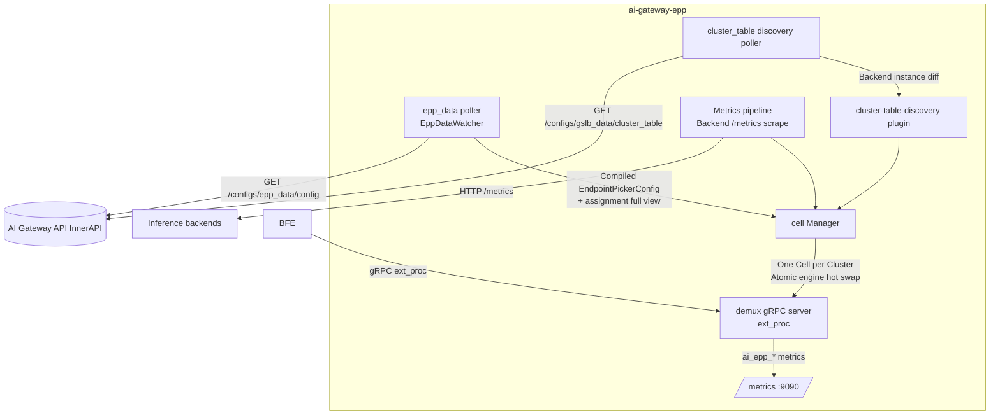
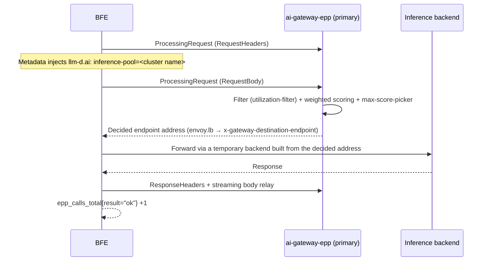

# Chapter 36 EPP Component Implementation

## Chapter Goals

EPP intelligent scheduling spans three code repositories: the Control Plane ai-gateway-api, the Data Plane BFE, and the scheduler ai-gateway-epp. This chapter explains the code organization and key paths of all three sides from an implementation perspective:

- The process structure of ai-gateway-epp: command-line parameters, the dual-poller + Cell engine architecture, and the interaction with the AI Gateway API InnerAPI;
- The Control Plane implementation of ai-gateway-api: the model layer of the instance pool and assignments, the compiler, the OpenAPI and InnerAPI endpoint layers, Cluster integration, and configuration export;
- The Data Plane implementation of BFE: parsing of the `GslbBasic` EPP fields, the ext_proc gRPC client, EPPCheck hysteresis switching, failure fallback, and metrics instrumentation.

For design semantics and operations, see [Chapter 16 EPP Scheduling Design](../design/chapter16-epp-scheduling-design.md) and [Chapter 26 EPP Scheduling Configuration and Operations](../operation/chapter26-epp-scheduling-operation.md).

---

## Overview of the ai-gateway-epp Component

ai-gateway-epp is a multi-Cluster scheduler based on the llm-d EPP: it runs in a configuration-driven way (no dependency on Kubernetes CRDs), consumes the scheduling configuration and assignment view exported by the AI Gateway API InnerAPI, and provides backend selection decisions to BFE via the gRPC ext_proc protocol. The code lives in the `ai-gateway-epp/` repository.

### Command-Line Parameters

The entry point is `cmd/epp/main.go`; parameter parsing is in `parseConfig` of `cmd/epp/config.go`:

| Parameter | Default | Description |
|-----------|---------|-------------|
| `-api-addr` | `http://127.0.0.1:8181/inner-api/v1` | InnerAPI base address |
| `-api-token` | Environment variable `AI_GATEWAY_EPP_TOKEN` | InnerAPI authentication token |
| `-instance-id` | Environment variable `AI_GATEWAY_EPP_INSTANCE_ID`, default hostname | Instance id; matched with the instance ids registered in `/epp-pool` to locate the role |
| `-poll-interval` / `-poll-timeout` | `5s` / `3s` | InnerAPI polling interval and per-request timeout |
| `-grpc-port` / `-health-port` / `-metrics-port` | `9002` / `9003` / `9090` | ext_proc, health check, and metrics server ports |
| `-grpc-tls-cert` / `-grpc-tls-key` | empty (plaintext) | Server-side TLS for ext_proc and health gRPC |
| `-bind-address` | empty (all interfaces) | Listen address |
| `-default-pool` | empty | Fallback Cluster when a request lacks the inference-pool metadata (empty = reject) |
| `-engine-drain-timeout` | `60s` | In-flight request drain cap for the old engine during an engine hot swap |
| `-refresh-metrics-interval` | `50ms` | Scrape interval for backend `/metrics` metrics |

### Dual-Poller + Cell Engine Architecture

Two pollers run inside the process, both based on the `Source[T]` incremental polling framework in `pkg/poller/poller.go` (version negotiation, skip on `Data==null`, failure backoff, fail-static retention of locally known configuration):

The division of labor between the two pollers:

- **epp_data poller** (`EppDataWatcher` in `pkg/poller/epp_data.go`): a single pull obtains both configuration sections. It self-matches its role against the assignment full view by `-instance-id` (`resolveRole` is a pure function: primary match → `RolePrimary`, standby match → `RoleStandby`, neither match → `RoleNone` skip), then diffs against the local Cell set to drive `Ensure` / `Promote` / `Demote` / `Drop` of `pkg/cell/manager.go`. The `epp_config` section and the assignment section are processed within the same version snapshot, so the two are naturally consistent. When this instance has no role at all, the `ai_epp_assignment_no_match` metric is set, making it easy to spot a misconfigured id during deployment.
- **cluster_table discovery poller** (`pkg/poller/discovery.go`): diffs the backend instance list exported by cluster_table into the endpoint set of each Cluster; instances with `Weight==0` are treated as drained and skipped directly, and instances that have disappeared from the export are removed accordingly.

Cell engine hot swap happens in `pkg/cell/manager.go`: when epp_config changes, the engine is recompiled per Cluster (`pkg/cell/compile.go`; the llm-d loader loads the complete `EndpointPickerConfig`), the pointer is swapped atomically after hash comparison, and the old engine drains (default 60 seconds) before being destroyed; a compile failure of a single Cluster only affects that Cluster (the old engine keeps running) and does not spread to other Clusters.

demux (`pkg/demux/server.go`) is the ext_proc gRPC server: it extracts `llm-d.ai → inference-pool` (i.e. the Cluster name) from the `MetadataContext` of the first message and routes to the corresponding Cell; non-primary Cells return `ErrCellDraining` (BFE classifies `cell is not serving` as a draining error accordingly and retries on the next address); the decision result is returned in `dynamic_metadata` of the response at `envoy.lb → x-gateway-destination-endpoint`.

---

## Control Plane Implementation: ai-gateway-api

### model/epp_pool: Instance Pool, Assigner, and Compiler

The model-layer code is concentrated in `ai-gateway-api/model/epp_pool/`; the storage layer is in `ai-gateway-api/storage/rdb/epp_pool/` (DAO operations on the `epp_instances` and `epp_assignments` tables):

| File | Responsibility |
|------|----------------|
| `epp_pool.go` | Instance pool read/write: GET/PATCH semantics of `/epp-pool` (full replacement of `epp_instances`) and field validation (unique group names, unique ids, unique `(host,port)`, group size) |
| `epp_config.go` | Structure definition and field validation of the simplified `epp_config` form (enums, ranges, seconds values, session-affinity pairing rule) |
| `compiler.go` | Compiler: deterministically expands the simplified `epp_config` into a complete `EndpointPickerConfig` — fixed injection of `cluster-table-discovery` / `utilization-filter` / scorers / `max-score-picker` / `openai-parser`, mapping (kv, queue) weights by profile and `cache_affinity`, injecting affinity scorers by switch conditions, expanding the `flowControl` section and `featureGates`; rules are fixed in a code template and covered by unit tests |
| `assignment.go` | Assigner: greedy + deterministic tie-break group/primary selection algorithm, upsert into `epp_assignments` (storing only primary_instance_id) |
| `reconciler.go` | Periodic reconciliation (30 seconds, configurable): scans all `balance_mode=EPP` Clusters and automatically repairs those without a valid assignment or with a dangling assignment (intra-group reselection → cross-group reassignment → assignment clearing), idempotent with zero writes in most rounds |
| `epp_data.go` | epp_data generator: merges both sections at export time — the epp_config section (compiled per Cluster) + the assignment section (full view joined at read time from `epp_assignments` and `epp_instances`, `standby=null` for single-instance groups) — going through the `VersionControlManager.ExportConfig` framework (topic `ConfigTopicEppData`, MD5 signature + version increment) |

### Endpoint Layer

| Directory | Endpoints | Implementation |
|-----------|-----------|----------------|
| `endpoints/openapi_v1/epp_pool/` | `GET` / `PATCH /open-api/v1/epp-pool` | `get.go`, `patch.go`; singleton resource, pool name from the configuration item `RunTime.DefaultEPPInstancePoolName` (default `EPP.pool`); PATCH validates then fully replaces and triggers automatic repair of dangling assignments |
| `endpoints/openapi_v1/epp_assignments/` | `GET /open-api/v1/epp-assignments`, `PUT /open-api/v1/epp-assignments/{cluster}` | `get.go`, `put.go`; GET returns the expanded view joined at read time (including `degraded` marks, `unassigned_clusters`, `idle_groups`); PUT manually overrides and validates that the primary exists in the group instance list, bumping the server_data_conf version |
| `endpoints/innerapi_v1/epp_data/` | `GET /inner-api/v1/configs/epp_data/config` | `export.go`; authentication reuses `FeatureRoute + ActionExport`, `version` increment (returns `Data: null` when unchanged) |
| `endpoints/openapi_v1/product_cluster/` | `POST/PUT /open-api/v1/clusters` | `create.go`, `update_basic.go`; the request body parses `balance_mode` and `epp_config` and enforces conditional requiredness and field validation |

### Cluster Integration and Configuration Export

- `model/icluster_conf/cluster.go`: the creation path generates a `Role=EPP` type instance pool according to `balance_mode`, and still fills the pool with the Provider `instance_pool` instances as usual (for the cluster_table export and BFE fallback WRR); `getBalanceMode()` reads the `balance_mode` field directly and is the sole source of truth for EPP mode; `ProviderInstancePoolSyncer` syncs to all Clusters referencing that Provider (including EPP pools) when a Provider instance pool changes (e.g. an instance `weight=0`).
- `model/icluster_conf/exporter.go`: cluster_table export; EPP pool instances enter the export list as usual (`Weight=0` means drained).
- `model/iroute_conf/exporter.go`: server_data_conf export. When an EPP-mode Cluster has a valid assignment, it exports `GslbBasic.BalanceMode=EPP` and the ordered `EPPAddr=[primary,standby]` (addresses driven by `epp_assignments` and joined via `net.JoinHostPort`); when there is no valid assignment, the Cluster degrades to `BalanceMode=WRR` with no `EPPAddr` generated, and an error-level log (including the Cluster name and reason) is output without blocking the whole distribution.

---

## Data Plane Implementation: BFE

The BFE-side implementation is concentrated in three places: configuration parsing, load balancing, and the reverse proxy.

### Configuration Parsing and Validation

`bfe/bfe_config/bfe_cluster_conf/cluster_conf/cluster_conf_load.go`:

- `BalanceModeEPP = "EPP"` enum (`:66`); `GslbBasicConf` carries `EPPAddr *[]string` (ordered primary/standby) and four optional structs `EPPCheck` / `EPPTimeout` / `EPPTLS` / `EPPBreaker` (`:423-432`), all with defaults;
- EPP-mode validation (from `:785`): when `BalanceMode=EPP`, `EPPAddr` is non-empty (`:786`); `checkEPPAddrs` validates that elements are `host:port` and deduplicates within the list (`:822`); `EPPCheckConfCheck` / `EPPTimeoutConfCheck` / `EPPTLSConfCheck` fill defaults and validate (`CAFile` must be readable when `Insecure=false`);
- Validation failures fail fast: the reload reports an error and is rejected, keeping the old configuration effective — no silent degradation.

### ext_proc Calls and Scheduling Integration

- `bfe/bfe_util/epp/epp_client.go`: the ext_proc gRPC client. A long-lived connection is maintained per EPP address (streams are established per request); the first `ProcessingRequest` has its request headers built by `BuildEnvoyGRPCHeaders`, injecting `MetadataContext.FilterMetadata["llm-d.ai"] = {"inference-pool": <cluster name>}`; the response path relays the body back in streaming via `EppResponseBodyFilter`, using a bounded buffer — on overflow the whole stream is abandoned with counting and instrumentation, guaranteeing that EndOfStream is always delivered.
- `bfe/bfe_balance/bal_gslb/bal_gslb.go`: `BalanceGslb` holds the `eppAddrs` ordered address table and the active index. `initEPP` / `closeEPP` (`:124-168`) manage connections and a background health-check goroutine per address (gRPC health, parameters from `EPPCheck`); `chooseBackendFromEPP` (`:173-277`) builds and sends the first ext_proc message and waits for the decision; `BalanceEpp` (`:492-528`) maps the EPP-decided address to a local backend and constructs a temporary backend; `SetGslbBasic` (`:88-111`) dispatches by `BalanceMode` — EPP builds/refreshes the address state machine, non-EPP closes the EPP connections.
- `bfe/bfe_server/reverseproxy.go` (`:345-355`): request-side integration. EPP mode calls `BalanceEpp`; on failure it falls back to the local `Balance()` (WRR); retries reuse the same connection to establish a new stream.
- Hysteresis state machine: the active address fails over to the next address after failing consecutively `FailThreshold` times, then enters a `Cooldown` period with no switch-back; after the cooldown, a higher-priority address must pass the health check consecutively `SuccessThreshold` times before failback. For `Unavailable / cell is not serving` and `unknown inference pool` errors, the request is retried directly on the next address of the same Cluster without waiting for the health check cycle.

The sequence of a single EPP call is as follows:

### Metrics Instrumentation

`bfe/bfe_balance/bal_gslb/epp_metrics.go` implements labeled metrics with Prometheus CounterVec/GaugeVec, exposed in text format via `/monitor/epp_metrics` registered in `bfe/bfe_server/web_server.go`:

- `epp_calls_total{cluster,result}`: result ∈ `ok` / `no_pool` / `unknown_pool` / `draining` / `transport`;
- `epp_fallback_local_total{cluster}`: number of local WRR fallbacks;
- `epp_failover_total{cluster}` / `epp_failback_total{cluster}` / `epp_active_addr_index{cluster}`.

---

## EPP-Side Implementation: ai-gateway-epp

| Location | Responsibility |
|----------|----------------|
| `pkg/poller/poller.go` | `Source[T]` polling framework: version increment, failure backoff, fail-static; metrics `ai_epp_poller_last_sync_timestamp` / `ai_epp_poller_failures_total` / `ai_epp_poller_backoff_state` |
| `pkg/poller/epp_data.go` | `EppDataWatcher`: consumes both sections of `/configs/epp_data/config`; `resolveRole` self-matches the role by `-instance-id`; assignment diff drives `Manager.Ensure/Promote/Demote/Drop`; `ai_epp_assignment_no_match` metric |
| `pkg/poller/discovery.go` | cluster_table polling and backend instance diff; `Weight==0` skipped (drained), disappeared instances removed |
| `pkg/innerapi/client.go` | InnerAPI HTTP client: `{ErrNum, ErrMsg, Data, WorkMode}` envelope, `?version=` increment, `Data==null` semantics; `EppDataConfigPath = "/configs/epp_data/config"` |
| `pkg/cell/manager.go` | Cell lifecycle and atomic engine hot swap (hash comparison → compile → pointer swap → old engine drain and destroy); `ai_epp_engine_reloads_total` / `ai_epp_cell_state` |
| `pkg/cell/compile.go` | Loads the compiled `EndpointPickerConfig` with the llm-d loader; a single Cluster compile failure keeps the old engine (defensive fallback) |
| `pkg/demux/server.go` | ext_proc gRPC server: `extractPool` extracts the inference-pool from metadata to route to a Cell; non-primary returns `ErrCellDraining`; the decided address is written to `envoy.lb → x-gateway-destination-endpoint` |
| `cmd/epp/plugins.go` | Plugin registration: `prefix-cache-scorer`, `session-affinity-scorer`, the `flowcontrol` plugin family, the `approx-prefix-cache` producer, `cluster-table-discovery`; the `flowControl` feature gate is off by default and enabled by the `featureGates` configuration |
| `cmd/epp/main.go` | Assembly: parse configuration → build the InnerAPI client → start the epp_data and cluster_table pollers → start the demux/health/metrics services |

Semantic points of the scheduling plugins: utilization-filter runs before scoring (fail-closed); when backend metrics are missing, scores are neutralized (kv score treated as 1.0, the filter not applied); the index of prefix-cache-scorer is a local per-endpoint LRU; session-affinity-scorer parses the session id from `session_affinity_header`, with binding state in local memory; affinity scorers are all ordinary items in the weighted sum (output clamp [0,1] × fixed weight 1.0) and are soft affinity.

---

## Chapter Summary

- ai-gateway-epp is built around dual pollers (epp_data + cluster_table discovery) + Cell engines: configuration and roles are obtained via version-increment polling; roles are self-matched by `-instance-id` in the assignment full view; engines swap atomically; standby Cells hold warm data with cold admission.
- `model/epp_pool/` of ai-gateway-api centrally implements the instance pool, compiler, assigner, reconciler, and the epp_data generator; `model/icluster_conf` and `model/iroute_conf` complete Cluster integration and bidirectional distribution, degrading to WRR + error log when there is no valid assignment.
- On the BFE side, `cluster_conf_load.go` parses and validates the `GslbBasic` EPP fields, `bal_gslb.go` implements the ordered address table, EPPCheck hysteresis, and `BalanceEpp` decision forwarding, `reverseproxy.go` completes integration and failure fallback, and `epp_metrics.go` outputs labeled metrics.

---

## References

- `ai-gateway-api/design-docs/modifications/2026-09-08-epp-scheduling-integration/change-summary.md`
- `ai-gateway-api/design-docs/modifications/2026-09-08-epp-scheduling-integration/design-changes.md`
- `ai-gateway-api/design-docs/modifications/2026-09-08-epp-scheduling-integration/api-changes.md`
- `ai-gateway-api/design-docs/sys-design/details/EPP调度对接.md`
- `ai-gateway-api/model/epp_pool/` (`compiler.go`, `assignment.go`, `reconciler.go`, `epp_data.go`)
- `ai-gateway-api/endpoints/openapi_v1/epp_pool/`、`endpoints/openapi_v1/epp_assignments/`、`endpoints/innerapi_v1/epp_data/`
- `ai-gateway-epp/docs/zh_cn/modifications/2026-09-08-epp-scheduling-integration/design-changes.md`
- `ai-gateway-epp/pkg/poller/epp_data.go`、`pkg/poller/discovery.go`、`pkg/cell/manager.go`、`pkg/demux/server.go`
- `bfe/docs/zh_cn/modifications/2026-09-06-epp-ai-gateway-integration/design-changes.md`
- `bfe/bfe_config/bfe_cluster_conf/cluster_conf/cluster_conf_load.go`
- `bfe/bfe_balance/bal_gslb/bal_gslb.go`、`bfe/bfe_balance/bal_gslb/epp_metrics.go`
