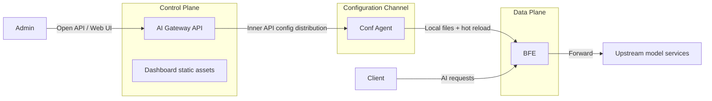
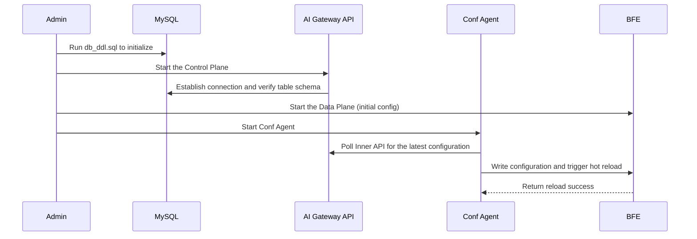

# Chapter 18: Installation and Deployment

## Chapter Goals

This chapter covers the production-ready installation and deployment of the Rainway AI Gateway. After reading this chapter, you will be able to:

- Prepare the hardware, software, and dependency environment required to run AI Gateway.
- Compile executable binaries from source and start them locally.
- Initialize a MySQL or SQLite database, configure the Redis dependency, and set the minimal Control Plane parameters needed to run.
- Build Docker images and run AI Gateway API in a container environment.
- Deploy the Control Plane and Data Plane components in a Kubernetes cluster.
- Understand the startup order and collaboration between AI Gateway API, BFE, and Conf Agent.
- Troubleshoot common deployment and startup issues.

## Core Concepts

The Rainway AI Gateway adopts a layered **Control Plane + Data Plane** architecture:

- **AI Gateway API**: the core of the Control Plane, responsible for creating, storing, and distributing policies and configurations. The corresponding repository is `rainway-ai-gateway/ai-gateway-api`.
- **BFE**: the Data Plane forwarding engine, responsible for routing, authentication, rate limiting, and forwarding of AI traffic. The corresponding repository is `bfenetworks/bfe`.
- **Conf Agent**: the configuration agent, which communicates with the Control Plane and triggers hot reload of BFE configurations. The corresponding repository is `bfenetworks/conf-agent`.
- **Dashboard**: the visual management console, usually served as static assets mounted into AI Gateway API.
- **Service Controller**: a Kubernetes service discovery component, deployed optionally.
- **Log Reader**: the access-log collection component, deployed with BFE in the Data Plane. It forwards BFE access logs to Kafka or MySQL for the reporting and observability pipelines. The corresponding repository is `rainway-ai-gateway/log-reader`.

In addition, the reporting standard form (one of Doris / ClickHouse / StarRocks, with Grafana optional as the presentation layer) relies on a set of optional external components: Kafka receives log messages from log-reader, the data warehouse stores detail and aggregated data, and Grafana renders the monitoring dashboards (optional). These observability components are not part of the AI Gateway itself; the one-click deployment scripts for the storage and presentation layers are provided by the `rainway-ai-gateway/ai-gateway-observability` repository, as described in "Deploying the Reporting Standard Form" below.



Figure 16-1: Relationship between the AI Gateway Control Plane, configuration channel, and Data Plane

## Environment Requirements

Before deploying AI Gateway, verify that the environment meets the following minimum requirements. It is recommended to deploy Control Plane components and Data Plane components on different hosts or in different container groups, so they can be scaled independently and failures are isolated.

### Control Plane AI Gateway API

| Dependency | Version | Description |
|---|---|---|
| Go | 1.22 or higher | Required for compiling from source |
| MySQL | 8.0 | Recommended for production; SQLite is also supported |
| Redis | 6.2 | Runtime state such as quota balances, rate limit counters, and session cache |

MySQL is used to persistently store core data such as API configurations, tenants, routes, certificates, and API-Keys. Redis is a critical runtime dependency of the AI Gateway: high-frequency state such as quota balances, RPM/TPM rate limit counters, and session cache are all read from and written to Redis directly. In single-machine validation scenarios, SQLite can be used in place of MySQL, but SQLite does not support high-concurrency writes and must not be used in production; Redis should not be replaced with SQLite.

### Data Plane BFE

| Dependency | Version | Description |
|---|---|---|
| Go | 1.22 or higher | Required for compiling from source |
| Linux / macOS / Windows | 64-bit | BFE runs on multiple platforms |

As a Data Plane component, BFE is sensitive to network throughput and latency. For production deployment, it is recommended to allocate dedicated CPU and memory resources and to enable kernel parameter tuning, such as adjusting `net.core.somaxconn`, `tcp_tw_reuse`, and so on.

### Configuration Agent Conf Agent

| Dependency | Version | Description |
|---|---|---|
| Go | 1.22 or higher | Required for compiling from source |
| Co-located with BFE | — | Conf Agent must write configurations to the machine where BFE runs |

Conf Agent is the configuration channel between the Control Plane and the Data Plane. It periodically pulls the latest configuration from AI Gateway API, writes the configuration to a local versioned directory, and calls BFE's monitor port to trigger a hot reload. Therefore, Conf Agent must run on the same machine or in the same Pod as BFE so that they can share the configuration directory.

## Compiling from Source and Starting the Binary

### Obtaining the Source Code

```bash
git clone https://github.com/rainway-ai-gateway/ai-gateway-api.git
cd ai-gateway-api
```

### Compiling

The project uses a Makefile to manage the build process. Running `make` automatically downloads dependencies, compiles the binary, and packages everything into the `output/` directory:

```bash
make
```

The key targets defined in `ai-gateway-api/Makefile` are:

- `make build`: compiles the `./ai-gateway-api` binary.
- `make package`: copies `conf/`, `static/`, `db_ddl.sql`, etc. into `output/`.
- `make docker`: builds a local container image.
- `make docker-push REGISTRY=...`: builds multi-architecture images and pushes them.

Before the first build, verify that the Go environment is set up correctly and that `GOPROXY` can reach public module repositories. If the network is restricted, configure a mirror:

```bash
export GOPROXY=https://goproxy.cn,direct
export GO111MODULE=on
```

After compilation, the `output/` directory has the following structure:

```text
output/
├── ai-gateway-api      # Executable
├── conf/               # Configuration files
├── static/             # Dashboard static assets
├── db_ddl.sql          # MySQL initialization script
└── db_ddl_sqlite.sql   # SQLite initialization script
```

### Starting the Service

Enter the `output/` directory and run:

```bash
./ai-gateway-api -c ./conf -sc ai_gateway_api.toml -l ./log
```

Startup parameter description:

- `-c`: root directory of configuration files, corresponding to `ai-gateway-api/conf/`.
- `-sc`: name of the main configuration file, default `ai_gateway_api.toml`.
- `-l`: log output directory.

Default listening ports:

- API service port: `8183`
- Monitor port: `8284`

After a successful startup, you can verify service health with:

```bash
curl http://localhost:8284/monitor/health
```

Visiting `http://localhost:8183` opens the Dashboard; the default username and password are both `admin`. Change the password immediately after the first login, and avoid running with default credentials in production.

## Database Initialization

AI Gateway API uses a relational database to store configurations. It currently supports two backends: MySQL 8 and SQLite.

### MySQL Initialization

1. Install MySQL 8 and create a database. It is recommended to set the character set to `utf8mb4` to support multilingual characters and emoji:

```sql
CREATE DATABASE IF NOT EXISTS open_bfe
  DEFAULT CHARACTER SET utf8mb4
  DEFAULT COLLATE utf8mb4_unicode_ci;
```

2. Run `db_ddl.sql` in the project root:

```bash
mysql -u{user} -p{password} < db_ddl.sql
```

3. Fill in the database connection information in the main configuration `conf/ai_gateway_api.toml`:

```toml
[Databases.bfe_db]
DBName               = "open_bfe"
Addr                 = "127.0.0.1:3306"
Net                  = "tcp"
User                 = "{user}"
Passwd               = "{password}"
MultiStatements      = true
MaxAllowedPacket     = 67108864
ParseTime            = true
AllowNativePasswords = true
Driver               = "mysql"
MaxOpenConns         = 100
MaxIdleConns         = 100
ConnMaxIdleTimeInMs  = 50000
ConnMaxLifetimeInMs  = 50000
```

For production, it is recommended to create a dedicated database account for AI Gateway and restrict the source IP addresses allowed to connect.

### SQLite Initialization

For testing or single-machine environments, you can use SQLite and skip installing MySQL. Run the SQLite initialization script:

```bash
sqlite3 open_bfe.db < db_ddl_sqlite.sql
```

Then adjust the database driver and address in `ai_gateway_api.toml`:

```toml
[Databases.bfe_db]
DBName = "open_bfe"
Addr   = "./open_bfe.db"
Driver = "sqlite3"
```

SQLite is suitable for functional validation and development debugging; it is not recommended for high-concurrency production scenarios.

## Deploying the Reporting Lightweight Form (Optional)

If you want usage reports in the console without introducing Kafka or a data warehouse, enable the reporting lightweight form: the log-reader `mod_log_mysql` plugin writes access logs directly to MySQL, AI Gateway API provides the `/report/*` queries and built-in aggregation JOBs, and the console renders the pages directly. The standard form (Doris / ClickHouse / StarRocks, with Grafana optional as the presentation layer) does not require these steps; see "Deploying the Reporting Standard Form" below, after which you only need to set the corresponding `Backend` in `[Report]`.

The deployment follows a schema-first order:

1. **Execute the report DDL**: obtain `db_ddl_report_mysql.sql` from the ai-gateway-api repository, replace `${INIT_DATE}` with a date after the table-creation day (recommended +3 days), and run it in the report database to create the detail table `bfe_ai_request_log` and the aggregation table `bfe_ai_metrics_1m`:

   ```bash
   mysql -ureport -p bfe_report < db_ddl_report_mysql.sql
   ```

2. **Create least-privilege accounts**: the log-reader write account is granted only INSERT/UPDATE on the target table (overwrite for idempotency requires UPDATE), with no DDL/DELETE; the API query/aggregation account is granted SELECT on detail/aggregation tables, INSERT/DELETE on the aggregation table, DELETE on the detail table (non-partitioned fallback cleanup), and ALTER TABLE (partition management).

3. **Enable the log-reader plugin**: set `Modules = mod_log_mysql` in the log-reader `conf/config.conf` (choose either this or `mod_kafka`), and fill in the MySQL address, database/table, and batching parameters (QueueSize/BatchSize/FlushIntervalMs/MaxRetries) following the `conf/mod_log_mysql/mod_log_mysql.conf` sample.

4. **Configure AI Gateway API**: add the report datasource and `[Report]` section to `ai_gateway_api.toml`:

   ```toml
   [Databases.report_db]
   Driver = "mysql"
   DBName = "bfe_report"
   Addr = "127.0.0.1:3306"
   User = "report_read"
   Passwd = "******"

   [Report]
   Backend = "mysql"        # mysql | doris | clickhouse | starrocks; if absent, the report module stays unassembled and /report/* returns 404
   Datasource = "report_db"
   EnableAggregateJob = true
   AggregateIntervalSec = 60
   RetentionDays = 7        # detail retention (partition DROP / DELETE window)
   EnablePartitionMgmt = true
   ```

5. **Verify**: after restarting log-reader, check `http://<log-reader>:8992/monitor/mod_log_mysql` — `SENT_TO_MYSQL` should grow steadily with `SEND_MYSQL_FAILED`/`SENT_MYSQL_CHN_FULL` at zero; then open the report pages in the console and confirm the overview cards have data.

Notes:

- **One form per cluster**: do not enable `mod_kafka` (→ Doris) and `mod_log_mysql` (→ MySQL) on the same cluster — the data-gap windows of the two pipelines make the two reports inconsistent.
- **Partitions before data**: MySQL has no dynamic partitioning; the partition management JOB must create partitions before data arrives (writes to a missing partition fail outright). The JOB inspects every 6 hours and pre-creates partitions immediately at startup.
- **Capacity guidance**: the MySQL form targets up to roughly one million log entries per day; beyond that, use the standard form (Doris / ClickHouse / StarRocks).
- The MySQL backend does not provide P50/P90/P99 percentile latency; the corresponding cards are automatically hidden in the console.

## Deploying the Reporting Standard Form (Doris + Grafana)

The reporting standard form targets production environments: BFE access logs are written to Kafka by the log-reader `mod_kafka` plugin, streamed into the Doris detail table by a Doris Routine Load, and aggregated every minute into the minute table by a Doris INSERT JOB. Both the console report pages and the Grafana dashboards query the same Doris data. The one-click deployment scripts for the storage layer (Doris database/tables/Routine Load/INSERT JOB) and the presentation layer (Grafana datasource + dashboard) are provided by the `rainway-ai-gateway/ai-gateway-observability` repository. The data pipeline is:

```text
BFE (Data Plane)──access logs──▶ log-reader (mod_kafka) ──JSON──▶ Kafka ──Routine Load──▶ Doris
                                                                                       ├─ bfe_ai_request_log  (detail table, one row per request)
                                                                                       └─ bfe_ai_metrics_1m   (aggregation table, INSERT JOB aggregates per minute)
                                                                                                 │
                                                                                                 ▼
                                                                                   Grafana (connects to Doris FE:9030 via MySQL protocol)
```

End-to-end latency is under one minute (Routine Load commits in 1–5 seconds; the INSERT JOB runs every minute), satisfying minute-level reporting and dashboard needs.

### Prerequisites

| Component | Version | Description |
|---|---|---|
| Doris | 3.0+ | FE started and query_port (default 9030) reachable (the tested baseline of ai-gateway-observability is 3.0.8; atomic table-swap and similar syntax follows that version) |
| Kafka | 2.8+ | Broker reachable; the `bfe_ai_log` topic created (adjust partition count and retention for your scale) |
| Grafana | — | Installed, with its installation root directory known (containing `bin/` and `conf/provisioning/`) |
| mysql client | any | Used to connect to the Doris FE and run deployment SQL |
| log-reader | v1.5.0 | Deployed with BFE, with the `mod_kafka` plugin enabled |

### Step 1: Deploy the Doris-Side Objects

```bash
cd ai-gateway-observability/doris

# Production (database bfe_observability): edit setup.conf with the Doris FE and Kafka connection info first
vim setup.conf
bash setup.sh

# Test environment (database bfe_observability_test; Kafka topic uses the bfe_ai_log_test "_test" suffix)
bash setup.sh ./setup_test.conf
```

`doris/setup.sh` creates the following objects in order: the database (default `bfe_observability`), the detail table `bfe_ai_request_log`, the aggregation table `bfe_ai_metrics_1m`, the Routine Load `bfe_ai_log_load` (consumes Kafka and writes the detail table in real time), and the INSERT JOB `bfe_ai_metrics_1m_job` (aggregates the previous minute's detail rows into the minute table every minute). The database name, Kafka address, topic, and initial partition date are all parameterized in `setup.conf` / `setup_test.conf`; no SQL changes are needed.

If a deployment fails and you need a clean retry, use `doris/cleanup.sh` to drop the two tables, the Routine Load, and the INSERT JOB in the target database, then rerun `setup.sh`:

```bash
bash cleanup.sh                    # clean the production database (default setup.conf)
bash cleanup.sh ./setup_test.conf  # clean the test database
```

Note: Doris INSERT JOB names are globally unique (not scoped per database); `bfe_ai_metrics_1m_job` is shared between production and test, so cleaning the test database also removes the job of the same name. For full production/test isolation, set a distinct `JOB_NAME` in each configuration. For detailed steps and the end-to-end verification checklist, see `ai-gateway-observability/doris/docs/user/HOWTO.md`; table schema semantics are in `docs/design/TABLE_DESIGN.md` under the same directory.

### Step 2: Deploy the Grafana Side

```bash
cd ai-gateway-observability/grafana

# Production: edit setup.conf with GRAFANA_DIR, the Doris FE connection info, and the datasource name/UID
vim setup.conf
bash setup.sh

# Test environment (e.g., connecting to bfe_observability_test)
bash setup.sh ./setup_test.conf
```

Based on Grafana's provisioning (file-based configuration) mechanism, `grafana/setup.sh` performs the following in order: writes the Doris datasource (connecting to Doris FE 9030 via MySQL protocol, pointing at the target database), generates the dashboard provider configuration and imports `grafana/dashboards/bfe-ai-gateway-observability.json` (the "BFE AI Gateway Observability Dashboard"), and restarts Grafana to apply the changes. The script replaces the `${DS_DORIS}` placeholder in the dashboard with the datasource UID, and it overwrites the target configuration files on every run, so rerunning it is safe (reconfigures and restarts). If Grafana is managed by systemd, you can replace the restart step in the script with `systemctl restart grafana-server`. For detailed steps, see `ai-gateway-observability/grafana/docs/user/HOWTO.md`; panel and SQL design are in `docs/design/DASHBOARD_DESIGN.md` under the same directory.

### Step 3: Configure log-reader and AI Gateway API

1. **Enable the log-reader plugin**: set `Modules = mod_kafka` in the log-reader `conf/config.conf` (choose either this or `mod_log_mysql`; do not enable both forms on the same cluster), and fill in the Kafka broker address and topic (production `bfe_ai_log`, test `bfe_ai_log_test`) following the `conf/mod_kafka/mod_kafka.conf` sample.
2. **Configure AI Gateway API**: add a report datasource pointing to the Doris FE and a `[Report]` section to `ai_gateway_api.toml`:

   ```toml
   [Databases.doris_db]
   Driver = "mysql"              # connects to the Doris FE via MySQL protocol
   DBName = "bfe_observability"
   Addr = "127.0.0.1:9030"
   Net = "tcp"                   # must be set explicitly: when Net is empty, FormatDSN drops the address segment and falls back to 127.0.0.1:3306
   User = "report_read"
   Passwd = "******"
   AllowNativePasswords = true   # must be enabled explicitly: Doris FE authenticates with mysql_native_password
   InterpolateParams = true      # recommended to enable explicitly, using the text protocol

   [Report]
   Backend = "doris"             # if absent, the report module stays unassembled and /report/* returns 404
   Datasource = "doris_db"
   Database = ""                 # schema override for table names (optional)
   ```

   For the Doris form, per-minute aggregation is performed by the Doris INSERT JOB `bfe_ai_metrics_1m_job`; options specific to the MySQL form such as `EnableAggregateJob` / `EnablePartitionMgmt` (aggregation and partition management) only take effect with `Backend = "mysql"`. For the connection configuration of the ClickHouse and StarRocks forms, see Step 3 of the corresponding deployment sections below; annotated examples for all four forms are also available in the report configuration block of `ai-gateway-api/conf/ai_gateway_api.toml`.

### Step 4: Verify

```bash
# The Routine Load state should be RUNNING
mysql -h127.0.0.1 -P9030 -uroot -e "SHOW ROUTINE LOAD FOR bfe_ai_log_load\G"

# The INSERT JOB and the two tables
mysql -h127.0.0.1 -P9030 -uroot -e "SHOW JOBS FROM bfe_observability;"
mysql -h127.0.0.1 -P9030 -uroot -e "USE bfe_observability; SHOW TABLES;"
```

Then open the report pages in the console and confirm the overview cards have data, and check that all panels of the "BFE AI Gateway Observability Dashboard" render correctly in Grafana.

Notes:

- **One form per cluster**: do not enable `mod_kafka` (→ Doris) and `mod_log_mysql` (→ MySQL) on the same cluster — the data-gap windows of the two pipelines make the two reports inconsistent.
- **Aggregation table design reference**: the example aggregation table `bfe_ai_metrics_1m` in the repository only demonstrates the pipeline; in production you can split it into multiple aggregation tables by query scenario and adjust the granularity to 5/15 minutes. See the notes in `doris/docs/user/HOWTO.md`.

## Deploying the Reporting Standard Form (ClickHouse)

ClickHouse landing form: BFE access logs are written to Kafka by the log-reader `mod_kafka` plugin; on the ClickHouse side, a Kafka engine table subscribes to the topic, a consuming materialized view flattens the JSON messages into the detail table, and an aggregation materialized view aggregates by minute buckets into the aggregation table; the console report pages query the same data via `[Report].Backend = "clickhouse"`. The one-click deployment script for the storage layer is provided by the `rainway-ai-gateway/ai-gateway-observability` repository. The data pipeline is:

```text
BFE (Data Plane)──access logs──▶ log-reader (mod_kafka) ──JSON──▶ Kafka
                                                                │
                                                                ▼
                              Kafka engine table bfe_ai_log_kafka ──consuming MV──▶ bfe_ai_request_log (detail table, MergeTree, 7-day TTL)
                                                                                            │
                                                                                            ▼
                                              aggregation MV (toStartOfMinute minute buckets, second-level latency)──▶ bfe_ai_metrics_1m (aggregation table, SummingMergeTree)
```

### Prerequisites

| Component | Version | Description |
|---|---|---|
| ClickHouse | 26.10+ | Cluster started, JSON type supported (development baseline 26.10); native TCP port reachable (9000 by default) |
| Kafka | 2.8+ | Broker reachable; the `bfe_ai_log` topic created (adjust partition count and retention for your scale) |
| clickhouse-client | matching the cluster version | Runs deployment SQL locally |
| log-reader | v1.5.0 | Deployed with BFE, with the `mod_kafka` plugin enabled |

### Step 1: Deploy the ClickHouse-Side Objects

```bash
cd ai-gateway-observability/clickhouse

# Production (database bfe_observability): edit setup.conf with the ClickHouse and Kafka connection info first
vim setup.conf
bash setup.sh

# Test environment (database bfe_observability_test, topic bfe_ai_log_test)
bash setup.sh ./setup_test.conf
```

`clickhouse/setup.sh` creates the database and five kinds of objects in six steps: the database (default `bfe_observability`); the detail table `bfe_ai_request_log` (MergeTree, `ORDER BY (hostid, log_time, ai_apikey_id, ai_requested_model)`, `PARTITION BY toDate(log_time)`, `TTL 7 days`; `logid` is UInt64, since the BFE request unique identifier exceeds the Int64 limit); the Kafka engine staging table `bfe_ai_log_kafka` (`JSONEachRow` format, with its own consumer group `clickhouse_bfe_ai_log`); the consuming MV `bfe_ai_log_load_mv` (JSON flattening + UTC wall-clock conversion); the aggregation table `bfe_ai_metrics_1m` (SummingMergeTree, 40 dimensions + 24 metrics, `ORDER BY` on all dimension columns, `TTL 7 days`); and the aggregation MV `bfe_ai_metrics_1m_mv` (`toStartOfMinute` minute buckets, second-level latency). The database name, Kafka address, topic, and consumer group are all parameterized in `setup.conf` / `setup_test.conf`. If a deployment fails and you need a clean retry, use `clickhouse/cleanup.sh`.

### Step 2: Configure AI Gateway API

```toml
[Databases.clickhouse_db]
Driver = "clickhouse"        # clickhouse-go/v2 stdlib driver, native TCP protocol
DBName = "bfe_observability"
Addr = "127.0.0.1:9000"      # ClickHouse native TCP port 9000, not the HTTP port 8123
User = "report_read"
Passwd = "******"

[Report]
Backend = "clickhouse"
Datasource = "clickhouse_db"
Database = ""                # schema override for table names (optional)
```

Per-minute aggregation is maintained by the ClickHouse aggregation materialized view; options specific to the MySQL form such as `EnableAggregateJob` / `EnablePartitionMgmt` do not apply.

### Step 3: Verify

```bash
# All tables and MVs present (the database should contain the detail table, Kafka engine table, two MVs, and the aggregation table)
clickhouse-client -q "SHOW TABLES FROM bfe_observability"

# Kafka consumption progress (num_commits / num_messages_read keep growing, lag stabilizing)
clickhouse-client -q "SELECT database, table, consumer_id, num_commits, num_messages_read FROM system.kafka_consumers WHERE database = 'bfe_observability'"

# Detail/aggregation row counts
clickhouse-client -q "SELECT count() FROM bfe_observability.bfe_ai_request_log"
clickhouse-client -q "SELECT count() FROM bfe_observability.bfe_ai_metrics_1m"
```

Then open the report pages in the console and confirm the overview cards have data.

Notes:

- **Aggregation table query discipline**: `bfe_ai_metrics_1m` is a SummingMergeTree; queries must fall back on `GROUP BY <dimension>` + `sum(<metric>)`, and direct `SELECT *` reads are forbidden. Query templates are in `clickhouse/docs/design/TABLE_DESIGN.md`.
- **Consumption semantics**: the Kafka engine table + consuming MV pipeline is at-least-once; redelivered messages are absorbed by `sum` on the aggregation side and deduplicated by the unique key on the detail side.
- **No ClickHouse Grafana dashboard in this release**: visualization goes through the console report pages.

## Deploying the Reporting Standard Form (StarRocks)

StarRocks landing form: the data pipeline is isomorphic to the Doris form (log-reader `mod_kafka` → Kafka → Routine Load → detail table), with minute-level aggregation maintained by an async materialized view; the console report pages query via `[Report].Backend = "starrocks"`. The one-click deployment script for the storage layer is provided by the `rainway-ai-gateway/ai-gateway-observability` repository:

```text
BFE (Data Plane)──access logs──▶ log-reader (mod_kafka) ──JSON──▶ Kafka ──Routine Load──▶ StarRocks
                                                                                       ├─ bfe_ai_request_log  (detail table, DUPLICATE KEY, dynamic partitioning with 7-day retention)
                                                                                       └─ bfe_ai_metrics_1m   (async materialized view, refreshed every minute)
```

### Prerequisites

| Component | Version | Description |
|---|---|---|
| StarRocks | 3.5+ | FE started and MySQL-protocol port (default 9030) reachable |
| Kafka | 2.8+ | Broker reachable; the `bfe_ai_log` topic created (adjust partition count and retention for your scale) |
| mysql client | any | Used to connect to the SR FE and run deployment SQL; **must be invoked with `--skip-comments`** (the SR FE parser rejects statements that contain only comments; the mysql client sends comment lines as standalone statements by default, which raises a 1064 syntax error) |
| log-reader | v1.5.0 | Deployed with BFE, with the `mod_kafka` plugin enabled |

### Step 1: Deploy the StarRocks-Side Objects

```bash
cd ai-gateway-observability/starrocks

# Production (database bfe_observability): edit setup.conf with the SR FE and Kafka connection info first
vim setup.conf
bash setup.sh

# Test environment (database bfe_observability_test, topic bfe_ai_log_test)
bash setup.sh ./setup_test.conf
```

`starrocks/setup.sh` creates the following in four steps: the database (default `bfe_observability`); the detail table `bfe_ai_request_log` (DUPLICATE KEY, 102 columns; the 5 nested columns `req_headers` / `res_headers` / `ai_route_rule_hits` / `ai_cluster_key_names` / `ai_rate_limit_hits` carry JSON text in VARCHAR — SR 3.5 Routine Load does not support nested-structure ingestion — for detail display only; dynamic partitioning `start=-7` / `end=3`; `DISTRIBUTED BY HASH(ai_apikey_id) BUCKETS 32`; `logid` is BIGINT, and out-of-range values are rejected on write); the materialized view `bfe_ai_metrics_1m` (`REFRESH ASYNC EVERY (INTERVAL 1 MINUTE)`, with an explicit leading column `ts_day` as the partition column and `partition_ttl=7 DAY`; the MV name is the report query contract name, so queries are unaware of it); and the Routine Load `bfe_ai_log_load` (consumer group `starrocks_bfe_ai_log`, `kafka_default_offsets=OFFSET_BEGINNING`, `max_error_number=1000`). If a deployment fails and you need a clean retry, use `starrocks/cleanup.sh`.

### Step 2: Configure AI Gateway API

```toml
[Databases.starrocks_db]
Driver = "mysql"              # connects to the SR FE via MySQL protocol
DBName = "bfe_observability"
Addr = "127.0.0.1:9030"       # SR FE query_port
Net = "tcp"                   # must be set explicitly: when Net is empty, FormatDSN drops the address segment and falls back to 127.0.0.1:3306
User = "report_read"
Passwd = "******"
AllowNativePasswords = true   # must be enabled explicitly: SR FE authenticates with mysql_native_password
InterpolateParams = true      # must be enabled explicitly: works around the SR FE COM_STMT binary row-packet defect (malformed encoding when JSON columns are adjacent to NULL columns) by using the text protocol

[Report]
Backend = "starrocks"
Datasource = "starrocks_db"
Database = ""                 # schema override for table names (optional)
```

Per-minute aggregation is maintained by the async materialized view; options specific to the MySQL form such as `EnableAggregateJob` / `EnablePartitionMgmt` do not apply.

### Step 3: Verify

```bash
# The Routine Load state should be RUNNING
mysql --skip-comments -h127.0.0.1 -P9030 -uroot -Dbfe_observability -e "SHOW ROUTINE LOAD FOR bfe_ai_log_load\G"

# Materialized view refresh status (including refresh progress and errors)
mysql --skip-comments -h127.0.0.1 -P9030 -uroot -Dbfe_observability -e "SHOW MATERIALIZED VIEWS\G"

# Table list
mysql --skip-comments -h127.0.0.1 -P9030 -uroot -e "USE bfe_observability; SHOW TABLES"
```

Then open the report pages in the console and confirm the overview cards have data.

Notes:

- **Mutually exclusive ports with Doris**: the StarRocks and Doris FE port systems overlap (query_port both default to 9030); the two cannot be deployed on the same host, and cross-form grayscale comparison requires separate hosts.
- **Base table column additions require MV rebuild**: after adding columns to the SR detail table, the materialized view does not automatically pick up the new columns and must be dropped and rebuilt (the rebuild automatically backfills in full).
- **No StarRocks Grafana dashboard in this release**: visualization goes through the console report pages.

## Consumer Group Isolation and Running Multiple Forms in Parallel

The Kafka consumer groups of the Doris, StarRocks, and ClickHouse pipelines are `doris_bfe_ai_log` / `starrocks_bfe_ai_log` / `clickhouse_bfe_ai_log` and **must all be distinct**: consumer groups with the same name overwrite each other's offsets, causing data loss. Multiple storage backends can be deployed in parallel against the same Kafka topic (e.g., Doris + ClickHouse) for grayscale comparison, but production environments still follow "one landing form per cluster" — do not enable multiple landing pipelines on the same cluster.

## Upgrading an Existing Doris Deployment (Cache/Mirror/Intent Report Fields)

Applies to: existing environments deployed with the Doris standard form at an earlier version that need to support the cache/mirror/intent report fields; fresh deployments do not need this step (the SQL used by `setup.sh` already contains the new columns). For detailed steps, see Section 11 of `ai-gateway-observability/doris/docs/user/HOWTO.md`; the upgrade SQL is in `doris/sqls/upgrade/`:

1. **Online ALTER of the detail table, +13 columns**: 10 cache/mirror/intent columns plus the 3 flattened rate-limit scalar columns `rate_limit_policy_id` / `rate_limit_type` / `rate_limit_rule_name`. Executed online without blocking reads or writes; run once per environment (Doris 3.0 does not support `ADD COLUMN IF NOT EXISTS`, so a `Duplicate column` error on re-execution is expected).
2. **Stop the Routine Load and recreate it with the same name**: the Routine Load does not support online modification of `COLUMNS`; run `STOP ROUTINE LOAD FOR bfe_ai_log_load` and then recreate it with the same name under the new mapping. A same-named task keeps its consumption progress and resumes from the last committed offset; `kafka_default_offsets=OFFSET_BEGINNING` ensures no messages are lost before the task is created.
3. **Full rebuild of the aggregation table**: `bfe_ai_metrics_1m` uses the AGGREGATE KEY model, and adding dimensions requires a full table rebuild — drop the old INSERT JOB → create `bfe_ai_metrics_1m_v2` with the new schema (40 dimensions + 24 metrics) → atomically swap names with `ALTER TABLE bfe_ai_metrics_1m REPLACE WITH TABLE bfe_ai_metrics_1m_v2 PROPERTIES('swap'='true')` (fall back to a two-step `RENAME` swap if the version does not support it) → recreate the INSERT JOB with the new SQL → delete the old table after verifying that the five report queries work. Run in a low-peak window and rehearse in a test environment first.
4. **`log_time` timezone semantics**: the Routine Load switches to writing UTC wall-clock by dynamically subtracting the session timezone offset (`DATE_SUB(FROM_UNIXTIME(timestamp), INTERVAL TIMESTAMPDIFF(SECOND, UTC_TIMESTAMP(), NOW()) SECOND)`), and the INSERT JOB minute window switches to `UTC_TIMESTAMP()` accordingly; existing historical data was written with a non-UTC convention and carries a +8h offset, requiring a reload or acceptance of the deviation.

## Configuration File Description and Minimal Runnable Configuration

The main configuration file of AI Gateway API is `conf/ai_gateway_api.toml`, specified by the `-sc` startup parameter. The configuration root directory must also contain `nav_tree.toml` and the `i18n/` directory.

### Minimal Runnable Configuration

Only the database username and password need to be changed to start:

```toml
[Server]
ServerPort          = 8183
GracefulTimeoutInMs = 5000
MonitorPort         = 8284

[Loggers.access]
LogName     = "access"
LogLevel    = "INFO"
RotateWhen  = "MIDNIGHT"
BackupCount = 1
Format      = "[%D %T] [%L] [%S] %M"
StdOut      = false

[Databases.bfe_db]
DBName               = "open_bfe"
Addr                 = "127.0.0.1:3306"
Net                  = "tcp"
User                 = "root"
Passwd               = "your_password"
MultiStatements      = true
MaxAllowedPacket     = 67108864
ParseTime            = true
AllowNativePasswords = true
Driver               = "mysql"
MaxOpenConns         = 100
MaxIdleConns         = 100
ConnMaxIdleTimeInMs  = 50000
ConnMaxLifetimeInMs  = 50000

[Depends]
NavTreeFile = "${conf_dir}/nav_tree.toml"
I18nDir     = "${conf_dir}/i18n"

[RunTime]
SkipTokenValidate  = false
RecordSQL          = false
SessionExpireInDay = 10
StaticFilePath     = "./static"
Debug              = false

[RedisConf]
# Redis logical name, resolved to the real address in name_conf.data
Bns            = "example.redis.cluster"
ConnectTimeout = 10
ReadTimeout    = 5
WriteTimeout   = 5
MaxIdle        = 10
```

### Key Configuration Items

| Section | Key Items | Description |
|---|---|---|
| `[Server]` | `ServerPort` | API service port, default 8183 |
| `[Server]` | `MonitorPort` | Monitor port, default 8284 |
| `[Loggers.access]` | `LogLevel` | Access log level |
| `[Databases.bfe_db]` | `Addr`, `User`, `Passwd` | Database connection |
| `[RedisConf]` | `Bns` | Redis logical name, resolved to the real address by `name_conf.data` |
| `[RedisConf]` | `ConnectTimeout`, `ReadTimeout`, `WriteTimeout` | Redis connection and read/write timeouts (milliseconds) |
| `[Depends]` | `NavTreeFile`, `I18nDir` | Navigation and internationalization paths, supporting the `${conf_dir}` variable |
| `[RunTime]` | `StaticFilePath` | Dashboard static assets path |
| `[RunTime]` | `SkipTokenValidate` | For debugging only; must be `false` in production |

In actual deployments, it is recommended to manage configuration files under version control, but inject sensitive information such as database passwords via environment variables or Secrets instead of writing plaintext passwords directly into configuration files. For detailed parameter descriptions, refer to `ai-gateway-api/docs/zh_cn/config_param.md`.

### Redis Address Resolution

`[RedisConf].Bns` holds a Redis logical name; the real address must be configured in `conf/name_conf.data`. This file uses the BFE naming service format:

```json
{
    "Version": "init version",
    "Config": {
        "example.redis.cluster": [
            {
                "Host": "127.0.0.1",
                "Port": 6379,
                "Weight": 10
            }
        ]
    }
}
```

At startup, AI Gateway API looks up the host list corresponding to `Bns` in `name_conf.data` and establishes Redis connections. If Redis runs in cluster or sentinel mode, you can configure multiple addresses here with weights; for production, it is recommended to use a Redis password together with TLS connections, and to restrict access sources via network policies.

## Docker Image Build and Container Deployment

### Building the Image

The project root already contains a Dockerfile, and the image can be built directly via the Makefile:

```bash
make docker
```

After the build, check the local images:

```bash
docker images | grep ai-gateway-api
```

The default image names are `ai-gateway-api:v{Version}` and `ai-gateway-api:latest`; the version number is read from `version/version.go`.

To disable the build cache or specify a Dashboard version:

```bash
make docker NO_CACHE=true DASHBOARD_VERSION=v0.0.3
```

### Running a Single Container

Mount the configuration files, database initialization script, and log directory into the container:

```bash
docker run -d \
  --name ai-gateway-api \
  -p 8183:8183 \
  -p 8284:8284 \
  -v $(pwd)/conf:/app/conf \
  -v $(pwd)/log:/app/log \
  -v $(pwd)/static:/app/static \
  ai-gateway-api:latest \
  ./ai-gateway-api -c ./conf -sc ai_gateway_api.toml -l ./log
```

If MySQL is not in the container network, make sure the container can reach the database address, or use a Docker network / host network mode. For production, it is recommended to use a custom Docker network and place AI Gateway API together with MySQL and Redis in the same network namespace for service discovery and access control.

### Container Timezone Data (tzdata) Notes

The BFE Dockerfile runs `apk add tzdata` in both the conf-agent and log-reader build stages and in the final alpine runtime image. The alpine base image itself does not contain `/usr/share/zoneinfo`; without timezone data inside the image, features that depend on the local timezone are affected, such as log timestamps, quota period calculation (`reset_period` weekly/monthly), and time-of-day pricing tier matching.

If you build a custom image or extend an image that does not include this setup, make sure `tzdata` is installed inside the image, or mount the host timezone file at runtime:

```bash
docker run -d -v /etc/localtime:/etc/localtime:ro ...
```

## Kubernetes Deployment Example

The following example shows how to deploy AI Gateway API in Kubernetes. The example assumes MySQL and Redis are already available externally or in the same cluster.

### ConfigMap

Mount `ai_gateway_api.toml` as a ConfigMap:

```yaml
apiVersion: v1
kind: ConfigMap
metadata:
  name: ai-gateway-api-config
data:
  ai_gateway_api.toml: |
    [Server]
    ServerPort          = 8183
    GracefulTimeoutInMs = 5000
    MonitorPort         = 8284

    [Loggers.access]
    LogName     = "access"
    LogLevel    = "INFO"
    RotateWhen  = "MIDNIGHT"
    BackupCount = 1
    Format      = "[%D %T] [%L] [%S] %M"
    StdOut      = false

    [Databases.bfe_db]
    DBName               = "open_bfe"
    Addr                 = "mysql:3306"
    Net                  = "tcp"
    User                 = "root"
    Passwd               = "$(MYSQL_PASSWORD)"
    MultiStatements      = true
    MaxAllowedPacket     = 67108864
    ParseTime            = true
    AllowNativePasswords = true
    Driver               = "mysql"
    MaxOpenConns         = 100
    MaxIdleConns         = 100
    ConnMaxIdleTimeInMs  = 50000
    ConnMaxLifetimeInMs  = 50000

    [Depends]
    NavTreeFile = "${conf_dir}/nav_tree.toml"
    I18nDir     = "${conf_dir}/i18n"

    [RunTime]
    SkipTokenValidate  = false
    RecordSQL          = false
    SessionExpireInDay = 10
    StaticFilePath     = "./static"
    Debug              = false

    [RedisConf]
    Bns            = "example.redis.cluster"
    ConnectTimeout = 10
    ReadTimeout    = 5
    WriteTimeout   = 5
    MaxIdle        = 10
```

You also need to mount `name_conf.data` in the ConfigMap, resolving `example.redis.cluster` to the actual Redis address.

### Deployment

```yaml
apiVersion: apps/v1
kind: Deployment
metadata:
  name: ai-gateway-api
spec:
  replicas: 2
  selector:
    matchLabels:
      app: ai-gateway-api
  template:
    metadata:
      labels:
        app: ai-gateway-api
    spec:
      containers:
        - name: ai-gateway-api
          image: ai-gateway-api:latest
          imagePullPolicy: IfNotPresent
          ports:
            - containerPort: 8183
            - containerPort: 8284
          env:
            - name: MYSQL_PASSWORD
              valueFrom:
                secretKeyRef:
                  name: ai-gateway-api-secret
                  key: mysql-password
          volumeMounts:
            - name: config
              mountPath: /app/conf
          command:
            - ./ai-gateway-api
            - -c
            - ./conf
            - -sc
            - ai_gateway_api.toml
            - -l
            - ./log
      volumes:
        - name: config
          configMap:
            name: ai-gateway-api-config
```

### Service

```yaml
apiVersion: v1
kind: Service
metadata:
  name: ai-gateway-api
spec:
  selector:
    app: ai-gateway-api
  ports:
    - name: api
      port: 8183
      targetPort: 8183
    - name: monitor
      port: 8284
      targetPort: 8284
```

### DaemonSet Example for BFE and Conf Agent

BFE and Conf Agent must be deployed on the same machine. The following DaemonSet example runs two containers in one Pod, sharing the configuration directory:

```yaml
apiVersion: apps/v1
kind: DaemonSet
metadata:
  name: bfe-conf-agent
spec:
  selector:
    matchLabels:
      app: bfe-conf-agent
  template:
    metadata:
      labels:
        app: bfe-conf-agent
    spec:
      containers:
        - name: bfe
          image: bfe:latest
          ports:
            - containerPort: 8080
            - containerPort: 8421
          volumeMounts:
            - name: bfe-conf
              mountPath: /bfe/conf
        - name: conf-agent
          image: conf-agent:latest
          volumeMounts:
            - name: bfe-conf
              mountPath: /bfe/conf
          command:
            - ./conf-agent
            - -c
            - ./conf
            - -cf
            - conf-agent.toml
      volumes:
        - name: bfe-conf
          emptyDir: {}
```

In a real production environment, the API Server address in `conf-agent.toml` should point to the cluster DNS of the `ai-gateway-api` Service: `http://ai-gateway-api:8183`.

When deploying in Kubernetes, also note the following:

- Use Secrets to manage sensitive information such as database and Redis passwords; do not write them directly into ConfigMaps.
- Configure LivenessProbe and ReadinessProbe for AI Gateway API; it is recommended to reuse the `8284` monitor port for monitoring.
- As the Data Plane, BFE is usually deployed as a DaemonSet on every edge node, or as a Deployment exposed via a load balancer.
- When Conf Agent and BFE are deployed in the same Pod, an `emptyDir` volume is sufficient to share the configuration directory; if you need to persist historical versions, use `hostPath` or a PVC instead.

## Multi-Component Startup Order

A complete production deployment involves three core components: AI Gateway API, BFE, and Conf Agent. The recommended startup order is:



Figure 16-2: Multi-component startup order

### Startup Order Notes

1. **Initialize the database**: run `db_ddl.sql` first to ensure the table schema is ready. The database is the source of state for the Control Plane and must be initialized before AI Gateway API starts.
2. **Start AI Gateway API**: wait for the database connection to succeed; the API service and monitor service then begin listening. At this point you can use the Dashboard or Open API to create configurations such as routes and API-Keys.
3. **Start BFE**: BFE can start with a fallback configuration, so that a configuration is available before Conf Agent pulls one. The fallback configuration should include the minimum listening ports and product line definitions.
4. **Start Conf Agent**: Conf Agent polls AI Gateway API for configurations; when it detects a new version, it writes the configuration locally and triggers a BFE hot reload. After the hot reload completes, BFE processes traffic with the latest configuration distributed by the Control Plane.

In production, it is recommended to deploy AI Gateway API with multiple replicas and place a load balancer in front of it. BFE and Conf Agent are scaled horizontally according to the number of edge nodes.

### Configuration Directory Conventions

- AI Gateway API configuration directory: `/app/conf`, containing `ai_gateway_api.toml`, `nav_tree.toml`, and `i18n/`.
- BFE configuration directory: usually `/bfe/conf`.
- Conf Agent configuration directory: on the same machine as BFE, e.g. `/bfe/conf-agent/conf`.

Conf Agent startup command example:

```bash
./conf-agent -c ./conf -cf conf-agent.toml
```

The Conf Agent configuration file must specify parameters such as the AI Gateway API address, the BFE configuration directory, and the BFE monitor port. For details, refer to `conf-agent/docs/zh_cn/config/config.md`.

## Production Deployment Checklist

Before bringing the system online, it is recommended to confirm each item in the following checklist:

- [ ] The database has been initialized with character set `utf8mb4`, and a dedicated service account has been created.
- [ ] The database password in `ai_gateway_api.toml` has been replaced with a strong password and is not committed to the code repository.
- [ ] Redis has an access password enabled, or access sources are restricted via network policies.
- [ ] AI Gateway API runs as a non-root user, and log directory permissions are correct.
- [ ] The default Dashboard password `admin/admin` has been changed.
- [ ] `SkipTokenValidate` in `[RunTime]` is `false`.
- [ ] BFE and Conf Agent are deployed on the same machine, and the configuration directory is readable and writable.
- [ ] Production TLS certificates and keys are configured, and test certificates have been replaced.
- [ ] Monitoring and alerting are integrated with the `8284` port metrics or a log collection system.
- [ ] A rollback plan is in place: keep the previous version of the BFE configuration directory so a manual rollback is possible if needed.

## Troubleshooting Common Deployment Issues

### 1. Database Connection Failure at Startup

**Symptom**: the log shows `dial tcp 127.0.0.1:3306: connect: connection refused`.

**Troubleshooting steps**:

- Confirm MySQL is running and listening on port `3306`.
- Check that `Addr`, `User`, and `Passwd` in `ai_gateway_api.toml` are correct.
- Confirm network reachability from the AI Gateway API process to MySQL (firewall, security group, container network).
- Test the connection from the command line:

```bash
mysql -u{user} -p{password} -h127.0.0.1 -P3306 -e "USE open_bfe; SHOW TABLES;"
```

### 2. Dashboard Returns 404

**Symptom**: visiting `http://localhost:8183` returns 404.

**Troubleshooting steps**:

- Confirm the `static/` directory exists and contains the Dashboard build artifacts.
- Check that `StaticFilePath` in `[RunTime]` points to the correct static assets directory.
- If using Docker/Kubernetes, confirm `static/` is mounted correctly into the container.

### 3. Conf Agent Cannot Fetch Configuration

**Symptom**: Conf Agent logs show `http error`, or `config version not changed` while BFE has not taken effect.

**Troubleshooting steps**:

- Confirm that the API Server address configured in Conf Agent is reachable.
- Check that the AI Gateway API monitor port and Inner API routes are working normally.
- Check whether the Conf Agent polling interval and timeout settings are reasonable.
- Confirm that the BFE monitor port (default 8421) is accessible to Conf Agent.

### 4. BFE Hot Reload Fails on TLS Configuration

**Symptom**: when Conf Agent triggers a reload, an association check failure is reported for `tls_rule_conf.data`.

**Cause**: by default, `tls_rule_conf.data` depends on an `example.org` certificate. If that certificate is not configured, an association error occurs.

**Solution**:

In `tls_rule_conf.data`, set `Config` to an empty object:

```json
{
    "Version": "12",
    "DefaultNextProtos": ["http/1.1"],
    "Config": {}
}
```

For more details, refer to the section "BFE configuration files that may require manual maintenance" in `ai-gateway-api/docs/zh_cn/deploy.md`.

### 5. Startup Failure Due to Insufficient Permissions

**Symptom**: unable to write to the log directory or configuration directory.

**Troubleshooting steps**:

- Make sure the log directory specified by `-l` exists and the process has write permission.
- When the container runs as a non-root user, confirm the UID/GID of mounted directories match.
- Adjust directory permissions with `chmod` or `chown`:

```bash
mkdir -p log conf static
chmod -R 755 log conf static
```

### 6. Port Conflict

**Symptom**: startup reports `bind: address already in use`.

**Troubleshooting steps**:

- Use `netstat` or `ss` to check whether `8183` and `8284` are occupied by other processes.
- If you need to run multiple instances simultaneously, modify `ServerPort` and `MonitorPort` in `ai_gateway_api.toml`.

### 7. Redis Connection Failure

**Symptom**: after login, session anomalies are reported, quota balances are not updated, rate limit policies do not take effect, or Redis connection errors appear in the logs.

**Troubleshooting steps**:

- Check that the Redis service is running and listening on the correct port.
- Confirm the `[RedisConf]` configuration in `ai_gateway_api.toml` is correct, especially the `Bns` logical name.
- Confirm that `conf/name_conf.data` contains the address mapping for `Bns`, and that `Host` / `Port` match the actual Redis instance.
- Test Redis connectivity:

```bash
redis-cli -h 127.0.0.1 -p 6379 ping
```

## Chapter Summary

This chapter systematically covered the installation and deployment of the Rainway AI Gateway:

- The Control Plane depends on Go 1.22, MySQL 8, and Redis 6.2; Redis, used for quota balances, rate limit counters, and session cache, is a critical runtime dependency. The Data Plane BFE and Conf Agent must be deployed on the same machine.
- Running `make` completes the source compilation and packaging of AI Gateway API.
- The database supports MySQL and SQLite; MySQL is recommended for production with the character set `utf8mb4`.
- The minimal runnable configuration requires adjusting the database connection and the Redis logical name; the real Redis address is resolved via `name_conf.data`.
- Container images can be built with `make docker`, and cluster deployment uses Kubernetes Deployments, Services, and DaemonSets.
- The multi-component startup order is: database initialization → AI Gateway API → BFE → Conf Agent, ensuring the Data Plane promptly receives the latest configuration distributed by the Control Plane.
- The BFE image ships with tzdata built in; when using a custom image, ensure the container has complete timezone data.
- Reporting has a lightweight form (log-reader `mod_log_mysql` writes directly to MySQL, with in-process aggregation) and a standard form; the standard form offers a choice of three data warehouses — Doris, ClickHouse, or StarRocks (Doris can be combined with a Grafana Dashboard) — with the storage layer deployed by one-click scripts from the ai-gateway-observability repository, and the console queries the same data via `[Report].Backend`. Existing Doris deployments can be upgraded online for the cache/mirror/intent fields following Section 11 of the HOWTO.
- Common deployment issues mainly involve database connections, static asset mounting, Conf Agent communication, TLS configuration association checks, port conflicts, and Redis connection failures.
- Before going live, complete the production deployment checklist, focusing on password security, permission configuration, and the rollback plan.

## References

This chapter references the following project documentation and code:

- `ai-gateway-api/README.md`: project overview, quick start, and containerized deployment entry point.
- `ai-gateway-api/docs/zh_cn/deploy.md`: deployment steps for the BFE Control Plane components and TLS configuration notes.
- `ai-gateway-api/docs/zh_cn/config_param.md`: complete configuration parameter description for `ai_gateway_api.toml`.
- `ai-gateway-api/Makefile`: build, packaging, Docker image build, and push targets.
- `conf-agent/AGENTS.md`: Conf Agent architecture, build method, and local startup commands.
- `conf-agent/docs/zh_cn/config/config.md`: detailed description of the Conf Agent configuration file.
- `ai-gateway-observability/README.md`: overview and data pipeline of the observability (Doris / ClickHouse / StarRocks docking assets and Grafana) repository.
- `ai-gateway-observability/doris/docs/user/HOWTO.md`: Doris deployment and verification steps for the database, tables, Routine Load, and INSERT JOB (including Section 11, upgrading existing deployments).
- `ai-gateway-observability/doris/docs/design/TABLE_DESIGN.md`: Doris detail and aggregation table design.
- `ai-gateway-observability/clickhouse/docs/user/HOWTO.md`: ClickHouse deployment and verification steps for the database, detail table, Kafka engine table, consuming MV, aggregation table, and aggregation MV.
- `ai-gateway-observability/clickhouse/docs/design/TABLE_DESIGN.md`: ClickHouse table design and SummingMergeTree query templates.
- `ai-gateway-observability/starrocks/docs/user/HOWTO.md`: StarRocks deployment and verification steps for the database, detail table, async materialized view, and Routine Load.
- `ai-gateway-observability/starrocks/docs/design/TABLE_DESIGN.md`: StarRocks table design.
- `ai-gateway-observability/grafana/docs/user/HOWTO.md`: one-click Grafana datasource and dashboard configuration steps.
- [BFE Installation Official Documentation](https://www.bfe-networks.net/en_us/installation/install/): guide for standalone deployment of the BFE Data Plane.
- [ai-gateway-demo deployment example repository](https://github.com/rainway-ai-gateway/ai-gateway-demo): complete Kubernetes and Docker Compose examples.
