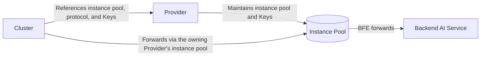

# Chapter 21: Cluster and Route Configuration

## Chapter Goals

Through this chapter, readers will master the core configuration methods for **Cluster (business cluster)** and **AI route rules** in the Rainway AI Gateway. Specifically: understanding the relationship between Cluster and Provider and creating one independently; configuring the basic items, timeouts and retries, passive health check, and LLM configuration (forwarding models, model redirection, service auth Keys, Key routing policy, Key affinity, balance mode) through the Dashboard 5-step wizard; configuring the Global, Entity, and API-Key level route tables and rules, and understanding the two-step save semantics of "Save Locally" and "Submit and Apply" in edit mode; understanding route priorities and the Fallback mechanism; using the expression builder and validation tool to troubleshoot condition syntax issues; and verifying that routing takes effect with real requests.

## Cluster Concepts and Creation Steps

### What Is a Cluster

In the Rainway AI Gateway, a **Cluster (business cluster)** is the logical backend unit to which the Data Plane BFE forwards traffic. A Cluster references an existing **Provider (model provider)**, using its `instance_pool` (backend instance pool), protocol, and `keys` (API-Keys), and on top of that declares the list of models the Cluster can serve, model mappings, Key selection policies, and more. Requests are forwarded by the Cluster to the **owning Provider's** instance pool.



Unlike a Provider, a Cluster addresses "how to use a given Provider":

- A Provider answers "who the backend is, which models it has, and which keys it has".
- A Cluster answers "which models this request may use, how to map model names, how to select among multiple keys with weights, and whether Key affinity and session stickiness are enabled".

### Preparation Before Creation

Before creating a Cluster, confirm that the following prerequisites are met:

1. A product line (Product) and its corresponding Provider have been created, and the Provider has its instance pool and protocol maintained, with at least one backend instance and one model configured (see [Chapter 20: Provider and Model Configuration](./chapter20-provider-and-model-config.md)).
2. If the Cluster needs to use API-Keys, the keys must first be defined in the Provider's `keys`, and each key's `name` recorded; the cluster side references only Key names and never enters plaintext.
3. It is clear which models this Cluster should expose externally, and whether advanced capabilities such as model redirection, multi-Key traffic splitting, Key affinity, or EPP balancing are needed.

> **Version Change**: the cluster wizard in version 0.0.7 and earlier contained an "Instance Configuration" step, which has now been removed; the instance pool is maintained in the **Provider** module instead, and selecting the "Owning Provider" in the cluster wizard references all of its instances.

Once preparation is complete, configuration can be submitted either through the Dashboard visual wizard or directly via the OpenAPI.

### Creating a Cluster via the Dashboard Wizard

Go to Resource Management → AI Business Clusters and click **Create Cluster**; a **5-step wizard** slides out on the right:

1. Basic Configuration → 2. Timeouts and Retries → 3. Passive Health Check → 4. LLM Configuration → 5. Review & Check

For first-time onboarding, you can create a cluster with the minimal configuration and keep the defaults for the remaining steps:

| Wizard Step | Required Items |
| ------ | ------ |
| 1 Basic Configuration | Cluster name, protocol (`http` / `https`, consistent with the actual backend) |
| 4 LLM Configuration | Owning Provider, forwarding models (at least 1); configure weights when multiple Keys are used |
| 2 / 3 / 5 | Keep the defaults and proceed directly |

#### Step 1: Basic Configuration

| Field | Required | Default | Validation | Description |
| --- | --- | --- | --- | --- |
| Cluster Name | Yes | Empty | 1–64 characters; letters, digits, dots, underscores, and hyphens only; must not start or end with a dot, underscore, or hyphen; must not duplicate an existing cluster name | Unique identifier; cannot be modified after creation |
| Description | No | Empty | Up to 256 characters; no control characters | Describes the purpose |
| Protocol | Yes | `https` | — | `http` / `https`; choose according to the actual backend |
| Max Idle Connections per Backend | No | `0` | Non-negative integer; at most 99999999 | Idle persistent connections maintained per backend instance; `0` means none specifically maintained |
| Session Stickiness | No | Disabled | — | Enable / Disable |
| Hash Strategy | Conditionally required | `CLIENT_IP_ONLY` | — | Shown when session stickiness is enabled |
| Hash Header | Conditionally required | Empty | Required when the strategy is `CLIENT_ID_ONLY` / `CLIENT_ID_PREFERED` | Header name or `Cookie:{key}` |
| Request Write Buffer Size (Byte) | No | `512` | Positive integer | Buffer size when writing the request to the backend |
| Close Backend Connection with Client Connection | No | Disabled | — | When enabled, the backend connection is closed in sync when the client disconnects |

**Hash Strategy** (available after session stickiness is enabled):

| Strategy | Meaning | Hash Header |
| --- | --- | --- |
| CLIENT_IP_ONLY | Session stickiness based on client IP only | Not needed |
| CLIENT_ID_ONLY | Session stickiness based on the hash header only | Required |
| CLIENT_ID_PREFERED | Prefer the hash header, falling back to client IP when absent | Required |

AI scenarios usually do not need session stickiness; leaving it disabled by default is fine.

#### Step 2: Timeouts and Retries

| Field | Default (ms) | Description |
| --- | --- | --- |
| Client Connection Idle Timeout | `30000` | Idle persistent connection reclamation |
| Read Client Request Body Timeout | `30000` | Total timeout for reading the body + waiting for the backend + writing the response |
| Backend Connection Timeout | `50000` | Connection establishment timeout |
| Backend Response Header Read Timeout | `50000` | Time to first byte; critical for streaming scenarios |
| Response Write Timeout | `60000` | Timeout for writing the entire response to the client |
| Retries Within Cluster | `2` | Number of retries after a forwarding failure within the same cluster |

> LLM inference has a long time to first byte; it is recommended to relax the Backend Response Header Timeout according to the provider SLA.

#### Step 3: Passive Health Check

| Field | Required | Default | Description |
| --- | --- | --- | --- |
| Fail Threshold | No | `3` | After consecutive forwarding failures exceed this value, the instance is marked unhealthy and probing starts |
| Health Check Interval (ms) | No | `1000` | Probe interval |
| Health Check Host | No | Empty | When empty, the address of the **first instance of the owning Provider** is used |
| Health Check Uri | No | `/` | Must start with `/` |
| Expected Health Check Status Code | No | `0` | `0` means ignoring the status code; any response counts as healthy |

#### Step 4: LLM Configuration

After the owning Provider is selected, the system loads that Provider's model list and Key names; on the cluster side you only configure **which models to use, the weight of each Key, and the forwarding policy**.

**Model Service Configuration**

| Field | Required | Description |
| --- | --- | --- |
| Owning Provider | Yes | Select from created Providers; the Cluster references its instance pool, protocol, and Keys |
| Forwarding Models | Yes | Multiple selection; only models already configured on the owning Provider can be selected; the first dropdown item offers "Select All" |
| Strip Prefix | No | Toggle; used for aggregation scenarios such as OpenRouter |
| Match Prefix | Conditionally required | Required when Strip Prefix is enabled; must end with `/`, e.g. `openrouter/` |

The Strip Prefix is used for aggregation providers such as OpenRouter: when enabled, the matching prefix is removed from the request's `model` field before the request is forwarded downstream. For example, when the Match Prefix is `openrouter/`, a client requesting the model name `openrouter/anthropic/claude-3` is stripped to `anthropic/claude-3` before being forwarded.

**Model Redirection**

Maps the model name in the client request to the model name used when forwarding to the backend. After selecting the "Backend Model to Forward To", if the "Original Requested Model Name" is left empty, it is auto-filled with the same name and can still be modified. Rules:

- The original model name must not be duplicated;
- The target model must be selected from the already-selected "Forwarding Models";
- API-Key allowed/blocked models are judged by the **post-redirection** target model. For example, with original model name `glm-5.2-abc` and target model `glm-5.2`, configuring `glm-5.2` in the Key's allowed models is enough to let through client requests with `model=glm-5.2-abc`.

**Service Auth Keys**

| Field | Required | Description |
| --- | --- | --- |
| Key | No | Select by **name** from the Keys already configured on the owning Provider (**do not enter the Key plaintext**) |
| Weight | Conditionally required | 0–100; when Keys are configured, the weights of all rows must sum to 100 |

- Optional: when not configured, the gateway handles selection according to the Provider's default Key policy.
- Empty rows do not participate in validation; Key names with values must belong to the selected Provider.
- The same Key cannot be selected twice: already-selected names are filtered out of the dropdowns of other rows.

**Key Routing Policy**

| Field | Default | Description |
| --- | --- | --- |
| Strategy | `weighted_random` | Only weighted random is supported in this version |
| Max Retries | `0` | Key-level retries after a request failure |
| Backoff Initial Value (ms) | `500` | Initial backoff wait for retries |
| Backoff Max Value (ms) | `5000` | Must be ≥ the backoff initial value |

**Key Affinity**

| Field | Default | Description |
| --- | --- | --- |
| Enabled | Enabled | When on, requests of the same session are bound to the same Key, avoiding Key drift within a session |
| Idle Timeout (seconds) | — | Required when enabled; must be an integer greater than 0 |
| Key Penalty | Disabled | When on, failed Keys are temporarily demoted |
| Redis Key Prefix | `bfe:ai:key_affinity` | Required when enabled; depends on the Data Plane Redis configuration |

> Key affinity requires a usable Redis in the Data Plane configuration; when Redis is unavailable, it automatically degrades to weighted random.

**Balance Mode Configuration**

Used to select the backend load balancing mode of the cluster:

| Field | Required | Default | Description |
| --- | --- | --- | --- |
| Load Balancing Mode | No | `WRR (Weighted Round Robin)` | `WRR`: BFE local weighted round robin; `EPP`: backend selection is taken over by the EPP scheduler (for instance allocation see [Chapter 26: EPP Scheduling Operations](./chapter26-epp-scheduling-operation.md)) |

When `EPP` is selected, the following items (`epp_config`) are shown:

| Field | Required | Default | Validation | Description |
| --- | --- | --- | --- | --- |
| Scheduling Profile | No | `Balanced` | Enum | Latency-first / Balanced / Throughput-first — presets combining scheduling aggressiveness and optimization objective |
| Cache Affinity | No | `Medium` | Enum | Low / Medium / High; explicitly sets the KV cache affinity strength, overriding the default weight of the scheduling profile |
| Prefix Cache Affinity | No | Enabled | — | Requests with the same prompt prefix are best-effort converged onto the same backend to improve KV cache reuse (soft affinity; a hit is not guaranteed) |
| Session Affinity | No | Disabled | — | Requests of the same session are best-effort routed to the same backend; when the bound endpoint is removed, they automatically migrate and re-attach |
| Session Affinity Header | Conditionally required | Empty | Non-empty header name | Required when session affinity is enabled, e.g. `x-session-id`; the session id is parsed from this header |
| KV Cache Utilization Limit | No | `0.9` | Greater than 0 and ≤ 1 | Endpoints whose KV cache utilization exceeds this value are filtered out |
| Flow Control | No | See the table below | — | Collapsible card; see the table below |

Flow Control (`flow_control`):

| Field | Default | Validation | Description |
| --- | --- | --- | --- |
| Max Requests | `Unlimited` | Unlimited / Limited (integer greater than 0) | Global concurrency limit; when "Limited" is selected, an integer greater than 0 must be filled in |
| Queue TTL (seconds) | `60` | Integer ≥ 0 | Queuing budget when the pool has endpoints; expired requests are rejected with a retryable backpressure error; `0` disables it |
| No-endpoint Queue TTL (seconds) | Follows Queue TTL | Integer ≥ 0 | Queuing budget when the pool has no endpoints (cold-start scale-out) |
| Enable Eviction | Disabled | — | When high-priority requests are blocked by saturation, low-priority in-flight requests are terminated to reclaim capacity |

> **WRR ↔ EPP switching**: `epp_config` takes effect only in `EPP` mode; when switching back to `WRR`, the configuration is **retained but inactive** (dormant) and takes effect again when switching back to `EPP` — no configuration is lost when switching back and forth.

#### Step 5: Review & Check

Summarizes the configurations of the previous 4 steps; click "Submit" after confirming. The review panel covers:

- **Basic Configuration**: name, description, protocol, and connection and session stickiness related items;
- **Timeouts and Retries**: various timeouts and in-cluster retries;
- **Passive Health Check**: threshold, interval, Host (when empty, shows "when empty, the address of the first instance of the owning Provider is used"), Uri, and status code;
- **LLM Configuration**: owning Provider, forwarding models, strip prefix, model redirection, Key weights, Key routing policy, Key affinity, and balance mode configuration.

### Viewing, Editing, and Deleting Clusters

- **View Details**: click "Details" in the cluster list; a drawer slides out on the right, showing all configuration read-only (consistent with the Review & Check summary panel). The Provider's instance pool is **not** shown (the instance pool belongs to the Provider resource).
- **Edit**: click "Edit"; the same drawer opens in edit mode with fields pre-filled; the cluster name cannot be modified after creation. Modifying a Cluster affects all route rules referencing it; it is recommended to operate during off-peak hours.
- **Delete**: click "Delete"; a confirmation dialog pops up. **When the Cluster is referenced by route rules**, deletion fails; the prompt explains which route table and which rule reference it and provides a "Go to Resolve" link — the references must be removed in the route tables first (the API layer corresponds to `409 Conflict`, and the response names the referencing rule).

Other caveats:

- When the health check Host is left empty, the address of the first instance of the owning Provider's instance pool is used.
- Forwarding models must be a subset of the owning Provider's model list; after switching Providers, models and Keys must be reselected.
- For clusters in EPP mode, backend selection is taken over by the EPP scheduler; if there is no valid allocation in the instance pool (unallocated state), the cluster **degrades to WRR** when its configuration is exported. Allocation relationships can be viewed and overridden on the "EPP Scheduling" page; see [Chapter 26: EPP Scheduling Operations](./chapter26-epp-scheduling-operation.md).

### Creating a Cluster via OpenAPI

Before creating a Cluster, the corresponding Provider must already exist, and the `llm_config.provider` reference must be present. The typical creation flow is as follows:

1. Submit the Cluster configuration via `POST /clusters`.
2. The Control Plane validates that `name` is globally unique and 1-64 characters long (single-character names are allowed and work with the get-one/delete/ready endpoints too), `provider` exists, `models` is a subset of the Provider's models, and `keys` reference keys already defined in the Provider.
3. Based on `llm_config.provider`, the system looks up the corresponding Provider, reads its instance information, and automatically creates the BFE-side instance pool (named `{product_name}.{cluster_name}`), creates a sub-cluster (named `{cluster_name}`), and binds it to the Cluster.
4. `llm_config.model_table` is generated automatically by InnerAPI based on the Provider information and delivered to BFE; it is not exposed in the OpenAPI.

Example creation request:

```json
{
    "name": "cluster-deepseek-prod",
    "description": "生产环境 DeepSeek 集群",
    "basic": {
        "protocol": "https",
        "connection": {
            "max_idle_conn_per_rs": 0,
            "cancel_on_client_close": false
        },
        "retries": {
            "max_retry_in_cluster": 2
        },
        "buffers": {
            "req_write_buffer_size": 512
        },
        "timeouts": {
            "timeout_conn_serv": 50000,
            "timeout_response_header": 50000,
            "timeout_readbody_client": 30000,
            "timeout_read_client_again": 30000,
            "timeout_write_client": 60000
        }
    },
    "llm_config": {
        "models": ["deepseek-chat", "deepseek-coder"],
        "model_mappings": [
            {"source_model": "gpt-4", "target_model": "deepseek-chat"}
        ],
        "keys": [
            {"name": "key-prod-01", "weight": 70},
            {"name": "key-prod-02", "weight": 30}
        ],
        "key_policy": {
            "strategy": "weighted_random",
            "max_retries": 3,
            "retry_backoff_initial": 500,
            "retry_backoff_max": 5000
        },
        "provider": "deepseek"
    }
}
```

> Note: after a Cluster is created, the instance pool and sub-cluster are maintained automatically by the system. **Do not modify** `instance_pool` directly; to adjust backend instances, update the corresponding Provider.

### Updating and Deleting a Cluster

To update a Cluster, use `PATCH /clusters/{cluster_name}`. Fields that can be modified include `description`, `basic`, `sticky_sessions`, `passive_health_check`, and `llm_config`. Pay special attention to the following:

- `name` cannot be modified;
- `llm_config.keys` is treated as a **full replacement** — the caller must pass the complete list of key references;
- `sub_clusters` and `scheduler` are generated automatically by the system and do not support manual modification.

When deleting a Cluster, the system first checks whether the Cluster is referenced by AI route rules at the Global, Entity, or API-Key level. If references exist, the deletion fails with `409 Conflict` (the response names the referencing rule); the references or the corresponding route rules must be removed first. After passing the reference check, the system cascades: unbinds the sub-cluster, deletes the sub-cluster, deletes the instance pool, and finally deletes the Cluster.

Similarly, when updating a Cluster's model list, if a removed model is still referenced by a route rule's `targets` or `fallbacks`, the update also returns `409 Conflict`; adjust the corresponding route rules before changing the Cluster's model list.

## Configuring Forwarding Policies, Model Mappings, Key Policies, and Session Affinity

The previous section introduced the fields following the wizard steps; this section explains the names and constraints of these fields at the API layer from a configuration-semantics perspective, to facilitate management via the OpenAPI or configuration files.

### Basic Forwarding Policy (`basic`)

The `basic` section controls the transport-layer behavior of BFE's interaction with the backend, corresponding to the wizard steps "Basic Configuration" and "Timeouts and Retries":

| Field | Meaning | Default |
|------|------|--------|
| `protocol` | Backend protocol | `https` |
| `connection.max_idle_conn_per_rs` | Max idle connections per backend (idle persistent connections maintained by each BFE instance per backend) | `0` (not specifically maintained; recommended for AI scenarios) |
| `connection.cancel_on_client_close` | Close the backend connection along with the client connection | `false` |
| `buffers.req_write_buffer_size` | Request write buffer size (Byte) | `512` |
| `timeouts.timeout_read_client_again` | Client connection idle timeout (ms) | `30000` |
| `timeouts.timeout_readbody_client` | Read client request body timeout (ms) | `30000` |
| `timeouts.timeout_conn_serv` | Backend connection timeout (ms) | `50000` |
| `timeouts.timeout_response_header` | Backend response header read timeout (ms; time to first byte) | `50000` |
| `timeouts.timeout_write_client` | Response write timeout (ms) | `60000` |
| `retries.max_retry_in_cluster` | Retries within the cluster | `2` |

### Session Stickiness (`sticky_sessions`)

`sticky_sessions` controls whether a client is bound long-term to the same backend instance:

| Field | Meaning | Default |
|------|------|--------|
| `enabled` | Whether session stickiness is enabled | `false` |
| `hash_strategy` | Hash strategy: `CLIENT_IP_ONLY` / `CLIENT_ID_ONLY` / `CLIENT_ID_PREFERED` | `CLIENT_IP_ONLY` |
| `hash_header` | Hash header; required when the strategy is `CLIENT_ID_ONLY` / `CLIENT_ID_PREFERED`; use `Cookie:${key}` to take the value from a Cookie | Empty |

AI scenarios usually do not need session stickiness; leaving it disabled by default is fine.

### Passive Health Check (`passive_health_check`)

| Field | Meaning | Default |
|------|------|--------|
| `failnum` | Fail threshold: after consecutive forwarding failures exceed this value, the instance is marked unhealthy and probing starts | `3` |
| `interval` | Health check interval (ms) | `1000` |
| `host` | Health check Host; when empty, the address of the first instance of the owning Provider's `instance_pool` is used | Empty |
| `uri` | Health check Uri; must start with `/` | `/` |
| `statuscode` | Expected status code; `0` means ignoring the status code — any response counts as healthy | `0` |

### Model Mapping and Prefix Stripping (`model_mappings` / `strip_prefix` / `match_prefix`)

`llm_config.model_mappings` maps the model name in a user request to the model name actually used by the backend (called "Model Redirection" in the Dashboard). For example, mapping the user's familiar `gpt-4` to the backend's `deepseek-chat`:

```json
{
    "source_model": "gpt-4",
    "target_model": "deepseek-chat"
}
```

Rules:

- `source_model` must not be duplicated within the same mapping table;
- The mapped `target_model` must belong to the Cluster's `models` list and must exist in the Provider's model list;
- API-Key allowed/blocked models are judged by the **post-redirection** target model.

`llm_config.strip_prefix` / `match_prefix` correspond to the wizard's "Strip Prefix / Match Prefix": when `strip_prefix=true`, `match_prefix` is required and must end with `/`; before forwarding downstream, that prefix is removed from the request's `model` field.

### Key Policy (`llm_config.keys` and `key_policy`)

`llm_config.keys` references keys defined in the Provider and assigns weights to them, enabling weighted random selection among multiple keys:

```json
{
    "keys": [
        {"name": "key-prod-01", "weight": 70},
        {"name": "key-prod-02", "weight": 30}
    ]
}
```

Constraints: each `name` must correspond to a name that already exists in the Provider's `keys` and must be unique within the same array; `weight` ranges in `[0,100]` (0 means the Key receives no traffic); the weights of all Keys must sum to 100.

`key_policy` controls the key selection algorithm and failure retry behavior:

| Field | Meaning | Default |
|------|------|--------|
| `strategy` | Selection algorithm; only `weighted_random` is supported in this version | `weighted_random` |
| `max_retries` | Total additional retries at the key level for the current request | `0` |
| `retry_backoff_initial` | Backoff time for the first retry (ms) | `500` |
| `retry_backoff_max` | Backoff time upper limit (ms); must be ≥ the initial value | `5000` |

### Key Affinity (`llm_config.key_affinity`)

`key_affinity` implements session-level Key affinity based on Redis: the same `ClientKeyId` keeps hitting the same Key within the binding validity period, avoiding Key drift within a session.

| Field | Meaning | Default |
|------|------|--------|
| `enabled` | Whether Key affinity is enabled | `true` |
| `ttl` | Binding idle timeout (seconds); after a hit, BFE refreshes the TTL, so the binding stays alive with continuous requests | `600` |
| `redis_prefix` | Redis Key prefix | `"bfe:ai:key_affinity"` |
| `penalty_enable` | Key penalty: when on, Keys that recently returned `429/401/403` are temporarily demoted and skipped | `true` |

> Key affinity depends on the Data Plane Redis configuration; when Redis is unavailable, it automatically degrades to weighted random.

### Balance Mode (`balance_mode` and `epp_config`)

| Field | Meaning | Default |
|------|------|--------|
| `balance_mode` | Cluster balance mode: `WRR` (BFE local weighted round robin) / `EPP` (backend selection taken over by the EPP scheduler); the sole source for determining EPP mode | `WRR` |
| `epp_config` | EPP scheduling configuration (simplified user-facing form); required and effective only when `balance_mode=EPP` | See the table below |

Fields of `epp_config` (corresponding to the wizard's "Balance Mode Configuration"):

| Field | Meaning | Default |
|------|------|--------|
| `scheduling_profile` | Scheduling profile: `latency-first` / `balanced` / `throughput-first` | `balanced` |
| `cache_affinity` | Cache affinity: `low` / `medium` / `high`; explicitly sets the KV cache affinity strength, overriding the default weight of the scheduling profile | Unset (follows the scheduling profile) |
| `prefix_cache_affinity` | Prefix cache affinity: requests with the same prompt prefix are best-effort converged onto the same backend (soft affinity; a hit is not guaranteed) | `true` |
| `session_affinity_enabled` | Session affinity: requests of the same session are best-effort routed to the same backend; when the bound endpoint is removed, they automatically migrate and re-attach | `false` |
| `session_affinity_header` | Source header of the session id (e.g. `x-session-id`); required when session affinity is enabled | Empty |
| `kv_cache_utilization_max` | KV cache utilization limit; endpoints whose utilization exceeds this value are filtered out; value in `(0,1]` | `0.9` |
| `flow_control.max_requests` | Global concurrency limit; unset or `-1` means unlimited | Unlimited |
| `flow_control.queue_ttl` | Queuing budget in seconds when the pool has endpoints; expired requests are rejected with a retryable backpressure error; `0` disables it | `60` |
| `flow_control.no_endpoint_queue_ttl` | Queuing budget in seconds when the pool has no endpoints (cold-start scale-out) | Follows `queue_ttl` |
| `flow_control.enable_eviction` | Demand-driven eviction: when high-priority requests are blocked by saturation, low-priority in-flight requests are terminated to reclaim capacity | `false` |

EPP cluster configuration example:

```json
{
    "name": "cluster-epp-gpu",
    "description": "EPP 调度集群示例",
    "balance_mode": "EPP",
    "epp_config": {
        "scheduling_profile": "balanced",
        "cache_affinity": "medium",
        "prefix_cache_affinity": true,
        "session_affinity_enabled": true,
        "session_affinity_header": "x-session-id",
        "kv_cache_utilization_max": 0.9,
        "flow_control": {
            "max_requests": -1,
            "queue_ttl": 60,
            "no_endpoint_queue_ttl": 60,
            "enable_eviction": false
        }
    },
    "llm_config": {
        "models": ["deepseek-chat"],
        "provider": "deepseek"
    }
}
```

> Semantic notes: `epp_config` is a simplified user-facing form; at export time the Control Plane deterministically compiles it into the complete `EndpointPickerConfig`; it is compiled and delivered only when `balance_mode=EPP`; in `WRR` mode it is retained but inactive (dormant), and no configuration is lost when switching back and forth. Instance allocation relationships are maintained on the "EPP Scheduling" page; see [Chapter 26: EPP Scheduling Operations](./chapter26-epp-scheduling-operation.md).

## Configuring Global / Entity / API-Key Level Route Rules

AI route rules decide "by what rules and in what proportions a request is forwarded to which clusters + models". The system provides three route table scopes:

| Route Table Type | Scope |
| --- | --- |
| Global | Global catch-all, used when no API-Key / Entity route table is hit |
| Entity | Requests hitting a specified organization; shared by all Keys under that organization |
| API-Key | Requests hitting a specified API-Key; dedicated rules that do not interfere with each other |

Match priority: **API-Key > Entity > Global**. Within the same route table, rules are matched in list order, **stopping at the first hit**; the request is forwarded according to that rule's target weights; when no rule matches, the request falls back to the next-priority route table / the system default forwarding. Therefore more specific rules should be placed first.

AI route rules work after API-Key authentication and decide which target model and backend Cluster a request is ultimately forwarded to. It is worth noting that in AI gateway mode, BFE processes requests through the dedicated `ServeHTTPForAI()` path; `findProduct()` is only used for product line identification and configuration context loading, and the traditional product-level BFE route rules (`route_basic_rules` / `route_advance_rules` / `route_default_rules`) do not participate in Cluster selection for AI requests.

### Route Table List

Go to Route Management → Route Tables to see the list of all route tables:

| Column | Description |
| --- | --- |
| Route Table Type | Global / Entity / API-Key, with a dropdown filter |
| Route Table Owner | `global` displays `global`; entity displays the organization name; apikey displays the Key ID |
| Status | Enabled / Disabled, with a dropdown filter |
| Actions | View, Enable / Disable |

- **Status toggle**: click "Enable" or "Disable" to switch the route table status. After a route table is disabled, its rules no longer take effect and traffic falls back to the next-priority route table. Before disabling a route table, confirm the fallback path is available to avoid traffic interruption.
- **Auto-creation**: after an API-Key is created, an apikey route table owned by that Key is generated automatically; no manual creation is needed.

### Edit Mode: Save Locally and Submit and Apply

Click "View" on a route table row to enter the route rules page of that route table. Adding, editing, and deleting rules must be done in **edit mode**; note that there are two "save" steps, both indispensable:

| Step | Operation | Effect | Affects Production? |
| ------ | ------ | ------ | ------------ |
| 1 | Click "Enter Edit Mode" | Enters the editable state | No |
| 2 | Add / edit / delete rules | Modifies rule content | No |
| 3 | Click "Save Locally" | Stages the rule into the on-page list | **Still no** |
| 4 | Click "Submit and Apply" | Delivers all modifications to the gateway | **Takes effect** |

Key reminders:

- Only step 4 "Submit and Apply" makes rules actually take effect; if you leave after only clicking "Save Locally", the modifications will not take effect.
- After Submit and Apply, the system automatically exits edit mode and returns to view mode, and the list shows the latest rules.
- When rule changes have not been submitted yet, clicking "Back", a breadcrumb, or switching to another menu pops up a loss confirmation prompt ("Rule changes have not been submitted and applied yet; they will be lost after leaving the page. Are you sure you want to leave?"); confirming leaves and discards the changes.
- After Submit and Apply, the configuration is usually synced to the Data Plane within **seconds to tens of seconds** (via Conf Agent / conf-agent). If curl fails immediately, wait 10–30 seconds and retry.

### Rule Form

In edit mode, click "Add Rule", or click "Edit" in the actions column; a rule drawer slides out on the right:

| Field | Required | Default | Format Requirement | Description |
| --- | --- | --- | --- | --- |
| Rule Name | Yes | Empty | 1–64 characters; letters, digits, `-`, `_`, `.` only; must not start or end with `-`, `_`, `.` | Unique within the table |
| Expression | Yes | Empty | A valid BFE condition expression | Generated by clicking in the builder or edited directly; validated server-side on save |
| Target Clusters and Models | Yes | At least 1 target | See Targets and Weights below | Traffic is allocated by weight across multiple targets |
| Fallback Clusters and Models | No | Empty | See Fallback Clusters below | Fallback targets when forwarding fails; may be empty |

The bottom of the rule drawer provides "Save Locally" (validates the name, expression, target weights, and duplicates; when passed, stages the rule into the rule list) and "Reset" (clears the current rule content and restores the state before the drawer was opened).

The rule list shows all rules under the current route table (rule name, expression, target clusters and models; hover to see the full content), matched in list order; in view mode the actions column shows "View", and in edit mode it shows "Edit / Delete". The list supports search and sorting.

### Expression Builder

The expression is the "conditional statement" — when a request satisfies the condition, it is forwarded according to this rule. No hand-written code is needed: click buttons in the builder to generate it. The expression is a BFE condition expression; the builder provides buttons by dimension, and clicking one inserts it into the expression text automatically; logical connectors provide `(`, `)`, `&&`, `||`, `!`.

Condition dimensions and operators:

| Dimension | Operators | Generated Expression Example |
| --- | --- | --- |
| host | in | `req_host_in("www.a.com\|www.b.com")` |
| port | in | `req_port_in("80\|8080")` |
| method | in | `req_method_in("GET")` |
| path | in / prefix_in / suffix_in | `req_path_prefix_in("/v1/", false)` |
| query | exist / key_in / key_prefix_in / value_in / value_prefix_in / value_suffix_in / value_hash_in | `req_query_value_in("search", "flower", false)` |
| cookie | key_in / value_in / value_prefix_in / value_suffix_in / value_hash_in | `req_cookie_value_in("ssp-web-version", "v0", true)` |
| header | key_in / value_in / value_prefix_in / value_suffix_in / value_hash_in | `req_header_value_in("api_version", "v1\|v2", true)` |
| clientIP | range / trusted / hash_in | `req_cip_range("1.1.1.1", "2.2.2.2")` |
| proto | secure | `req_proto_secure()` |
| system | bfe_time_range / bfe_cluster_in | `bfe_time_range("20190204203000H", "20190204204500H")` |
| body | req_body_json_in | `req_body_json_in("level1.level2.level3", "pat1\|pat2", false)` |
| body | req_body_json_prefix_in | `req_body_json_prefix_in("level1.level2", "prefix1\|prefix2", false)` |

Parameter note: the `true` / `false` at the end of an expression means "whether to ignore case": `true` = ignore case (more flexible), `false` = case-sensitive (strict match).

Simplest catch-all: if you only want all requests to go to the same cluster, click `prefix_in` on the `path` row in the builder and fill in `/` as the parameter, yielding `req_path_prefix_in("/", false)` (equivalent to `default_t()`) — that is, "match all requests starting with `/`". This is the most common catch-all rule.

Common scenario examples:

| Scenario | Expression Example |
| --- | --- |
| Catch-all matching all requests | `req_path_prefix_in("/", false)` (or `default_t()`) |
| Split by path prefix | `req_path_prefix_in("/v1/", false)` |
| Split by Header + method | `req_header_value_in("api_version", "v1\|v2", true) && req_method_in("POST")` |
| Gray release by query parameter | `req_query_value_in("gray", "1", false)` |
| By request body model field | `req_body_json_in("model", "gpt-4", false)` |

### Targets and Weights

Each target contains the following fields:

| Field | Required | Default | Description |
| --- | --- | --- | --- |
| Cluster | Yes | Empty | Select from created business clusters |
| Model | No | Empty | Select a model under that cluster; leave empty to pass through the model name in the request |
| Weight | Yes | `0` | Integer 0–100; the traffic allocation ratio across multiple targets; the weights of all targets must sum to 100 |

- **Specifying a model**: no matter what model the client requests, the request is forwarded to that model (suitable for a unified egress). Specifying a model is **the first step of target model resolution**, followed by the cluster's Strip Prefix and Model Redirection; the API-Key's allowed/blocked models are judged by the finally resolved target model.
- **Leaving empty**: uses the `model` field in the request body (suitable for client-selected models; it must match the actual backend model name).

Click "+ Add Target" to add a target row; a rule must keep at least 1 target.

### Fallback Clusters

In addition to normal targets, you can configure **fallbacks (fallback clusters)**: when forwarding fails for all normal targets, the request falls back to the fallback clusters for continued attempts. Fallback cluster fields are similar to targets but **have no weight** (cluster required; model may be left empty to pass through). Click "+ Add Fallback Cluster" to add a row; the fallback cluster list may be empty. Within the same rule, the **"cluster + model" combinations** must not be duplicated — neither among fallback clusters nor between fallback clusters and target clusters.

### Validation Rules

On save and submit, the system performs the following validations:

- The sum of **target weights** within the same rule must equal 100;
- **Target cluster + model** combinations must not be duplicated within the same rule;
- **Fallback cluster + model** combinations must not be duplicated within the same rule and **must not duplicate target cluster combinations**;
- **Rule names** must not be duplicated within the same route table;
- Expression syntax errors are flagged on save (the server validates BFE condition expression syntax);
- A rule must contain at least 1 target.

### Rule Storage and OpenAPI Management

AI route rules are stored uniformly in the `route_rules` table, targeting three levels:

| Level | Type | Owner | Management Entry |
|------|------|--------|----------|
| Global | `global` | `global` | `PUT /global-route-rules` |
| Entity | `entity` | `entity_id` | Embedded in Entity create/update APIs |
| API-Key | `apikey` | `api_key_id` | Embedded in API-Key create/update APIs |

Each rule contains:

- `name`: rule name, unique within the same route table;
- `Cond`: BFE condition expression;
- `targets`: list of target Cluster + model + weight; the weights must sum to 100;
- `fallbacks`: optional list of Fallback targets.

#### Global Route Table

The Global Route Table is the global catch-all rule; every API-Key is ultimately bound to it. During system initialization, a default record is created automatically (`enabled=false`, `rules=[]`); it should be configured to enabled state before first use. A good global catch-all rule typically uses `default_t()` as the condition and directs all unmatched traffic to the default Cluster.

```json
{
    "enabled": true,
    "rules": [
        {
            "name": "global-default",
            "cond": "default_t()",
            "targets": [
                {"cluster_name": "cluster-global", "model": "", "weight": 100}
            ],
            "fallbacks": [
                {"cluster_name": "cluster-global-fallback", "model": ""}
            ]
        }
    ]
}
```

#### Entity and API-Key Route Tables

The route tables of Entity and API-Key are written as embedded objects when the corresponding resource is created or updated. For example, attaching `route_rules` in an Entity configuration achieves department-level routing policies; attaching `route_rules` in an API-Key achieves user-level fine-grained routing. If `route_rules` is not explicitly passed at creation time, the system generates an empty record by default (`enabled=false`, `rules=[]`), making it easy to enable later; after an API-Key is created, the Dashboard automatically generates its apikey route table.

`GET /route-tables` returns paginated metadata for all route tables; the returned fields contain only `id`, `type`, `owner`, and `enabled`, not the rule details. The `type` of an API-Key level route table is exposed externally as `api_key` (internal storage and the BFE export still use `apikey`; the Control Plane maps between the two automatically), and the `type` query parameter also accepts `api_key`. To view or modify rule content, access the management API of the corresponding level — for example, the Global Route Table uses `GET /global-route-rules` and `PUT /global-route-rules`.

## Route Rule Priority and Fallback

### Binding Order

For each API-Key, BFE obtains a list of route tables in the following order:

1. `apikey_<key>`: the API-Key level route table;
2. `entity_<entity_name>`: the Entity route table to which the API-Key is directly attached;
3. All ancestor Entity route tables traversed upward along `parent_id`;
4. `global_default`: the Global Route Table.

BFE matches in this order and stops at the first hit. Therefore the priority is:

**API-Key level > direct Entity level > parent Entity level > Global level**

### Matching Within a Rule Set

Within a single route table, rules are matched in array order and the first hit wins; after a hit, the target Cluster and model are chosen according to the `targets` weights. Therefore more specific rules should be placed first.

### Fallback Mechanism

If all `targets` of a rule fail, BFE tries the rule's `fallbacks` list. Fallback targets are used in order, without weight calculation. It is recommended to keep at least one `default_t()` catch-all rule at the Global level to avoid requests having no target to forward to.

> Note: disabled route tables (`enabled=false`) are not exported to BFE and do not join the binding list; when a route table is disabled or no expression matches, the request falls back to the next-priority route table.

## Using the Expression Validation Tool

The `Cond` field of AI route rules uses the BFE condition expression syntax. Common expression examples:

| Condition | Expression Example |
|----------|------------|
| Match all | `default_t()` |
| By request Host | `req_host_in("api.example.com")` |
| By path prefix | `req_path_prefix_in("/v1/chat", false)` |
| By request method | `req_method_in("POST")` |
| By request header | `req_header_value_in("api_version", "v1\|v2", true)` |
| By request body JSON field | `req_body_json_in("model", "gpt-4", false)` |
| Multiple conditions combined | `req_host_in("api.example.com") && req_body_json_in("model", "gpt-4", false)` |

> Note: at save time, in addition to checking that the expression is non-empty, the Control Plane also validates the expression's BFE syntax via `validate.ConditionExpression` (which internally calls `condition.Build`); expressions with syntax errors cannot be written to the database. The Dashboard's expression builder can generate expressions by clicking, and the rule drawer's "Save Locally" also performs server-side validation, making it easy to spot problems early.

If you manage routes directly via the OpenAPI, the Control Plane performs validation before writing; if you want to verify locally in advance, you can also call `RouteRuleManager.ExpressionVerify` or use BFE's condition expression parsing tool directly.

Common validation advice:

1. For any condition using the request body JSON, note that the third parameter indicates whether to ignore case: `true` means ignoring case (more flexible), and `false` means case-sensitive; model name matching usually uses `false` for a strict match.
2. When combining conditions, connect them with `&&`, and take care not to miss parentheses or escape characters.
3. For model names containing special characters such as Chinese characters or slashes, use correct JSON escaping to ensure the value stored by the Control Plane matches the value parsed by BFE.
4. After configuration, it is recommended to verify once with real requests in a test environment before syncing to production.

## Verifying That Routing Takes Effect

After route configuration is complete, it is recommended to verify in the following steps:

1. **Confirm Cluster health**: check that the corresponding Provider's instances are reachable and the Cluster's passive health check status is normal. The Cluster's health status can be viewed via the BFE status interface or the Control Plane.
2. **Confirm the route table is enabled**: use `GET /route-tables` to confirm the relevant route table has `enabled=true`. If a route table is disabled, its rules will not be delivered to BFE even if the rule content is correct.
3. **Confirm the binding relationships**: check that the API-Key is attached to the expected Entity, and that `ApikeyRouteTableBindings` contains the expected route table order.
4. **Wait for configuration sync**: after Dashboard "Submit and Apply", the configuration is usually synced to the Data Plane within seconds to tens of seconds via Conf Agent (conf-agent). If verification fails immediately, wait 10–30 seconds and retry.
5. **Send test requests**: send a chat request using an API-Key with configured route rules and observe the returned model and target Cluster. It is recommended to explicitly specify the model name in the request to verify that model mapping takes effect.
6. **Check logs and metrics**: confirm in BFE logs that the expected route table and rule were hit; confirm via response headers or monitoring metrics that the model was correctly replaced. If a Fallback was hit, the corresponding Fallback marker should also appear in the logs.

For example, the global catch-all rule can be verified with the following request:

```bash
curl -i https://api.example.com/v1/chat/completions \
  -H "Authorization: Bearer ak-test-001" \
  -H "Content-Type: application/json" \
  -d '{"model":"gpt-4","messages":[{"role":"user","content":"hello"}]}'
```

If the returned model is mapped to `deepseek-chat` and the request log shows the `global-default` rule was hit, routing is in effect.

## Complete Configuration Example

The following example shows a complete AI routing scenario, covering the coordination of Cluster, Global Route Table, and API-Key route table:

- `cluster-deepseek-prod`: references the `deepseek` Provider, supports model mapping and multi-key weighting;
- `cluster-azure-fallback`: serves as the Fallback cluster, taking over traffic when the primary cluster is unavailable;
- Global catch-all rule: provides a default forwarding target for API-Keys without dedicated rules;
- API-Key level fine-grained rule: specifies the forwarding path for `gpt-4` model requests from `ak_user_a` alone.

In this scenario, when `ak_user_a` requests `gpt-4`, the API-Key level rule is hit first; the model is mapped to `deepseek-chat` and forwarded to `cluster-deepseek-prod`; if that request fails, it falls back to `cluster-azure-fallback`. For other models or when there is no API-Key level rule, the global catch-all rule is hit.

For the configuration example of a cluster in EPP balance mode, see the earlier section "Balance Mode (`balance_mode` and `epp_config`)".

### Cluster Configuration

```json
{
    "name": "cluster-deepseek-prod",
    "description": "DeepSeek 生产集群",
    "basic": {
        "protocol": "https",
        "connection": {"max_idle_conn_per_rs": 0, "cancel_on_client_close": false},
        "retries": {"max_retry_in_cluster": 2},
        "buffers": {"req_write_buffer_size": 512},
        "timeouts": {
            "timeout_conn_serv": 50000,
            "timeout_response_header": 50000,
            "timeout_readbody_client": 30000,
            "timeout_read_client_again": 30000,
            "timeout_write_client": 60000
        }
    },
    "sticky_sessions": {"enabled": false},
    "passive_health_check": {
        "interval": 1000,
        "failnum": 3,
        "host": "",
        "uri": "/",
        "statuscode": 0
    },
    "llm_config": {
        "models": ["deepseek-chat", "deepseek-coder"],
        "model_mappings": [
            {"source_model": "gpt-4", "target_model": "deepseek-chat"}
        ],
        "keys": [
            {"name": "key-prod-01", "weight": 70},
            {"name": "key-prod-02", "weight": 30}
        ],
        "key_policy": {
            "strategy": "weighted_random",
            "max_retries": 3,
            "retry_backoff_initial": 500,
            "retry_backoff_max": 5000
        },
        "key_affinity": {
            "enabled": true,
            "ttl": 600,
            "redis_prefix": "bfe:ai:key_affinity",
            "penalty_enable": true
        },
        "provider": "deepseek"
    }
}
```

### AI Route Configuration (BFE `ai_route.data`)

```json
{
    "Version": "20260720150000",
    "route_rules": {
        "apikey_ak_user_a": {
            "type": "apikey",
            "owner": "ak_user_a",
            "rules": [
                {
                    "name": "user_a-gpt4",
                    "Cond": "req_body_json_in(\"model\", \"gpt-4\", false)",
                    "targets": [
                        {"ClusterName": "cluster-deepseek-prod", "Model": "deepseek-chat", "Weight": 100}
                    ],
                    "fallbacks": [
                        {"ClusterName": "cluster-azure-fallback", "Model": "gpt-4"}
                    ]
                }
            ]
        },
        "global_default": {
            "type": "global",
            "owner": "global",
            "rules": [
                {
                    "name": "global-default",
                    "Cond": "default_t()",
                    "targets": [
                        {"ClusterName": "cluster-deepseek-prod", "Model": "", "Weight": 100}
                    ],
                    "fallbacks": [
                        {"ClusterName": "cluster-azure-fallback", "Model": ""}
                    ]
                }
            ]
        }
    },
    "ApikeyRouteTableBindings": {
        "ak_user_a": [
            "apikey_ak_user_a",
            "global_default"
        ]
    }
}
```

## Chapter Summary

- A **Cluster** is the logical backend for BFE forwarding; it references a Provider and declares models, Keys, forwarding policies, etc.; the "Instance Configuration" step in the wizard of version 0.0.7 and earlier has been removed, and the instance pool belongs to the Provider.
- The Dashboard creates a cluster through a **5-step wizard**: Basic Configuration → Timeouts and Retries → Passive Health Check → LLM Configuration → Review & Check; timeout defaults are 30000/30000/50000/50000/60000 ms, in-cluster retries 2, health check threshold 3, and interval 1000 ms.
- LLM configuration covers: forwarding models (a subset of the Provider's models), model redirection (API-Key model access control is judged by the post-redirection target model), service auth Keys (weights sum to 100), Key routing policy (`weighted_random`), Key affinity (depends on the Data Plane Redis and degrades to weighted random when unavailable), and balance mode (`WRR` by default / `EPP`; `epp_config` is retained dormant and no configuration is lost when switching back and forth).
- AI route rules are divided into three levels — **Global, Entity, and API-Key** — with priority **API-Key > Entity > Global**; after an API-Key is created, its apikey route table is generated automatically; when a route table is disabled, traffic falls back to the next priority.
- The Dashboard edit mode has a **two-step save** semantics: "Save Locally" still does not affect production, and only "Submit and Apply" actually delivers the changes; after submission, configuration syncs to the Data Plane via Conf Agent within seconds to tens of seconds; leaving the page with unsubmitted changes shows a loss confirmation prompt.
- Rule validation includes: target weights summing to 100, no duplicated "cluster + model" combinations, rule names unique within a table, server-side expression syntax validation, and at least 1 target; within a table, rules are matched in order and the first hit wins.
- For `Cond` expressions, the trailing parameter `true` = ignore case and `false` = case-sensitive; the simplest catch-all is `req_path_prefix_in("/", false)` or `default_t()`.
- Test requests, BFE logs, and monitoring metrics can verify that routing takes effect as expected.

## References

- `ai-gateway-web/docs/zh-cn/04-ai-business-cluster.md` (Dashboard console manual: AI Business Clusters)
- `ai-gateway-web/docs/zh-cn/10-route.md` (Dashboard console manual: Route Management)
- `ai-gateway-api/design-docs/api-define/OpenAPI接口定义/clusters.md`
- `ai-gateway-api/design-docs/api-define/OpenAPI接口定义/global-route-rules.md`
- `ai-gateway-api/design-docs/api-define/OpenAPI接口定义/route-tables.md`
- `ai-gateway-api/design-docs/sys-design/details/路由规则管理.md`
- `bfe/docs/zh_cn/configuration/mod_ai_route/ai_route.data.md`
