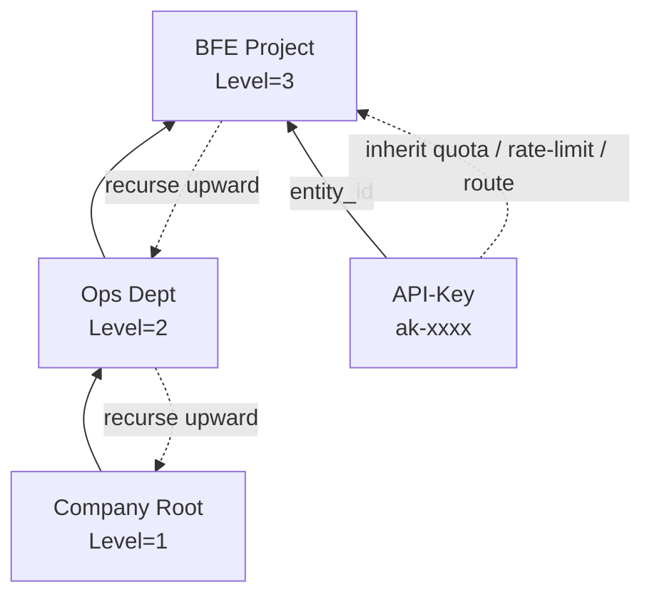

# Chapter 22: API-Key and Quota Configuration

## Chapter Goals

Through this chapter, readers will learn to complete the following operations in the Control Plane (AI Gateway API) and the Dashboard console of Rainway AI Gateway:

- Manage Entity types and Entity organizations in the Dashboard, including creation, editing, deletion, and viewing details;
- Create, query, update, and delete API-Keys, as well as import existing Keys from external systems;
- Configure a `QuotaPlan` for an API-Key or Entity, and understand the applicable scenarios for the `total_token` and `RMB` quota units;
- Query the real-time balance and, when necessary, manually reset the quota via the Dashboard or the OpenAPI;
- Understand the runtime enforcement order of "model access control → rate limit check → quota deduction", as well as where the two-phase checks of an API-Key run;
- Use the Entity hierarchy to implement quota and policy inheritance;
- Bind API-Keys to Entities, quota plans, rate limit policies, and route rules;
- Complete typical configuration flows through the OpenAPI and troubleshoot common configuration issues.

This chapter is intended for operations engineers and platform engineers. It assumes that the Control Plane (AI Gateway API) has been deployed and is accessible, listens on the default port `8183`, and that you already have a valid Session Key or long-term Token for authentication. All Dashboard operations in this chapter are based on Dashboard v0.0.10; the relevant entries are concentrated in the "Consumer Management" module.

---

## Core Concepts and Configuration Entry Points

In Rainway AI Gateway, the API-Key is the ultimate credential used by business parties to call LLM services, while the Entity is the business unit that carries the organizational hierarchy and policy inheritance. The Control Plane manages them through two sets of endpoints: `/open-api/v1/api-keys` and `/open-api/v1/entities`.

Both API-Keys and Entities can be bound to three types of policy resources:

- **QuotaPlan**: Controls the total amount of resources consumable within a period;
- **RateLimitPolicy**: Controls tokens, requests, and concurrency per unit of time;
- **RouteRules**: Controls which backend Cluster a request should be forwarded to.

When an API-Key is attached to an Entity, the Data Plane BFE considers both the API-Key's own policies and the policies inherited up the Entity hierarchy, forming the final effective rules. Understanding this inheritance relationship is the prerequisite for configuring quotas and permissions correctly.

In Dashboard v0.0.10, the entries for the objects covered in this chapter are as follows:

| Object | Dashboard Entry |
|------|----------------|
| Entity Type | Consumer Management → Entity Management → Entity Type Management tab |
| Entity Organization | Consumer Management → Entity Management → Entity Organization Management tab (the default tab) |
| API-Key | Consumer Management → API Key Management |

The following sections first introduce the Dashboard console operations, and then give the corresponding OpenAPI usage.

---

## Entity Type Management

An Entity type is a classification dimension for caller organizations (such as department, team, or individual), used to define the hierarchical relationship between organizations. In the Dashboard, go to "Consumer Management → Entity Management" and switch to the **Entity Type Management** tab to maintain types.

### Type List

The list shows the type name, description, level, creation time, and actions (edit, delete):

- **Type Name**: the type identifier; supports search by name;
- **Level**: an integer from 1 to 5, where **a smaller number indicates a higher level** (1 = company level, 2 = department level, 3 = team level, 4 = group level, 5 = individual level); supports dropdown filtering;
- The upper-right corner of the list holds the **Create Type** button.

### Creating a Type

Click the **Create Type** button, and a creation drawer slides in from the right, with the following fields:

| Field | Required | Default | Format Requirements | Description |
|------|------|--------|----------|------|
| Type Name | Yes | Empty | 1-32 characters; lowercase letters, digits, underscore (`_`), and hyphen (`-`) only; cannot start or end with an underscore or hyphen | Globally unique and cannot be modified after creation, e.g. `dep`, `team` |
| Description | No | Empty | Up to 1024 characters | Type description, e.g. "first-level department" |
| Level | Yes | `1` | An integer from 1 to 5 | The smaller the number, the higher the level. For example, 1 corresponds to company, 2 to department, and 3 to team; a higher level (smaller number) can serve as the parent of a lower level (larger number) |

After the type is created, the drawer closes and the list refreshes.

### Editing and Deleting Types

Click **Edit** in the action column to open the edit drawer: the type name is grayed out and cannot be modified, while the description and level are editable. Click **Delete** to delete the type immediately after confirmation; **a type cannot be deleted while organizations exist under it — you must first clean up all organizations of that type**.

### Considerations for Type Design

- The type name cannot be modified after creation; keep the naming concise and meaningful (e.g. `dep`, `team`).
- Hierarchy rule: **the parent organization's type level number must be smaller than the current organization's level number**. For example, if the current organization type is "team" (level 3), its parent can only come from types at level 1 (company) or level 2 (department) — never the other way around.

---

## Entity Organization Management

An Entity organization is a grouping abstraction of callers (company / department / team / individual). An API-Key can be attached to an organization and inherit its governance policies. In the Dashboard, go to "Consumer Management → Entity Management", which lands on the **Entity Organization Management** tab by default.

### Organization List and Details

The list columns are:

| Column | Description |
|------|------|
| ID | The unique identifier of the organization |
| Name | The organization name; supports search and sorting |
| Description | The organization description; supports search and sorting; displays `-` when not filled in |
| Type | The Entity type the organization belongs to; supports search |
| Parent Entity | The name of the parent organization; displays `-` when there is no parent |
| Quota | For a limited quota, shows `used / total` followed by the unit (`tokens` or `RMB`); for an unlimited quota, shows `-` |
| Rate Limit Status | Enabled / Disabled; supports dropdown filtering |
| Actions | Manage Route Rules, Edit, Delete |

Clicking any row in the list opens a detail drawer on the right, which shows the organization's full configuration in read-only mode:

- **Basic Information**: name, description, type, parent Entity, creation time, update time, allowed models, blocked models;
- **Quota Information**: quota type (unlimited / limited), total quota, used (with percentage), remaining, usage progress bar, reset period; with a limited quota, the **Reset Quota** button is available;
- **Rate Limit Configuration**: rate limit status, max concurrency, TPM rule list, RPM rule list.

Clicking **Manage Route Rules** in the action column jumps to the route rules page and automatically filters the route rules whose owner is that organization.

### Creating an Organization

Click the **Create Entity** button in the upper-right corner of the list, and a creation drawer slides in from the right. The form is divided into three areas: Basic Information, Quota Information, and Rate Limit Configuration. The Basic Information fields are:

| Field | Required | Default | Format Requirements | Description |
|------|------|--------|----------|------|
| Name | Yes | Empty | 1-64 characters; lowercase letters, digits, `_`, `-`, `@` only; cannot start or end with `_`, `-`, or `@`; no control characters or leading/trailing spaces | Globally unique and cannot be modified after creation; supports the form `username@project` |
| Description | No | Empty | Up to 255 characters | Organization description; can be left blank |
| Type | Yes | Empty | — | Dropdown selection; options come from Entity Type Management; cannot be modified after creation |
| Parent Entity | No | None | The parent organization's type level must be smaller than the current type's level | Dropdown selection, filterable; once selected, the current organization becomes its child organization |
| Allowed Models | No | `*` (all models) | — | Selecting `*` means all models are allowed (most permissive); selecting specific models means only those models are allowed (stricter). The two are mutually exclusive: once `*` is selected, no specific model can be selected; once a specific model is selected, `*` is cleared automatically |
| Blocked Models | No | Empty | — | The list of models blocked from access; a hit is rejected immediately (403) and takes priority over the allowed models |

The Quota Information area has the same fields as the API-Key quota form; see "QuotaPlan Configuration". Once rate limiting is enabled in the Rate Limit Configuration area, you can configure TPM rules, RPM rules, and max concurrency; for the detailed fields and applicable scenarios of rate limit rules, see [Chapter 23: Rate Limit Policy Configuration](./chapter23-rate-limit-config.md).

### Editing and Deleting Organizations

Click **Edit** in the action column to open the edit drawer: the name and type are grayed out and cannot be modified, while all other fields are editable. The description is optional — clearing an existing description and saving explicitly submits an empty string. Click **Delete** to delete the organization immediately after confirmation; **an organization cannot be deleted while it has child organizations or is attached to API-Keys** — you must first clean up the associated data.

Changes to organization policies take effect in real time and affect all Keys attached to the organization and its descendants; perform such operations during off-peak business hours.

---

## API-Key Lifecycle Management

An API-Key (Application Programming Interface Key) is the credential used by business parties when calling the AI Gateway. The Dashboard provides complete UI operations, and the Control Plane simultaneously provides complete CRUD endpoints, all under `/open-api/v1/api-keys`.

### Key List and Viewing the Key Value

In "API Key Management", the list shows the Key ID, Key value, description, status (enabled / disabled, with dropdown filtering), quota type (unlimited / limited, with dropdown filtering), quota (for a limited quota, shows `used / total` followed by the `tokens` or `RMB` unit; for an unlimited quota, shows `-`), rate limit status, attached Entity (`-` when not attached), and actions (Manage Route Rules, Edit, Delete). Clicking any row opens a detail drawer showing the basic information, quota information (including a usage progress bar), and rate limit configuration.

In the list, **the Key value is masked** (first 8 characters + `****` + last 4 characters). Click the Key value text to open a detail dialog showing the complete plaintext, which can be copied to the clipboard with one click. The Key value is generated automatically by the system at creation time and **cannot be modified after creation** — keep it safe.

In the action column:

- **Manage Route Rules**: jumps to the route rules page and automatically filters the route rules whose owner is that Key. After a Key is created, the system automatically generates the apikey route table owned by that Key;
- **Edit**: opens the edit drawer with all fields prefilled with current values; all fields except the Key value are editable;
- **Delete**: deletes the Key after confirmation and cascades the cleanup of its dedicated quota and rate limit policies.

### Creating an API-Key via the Dashboard

Click the **Create** button in the upper-right corner of the list, and a creation drawer slides in from the right. The form is divided into three areas: Basic Information, Quota Information, and Rate Limit Configuration. The Basic Information fields are:

| Field | Required | Default | Format Requirements | Description |
|------|------|--------|----------|------|
| Description | Yes | Empty | Up to 512 characters | Description of the Key's purpose |
| Expiration Time | Yes | Never expires | With "Never expires" checked, no date is required; otherwise a date must be selected, and dates before today are not allowed | Credential validity period |
| Enabled Status | No | Enabled | Enabled / Disabled | Whether the Key is usable |
| Enforce Quota Check | No | Yes | Yes / No | "Yes" means requests participate in quota deduction (effective together with a "limited quota"); "No" skips the quota check — even with a limited quota configured, requests are not rejected for insufficient quota, suitable for the debugging phase |
| Allowed Models | No | `*` (all models) | — | The API-Key's own model access control; `*` and specific models are mutually exclusive: once `*` is selected, no specific model can be selected; once a specific model is selected, `*` is cleared automatically |
| Allowed Subnets | No | `*` (unrestricted) | CIDR format, one per line; `*` cannot be mixed with other CIDR blocks | Allowed client IP subnets |
| Attached Entity | No | Empty | — | Associate with an organization; after attachment, the Key is also subject to the policies of that organization and all its ancestor organizations |

Common ways to fill in Allowed Subnets: keep the default `*` for unrestricted IPs; use `10.0.0.0/8` to allow only the corporate intranet; use `192.168.1.0/24` to allow only a specific office; use `172.16.5.10/32` to allow only a specific server. Here `/8`, `/24`, and `/32` are shorthand for the subnet mask, indicating the size of the allowed IP range; consult your network administrator when unsure.

The Quota Information area is the same as the organization's quota form (see "Configuring Quotas in the Dashboard"); once rate limiting is enabled in the Rate Limit Configuration area, you can likewise configure TPM / RPM rules and max concurrency — see [Chapter 23: Rate Limit Policy Configuration](./chapter23-rate-limit-config.md) for rate limit rule configuration. Click the **Submit** button at the bottom to create; after the creation succeeds, the Key value is generated automatically by the system.

### Creating an API-Key (OpenAPI)

When creating an API-Key, the system automatically generates a globally unique Key value and cascades the creation of its dedicated quota plan, rate limit policy, and route rules. If these resources are not explicitly provided, default values are used:

- `quota_plan` defaults to `unlimited=true`, i.e., no quota limit;
- `rate_limit_policy` defaults to `enabled=false`, i.e., no rate limiting;
- `route_rules` defaults to `enabled=false` with empty rules, i.e., no dedicated routing.

`description` is a required field with a maximum length of 512 characters. `expired_time` of `-1` means the Key never expires; otherwise, a Unix timestamp in seconds no earlier than the current time must be provided.

The following request creates an API-Key with a monthly-reset, 100-million-token quota, attached to a specified Entity:

```bash
curl -X POST http://localhost:8183/open-api/v1/api-keys \
  -H "Authorization: Session <your_session_key>" \
  -H "Content-Type: application/json" \
  -d '{
    "description": "BFE project test Key",
    "expired_time": -1,
    "enabled": true,
    "unlimited_quota": false,
    "models": ["*"],
    "subnet": ["*"],
    "quota_plan": {
      "unlimited": false,
      "pass_when_no_enough_quota": false,
      "quota": 100000000,
      "unit": "total_token",
      "reset_period": "monthly"
    },
    "rate_limit_policy": {
      "enabled": true,
      "rules": {
        "tpm": [
          {"name": "tpm_1min", "model": "*", "window_minutes": 1, "max_tokens": 10000, "step_minutes": 1}
        ],
        "rpm": [
          {"name": "rpm_1min", "model": "*", "window_minutes": 1, "max_requests": 100}
        ],
        "max_concurrency": 50
      }
    },
    "route_rules": {
      "enabled": true,
      "rules": [
        {
          "name": "apikey-default",
          "cond": "default_t()",
          "targets": [
            {"cluster_name": "cluster_apikey", "model": "", "weight": 100}
          ],
          "fallbacks": []
        }
      ]
    },
    "entity_id": "ent-zhangsan-001"
  }'
```

The response contains `id` (internal identifier) and `key` (authentication value). The Key value cannot be modified after creation; in the Dashboard list it is masked, and you can click to view the full value and copy it (see "Key List and Viewing the Key Value"). It is recommended to save the complete Key to a secure credential management location immediately after creation; to replace a Key, delete the old Key and create a new one.

### Querying API-Keys

List queries support filtering by enabled status, attached Entity, and whether the quota is unlimited. Detail queries return the complete nested structure, where `quota_plan` includes the real-time `balance`.

```bash
# List query; supports filters such as page, page_size, enabled, entity_id, unlimited_quota
curl "http://localhost:8183/open-api/v1/api-keys?page=1&page_size=20&enabled=true" \
  -H "Authorization: Session <your_session_key>"

# Detail query; quota_plan includes balance
curl http://localhost:8183/open-api/v1/api-keys/apikey-001 \
  -H "Authorization: Session <your_session_key>"
```

The returned `quota_plan.balance` comes directly from Redis and reflects the current remaining quota and usage. If Redis is unavailable, the query endpoint returns an error; the management plane no longer degrades to cold data in the database.

### Updating an API-Key

In the Dashboard, click **Edit** in the action column to open the edit drawer, with all fields prefilled with current values; all fields except the Key value are editable.

The Control Plane provides both full update (`PUT`) and partial update (`PATCH`). The `key` field is ignored during updates — the Key value itself cannot be modified; to change the Key, delete the old Key and create a new one.

For example, to disable an API-Key:

```bash
curl -X PATCH http://localhost:8183/open-api/v1/api-keys/apikey-001 \
  -H "Authorization: Session <your_session_key>" \
  -H "Content-Type: application/json" \
  -d '{"enabled": false}'
```

When modifying `quota_plan.quota` (unit unchanged), the system preserves the historical `used`, adjusts the balance as `remaining = max(0, new quota - used)`, and atomically adjusts Redis via `IncrBy(delta)`. This design avoids clearing historical usage during ordinary quota adjustments. When modifying `unit` or `unlimited`, since the old and new units cannot be converted, `used = 0` and `remaining = new quota` are reset, and Redis is updated to the new values.

If an API-Key is attached to a new Entity, the Control Plane only validates that the target Entity exists; no valid Quota Plan is required on the Entity or any of its ancestors.

### Deleting an API-Key

In the Dashboard, click **Delete** in the action column to delete the Key immediately after confirmation, cascading the cleanup of its dedicated quota and rate limit policies.

Deletion cascades the cleanup of its dedicated `quota_plan`, `rate_limit_policy`, and `route_rules`, along with the underlying resources (if not referenced by other objects), and also deletes the quota Key in Redis:

```bash
curl -X DELETE http://localhost:8183/open-api/v1/api-keys/apikey-001 \
  -H "Authorization: Session <your_session_key>"
```

> Note: Deletion may affect requests currently being processed. It is recommended to perform it during off-peak hours. After deletion, the original Key value immediately becomes invalid, and business party calls will receive authentication failure responses.

---

## Importing External Keys

If a business party already holds an API-Key in another system, it can be imported into Rainway AI Gateway via the `key` parameter of the creation endpoint, enabling a smooth migration. After import, the original Key value can continue to be used for requests, while quota, rate limiting, routing, and model permissions are uniformly taken over by the Control Plane.

Import constraints:

- Length of 1–128 characters;
- Only uppercase and lowercase letters, digits, hyphen `-`, and underscore `_` are allowed;
- Globally unique; duplicates return 422;
- The `key` field is ignored during updates — the Key value cannot be modified through the update endpoint.

Typical migration scenarios include: decommissioning a legacy gateway, merging multiple gateways, and unified key management. When importing, it is recommended to also configure the description, quota, and attached Entity to facilitate subsequent auditing and policy inheritance.

```bash
curl -X POST http://localhost:8183/open-api/v1/api-keys \
  -H "Authorization: Session <your_session_key>" \
  -H "Content-Type: application/json" \
  -d '{
    "key": "ak-migrate-2024q3",
    "description": "Key migrated from the legacy system",
    "quota_plan": {
      "unlimited": false,
      "quota": 50000000,
      "unit": "total_token",
      "reset_period": "monthly"
    }
  }'
```

After the import is complete, immediately verify that the Key works on the Data Plane, and confirm that the corresponding quota in the legacy system has been disabled, to avoid duplicate billing or double writes.

---

## QuotaPlan Configuration: total_token and RMB

`QuotaPlan` controls the total amount of resources an API-Key or Entity can consume within a period, and supports two units. Which unit to choose depends on the enterprise's billing model and management requirements.

### Configuring Quotas in the Dashboard

In the creation and edit drawers of an organization or an API-Key, the fields in the "Quota Information" area are identical:

| Field | Required | Default | Description |
|------|------|--------|------|
| Unlimited Quota | — | Yes | Selecting "No" expands the following fields |
| Pass When Quota Insufficient | No | No | Selecting "Yes" means that even when the quota is used up, requests are still allowed (not rejected), but the system keeps metering usage — suitable for a trial-run phase of "observe actual consumption first, block nothing yet"; selecting "No" means requests are rejected directly once the quota is used up (returning a quota-insufficient error) |
| Quota Unit | — | `total_token` | Choose `total_token` (counted by tokens) or `RMB` (billed by amount) |
| Total Quota | Yes | `100000000` | Non-negative; in `total_token` mode it must be an integer in the range 0 ~ 9,999,999,999; in `RMB` mode it ranges from 0 ~ 90,000,000.00 with up to 4 decimal places |
| Reset Period | — | Never reset | Never reset / Weekly / Monthly |

In the Quota Information area of the detail drawer, a limited quota shows the quota type, total quota, used (with percentage), remaining, and a usage progress bar (`xxx tokens` in `total_token` mode, `¥xxx` with 4 decimal places in `RMB` mode), along with a **Reset Quota** button: in the dialog, fill in the "New Total Quota" (required, same value range as above) and the "Reset Reason" (optional); after the reset, the used amount returns to zero and the total quota is updated to the newly set value. The corresponding OpenAPI balance query and reset endpoints are described below.

### total_token Quotas

`unit = total_token` applies to models billed by token (such as OpenAI and Anthropic). The system directly counts the total input and output tokens and deducts them from the balance. This approach is intuitive and easy to understand, and suits scenarios where model prices are relatively fixed or tokens are procured by token.

A `total_token` quota may be set to `0`, which means **no balance**: the Control Plane only requires `quota >= 0` (`QuotaValue` in `ai-gateway-api/lib/validate/validate.go`), and requests from API-Keys/Entities bound to such a plan are rejected by the Data Plane with 429 QuotaExhausted. To temporarily allow traffic, set `pass_when_no_enough_quota=true`; RMB quotas also allow 0 with the same semantics.

```json
{
  "quota_plan": {
    "unlimited": false,
    "pass_when_no_enough_quota": false,
    "quota": 100000000,
    "unit": "total_token",
    "reset_period": "monthly"
  }
}
```

### RMB Quotas

`unit = RMB` applies to scenarios requiring unified budget management by cost. When an enterprise uses multiple models at multiple prices, the system converts token consumption into RMB in real time based on the model's unit price, and deducts it from the balance. This approach makes it easy for the finance department to control total cost against a monthly budget.

```json
{
  "quota_plan": {
    "unlimited": false,
    "pass_when_no_enough_quota": false,
    "quota": 5000.00,
    "unit": "RMB",
    "reset_period": "monthly"
  }
}
```

RMB quotas are stored in Redis internally as fixed-point integers with `1e-8` yuan as the unit, and are uniformly displayed externally with 4 decimal places to avoid floating-point errors. If tiered pricing by time period is used, BFE matches the current tier price at the time of the request, then converts it into cost for deduction.

### Key Field Descriptions

| Field | Description |
|------|------|
| `unlimited` | Whether the quota is unlimited. When `true`, no quota check is performed and the balance is shown as a sentinel value. |
| `pass_when_no_enough_quota` | Whether requests are still allowed when the quota is insufficient; often used for gray release or testing. Recommended to be disabled in production. |
| `quota` | Total quota. `total_token` is an integer; `RMB` may have decimal places. |
| `unit` | Unit; `total_token` or `RMB`. Modifying it after creation causes the balance to reset. |
| `reset_period` | Reset period; `never`, `weekly`, or `monthly`. |

### Unit Selection Guidelines

- If the enterprise procures quota separately for each model, or primarily uses a single model, prefer `total_token`;
- If the enterprise needs a unified cost budget across models, or model prices vary greatly and fluctuate frequently, prefer `RMB`;
- `total_token` and `RMB` quotas can coexist within the same Entity hierarchy, and BFE validates them separately.

---

## Balance Queries and Manual Resets

### Querying the Quota Balance

When querying API-Key details via the OpenAPI, `quota_plan` already includes the real-time `balance`. You can also obtain it through a dedicated endpoint:

```bash
curl http://localhost:8183/open-api/v1/api-keys/apikey-001/quota-plan \
  -H "Authorization: Session <your_session_key>"
```

Example response (token quota):

```json
{
  "ErrNum": 200,
  "ErrMsg": "success",
  "Data": {
    "unlimited": false,
    "pass_when_no_enough_quota": false,
    "quota": 100000000,
    "unit": "total_token",
    "reset_period": "monthly",
    "balance": {
      "used": 12345679,
      "remaining": 87654321
    }
  }
}
```

The balance is read directly from Redis and is real-time data; when Redis is unavailable, the query endpoint returns an error. An unlimited quota returns a sentinel balance (`used=0`, `remaining=100000000`).

> Note: the Data Plane treats a **missing Redis balance key as an exhausted balance** rather than an internal error: `QuotaPlan.HasBalance` (`bfe/bfe_modules/mod_ai_token_auth/token.go`) detects a non-existent key via `IsKeyNotFound` (`bfe/bfe_util/redis_client/client.go`) and handles it as a zero balance, returning QuotaExhausted (429) instead of a 500. A key that was never synced to Redis because its quota is configured as 0 falls into this case.

### Manually Resetting the Quota

When you need to restore quota ahead of time, correct the total quota, or fix a Redis anomaly, call the reset endpoint. The equivalent operation in the Dashboard is clicking the **Reset Quota** button in the detail drawer of a Key or an organization (see "Configuring Quotas in the Dashboard"):

```bash
curl -X POST http://localhost:8183/open-api/v1/api-keys/apikey-001/quota-plan/reset \
  -H "Authorization: Session <your_session_key>" \
  -H "Content-Type: application/json" \
  -d '{
    "quota": 100000000,
    "reason": "Manual reset at the start of the month"
  }'
```

- If `quota` is provided, the total quota is updated and the balance is reset;
- If `quota` is not provided, the balance is reset to the current total quota;
- After reset, `used = 0` and `remaining = quota`;
- A manual reset does not update `last_reset_at`, avoiding interference with the periodic scheduler's judgment of natural weeks/months.

The balance query and reset endpoints for Entities are `/entities/{id}/quota-plan` and `/entities/{id}/quota-plan/reset`, and behave the same as those for API-Keys.

### Relationship Between Periodic and Manual Resets

Every minute the system executes `ResetExpiredBalances`, which performs periodic resets for plans whose `reset_period` is `weekly` or `monthly` and whose quota is not unlimited. A periodic reset updates both Redis and `quota_plans.last_reset_at`.

A manual reset only resets the Redis balance and does not update `last_reset_at`. For example, if an administrator temporarily adjusts a project's quota from 5,000 yuan to 8,000 yuan mid-month and manually resets, the periodic scheduler will still automatically reset on the 1st of next month according to the new `quota`, unaffected by this manual operation.

### Manually Triggering a Periodic Reset (Inner API)

Besides waiting for the once-per-minute scheduled task, the Control Plane provides an Inner API to trigger a periodic reset immediately (it executes the same entry point as the scheduled task, `QuotaResetScheduler.resetQuotas` in `ai-gateway-api/model/quota/scheduler.go`):

```bash
curl -X POST http://localhost:8183/inner-api/v1/quota/trigger-reset \
  -H "Authorization: Token <inner_token>"
```

On success it returns `{"status":"ok"}`. The endpoint is protected by a distributed lock: the Redis lock key is `quota:reset:scheduler:lock` with a TTL of 5 minutes and automatic renewal while held, so in a multi-replica deployment only one instance actually performs the reset. It is mutually exclusive with the scheduled task and does not cause duplicate resets. A manual trigger does not affect the cadence of subsequent scheduled executions.

Typical use cases include restoring quota ahead of a business peak at the start of a month, or verifying balance recovery after a Redis anomaly. Note that this is an Inner API for internal management and testing only; its authentication is the same as Conf Agent's (`Authorization: Token <token>`).

---

## Entity Hierarchy and Quota Inheritance

An Entity is a business organizational unit, such as a company, department, project, or individual. After an API-Key is attached to an Entity via `entity_id`, it inherits the policies of that Entity and its parent Entities.



### Model Allowlist and Blocklist Inheritance

- `allow_models` (allowlist): takes the hierarchical intersection. Only non-empty configurations without `*` participate in the intersection; if the intersection is empty and both sides have non-empty, non-`*` configurations, the API-Key is disabled when exported.
- `block_models` (blocklist): takes the hierarchical union.

Example:

| Level | allow_models | block_models |
|------|-------------|--------------|
| Company Root | `["*"]` | `[]` |
| Ops Dept | `["gpt-4", "gpt-3.5-turbo"]` | `["gpt-4-32k"]` |
| BFE Project | `["gpt-4", "claude-3"]` | `["davinci"]` |
| API-Key | `[]` (not set) | `[]` |

The final allowed model is `gpt-4`, and the blocked models are `gpt-4-32k` and `davinci`. If the API-Key itself also has a non-empty allowlist, it is further intersected with the above result.

### Hierarchical Collection of Quota Plans

When exporting to BFE, the system collects all **non-unlimited** quota plans of the API-Key itself and up the Entity hierarchy. Each plan corresponds to one Redis Key:

- API-Key itself: `QUOTA_<api_key_value>`
- Entity: `QUOTA_<entity_id>`

Therefore, a single API-Key may be subject to quota control by multiple Redis Keys. For example, if an API-Key itself has a 20-million-token quota, the attached project has a 100-million-token quota, and the department has a 5,000-yuan RMB budget, the Key must satisfy all three constraints simultaneously.

### Hierarchical Merging of Rate Limit Policies and Route Rules

- Rate limit policies: all **enabled** policies are collected by recursing upward, exported as `rlp-<policy_id>`, and bound to the API-Key. The collection order does not affect the final limits, because each policy takes effect independently — if any policy is triggered, a 429 is returned.
- Route rules: bound with the priority `API-Key level → direct Entity level → parent Entity level → Global level`, and BFE matches in this order. This means API-Key-level rules have the highest priority, suitable for assigning dedicated clusters to specific business parties.

---

## Runtime Enforcement Mechanism

The "Entity Hierarchy and Quota Inheritance" section above describes the hierarchical merging rules at configuration export time; this section explains the actual execution order of these policies after a request reaches the Data Plane BFE.

### Requests Attached to an Organization: Three Checks

For an API-Key attached to an organization, three checks are executed in a fixed order after the request enters the gateway: **model access control → rate limit check → quota deduction**. Any failure rejects the request immediately.

1. **Model access control**: first check the API-Key's own "Allowed Models" — if the list does not contain `*` and the requested model is not in the list, the request is rejected. If the Key is attached to an organization, the gateway then traverses all ancestors starting from the attached organization (inclusive), layer by layer: blocked models take priority — a hit on `*` or the requested model rejects the request (403); the allowed models are intersected layer by layer, and if any layer does not allow the requested model, the request is rejected.
2. **Rate limit check**: collects all rate-limit-"enabled" policies from the Key itself, the attached organization, and all ancestor organizations; the request is allowed only if all of them pass — any triggered policy rate-limits the request (429). The "Applicable Model" of TPM / RPM rules matches the **forwarded target model**, not the raw model name in the request body.
3. **Quota deduction**: collects all "limited quota" plans from the Key itself and the organization chain and deducts them one by one; if any plan has insufficient balance and "Pass When Quota Insufficient" is disabled → the request is rejected and the already deducted portions are rolled back atomically; when "Pass When Quota Insufficient" is enabled, the balance is deducted down to 0 and the current request is still allowed.

### Two-Phase Execution for API-Keys

The runtime checks of an API-Key are executed in two phases: **rate limit check → quota deduction** run in a fixed order during the request authentication phase, and any failure rejects the request immediately; **model access control** runs during the forwarding phase, after the target model has been resolved.

The target model resolution chain is: route "specified model" → cluster "strip prefix" → cluster "model redirect", resolving the final model name in sequence (consistent with the model the backend actually receives). Therefore:

- The "Applicable Model" of rate limit rules and the validation object of model access control are both the **forwarded target model**, not the raw model name in the request body; only when redirection / prefix stripping / target override are all disabled does filling in the client-requested model name remain equivalent to the legacy behavior;
- The allowed / blocked models should be real model names that exist on the provider; when model redirect is enabled, clients can still request with the original model name, and the allowlist is evaluated against the redirected model;
- When a fallback cluster is configured, each cluster attempt is validated independently against the target model resolved for that attempt.

> Route table priority: API-Key > Entity > Global.

---

## Binding API-Keys to Entities, Quotas, Rate Limits, and Route Rules

Once created, an API-Key can be bound to various policies. It is generally recommended to create the Entity first, then create the API-Key and specify its `entity_id`. This allows model permissions and budgets to be configured uniformly at the organizational level, with fine-grained controls layered on at the API-Key level.

### Creating an Entity and Configuring Policies

```bash
curl -X POST http://localhost:8183/open-api/v1/entities \
  -H "Authorization: Session <your_session_key>" \
  -H "Content-Type: application/json" \
  -d '{
    "name": "bfe-project",
    "description": "BFE R&D team",
    "type": "team",
    "parent_id": "ent-ops-001",
    "allow_models": ["gpt-4", "claude-3"],
    "block_models": ["gpt-4-32k"],
    "quota_plan": {
      "unlimited": false,
      "quota": 200000000,
      "unit": "total_token",
      "reset_period": "monthly"
    },
    "rate_limit_policy": {
      "enabled": true,
      "rules": {
        "tpm": [
          {"name": "tpm_team", "model": "*", "window_minutes": 1, "max_tokens": 50000, "step_minutes": 1}
        ],
        "rpm": [
          {"name": "rpm_team", "model": "*", "window_minutes": 1, "max_requests": 500}
        ],
        "max_concurrency": 100
      }
    }
  }'
```

`description` is an optional organizational description field: 0-255 characters, with control characters not allowed; the Dashboard entity list supports searching and sorting by this field. Update semantics: omitting `description` in a full `PUT` update clears it, omitting it in a `PATCH` partial update keeps the current value, and passing `""` explicitly clears it.

### Creating an API-Key and Attaching It to an Entity

```bash
curl -X POST http://localhost:8183/open-api/v1/api-keys \
  -H "Authorization: Session <your_session_key>" \
  -H "Content-Type: application/json" \
  -d '{
    "description": "BFE project read-only Key",
    "entity_id": "ent-bfe-project-001",
    "unlimited_quota": false,
    "models": ["gpt-4"],
    "quota_plan": {
      "unlimited": false,
      "quota": 50000000,
      "unit": "total_token",
      "reset_period": "monthly"
    },
    "rate_limit_policy": {
      "enabled": true,
      "rules": {
        "tpm": [
          {"name": "tpm_key", "model": "*", "window_minutes": 1, "max_tokens": 10000, "step_minutes": 1}
        ],
        "rpm": [
          {"name": "rpm_key", "model": "*", "window_minutes": 1, "max_requests": 100}
        ],
        "max_concurrency": 20
      }
    },
    "route_rules": {
      "enabled": true,
      "rules": [
        {
          "name": "apikey-default",
          "cond": "default_t()",
          "targets": [
            {"cluster_name": "cluster_bfe", "model": "", "weight": 100}
          ],
          "fallbacks": []
        }
      ]
    }
  }'
```

After attachment, the API-Key is subject to both its own quota (50 million tokens) and the Entity quota (200 million tokens), and also inherits the Entity's model allowlist and blocklist. Its final usable models are the intersection of its own `models` and the Entity inheritance result, i.e., `gpt-4`.

---

## Client Call Example

After obtaining an API-Key, the business party calls the AI Gateway with `Authorization: Bearer <key>` in the request header. The following example uses the OpenAI-compatible endpoint:

```bash
curl http://localhost:8080/v1/chat/completions \
  -H "Authorization: Bearer ak-2v8x9k3m7p" \
  -H "Content-Type: application/json" \
  -d '{
    "model": "gpt-4",
    "messages": [
      {"role": "user", "content": "Hello"}
    ]
  }'
```

If the API-Key is disabled, expired, subnet-restricted, or out of quota, BFE returns the corresponding 401 / 403 / 429 errors. Operators can locate the problem by querying the API-Key details or the quota balance endpoint.

---

## Complete Configuration Example

The following is a complete department-level budget configuration: the department has a 5,000-yuan-per-month RMB budget, while sub-projects and API-Keys each have their own independent RMB budgets, with dedicated rate limiting and routing configured.

### Creating the Department Entity

```bash
curl -X POST http://localhost:8183/open-api/v1/entities \
  -H "Authorization: Session <your_session_key>" \
  -H "Content-Type: application/json" \
  -d '{
    "name": "ai-lab",
    "description": "AI Lab (department-level budget)",
    "type": "dep",
    "parent_id": null,
    "allow_models": ["*"],
    "block_models": [],
    "quota_plan": {
      "unlimited": false,
      "pass_when_no_enough_quota": false,
      "quota": 5000.00,
      "unit": "RMB",
      "reset_period": "monthly"
    }
  }'
```

### Creating the Project Entity

```bash
curl -X POST http://localhost:8183/open-api/v1/entities \
  -H "Authorization: Session <your_session_key>" \
  -H "Content-Type: application/json" \
  -d '{
    "name": "chatbot-proj",
    "description": "Intelligent customer service project",
    "type": "team",
    "parent_id": "ent-ai-lab-001",
    "allow_models": ["gpt-4", "gpt-3.5-turbo", "claude-3"],
    "block_models": [],
    "quota_plan": {
      "unlimited": false,
      "pass_when_no_enough_quota": false,
      "quota": 3000.00,
      "unit": "RMB",
      "reset_period": "monthly"
    },
    "rate_limit_policy": {
      "enabled": true,
      "rules": {
        "tpm": [
          {"name": "tpm_proj", "model": "*", "window_minutes": 1, "max_tokens": 20000, "step_minutes": 1}
        ],
        "rpm": [
          {"name": "rpm_proj", "model": "*", "window_minutes": 1, "max_requests": 200}
        ],
        "max_concurrency": 30
      }
    }
  }'
```

### Creating and Attaching the API-Key

```bash
curl -X POST http://localhost:8183/open-api/v1/api-keys \
  -H "Authorization: Session <your_session_key>" \
  -H "Content-Type: application/json" \
  -d '{
    "description": "chatbot-prod-key",
    "entity_id": "ent-chatbot-proj-001",
    "unlimited_quota": false,
    "models": ["gpt-4", "claude-3"],
    "subnet": ["10.0.0.0/8"],
    "quota_plan": {
      "unlimited": false,
      "pass_when_no_enough_quota": false,
      "quota": 1000.00,
      "unit": "RMB",
      "reset_period": "monthly"
    },
    "rate_limit_policy": {
      "enabled": true,
      "rules": {
        "tpm": [
          {"name": "tpm_key", "model": "*", "window_minutes": 1, "max_tokens": 5000, "step_minutes": 1}
        ],
        "rpm": [
          {"name": "rpm_key", "model": "*", "window_minutes": 1, "max_requests": 50}
        ],
        "max_concurrency": 10
      }
    },
    "route_rules": {
      "enabled": true,
      "rules": [
        {
          "name": "chatbot-route",
          "cond": "default_t()",
          "targets": [
            {"cluster_name": "cluster_chatbot", "model": "", "weight": 100}
          ],
          "fallbacks": [
            {"cluster_name": "cluster_chatbot_fallback", "model": "", "weight": 100}
          ]
        }
      ]
    }
  }'
```

Once the above configuration takes effect, the API-Key is subject to all of the following:

- Department-level 5,000-yuan-per-month RMB budget control;
- Project-level 3,000-yuan-per-month RMB budget control;
- Its own 1,000-yuan-per-month RMB budget control;
- Project-level and its own rate limit policies;
- Its own route rules take precedence, with project-level route rules as fallback;
- Only requests from the `10.0.0.0/8` subnet are allowed.

---

## Common Issues and Troubleshooting

| Symptom | Possible Cause | Troubleshooting Method |
|------|---------|---------|
| Request returns 401 | Key does not exist, has been deleted, or is malformed | Query `/api-keys` to confirm the Key status |
| Request returns 403 | API-Key is disabled, expired, subnet-restricted, or the model is not in the allowlist | Check `enabled`, `expired_time`, `subnet`, `models`, and the Entity inheritance result |
| Request returns 429 | Quota exhausted or rate limit triggered | Query `/api-keys/{id}/quota-plan` and the rate limit policy |
| Balance shows 0 but requests still pass | `pass_when_no_enough_quota=true` | Check the quota_plan configuration |
| Quota not reset monthly | `reset_period` is `never`, or `last_reset_at` was updated | Check quota_plan and scheduler logs |
| Model permissions do not match expectations | The `allow_models` intersection of the Entity hierarchy is empty | Check the `models` configuration of each Entity and API-Key level by level |
| Cannot find the Key plaintext after creation | The list masks the Key value by default | In the Dashboard list, click the Key value of that Key; the dialog shows the full value and allows copying |

---

## Chapter Summary

- The "Consumer Management" module of the Dashboard supports the full lifecycle management of Entity types, Entity organizations, and API-Keys: Entity types define the organizational hierarchy (levels 1-5; the smaller the number, the higher the level), Entity organizations carry quotas, rate limiting, and model access control, and an API-Key attached to an organization is subject to the policies of that organization and all its ancestor organizations.
- The API-Key is the credential used by business parties to call Rainway AI Gateway, supporting creation, query, full/partial update, deletion, and external Key import; the Key value cannot be modified after creation, is masked in the Dashboard list (first 8 characters + `****` + last 4 characters), and can be clicked to view the full value and copy it; deletion cascades the cleanup of dedicated configurations and Redis Keys.
- `QuotaPlan` supports two units, `total_token` and `RMB`, applicable to scenarios billed by total token volume and by cost budget respectively; RMB quotas are stored internally in Redis as fixed-point integers and displayed externally with 4 decimal places. In the Dashboard, you can choose unlimited / limited quota and configure "Pass When Quota Insufficient", the quota unit, the total quota, and the reset period.
- The balance is read directly from Redis; both the OpenAPI detail response and the dedicated `quota-plan` endpoint return the real-time `used` / `remaining`; the Data Plane treats a missing Redis balance key as exhausted (429) instead of 500; the Dashboard detail drawer supports one-click "Reset Quota"; the OpenAPI manual reset endpoint can restore the balance to the current or a new quota without interfering with periodic scheduling; and the Inner API `POST /inner-api/v1/quota/trigger-reset` immediately triggers a periodic reset protected by a distributed lock.
- At runtime, requests are executed in the order "model access control → rate limit check → quota deduction"; for an API-Key, the rate limit check and quota deduction run during the request authentication phase, while model access control runs during the forwarding phase after the target model has been resolved; the "Applicable Model" of rate limiting and the model access control are both matched against the forwarded target model, and with fallback, each cluster attempt is validated independently against its own resolved target model.
- Entities support a hierarchical structure; after an API-Key is attached, it inherits the model allowlist (intersection), blocklist (union), quota plans, rate limit policies, and route rules; policies take effect in the priority order API-Key level → Entity level → Global level.
- In practice, it is recommended to plan the Entity hierarchy first, then attach API-Keys and layer fine-grained policies on top, achieving organizational-level budget control and project-level resource isolation. When encountering anomalies, troubleshoot comprehensively by combining the API-Key status, quota balance, Entity inheritance result, and BFE logs.

---

## References

- `ai-gateway-web/docs/zh-cn/07-entity-type.md` (Dashboard Entity Type Manual)
- `ai-gateway-web/docs/zh-cn/08-entity.md` (Dashboard Entity Organization Manual)
- `ai-gateway-web/docs/zh-cn/09-api-key.md` (Dashboard API Key Manual)
- `ai-gateway-api/design-docs/api-define/OpenAPI接口定义/api-keys.md`
- `ai-gateway-api/design-docs/api-define/OpenAPI接口定义/entities.md`
- `ai-gateway-api/design-docs/sys-design/details/API-Key与Entity关联及模型继承.md`
- `ai-gateway-api/design-docs/sys-design/details/配额余额同步机制.md`
- `rainway-book/design/chapter08-auth-and-apikey.md`
- `rainway-book/design/chapter12-quota-and-rate-limit.md`
- `ai-gateway-api/model/quotacache/quotacache.go`
- `ai-gateway-api/model/quota/quota_plan_manager.go`
