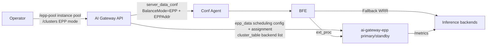
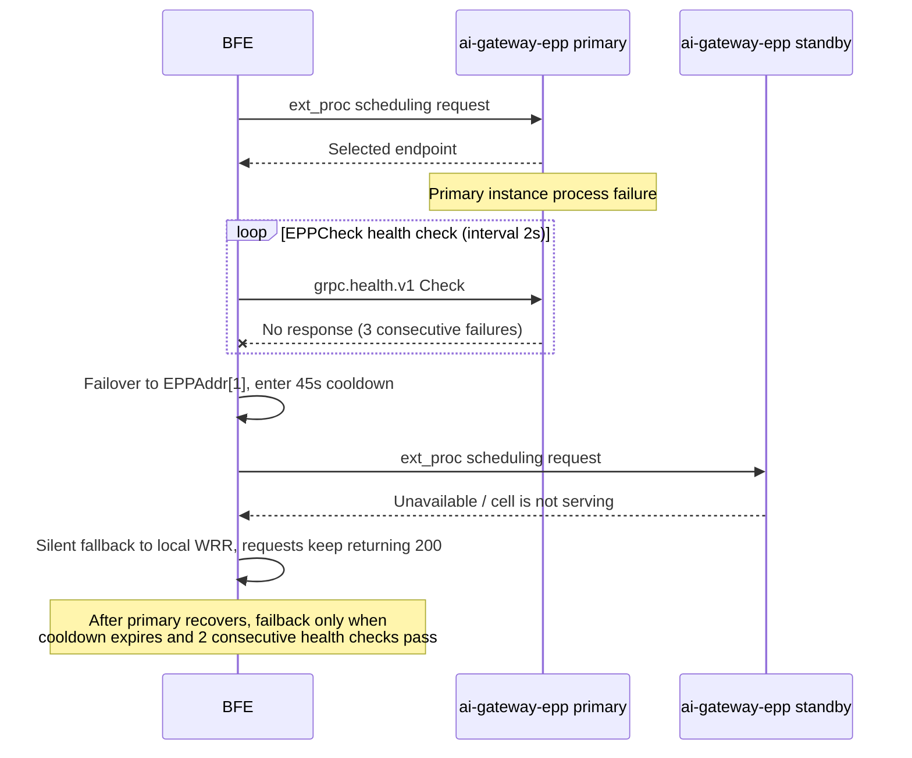

# Chapter 26 EPP Scheduling Configuration and Operations

## Chapter Goals

Through this chapter, the reader will master:

- The prerequisites and deployment form for using EPP intelligent scheduling;
- How to configure the EPP instance pool (`/epp-pool`) and EPP-mode Clusters (`balance_mode=EPP` + `epp_config`);
- How to view and manually override Cluster→instance-group assignments (`/epp-assignments`);
- Operating procedures for daily scenarios such as draining a backend, taking EPP instances online/offline, EPP failover, full-overload fallback, and disabling EPP scheduling;
- The observability metrics and alerting points of the EPP path;
- A quick reference of the validation rules for `epp_config` and the instance pool.

For the working principles and design semantics of EPP scheduling, see [Chapter 16 EPP Scheduling Design](../design/chapter16-epp-scheduling-design.md).

---

## Prerequisites and Deployment Form

Before using EPP intelligent scheduling, confirm that the following components are installed and running with the deployment:

- **ai-gateway-epp (EPP component)**: deployed by instance group; 2 instances per group in production (primary/standby for each other), single-instance groups allowed in test environments. Instances run with command-line parameters; the key parameters are as follows:

| Parameter | Default | Description |
|-----------|---------|-------------|
| `-instance-id` | hostname | Instance id; must match the instance id registered in `/epp-pool`; with K8s StatefulSet deployment the default is exactly the Pod name |
| `-api-addr` | `http://127.0.0.1:8181/inner-api/v1` | Base address of the AI Gateway API InnerAPI |
| `-api-token` | Environment variable `AI_GATEWAY_EPP_TOKEN` | InnerAPI authentication token |
| `-poll-interval` | `5s` | InnerAPI polling interval |
| `-poll-timeout` | `3s` | Timeout of a single polling request |
| `-grpc-port` | `9002` | ext_proc gRPC service port (BFE accesses this port via `EPPAddr`) |
| `-health-port` | `9003` | gRPC health check port (probed by BFE `EPPCheck`) |
| `-metrics-port` | `9090` | Prometheus metrics port |
| `-grpc-tls-cert` / `-grpc-tls-key` | empty (plaintext) | Server-side TLS certificate for ext_proc and health gRPC; recommended in production, verified on the BFE side with `EPPTLS.CAFile` |
| `-refresh-metrics-interval` | `50ms` | Scrape interval for backend `/metrics` metrics |

- **BFE**: accesses EPP via `GslbBasic.BalanceMode=EPP` and the ordered `EPPAddr=[primary,standby]`; the related configuration is automatically distributed by AI Gateway API via server_data_conf, and hot-loaded by Conf Agent — no manual editing is needed.
- **AI Gateway API**: OpenAPI and InnerAPI running normally; EPP instances poll `epp_data` and `cluster_table` via InnerAPI, with authentication and version-increment mechanisms consistent with other Data Plane components.

The linkage is shown in the figure below:



---

## Configuring the EPP Instance Pool

The EPP instance pool is a singleton resource providing two operations: `GET` (detail) and `PATCH` (full replacement). The authoritative source of groups and instance lists is the deployment pipeline, which reconciles by calling `PATCH` after scaling or machine replacement.

The following example registers one group `g1` with two instances `epp-0` and `epp-1` (host is the instance IP, `port` is EPP's ext_proc gRPC port):

```bash
curl -X PATCH "https://control-plane.example.com/open-api/v1/epp-pool" \
  -H "Content-Type: application/json" \
  -d '{
    "groups": [
        {
            "name": "g1",
            "instances": [
                { "id": "epp-0", "host": "10.0.0.1", "port": 9002 },
                { "id": "epp-1", "host": "10.0.0.2", "port": 9002 }
            ]
        }
    ]
}'
```

View the current instance pool:

```bash
curl -X GET "https://control-plane.example.com/open-api/v1/epp-pool"
```

Validation rules:

- `groups` must have at least 1 element; group names are non-empty and unique within the pool; empty groups are rejected;
- Instance `id` is non-empty and globally unique within the pool (EPP matches this value with `-instance-id`);
- `host` is a Hostname or IP (IPv6 literals without brackets), `port` is a valid port;
- `(host, port)` combinations are globally unique within the pool;
- Exactly 2 instances per group in production (primary/standby); single-instance groups allowed in test environments (primary only, no standby).

---

## Creating an EPP-Mode Cluster

Specify `balance_mode=EPP` and carry `epp_config` when creating a Cluster:

```bash
curl -X POST "https://control-plane.example.com/open-api/v1/clusters" \
  -H "Content-Type: application/json" \
  -d '{
    "name": "llm-cluster-a",
    "basic": { "protocol": "http" },
    "llm_config": { "provider": "p1", "models": ["m1"] },
    "balance_mode": "EPP",
    "epp_config": {
        "scheduling_profile": "balanced",
        "kv_cache_utilization_max": 0.9,
        "prefix_cache_affinity": true,
        "session_affinity_enabled": true,
        "session_affinity_header": "x-session-id",
        "flow_control": {
            "max_requests": 1000,
            "queue_ttl": 30,
            "no_endpoint_queue_ttl": 600,
            "enable_eviction": false
        }
    }
}'
```

After successful creation, the system automatically: validates `epp_config` → the greedy assigner picks group and primary → writes `epp_assignments` → at the next export, server_data_conf carries `BalanceMode=EPP` and the ordered `EPPAddr`, and epp_data carries the compiled scheduling configuration and the assignment entry.

`epp_config` field description:

| Field | Default | Description |
|-------|---------|-------------|
| `scheduling_profile` | `balanced` | Scheduling profile: `latency-first` / `balanced` / `throughput-first` |
| `cache_affinity` | unset (follows the profile) | Scorer weight override: `low` / `medium` / `high`; follows `scheduling_profile` when not set explicitly |
| `prefix_cache_affinity` | `true` | Prefix cache affinity switch (soft affinity; matching backends are not guaranteed) |
| `session_affinity_enabled` | `false` | Session affinity switch |
| `session_affinity_header` | - | Request header carrying the session id; required when `enabled=true`, the two are configured in pairs |
| `kv_cache_utilization_max` | `0.9` | KV cache utilization filter threshold `(0,1]` |
| `flow_control.max_requests` | unlimited | Global concurrency cap; `>0` or `-1` (explicitly unlimited) |
| `flow_control.queue_ttl` | EPP default 60 seconds | Queuing budget in seconds when the pool has endpoints; requests exceeding it are rejected with a retryable backpressure error |
| `flow_control.no_endpoint_queue_ttl` | follows `queue_ttl` | Queuing budget in seconds when the pool has no endpoints |
| `flow_control.enable_eviction` | `false` | Demand-driven eviction |

Notes:

- When `balance_mode=EPP`, `epp_config` is required and must pass field validation, otherwise creation returns 422;
- An EPP-mode Cluster does not create a `Role=COMMON` BFE instance pool, but the pool instance list still syncs the Provider's `instance_pool` — these instances are used by EPP to discover backends via cluster_table, and serve as the backends for BFE's fallback WRR when EPP is entirely down;
- Validation of `llm_config` (provider/models/keys) is independent of the balancing mode and runs as usual;
- A non-empty `epp_config` must be valid regardless of `balance_mode`: `WRR → EPP` requires a valid configuration to be provided at the same time; after `EPP → WRR` the configuration is retained dormant (not compiled, not exported) and continues to take effect when switching back to `EPP`.

---

## Viewing and Overriding Assignments

View the assignment full view:

```bash
curl -X GET "https://control-plane.example.com/open-api/v1/epp-assignments"
```

Example response:

```json
{
    "ErrNum": 200,
    "ErrMsg": "success",
    "Data": {
        "clusters": [
            {
                "cluster": "llm-cluster-a",
                "group": "g1",
                "primary":   { "id": "epp-0", "host": "10.0.0.1", "port": 9002 },
                "standby":   { "id": "epp-1", "host": "10.0.0.2", "port": 9002 }
            }
        ],
        "unassigned_clusters": [],
        "idle_groups": []
    }
}
```

Field meanings: `primary`/`standby` are the primary/standby instance details (standby is the instances of the same group other than the primary; `null` for single-instance groups); `unassigned_clusters` lists EPP-mode Clusters without a valid assignment (an abnormal state to handle promptly — server_data_conf export degrades them to WRR); `idle_groups` lists groups bearing no assignment. A single Cluster can also be filtered with `?cluster=<name>`.

When operations intervention is needed (e.g. failover confirmation, special layout), the assignment of a Cluster can be manually overridden:

```bash
curl -X PUT "https://control-plane.example.com/open-api/v1/epp-assignments/llm-cluster-a" \
  -H "Content-Type: application/json" \
  -d '{
    "group_name": "g1",
    "primary_instance_id": "epp-0"
}'
```

`group_name` must exist in the current instance pool, and `primary_instance_id` must exist in that group's instance list. After the override, the server_data_conf version bumps immediately, and BFE switches to the new primary/standby addresses at its next pull.

---

## Daily Operations Scenarios

### Draining a Backend

Set the `weight` of the Provider's instance to 0, and the instance is removed from all Clusters referencing that Provider (including EPP pools):

```bash
curl -X PATCH "https://control-plane.example.com/open-api/v1/providers/p1" \
  -H "Content-Type: application/json" \
  -d '{ "instance_pool": [ ... target instance weight=0 ... ] }'
```

Path: `ProviderInstancePoolSyncer` syncs the instance pool → cluster_table export updates → EPP's cluster-table-discovery removes it in the next polling cycle (within seconds, skipping `Weight=0` instances) → BFE's fallback WRR also stops selecting the instance. To recover, set the weight back to a positive number. During draining, EPP's utilization-filter and affinity logic are unaffected, and traffic automatically converges onto the remaining backends.

### Taking EPP Instances Online/Offline

Modify the `/epp-pool` instance list (`PATCH` full replacement):

- **Offline an instance**: remove it from the `instances` of its group. If it is the primary of some Cluster, the assigner repairs automatically — reselect the primary among remaining instances of the same group (no group change); if the group no longer exists, reassign across groups; when the pool has no assignable candidate group, clear the assignment (the Cluster enters the unassigned state, export degrades to WRR + error log).
- **Online an instance**: append an instance entry to the group (production groups keep 2 instances). After the new instance starts, it matches its role in the assignment full view by `-instance-id`: when assigned standby it loads configuration and stands by warm; when assigned primary it takes over scheduling immediately.
- The periodic reconciliation reconciler (30 seconds) backstops by scanning EPP Clusters without a valid assignment and filling them automatically; zero writes in most rounds.

### EPP Instance Failure

No manual intervention is needed when an EPP instance fails:

1. BFE's `EPPCheck` background health check finds the primary instance failing consecutively up to `FailThreshold` (default 3 times, probe interval default 2 seconds, detection takes about 6~10 seconds), and switches with hysteresis to `EPPAddr[1]` (standby).
2. The standby instance's Cell is in standby state and refuses scheduling requests (`cell is not serving`); BFE's handling of this error is to keep trying the next address of the same Cluster; eventually the EPP path fails and BFE **silently falls back to local WRR**, and the request still returns 200.
3. After the primary recovers, failback happens only when the cooldown (`Cooldown`, default 45 seconds) expires and the health check passes consecutively `SuccessThreshold` (default 2) times, preventing flapping.

Note: the standby does not automatically take over scheduling — assignments are configuration-driven, and no rebalance interface is provided. The correct action after failover is to let BFE fail back to the primary instance, or to manually override the primary to a healthy instance via `PUT /epp-assignments/{cluster}` (after the override, BFE switches when it pulls the new `EPPAddr`).

The failover sequence is as follows:



### Full-Overload Fallback

When the KV cache utilization of all backends exceeds `kv_cache_utilization_max`, EPP's utilization-filter filters out all endpoints (fail-closed), no candidate is returned, and BFE falls back to local WRR to continue serving — business is uninterrupted. Fallback occurrence can be confirmed by the growth of `epp_fallback_local_total`. The metrics pipeline has a scrape cycle (`RefreshMetricsInterval`); after utilization recovers, EPP re-admits the endpoints in the next cycle.

### Disabling EPP Scheduling

Change the Cluster's `balance_mode` back to `WRR`; there is no need to clear `epp_config` (retained dormant, can be switched back at any time):

```bash
curl -X PUT "https://control-plane.example.com/open-api/v1/clusters/llm-cluster-a" \
  -H "Content-Type: application/json" \
  -d '{ "balance_mode": "WRR" }'
```

Export semantics: `BalanceMode=WRR` with empty `EPPAddr`; epp_config and assignment records are retained but excluded from the epp_data export; assignment records are retained dormant, and the original configuration and assignments continue to take effect when switching back to `EPP`.

---

## Observability and Alerting

| Observation point | Location | Key metrics/logs | Alerting suggestions |
|-------------------|----------|------------------|----------------------|
| Degraded export | AI Gateway API error logs | When an EPP-mode Cluster has no valid assignment, an error-level log is output (including Cluster name and reason), and the export degrades that Cluster to `BalanceMode=WRR` | Alert on any error log; pair with `unassigned_clusters` inspection |
| BFE EPP calls | BFE monitoring port `/monitor/epp_metrics` | `epp_calls_total{cluster,result}` (result ∈ ok/no_pool/unknown_pool/draining/transport), `epp_fallback_local_total{cluster}`, `epp_failover_total{cluster}`, `epp_failback_total{cluster}`, `epp_active_addr_index{cluster}` | A surge of `epp_calls_total{result!="ok"}`, failover counter growth, or sustained growth of `epp_fallback_local_total` all indicate EPP path anomalies |
| EPP instances | EPP `/metrics` (default `:9090`) | `ai_epp_assignment_no_match` (this instance has no role in the assignment), `ai_epp_poller_failures_total` / `ai_epp_poller_backoff_state` (polling failures and backoff), `ai_epp_engine_reloads_total` (engine hot reloads), `ai_epp_cell_state` (Cell role and state) | `assignment_no_match=1` means `-instance-id` is inconsistent with `/epp-pool`; check the deployment; persistently non-zero poller failures mean the Control Plane is unreachable |

To determine whether a request actually went through EPP scheduling (rather than the fallback WRR): BFE's silent fallback for EPP failures also returns 200, so the criterion should be whether `epp_calls_total{result="ok"}` grows, not the response code alone.

---

## Validation Rules Quick Reference

**`/epp-pool` (instance pool)**

- Group names non-empty and unique within the pool; empty groups rejected;
- Instance ids non-empty and globally unique within the pool;
- `host` is a Hostname or IP, `port` is a valid port;
- `(host, port)` globally unique within the pool;
- Exactly 2 instances per group in production; single-instance groups allowed in test.

**`/clusters` (balance_mode and epp_config)**

- `balance_mode` enum `WRR` / `EPP`, default `WRR`;
- `balance_mode=EPP` requires `epp_config`; a non-empty `epp_config` must pass field validation (regardless of balance_mode);
- `scheduling_profile` ∈ `latency-first` / `balanced` / `throughput-first`, default `balanced`;
- `cache_affinity` ∈ `low` / `medium` / `high`;
- `prefix_cache_affinity` / `session_affinity_enabled` / `enable_eviction` are bools;
- `session_affinity_enabled=true` requires `session_affinity_header` (non-empty header name); the two appear in pairs;
- `kv_cache_utilization_max` ∈ `(0, 1]`, default `0.9`;
- `flow_control.max_requests` `>0` or `-1` (unlimited by default);
- `flow_control.queue_ttl` / `no_endpoint_queue_ttl` are integers ≥0 (seconds); `0` means explicitly disabled.

**`/epp-assignments` (manual override)**

- `group_name` must exist in the current instance pool;
- `primary_instance_id` must exist in that group's instance list and be a different address from the standby.

---

## Chapter Summary

- The EPP instance pool is registered via `/epp-pool` (singleton + full replacement); instance ids match EPP's `-instance-id`; the EPP component runs with parameters such as `-api-addr`, `-poll-interval`, and `-grpc-tls-cert`.
- Creating an EPP-mode Cluster means carrying `balance_mode=EPP` and `epp_config` in `POST /clusters`; the system assigns the instance group automatically, and `/epp-assignments` provides the full view and the manual override entry.
- Draining a backend = setting the Provider instance `weight=0`; removal takes effect within seconds in the cluster_table export and EPP discovery; taking EPP instances online/offline = modifying `/epp-pool`, with dangling assignments repaired automatically.
- EPP instance failures are switched with hysteresis by BFE `EPPCheck`; the standby does not automatically take over scheduling, and fallback traffic is carried by BFE's local WRR; on full overload EPP has no candidate and BFE falls back, business uninterrupted.
- Disabling EPP scheduling only requires `balance_mode=WRR`; epp_config and assignments remain dormant and can be switched back.
- Observability covers three layers: AI Gateway API error logs (degraded export), BFE `/monitor/epp_metrics` (`epp_calls_total` / `epp_fallback_local_total`), and EPP `/metrics` (`ai_epp_assignment_no_match`, etc.).

---

## References

- `ai-gateway-api/design-docs/api-define/OpenAPI接口定义/epp-pool.md`
- `ai-gateway-api/design-docs/api-define/OpenAPI接口定义/epp-assignments.md`
- `ai-gateway-api/design-docs/api-define/OpenAPI接口定义/clusters.md`
- `ai-gateway-api/design-docs/api-define/InnerAPI接口定义/epp-data.md`
- `ai-gateway-api/design-docs/api-define/InnerAPI接口定义/server-data-conf.md`
- `ai-gateway-api/design-docs/modifications/2026-09-08-epp-scheduling-integration/api-changes.md`
- `ai-gateway-api/design-docs/sys-design/details/EPP调度对接.md`
- `ai-gateway-epp/cmd/epp/config.go`
- `integration-test/test-cases/测试设计文档/scenario-SC28-EPP调度端到端/场景说明.md`
- [Chapter 16 EPP Scheduling Design](../design/chapter16-epp-scheduling-design.md)
