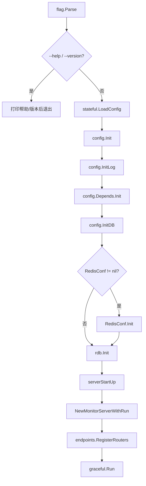
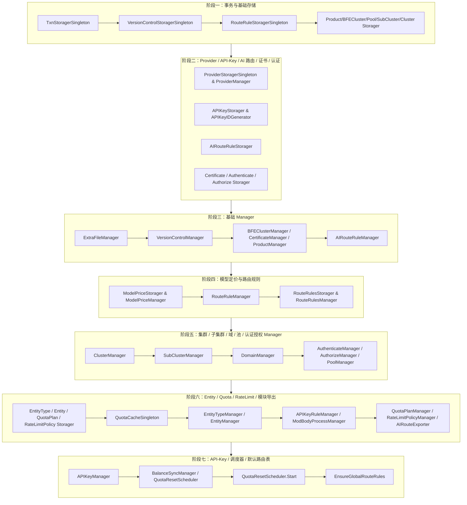

# 第二十五章 代码组织与启动流程

## 本章目标

通过阅读本章，读者将能够：

- 理解 `ai-gateway-api` 控制面代码的顶层目录组织方式。
- 明确接口层（Endpoints）、模型层（Model）、存储层（Storage/RDB）的职责边界与对应目录。
- 掌握 `main.go` 的启动流程，包括命令行参数解析、配置加载、数据库初始化、依赖注入容器初始化以及 HTTP 服务启动。
- 理解 `stateful` 包在配置加载与全局组件生命周期管理中的作用。
- 熟悉全局 `Manager` / `Storager` 的初始化顺序及其相互依赖关系。

## 分层架构概览

`ai-gateway-api` 是壬远 AI 网关的控制面（Control Plane）核心组件，对外暴露管理面 OpenAPI 与数据面 InnerAPI，向下为 BFE 数据面和 Conf Agent 生成可消费的配置快照。其代码组织采用经典的三层架构：

```
┌─────────────────────────────────────────────────────────────┐
│                        接口层 (endpoints)                    │
│   OpenAPI v1 (/open-api/v1)  ·  InnerAPI v1 (/inner-api/v1)  │
├─────────────────────────────────────────────────────────────┤
│                         模型层 (model)                       │
│        业务逻辑 · 事务编排 · 参数校验 · 级联操作              │
├─────────────────────────────────────────────────────────────┤
│                       存储层 (storage/rdb)                   │
│            DAO · Storager 实现 · 关系型数据库读写             │
└─────────────────────────────────────────────────────────────┘
```

| 层次 | 主要职责 | 关键包 |
|------|----------|--------|
| **接口层** | 处理 HTTP 请求、参数绑定与校验、权限校验、调用模型层、返回统一响应 | `endpoints/openapi_v1`、`endpoints/innerapi_v1`、`endpoints/middleware` |
| **模型层** | 封装业务逻辑、事务管理、调用存储层接口；不直接依赖底层数据库 | `model/*` |
| **存储层** | 负责关系型数据库的读写；向上暴露接口，由模型层通过事务抽象调用 | `storage/rdb/*` |

接口层通过 `stateful/container` 中注册的全局单例 Manager 调用模型层，不直接访问存储层。模型层只依赖同包或 `model/shared` 中定义的 `XxxStorager` 接口，以及 `model/itxn.TxnStorager` 事务抽象。存储层实现上述接口，内部通过 `storage/rdb/internal/dao` 操作具体的数据库表。

这种分层设计的核心目的在于**隔离变化**：当业务规则调整时，只需修改模型层；当数据库表结构变化时，只需修改存储层；当接口协议或鉴权方式变化时，只需修改接口层。同时，模型层通过接口而非具体实现依赖存储层，使得单元测试可以方便地使用 mock 存储替换真实数据库，从而保证 `model/` 包达到 70% 以上的语句覆盖率。

## ai-gateway-api 目录结构总览

`ai-gateway-api` 的顶层目录结构如下：

```
ai-gateway-api/
├── main.go                      # 服务入口：配置加载、初始化、启动 HTTP
├── conf/                        # 配置文件（TOML、i18n、AI 模板等）
├── data/                        # 数据文件
├── docs/                        # 用户文档
├── design-docs/                 # 设计文档
│   ├── api-define/              # 接口定义文档
│   └── sys-design/              # 系统设计文档
├── endpoints/                   # 接口层
│   ├── middleware/              # HTTP 中间件
│   ├── openapi_v1/              # 管理面 OpenAPI v1
│   └── innerapi_v1/             # 数据面 InnerAPI v1
├── lib/                         # 公共库（xreq、xerror、xdb 等）
├── model/                       # 模型层
│   ├── api_key/                 # API-Key 业务模型
│   ├── entity/                  # Entity / Entity-Type 业务模型
│   ├── iauth/                   # 认证授权
│   ├── ibasic/                  # 基础配置（product、bfe_cluster、extra_file）
│   ├── icluster_conf/           # 集群/子集群/实例池
│   ├── iprovider/               # Provider 业务模型
│   ├── imodel_price/            # ModelPrice 模型定价管理
│   ├── iroute_conf/             # 路由规则/域名
│   ├── iai_route/               # AI 路由规则
│   ├── iprotocol/               # TLS 证书
│   ├── iversion_control/        # 配置版本控制
│   ├── imods/                   # 模块配置导出
│   ├── quota/                   # QuotaPlan / BalanceSync / QuotaResetScheduler
│   ├── rate_limit_policy/       # RateLimitPolicy 业务模型
│   ├── quotacache/              # API-Key/Entity 实时配额缓存抽象
│   ├── shared/                  # 跨包共享类型与模型
│   ├── route_rules/             # Global/Entity/API-Key 路由规则业务逻辑
│   └── itxn/                    # 事务抽象接口
├── stateful/                    # 配置、数据库、日志、依赖注入容器
│   └── container/               # 全局组件容器
│       ├── components.go        # 全局 Manager/Storager 单例声明
│       └── rdb/                 # 基于 RDB 的组件初始化与依赖注入
│           └── components.go    # Init() 实现
├── static/                      # 前端静态资源
├── storage/rdb/                 # 存储层
│   ├── internal/dao/            # DAO 层
│   ├── auth/                    # 认证授权存储实现
│   ├── basic/                   # 基础配置存储实现
│   ├── cluster_conf/            # 集群/API-Key/实例池存储实现
│   ├── protocol/                # 证书存储实现
│   ├── quota/                   # Quota 相关存储实现
│   ├── route_conf/              # 路由规则存储实现
│   ├── txn/                     # 事务实现
│   └── version_control/         # 版本控制存储实现
├── test/                        # 测试相关
└── version/                     # 版本信息
```

## 接口层、模型层、存储层对应目录

### 接口层（endpoints）

接口层位于 `endpoints/`，统一使用 `lib/xreq.Endpoint` 抽象描述每个 HTTP 接口：

```go
type Endpoint struct {
    Path            string
    Method          string
    Handler         Handler
    Authorizer      func(*http.Request) error
    RegisterHandler func(*mux.Router) *mux.Route
}
```

| 子目录 | 职责 |
|--------|------|
| `endpoints/openapi_v1/` | 管理面 OpenAPI，供 Dashboard 和自动化脚本使用，例如 `/api-keys`、`/clusters`、`/providers` 等 |
| `endpoints/innerapi_v1/` | 数据面 InnerAPI，供 BFE 和 Conf Agent 拉取配置，例如 `/configs/tls_conf/server_data_conf`、`/configs/mod-api-key` 等 |
| `endpoints/middleware/` | 全局 HTTP 中间件：Recovery、Logger、CORS、Product Probe、User Probe |

两大接口族在路由前缀、鉴权方式和用途上存在明显差异。OpenAPI v1 以 `/open-api/v1` 为前缀，主要面向人和外部系统，通常需要 Product Probe 与 User Probe 中间件完成产品线与用户身份校验；InnerAPI v1 以 `/inner-api/v1` 为前缀，主要面向 BFE 和 Conf Agent 等机器客户端，强调配置的完整导出与版本增量同步。顶层 `endpoints/router.go` 负责全局 Recovery、Logger、CORS 与静态文件服务，而 `endpoints/openapi_v1/endpoints.go` 与 `endpoints/innerapi_v1/endpoints.go` 分别合并各自子包的 `Endpoint` 切片并完成注册。

### 模型层（model）

模型层位于 `model/`，采用 **Manager + Storager 接口** 的分层模式：

| 类型 | 说明 |
|------|------|
| `XxxParam` | 创建/更新入参，字段多为指针类型以区分“未传”与“零值” |
| `XxxFilter` | 查询条件，包含分页字段 `Page` / `PageSize` |
| `XxxStorager` | 定义持久化操作契约，由 `storage/rdb/` 各子包实现 |
| `XxxManager` | 业务逻辑实现，聚合 `itxn.TxnStorager` 与其它 `Storager` |

关键模型包及其职责如下：

| 模型包 | 主要职责 |
|--------|----------|
| `model/api_key` | API-Key 业务逻辑、级联删除、实时配额查询、mod-api-key 导出数据源 |
| `model/entity` | Entity / Entity-Type 业务逻辑、层级校验、级联删除 |
| `model/icluster_conf` | Cluster、SubCluster、Pool 业务逻辑 |
| `model/iprovider` | Provider 业务逻辑：CRUD、模型发现、被 cluster 引用检查 |
| `model/quota` | QuotaPlan、BalanceSync、QuotaResetScheduler |
| `model/rate_limit_policy` | RateLimitPolicy 业务逻辑、层级收集与导出 |
| `model/route_rules` | Global/Entity/API-Key 路由规则业务逻辑 |
| `model/imods` | mod-api-key、mod-body-process、AI 路由导出配置组装 |
| `model/itxn` | 事务抽象接口 `TxnStorager` |

`model/itxn/txn.go` 中定义了统一的事务抽象：

```go
type TxnStorager interface {
    AtomExecute(ctx context.Context, do func(context.Context) error) error
}
```

`storage/rdb/txn` 提供基于 `database/sql` 的实现；Manager 通过 `container.TxnStoragerSingleton` 编排跨多个 Storager 的原子操作。任何涉及多张表或跨多个 Storager 的业务变更，都应当封装在 `AtomExecute` 回调中执行，避免在 Manager 内部直接开启 ad-hoc 事务。

### 存储层（storage/rdb）

存储层位于 `storage/rdb`，采用 **DAO + Storage** 两层结构：

| 组件 | 职责 |
|------|------|
| `storage/rdb/internal/dao` | 按表提供 `T<Table>One/List/Create/Update/Delete` 函数，直接操作数据库 |
| `storage/rdb/*` | 实现 `model/*` 中定义的 `XxxStorager` 接口，完成 DAO 结果与业务模型的转换 |
| `storage/rdb/txn` | 实现 `model/itxn.TxnStorager` 事务抽象 |

存储层与模型层的对应关系如下：

| 存储包 | 对应模型包 | 覆盖表 |
|--------|------------|--------|
| `storage/rdb/auth` | `model/iauth` | `users`、`user_products` |
| `storage/rdb/basic` | `model/ibasic` | `bfe_clusters`、`products`、`extra_files` |
| `storage/rdb/api_key` | `model/api_key` | `api_keys`、`api_key_tokens` |
| `storage/rdb/cluster_conf` | `model/icluster_conf` | `clusters`、`sub_clusters`、`pools`、`lb_matrices` |
| `storage/rdb/entity` | `model/entity` | `entity_types`、`entities` |
| `storage/rdb/protocol` | `model/iprotocol` | `certificates` |
| `storage/rdb/quota` | `model/quota` | `quota_plans` |
| `storage/rdb/rate_limit_policy` | `model/rate_limit_policy` | `rate_limit_policies` |
| `storage/rdb/route_conf` | `model/iroute_conf` | `domains`、`route_basic_rules` 等 |
| `storage/rdb/route_rules` | `model/shared`、`model/route_rules` | `route_rules` |
| `storage/rdb/ai_route` | `model/iai_route` | `ai_route_rules` |
| `storage/rdb/version_control` | `model/iversion_control` | `config_versions` |

DAO 层遵循统一模板：每个表拥有表名常量、结果结构体 `T<Table>`、参数结构体 `T<Table>Param` 以及 `T<Table>One/List/Create/Update/Delete` 函数。Storage 层则在这些 DAO 函数之上实现 `XxxStorager` 接口，负责业务模型与数据库行之间的转换、字段默认值处理以及简单的查询条件组装。所有表均包含 `created_at` 与 `updated_at` 字段，且 DDL 未声明物理 FOREIGN KEY，表间关系由应用层代码维护，便于未来分库分表与灵活变更。

## main.go 启动流程

`ai-gateway-api/main.go` 是整个控制面服务的唯一入口。其主流程可以分为两个阶段：初始化阶段与服务启动阶段。



关键代码片段 `ai-gateway-api/main.go`：

```go
func main() {
    flag.Parse()

    if *help {
        flag.PrintDefaults()
        return
    }
    if *showVer {
        fmt.Printf("version %s\n", version.Version)
        return
    }

    if err := stateful.LoadConfig(filepath.Join(*confDir, *serverConf)); err != nil {
        stateful.Exit("LoadConfig", err, -1)
    }

    config := stateful.DefaultConfig
    config.LogDir = *logDir
    config.ConfigDir = *confDir

    config.Vars["conf_dir"] = *confDir
    config.Vars["log_dir"] = *logDir

    if err := config.Init(); err != nil {
        stateful.Exit("config.Init", err, -1)
    }

    if err := config.InitLog(); err != nil {
        stateful.Exit("config.InitLog", err, -1)
    }

    defer func() {
        time.Sleep(time.Second)
        stateful.CloseLog()
    }()

    if err := config.Depends.Init(); err != nil {
        stateful.Exit("config.Depends.Init", err, -1)
    }

    if err := config.InitDB(); err != nil {
        stateful.Exit("config.InitDB", err, -1)
    }

    // check redis server conf
    if config.RedisConf != nil {
        config.RedisConf.Init()
    }

    if err := rdb.Init(); err != nil {
        stateful.Exit("rdb.Init", err, -1)
    }

    serverStartUp()
}
```

### 命令行参数

`main.go` 通过标准库 `flag` 解析以下参数：

```go
var (
    help       *bool   = flag.Bool("h", false, "to show help")
    showVer    *bool   = flag.Bool("v", false, "to show version")
    confDir    *string = flag.String("c", "./conf/", "API configure dir")
    serverConf *string = flag.String("sc", "ai_gateway_api.toml", "server conf file")
    logDir     *string = flag.String("l", "./log", "dir path of log")
)
```

- `-c`：配置文件目录，默认为 `./conf/`。
- `-sc`：服务端配置文件名，默认为 `ai_gateway_api.toml`。
- `-l`：日志目录，默认为 `./log`。
- `-h` / `-v`：分别用于打印帮助信息和版本信息。

本地启动示例：

```bash
./ai-gateway-api -c ./conf -sc ai_gateway_api.toml -l ./log
```

### 服务启动阶段

当初始化完成后，`serverStartUp()` 负责启动 HTTP 服务：

```go
func serverStartUp() {
    serverConfig := stateful.DefaultConfig.Server

    if serverConfig.MonitorPort > 0 {
        stateful.NewMonitorServerWithRun(version.Version, serverConfig.MonitorPort)
    }

    n := negroni.New()
    router := mux.NewRouter()
    endpoints.RegisterRouters(router)
    n.UseHandler(router)

    timeout := time.Duration(serverConfig.GracefulTimeOutInMs) * time.Millisecond
    serverAddr := serverConfig.ServerAddr
    if serverAddr == "" {
        serverAddr = "0.0.0.0"
    }
    address := fmt.Sprintf("%s:%d", serverAddr, serverConfig.ServerPort)
    fmt.Println("Run Server At:", address)
    graceful.Run(address, timeout, n)
}
```

该阶段主要完成三件事：

1. **监控服务启动**：如果配置中 `MonitorPort > 0`，则启动监控端口（默认 8284），用于暴露版本、健康检查、性能指标等。
2. **路由注册**：使用 `gorilla/mux` 创建路由器，调用 `endpoints.RegisterRouters(router)` 注册 OpenAPI 与 InnerAPI 路由，并通过 `negroni` 挂载全局中间件（Recovery、Logger、CORS 等）。
3. **优雅启动**：使用 `tylerb/graceful` 启动 HTTP 服务，支持优雅关闭（Graceful Shutdown），超时时间由 `GracefulTimeOutInMs` 配置决定。

## stateful 配置加载与依赖注入容器

`stateful` 包负责配置加载、数据库连接、日志初始化以及全局依赖管理。其内部主要包含以下文件：

| 文件 | 职责 |
|------|------|
| `stateful/config.go` | TOML 配置加载、`DefaultConfig` 全局变量、基础配置结构体 |
| `stateful/config_database.go` | 数据库配置与 `InitDB` 实现 |
| `stateful/config_depends.go` | 非数据库依赖（i18n、nav_tree 等）初始化 |
| `stateful/log.go` | 日志初始化与关闭 |
| `stateful/monitor.go` | 监控服务启动 |
| `stateful/container/components.go` | 全局 Manager / Storager 单例声明 |
| `stateful/container/rdb/components.go` | 基于 RDB 的组件初始化与依赖注入 |

其核心流程如下：

1. **`stateful.LoadConfig`**：读取 TOML 配置文件，反序列化为 `stateful.Config` 结构体，保存到 `stateful.DefaultConfig` 全局变量。
2. **`config.Init()`**：初始化路径变量、内部状态等。
3. **`config.InitLog()`**：根据配置初始化日志输出目录与日志级别。
4. **`config.Depends.Init()`**：初始化非数据库依赖，例如 i18n、导航树（nav_tree）等。
5. **`config.InitDB()`**：根据配置创建 `sql.DB` 连接池，支持 MySQL 与 SQLite。
6. **`RedisConf.Init()`**（可选）：如果配置了 Redis，则初始化 Redis 客户端。
7. **`rdb.Init()`**：通过依赖注入容器，按顺序初始化所有 `Storager` 与 `Manager` 全局单例。

每个初始化步骤失败时，均调用 `stateful.Exit("阶段名", err, -1)` 打印错误并立即退出，避免在配置不完整或依赖不可用的情况下启动服务。`main.go` 中的 `defer` 块会在进程退出前等待一秒并关闭日志，确保缓冲日志落盘。

## 全局 Manager/Storager 初始化顺序

系统使用**全局容器 + 手动依赖注入**模式。所有可复用的 Manager 与 Storager 单例声明在 `stateful/container/components.go`，初始化逻辑集中在 `stateful/container/rdb/components.go:Init()`。

`stateful/container/components.go` 中声明了所有全局单例，例如：

```go
var (
    TxnStoragerSingleton            itxn.TxnStorager
    VersionControlStoragerSingleton iversion_control.VersionControlStorager
    RouteRuleStoragerSingleton      iroute_conf.RouteRuleStorager
    ProductStoragerSingleton        ibasic.ProductStorager
    // ... 省略其它 Storager

    APIKeyManager                   *api_key.APIKeyManager
    ClusterManager                  *icluster_conf.ClusterManager
    RouteRulesManager               *route_rules.RouteRulesManager
    QuotaPlanManager                *quota.QuotaPlanManager
    // ... 省略其它 Manager
)
```

`stateful/container/rdb/components.go:Init()` 按以下顺序完成初始化：



具体说明如下：

1. **事务与基础存储**：首先初始化 `TxnStoragerSingleton`，后续所有跨表事务都依赖它。随后初始化版本控制、路由规则、产品、BFE 集群、实例池、子集群、集群等基础 Storager。
2. **Provider / API-Key / AI 路由 / 证书 / 认证**：初始化 Provider、API-Key、AI 路由规则、证书、认证授权相关存储。
3. **基础 Manager**：用已初始化的 Storager 组装 ExtraFileManager、VersionControlManager、BFEClusterManager、CertificateManager、ProductManager、AIRouteRuleManager 等。
4. **模型定价与路由规则**：在 RouteRuleManager 之前初始化 ModelPriceManager，以便 InnerAPI 导出时能够将 `ModelTable` 附加到 `AIConf`。
5. **集群 / 子集群 / 域 / 池 / 认证授权 Manager**：初始化 ClusterManager、SubClusterManager、DomainManager、AuthenticateManager、AuthorizeManager、PoolManager。注意 `RouteRulesManager` 必须在 `ClusterManager` 之前初始化，因为集群删除检查器依赖它。
6. **Entity / Quota / RateLimit / 模块导出**：初始化 Entity、Quota、RateLimitPolicy 相关存储与 Manager，以及 `APIKeyRuleManager`、`ModBodyProcessManager`、`AIRouteExporter` 等模块导出 Manager。
7. **API-Key Manager / 调度器 / 默认路由表**：最后初始化 `APIKeyManager`，注入 Quota/RateLimit/Entity 适配器；启动 `QuotaResetScheduler`；调用 `RouteRulesManager.EnsureGlobalRouteRules` 确保 `route_rules` 表中存在 `type=global, owner=global` 的默认记录。

关键代码片段 `stateful/container/rdb/components.go`：

```go
func Init() error {
    container.TxnStoragerSingleton = txn.NewRDBTxnStorager(stateful.NewBFEDBContext)
    container.VersionControlStoragerSingleton = version_control.NewVersionControllerStorage(stateful.NewBFEDBContext)
    container.RouteRuleStoragerSingleton = route_conf.NewRouteRuleStorager(
        stateful.NewBFEDBContext,
        container.VersionControlStoragerSingleton)

    container.ProductStoragerSingleton = basic.NewProductManager(stateful.NewBFEDBContext)
    container.BFEClusterStoragerSingleton = basic.NewRDBBFEClusterStorager(stateful.NewBFEDBContext)
    // ... 省略中间初始化代码

    container.QuotaResetScheduler = quota.NewQuotaResetScheduler(
        container.TxnStoragerSingleton,
        container.BalanceSyncManager)

    container.QuotaResetScheduler.Start()

    // Ensure the global route table exists on startup.
    if err := container.RouteRulesManager.EnsureGlobalRouteRules(context.Background()); err != nil {
        return err
    }

    return nil
}
```

### 初始化顺序的依赖关系与注意事项

`rdb.Init()` 中的顺序并非随意排列，而是严格由组件间的依赖关系决定。以下三点尤为关键：

1. **事务优先**：`TxnStoragerSingleton` 必须第一个初始化，因为几乎所有 Manager 的构造函数都需要它。如果事务抽象未就绪，后续所有 Manager 都无法完成组装。
2. **路由规则先于集群**：`RouteRulesManager` 必须在 `ClusterManager` 之前初始化，因为 `ClusterManager` 的删除检查器（`ClusterDeleteChecker`）和模型更新检查器（`ClusterModelUpdateChecker`）需要依赖 `RouteRulesManager` 与 `RouteRuleManager`。
3. **模型定价先于路由规则**：`ModelPriceManager` 在 `RouteRuleManager` 之前初始化，以便 InnerAPI 导出 `server_data_conf` 时，能够将 `Provider` 对应的 `ModelTable` 正确附加到 `AIConf` 中。

新增 Manager 或 Storager 时，应首先判断它依赖哪些已初始化的组件，再将其插入到合适的位置。若不慎造成循环依赖，通常意味着职责边界需要重新划分，例如将公共逻辑下沉到 `model/shared` 或通过适配器接口解耦。

### 适配器模式

API-Key、Entity、RateLimitPolicy 已拆分为独立的模型包，而 QuotaPlan 仍保留在 `model/quota`。代码中通过适配器（如 `quota.NewQuotaPlanStoragerAdapter`、`quota.NewEntityStoragerAdapter`、`quota.NewRateLimitPolicyStoragerAdapter`）将这些包中的 Storager 接口转换为 `model/shared` 中定义的通用接口，供 `APIKeyManager` / `EntityManager` 统一调用，实现跨包复用。例如：

```go
container.EntityManager = entity.NewEntityManager(
    container.TxnStoragerSingleton,
    container.EntityStorager,
    container.EntityTypeStorager,
    quota.NewQuotaPlanStoragerAdapter(container.QuotaPlanStorager),
    rate_limit_policy.NewRateLimitPolicyStoragerAdapter(container.RateLimitPolicyStorager),
    container.RouteRulesStorager,
    container.QuotaCacheSingleton)
```

## 关键代码片段

### main.go 启动入口

文件路径：`ai-gateway-api/main.go`

```go
if err := stateful.LoadConfig(filepath.Join(*confDir, *serverConf)); err != nil {
    stateful.Exit("LoadConfig", err, -1)
}

config := stateful.DefaultConfig
config.LogDir = *logDir
config.ConfigDir = *confDir

if err := config.Init(); err != nil {
    stateful.Exit("config.Init", err, -1)
}

if err := config.InitLog(); err != nil {
    stateful.Exit("config.InitLog", err, -1)
}

if err := config.Depends.Init(); err != nil {
    stateful.Exit("config.Depends.Init", err, -1)
}

if err := config.InitDB(); err != nil {
    stateful.Exit("config.InitDB", err, -1)
}

if config.RedisConf != nil {
    config.RedisConf.Init()
}

if err := rdb.Init(); err != nil {
    stateful.Exit("rdb.Init", err, -1)
}

serverStartUp()
```

### rdb.Init 依赖注入

文件路径：`ai-gateway-api/stateful/container/rdb/components.go`

```go
func Init() error {
    container.TxnStoragerSingleton = txn.NewRDBTxnStorager(stateful.NewBFEDBContext)
    container.VersionControlStoragerSingleton = version_control.NewVersionControllerStorage(stateful.NewBFEDBContext)
    // ... 省略大量初始化代码
    container.QuotaResetScheduler.Start()
    return container.RouteRulesManager.EnsureGlobalRouteRules(context.Background())
}
```

## 本章小结

本章系统梳理了 `ai-gateway-api` 的代码组织方式与启动流程：

- 项目采用经典的三层架构：接口层（`endpoints`）、模型层（`model`）、存储层（`storage/rdb`），各层通过 `XxxStorager` 接口与 `TxnStorager` 事务抽象解耦。
- `main.go` 是服务的唯一入口，依次完成命令行参数解析、配置加载、日志初始化、数据库连接、Redis 初始化、依赖注入容器初始化，最后启动 HTTP 服务。
- `stateful` 包负责配置加载与运行时基础设施管理；`stateful/container` 通过全局单例保存所有 `Manager` 和 `Storager`；`stateful/container/rdb/components.go:Init()` 按严格的依赖顺序完成手动依赖注入。
- 初始化顺序至关重要：先事务与基础存储，再 Provider/API-Key/AI 路由/证书/认证，再基础 Manager，再模型定价与路由规则，再集群/域/池/认证授权，最后 Entity/Quota/RateLimit/模块导出、API-Key Manager、调度器以及默认 Global 路由表。

掌握这些组织方式与启动顺序，有助于开发者在新增业务模块时，正确选择目录位置、遵循分层约束、避免循环依赖，并能在启动异常时快速定位是配置加载、数据库连接还是依赖注入阶段出现问题。

## 参考文档

- `ai-gateway-api/AGENTS.md`
- `ai-gateway-api/main.go`
- `ai-gateway-api/design-docs/sys-design/总体设计文档.md`
- `ai-gateway-api/stateful/container/components.go`
- `ai-gateway-api/stateful/container/rdb/components.go`
- `ai-gateway-api/design-docs/sys-design/接口层设计文档.md`
- `ai-gateway-api/design-docs/sys-design/模型层设计文档.md`
- `ai-gateway-api/design-docs/sys-design/存储层设计文档.md`
- `ai-gateway-api/design-docs/sys-design/数据库设计文档.md`
