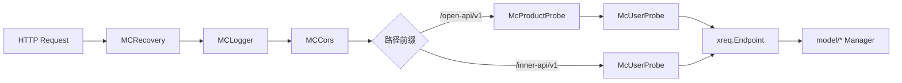

# 第二十六章 接口层实现：OpenAPI与InnerAPI

## 本章目标

通过本章，读者将理解 `ai-gateway-api` 接口层（`endpoints` 包）的实际代码组织方式，掌握以下内容：

- `endpoints` 目录如何划分管理面 OpenAPI 与数据面 InnerAPI；
- `xreq.Endpoint` 统一抽象的结构、注册流程与鉴权挂载点；
- Recovery、Logger、CORS、Product Probe、User Probe 五条中间件的作用与执行顺序；
- OpenAPI v1 如何通过 `endpoints()` 合并函数聚合各业务子包的 Endpoint；
- InnerAPI v1 如何导出 BFE 数据面所需的九类配置；
- 参数绑定、权限校验、统一响应格式在接口层的具体实现；
- 一个 OpenAPI 接口与一个 InnerAPI 接口的完整 Action 示例。

关于控制面三层架构与 OpenAPI / InnerAPI 职责划分的设计背景，可参阅 [第六章 控制面核心设计：AI Gateway API](../design/chapter06-control-plane-design.md)；关于 InnerAPI 增量导出与版本控制机制，可参阅 [第二十一章 配置导出与版本控制设计](../design/chapter14-config-export-and-version-control.md)。

---

## 25.1 endpoints 目录结构

`ai-gateway-api/endpoints/` 是 HTTP 请求的入口层，所有管理面接口与数据面导出接口都集中在这里。为了降低耦合，目录被清晰地划分为根路由、公共中间件、OpenAPI 子系统与 InnerAPI 子系统四个部分：

```
ai-gateway-api/endpoints/
├── router.go                 # 根路由注册：静态文件、OpenAPI、InnerAPI、全局中间件
├── middleware/               # HTTP 中间件
│   ├── access_logger.go      # 访问日志
│   ├── convert.go            # 请求/响应转换与中间件适配
│   ├── cors.go               # 跨域处理
│   ├── product_probe.go      # 产品线上下文解析
│   ├── recovery.go           # panic 恢复
│   └── user_probe.go         # 用户/Token 鉴权
├── openapi_v1/               # 管理面 OpenAPI（前缀 /open-api/v1）
│   ├── endpoints.go          # 统一合并各子包 Endpoint
│   ├── api_key/              # /api-keys
│   ├── auth/                 # /auth、/meta
│   ├── bfe_pool/             # /alb-pool
│   ├── certificate/          # /certificates
│   ├── domain/               # 当前未注册
│   ├── entity/               # /entities
│   ├── entity_type/          # /entity-types
│   ├── global_route_rules/   # /global-route-rules
│   ├── model_price/          # /model-prices
│   ├── product_cluster/      # /clusters
│   ├── provider/             # /providers
│   ├── route/                # /expression/verify
│   ├── route_tables/         # /route-tables
│   ├── subcluster/           # 当前未注册
│   └── traffic/              # 当前未注册
└── innerapi_v1/              # 数据面 InnerAPI（前缀 /inner-api/v1）
    ├── endpoints.go          # 统一注册导出接口
    ├── ai_route/
    ├── extra_file/
    ├── gslb_data/
    ├── mod_api_key/
    ├── mod_body_process/
    ├── protocol/
    ├── rate_limit_policy/
    ├── server_data/
    └── export_util/
```

该结构遵循“子包自治、顶层合并”的原则：每个业务子包只维护自己的 Endpoint 变量与 Action 函数，`openapi_v1/endpoints.go` 与 `innerapi_v1/endpoints.go` 仅负责把这些切片合并后注册到 `gorilla/mux` 路由器，不处理任何业务逻辑。这样，新增一个业务领域时，只需要新建一个子包、导出自己的 `Endpoints` 切片，再在顶层合并函数中追加一行即可。

---

## 25.2 xreq.Endpoint 抽象

接口层采用统一的 `xreq.Endpoint` 抽象来描述每个 HTTP 接口。其定义位于 `lib/xreq/result.go`：

```go
// ai-gateway-api/lib/xreq/result.go
type Handler func(req *http.Request) (interface{}, error)

type Endpoint struct {
    Path    string
    Method  string
    Handler func(*http.Request) *Result

    RegisterHandler func(*mux.Router) *mux.Route

    Authorizer *iauth.Authorization
}

func (ep *Endpoint) ServeHTTP(rw http.ResponseWriter, req *http.Request) {
    rst := ep.Handler(req)

    render := Render
    if rst != nil && rst.Render != nil {
        render = rst.Render
    }

    render(rw, req, rst)
}

func (ep *Endpoint) Register(router *mux.Router) *mux.Router {
    if authorizer := ep.Authorizer; authorizer != nil {
        router = router.NewRoute().Subrouter()
        router.Use(func(next http.Handler) http.Handler {
            return http.HandlerFunc(func(rw http.ResponseWriter, req *http.Request) {
                ctx := req.Context()
                GetRequestInfo(ctx).URLPattern = ep.Path

                err := container.AuthorizeManager.Authorizate(ctx, authorizer)
                if err != nil {
                    ErrorRender(err, rw, req)
                    return
                }

                next.ServeHTTP(rw, req)
            })
        })
    }

    if ep.RegisterHandler == nil {
        router.Handle(ep.Path, ep).Methods(ep.Method)
    } else {
        ep.RegisterHandler(router).Handler(ep)
    }

    return router
}
```

`Endpoint` 将路径、方法、处理器与鉴权信息集中在一处，带来了三点好处：

1. **接口自描述**：开发者在同一个结构体中就能看到该接口的 URL、方法、业务处理器和所需权限；
2. **统一注册**：顶层 `endpoints.go` 只负责合并切片与循环注册，不掺杂业务代码；
3. **鉴权一致**：OpenAPI 与 InnerAPI 都通过 `Authorizer` 字段注入 `iauth.FA(feature, action)`，由 `Endpoint.Register` 统一挂载鉴权子路由。

业务 Action 的签名是 `func(*http.Request) (interface{}, error)`，而 `Endpoint.Handler` 需要的是 `func(*http.Request) *Result`。两者之间的转换由 `xreq.Convert` 完成：

```go
// ai-gateway-api/lib/xreq/result.go
func Convert(h Handler) func(req *http.Request) *Result {
    return func(req *http.Request) *Result {
        data, err := h(req)
        return &Result{
            OriginErr: err,
            Data:      data,
        }
    }
}
```

对于需要直接写原始字节流的导出接口（如附加文件），则使用 `xreq.RawConvert`，它会在成功时直接返回 `application/octet-stream`，失败时才回到 JSON 错误响应。

一条 HTTP 请求进入接口层后的整体链路可以用下图表示：



---

## 25.3 全局中间件与路由子树中间件

`endpoints/router.go` 在根路由器上注册了全局中间件，并在 OpenAPI / InnerAPI 子路由器上分别挂载业务中间件。可以把它们分为两组：

- **全局中间件**：Recovery、Logger、CORS，对所有请求生效；
- **路由子树中间件**：Product Probe、User Probe，根据前缀差异挂载。

### 25.3.1 根路由注册

```go
// ai-gateway-api/endpoints/router.go
func RegisterRouters(router *mux.Router) {
    // ... 静态文件与 NotFoundHandler 配置 ...

    router.Use(middleware.MCRecovery)
    router.Use(middleware.MCLogger)
    router.Use(middleware.MCCors)

    openapi_v1.RegisterEndpoints(router)
    innerapi_v1.RegisterRouter(router)
}
```

`router.Use` 注册的中间件会作用于所有子路由器，因此 Recovery、Logger、CORS 对所有 API 路径生效。`NotFoundHandler` 与 `MethodNotAllowedHandler` 也被显式配置，确保 `/open-api/v1` 与 `/inner-api/v1` 路径未命中时返回 JSON 格式的 404/405，而不是回退到静态文件。

### 25.3.2 Recovery：panic 恢复

`middleware/recovery.go` 中的 `NewRecovery` 会在 `defer` 中捕获 handler 发生的 panic，记录异常堆栈，并返回统一的 500 错误响应，避免进程崩溃：

```go
// ai-gateway-api/endpoints/middleware/recovery.go
func (rec *Recovery) ServeHTTP(rw http.ResponseWriter, req *http.Request, next http.HandlerFunc) {
    ctx := lib.NewLogContext(req.Context())
    ctx, requestInfo := xreq.InitRequestInfo(ctx, req)
    requestInfo.LogID = lib.GainLogID(ctx)

    req = req.WithContext(ctx)

    defer func() {
        if err := recover(); err != nil {
            stateful.MetricPaincCounter.Inc()

            stack := make([]byte, rec.StackSize)
            stack = stack[:runtime.Stack(stack, rec.StackAll)]
            stackString := string(stack)

            requestInfo.StatusCode = 500
            requestInfo.RetMsg = "system error"
            requestInfo.ErrDetail = fmt.Sprintf("PANIC: ERR:%s STACK:%s", err, strings.ReplaceAll(stackString, "\n", "\\n"))

            stateful.AccessLogger.Warn(requestInfo.String())
            stateful.ExceptionLogger.Error("PANIC in HTTP handler: err=%v\n%s", err, stackString)

            r := &xreq.Result{
                Code:   requestInfo.StatusCode,
                ErrMsg: requestInfo.RetMsg,
            }

            xreq.Render(rw, req, r)
        }
    }()

    next(rw, req)
}
```

Recovery 中间件是第一个挂载的中间件，因此后续的 Logger 才能拿到它初始化的 `RequestInfo`，并在 panic 时记录到完整上下文。

### 25.3.3 Logger：访问日志与监控

`middleware/access_logger.go` 在请求完成后统一记录访问日志，并根据 URL Pattern、HTTP 方法、状态码更新 Prometheus 指标：

```go
// ai-gateway-api/endpoints/middleware/access_logger.go
func (l *LoggerMiddleWare) ServeHTTP(rw http.ResponseWriter, r *http.Request, next http.HandlerFunc) {
    next(rw, r)

    ctx := r.Context()
    requestInfo := xreq.GetRequestInfo(ctx)
    requestInfo.Duration = time.Since(requestInfo.StartTime)

    nrw := rw.(negroni.ResponseWriter)
    requestInfo.StatusCode = nrw.Status()

    Record(requestInfo)
    UpdateMonitor(r, requestInfo)
}
```

`UpdateMonitor` 使用 `URLPattern` 作为标签，因此接口监控可以精确到具体路由。`URLPattern` 会在 Endpoint 注册时被赋值。

### 25.3.4 CORS：跨域处理

`middleware/cors.go` 使用 `rs/cors` 库，允许所有来源、常用方法与头部，并支持携带凭证：

```go
// ai-gateway-api/endpoints/middleware/cors.go
func NewCors() *cors.Cors {
    options := cors.Options{
        AllowedOrigins:   []string{"*"},
        AllowedMethods:   []string{"POST", "GET", "PUT", "PATCH", "DELETE", "HEAD"},
        AllowedHeaders:   []string{"Origin", "Accept", "Content-Type", "X-Requested-With", "Authorization", "Session_key", "Clientip"},
        AllowCredentials: true,
    }
    return cors.New(options)
}
```

CORS 中间件处理预检请求并添加响应头，使得 Dashboard 前端可以直接跨域调用管理面接口。

### 25.3.5 Product Probe：产品线上下文

`middleware/product_probe.go` 从 URI 参数中解析 `product_id` 或 `product_name`，查询到唯一的产品线后，将其写入请求上下文：

```go
// ai-gateway-api/endpoints/middleware/product_probe.go
func ProductProbeAction(req *http.Request) (*http.Request, error) {
    param, err := newProductProbeParam(req)
    if err != nil {
        return nil, err
    }

    if param.ProductID == nil && param.ProductName == nil {
        return req, nil
    }

    products, err := container.ProductManager.FetchProducts(req.Context(), &ibasic.ProductFilter{
        ID:   param.ProductID,
        Name: param.ProductName,
    })
    if err != nil {
        return nil, err
    }

    if len(products) != 1 {
        return nil, xerror.WrapRecordNotExist("Product")
    }

    return req.WithContext(ibasic.NewProductContext(req.Context(), products[0])), nil
}
```

Product Probe 只在 OpenAPI 子树挂载，因为管理面操作通常需要区分产品线；InnerAPI 面向数据面拉取配置，不涉及产品线上下文。

### 25.3.6 User Probe：身份与权限

`middleware/user_probe.go` 从 `Authorization` 请求头解析鉴权信息，交给 `AuthenticateManager` 完成身份校验，并把访客信息写入上下文：

```go
// ai-gateway-api/endpoints/middleware/user_probe.go
func UserProbeAction(req *http.Request) (*http.Request, error) {
    authHeader := req.Header.Get("Authorization")
    if authHeader == "" {
        return req, nil
    }

    ss := strings.SplitN(authHeader, " ", 2)
    if len(ss) != 2 {
        return nil, xerror.WrapAuthenticateFailErrorWithMsg("Bad Format Header Authorization")
    }

    param := &iauth.AuthenticateParam{
        Type:     ss[0],
        Identify: ss[1],
    }

    visitor, err := container.AuthenticateManager.Authenticate(req.Context(), param)
    if err != nil {
        return nil, err
    }

    return req.WithContext(iauth.NewVisitorContext(req.Context(), visitor)), nil
}
```

`McUserProbe` 只负责把身份放入上下文；真正的权限校验在每个 Endpoint 注册时通过 `Authorizer` 子路由中间件完成。这种“身份解析统一、权限校验分散”的设计，既保证了所有接口都能识别调用方，又允许每个接口声明自己所需的最小权限。

---

## 25.4 OpenAPI v1 路由注册与子包合并

OpenAPI v1 的前缀为 `/open-api/v1`，注册入口在 `endpoints/openapi_v1/endpoints.go`：

```go
// ai-gateway-api/endpoints/openapi_v1/endpoints.go
func RegisterEndpoints(router *mux.Router) *mux.Router {
    openAPIV1Router := router.PathPrefix("/open-api/v1").Subrouter()
    openAPIV1Router.Use(middleware.McProductProbe, middleware.McUserProbe)
    for _, one := range endpoints() {
        one.Register(openAPIV1Router)
    }
    return openAPIV1Router
}

func endpoints() []*xreq.Endpoint {
    return merge(
        product.Routers,
        product_cluster.Endpoints,
        certificate.Endpoints,
        product_pool.Endpoints,
        subcluster.Endpoints,
        bfe_pool.Endpoints,
        auth.Endpoints,
        traffic.Endpoints,
        bfe_cluster.Endpoints,
        route.Endpoints,
        domain.Endpoints,
        api_key.Endpoints,
        entity_type.Endpoints,
        entity.Endpoints,
        global_route_rules.Endpoints,
        route_tables.Endpoints,
        model_price.Endpoints,
        provider.Endpoints,
    )
}

func merge(rss ...[]*xreq.Endpoint) (rs []*xreq.Endpoint) {
    for _, r := range rss {
        rs = append(rs, r...)
    }
    return
}
```

各业务子包只导出自己的 Endpoint 切片，例如 `entity_type/endpoints.go`：

```go
// ai-gateway-api/endpoints/openapi_v1/entity_type/endpoints.go
var Endpoints = []*xreq.Endpoint{
    EntityTypeCreateRoute,
    EntityTypeListRoute,
    EntityTypeOneRoute,
    EntityTypeUpdateRoute,
    EntityTypeDeleteRoute,
}
```

顶层 `endpoints()` 函数通过 `merge` 将这些切片拼接成一个大的 `[]*xreq.Endpoint`，再统一注册。当前 `product_pool`、`subcluster`、`traffic`、`bfe_cluster`、`domain` 等子包导出的切片为空，对应接口未实际注册，但代码结构被保留，便于后续按需启用。这种设计使得新增或下线一个业务模块时，只需要修改 `endpoints()` 中的合并列表，无需改动路由注册循环。

---

## 25.5 InnerAPI v1 导出接口注册

InnerAPI v1 的前缀为 `/inner-api/v1`，主要面向 BFE 数据面与 Conf Agent 导出配置。注册入口在 `endpoints/innerapi_v1/endpoints.go`：

```go
// ai-gateway-api/endpoints/innerapi_v1/endpoints.go
func endpoints() []*xreq.Endpoint {
    return []*xreq.Endpoint{
        server_data.ExportEndpoint,
        gslb_data.ExportGSLBEndpoint,
        gslb_data.ExportClusterTableEndpoint,
        protocol.ServertCertExportEndpoint,
        extra_file.ExportExtraFileEndpoint,
        mod_api_key.ExportRoute,
        mod_body_process.ExportRoute,
        rate_limit_policy.ExportRoute,
        ai_route.ExportRoute,
    }
}

func RegisterRouter(router *mux.Router) *mux.Router {
    innerAPIV1Router := router.PathPrefix("/inner-api/v1").Subrouter()
    innerAPIV1Router.Use(middleware.McUserProbe)

    for _, one := range endpoints() {
        one.Register(innerAPIV1Router)
    }

    return innerAPIV1Router
}
```

与 OpenAPI 不同，InnerAPI 子树只挂载 `McUserProbe`，不挂载 `McProductProbe`，因为数据面拉取配置时不需要再区分产品线上下文。当前 InnerAPI 共导出九类配置：

| 接口路径 | 配置主题 | 说明 |
|---|---|---|
| `/configs/tls_conf/server_data_conf` | `route_rule` | TLS/Server/路由规则配置 |
| `/configs/gslb_data/gslb` | `gslb.<bfe_cluster>` | GSLB 调度配置 |
| `/configs/gslb_data/cluster_table` | `cluster_table` | 集群表配置 |
| `/configs/protocol/server_cert_conf` | `certificate` | 证书配置 |
| `/configs/extra_files/{filename}` | 无 | 附加文件原始内容 |
| `/configs/mod-api-key` | `mod_api_key_rule` | API-Key 及配额配置 |
| `/configs/mod-body-process` | `mod_body_process` | 请求体处理配置 |
| `/configs/rate-limit-policy` | `mod_ai_rate_limit` | 限流策略配置 |
| `/configs/ai-route` | `ai_route` | AI 路由配置 |

所有 InnerAPI 导出接口都支持 `version` 查询参数，由 `export_util.NewExportFromReq` 解析后交给对应 Manager 的 `ConfigExport` 方法处理。当请求版本与当前版本一致时，返回 `Data: nil`，避免重复下发。

---

## 25.6 参数绑定、鉴权、统一响应

### 25.6.1 参数绑定

`lib/xreq/param.go` 提供了一组基于 `go-playground/validator` 与 `gorilla/mux` 的参数绑定函数：

```go
// ai-gateway-api/lib/xreq/param.go
func Bind(req *http.Request, data interface{}) error       // JSON + URI + 校验
func BindJSON(req *http.Request, data interface{}) error   // 仅 JSON + 校验
func BindURI(req *http.Request, data interface{}) error    // 仅 URI + 校验
func BindForm(req *http.Request, data interface{}) error   // Form + 校验
```

`Bind` 会依次执行 JSON 反序列化、URI 路径参数填充与 struct tag 校验；`BindJSON` 用于只读请求体；`BindURI` 用于只含路径参数的接口；`BindForm` 用于 `multipart/form-data` 或 `application/x-www-form-urlencoded`，例如模型定价的 YAML 整表导入。

如果参数类型实现了 `xreq.Validator` 接口，绑定完成后还会调用其自定义的 `Validate()` 方法：

```go
// ai-gateway-api/lib/xreq/validate.go
type Validator interface {
    Validate() error
}

func validateData(data interface{}, lang ut.Translator) error {
    if err := ValidateData(data, lang); err != nil {
        return err
    }

    if v, ok := data.(Validator); ok {
        if err := v.Validate(); err != nil {
            return xerror.WrapParamError(err)
        }
    }

    return nil
}
```

这种分层校验把“字段类型、必填、范围”等通用规则交给框架，把跨字段或业务语义相关的规则交给参数结构体自身，便于复用与单测。

### 25.6.2 鉴权

每个 Endpoint 的 `Authorizer` 字段由 `iauth.FA(feature, action)` 生成。注册时，`Endpoint.Register` 会创建一个子路由器，并在其中调用 `container.AuthorizeManager.Authorizate(ctx, authorizer)`。例如：

```go
// ai-gateway-api/endpoints/openapi_v1/entity_type/create.go
var EntityTypeCreateRoute = &xreq.Endpoint{
    Path:       "/entity-types",
    Method:     http.MethodPost,
    Handler:    xreq.Convert(EntityTypeCreateAction),
    Authorizer: iauth.FA(iauth.FeatureEntityType, iauth.ActionCreate),
}
```

当请求到达该 Endpoint 时，若当前访客不具备 `FeatureEntityType + ActionCreate` 权限，则直接返回 401/402 错误。OpenAPI 的权限模型已经收敛：用户 `is_admin` 仅支持 `true`，Token `scope` 仅保留 `System`/`Support`，因此大多数管理操作需要 System 权限。

### 25.6.3 统一响应

`xreq.Result` 定义了统一的响应结构：

```go
// ai-gateway-api/lib/xreq/result.go
type Result struct {
    OriginErr error `json:"-"`

    Code   int         `json:"ErrNum"`
    ErrMsg string      `json:"ErrMsg"`
    Data   interface{} `json:"Data,omitempty"`

    Render func(w http.ResponseWriter, req *http.Request, res *Result) `json:"-"`
}
```

`xreq.Render` 会根据 `OriginErr` 解析错误码与错误信息，统一写入 `Req-ID` 响应头，并以 JSON 返回。错误码映射通过 `lib/xerror` 完成，国际化错误消息由 `stateful.TryMappingErrMsg` 处理。OpenAPI 当前统一返回 `{ErrNum, Data, ErrMsg}`，不再包含 `WorkMode` 字段；新增错误码 401 表示鉴权失败，402 表示没有调用权限，510 表示功能未启用。

---

## 25.7 典型接口实现示例

### 25.7.1 OpenAPI：Entity-Type 创建

`endpoints/openapi_v1/entity_type/create.go` 展示了一个标准的管理面接口：先绑定并校验参数，再检查资源存在性，最后调用模型层 Manager 完成创建并返回结果。

```go
// ai-gateway-api/endpoints/openapi_v1/entity_type/create.go
var EntityTypeCreateRoute = &xreq.Endpoint{
    Path:       "/entity-types",
    Method:     http.MethodPost,
    Handler:    xreq.Convert(EntityTypeCreateAction),
    Authorizer: iauth.FA(iauth.FeatureEntityType, iauth.ActionCreate),
}

func EntityTypeCreateAction(req *http.Request) (interface{}, error) {
    param := &entity.EntityTypeParam{}
    if err := xreq.BindJSON(req, param); err != nil {
        return nil, err
    }

    if param.TypeName == nil || *param.TypeName == "" {
        return nil, xerror.WrapParamErrorWithMsg("type_name is required")
    }
    if err := validate.EntityTypeName(*param.TypeName); err != nil {
        return nil, err
    }

    if param.Level == nil {
        return nil, xerror.WrapParamErrorWithMsg("level is required")
    }
    if *param.Level < 1 || *param.Level > 5 {
        return nil, xerror.WrapParamErrorWithMsg("level must be between 1 and 5")
    }

    if param.Description != nil {
        if err := validate.Description(*param.Description, validate.MaxDescriptionLength, "description"); err != nil {
            return nil, err
        }
    }

    existing, err := container.EntityTypeManager.FetchEntityType(req.Context(), &entity.EntityTypeFilter{
        TypeName: param.TypeName,
    })
    if err != nil {
        return nil, err
    }
    if existing != nil {
        return nil, xerror.WrapDuplicateData("entity type")
    }

    if _, err := container.EntityTypeManager.CreateEntityType(req.Context(), param); err != nil {
        return nil, err
    }

    return container.EntityTypeManager.FetchEntityType(req.Context(), &entity.EntityTypeFilter{
        TypeName: param.TypeName,
    })
}
```

该示例体现了接口层的典型流程：参数绑定 → 基础校验 → 业务存在性检查 → 调用模型层 → 返回结果。所有写操作完成后都会再查询一次，确保返回的数据包含模型层自动填充的字段（如创建时间、ID 等）。

### 25.7.2 InnerAPI：mod-api-key 导出

`endpoints/innerapi_v1/mod_api_key/export.go` 展示了数据面导出接口的典型模式：解析 `version` 参数，调用 Manager 的 `ConfigExport`，由版本控制机制决定是否返回全量配置。

```go
// ai-gateway-api/endpoints/innerapi_v1/mod_api_key/export.go
var ExportRoute = &xreq.Endpoint{
    Path:       "/configs/mod-api-key",
    Method:     http.MethodGet,
    Handler:    xreq.Convert(ExportAction),
    Authorizer: iauth.FA(iauth.FeatureAPIKey, iauth.ActionExport),
}

func ExportAction(req *http.Request) (interface{}, error) {
    return exportActionProcess(req)
}

func exportActionProcess(req *http.Request) (interface{}, error) {
    param, err := export_util.NewExportFromReq(req)
    if err != nil {
        return nil, err
    }

    return container.APIKeyRuleManager.ConfigExport(req.Context(), param.Version)
}
```

`APIKeyRuleManager.ConfigExport` 内部会调用 `VersionControlManager.ExportConfig`，计算配置数据的 MD5 签名并与 `config_versions` 表比较：若配置未变化则返回 `Data: nil`，Conf Agent 不会触发 BFE 热加载；若发生变化则返回带新版本号的全量配置。更多细节可参考 [第二十一章 配置导出与版本控制设计](../design/chapter14-config-export-and-version-control.md)。

---

## 25.8 关键代码片段汇总

下表整理了本章涉及的核心代码位置及其作用，方便读者在源码中快速定位：

| 代码路径 | 作用 |
|---|---|
| `ai-gateway-api/endpoints/router.go` | 根路由注册、全局中间件挂载、静态文件与 404/405 处理 |
| `ai-gateway-api/endpoints/middleware/recovery.go` | panic 恢复与统一 500 响应 |
| `ai-gateway-api/endpoints/middleware/access_logger.go` | 访问日志记录与 Prometheus 指标更新 |
| `ai-gateway-api/endpoints/middleware/cors.go` | 跨域响应头处理 |
| `ai-gateway-api/endpoints/middleware/product_probe.go` | 产品线上下文注入 |
| `ai-gateway-api/endpoints/middleware/user_probe.go` | 身份鉴权上下文注入 |
| `ai-gateway-api/endpoints/openapi_v1/endpoints.go` | OpenAPI v1 子包 Endpoint 合并与注册 |
| `ai-gateway-api/endpoints/innerapi_v1/endpoints.go` | InnerAPI v1 导出接口合并与注册 |
| `ai-gateway-api/lib/xreq/result.go` | `Endpoint`、`Result` 与统一渲染逻辑 |
| `ai-gateway-api/lib/xreq/param.go` | JSON / URI / Form 参数绑定与校验 |
| `ai-gateway-api/lib/xreq/validate.go` | 自定义 `Validator` 接口支持 |
| `ai-gateway-api/endpoints/openapi_v1/entity_type/create.go` | OpenAPI 典型 Action 示例 |
| `ai-gateway-api/endpoints/innerapi_v1/mod_api_key/export.go` | InnerAPI 典型导出 Action 示例 |

---

## 本章小结

- `ai-gateway-api/endpoints/` 按 `openapi_v1`、`innerapi_v1`、`middleware` 三个维度组织代码，各业务子包自治，顶层仅做 Endpoint 合并。
- `xreq.Endpoint` 统一了路径、方法、Handler、鉴权与自定义注册方式，是接口层的核心抽象。业务 Action 通过 `xreq.Convert` 转换为 `Endpoint.Handler`。
- Recovery、Logger、CORS 作为全局中间件对所有 API 生效；Product Probe 与 User Probe 作为路由子树中间件分别服务于 OpenAPI 与 InnerAPI，其中 User Probe 负责身份解析，Endpoint 的 `Authorizer` 负责细粒度权限校验。
- OpenAPI v1 通过 `merge` 函数将各子包导出的 `[]*xreq.Endpoint` 合并后注册到 `/open-api/v1`。
- InnerAPI v1 通过固定切片注册九类配置导出接口，所有导出接口均支持 `version` 增量同步，由 `export_util.NewExportFromReq` 与 `model/iversion_control` 共同实现。
- 参数绑定由 `xreq.Bind*` 完成，支持 struct tag 校验与自定义 `Validator`；权限校验通过 `iauth.FA` 挂载到每个 Endpoint；统一响应由 `xreq.Result` 与 `xreq.Render` 完成，对外统一返回 `{ErrNum, Data, ErrMsg}`。

---

## 参考文档

- `ai-gateway-api/design-docs/sys-design/接口层设计文档.md`
- `ai-gateway-api/endpoints/router.go`
- `ai-gateway-api/endpoints/openapi_v1/endpoints.go`
- `ai-gateway-api/endpoints/innerapi_v1/endpoints.go`
- `ai-gateway-api/lib/xreq/result.go`
- `ai-gateway-api/lib/xreq/param.go`
- `ai-gateway-api/lib/xreq/validate.go`
- `ai-gateway-api/endpoints/middleware/recovery.go`
- `ai-gateway-api/endpoints/middleware/access_logger.go`
- `ai-gateway-api/endpoints/middleware/cors.go`
- `ai-gateway-api/endpoints/middleware/product_probe.go`
- `ai-gateway-api/endpoints/middleware/user_probe.go`
- `ai-gateway-api/endpoints/openapi_v1/entity_type/create.go`
- `ai-gateway-api/endpoints/innerapi_v1/mod_api_key/export.go`
- [第六章 控制面核心设计：AI Gateway API](../design/chapter06-control-plane-design.md)
- [第二十一章 配置导出与版本控制设计](../design/chapter14-config-export-and-version-control.md)
