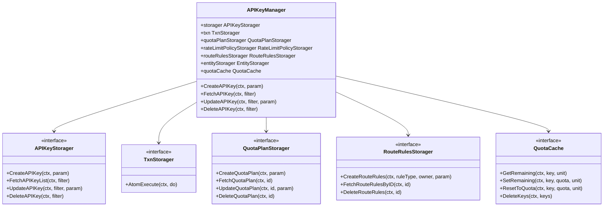

# 第二十七章 模型层实现：Manager 与 Storager 模式

## 本章目标

模型层（Model Layer）是 AI Gateway API 控制面的核心业务层，位于 `endpoints/` 接口层与 `storage/rdb/` 存储层之间，负责把 OpenAPI 的 HTTP 请求参数转化为可持久化、可校验、可导出的内部对象。它不仅要处理单个资源的增删改查，还要处理资源之间的引用关系、级联操作、事务一致性以及向数据面导出配置所需的格式转换。

通过阅读本章，你将了解：

- `ai-gateway-api/model/` 目录的组织方式与职责划分。
- `Param / Filter / Storager / Manager` 四层抽象如何隔离业务逻辑与持久化实现。
- `itxn.TxnStorager` 事务抽象与 `AtomExecute` 的用法，以及嵌套事务的复用机制。
- 跨包适配器模式（Adapter）如何解决不同子包接口签名不一致的问题。
- 典型 Manager（以 `APIKeyManager` 为例）如何编排参数校验、关联资源级联创建、Redis 缓存最终一致性同步等流程。
- `QuotaPlanManager` 如何在事务外完成跨资源的配额余额重置。

理解这些设计模式后，读者可以快速定位新增业务需求应该落在哪一层、应该遵循哪些约定，也能够为模型层编写符合既有风格的单元测试。

## 模型层目录结构

`ai-gateway-api/model/` 按业务域划分为若干子包，每个子包通常包含模型结构体、Param/Filter、Storager 接口和 Manager 实现。整体结构如下：

```text
model/
├── api_key/              # API-Key 模型与 Manager
├── entity/               # Entity / EntityType 模型与 Manager
├── quota/                # QuotaPlan、BalanceSync、Scheduler
├── rate_limit_policy/    # RateLimitPolicy 模型与 Manager
├── route_rules/          # Global/Entity/API-Key 路由规则
├── shared/               # 跨包共享类型与 Storager 接口
├── itxn/                 # 事务抽象接口
├── ibasic/               # 产品、BFE 集群、附加文件
├── icluster_conf/        # Cluster、SubCluster、Pool
├── iprovider/            # Provider 与模型发现
├── imodel_price/         # 模型定价
└── ...
```

> 完整目录与文件说明可参考 `ai-gateway-api/design-docs/sys-design/模型层设计文档.md` 的“模型包结构”一节。

模型层不直接依赖底层数据库，只依赖同包或 `model/shared` 中定义的 `XxxStorager` 接口；具体存储实现由 `storage/rdb/` 各子包提供，并在 `stateful/container/rdb/components.go` 中完成依赖注入。这种划分让业务逻辑与持久化实现解耦，也便于单元测试时手写 mock。

各个子包的职责可以概括为：

- `api_key`：管理调用方身份凭证，包括 API-Key 的生成、校验、级联的 QuotaPlan / RateLimitPolicy / RouteRules 生命周期。
- `entity`：管理多租户体系中的实体（Entity）与实体类型（EntityType），支持层级关系与继承式配额。
- `quota`：管理配额计划（QuotaPlan）、余额同步（BalanceSync）与定时重置调度（Scheduler）。
- `rate_limit_policy`：管理 RPM / TPM / 并发限流策略。
- `route_rules`：管理 Global / Entity / API-Key 三级 AI 路由规则。
- `shared`：提供跨包共享的 Param、Filter、Storager 接口，以及路由规则、配额余额等通用结构。
- `itxn`：提供最小化的事务抽象，是整个模型层一致性的基石。
- `icluster_conf` / `iprovider` / `imodel_price`：分别负责集群转发策略、Provider 接入能力、模型定价等与数据面导出密切相关的资源。

## Param / Filter / Storager / Manager 四层抽象

每个业务模型基本遵循四层结构，这是模型层最核心、最稳定的设计约定。

| 类型 | 说明 |
|------|------|
| `XxxParam` | 创建/更新入参，字段多为指针类型，用于区分“未传”与“零值”。 |
| `XxxFilter` | 查询条件，通常包含分页字段 `Page` / `PageSize`。 |
| `XxxStorager` | 定义持久化操作契约的接口。 |
| `XxxManager` | 业务逻辑实现，聚合 `itxn.TxnStorager` 与其它 `Storager`。 |

以 `model/api_key/api_key.go` 为例：

```go
type APIKeyParam struct {
    ID          *string    `json:"id"`
    Enable      *bool      `json:"enabled"`
    Key         *string    `json:"key"`
    Description *string    `json:"description,omitempty"`
    UnlimitedQuota *bool   `json:"unlimited_quota,omitempty"`
    ExpiredTime    *int64  `json:"expired_time,omitempty"`
    Models         []string `json:"models,omitempty"`
    Subnet         []string `json:"subnet,omitempty"`
    EntityID       *string  `json:"entity_id,omitempty"`
    QuotaPlanID       *int64 `json:"-"`
    RateLimitPolicyID *int64 `json:"-"`
    RouteRulesID      *int64 `json:"-"`
    ProductName       *string `json:"-"`
    InnerID           *int64  `json:"-"`
    RemainingQuota    *float64 `json:"remaining_quota,omitempty"`

    QuotaPlan       *shared.QuotaPlanParam       `json:"quota_plan,omitempty"`
    RateLimitPolicy *shared.RateLimitPolicyParam `json:"rate_limit_policy,omitempty"`
    RouteRules      *shared.RouteRulesParam      `json:"route_rules,omitempty"`
    Entity          *shared.EntitySummary        `json:"entity,omitempty"`
}

type APIKeyFilter struct {
    ProductName    *string
    ProductNames   []string
    ID             *string
    Key            *string
    InnerID        *int64
    QuotaPlanID    *int64
    RouteRulesID   *int64
    Page           *int
    PageSize       *int
    Enabled        *bool
    EntityID       *string
    UnlimitedQuota *bool
}

type APIKeyStorager interface {
    FetchAPIKeyList(ctx context.Context, filter *APIKeyFilter) ([]*APIKeyParam, error)
    CreateAPIKey(ctx context.Context, param *APIKeyParam) (int64, error)
    UpdateAPIKey(ctx context.Context, filter *APIKeyFilter, param *APIKeyParam) (int64, error)
    DeleteAPIKey(ctx context.Context, filter *APIKeyFilter) error
    CreateAPIKeyToken(ctx context.Context, param *APIKeyTokenParam) (int64, error)
    UpdateAPIKeyToken(ctx context.Context, filter *APIKeyTokenFilter, param *APIKeyTokenParam) error
    FetchAPIKeyTokenList(ctx context.Context, filter *APIKeyTokenFilter) ([]*APIKeyTokenParam, error)
}

type APIKeyManager struct {
    storager                APIKeyStorager
    txn                     itxn.TxnStorager
    quotaPlanStorager       QuotaPlanStorager
    rateLimitPolicyStorager RateLimitPolicyStorager
    routeRulesStorager      shared.RouteRulesStorager
    entityStorager          shared.EntityStorager
    quotaCache              quotacache.QuotaCache
}
```

函数命名与参数风格保持高度一致：

| 操作 | 命名 | 参数 | 返回值 |
|------|------|------|--------|
| 创建 | `CreateXxx(ctx, param)` | `context.Context, *XxxParam` | `(int64, error)` 或 `error` |
| 查询单条 | `FetchXxx(ctx, filter)` | `context.Context, *XxxFilter` | `(*Xxx, error)` |
| 查询列表 | `FetchXxxList(ctx, filter)` | `context.Context, *XxxFilter` | `([]*Xxx, error)` |
| 更新 | `UpdateXxx(ctx, filter, param)` | `context.Context, *XxxFilter, *XxxParam` | `(int64, error)` |
| 删除 | `DeleteXxx(ctx, filter)` | `context.Context, *XxxFilter` | `error` |

分页默认值一般为 `page=1, pageSize=20`，最大 100。统一的命名和参数风格让新增业务模型时可以快速套用模板，降低维护成本。

指针字段在 Param 与 Filter 中的使用尤其值得注意。以 `APIKeyParam.UnlimitedQuota *bool` 为例：若请求体未传该字段，指针为 `nil`，表示“保持原值不变”；若传入 `false`，则表示“显式设置为 false”。这种设计让更新操作天然支持部分字段更新，而不需要额外引入“字段掩码”（Field Mask）机制。

## itxn.TxnStorager 事务抽象与 AtomExecute

模型层所有需要保证原子性的业务操作都通过 `model/itxn/txn.go` 中定义的 `TxnStorager` 接口完成：

```go
// model/itxn/txn.go
package itxn

import "context"

type TxnStorager interface {
    AtomExecute(ctx context.Context, do func(context.Context) error) error
}
```

`AtomExecute` 接收一个 `context.Context` 和一个回调函数 `do`；`storage/rdb/txn/txn.go` 提供基于 `database/sql` 的实现：

```go
func (ps *RDBTxnStorager) AtomExecute(ctx context.Context, do func(context.Context) error) error {
    dbCtx, err := ps.dbCtxFactory(ctx, lib.OpenTxn())
    if err != nil {
        return err
    }
    return lib.RDBTxnExecute(dbCtx, do)
}
```

Manager 中的业务方法通常直接包裹在 `AtomExecute` 中。例如 `APIKeyManager.CreateAPIKey` 在 `model/api_key/api_key.go` 中：

```go
func (rppm *APIKeyManager) CreateAPIKey(ctx context.Context, param *APIKeyParam) (err error) {
    err = rppm.txn.AtomExecute(ctx, func(ctx context.Context) error {
        // 1. 生成或校验 ID
        // 2. 校验同产品下 ID 唯一
        // 3. 校验 Entity 存在
        // 4. 创建 QuotaPlan、RateLimitPolicy、RouteRules
        // 5. 写入 api_key 记录
        _, err = rppm.storager.CreateAPIKey(ctx, param)
        return err
    })
    if err != nil {
        return err
    }
    // 事务提交后同步 Redis 初始剩余量
    ...
}
```

若传入的 `ctx` 已经是 `*lib.DBContext`，工厂会复用同一事务，从而支持嵌套事务场景。例如，`APIKeyManager.CreateAPIKey` 在 `AtomExecute` 回调内调用 `quotaPlanStorager.CreateQuotaPlan`，后者内部如果也调用了 `AtomExecute`，由于上下文已经携带了事务标记，不会开启新事务，而是复用外层事务。这种机制让 Manager 可以像调用普通函数一样组合其他 Manager/Storager，同时保持整体原子性。

模型层因此无需关心事务的开启、提交与回滚，只需把需要在同一原子单元内执行的步骤放进 `AtomExecute` 回调即可。这也使得单元测试变得简单：测试代码可以注入一个 mock 的 `TxnStorager`，让 `AtomExecute` 直接执行回调函数，从而在不连数据库的情况下验证业务逻辑。

## 跨包适配器模式

不同子包往往会定义自己专属的 Storager 接口，但接口签名与 `model/shared` 中定义的通用接口并不完全一致。为了避免 Manager 直接依赖其它子包的具体类型，模型层大量使用适配器模式（Adapter）。

例如，`model/entity/entity_manager.go` 定义了 `entityStoragerAdapter`，把 `entity.EntityStorager` 适配为 `shared.EntityStorager`：

```go
// model/entity/entity_manager.go
type entityStoragerAdapter struct {
    entityStorager EntityStorager
}

func NewEntityStoragerAdapter(entityStorager EntityStorager) shared.EntityStorager {
    return &entityStoragerAdapter{entityStorager: entityStorager}
}

func (a *entityStoragerAdapter) FetchEntity(ctx context.Context, filter *shared.EntityFilter) (*shared.EntitySummary, error) {
    entity, err := a.entityStorager.FetchEntity(ctx, &EntityFilter{
        EntityID: filter.EntityID,
        Name:     filter.Name,
        Type:     filter.Type,
        ParentID: filter.ParentID,
    })
    if err != nil {
        return nil, err
    }
    if entity == nil {
        return nil, nil
    }
    return &shared.EntitySummary{
        ID:   entity.EntityID,
        Name: entity.Name,
        Type: entity.Type,
    }, nil
}
```

`model/quota/adapters.go` 则进一步封装了 backward-compatible 的工厂函数：

```go
// model/quota/adapters.go
func NewEntityStoragerAdapter(entityStorager entity.EntityStorager) shared.EntityStorager {
    return entity.NewEntityStoragerAdapter(entityStorager)
}

func NewRateLimitPolicyStoragerAdapter(storager rate_limit_policy.RateLimitPolicyStorager) shared.RateLimitPolicyStorager {
    return rate_limit_policy.NewRateLimitPolicyStoragerAdapter(storager)
}
```

在 `stateful/container/rdb/components.go` 的依赖注入中可以看到这些适配器的实际用法：

```go
container.APIKeyManager = api_key.NewAPIKeyManager(
    container.TxnStoragerSingleton,
    container.APIKeyStorager,
    quota.NewQuotaPlanStoragerAdapter(container.QuotaPlanStorager),
    quota.NewRateLimitPolicyStoragerAdapter(container.RateLimitPolicyStorager),
    container.RouteRulesStorager,
    quota.NewEntityStoragerAdapter(container.EntityStorager),
    container.QuotaCacheSingleton,
)
```

适配器模式的好处在于：`APIKeyManager` 只依赖 `shared.EntityStorager`、`shared.QuotaPlanStorager` 等通用接口，而具体实现既可以是真实的 RDB Storager，也可以是单测中的 mock 对象，真正实现了面向接口编程。

如果没有适配器，`APIKeyManager` 将不得不直接依赖 `entity.EntityStorager` 或 `quota.QuotaPlanStorager` 的具体签名。一旦这些子包的接口因业务需要调整，所有引用方都要同步修改。适配器把变化隔离在 `model/shared` 与对应子包之间，Manager 侧保持稳定。

## 典型 Manager 实现分析：APIKeyManager

`APIKeyManager` 是模型层中最具代表性的 Manager 之一，因为它同时涉及参数校验、关联资源级联创建、事务一致性、Redis 缓存最终一致性等多重关注点。下面按创建、查询、删除三个主流程展开。

### 类关系与调用链

下图展示了 `APIKeyManager` 与周边组件的关系：



### 创建 API-Key：级联资源与事务编排

`CreateAPIKey` 在 `model/api_key/api_key.go` 中的核心流程如下：

```go
func (rppm *APIKeyManager) CreateAPIKey(ctx context.Context, param *APIKeyParam) (err error) {
    err = rppm.txn.AtomExecute(ctx, func(ctx context.Context) error {
        // 1. 若未传入 ID，则生成 UUID
        if param.ID == nil || *param.ID == "" {
            id := uuid.New().String()
            param.ID = &id
        }

        // 2. 校验同产品下 ID 是否重复
        list, err := rppm.storager.FetchAPIKeyList(ctx, &APIKeyFilter{
            ID:          param.ID,
            ProductName: param.ProductName,
        })
        if err != nil {
            return err
        }
        if len(list) > 0 {
            return xerror.WrapParamErrorWithMsg(fmt.Sprintf("Duplicate id with product:%s", *param.ProductName))
        }

        // 3. 验证 Entity（如果指定）
        if param.EntityID != nil && *param.EntityID != "" && rppm.entityStorager != nil {
            entity, err := rppm.entityStorager.FetchEntity(ctx, &shared.EntityFilter{EntityID: param.EntityID})
            if err != nil {
                return err
            }
            if entity == nil {
                return xerror.WrapParamErrorWithMsg(fmt.Sprintf("Entity not found: %s", *param.EntityID))
            }
        }

        // 4. 校验 API-Key 值全局唯一
        if param.Key != nil && *param.Key != "" {
            existingKeys, err := rppm.storager.FetchAPIKeyList(ctx, &APIKeyFilter{Key: param.Key})
            if err != nil {
                return err
            }
            if len(existingKeys) > 0 {
                return xerror.WrapParamErrorWithMsg("API-Key value %s already exists", *param.Key)
            }
        }

        // 5. 创建 QuotaPlan（如果有）
        if param.QuotaPlan != nil && rppm.quotaPlanStorager != nil {
            quotaPlanID, err := rppm.quotaPlanStorager.CreateQuotaPlan(ctx, param.QuotaPlan)
            if err != nil {
                return err
            }
            param.QuotaPlanID = &quotaPlanID
        }

        // 6. 创建 RateLimitPolicy（如果有）
        if param.RateLimitPolicy != nil && rppm.rateLimitPolicyStorager != nil {
            rateLimitPolicyID, err := rppm.rateLimitPolicyStorager.CreateRateLimitPolicy(ctx, param.RateLimitPolicy)
            if err != nil {
                return err
            }
            param.RateLimitPolicyID = &rateLimitPolicyID
        }

        // 7. 创建 RouteRules（如果有）
        if param.RouteRules != nil && rppm.routeRulesStorager != nil {
            routeRulesID, err := rppm.routeRulesStorager.CreateRouteRules(
                ctx, shared.RouteRulesTypeAPIKey, param.ID, param.RouteRules)
            if err != nil {
                return err
            }
            param.RouteRulesID = &routeRulesID
        }

        // 8. 写入 api_key 记录
        _, err = rppm.storager.CreateAPIKey(ctx, param)
        return err
    })
    if err != nil {
        return err
    }

    // 9. 事务外同步 Redis 初始剩余量（最终一致）
    if param.Key != nil && param.QuotaPlan != nil &&
        (param.QuotaPlan.Unlimited == nil || !*param.QuotaPlan.Unlimited) &&
        param.QuotaPlan.Quota != nil && rppm.quotaCache != nil {
        if cacheErr := rppm.quotaCache.SetRemaining(ctx, *param.Key, param.QuotaPlan.Quota, param.QuotaPlan.Unit); cacheErr != nil {
            stateful.AccessLogger.Warn("failed to set quota cache for api_key %s: %v", *param.Key, cacheErr)
        }
    }
    return nil
}
```

该流程体现了模型层的几个重要约定：

1. **参数校验放在事务内**：ID 唯一性、Entity 存在性、API-Key 全局唯一性等校验与写入处于同一事务，避免并发下的竞态条件。若校验放在事务外，可能出现两个并发请求同时通过校验后都写入成功的情况。
2. **关联资源级联创建**：QuotaPlan、RateLimitPolicy、RouteRules 等子资源在事务内按需创建，并把返回的 ID 回填到 `param` 中，最后统一写入 `api_key` 记录。任何一步失败都会触发整体回滚，避免留下“半创建”的脏数据。
3. **Redis 操作在事务外**：配额初始剩余量通过 `quotaCache.SetRemaining` 写入 Redis，失败只记录日志，不影响已提交的 DB 结果。这种“最终一致”策略避免了把 Redis 纳入分布式事务带来的复杂度，也符合配额缓存“可重建”的特性——即使 Redis 写入失败，后续查询时仍可基于 DB 配额重新初始化缓存。

### 查询 API-Key：关联数据填充与实时余额

`FetchAPIKeyList` 先读取主数据，再通过 `populateAssociatedData` 依次填充 QuotaPlan、RateLimitPolicy、RouteRules、Entity，最后在事务外批量读取 Redis 实时余额：

```go
func (rppm *APIKeyManager) FetchAPIKeyList(ctx context.Context,
    filter *APIKeyFilter) (list []*APIKeyParam, err error) {
    err = rppm.txn.AtomExecute(ctx, func(ctx context.Context) error {
        list, err = rppm.storager.FetchAPIKeyList(ctx, filter)
        if err != nil {
            return err
        }
        for _, one := range list {
            if err := rppm.populateAssociatedData(ctx, one); err != nil {
                return err
            }
        }
        return nil
    })
    if err != nil {
        return nil, err
    }

    // 事务外批量从 Redis 读取实时余额
    if err := rppm.populateQuotaBalances(ctx, list); err != nil {
        stateful.AccessLogger.Warn("failed to populate quota balances for api key list: %v", err)
    }
    return
}
```

`populateQuotaBalances` 会按 `unit` 对 key 分组，调用 `quotaCache.BatchGetRemaining` 批量获取剩余量，再填充到 `quotaPlan.Balance` 中。这样既保证了接口响应速度，又把 Redis 失败的影响控制在“余额展示不准确”这一可接受范围内。

值得注意的是，实时余额并不是从 DB 的 `quota_plan.quota` 直接减去已用量，而是把 Redis 中的剩余量作为权威来源。数据面（BFE）在每次请求后通过 Redis 扣减配额，控制面则读取 Redis 展示最新余额，二者天然保持一致。

### 删除 API-Key：级联清理与 Redis 回收

`DeleteAPIKey` 在事务内查询待删除记录，然后按 QuotaPlan、RateLimitPolicy、RouteRules 的顺序级联删除，最后删除 `api_key` 记录；事务提交后再清理 Redis Key：

```go
func (rppm *APIKeyManager) DeleteAPIKey(ctx context.Context, filter *APIKeyFilter) error {
    var quotaKey string
    err := rppm.txn.AtomExecute(ctx, func(ctx context.Context) error {
        list, err := rppm.storager.FetchAPIKeyList(ctx, filter)
        if err != nil {
            return err
        }
        if len(list) == 0 {
            return xerror.WrapRecordNotExist("APIKey")
        }
        one := list[0]
        if one.Key != nil {
            quotaKey = *one.Key
        }
        if one.QuotaPlanID != nil && rppm.quotaPlanStorager != nil {
            if err := rppm.quotaPlanStorager.DeleteQuotaPlan(ctx, *one.QuotaPlanID); err != nil {
                return err
            }
        }
        if one.RateLimitPolicyID != nil && rppm.rateLimitPolicyStorager != nil {
            if err := rppm.rateLimitPolicyStorager.DeleteRateLimitPolicy(ctx, *one.RateLimitPolicyID); err != nil {
                return err
            }
        }
        if one.RouteRulesID != nil && rppm.routeRulesStorager != nil {
            if err := rppm.routeRulesStorager.DeleteRouteRules(ctx, *one.RouteRulesID); err != nil {
                return err
            }
        }
        return rppm.storager.DeleteAPIKey(ctx, filter)
    })
    if err != nil {
        return err
    }

    // 事务提交成功后清理 Redis
    rppm.cleanupRedisKeys(ctx, quotaKey, nil)
    return nil
}
```

删除流程同样遵循“DB 事务内级联、事务外清缓存”的原则。先删子资源再删父资源，可以保证外键或逻辑引用在事务提交前全部解除；Redis 清理失败不会导致 DB 回滚，因为即使缓存残留，也只会短暂影响已删除 key 的配额判断，最终会因过期或重新创建同名 key 而自然恢复。

## 业务逻辑编排示例：QuotaPlan 重置

`QuotaPlanManager.ResetBalance` 展示了更复杂的跨资源编排：它需要在事务内更新 `quota_plans` 表，然后在事务外把所有引用该计划的 API-Key 与 Entity 的 Redis 剩余量重置为新的配额总量。

```go
// model/quota/quota_plan_manager.go
func (m *QuotaPlanManager) ResetBalance(ctx context.Context, planID int64, newQuota *float64, updateLastResetAt bool) error {
    var resetQuota *float64
    var planUnit *string

    err := m.txn.AtomExecute(ctx, func(ctx context.Context) error {
        plan, err := m.storager.FetchQuotaPlan(ctx, &QuotaPlanFilter{ID: &planID})
        if err != nil {
            return err
        }
        if plan == nil {
            return fmt.Errorf("quota_plan not found")
        }
        if plan.Unlimited != nil && *plan.Unlimited {
            return fmt.Errorf("cannot reset balance for unlimited quota")
        }

        resetQuota = plan.Quota
        if newQuota != nil {
            resetQuota = newQuota
            _, err = m.storager.UpdateQuotaPlan(ctx, &QuotaPlanFilter{ID: &planID}, &QuotaPlanParam{Quota: resetQuota})
            if err != nil {
                return err
            }
        }
        planUnit = plan.Unit

        if updateLastResetAt {
            now := time.Now()
            _, err = m.storager.UpdateQuotaPlan(ctx, &QuotaPlanFilter{ID: &planID}, &QuotaPlanParam{LastResetAt: &now})
            if err != nil {
                return err
            }
        }
        return nil
    })
    if err != nil {
        return err
    }

    // 事务外批量重置 Redis
    if m.quotaCache == nil || resetQuota == nil {
        return nil
    }
    apiKeys, err := m.apiKeyStorager.FetchAPIKeyList(ctx, &api_key.APIKeyFilter{QuotaPlanID: &planID})
    if err != nil {
        stateful.AccessLogger.Warn("failed to fetch api keys for quota plan %d: %v", planID, err)
        return nil
    }
    for _, apiKey := range apiKeys {
        if apiKey.Key == nil {
            continue
        }
        if cacheErr := m.quotaCache.ResetToQuota(ctx, *apiKey.Key, resetQuota, planUnit); cacheErr != nil {
            stateful.AccessLogger.Warn("failed to reset quota cache for api_key %s: %v", *apiKey.Key, cacheErr)
        }
    }

    if m.entityStorager != nil {
        entities, err := m.entityStorager.FetchEntityList(ctx, &entity.EntityFilter{QuotaPlanID: &planID})
        if err != nil {
            stateful.AccessLogger.Warn("failed to fetch entities for quota plan %d: %v", planID, err)
            return nil
        }
        for _, ent := range entities {
            if ent.EntityID == nil {
                continue
            }
            if cacheErr := m.quotaCache.ResetToQuota(ctx, *ent.EntityID, resetQuota, planUnit); cacheErr != nil {
                stateful.AccessLogger.Warn("failed to reset quota cache for entity %s: %v", *ent.EntityID, cacheErr)
            }
        }
    }
    return nil
}
```

这里的关键设计是：

- `updateLastResetAt` 参数区分“定时调度重置”与“手动重置”两种场景，避免手动重置干扰下一次定时判断。`BalanceSyncManager` 在定时调度时传入 `true`，而 OpenAPI 手动重置接口传入 `false`。
- Redis 重置在事务外异步完成，即使部分 key 失败也不回滚 DB，保证核心状态正确；失败通过日志与监控兜底。

除了 `ResetBalance`，`QuotaPlanManager` 还提供了 `ApplyQuotaPlanChange`，用于在 API-Key 或 Entity 更新配额计划时，仅在 `quota`、`unit`、`unlimited` 发生变化的情况下调整 Redis 余额，避免普通属性修改导致配额使用量被清零。该方法的实现同样遵循“先判断差异、再按需调整”的保守策略，体现了模型层对数据一致性的谨慎处理。

## 关键代码片段

### 1. 事务抽象接口

```go
// ai-gateway-api/model/itxn/txn.go
type TxnStorager interface {
    AtomExecute(ctx context.Context, do func(context.Context) error) error
}
```

### 2. Manager 构造函数与依赖注入

```go
// ai-gateway-api/model/api_key/api_key.go
func NewAPIKeyManager(txn itxn.TxnStorager, storager APIKeyStorager,
    quotaPlanStorager QuotaPlanStorager, rateLimitPolicyStorager RateLimitPolicyStorager,
    routeRulesStorager shared.RouteRulesStorager, entityStorager shared.EntityStorager,
    quotaCache quotacache.QuotaCache) *APIKeyManager {
    return &APIKeyManager{
        txn:                     txn,
        storager:                storager,
        quotaPlanStorager:       quotaPlanStorager,
        rateLimitPolicyStorager: rateLimitPolicyStorager,
        routeRulesStorager:      routeRulesStorager,
        entityStorager:          entityStorager,
        quotaCache:              quotaCache,
    }
}
```

### 3. 跨包适配器

```go
// ai-gateway-api/model/entity/entity_manager.go
type entityStoragerAdapter struct {
    entityStorager EntityStorager
}

func NewEntityStoragerAdapter(entityStorager EntityStorager) shared.EntityStorager {
    return &entityStoragerAdapter{entityStorager: entityStorager}
}
```

### 4. 最终一致性的 Redis 配额同步

```go
// ai-gateway-api/model/api_key/api_key.go
if param.Key != nil && param.QuotaPlan != nil &&
    (param.QuotaPlan.Unlimited == nil || !*param.QuotaPlan.Unlimited) &&
    param.QuotaPlan.Quota != nil && rppm.quotaCache != nil {
    if cacheErr := rppm.quotaCache.SetRemaining(ctx, *param.Key, param.QuotaPlan.Quota, param.QuotaPlan.Unit); cacheErr != nil {
        stateful.AccessLogger.Warn("failed to set quota cache for api_key %s: %v", *param.Key, cacheErr)
    }
}
```

## 本章小结

本章介绍了壬远 AI 网关模型层的 Manager 与 Storager 模式：

1. **四层抽象**：`Param / Filter / Storager / Manager` 构成模型层的基本单元，统一了命名、参数和返回值风格。Param 使用指针字段区分“未传”与“零值”，Filter 承载查询与分页条件，Storager 定义持久化契约，Manager 负责业务编排。
2. **事务管理**：通过 `itxn.TxnStorager.AtomExecute` 把业务操作包裹在同一数据库事务中，支持嵌套事务复用。模型层无需直接处理 `BEGIN/COMMIT/ROLLBACK`，只需把原子步骤放入回调。
3. **适配器模式**：`NewXxxStoragerAdapter` 把各子包的具体 Storager 适配为 `model/shared` 中的通用接口，降低 Manager 之间的耦合，也让单元测试更容易 mock。
4. **典型实现**：`APIKeyManager` 展示了参数校验、关联资源级联创建、事务编排、Redis 最终一致性同步的完整流程。创建时先校验再级联创建子资源，查询时填充关联数据并在事务外读取实时余额，删除时先级联清理子资源再回收 Redis Key。
5. **最终一致性**：Redis 配额缓存的写入/删除/重置放在事务外，失败只记录日志，避免引入分布式事务的复杂度。配额缓存本身可基于 DB 重建，因此短暂不一致是可接受的。

模型层通过接口隔离与依赖注入，既保证了业务逻辑的内聚性，又为单元测试和后续扩展提供了清晰的边界。开发者在新增业务模型时，只需按照四层抽象补齐 Param、Filter、Storager、Manager，并通过 `AtomExecute` 编排事务，即可快速融入现有体系。

## 参考文档

- `ai-gateway-api/design-docs/sys-design/模型层设计文档.md`
- `ai-gateway-api/model/itxn/txn.go`
- `ai-gateway-api/model/api_key/api_key.go`
- `ai-gateway-api/model/entity/entity_manager.go`
- `ai-gateway-api/model/entity/entity.go`
- `ai-gateway-api/model/quota/quota_plan_manager.go`
- `ai-gateway-api/model/quota/adapters.go`
- `ai-gateway-api/model/shared/types.go`
- `ai-gateway-api/stateful/container/rdb/components.go`
