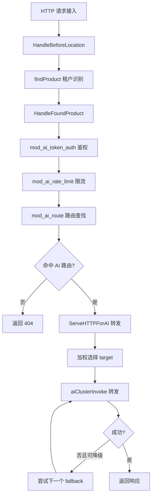
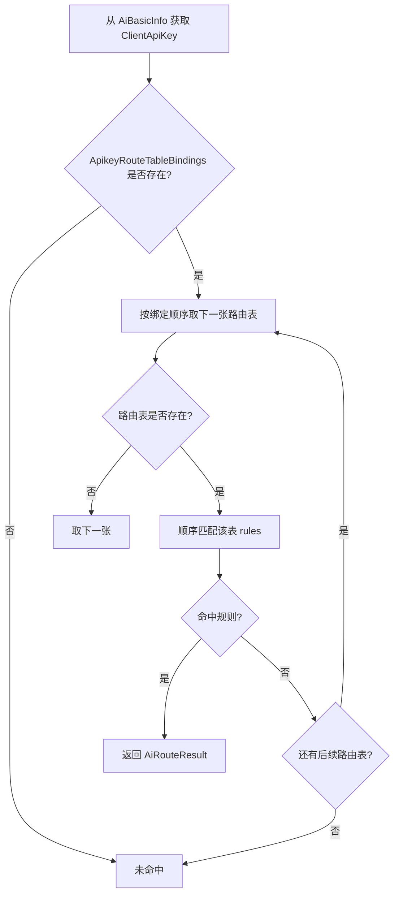

# 第二十九章 AI 路由模块实现：mod_ai_route

## 本章目标

本章聚焦壬远 AI 网关数据面中负责“把请求转发到哪里去”的模块——`mod_ai_route`。通过阅读本章，读者将能够：

- 理解 `mod_ai_route` 在 BFE 模块链中的职责与位置；
- 掌握模块配置、路由规则数据文件以及热加载机制；
- 理解 **apikey → entity → global** 三级路由表的匹配逻辑；
- 了解 `targets` 加权选择与 `fallbacks` 降级流程的实现方式；
- 理解 `mod_ai_route` 与 `mod_ai_token_auth` 在请求上下文上的协作关系；
- 熟悉模块暴露的监控指标。

## mod_ai_route 模块职责

`mod_ai_route` 是壬远 AI 网关数据面的核心路由模块，注册在 BFE 的 `HandleFoundProduct` 回调点。它的职责可概括为：

1. **根据 API-Key 查找路由表**：从请求上下文中取出已由 `mod_ai_token_auth` 解析出的 `ClientApiKey`，作为路由查找的入口键；
2. **三级路由匹配**：按 `apikey` 路由表、`entity` 路由表、`global` 路由表的顺序依次匹配条件表达式；
3. **返回完整转发意图**：命中后返回 `AiRouteResult`，其中包含加权目标列表 `Targets` 与降级列表 `Fallbacks`；
4. **与转发层解耦**：仅负责“查找并写入上下文”，真正的 target 选择、模型覆盖、fallback 重试由 `bfe_server/reverseproxy.go` 中的 `ServeHTTPForAI()` 完成。

相比传统 BFE 路由返回单个 `ClusterName`，AI 网关路由需要返回一组候选目标，并在后端失败时进行降级，因此 `mod_ai_route` 采用了新的数据结构 `AiRouteResult` 来承载转发意图。

## 模块初始化与配置加载

### 模块配置文件

`mod_ai_route` 的模块配置文件为 `conf/mod_ai_route/mod_ai_route.conf`，由 `bfe/bfe_modules/mod_ai_route/conf_load.go` 解析：

```ini
[basic]
RouteRulePath = ../conf/mod_ai_route/ai_route.data

[log]
OpenDebug = false
```

核心字段含义如下：

| 字段 | 说明 |
|------|------|
| `RouteRulePath` | AI 路由规则数据文件路径，支持相对 `conf_root` 的路径。 |
| `OpenDebug` | 是否输出调试日志。 |

`ConfModAiRoute` 结构体与加载逻辑如下（`bfe/bfe_modules/mod_ai_route/conf_load.go`）：

```go
type ConfModAiRoute struct {
	Basic struct {
		RouteRulePath string // path for ai route rule
	}
	Log struct {
		OpenDebug bool
	}
}

func ConfLoad(filePath string, confRoot string) (*ConfModAiRoute, error) {
	var cfg ConfModAiRoute
	if err := gcfg.ReadFileInto(&cfg, filePath); err != nil {
		return &cfg, err
	}
	if err := cfg.Check(confRoot); err != nil {
		return &cfg, err
	}
	return &cfg, nil
}
```

### 路由数据文件

真正的路由规则存放在 `conf/mod_ai_route/ai_route.data` 中，格式为 JSON。该文件由 `bfe/bfe_modules/mod_ai_route/data_load.go` 负责加载并转换为运行时结构（`bfe/bfe_modules/mod_ai_route/route_rule.go`）。

一个最小示例如下：

```json
{
    "Version": "20260720150000",
    "route_rules": {
        "apikey_ak_user_a": {
            "type": "apikey",
            "owner": "ak_user_a",
            "rules": [
                {
                    "name": "user_a-rule1",
                    "Cond": "req_host_in(\"api.example.org\")",
                    "targets": [
                        { "ClusterName": "cluster_deepseek_a", "Model": "deepseek-v4-pro", "Weight": 70 },
                        { "ClusterName": "cluster_deepseek_b", "Model": "deepseek-v4-pro", "Weight": 30 }
                    ],
                    "fallbacks": [
                        { "ClusterName": "cluster_deepseek_c", "Model": "deepseek-v3.2" }
                    ]
                }
            ]
        },
        "entity_dept_ai": {
            "type": "entity",
            "owner": "dept_ai",
            "rules": [
                {
                    "name": "dept_ai-default",
                    "Cond": "default_t()",
                    "targets": [
                        { "ClusterName": "cluster_dept_ai", "Model": "", "Weight": 100 }
                    ],
                    "fallbacks": []
                }
            ]
        },
        "global_default": {
            "type": "global",
            "owner": "global",
            "rules": [
                {
                    "name": "global-default",
                    "Cond": "default_t()",
                    "targets": [
                        { "ClusterName": "cluster_global", "Model": "", "Weight": 100 }
                    ],
                    "fallbacks": []
                }
            ]
        }
    },
    "ApikeyRouteTableBindings": {
        "ak_user_a": [
            "apikey_ak_user_a",
            "entity_dept_ai",
            "global_default"
        ]
    }
}
```

字段说明：

- `route_rules`：路由表集合，key 通常命名为 `<type>_<owner>`；
- `type`：路由表类型，取值为 `apikey`、`entity`、`global`；
- `rules`：规则列表，按顺序匹配；
- `Cond`：BFE 条件表达式，例如 `req_host_in(...)`、`default_t()`；
- `targets`：命中后的转发目标列表，权重之和必须等于 100；
- `fallbacks`：可选的降级目标列表；
- `ApikeyRouteTableBindings`：API-Key 到路由表查找顺序的映射。

### DTO 与运行时结构转换

`route_rule.go` 同时定义了 JSON DTO 与运行时结构。DTO 用于反序列化配置文件，运行时结构则去掉了 JSON 标签，并把条件字符串编译为 `condition.Condition`，避免每次请求重复解析。

```go
// JSON DTO
type AiRouteDataFile struct {
	Version                  string                    `json:"Version"`
	RouteRules               map[string]RouteTableFile `json:"route_rules"`
	ApikeyRouteTableBindings map[string][]string       `json:"ApikeyRouteTableBindings"`
}

// 运行时结构
type AiRouteData struct {
	Version                  string
	RouteRules               map[string]RouteTable
	ApikeyRouteTableBindings map[string][]string
}
```

为了兼容控制面下发的字段命名差异，`AiRouteDataFile.UnmarshalJSON` 同时接受 `route_rules` 与 `RouteRules`，并把历史别名 `api_key` 规范化为 `apikey`：

```go
func (f *AiRouteDataFile) UnmarshalJSON(data []byte) error {
	type rawFile AiRouteDataFile
	raw := &struct {
		*rawFile
		RouteRulesUpper map[string]RouteTableFile `json:"RouteRules"`
	}{
		rawFile: (*rawFile)(f),
	}

	if err := json.Unmarshal(data, raw); err != nil {
		return err
	}

	if f.RouteRules == nil && raw.RouteRulesUpper != nil {
		f.RouteRules = raw.RouteRulesUpper
	}

	for key, table := range f.RouteRules {
		if table.Type == "api_key" {
			table.Type = RouteTypeApikey
		}
		f.RouteRules[key] = table
	}

	return nil
}
```

`data_load.go` 负责把 DTO 转换为运行时结构：

```go
func AiRouteDataLoad(fileName string) (*AiRouteData, error) {
	var file AiRouteDataFile

	if err := bfe_util.LoadJsonFile(fileName, &file); err != nil {
		return nil, fmt.Errorf("LoadJsonFile(): err[%s]", err.Error())
	}

	data := &AiRouteData{
		Version:                  file.Version,
		RouteRules:               make(map[string]RouteTable, len(file.RouteRules)),
		ApikeyRouteTableBindings: file.ApikeyRouteTableBindings,
	}

	for key, tableFile := range file.RouteRules {
		rules := make([]RouteRule, len(tableFile.Rules))
		for i, ruleFile := range tableFile.Rules {
			rules[i] = RouteRule{
				Name:      ruleFile.Name,
				CondStr:   ruleFile.Cond,
				Targets:   ruleFile.Targets,
				Fallbacks: ruleFile.Fallbacks,
			}
		}
		data.RouteRules[key] = RouteTable{
			Type:  tableFile.Type,
			Owner: tableFile.Owner,
			Rules: rules,
		}
	}

	return data, nil
}
```

这种分层设计让配置格式演进（例如新增字段、字段改名）对运行时逻辑的影响降到最低。

### 启动与热加载

模块初始化入口位于 `bfe/bfe_modules/mod_ai_route/mod_ai_route.go` 中的 `Init()` 方法：

```go
func (m *ModuleAiRoute) Init(cbs *bfe_module.BfeCallbacks, whs *web_monitor.WebHandlers, cr string) error {
	confPath := bfe_module.ModConfPath(cr, m.name)
	var err error
	if m.conf, err = ConfLoad(confPath, cr); err != nil {
		return fmt.Errorf("%s: conf load err %v", m.name, err)
	}
	openDebug = m.conf.Log.OpenDebug

	if err := m.loadRouteRuleConf(nil); err != nil {
		return fmt.Errorf("%s: loadRouteRuleConf err %v", m.name, err)
	}

	if err := cbs.AddFilter(bfe_module.HandleFoundProduct, m.routeFoundProductHandler); err != nil {
		return fmt.Errorf("%s.Init(): AddFilter(routeFoundProductHandler): %s", m.name, err.Error())
	}

	monitorHandlers := map[string]interface{}{
		m.name: m.getState,
	}
	if err := web_monitor.RegisterHandlers(whs, web_monitor.WebHandleMonitor, monitorHandlers); err != nil {
		return fmt.Errorf("%s.Init(): RegisterHandlers(monitor): %v", m.name, err)
	}

	reloadHandlers := map[string]interface{}{
		m.name: m.loadRouteRuleConf,
	}
	if err := web_monitor.RegisterHandlers(whs, web_monitor.WebHandleReload, reloadHandlers); err != nil {
		return fmt.Errorf("%s.Init(): RegisterHandlers(reload): %v", m.name, err)
	}

	return nil
}
```

`Init()` 完成以下工作：

1. 加载 `mod_ai_route.conf`；
2. 调用 `loadRouteRuleConf()` 加载 `ai_route.data`；
3. 在 `HandleFoundProduct` 回调点注册 `routeFoundProductHandler`；
4. 注册监控查看接口与热加载接口（`/reload/mod_ai_route`）。

热加载时，`loadRouteRuleConf()` 会重新读取规则文件，校验通过后再原子替换内存中的路由表，失败不会影响当前运行中的规则。

### 热加载的原子性

`AiRouteTable.Update()` 的加锁策略值得注意：

```go
func (t *AiRouteTable) Update(data *AiRouteData) error {
	// validate and compile conditions (outside the lock)
	rules := make(map[string]*RouteTable)
	for key, table := range data.RouteRules {
		if err := ValidateRouteTable(&table); err != nil {
			return fmt.Errorf("validate route table[%s] err: %s", key, err)
		}
		tableCopy := table
		rules[key] = &tableCopy
	}

	// only lock when swapping the atomic references
	t.lock.Lock()
	t.routeRules = rules
	t.bindings = data.ApikeyRouteTableBindings
	t.lock.Unlock()

	return nil
}
```

条件表达式编译属于 CPU 密集型操作，若放在写锁内执行，会导致热加载期间所有路由查找被阻塞。`Update()` 先在校验阶段完成全部编译，再持写锁进行指针替换，因此热加载对请求处理的影响被降到最低。即使校验失败，原内存中的路由表也不会被修改。

## AI 路由查找逻辑

### 请求上下文传递

`mod_ai_route` 本身不解析请求头中的 API-Key，而是依赖上游模块把结果写入请求上下文。关键上下文结构定义在 `bfe/bfe_basic/request_ai_route.go` 中：

```go
const CtxAiRouteResult = "__REQ_AI_ROUTE_RESULT"

type AiRouteResult struct {
	RouteType string // apikey / entity / global
	Owner     string // route table owner
	RuleName  string // hit rule name
	Targets   []AiRouteTarget
	Fallbacks []AiRouteFallback
}

type AiRouteTarget struct {
	ClusterName string
	Model       string
	Weight      int
}

type AiRouteFallback struct {
	ClusterName string
	Model       string
}
```

`Request` 提供 `SetAiRouteResult()` 与 `GetAiRouteResult()` 方法，用于在模块与转发层之间传递结果。

### routeFoundProductHandler

`bfe/bfe_modules/mod_ai_route/mod_ai_route.go` 中的 `routeFoundProductHandler` 是模块的核心回调：

```go
func (m *ModuleAiRoute) routeFoundProductHandler(req *bfe_basic.Request) (int, *bfe_http.Response) {
	m.state.ReqTotal.Inc(1)

	aiMeta := req.GetAiBasicInfo()
	if aiMeta == nil {
		return bfe_module.BfeHandlerGoOn, nil
	}

	apiKey := aiMeta.ClientApiKey
	if apiKey == "" {
		if openDebug {
			log.Logger.Debug("%s: api key empty, skip", m.name)
		}
		return bfe_module.BfeHandlerGoOn, nil
	}

	result := m.routeTable.Search(apiKey, req)
	if result == nil {
		m.state.ReqMiss.Inc(1)
		if openDebug {
			log.Logger.Debug("%s: no route hit for apiKey[%s]", m.name, apiKey)
		}
		return bfe_module.BfeHandlerGoOn, nil
	}

	switch result.RouteType {
	case RouteTypeApikey:
		m.state.ReqHitApikey.Inc(1)
	case RouteTypeEntity:
		m.state.ReqHitEntity.Inc(1)
	case RouteTypeGlobal:
		m.state.ReqHitGlobal.Inc(1)
	}

	req.SetAiRouteResult(result)

	return bfe_module.BfeHandlerGoOn, nil
}
```

执行流程：

1. 请求总数 `ReqTotal` 加一；
2. 从上下文中取出 `AiBasicInfo`，若不存在则跳过；
3. 若 `ClientApiKey` 为空，说明上游鉴权未通过或不是 AI 请求，直接跳过；
4. 调用 `routeTable.Search(apiKey, req)` 查找路由；
5. 若未命中，`ReqMiss` 加一并放行；
6. 命中后根据路由表类型分别计数，并把 `AiRouteResult` 写入请求上下文。

该回调始终返回 `BfeHandlerGoOn`，不直接构造响应；是否返回 404 由后续的 `ServeHTTPForAI()` 根据 `AiRouteResult` 是否存在决定。

## 三级路由表匹配（apikey、entity、global）

### ApikeyRouteTableBindings

三级路由的核心组织方式体现在 `ApikeyRouteTableBindings` 字段：每个 API-Key 绑定一个有序的路由表 key 列表。`mod_ai_route` 严格按该顺序查找，而不是按路由表类型隐式排序。

例如：

```json
"ApikeyRouteTableBindings": {
    "ak_user_a": [
        "apikey_ak_user_a",
        "entity_dept_ai",
        "global_default"
    ],
    "ak_user_b": [
        "entity_dept_ai",
        "global_default"
    ]
}
```

`ak_user_a` 优先查找自己的 `apikey` 级规则；未命中则回退到所属 `entity` 的规则；最后使用 `global` 兜底。`ak_user_b` 没有专属 `apikey` 规则，直接从 `entity` 开始。

### AiRouteTable.Search

`bfe/bfe_modules/mod_ai_route/route_table.go` 实现了路由表的内存结构与查找：

```go
type AiRouteTable struct {
	lock sync.RWMutex

	// routeRules key: route table key (<type>_<owner>)
	// routeRules value: pointer to the route table
	routeRules map[string]*RouteTable

	// bindings key: API-Key string
	// bindings value: ordered list of route table keys to search
	bindings map[string][]string
}

func (t *AiRouteTable) Search(apiKey string, req *bfe_basic.Request) *bfe_basic.AiRouteResult {
	t.lock.RLock()

	tableKeys, ok := t.bindings[apiKey]
	if !ok || len(tableKeys) == 0 {
		t.lock.RUnlock()
		return nil
	}

	// copy table references under lock; table.Match() may be expensive,
	// so we release the lock before matching.
	tables := make([]*RouteTable, 0, len(tableKeys))
	for _, key := range tableKeys {
		if table, ok := t.routeRules[key]; ok {
			tables = append(tables, table)
		} else if openDebug {
			log.Logger.Debug("mod_ai_route: route table[%s] not found", key)
		}
	}
	t.lock.RUnlock()

	// match outside the lock to reduce critical section
	for _, table := range tables {
		rule := table.Match(req)
		if rule != nil {
			return &bfe_basic.AiRouteResult{
				RouteType: table.Type,
				Owner:     table.Owner,
				RuleName:  rule.Name,
				Targets:   rule.Targets,
				Fallbacks: rule.Fallbacks,
			}
		}
	}

	return nil
}
```

设计要点：

- `Update()` 在校验与编译条件表达式时不上锁，只在最后原子替换 `routeRules` 与 `bindings`；
- `Search()` 先读锁复制需要查找的表引用，释放锁后再执行条件匹配，避免长耗时条件阻塞热加载；
- 一旦某张路由表命中规则，立即返回，不再继续查找后续路由表。

### 条件编译与校验

`bfe/bfe_modules/mod_ai_route/route_rule.go` 中的 `ValidateRouteTable()` 在配置加载时完成条件编译与合法性校验：

```go
func ValidateRouteTable(table *RouteTable) error {
	switch table.Type {
	case RouteTypeApikey, RouteTypeEntity, RouteTypeGlobal:
	default:
		return fmt.Errorf("invalid route table type: %s", table.Type)
	}

	for i := range table.Rules {
		rule := &table.Rules[i]
		if rule.Name == "" {
			return fmt.Errorf("rule name empty")
		}
		if rule.CondStr == "" {
			return fmt.Errorf("rule[%s] Cond empty", rule.Name)
		}
		cond, err := condition.Build(rule.CondStr)
		if err != nil {
			return fmt.Errorf("rule[%s] build cond[%s] err: %s", rule.Name, rule.CondStr, err)
		}
		rule.Cond = cond

		if len(rule.Targets) == 0 {
			return fmt.Errorf("rule[%s] targets empty", rule.Name)
		}

		totalWeight := 0
		for _, target := range rule.Targets {
			totalWeight += target.Weight
		}
		if totalWeight != 100 {
			return fmt.Errorf("rule[%s] total weight %d != 100", rule.Name, totalWeight)
		}
	}
	return nil
}
```

校验规则包括：

- 路由表类型合法；
- 规则名称、条件表达式非空；
- 条件表达式可成功编译；
- `targets` 非空且权重之和等于 100。

这些校验保证了错误配置在启动或热加载阶段即可暴露，而不是在请求处理时才失败。

## Fallback 处理

`mod_ai_route` 只负责把 `Fallbacks` 列表写入 `AiRouteResult`，真正的降级逻辑在 `bfe/bfe_server/reverseproxy.go` 的 `ServeHTTPForAI()` 中执行。

降级流程大致如下：

1. 使用加权随机从 `Targets` 中选出首选目标；
2. 把首选目标与所有 `Fallbacks` 按顺序组装成 `attempts` 列表；
3. 若存在 fallback，先将请求体置为可回退（rewindable）；
4. 依次调用 `aiClusterInvoke()` 转发；
5. 当某次尝试返回 2xx/3xx 时停止；
6. 当发生网络错误、后端 5xx 或配置中的特殊降级状态码时，触发下一个 fallback。

`shouldTriggerFallback` 的判断逻辑（`bfe/bfe_server/reverseproxy.go`）如下：

```go
func shouldTriggerFallback(res *bfe_http.Response, err error) bool {
	if err != nil {
		return true
	}
	code := getResponseStatus(res)
	if code >= 500 {
		return true
	}
	if _, ok := aiFallbackStatusCodes[code]; ok {
		return true
	}
	return false
}
```

触发条件包括：

- 转发过程发生错误（连接失败、超时等）；
- 后端返回 5xx；
- 配置中额外指定的降级状态码（如 429 等）。

不触发降级的典型情况：

- 客户端 4xx 错误；
- 鉴权失败、限流拒绝；
- 请求体不可回退时主动禁用 fallback。

降级尝试前，`resetRequestForRetry()` 会重置连接计数、transport、out request 与错误信息，并回退请求体，确保下一次转发使用干净的请求状态。

```go
func (p *ReverseProxy) resetRequestForRetry(basicReq *bfe_basic.Request) bool {
	if basicReq.Trans.Backend != nil {
		basicReq.Trans.Backend.DecConnNum()
		basicReq.Trans.Backend = nil
	}
	basicReq.Trans.Transport = nil
	basicReq.RetryTime = 0

	basicReq.OutRequest = nil

	if !rewindRequestBody(basicReq.HttpRequest) {
		return false
	}

	basicReq.ErrCode = nil
	basicReq.ErrMsg = ""
	return true
}
```

请求体回退由 `prepareRequestBodyForRetry()` 与 `rewindRequestBody()` 协同完成。`prepareRequestBodyForRetry()` 在首次转发前检查 Body 是否实现了 `Rewindable` 接口；若不是，则尝试通过 `GetBodyAccessor()` 将 Body 包装为可回退类型。`rewindRequestBody()` 在每次 fallback 前调用，把 Body 重置到起始位置，否则下一次 `aiClusterInvoke()` 将读取到空请求体。

需要注意的是，当请求体过大或已经超出缓冲区限制时，`prepareRequestBodyForRetry()` 会返回失败，此时 `ServeHTTPForAI()` 会主动截断 `attempts` 列表，禁用 fallback，避免在不可回退的请求体上浪费一次无效的降级尝试。

## 与 mod_ai_token_auth 的协作

`mod_ai_route` 与 `mod_ai_token_auth` 通过 BFE 的请求上下文 `AiBasicInfo` 协作：

- `mod_ai_token_auth` 在 `HandleFoundProduct` 阶段解析并校验 API-Key，将结果写入 `AiBasicInfo.ClientApiKey`；
- `mod_ai_route` 在同一点稍后执行，读取 `ClientApiKey` 作为路由查找键；
- 两者共享 `AiBasicInfo` 中的 `ClientModel`、`TargetModel` 等字段，供后续模型覆盖与日志使用。

模块顺序在 `bfe/bfe_modules/bfe_modules.go` 中明确约束：

```go
// mod_ai_token_auth
mod_ai_token_auth.NewModuleAITokenAuth(),

// mod_ai_route
// Requirement: after mod_ai_token_auth (needs ClientApiKey)
mod_ai_route.NewModuleAiRoute(),
```

若顺序颠倒，`mod_ai_route` 可能拿到空的 `ClientApiKey`，导致所有请求都走 miss 路径。因此，在新增或调整 AI 网关模块时，必须严格保持这一顺序。

## 监控项

`mod_ai_route` 定义了 `ModuleAiRouteState`（`bfe/bfe_modules/mod_ai_route/mod_ai_route.go`）用于暴露请求级监控：

| 监控项 | 类型 | 描述 |
|--------|------|------|
| `ReqTotal` | Counter | 进入 `mod_ai_route` 的请求总数。 |
| `ReqHitApikey` | Counter | 命中 `apikey` 路由表的请求数。 |
| `ReqHitEntity` | Counter | 命中 `entity` 路由表的请求数。 |
| `ReqHitGlobal` | Counter | 命中 `global` 路由表的请求数。 |
| `ReqMiss` | Counter | 未命中任何路由表的请求数。 |
| `ReqFallback` | Counter | 预留的 fallback 触发计数，实际 fallback 触发次数主要在 `reverseproxy.go` 中统计。 |

这些指标可通过 `/monitor/mod_ai_route` 接口查看，也可接入 Prometheus。运维时可通过 `ReqMiss` 突增判断路由配置缺失，通过 `ReqHitApikey/Entity/Global` 分布判断不同层级的路由命中比例。

通过监控接口查看时，通常会返回如下形式的文本：

```text
mod_ai_route{
    ReqTotal: 1234567
    ReqHitApikey: 890123
    ReqHitEntity: 234567
    ReqHitGlobal: 100000
    ReqMiss: 9997
    ReqFallback: 0
}
```

`ReqHitApikey`、`ReqHitEntity`、`ReqHitGlobal` 三者之和加上 `ReqMiss` 应约等于 `ReqTotal`。若 `ReqMiss` 持续走高，说明部分 API-Key 未绑定路由表或所有绑定表均未匹配；若 `ReqHitGlobal` 占比过高，则说明大量请求未命中 apikey/entity 级规则，可能需要细化路由策略。

## 关键代码片段

### 1. 模块注册位置

`bfe/bfe_modules/bfe_modules.go`：

```go
// mod_ai_route
// Requirement: after mod_ai_token_auth (needs ClientApiKey)
mod_ai_route.NewModuleAiRoute(),
```

### 2. 路由查找与上下文写入

`bfe/bfe_modules/mod_ai_route/mod_ai_route.go`：

```go
result := m.routeTable.Search(apiKey, req)
if result == nil {
	m.state.ReqMiss.Inc(1)
	return bfe_module.BfeHandlerGoOn, nil
}

switch result.RouteType {
case RouteTypeApikey:
	m.state.ReqHitApikey.Inc(1)
case RouteTypeEntity:
	m.state.ReqHitEntity.Inc(1)
case RouteTypeGlobal:
	m.state.ReqHitGlobal.Inc(1)
}

req.SetAiRouteResult(result)
```

### 3. 加权随机选择 target

`bfe/bfe_server/reverseproxy.go`：

```go
func SelectTarget(targets []bfe_basic.AiRouteTarget) bfe_basic.AiRouteTarget {
	if len(targets) == 1 {
		return targets[0]
	}

	r := aiTargetRand.Intn(100)
	sum := 0
	for _, target := range targets {
		sum += target.Weight
		if r < sum {
			return target
		}
	}
	return targets[len(targets)-1]
}
```

### 4. 构造 attempts 列表与 fallback 循环

`bfe/bfe_server/reverseproxy.go` 中的核心片段：

```go
// weighted random select target
if len(aiResult.Targets) > 0 {
	selectedTarget = SelectTarget(aiResult.Targets)
}

// build attempt list: selected target + fallbacks
attempts = make([]aiForwardAttempt, 0, 1+len(aiResult.Fallbacks))
if selectedTarget.ClusterName != "" {
	attempts = append(attempts, aiForwardAttempt{
		ClusterName: selectedTarget.ClusterName,
		Model:       selectedTarget.Model,
		IsFallback:  false,
	})
}
for _, fb := range aiResult.Fallbacks {
	attempts = append(attempts, aiForwardAttempt{
		ClusterName: fb.ClusterName,
		Model:       fb.Model,
		IsFallback:  true,
	})
}

// ensure request body is rewindable before attempting fallbacks
if len(attempts) > 1 && basicReq.HttpRequest.Body != nil {
	if !prepareRequestBodyForRetry(basicReq.HttpRequest) {
		log.Logger.Warn("ServeHTTPForAI: request body is not rewindable, disable fallback")
		attempts = attempts[:1]
	}
}
```

## 流程图

### 图 1：AI 网关请求处理流程



### 图 2：三级路由表查找流程



## 本章小结

`mod_ai_route` 是壬远 AI 网关数据面中承上启下的路由模块：

- 它注册在 `HandleFoundProduct` 回调点，依赖 `mod_ai_token_auth` 写入的 `ClientApiKey` 进行路由查找；
- 通过 `ApikeyRouteTableBindings` 实现了 **apikey → entity → global** 三级优先级路由，每张路由表内部再按规则顺序匹配条件表达式；
- 配置文件采用 JSON DTO 与运行时结构分层设计，兼容 `route_rules`/`RouteRules` 与 `api_key`/`apikey` 等历史字段差异；
- 配置加载阶段完成条件表达式编译与权重校验，保证启动与热加载时的配置正确性；
- 热加载在校验完成后再原子替换内存路由表，失败不会影响当前运行中的规则；
- 命中后仅把 `AiRouteResult` 写入请求上下文，转发、加权选择、fallback 降级由 `ServeHTTPForAI()` 完成，保持模块职责清晰；
- fallback 降级依赖请求体可回退，请求体不可回退时会主动禁用 fallback；
- 通过 `ReqTotal`、`ReqHitApikey`、`ReqHitEntity`、`ReqHitGlobal`、`ReqMiss` 等指标暴露运行状态，便于运维观测。

理解 `mod_ai_route` 的实现，有助于在定位“请求被转发到了哪个集群/模型”以及“为何出现 404/降级失败”等问题时快速找到根因。

## 参考文档

- `bfe/bfe_modules/mod_ai_route/mod_ai_route.go`
- `bfe/bfe_modules/mod_ai_route/conf_load.go`
- `bfe/bfe_modules/mod_ai_route/data_load.go`
- `bfe/bfe_modules/mod_ai_route/route_rule.go`
- `bfe/bfe_modules/mod_ai_route/route_table.go`
- `bfe/bfe_modules/bfe_modules.go`
- `bfe/bfe_basic/request_ai_route.go`
- `bfe/bfe_server/reverseproxy.go`
- `bfe/docs/zh_cn/sys_design/mod_ai_route.md`
- `bfe/docs/zh_cn/modules/mod_ai_route/mod_ai_route.md`
- `bfe/docs/zh_cn/configuration/mod_ai_route/ai_route.data.md`
