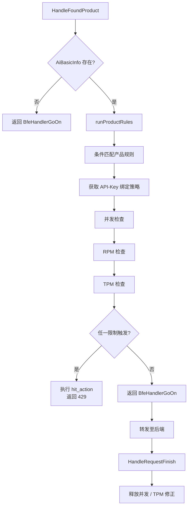
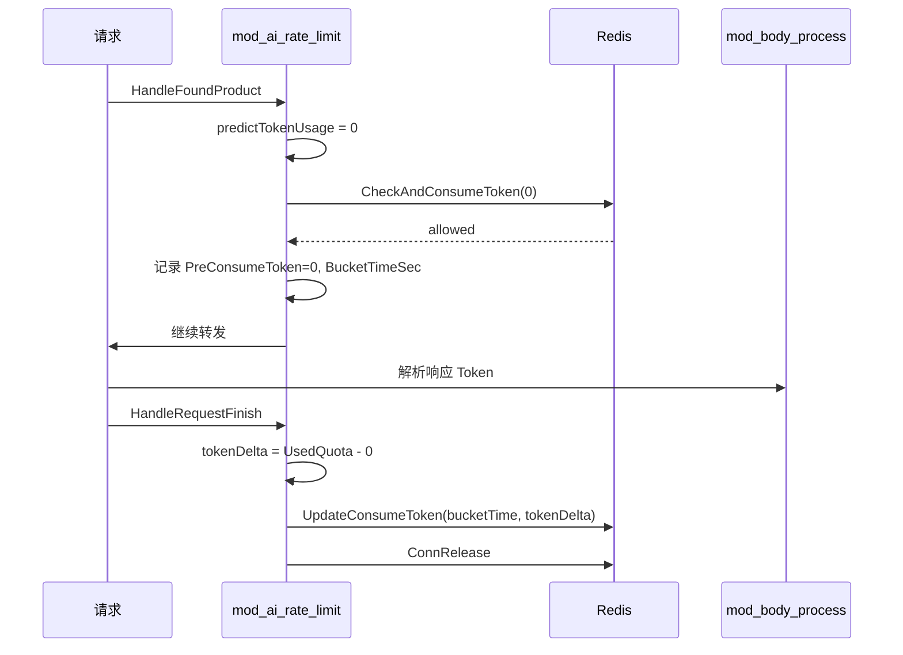

# 第三十章 限流模块实现：mod_ai_rate_limit

## 本章目标

通过本章，读者将理解壬远 AI 网关数据面中限流模块 `mod_ai_rate_limit` 的完整实现。阅读本章后，读者将能够：

- 理解 `mod_ai_rate_limit` 在 BFE 模块管线中的位置与职责边界；
- 掌握 TPM、RPM 与并发三种限流算法的 Redis 实现原理；
- 理解控制面（AI Gateway API）如何生成稳定的 Redis 限流 Key 并下发给 BFE；
- 跟踪限流触发后的 429 响应构造流程；
- 掌握模块配置的加载、校验与热加载机制；
- 了解模块暴露的监控指标与 Prometheus 指标含义。

本章对应设计篇 [第十一章 配额与限流设计](../design/chapter11-quota-and-rate-limit.md) 与操作篇 [第二十一章 限流策略配置](../operation/chapter21-rate-limit-config.md)，聚焦数据面实现细节。

## mod_ai_rate_limit 模块职责

`mod_ai_rate_limit` 是 BFE 数据面负责 AI 请求限流的内置模块，位于 `bfe/bfe_modules/mod_ai_rate_limit/`。它对进入 AI 网关路径的请求执行分布式限流，支持按产品（product）、API-Key、模型等维度配置 TPM（Tokens Per Minute）、RPM（Requests Per Minute）与最大并发数三类限制。

在 BFE 的模块管线中，`mod_ai_rate_limit` 注册在 `HandleFoundProduct` 回调点。实际注册顺序见 `bfe/bfe_modules/bfe_modules.go`：`mod_ai_token_auth` → `mod_ai_route` → `mod_body_process` → `mod_ai_rate_limit`。由于 `mod_body_process` 主要在 `HandleReadResponse` 阶段工作，在 `HandleFoundProduct` 阶段实际执行顺序为 `mod_ai_token_auth` → `mod_ai_route` → `mod_ai_rate_limit`。该顺序由数据依赖决定：`mod_ai_token_auth` 先完成 API-Key 鉴权并将 `ClientApiKey` 写入 `AiBasicInfo`；`mod_ai_route` 随后完成路由查找；`mod_ai_rate_limit` 依赖 `ClientApiKey` 与 `ClientModel` 查找绑定策略并执行限流。任何顺序调整都会破坏依赖链。

模块的核心职责可概括为以下三点：

1. **策略匹配**：根据请求的 `product`、`ClientApiKey`、`ClientModel` 匹配 `ai_rate_limit.data` 中的产品线规则与限流策略；
2. **限流检查**：对命中的策略依次执行并发、RPM、TPM 检查，任一限制超限即拦截请求；
3. **后置处理**：在 `HandleRequestFinish` 阶段释放并发计数，并根据实际 Token 消耗修正 TPM 预扣值。

模块状态机如下：



## TPM、RPM、并发限流算法

`mod_ai_rate_limit` 的三种限流最终都依赖 Redis 计数器实现。BFE 通过 `bfe_util/limit_rate/` 中的 `RedisLRAgent` 执行 Lua 脚本，保证计数器操作的原子性。下面分别介绍三种算法的实现。

### 限流器总体对比

| 维度 | 并发（Concurrency） | RPM | TPM |
|------|---------------------|-----|-----|
| 限制对象 | 同时处理的请求数 | 单位窗口请求次数 | 单位窗口 Token 消耗 |
| Redis 数据结构 | `STRING`（INCR/DECR） | `ZSET`（时间戳有序集合） | `HASH`（分桶计数） |
| 窗口类型 | 无窗口，依赖 TTL | 滑动窗口 | 滑动窗口 + 子桶峰值 |
| 获取真实值时机 | `HandleFoundProduct` | `HandleFoundProduct` | `HandleFoundProduct` 预扣，`HandleRequestFinish` 修正 |
| 失败释放 | `HandleRequestFinish` 调用 `ConnRelease` | 无需释放 | 无需释放 |

### 并发限流

并发限流通过 Redis 的一个计数器实现。请求到达时调用 `ConcurrencyLimiter.ConnAcquire` 对计数器执行原子 `INCR`；请求结束时在 `HandleRequestFinish` 中调用 `ConnRelease` 执行 `DECRBY`。`ConcurrencyLimiter` 定义于 `bfe/bfe_util/limit_rate/redis_concurrency_limiter.go`：

```go
func (l *ConcurrencyLimiter) ConnAcquire(agent *RedisLRAgent) (bool, int64, int64, error) {
    // ...
    currentTime, isAllowed, curCount, err := agent.ConAcquire(l.redisKey, connThreshold, l.ttl)
    // ...
}
```

对应 Lua 脚本 `redis_concurrency_limit_acquire.lua` 的核心逻辑为：读取当前计数值，若已大于等于阈值则拒绝，否则 `INCR` 并通过 `EXPIRE` 设置 TTL。`HandleRequestFinish` 阶段释放时，脚本 `redis_concurrency_limit_release.lua` 会判断当前值是否小于等于 0，避免在 Key 过期后因并发释放导致负值。

### RPM 限流

RPM 限流基于 Redis 有序集合（ZSET）实现滑动窗口。每条请求以当前时间戳为 score 加入集合，并清理窗口外的旧成员。`QPMLimiter` 定义于 `bfe/bfe_util/limit_rate/redis_qpm_limiter.go`：

```go
func (l *QPMLimiter) Check(reqToConsume int64, agent *RedisLRAgent) (bool, int64, float64, error) {
    currentTime, isAllowed, tat, err := agent.QpmCheck(l.redisKey, period, limit, reqToConsume)
    // ...
}
```

Lua 脚本 `redis_qpm_limit_check.lua` 的关键步骤如下：

1. 调用 `ZREMRANGEBYSCORE` 移除早于 `now - period` 的时间戳；
2. 调用 `ZCARD` 获取窗口内已有请求数；
3. 若已有请求数大于等于 `limit`，返回拒绝；
4. 否则将当前请求时间戳写入 ZSET，并设置过期时间。

这种方式的精度为请求级，可以比较精确地限制单位窗口内的请求次数。`burst` 字段在 `QPMLimiter` 中用于初始化，但实际限流主要由 `limit` 与窗口控制。

### TPM 限流

TPM 限流是最复杂的场景，因为 Token 消耗在请求真正完成前无法确定。`mod_ai_rate_limit` 采用"预扣 + 修正"的两阶段方案：`HandleFoundProduct` 阶段根据请求提示 Token 数预测本次可能消耗的 Token 并预扣；`HandleRequestFinish` 阶段根据 `mod_body_process` 解析出的实际 Token 消耗与预扣值的差值，通过 `UpdateTokenUsage` 修正计数器。

`TPMLimiter` 定义于 `bfe/bfe_util/limit_rate/redis_tpm_limiter.go`：

```go
func (l *TPMLimiter) TryCheck(tokensToConsume int64, agent *RedisLRAgent) (bool, int64, int64, error) {
    currentTime, _, _, _, _, isFinalAllowed, err := agent.CheckAndConsumeToken(...)
    if isFinalAllowed {
        preconsumeToken = tokensToConsume
    }
    return isFinalAllowed, currentTime, preconsumeToken, nil
}

func (l *TPMLimiter) UpdateTokenUsage(bucketTime int64, tokensConsumeDelta int64, agent *RedisLRAgent) error {
    _, err := agent.UpdateConsumeToken(l.key, bucketTime, l.bucketSizeSec, tokensConsumeDelta)
    return err
}
```

预扣 Token 数由 `tpmLimiterItem.predictTokenUsage` 计算，当前实现为线性预测：

```go
func (r *tpmLimiterItem) predictTokenUsage(promptToken int64) int64 {
    return int64(r.ReservedOff + r.ReservedX*float64(promptToken))
}
```

其中 `ReservedX` 与 `ReservedOff` 当前固定为 0，因此预测值实际为 0。这意味着当前实现主要在请求完成后的修正阶段写入真实 Token 消耗，而 `HandleFoundProduct` 阶段的 TPM 检查不会成为主要拦截手段。预留这两个字段是为了后续支持基于提示 Token 的预测模型。

TPM 的 Redis 数据结构为 Hash，Key 为 Redis Key，Field 为每个子桶的起始时间戳，Value 为该桶内已消耗 Token 数。Lua 脚本 `redis_tpm_limit_check.lua` 同时维护整体窗口阈值与子桶峰值阈值：

- 整体窗口阈值 `tpm_threshold`：整个滑动窗口内允许的最大 Token 数；
- 子桶峰值 `bucket_peak_limit`：每个 `bucket_size_sec` 子桶内允许的最大 Token 数。

脚本先清理窗口外的旧 Field，再分别判断当前子桶与整体窗口是否允许本次消耗，只有两者都允许时才会执行 `HINCRBY`。`UpdateConsumeToken` 脚本则在请求完成后，根据实际消耗与预扣值的差值对对应子桶进行增量或减量修正。

TPM 两阶段流程如下：



## Redis 限流 Key 设计

### 稳定 Key 的必要性

早期 `mod_ai_rate_limit` 的 Redis Key 由策略 ID 与规则名拼接而成（`default_bfe_<policyId>_rpm_<ruleName>`）。当管理面仅修改规则名时，Redis Key 发生变化，导致历史计数器归零。为避免这一问题，当前架构由控制面生成稳定的 `redis_key` 并随配置下发。

控制面导出时基于不会随用户编辑变化的 `(policy_id, rule_index)` 生成 Key，格式为 `RL_TPM_rlp-<id>_<idx>` 与 `RL_RPM_rlp-<id>_<idx>`。BFE 侧优先使用配置中的 `redis_key` 字段；若旧配置未携带该字段，则回退到基于规则名的旧逻辑，保证向后兼容。该设计详见 `bfe/docs/zh_cn/sys_design/ai_rate_limit_redis_key.md`。

### BFE 侧的 Key 构建

`bfe/bfe_modules/mod_ai_rate_limit/policy_limiter.go` 中的 `buildTpmRedisKey` 与 `buildRpmRedisKey` 实现了 Key 构建与兼容逻辑：

```go
func buildRedisKey(policyId string, suffix string) string {
    return fmt.Sprintf("%s_%s_%s", "default_bfe", policyId, suffix)
}

func buildTpmRedisKey(policyId string, rule *TPMRuleConf) string {
    if rule.RedisKey != "" {
        if strings.HasPrefix(rule.RedisKey, "default_bfe_") {
            return rule.RedisKey
        }
        return buildRedisKey(policyId, rule.RedisKey)
    }
    return buildRedisKey(policyId, fmt.Sprintf("tpm_%s", buildTpmInstId(rule)))
}
```

在 `newPolicyLimiterSet` 中，每个策略的 TPM/RPM 规则会被实例化为对应的限流器，Redis Key 由上述函数生成：

```go
redisKey := buildTpmRedisKey(policyId, rule)
limiter := limit_rate.NewTPMLimiter(redisKey, rule.Threshold, rule.TimeWindow, ...)
```

并发限流的 Key 则统一为 `default_bfe_<policyId>_con`。

### 兼容性说明

| 场景 | 行为 |
|------|------|
| 新配置携带 `redis_key` | BFE 直接使用该字段构建 Redis Key |
| 旧配置未携带 `redis_key` | 回退到基于 `name` 的旧 Key，计数器行为不变 |
| 修改规则名（其余字段不变） | `redis_key` 不变，计数器不重置 |
| 修改 model（其余字段不变） | `redis_key` 不变，计数器不重置 |
| 删除/新增规则 | 后续规则下标变化，对应 Key 变化，计数器重置 |

## 限流触发与响应（429）

### 命中动作

产品线规则中的 `hit_action` 决定限流触发后的行为。`mod_ai_rate_limit` 支持的动作为 `PASS`、`FINISH`、`CLOSE`，定义于 `bfe/bfe_modules/mod_ai_rate_limit/action.go`：

```go
var allowReqActions map[string]bool = map[string]bool{
    action.ActionClose:  true,
    action.ActionFinish: true,
    action.ActionPass:   true,
}
```

- `PASS`：命中后放行，常用于仅监控不限流；
- `FINISH`：命中后构造 429 响应并结束请求；
- `CLOSE`：直接关闭连接。

实际生产配置通常使用 `FINISH`。

### 429 响应构造

当 `executePolicyAction` 收到 `FINISH` 指令时，模块会根据当前命中的限流类型构造错误码与响应。代码位于 `bfe/bfe_modules/mod_ai_rate_limit/mod_ai_rate_limit.go`：

```go
func (m *ModuleAiRateLimit) executePolicyAction(...) (int, *bfe_http.Response) {
    if rule.hitAction.Cmd == action.ActionFinish {
        // 根据命中信息判断限流类型
        if policyHitInfo.IsConcurrency {
            errorCode = bfe_basic.CodeConcurrencyLimitExceeded
            limitType = bfe_basic.LimitTypeConcurrency
        } else if len(policyHitInfo.RpmRules) > 0 {
            errorCode = bfe_basic.CodeRpmLimitExceeded
            limitType = bfe_basic.LimitTypeRpm
        } else if len(policyHitInfo.TpmRules) > 0 {
            errorCode = bfe_basic.CodeTpmLimitExceeded
            limitType = bfe_basic.LimitTypeTpm
        }

        aiError := bfe_basic.NewAiErrorWithDetails(
            errorCode,
            bfe_basic.TypeRateLimitError,
            fmt.Sprintf("Rate limit exceeded for policy %s", policy.Name),
            &bfe_basic.AiErrorDetail{
                ApiKey:    apiKey,
                LimitType: limitType,
            },
        )
        resp := aiError.CreateErrorResponse(req)
        return bfe_module.BfeHandlerFinish, resp
    }
}
```

最终返回 HTTP 状态码 `429 Too Many Requests`，响应体中包含错误码、限流类型与 API-Key 等元信息，便于客户端识别限流原因。

### Redis 故障时的行为

模块配置 `IsRejectOnRedisError` 控制 Redis 故障时是否拒绝请求。当 Redis 调用失败且该开关为 `true` 时，模块会记录 `IsRedisError` 并触发 `FINISH` 动作返回 429；为 `false` 时则放行请求，避免 Redis 故障导致服务完全不可用。

## 配置加载与热加载

### 双层配置结构

`mod_ai_rate_limit` 的配置分为两层：

1. **模块基础配置** `mod_ai_rate_limit.conf`（INI 格式）：指定产品规则文件路径、Redis 连接参数、`IsRejectOnRedisError` 与日志开关；
2. **产品规则数据** `ai_rate_limit.data`（JSON 格式）：包含产品线规则、限流策略与 API-Key 绑定关系。

模块基础配置示例：

```ini
[basic]
ProductRulePath = ../conf/mod_ai_rate_limit/ai_rate_limit.data
IsRejectOnRedisError = true

[redis]
bns = BFE.poc-redis-wx
connectTimeout = 20
readTimeout = 20
writeTimeout = 20
maxIdle = 20

[log]
OpenDebug = false
```

### 启动加载流程

`ModuleAiRateLimit.Init` 是模块启动入口，位于 `bfe/bfe_modules/mod_ai_rate_limit/mod_ai_rate_limit.go`。其加载流程如下：

1. 调用 `ConfLoad` 读取 `mod_ai_rate_limit.conf`；
2. 根据 Redis 配置创建 `redisClient` 与 `redisAgent`；
3. 调用 `loadProductRuleTable` 加载 `ai_rate_limit.data`；
4. 将 `limitFoundProductHandler` 注册到 `HandleFoundProduct`；
5. 将 `limitRequestFinishHandler` 注册到 `HandleRequestFinish`；
6. 注册监控与热加载 Web Handler。

```go
func (m *ModuleAiRateLimit) Init(cbs *bfe_module.BfeCallbacks, whs *web_monitor.WebHandlers, cr string) error {
    conf, err := ConfLoad(confPath, cr)
    // ...
    client := redis_client.NewRedisClient(options)
    m.redisClient = client
    m.redisAgent = limit_rate.NewRedisLRAgent(m.redisClient)

    if _, err := m.loadProductRuleTable(nil); err != nil {
        return err
    }

    cbs.AddFilter(bfe_module.HandleFoundProduct, m.limitFoundProductHandler)
    cbs.AddFilter(bfe_module.HandleRequestFinish, m.limitRequestFinishHandler)
    // ...
}
```

### 数据文件加载与校验

`ai_rate_limit.data` 的加载与校验由 `bfe/bfe_modules/mod_ai_rate_limit/data_load.go` 负责。文件结构首先被反序列化为 `AiRateLimitConfFile`，经过 `Check` 校验后再通过 `Convert()` 转换为运行时结构 `AiRateLimitConf`。

校验要点包括：

- `Version` 不能为空；
- 产品线规则的条件表达式必须合法；
- 每条 TPM/RPM 规则的 `window_minutes` 在 `[1, 360]` 之间；
- 同一规则列表内 `name` 不能重复；
- TPM 最多 3 条、RPM 最多 3 条；
- 至少配置 TPM、RPM、最大并发中的一项。

### 热加载与限流器更新

`loadProductRuleTable` 同时承担启动加载与热加载职责。新配置校验通过后，会调用 `productTable.load()` 原子替换规则表，并调用 `limiterManager.updateLimiters()` 重建限流器。

`updateLimiters` 在重建限流器时会尽量保留旧限流器的统计计数，避免热加载后监控值跳变：

```go
func (m *policyLimiterManager) updateLimiters(ratePolicies map[string]*PolicyConf) {
    oldLimiters := m.limiters
    newLimiters := make(map[string]*policyLimiterSet, len(ratePolicies))
    for policyId, policy := range ratePolicies {
        new_item := newPolicyLimiterSet(policyId, policy)
        newLimiters[policyId] = new_item
    }

    m.lock.Lock()
    m.limiters = newLimiters
    for policyId, new_item := range newLimiters {
        if old_item, ok := oldLimiters[policyId]; ok {
            new_item.updateCount(old_item)
        }
    }
    m.lock.Unlock()
}
```

热加载接口为 `GET /reload/mod_ai_rate_limit`，由 `reloadHandlers` 注册。

## 监控项

`mod_ai_rate_limit` 暴露两类监控：模块状态计数器与 Prometheus 指标。

### 模块状态计数器

模块状态通过 `module_state2.State` 维护，启动时在 `CounterKeys` 中预定义了以下计数器：

```go
var CounterKeys = []string{
    "REQ_AI_RATE_MEET_THRESHOLD",
}
```

此外，`limiterManager` 内部为每个策略的每条 TPM/RPM 规则与并发限流器维护 `matchCount` 与 `hitCount`，用于统计匹配次数与命中次数。

### Prometheus 指标

Prometheus 指标定义于 `bfe/bfe_modules/mod_ai_rate_limit/prometheus_states.go`，按 TPM、RPM、并发三类分组，每组包含总量 Gauge 与按 `policy_id`、`inst_id` 拆分的 CounterVec：

| 指标名 | 类型 | 说明 |
|--------|------|------|
| `tpm_match_total` | Gauge | TPM 规则匹配总数 |
| `tpm_match` | CounterVec | 按策略与规则拆分的 TPM 匹配次数 |
| `tpm_hit_total` | Gauge | TPM 规则命中（拒绝）总数 |
| `tpm_hit` | CounterVec | 按策略与规则拆分的 TPM 命中次数 |
| `tpm_token_total` | Gauge | TPM 累计 Token 数 |
| `tpm_token` | CounterVec | 按策略与规则拆分的 Token 数 |
| `rpm_match_total` / `rpm_match` / `rpm_hit_total` / `rpm_hit` | Gauge/CounterVec | RPM 对应指标 |
| `con_match_total` / `con_match` / `con_hit_total` / `con_hit` | Gauge/CounterVec | 并发对应指标 |

`getPrometheus` 方法会定期将内存中的 `LimiterStats` 汇总后写入 Prometheus Registry，并通过 `/monitor/mod_ai_rate_limit.prometheus` 接口暴露。

## 关键代码片段

### 产品线规则匹配

`runProductRules` 按产品获取规则列表并顺序匹配，命中后调用 `executeCheckLimitPolicy`：

```go
func (m *ModuleAiRateLimit) runProductRules(req *bfe_basic.Request, meta *bfe_basic.AiBasicInfo) (int, *bfe_http.Response) {
    product := req.Route.Product
    rules := m.productTable.getProductRules(product)
    // ...
    for _, rule := range rules {
        if !rule.cond.Match(req) {
            continue
        }
        ret, res := m.executeCheckLimitPolicy(req, meta, rule, ctx)
        if ret != bfe_module.BfeHandlerGoOn {
            req.ErrCode = ErrAiRateLimit
            return ret, res
        }
    }
    return bfe_module.BfeHandlerGoOn, nil
}
```

### 策略检查顺序

`executeCheckLimitPolicy` 按并发、RPM、TPM 的顺序依次检查，任一失败即执行 `hit_action`：

```go
if !ls.checkConcurrency(req, meta, m.redisAgent, ctx, clientModel, m.isRejectOnRedisError) {
    return m.executePolicyAction(req, meta, policyId, policy, rule)
}
if !ls.checkRPM(req, meta, m.redisAgent, ctx, clientModel, m.isRejectOnRedisError) {
    return m.executePolicyAction(req, meta, policyId, policy, rule)
}
if !ls.checkTPM(req, meta, m.redisAgent, ctx, clientModel, m.isRejectOnRedisError) {
    return m.executePolicyAction(req, meta, policyId, policy, rule)
}
```

### 请求结束后的清理

`limitRequestFinishHandler` 负责 TPM 修正与并发释放：

```go
func (m *ModuleAiRateLimit) limitRequestFinishHandler(req *bfe_basic.Request, res *bfe_http.Response) int {
    // ...
    tokenUsage := meta.GetTokenUsage()
    for _, tpmData := range ctx.TpmLimiterDataList {
        if !tpmData.IsAllowed {
            continue
        }
        tokenDelta := tokenUsage.UsedQuota - tpmData.PreConsumeToken
        if tokenDelta != 0 {
            tpmData.Limiter.UpdateTokenUsage(tpmData.BucketTimeSec, tokenDelta, m.redisAgent)
        }
        tpmData.Item.tokenCount.Add(uint64(tokenUsage.UsedQuota))
    }

    for _, limiter := range ctx.ConLimiters {
        limiter.ConnRelease(m.redisAgent)
    }
    return bfe_module.BfeHandlerGoOn
}
```

## 本章小结

- `mod_ai_rate_limit` 是 BFE 数据面负责 AI 请求限流的模块，注册在 `HandleFoundProduct` 回调点，依赖 `mod_ai_token_auth` 设置的 `ClientApiKey` 识别限流维度。
- 模块支持 TPM、RPM 与最大并发数三类限制，分别基于 Redis Hash、Redis ZSET 与 Redis String 实现，均通过 Lua 脚本保证原子性。
- TPM 采用"预扣 + 修正"两阶段方案：`HandleFoundProduct` 阶段按预测 Token 预扣，`HandleRequestFinish` 阶段根据实际 Token 消耗修正。
- 控制面为每条 TPM/RPM 规则生成稳定的 `redis_key`（`RL_TPM_rlp-<id>_<idx>` / `RL_RPM_rlp-<id>_<idx>`），BFE 优先使用该字段构建 Redis Key，未指定时回退到旧逻辑。
- 限流触发后，模块根据 `hit_action` 执行 `FINISH` 或 `CLOSE`，默认返回 429 Too Many Requests，并在响应体中携带限流类型与错误码。
- 配置采用 INI + JSON 双层结构，支持通过 `/reload/mod_ai_rate_limit` 热加载；热加载时会保留旧限流器的统计计数，避免监控跳变。
- 模块暴露 `tpm_match`、`tpm_hit`、`rpm_match`、`rpm_hit`、`con_match`、`con_hit` 等 Prometheus 指标，支持按 `policy_id` 与 `inst_id` 拆分观测。

## 参考文档

- `bfe/bfe_modules/mod_ai_rate_limit/mod_ai_rate_limit.go`
- `bfe/bfe_modules/mod_ai_rate_limit/policy_limiter.go`
- `bfe/bfe_modules/mod_ai_rate_limit/data_load.go`
- `bfe/bfe_modules/mod_ai_rate_limit/conf_load.go`
- `bfe/bfe_modules/mod_ai_rate_limit/policy_table.go`
- `bfe/bfe_modules/mod_ai_rate_limit/prometheus_states.go`
- `bfe/bfe_util/limit_rate/redis_tpm_limiter.go`
- `bfe/bfe_util/limit_rate/redis_qpm_limiter.go`
- `bfe/bfe_util/limit_rate/redis_concurrency_limiter.go`
- `bfe/docs/zh_cn/modules/mod_ai_rate_limit/mod_ai_rate_limit.md`
- `bfe/docs/zh_cn/configuration/mod_ai_rate_limit/ai_rate_limit.data.md`
- `bfe/docs/zh_cn/sys_design/ai_rate_limit_redis_key.md`
- `ai-gateway-api/design-docs/sys-design/details/限流策略与导出.md`
