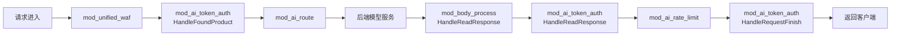
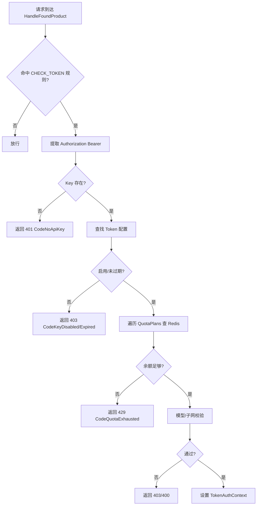
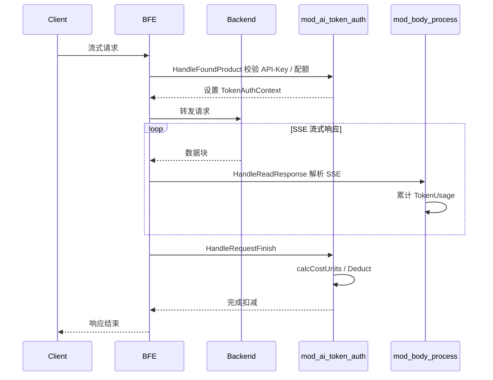

# 第三十章 Token认证与配额模块实现：mod_ai_token_auth

## 本章目标

通过本章，读者将理解壬远 AI 网关数据面中 `mod_ai_token_auth` 模块的完整实现：

- 模块在 BFE 请求处理链路中的位置与注册时机；
- 如何校验请求携带的 API-Key，并在失败时返回结构化的错误响应；
- 如何将 API-Key 与 `QuotaPlan` 绑定，并通过 Redis 查询实时余额；
- 请求结束时如何根据实际 Token 用量或 RMB 成本扣减配额；
- 扣费幂等、客户端中断不计费与 `/count_tokens` 跳过计费的可靠性语义；
- RMB 配额如何结合 Provider 时段模板与模型分时段价格实现差异化计费；
- `mod_ai_token_auth` 与 `mod_body_process` 在流式与非流式响应中的协作方式。

## mod_ai_token_auth 模块职责

`mod_ai_token_auth`（AI Token 认证模块）是数据面 BFE 中负责 API-Key 鉴权与配额扣减的核心模块。一个 API-Key 代表业务方对特定大模型服务的访问凭证，同时关联若干 `QuotaPlan`，决定该凭证在一个周期内可消耗的资源总量。

模块的核心职责包括：

1. **API-Key 提取与校验**：从请求 `Authorization: Bearer <api-key>` 头中提取 Key，校验其存在性、启用状态、过期时间、模型白名单/黑名单、来源 IP 子网等。校验失败时立即构造结构化错误响应返回客户端，避免无效请求进入后端。
2. **配额余额预检**：在请求进入后端前，查询 Redis 中各 `QuotaPlan` 的剩余配额，余额不足或计划过期时拒绝请求。这一步只在请求成功认证后执行，未命中鉴权规则的请求不会触发配额检查。
3. **请求结束扣减**：在响应完成后，根据响应体中的 `usage` 字段或按内容长度估算的 Token 数，对 `total_token` 配额执行扣减；对 `RMB` 配额则先按模型单价折算成本，再执行扣减。客户端中断且未拿到最终 usage 的请求不计费，`/count_tokens` 类端点跳过计费，扣费通过 `deducted` 标记保证幂等。扣减失败会被捕获并记录 Warn 日志，不会影响响应返回。
4. **错误信息结构化**：在 `AiBasicInfo.AiAuthInfo` 中记录拒绝原因与命中的配额计划，便于访问日志与监控分析。这些字段也会被 `mod_access` 等访问日志模块输出，为后续排障提供完整上下文。

## 模块在 BFE 模块链中的位置

BFE 的模块按固定顺序在 `bfe_modules/bfe_modules.go` 中注册。`mod_ai_token_auth` 位于 `mod_unified_waf` 之后、`mod_ai_route` 之前：

```go
// bfe/bfe_modules/bfe_modules.go
var moduleList = []bfe_module.BfeModule{
    // ... 前置模块 ...

    // mod_ai_token_auth
    mod_ai_token_auth.NewModuleAITokenAuth(),

    // mod_ai_route
    // Requirement: after mod_ai_token_auth (needs ClientApiKey)
    mod_ai_route.NewModuleAiRoute(),

    // mod_body_process
    mod_body_process.NewModuleBodyProcess(),

    //depends on token calc
    mod_ai_rate_limit.NewModuleAiRateLimit(),

    // ... 后置模块 ...
}
```

之所以把 `mod_ai_token_auth` 放在 `mod_ai_route` 之前，是因为路由模块需要根据已认证的 API-Key 选择专属路由规则；而 `mod_ai_rate_limit` 位于 `mod_body_process` 之后，是因为限流模块依赖 `mod_body_process` 解析出的 Token 用量进行 TPM 计算。

`HandleRequestFinish` 是 BFE 请求生命周期的最后一个回调点，所有响应数据（包括流式累计的 Token 用量、RMB 成本）此时都已就绪，因此配额扣减放在这里可以确保只扣除一次且金额准确。如果提前到 `HandleReadResponse` 扣减，流式响应尚未结束，会导致少扣或重复扣减。

`mod_ai_token_auth` 在初始化时注册了三个回调：

- `HandleFoundProduct`：`tokenFoundProductHandler`，完成 API-Key 校验与配额预检；
- `HandleReadResponse`：`tokenReadResponseHandler`，非流式场景下解析响应体中的 Token 用量；
- `HandleRequestFinish`：`tokenRequestFinishHandler`，在所有响应处理完成后执行最终配额扣减。



## API-Key 校验流程

请求头中的 API-Key 必须遵循以下格式：

```http
Authorization: Bearer <api-key>
```

`tokenFoundProductHandler` 是模块的入口，其处理逻辑位于 `bfe/bfe_modules/mod_ai_token_auth/mod_ai_token_auth.go`：

```go
func (m *ModuleAITokenAuth) tokenFoundProductHandler(req *bfe_basic.Request) (int, *bfe_http.Response) {
    meta := req.GetAiBasicInfo()
    if meta == nil {
        return bfe_module.BfeHandlerGoOn, nil
    }

    matched := m.matchTokenRule(req)
    if !matched {
        return bfe_module.BfeHandlerGoOn, nil
    }

    m.state.ReqAuth.Inc(1)
    tok, err := m.ValidateUserTokenByReq(req)
    if err != nil {
        m.state.ReqAuthFail.Inc(1)
        resp := err.CreateErrorResponse(req)
        return bfe_module.BfeHandlerResponse, resp
    }

    promptToken := 0
    if meta.IsAllowEstimateToken() {
        promptToken = int(GetPromptToken(req))
    }
    SetTokenAuthContext(req, tok, int64(promptToken), tok.Tags)

    return bfe_module.BfeHandlerGoOn, nil
}
```

`matchTokenRule` 根据产品（Product）匹配规则表，只有命中 `CHECK_TOKEN` 动作的规则才会触发后续鉴权。这种设计让管理员可以按产品维度灵活开启或关闭鉴权，例如对内部测试产品放行，对线上产品强制鉴权。

真正的校验逻辑在 `bfe/bfe_modules/mod_ai_token_auth/token_rule_table.go` 的 `ValidateUserTokenByReq` 中，按顺序执行：

1. **提取 API-Key**：调用 `bfe_basic.GetApiKey(req)`，若为空返回 `CodeNoApiKey`。
2. **查找 Token**：在规则表 `TokenRuleTable` 中按 `product + key` 查找；不存在返回 `CodeInvalidApiKey`。在校验失败前，模块会尽早把 `KeyId` 写入 `AiBasicInfo`，这样即使请求后续被拒绝，访问日志也能关联到具体 Key。
3. **状态校验**：检查 `Enabled` 与 `ExpiredTime`；禁用或过期分别返回 `CodeKeyDisabled`、`CodeKeyExpired`。
4. **配额预检**：遍历 `token.QuotaPlans`，跳过 `Unlimited` 与 `PassNoQuota` 计划；对有限计划调用 `plan.HasBalance` 查询 Redis，余额不足返回 `CodeQuotaExhausted`，计划过期返回 `CodeQuotaExpired`。多个配额计划会依次检查，只有全部通过才放行。
5. **模型权限校验**：若 Token 配置了 `Models` 或 `BlockModels`，读取请求体 `model` 字段进行白名单/黑名单匹配；不匹配返回 `CodeModelNotAllowed`。当配置为 `*` 时表示允许所有模型。
6. **IP 子网校验**：若配置了 `Subnet`，检查 `ClientAddr` 或 `RemoteAddr` 是否在允许子网内；不在则返回 `CodeSubnetNotAllowed`。子网支持 CIDR 表示，可配置多个。



校验成功后，`SetTokenAuthContext` 会把 `KeyId`、`ApikeyTags`、预估的 `PromptTokens` 等信息写入 `AiBasicInfo`，供后续模块使用。对于图片/视频生成模式，它还会在认证阶段预读请求体的 `n` 字段（`GetImageCountFromReq` / `GetVideoCountFromReq`）填入 `ImageCount` / `VideoCount` 作为兜底，`n` 缺失或 `≤ 0` 时取 1，防止响应未返回用量时按 0 计费少收：

```go
if aiBasicInfo.Mode == bfe_basic.ModeImageGeneration {
    tusage.ImageCount = GetImageCountFromReq(req)
}
if aiBasicInfo.Mode == bfe_basic.ModeVideoGeneration {
    tusage.VideoCount = GetVideoCountFromReq(req)
}
```

## 配额计划绑定与余额查询（Redis）

### 配置结构

`QuotaPlan` 在 BFE 运行时的定义位于 `bfe/bfe_modules/mod_ai_token_auth/token.go`：

```go
type QuotaPlan struct {
    Id          string
    Unlimited   bool
    PassNoQuota bool
    RedisKey    string
    ExpiredTime int64  // -1 means never expired
    Quota       int64  // 定点整数：total_token 为 Token 数；RMB 为 1e-8 元
    Unit        string // "total_token" or "RMB"
}
```

控制面在导出配置时，已经为每个配额计划生成稳定的 `RedisKey`，格式为 `QUOTA_<stableId>`，其中 `stableId` 对于 API-Key 级配额是 API-Key 值，对于 Entity 级配额是 `entity_id`。BFE 直接使用下发的 `RedisKey`，不再根据计划名称或 ID 自行拼装，从而避免改名导致计数器重置。这一原则与 `mod_ai_rate_limit` 的 Redis key 稳定性设计保持一致：计数器 key 不能依赖任何用户可编辑的业务字段。相关设计可参见 `bfe/docs/zh_cn/sys_design/ai_rate_limit_redis_key.md`。

`QuotaPlan` 中 `Unit` 为空时，`token_rule_load.go` 会将其默认置为 `total_token`，保证旧配置的向后兼容。配置校验阶段还会根据单位类型检查 `Quota` 的合法性：`RMB` 与 `total_token` 均要求不小于 0。其中 `total_token` 配额允许配置为 0，表示这是一个"无余额计划"——绑定该计划的 API-Key 在配额预检阶段即因余额不足被拒绝（429 `CodeQuotaExhausted`），适用于先创建 Key、后续再发放额度的场景。

### 余额查询

`QuotaPlan.HasBalance` 使用 Redis 客户端读取当前剩余量：

```go
func (q *QuotaPlan) HasBalance(client redis_client.Client) (bool, int64, error) {
    if q.Unlimited {
        return true, q.Quota, nil
    }

    if q.RedisKey == "" {
        return false, 0, errors.New("RedisKey is empty")
    }

    current, err := client.GetInt64(q.RedisKey)
    if err != nil {
        // key 未初始化（例如配额为 0 从未同步过 Redis）视为无余额，
        // 而不是内部错误
        if redis_client.IsKeyNotFound(err) {
            return false, 0, nil
        }
        return false, 0, err
    }

    return current > 0, current, nil
}
```

对于 `total_token` 配额，Redis 值就是剩余 Token 数；对于 `RMB` 配额，Redis 值是以 `1e-8` 元为单位的定点整数。`Unlimited` 计划直接返回 `true`，不参与余额检查。注意预检查的是 Redis 中的实时余额而不是配置里的 `Quota` 字段：当余额 key 不存在（如配额为 0 的计划从未同步过 Redis）时，按无余额处理，请求在预检阶段被 429 `CodeQuotaExhausted` 拒绝，而不会返回 500 内部错误。

### 控制面的余额同步

控制面 `ai-gateway-api` 在创建 API-Key / Entity 时，会通过 `QuotaCache.SetRemaining` 把初始余额写入 Redis；周期重置或手动重置时，使用 `IncrBy(delta)` 原子调整余额，而不是直接 `SET`，以避免覆盖并发请求刚扣减的计数。详细机制见 `ai-gateway-api/design-docs/sys-design/details/配额余额同步机制.md`。

## 请求结束时配额扣减

配额扣减发生在 `HandleRequestFinish`，此时响应已经完整返回客户端。`tokenRequestFinishHandler` 只处理 HTTP 200 的请求，并优先使用实际解析到的 Token 用量；如果响应中没有 `usage`、允许估算且响应已正常完成，则按内容长度估算。处理顺序为：先跳过 `/count_tokens` 端点，再校验扣费幂等标记，然后处理客户端中断场景，最后进入正常的用量结算：

```go
func (m *ModuleAITokenAuth) tokenRequestFinishHandler(req *bfe_basic.Request, res *bfe_http.Response) int {
    // /count_tokens 端点只统计 Token 数，永远不计费
    if strings.Contains(req.HttpRequest.RequestURI, "/count_tokens") {
        return bfe_module.BfeHandlerGoOn
    }

    if res == nil || res.StatusCode != bfe_http.StatusOK {
        // only count used quota for successful requests
        return bfe_module.BfeHandlerGoOn
    }

    ctx := GetTokenAuthContext(req)
    if ctx == nil {
        return bfe_module.BfeHandlerGoOn
    }

    // HandleRequestFinish 可能多次触发，扣费只执行一次
    if ctx.deducted {
        return bfe_module.BfeHandlerGoOn
    }

    // 客户端中断（RST/close/写入失败）且未见到最终 usage：不按整请求估算扣费
    aborted := isClientAbortErr(req.ErrCode)
    if aborted && !ctx.aiBasicInfo.IsFinalUsageSeen() {
        ctx.deducted = true
        return bfe_module.BfeHandlerGoOn
    }

    tokenUsage := ctx.aiBasicInfo.GetTokenUsage()
    // 估算值仅在响应正常完成时才可计费；否则清零估算字段，
    // 让下面的 calcCostUnits 直接按 Token 字段计费
    estimateBillable := ctx.aiBasicInfo.IsAllowEstimateToken() &&
        ctx.aiBasicInfo.IsResponseCompleted()
    if !ctx.aiBasicInfo.IsFinalUsageSeen() && !estimateBillable {
        tokenUsage.PromptTokens = 0
        tokenUsage.CompletionTokens = 0
        tokenUsage.UsedQuota = 0
    }
    if tokenUsage.UsedQuota <= 0 && estimateBillable {
        tokenUsage.UsedQuota = CalcReqUsedQuota(req, tokenUsage.PromptTokens, tokenUsage.CompletionTokens)
    }

    // 按已由 mod_body_process（流式）或 tokenReadResponseHandler（非流式）
    // 填充的 TokenUsage 计算 RMB 成本
    if tokenUsage.UsedCost <= 0 && hasRMBPlan(ctx.Token.QuotaPlans) {
        tokenUsage.UsedCost = m.calcCostUnits(req, ctx.serverConf, tokenUsage)
    }

    costUnits := tokenUsage.UsedCost

    if tokenUsage.UsedQuota > 0 || costUnits > 0 {
        for _, plan := range ctx.Token.QuotaPlans {
            if plan.Unlimited {
                continue
            }
            if quota.IsRMB(plan.Unit) {
                if costUnits > 0 {
                    _, err := plan.Deduct(m.redisClient, costUnits)
                    if err != nil {
                        log.Logger.Warn("deduct rmb quota failed: %v", err)
                    }
                }
            } else {
                if tokenUsage.UsedQuota > 0 {
                    _, err := plan.Deduct(m.redisClient, tokenUsage.UsedQuota)
                    if err != nil {
                        log.Logger.Warn("deduct token quota failed: %v", err)
                    }
                }
            }
        }
    }

    ctx.deducted = true
    return bfe_module.BfeHandlerGoOn
}
```

其中 `isClientAbortErr` 判定客户端侧中断错误：

```go
func isClientAbortErr(err error) bool {
    return err == bfe_basic.ErrClientWrite ||
        err == bfe_basic.ErrClientClose ||
        err == bfe_basic.ErrClientReset
}
```

### 扣费幂等

`TokenAuthContext` 带有 `deducted` 标记。`HandleRequestFinish` 在某些场景下可能被多次触发（例如连接异常收尾），handler 入口检查 `ctx.deducted`，已扣费则直接返回；正常路径在扣减循环结束后置位。这保证了同一请求无论触发几次，最多只扣一次。

### 客户端中断不计费与估算可靠性语义

按内容长度估算 Token（`EstimateToken`，请求体 `Content-Length/4` 估算输入、响应体长度估算输出）只是兜底手段，只有响应正常完成时才允许参与计费。为此 `bfe_basic.AiBasicInfo` 维护两组状态标记：

- `MarkResponseCompleted` / `IsResponseCompleted`：响应正常完成时置位。流式场景由 `mod_body_process` 在见到终止事件（Anthropic `message_stop`、OpenAI `[DONE]`）时置位；非流式场景由 `tokenReadResponseHandler` 在完整读出响应体后置位。
- `MarkFinalUsageSeen` / `IsFinalUsageSeen`：从响应中解析到最终 usage 时置位。流式场景由 `QuotaUsageProcessor` 在收到最终 usage 事件（如 Anthropic `message_delta`，或带 `image_count` / `video_count` 的事件）时置位；非流式场景在解析出非零 `UsedQuota` 后置位。Anthropic `message_start` 中 `output_tokens = 0` 的初始 usage 不算最终 usage。

结算规则为：

1. **客户端中断且未见到最终 usage**（`req.ErrCode ∈ {ErrClientWrite, ErrClientClose, ErrClientReset}` 且 `IsFinalUsageSeen() == false`）：直接置位 `deducted` 返回，不扣费。客户端中途断开时响应体不完整，按整请求估算会严重高估；
2. **非中断但响应未完成**（例如后端异常收尾）：清零 `PromptTokens` / `CompletionTokens` / `UsedQuota` 中的估算字段，再按正常公式计费，避免估算值污染 RMB 成本计算（`calcCostUnits` 直接读取 Token 字段，仅守住 `UsedQuota` 是不够的）；
3. **响应正常完成**：估算值可用，按 `CalcReqUsedQuota` 计算 `UsedQuota` 后进入扣减。

### /count_tokens 跳过计费

Anthropic 等协议的 `/v1/messages/count_tokens` 端点用于预统计 Token 数，不产生真实调用。`tokenRequestFinishHandler` 入口通过 `RequestURI` 包含 `/count_tokens` 判定并直接放行，避免把 Token 统计请求计入配额。

### total_token 扣减

`total_token` 配额使用 Lua 脚本原子扣减，位于 `bfe/bfe_modules/mod_ai_token_auth/token.go`：

```go
func (q *QuotaPlan) deductToken(client redis_client.Client, amount int64) (int64, error) {
    lua := `
        local current = tonumber(redis.call('GET', KEYS[1]) or '0')
        local amount = tonumber(ARGV[1])
        local deduct = math.min(current, amount)
        if deduct > 0 then
            redis.call('DECRBY', KEYS[1], deduct)
        end
        return math.max(0, current - deduct)
    `
    script := client.NewScript(lua)
    result, err := script.Run(q.RedisKey, amount)
    // ...
}
```

脚本使用 `math.min(current, amount)` 保证即使余额不足也不会扣成负数，返回扣减后的剩余量。Lua 脚本在 Redis 单线程中执行，读取余额与扣减操作是原子的，可以避免高并发下多个请求同时读取同一余额后都判断为足够，最终导致超扣。

### RMB 扣减

RMB 配额扣减需要处理 Key 不存在的情况（例如 Redis 数据被清理后首次请求，或新创建的 API-Key 尚未初始化余额）。Lua 脚本会先以配额总量初始化 Key，再执行扣减：

```go
func (q *QuotaPlan) deductRMB(client redis_client.Client, amount int64) (int64, error) {
    lua := `
        local raw = redis.call('GET', KEYS[1])
        local current
        if raw == false then
            current = tonumber(ARGV[2])
            redis.call('SET', KEYS[1], current)
        else
            current = tonumber(raw)
        end
        local cost = tonumber(ARGV[1])
        local deduct = math.min(current, cost)
        if deduct > 0 then
            redis.call('DECRBY', KEYS[1], deduct)
        end
        return math.max(0, current - deduct)
    `
    script := client.NewScript(lua)
    result, err := script.Run(q.RedisKey, amount, q.Quota)
    // ...
}
```

### 非 200 请求不计费

`tokenRequestFinishHandler` 在 `res.StatusCode != 200` 时直接返回，避免后端失败、超时或鉴权被拒绝的请求错误消耗配额。这与 `mod_body_process` 中的 `NewQuotaUsageProcessor` 行为一致：后者也在 `res.StatusCode != 200` 时直接返回 `nil`。

## RMB 配额与时段定价处理

RMB 配额的核心是把 Token 用量按模型单价折算为人民币成本，再从 Redis 余额中扣减。为了支持 DeepSeek 等模型的高峰/空闲分时段定价，BFE 在 `AIConf.ModelTable` 中维护了一套完整的时段模板与价格表。

### ModelTable 结构

`bfe/bfe_config/bfe_cluster_conf/cluster_conf/cluster_conf_load.go` 定义了运行时价格结构：

```go
type ModelTable struct {
    Currency string      // 固定 "RMB"
    TimeZone string      // 默认 "Asia/Shanghai"
    Tiers    []PriceTier // 时段定义，如 peak
    Models   []ModelPrice
}

type ModelPrice struct {
    Provider            string
    Model               string
    BaseModel           string
    Mode                string
    Prices              PriceMap     // 默认价格
    TierPrices          TierPriceMap // tier name -> 价格表
    // ...
}
```

配置加载时，所有浮点价格通过 `quota.RmbToFixedPoint` 转换为定点整数，存储在 `pricesInt` 与 `tierPricesInt` 中，避免运行时浮点运算。

### 时段匹配

`ModelTable.ActiveTierName` 根据请求结束时刻（`time.Now()`）和配置的时区，判断当前是否命中某个 tier：

```go
func (table *ModelTable) ActiveTierName(now time.Time) string {
    if table == nil || len(table.Tiers) == 0 || table.tz == nil {
        return ""
    }
    t := now.In(table.tz)
    wd := int(t.Weekday())
    cur := t.Hour()*60 + t.Minute()

    for i := range table.Tiers {
        tier := &table.Tiers[i]
        for _, tr := range tier.TimeRanges {
            if len(tr.Weekdays) > 0 && !containsInt(tr.Weekdays, wd) {
                continue
            }
            start, _ := minutesFromHHMM(tr.Start)
            end, _ := minutesFromHHMM(tr.End)
            if start <= cur && cur < end {
                return tier.Name
            }
        }
    }
    return ""
}
```

若未命中任何 tier，或 tier 中缺少某个价格键，则 fallback 到默认 `Prices`。这种 fallback 机制保证：管理员可以先只为高峰时段配置差异化价格，非高峰时段自动使用默认价格；也可以逐步迁移现有固定价格配置，无需一次性填写所有 tier 价格。

时区解析发生在配置加载阶段，通过 Go 标准库 `time.LoadLocation` 完成。部署容器镜像时需要确保包含 IANA 时区数据库，否则时区解析会失败并回退到 UTC，可能导致高峰时段判断偏移。

### 成本计算

`calcCostUnits` 位于 `bfe/bfe_modules/mod_ai_token_auth/mod_ai_token_auth.go`，它会根据目标 Cluster、目标模型、请求模式查找对应 `ModelPrice`，再按模式分发到具体的计费函数：

```go
switch mode {
case bfe_basic.ModeImageGeneration:
    return calcImageGenerationCost(entry, usage, tierName)
case bfe_basic.ModeVideoGeneration:
    return calcVideoGenerationCost(entry, usage, tierName)
case bfe_basic.ModeResponses:
    return calcResponsesCost(entry, usage, tierName)
default:
    return calcChatCost(entry, usage, tierName)
}
```

模式由 `bfe_basic.DetectModeFromPath` 根据请求路径判定，包括 `/v1/responses` → `ModeResponses` 与 `/v1/video/generations` → `ModeVideoGeneration`。

`calcChatCost` 支持多种细粒度计费维度：

- 普通输入 / 输出 Token（`input_cost_per_token`、`output_cost_per_token`）
- 缓存命中输入 Token（`cache_read_input_token_cost`）
- 缓存写入输入 Token（`cache_creation_input_token_cost`）
- 图片输入 Token（`input_cost_per_image_token`）
- 音频输入 / 输出 Token（`input_cost_per_audio_token`、`output_cost_per_audio_token`）

计算时会先做卫生处理：确保各分项非负且不超过对应总量，再从总输入中依次拆出缓存读写、图片输入、音频输入 Token 分别计价。配置了 `input_cost_per_image_token` 或音频输入价格时，对应的输入 Token 从 `normalInput` 中拆出单独计价；未配置这些细化价格时，图片/音频输入 Token 按普通输入 Token 计价。所有 cache / audio / image 细化价格键均未配置时，回退 legacy 公式 `promptTokens × inputCost + completionTokens × outputCost`。所有运算均为定点整数运算，不会产生浮点误差。

需要特别说明的是缓存拆分的前提：`PromptTokens` 必须是总输入 Token 数。Anthropic 协议的 `input_tokens` 不含缓存读写 Token，协议适配层（`bfe/bfe_model_protocol/utils/usage_parse.go` 的 `ParseAnthropicUsageFields`）已将其归一化为 `input_tokens + cache_read_input_tokens + cache_creation_input_tokens`，与 OpenAI `prompt_tokens` 语义对齐；usage 字段的统一提取也已在协议适配层完成（详见[第七章 数据面转发设计：BFE](../design/chapter07-data-plane-design.md)与[第二十九章 AI 路由模块实现：mod_ai_route](./chapter29-mod-ai-route.md)），本章只关注结算逻辑。

`calcResponsesCost` 直接复用 chat 计费；`calcVideoGenerationCost` 按 `VideoCount × output_cost_per_video` 计费，其中 `VideoCount` 优先取响应 `usage.video_count`，回退 `data.#`；`calcImageGenerationCost` 按 `ImageCount × output_cost_per_image + ImageInputTokens × input_cost_per_image_token` 计费。

控制面如何生成和下发时段配置，详见 `ai-gateway-api/design-docs/sys-design/details/RMB配额分时段定价.md`。

## 与 mod_body_process 的协作

`mod_body_process` 负责解析流式（SSE）响应体中的 Token 用量，而 `mod_ai_token_auth` 负责非流式响应体的解析以及最终的配额扣减。两者通过 `AiBasicInfo.TokenUsage` 共享数据。

### 非流式响应

对于非流式请求，`mod_ai_token_auth` 在 `HandleReadResponse` 中直接读取完整响应体：

```go
func (m *ModuleAITokenAuth) tokenReadResponseHandler(req *bfe_basic.Request, res *bfe_http.Response) int {
    ctx := GetTokenAuthContext(req)
    if ctx == nil {
        return bfe_module.BfeHandlerGoOn
    }
    tokenUsage := ctx.aiBasicInfo.GetTokenUsage()
    if res.StatusCode == bfe_http.StatusOK && res.ContentLength >= 0 {
        // 完整响应体已读出：响应正常完成
        ctx.aiBasicInfo.MarkResponseCompleted()
        if bodyAccessor, err := res.GetBodyAccessor(); err == nil {
            body, _ := bodyAccessor.GetBytes()
            UpdateCtxByUsage(ctx, body)
        }
        if tokenUsage.UsedQuota > 0 {
            ctx.aiBasicInfo.MarkFinalUsageSeen()
        }
        // 若仍无 usage 且允许估算
        if tokenUsage.UsedQuota <= 0 && ctx.aiBasicInfo.IsAllowEstimateToken() {
            tokenUsage.CompletionTokens = int64(res.ContentLength) / 4
            tokenUsage.UsedQuota = CalcReqUsedQuota(req, tokenUsage.PromptTokens, tokenUsage.CompletionTokens)
        }
    }

    return bfe_module.BfeHandlerGoOn
}
```

`UpdateCtxByUsage` 不再内置大段的 gjson 提取链，而是委托给协议适配层：根据请求阶段识别出的 `AiBasicInfo.AuthStyle` 取对应适配器（`modelprotocol.Get(authStyle).ExtractUsageFields`），由 `bfe_model_protocol` 按协议提取 `PromptTokens`、`CompletionTokens`、缓存读写、图片输入、图片/视频数量等字段后回填到 `TokenUsage`。这样既兼容 OpenAI、DeepSeek、Anthropic 等协议的 usage 差异（如 DeepSeek 的 `prompt_cache_hit_tokens`、Anthropic 的 `message.usage` 嵌套形态），也让新增协议的用量提取可以在适配层独立扩展。

当响应体中确实没有 `usage` 字段（例如某些私有部署模型未返回用量），且配置允许估算时，模块会按 `Content-Length / 4` 粗略估算输出 Token 数，并结合请求体估算的输入 Token 数得到一个近似用量。估算逻辑仅作为兜底，不建议用于精确计费场景。

### 流式响应

流式响应由 `mod_body_process` 在 `HandleReadResponse` 中逐段解析 SSE 事件，并通过 `QuotaUsageProcessor.Process` 累计 Token 用量到 `AiBasicInfo.TokenUsage`。由于流式响应在 `HandleReadResponse` 阶段尚未结束，`mod_ai_token_auth` 的 `tokenReadResponseHandler` 通常拿不到完整用量；最终扣减由 `tokenRequestFinishHandler` 在 `HandleRequestFinish` 阶段读取已填充的 `TokenUsage` 完成。

`QuotaUsageProcessor` 在解析每个 SSE 事件时同步维护计费可靠性状态：见到终止事件（Anthropic `message_stop`、OpenAI `[DONE]`）时调用 `MarkResponseCompleted`；收到最终 usage 事件时调用 `MarkFinalUsageSeen`。Anthropic 流式的 `message_start` 只带初始 usage（`output_tokens = 0`），`message_delta` 才携带最终 output tokens 但不带 prompt 字段——Processor 对最终 usage 事件始终处理，并在 `message_delta` 场景下保留 `message_start` 阶段已解析的 `PromptTokens`、`CacheReadTokens`、`CacheWriteTokens` 等字段，只更新 completion 部分，避免缓存 Token 丢失或重复计价。这两个状态标记正是 `tokenRequestFinishHandler` 判断"客户端中断不计费、估算仅正常完成时可用"的依据。



这种分工保证了：无论流式还是非流式，`TokenUsage` 在 `HandleRequestFinish` 阶段都已经可用，`mod_ai_token_auth` 只需要执行统一的扣减逻辑。

## 监控指标

`mod_ai_token_auth` 在 `ModuleAITokenAuthState` 中暴露了三个核心计数器（定义于 `bfe/bfe_modules/mod_ai_token_auth/mod_ai_token_auth.go`）：

| 指标名称 | 类型 | 描述 |
| -------- | ---- | ---- |
| `REQ_TOTAL` | Counter | 进入模块的总请求数 |
| `REQ_AUTH` | Counter | 命中鉴权规则并触发校验的请求数 |
| `REQ_AUTH_FAIL` | Counter | 鉴权或配额预检失败的请求数 |

这些指标通过 BFE 内置的 Web 监控接口输出，运维人员可以据此计算认证失败率、按产品和 Key 维度拆分失败原因，并设置告警阈值。例如 `REQ_AUTH_FAIL` 突增可能意味着存在大量无效 Key 请求或某个配额计划已耗尽。

## 关键代码片段

### 模块初始化与回调注册

`bfe/bfe_modules/mod_ai_token_auth/mod_ai_token_auth.go`：

```go
func (m *ModuleAITokenAuth) Init(cbs *bfe_module.BfeCallbacks, whs *web_monitor.WebHandlers,
    cr string) error {
    // 加载基础配置与规则
    confPath := bfe_module.ModConfPath(cr, m.name)
    m.conf, err = ConfLoad(confPath, cr)
    // 创建 Redis 客户端
    client := redis_client.NewRedisClient(options)
    m.redisClient = client
    m.loadProductRuleConf(nil)

    // 注册三个回调
    cbs.AddFilter(bfe_module.HandleFoundProduct, m.tokenFoundProductHandler)
    cbs.AddFilter(bfe_module.HandleReadResponse, m.tokenReadResponseHandler)
    cbs.AddFilter(bfe_module.HandleRequestFinish, m.tokenRequestFinishHandler)

    // 注册监控与热加载接口
    web_monitor.RegisterHandlers(whs, web_monitor.WebHandleMonitor, m.monitorHandlers())
    web_monitor.RegisterHandlers(whs, web_monitor.WebHandleReload, m.reloadHandlers())
    return nil
}
```

### Token 校验与配额预检

`bfe/bfe_modules/mod_ai_token_auth/token_rule_table.go`：

```go
func (m *ModuleAITokenAuth) ValidateUserTokenByReq(req *bfe_basic.Request) (token *Token, err *bfe_basic.AiError) {
    key := bfe_basic.GetApiKey(req)
    if key == "" {
        return nil, bfe_basic.NewAiError(bfe_basic.CodeNoApiKey, ...)
    }

    token, ok := m.ruleTable.GetToken(product, key)
    if !ok {
        return nil, bfe_basic.NewAiErrorWithDetails(bfe_basic.CodeInvalidApiKey, ...)
    }

    // 状态校验 ...

    for _, plan := range token.QuotaPlans {
        if plan.Unlimited || plan.PassNoQuota {
            continue
        }
        hasBalance, _, err := plan.HasBalance(m.redisClient)
        if err != nil {
            return nil, bfe_basic.NewAiErrorWithDetails(bfe_basic.CodeInternalQuotaError, ...)
        }
        if !hasBalance {
            return nil, bfe_basic.NewAiErrorWithDetails(bfe_basic.CodeQuotaExhausted, ...)
        }
    }

    // 模型/子网校验 ...
}
```

### 响应体用量提取

`bfe/bfe_modules/mod_ai_token_auth/mod_ai_token_auth.go`：

```go
func UpdateCtxByUsage(ctx *TokenAuthContext, data []byte) {
    // 按请求阶段识别出的 AuthStyle 取协议适配器，
    // 由适配层统一提取各协议的 usage 字段
    fields := modelprotocol.Get(ctx.aiBasicInfo.AuthStyle).ExtractUsageFields(data)
    // fields 包含 UsedQuota / PromptTokens / CompletionTokens /
    // CacheReadTokens / CacheWriteTokens / AudioInputTokens /
    // AudioOutputTokens / ImageInputTokens / ImageCount / VideoCount
    tokenUsage := ctx.aiBasicInfo.GetTokenUsage()
    if fields.UsedQuota > 0 {
        // 回填全部字段到 TokenUsage
        // ...
    } else if fields.PromptTokens > 0 || fields.CompletionTokens > 0 ||
        fields.ImageCount > 0 || fields.VideoCount > 0 {
        // 无 total_tokens 时按分项合成 UsedQuota：
        // 图片/视频生成以数量为 quota，文本以 prompt + completion
        // ...
    }
}
```

### 扣费幂等标记

`bfe/bfe_modules/mod_ai_token_auth/mod_ai_token_auth.go`：

```go
type TokenAuthContext struct {
    Token       *Token
    aiBasicInfo *bfe_basic.AiBasicInfo
    // serverConf 缓存 SvrDataConf，供请求结束时计算 RMB 成本
    serverConf bfe_basic.ServerDataConfInterface
    // deducted 标记本请求是否已执行扣费，
    // 防止 HandleRequestFinish 重复触发导致重复扣费
    deducted bool
}
```

### 配置示例

`bfe/bfe_modules/mod_ai_token_auth/testdata/mod_ai_token_auth/token_rule.data` 给出了最小配置示例，包含 `Config`、`QuotaPlans`、`Tokens` 三个顶层字段：

```json
{
    "Version": "1.0",
    "Config": {
        "AI_product": [
            {
                "cond": "default_t()",
                "action": { "cmd": "CHECK_TOKEN" }
            }
        ]
    },
    "QuotaPlans": {
        "AI_product": [
            {
                "id": "plan-total-token",
                "unlimited": false,
                "pass_no_quota": false,
                "redis_key": "QUOTA_ak-2v8x9k3m7p",
                "expired_time": -1,
                "quota": 100000000,
                "unit": "total_token"
            }
        ]
    },
    "Tokens": {
        "AI_product": {
            "ak-2v8x9k3m7p": {
                "key": "ak-2v8x9k3m7p",
                "key_id": "apikey-001",
                "enabled": true,
                "expired_time": -1,
                "unlimited_quota": false,
                "allow_models": "gpt-4,gpt-3.5-turbo",
                "block_models": null,
                "subnet": null,
                "tags": [],
                "quota_plans": ["plan-total-token"]
            }
        }
    }
}
```

## 本章小结

`mod_ai_token_auth` 是壬远 AI 网关数据面中连接认证与计费的关键模块。本章要点如下：

- 模块在 BFE 模块链中位于 `mod_ai_route` 之前，负责在请求路由前完成 API-Key 校验与配额预检。
- 通过 `HandleFoundProduct`、`HandleReadResponse`、`HandleRequestFinish` 三个回调，分别完成认证、用量解析、配额扣减。
- API-Key 从 `Authorization: Bearer <api-key>` 中提取，校验项包括存在性、启用状态、过期时间、模型白名单/黑名单、来源子网以及各 `QuotaPlan` 的 Redis 余额。
- `QuotaPlan.RedisKey` 由控制面生成并下发，BFE 直接使用，避免改名导致计数器重置；`total_token` 与 `RMB` 两种单位分别使用不同的 Lua 脚本扣减。
- RMB 配额按 `AIConf.ModelTable` 中的模型价格与当前时段 tier 计算成本，所有运算使用定点整数，避免浮点误差；chat 计费从总输入中拆分缓存读写、图片/音频输入维度，均未配置时回退 legacy 公式，`responses` 复用 chat 计费，`video_generation` 按 `output_cost_per_video` × 视频数计费。
- 计费可靠性由 `AiBasicInfo` 的 `MarkResponseCompleted` / `MarkFinalUsageSeen` 两组标记支撑：客户端中断且未见到最终 usage 不扣费，估算值仅在响应正常完成时可用；`TokenAuthContext.deducted` 保证扣费幂等；`/count_tokens` 端点跳过计费。
- `total_token` 配额允许为 0（无余额计划，绑定请求被 429 拒绝），Redis 余额 key 不存在视为无余额而非内部错误。
- 流式响应的 Token 用量由 `mod_body_process` 解析并累计（`message_delta` 保留 `message_start` 的 prompt/cache 字段），非流式响应由 `mod_ai_token_auth` 直接解析；usage 提取统一委托给 `bfe_model_protocol` 协议适配层，最终统一在 `HandleRequestFinish` 中扣减。

理解 `mod_ai_token_auth` 的实现，有助于排查 API-Key 鉴权失败、配额误扣、RMB 计费不准等问题，也为后续扩展新的认证方式或计费维度打下基础。

## 参考文档

- `bfe/bfe_modules/mod_ai_token_auth/mod_ai_token_auth.go`
- `bfe/bfe_modules/mod_ai_token_auth/token.go`
- `bfe/bfe_modules/mod_ai_token_auth/token_rule_table.go`
- `bfe/bfe_modules/mod_ai_token_auth/token_rule_load.go`
- `bfe/bfe_modules/mod_ai_token_auth/conf_mod_ai_token_auth.go`
- `bfe/bfe_modules/mod_body_process/content_quota_usage.go`
- `bfe/bfe_modules/mod_body_process/mod_body_process.go`
- `bfe/bfe_config/bfe_cluster_conf/cluster_conf/cluster_conf_load.go`
- `bfe/bfe_basic/request_ai_basic.go`
- `bfe/bfe_model_protocol/utils/usage_parse.go`
- `bfe/bfe_modules/bfe_modules.go`
- `bfe/docs/zh_cn/modules/mod_ai_token_auth/mod_ai_token_auth.md`
- `bfe/docs/zh_cn/sys_design/ai_rate_limit_redis_key.md`
- `ai-gateway-api/design-docs/sys-design/details/配额余额同步机制.md`
- `ai-gateway-api/design-docs/sys-design/details/RMB配额分时段定价.md`
- [第二十一章 配额与限流设计](../design/chapter12-quota-and-rate-limit.md)
- [第二十一章 API-Key 与配额配置](../operation/chapter21-apikey-and-quota-config.md)
