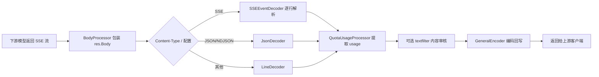
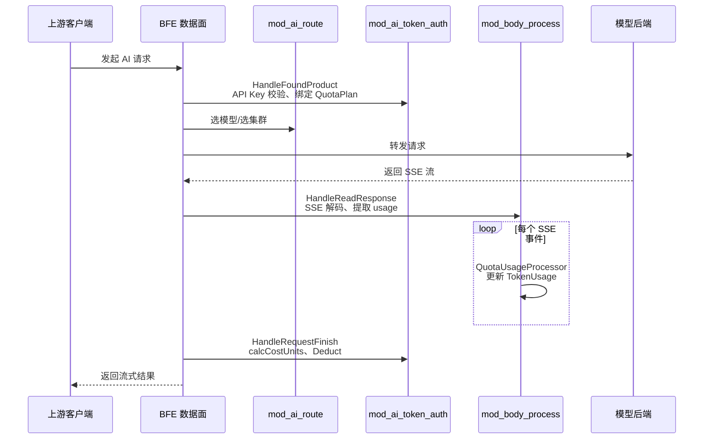

# 第三十二章 请求体处理模块实现：mod_body_process

## 本章目标

本章聚焦 BFE 数据面（Data Plane）中的 `mod_body_process` 模块，介绍它如何在 AI 请求转发过程中解析请求体与响应体，尤其是从 Server-Sent Events（SSE）流式响应中提取 Token 用量，并与 `mod_ai_token_auth` 协作完成配额扣减。阅读本章后，读者将能够：

- 理解 `mod_body_process` 在 BFE 模块链中的位置和生命周期。
- 掌握 SSE 解码、`QuotaUsage` 提取的实现细节。
- 理解流式与非流式场景下 Token 用量如何汇总到 `TokenUsage` 上下文。
- 了解 RMB 配额分时段定价如何与响应体处理联动。
- 理解内容审核（`textfilter`）如何与 Token 提取共享同一事件处理框架。

## mod_body_process 模块职责

`mod_body_process` 是 BFE 中负责请求体/响应体处理的通用模块，在 AI 网关场景下被赋予了三项核心职责：

1. **请求体处理**：在 `HandleAfterLocation` 阶段，根据规则对上行请求体做解码与加工。当前主要支持 `textfilter` 内容审核（`content_audit_process.go`）。
2. **响应体处理**：在 `HandleReadResponse` 阶段，对下游返回的响应体进行流式解码、Token 用量提取、内容审核等处理。
3. **Token 时间信息采集**：在 `HandleRequestFinish` 阶段计算 `TTFT`（Time To First Token）和 `TPOT`（Time Per Output Token），为可观测与限流提供依据。

与 `mod_ai_route`、`mod_ai_token_auth` 等 AI 专用模块不同，`mod_body_process` 的设计目标是“通用体处理框架”：它通过事件抽象把不同协议格式的数据统一为 `Event` 序列，再让处理器链消费这些事件。这种设计使得新增一种解码格式或新增一种处理逻辑（如敏感词过滤、日志脱敏）只需实现对应的 `EventDecoder` 或 `EventProcessor`，而不需要改动反向代理主体逻辑。

模块通过 `BodyProcessor` 结构将原始 `io.ReadCloser` 包装成支持“解码 → 处理 → 编码”的链式处理器。`BodyProcessor` 定义于 `bfe/bfe_modules/mod_body_process/body_process.go:30`，内部持有 `source`（原始流）、`buffer`（输出缓冲）、`decoder`（事件解码器）、`processors`（事件处理器数组）和 `encoder`（事件编码器）。

```go
// bfe/bfe_modules/mod_body_process/body_process.go
type BodyProcessor struct {
    source     io.ReadCloser
    buffer     *bytes.Buffer
    decoder    EventDecoder
    processors []EventProcessor
    encoder    EventEncoder
    err        error
    rejection  *RejectionError
    onReject   func(error, *BodyProcessor)
}
```

## 在 BFE 模块链中的位置

`mod_body_process` 在 `bfe/bfe_modules/bfe_modules.go:156` 中注册，位于 `mod_ai_route` 之后、`mod_ai_rate_limit` 之前。注册顺序如下：

```go
// bfe/bfe_modules/bfe_modules.go
mod_ai_token_auth.NewModuleAITokenAuth(), // 负责 API Key 校验与 QuotaPlan 绑定
mod_ai_route.NewModuleAiRoute(),          // 负责选模型/选集群
mod_body_process.NewModuleBodyProcess(),  // 负责响应体解析与 Token 提取
mod_ai_rate_limit.NewModuleAiRateLimit(), // 依赖 Token 计算结果做限流
```

`mod_body_process` 向 BFE 回调链注册了三个钩子：

| 回调阶段 | 函数 | 作用 |
|----------|------|------|
| `HandleAfterLocation` | `afterLocationHandler` | 匹配规则，为请求体/响应体准备 `BodyProcessor`。 |
| `HandleReadResponse` | `readResponseHandler` | 触发响应体处理，默认注入 `QuotaUsageProcessor`。 |
| `HandleRequestFinish` | `requestFinishHandler` | 记录 `TLastToken` 并计算 `TTFT`/`TPOT`。 |

> 注：`mod_ai_token_auth` 也在 `HandleReadResponse` 阶段执行（`bfe/bfe_modules/mod_ai_token_auth/mod_ai_token_auth.go:365`），负责非流式响应的整体读取与用量提取；而 `mod_body_process` 的 `readResponseHandler` 则优先处理流式响应。

### 配置加载与规则匹配

`mod_body_process` 的主配置文件为 `mod_body_process/mod_body_process.conf`，由 `ConfLoad`（`conf_mod_body_process.go:47`）加载；规则数据文件默认为 `mod_body_process/body_process.data`，由 `ProductRuleConfLoad`（`body_process_rule_load.go:183`）解析。规则文件采用 JSON 格式，顶层包含 `Version` 与 `Config`，`Config` 按产品线（product）组织规则列表。每条规则包含 `Cond`（BFE 条件表达式）、`RequestProcess` 与 `ResponseProcess` 配置：

```json
{
  "Version": "2025-01-01-000000",
  "Config": {
    "ai_product": [
      {
        "Cond": "req_ai_model_match()",
        "RequestProcess": {
          "Dec": "json",
          "Proc": [{"Name": "textfilter", "Params": ["http://audit-service:8080"]}]
        },
        "ResponseProcess": {
          "Dec": "sse",
          "Proc": [{"Name": "textfilter", "Params": ["http://audit-service:8080"]}]
        }
      }
    ]
  }
}
```

`BodyProcessConfig` 中 `Dec` 支持 `sse`、`line`、`json`，`Proc` 目前仅支持 `textfilter`。规则加载完成后存入 `ProcessRuleTable`（`body_process_rule_table.go:21`），运行时按 `req.Route.Product` 查找并按条件顺序匹配。

## SSE 流式响应解析

大语言模型普遍采用 SSE 协议返回流式结果。`mod_body_process` 中的 `SSEEventDecoder`（`bfe/bfe_modules/mod_body_process/llm_util.go:229`）基于 `bufio.Reader` 逐行读取，按 SSE 规范解析 `event:`、`id:`、`data:`、`retry:` 及注释字段，最终组装为 `SSEEvent`。

```go
// bfe/bfe_modules/mod_body_process/llm_util.go
type SSEEvent struct {
    ID        *string
    Event     *string
    DataLines [][]byte
    Retry     *int
    Comments  [][]byte
    RawLines  [][]byte
    raw       []byte
    dirty     bool
    truncated bool
    endstyle  string
}
```

`DoResponseProcess`（`body_process.go:295`）会根据配置或响应头自动选择解码器：

- 显式配置 `Dec == "sse"` 时使用 `NewSSEEventDecoder`。
- 响应 `Content-Type` 为 `text/event-stream`、`application/sse` 等时，`ContentTypeDecoder` 自动选择 SSE 解码器。
- 其他情况回退到行解码或 JSON 解码。

```go
// bfe/bfe_modules/mod_body_process/body_process.go
switch dec {
case "sse":
    bp.CreateEventDecoder(NewSSEEventDecoder)
case "line":
    bp.CreateEventDecoder(NewLineDecoder)
case "json":
    bp.CreateEventDecoder(NewJsonDecoder)
default:
    contentType := res.Header.Get("Content-Type")
    bp.CreateEventDecoder(func(source io.Reader) (EventDecoder, error) {
        return NewContentTypeDecoder(source, contentType)
    })
}
```

SSE 解码器会把每个 `data:` 行收集到 `DataLines`，遇到空行时输出一个事件；如果流在事件末尾没有空行结束，则将 `truncated` 标记为 `true`，仍然把已解析事件输出，避免丢失最后一个 chunk。

SSE 协议本身非常简单：每个事件由若干以换行符分隔的字段行组成，字段名与值之间用第一个冒号分隔，值前可选一个空格。`mod_body_process` 的解码器在实现时处理了几类边界情况：

- **注释行**：以 `:` 开头的行被视为注释，保存到 `Comments` 但不参与事件内容。
- **空行触发事件分发**：当读到空行且当前事件已累积内容时，立即输出该事件；否则继续读取，跳过心跳空行。
- **多行 data**：OpenAI 等厂商的 SSE 响应中，一个事件的 JSON 对象可能跨多行 `data:`，因此 `DataLines` 是数组，`GetData()` 用 `\n` 拼接。
- **流异常截断**：如果连接在事件未完整结束时断开，且事件已有内容，则标记 `truncated = true` 并输出，保证 `usage` 等末尾数据不被丢弃。
- **换行风格自适应**：解码器会检测 `\n` 或 `\r\n`，并在 `endstyle` 中记录，以便 `ToBytes()` 编码时保持原始风格。

### 流式响应处理流程



## Token 用量提取

无论流式还是非流式，最终目标都是把响应中的 Token 用量汇总到 `bfe_basic.TokenUsage`（`bfe/bfe_basic/request_ai_basic.go:57`）：

```go
// bfe/bfe_basic/request_ai_basic.go
type TokenUsage struct {
    PromptTokens      int64 // 输入 Token 数（含 cache_read/audio_input）
    CompletionTokens  int64 // 输出 Token 数（含 audio_output）
    CacheReadTokens   int64 // 缓存命中输入 Token
    CacheWriteTokens  int64 // 缓存写入 Token
    AudioInputTokens  int64 // 音频输入 Token
    AudioOutputTokens int64 // 音频输出 Token
    ImageCount        int64 // 图片生成数量
    UsedQuota         int64 // 已用 Token 配额
    UsedCost          int64 // 已用 RMB 成本，1 unit = 1e-8 元
}
```

`QuotaUsageProcessor`（`bfe/bfe_modules/mod_body_process/content_quota_usage.go:23`）是默认注入的响应事件处理器。它对每个事件调用 `Event.GetQuotaUsage()`，并把结果写入 `aiBasicInfo.GetTokenUsage()`。

`SSEEvent.GetQuotaUsage()` 与 `RawEvent.GetQuotaUsage()` 的实现逻辑一致（`llm_util.go:123`、`body_process.go:422`），都使用 `gjson` 从 JSON 中读取以下字段：

- OpenAI 风格：`usage.total_tokens`、`usage.prompt_tokens`、`usage.completion_tokens`。
- DeepSeek 缓存扩展：`usage.cache_read_tokens`、`usage.prompt_cache_hit_tokens`、`usage.prompt_tokens_details.cached_tokens`。
- Anthropic 风格：`usage.input_tokens`、`usage.output_tokens`、`usage.cache_read_input_tokens`、`usage.cache_creation_input_tokens`。
- 图片生成：`usage.image_count`、`data.#`。

```go
// bfe/bfe_modules/mod_body_process/llm_util.go
used := gjson.GetBytes(data, "usage.total_tokens").Int()
prompt := gjson.GetBytes(data, "usage.prompt_tokens").Int()
completion := gjson.GetBytes(data, "usage.completion_tokens").Int()

// DeepSeek fallback
if cacheRead == 0 {
    cacheRead = gjson.GetBytes(data, "usage.prompt_cache_hit_tokens").Int()
}

// Claude fallback
if prompt == 0 && completion == 0 {
    prompt = gjson.GetBytes(data, "usage.input_tokens").Int()
    completion = gjson.GetBytes(data, "usage.output_tokens").Int()
}
```

如果响应中始终没有 `usage` 字段，`IsGuess` 保持为 `true`，`CurrentTokens` 按 `EstimateContentToken` 估算，即内容长度除以 4（`llm_util.go:319`）。在 `QuotaUsageProcessor.Process` 中，当 `UsedQuota <= 0` 且允许估算时，会把估算值累加到 `CompletionTokens`。

提取逻辑采用“优先级 + fallback”策略，以兼容不同厂商的字段命名差异：

1. 优先读取 OpenAI 风格字段：`prompt_tokens`、`completion_tokens`、`total_tokens`。
2. 若 `prompt_tokens` 与 `completion_tokens` 均为 0，则回退到 Anthropic 风格：`input_tokens`、`output_tokens`。
3. 缓存命中字段同样存在多层 fallback：先读 `cache_read_tokens`，再读 DeepSeek 的 `prompt_cache_hit_tokens` 或 `prompt_tokens_details.cached_tokens`，最后读 Anthropic 的 `cache_read_input_tokens`。
4. 图片生成场景下，优先使用 `usage.image_count`，不存在时回退到 `data.#`（即 `data` 数组长度）。

这种分层 fallback 使得网关无需为每个模型单独配置字段映射，只要模型遵循主流约定即可自动识别。

### 提取规则要点

| 字段 | 来源 | 说明 |
|------|------|------|
| `input_tokens` | `usage.input_tokens` | Anthropic 风格输入 Token。 |
| `output_tokens` | `usage.output_tokens` | Anthropic 风格输出 Token。 |
| `prompt_tokens` | `usage.prompt_tokens` | OpenAI 风格输入 Token。 |
| `completion_tokens` | `usage.completion_tokens` | OpenAI 风格输出 Token。 |
| `total_tokens` | `usage.total_tokens` | 当存在时直接作为 `UsedQuota`。 |
| `cache_read_tokens` | 多源 fallback | 命中缓存的输入 Token，用于 RMB 分价计费。 |

## 与 mod_ai_token_auth 的协作

`mod_body_process` 本身不直接扣减配额，它只负责把 Token 用量写入请求上下文；真正的配额扣减由 `mod_ai_token_auth` 在 `HandleRequestFinish` 阶段完成。两者协作关系如下：

1. **请求阶段**：`mod_ai_token_auth.tokenFoundProductHandler` 校验 API Key，绑定 `QuotaPlan`，并在 `TokenAuthContext` 中缓存 `serverConf`（`mod_ai_token_auth.go:440`）。
2. **响应阶段**：
   - 非流式响应：`mod_ai_token_auth.tokenReadResponseHandler` 通过 `res.GetBodyAccessor()` 读取完整响应体，调用 `UpdateCtxByUsage` 填充 `TokenUsage`。
   - 流式响应：`mod_body_process.readResponseHandler` 包装 `res.Body`，由 `QuotaUsageProcessor` 在每个 SSE 事件中更新 `TokenUsage`。
3. **请求结束阶段**：`mod_ai_token_auth.tokenRequestFinishHandler` 计算 RMB 成本并执行配额扣减。

```go
// bfe/bfe_modules/mod_ai_token_auth/mod_ai_token_auth.go
if tokenUsage.UsedCost <= 0 && hasRMBPlan(ctx.Token.QuotaPlans) {
    tokenUsage.UsedCost = m.calcCostUnits(req, ctx.serverConf, tokenUsage)
}

costUnits := tokenUsage.UsedCost
if tokenUsage.UsedQuota > 0 || costUnits > 0 {
    for _, plan := range ctx.Token.QuotaPlans {
        if quota.IsRMB(plan.Unit) {
            if costUnits > 0 {
                plan.Deduct(m.redisClient, costUnits)
            }
        } else {
            if tokenUsage.UsedQuota > 0 {
                plan.Deduct(m.redisClient, tokenUsage.UsedQuota)
            }
        }
    }
}
```

这种分工保证了两点：

- `mod_body_process` 专注于协议解析与数据提取，不感知 Redis 或 QuotaPlan。
- `mod_ai_token_auth` 专注于配额与计费，不直接处理 SSE 协议细节。

### 模块协作时序



## RMB 配额扣减场景

当用户的 QuotaPlan 单位为 RMB 时，`mod_ai_token_auth` 在请求结束时根据 `TokenUsage` 和模型价格计算成本。RMB 成本计算涉及两个关键能力：

### 1. 分时段定价匹配

控制面导出的 `AIConf.ModelTable` 包含 `TimeZone` 与 `Tiers`（`ai-gateway-api/design-docs/sys-design/details/RMB配额分时段定价.md`）。BFE 加载后，`ActiveTierName` 根据当前请求时间匹配高峰/空闲 tier：

```go
// bfe/bfe_config/bfe_cluster_conf/cluster_conf/cluster_conf_load.go
func (table *ModelTable) ActiveTierName(now time.Time) string {
    t := now.In(table.tz)
    wd := int(t.Weekday())
    hour, min := t.Hour(), t.Minute()
    cur := hour*60 + min

    for i := range table.Tiers {
        tier := &table.Tiers[i]
        for _, tr := range tier.TimeRanges {
            if len(tr.Weekdays) > 0 && !containsInt(tr.Weekdays, wd) {
                continue
            }
            start := parseHHMM(tr.Start)
            end := parseHHMM(tr.End)
            if start <= cur && cur < end {
                return tier.Name
            }
        }
    }
    return ""
}
```

未命中任何 tier 时，使用默认 `Prices`。

### 2. 成本计算

`mod_ai_token_auth.calcCostUnits`（`mod_ai_token_auth.go:472`）查找目标模型价格，并根据 tier 选择对应价格键：

```go
// bfe/bfe_modules/mod_ai_token_auth/mod_ai_token_auth.go
entry := cluster_conf.LookupModelPrice(cluster.AIConf.ModelTable, targetModel, mode)
tierName := cluster.AIConf.ModelTable.ActiveTierName(time.Now())
cost := calcChatCost(entry, usage, tierName)
```

`calcChatCost` 支持普通输入/输出、缓存读写、音频输入/输出等多维度计费（`mod_ai_token_auth.go:531`）。成本以定点整数存储，`1 unit = 1e-8` 元，避免浮点误差。

### 3. 流式场景兼容性

RMB 配额扣减发生在 `HandleRequestFinish`，此时 `mod_body_process` 已经将所有 SSE 事件中的 `usage` 汇总到 `TokenUsage`。因此，无论响应是流式还是非流式，`mod_ai_token_auth` 都能在请求结束时获得完整的 Token 用量并计算成本。`bfe/AGENTS.md` 也特别提醒：修改 RMB 配额扣减时，需确保 `mod_body_process` 加载后流式场景仍然正常工作。

以一个具体场景为例：某 DeepSeek 模型在非高峰时段 `input_cost_per_token` 为 `0.0000015` 元/Token，高峰时段 `peak` tier 下为 `0.0000030` 元/Token。假设一次流式请求共消耗 1000 输入 Token 与 500 输出 Token，其中 200 为缓存命中：

- 若请求发生在高峰时段，`ActiveTierName` 返回 `"peak"`，`calcChatCost` 使用 `peak` 价格计算，成本约为 `(800 × 0.0000030 + 200 × cache_read_cost + 500 × output_cost)` 元。
- 若请求发生在非高峰时段，未命中 tier，回退到默认 `Prices`，成本按默认价格计算。

所有价格在被加载到 `ModelTable` 时已经通过 `PriceMap` 自定义 `MarshalJSON` 转换为定点整数（`1 unit = 1e-8` 元），因此运行时乘法与累加都是整数运算，既保证精度又提升性能。

## 关键代码片段

### 1. 响应体处理入口

```go
// bfe/bfe_modules/mod_body_process/body_process.go
func (m *ModuleBodyProcess) DoResponseProcess(req *bfe_basic.Request,
    res *bfe_http.Response, conf *BodyProcessConfig) *BodyProcessor {

    ccq := NewQuotaUsageProcessor(req, res)
    if conf == nil && ccq == nil {
        return nil
    }

    bp := NewBodyProcessor(res.Body)
    if ccq != nil {
        bp.AddProcessor(ccq)
    }
    // ... 选择 decoder/encoder
    res.Body = bp
    res.ContentLength = -1
    res.Header.Del("Content-Length")
    return bp
}
```

### 2. QuotaUsageProcessor 更新 TokenUsage

```go
// bfe/bfe_modules/mod_body_process/content_quota_usage.go
func (caf *QuotaUsageProcessor) Process(events []Event) ([]Event, error) {
    tctx := caf.aiBasicInfo.GetTokenUsage()
    for _, ev := range events {
        curCompletionToken := int64(0)
        if tctx.UsedQuota <= 0 {
            rquota := ev.GetQuotaUsage()
            curCompletionToken = rquota.CurrentTokens
            if !rquota.IsGuess {
                if rquota.ImageCount > 0 {
                    tctx.ImageCount = rquota.ImageCount
                    tctx.UsedQuota = rquota.ImageCount
                } else if rquota.UsedQuota > 0 {
                    tctx.CompletionTokens = rquota.CompletionTokens
                    tctx.PromptTokens = rquota.PromptTokens
                    tctx.CacheReadTokens = rquota.CacheReadTokens
                    tctx.UsedQuota = rquota.UsedQuota
                } else if rquota.PromptTokens > 0 || rquota.CompletionTokens > 0 {
                    tctx.UsedQuota = rquota.PromptTokens + rquota.CompletionTokens
                    // ...
                }
            }
        }
        if tctx.UsedQuota <= 0 && caf.aiBasicInfo.IsAllowEstimateToken() {
            if tctx.CompletionTokens == -1 {
                tctx.CompletionTokens = 0
            }
            tctx.CompletionTokens += curCompletionToken
        }
    }
    return events, nil
}
```

### 3. SSE 事件解码主循环

```go
// bfe/bfe_modules/mod_body_process/llm_util.go
func (d *SSEEventDecoder) Decode() ([]Event, error) {
    var ev SSEEvent
    ev.endstyle = "\n"
    for {
        line, err := d.r.ReadString('\n')
        if err != nil && len(line) == 0 {
            if ev.hasContent() {
                ev.truncated = true
                return []Event{&ev}, nil
            }
            if err == io.EOF {
                return []Event{}, nil
            }
            return nil, err
        }
        // 解析 event/id/data/retry/comment
        // ...
        if trimmed == "" {
            if ev.hasContent() {
                return []Event{&ev}, nil
            }
            continue
        }
    }
}
```

### 4. 模块注册

```go
// bfe/bfe_modules/bfe_modules.go
mod_ai_token_auth.NewModuleAITokenAuth(),
mod_ai_route.NewModuleAiRoute(),
mod_body_process.NewModuleBodyProcess(),
mod_ai_rate_limit.NewModuleAiRateLimit(),
```

## 本章小结

`mod_body_process` 是 AI 网关数据面中连接模型响应与配额计费的关键模块。本章要点如下：

- `mod_body_process` 在 `HandleAfterLocation` 准备处理器，在 `HandleReadResponse` 解析响应体，在 `HandleRequestFinish` 记录 Token 时间指标。
- 它通过 `BodyProcessor` 将解码、处理、编码抽象为事件流，支持 SSE、JSON/NDJSON、行模式等多种输入。
- `QuotaUsageProcessor` 默认注入响应处理链，负责从 SSE 事件或非流式 JSON 中提取 `input_tokens`、`output_tokens`、`total_tokens` 等用量信息，并写入 `TokenUsage` 上下文。
- RMB 配额扣减仍由 `mod_ai_token_auth` 在请求结束时完成；`mod_body_process` 只提供准确的 Token 用量数据，两者通过请求上下文解耦。
- 分时段定价的 tier 匹配在 BFE 侧通过 `ModelTable.ActiveTierName` 完成，成本计算使用定点整数避免浮点误差。

理解 `mod_body_process` 的实现，有助于在扩展新的模型协议、新的内容审核策略或新的计费维度时，保持数据面代码的清晰与可维护性。后续若需支持新的响应格式（如 protobuf 流、multipart），可在 `body_process.go` 中新增 `EventDecoder` 实现并接入 `ContentTypeDecoder` 的分发逻辑；若需新增体处理策略（如 PII 脱敏、关键词替换），则只需实现 `EventProcessor` 并在规则配置中注册即可。

## 参考文档

- `bfe/bfe_modules/mod_body_process/` — 模块完整源码。
- `bfe/bfe_modules/mod_ai_token_auth/mod_ai_token_auth.go` — API Key 校验、RMB 成本计算与配额扣减。
- `bfe/bfe_modules/bfe_modules.go` — BFE 模块注册顺序。
- `bfe/bfe_basic/request_ai_basic.go` — `TokenUsage`、`TokenTimeInfo` 定义。
- `bfe/AGENTS.md` — BFE 模块变更指南（AI gateway module changes 部分）。
- `ai-gateway-api/design-docs/api-define/InnerAPI接口定义/mod-body-process.md` — 控制面导出接口定义。
- `ai-gateway-api/design-docs/sys-design/details/RMB配额分时段定价.md` — RMB 分时段定价设计。
