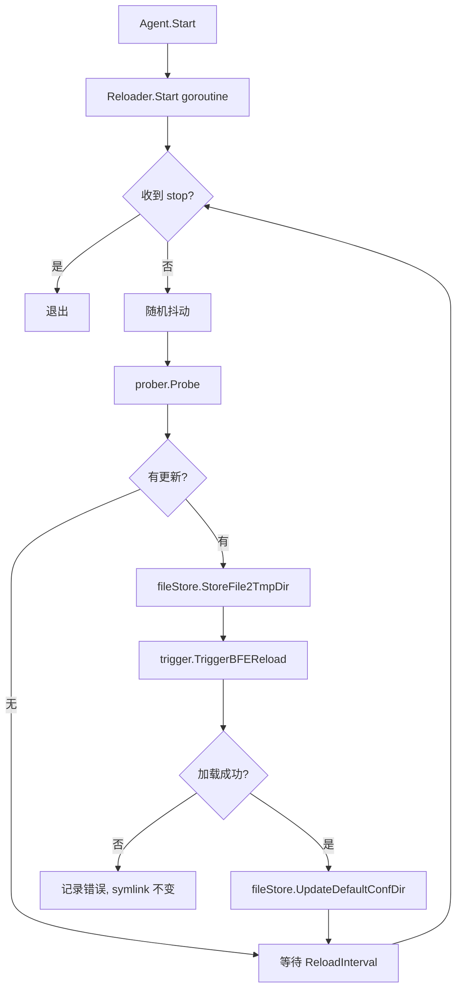
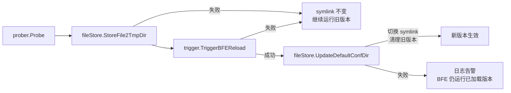

# 第三十三章 Conf Agent 实现

## 本章目标

Conf Agent（配置代理）是壬远 AI 网关控制面（Control Plane）与数据面（Data Plane）之间的配置投递纽带。本章将带领读者深入 Conf Agent 的源码实现，理解它如何周期性地从 AI Gateway API 拉取最新配置、如何在本地做版本化持久化、如何触发 BFE 热加载（Hot Reload），以及如何在失败时保留回滚空间、如何清理过期版本。

阅读完本章，你将能够：

- 说明 Conf Agent 各目录的职责与模块边界。
- 描述 `Agent`、`Reloader`、`prober`、`file_store`、`trigger` 的生命周期与协作关系。
- 解释普通配置任务、多 Key JSON 任务、附加文件任务三种拉取模式的适用场景。
- 掌握版本化目录、符号链接（symlink）切换、旧版本清理的实现细节。
- 识别失败回滚的关键路径与日志含义。

## Conf Agent 目录结构

Conf Agent 的代码位于仓库根目录的 `conf-agent/` 下。按照功能可划分为入口、编排、核心子系统、配置加载与工具库五层。

| 目录 | 职责 |
|------|------|
| `main.go` | 程序入口：解析命令行参数，加载 TOML 配置，初始化日志，创建并启动 `Agent`。 |
| `agent/` | 生命周期容器，负责创建、启动、停止所有 `Reloader`。 |
| `conf_reload/` | 单次 reload 编排，包含 `Reloader` 与 `prober`、`file_store`、`trigger` 三个子包。 |
| `conf_reload/prober/` | 从 AI Gateway API 拉取配置，支持普通任务、多 Key JSON 任务、附加文件任务。 |
| `conf_reload/file_store/` | 本地版本化存储：写临时目录、切换 symlink、清理旧版本、备份普通目录。 |
| `conf_reload/trigger/` | 调用 BFE monitor 端口的 `/reload/{module}` 接口触发热加载。 |
| `config/` | TOML 配置解析与 `ReloaderConfig` 构建。 |
| `xfile/` | 跨平台文件操作：复制、覆盖、symlink/junction。 |
| `xhttp/` | HTTP 请求装饰器与错误处理。 |
| `xlog/` | 结构化日志输出。 |

一个典型的生产配置文件见 `conf-agent/conf/conf-agent.toml`，其中为 `server_data_conf`、`mod_ai_route`、`mod_ai_token_auth` 等模块分别定义了 `Reloader`。

## Agent 与 Reloader 生命周期

### 启动流程

`conf-agent/main.go` 的启动逻辑非常清晰：

```go
conf, err := config.Init(filepath.Join(*confDir, *confFile))
if err != nil {
    exit(err)
}

if err := xlog.Init(conf.Logger); err != nil {
    exit(err)
}

agent, err := agent.New(conf.Reloaders)
if err != nil {
    exit(err)
}

agent.Start()
```

- `config.Init` 读取 TOML，合并 `Basic` 默认值与每个 `Reloader` 的独立配置，生成 `[]*config.ReloaderConfig`。
- `agent.New` 为每个 `ReloaderConfig` 创建一个 `conf_reload.Reloader`。
- `agent.Start` 在一个阻塞调用中启动所有 `Reloader` 的 goroutine，并等待 `<-agent.stop`。

### Agent 与 Reloader 的关系

`agent/agent.go` 中的 `Agent` 只持有 `stop` 通道与 `reloaders` 列表：

```go
type Agent struct {
    stop     chan bool
    stopOnce sync.Once
    reloaders []*conf_reload.Reloader
}

func (agent *Agent) Start() {
    for _, reloader := range agent.reloaders {
        go reloader.Start()
    }
    <-agent.stop
}

func (agent *Agent) Stop() {
    agent.stopOnce.Do(func() { close(agent.stop) })
    for _, reloader := range agent.reloaders {
        reloader.Stop()
    }
}
```

每个 `Reloader` 独立运行在自己的 goroutine 中，互不干扰；`Agent.Stop()` 通过 `sync.Once` 安全地关闭自身 stop 通道，再逐个调用 `Reloader.Stop()`，因此重复调用是幂等的。

### Reloader 主循环

`conf_reload/reloader.go` 中的 `Reloader.Start` 实现了固定间隔的轮询：

```go
func (r *Reloader) Start() {
    // 避免多个 Reloader 同时请求 API
    time.Sleep(time.Duration(rand.Int()%int(r.ReloadInterval/time.Millisecond)) * time.Millisecond)

    for {
        select {
        case <-r.stop:
            return
        default:
        }

        r.reload(xlog.NewContext(context.Background(), r.Name))

        select {
        case <-r.stop:
            return
        case <-time.After(r.ReloadInterval):
        }
    }
}
```

启动时的随机抖动（jitter）是为了避免所有 `Reloader` 在同一时刻向 AI Gateway API 发起请求，造成突发流量。

单次 reload 的编排顺序如下：

1. `prober.Probe(ctx)` 拉取最新配置。
2. 若没有任何更新，直接结束本轮。
3. `fileStore.StoreFile2TmpDir(ctx, version, files)` 将配置写入临时版本目录。
4. `trigger.TriggerBFEReload(ctx, version)` 通知 BFE 加载新版本。
5. `fileStore.UpdateDefaultConfDir(ctx, version)` 切换 symlink 指向新版本。

这一顺序是刻意设计的：BFE 先通过临时目录完成热加载验证，成功后 symlink 才指向新目录；如果 BFE 加载失败，symlink 仍指向旧版本，业务继续运行，不会受到影响。



## prober 拉取配置

`conf_reload/prober/prober.go` 定义了统一的 `Task` 接口：

```go
type Task interface {
    FetchConfFiles(ctx context.Context) ([]*FetchFileResult, error)
}

type FetchFileResult struct {
    Name    string
    Version string
    Content []byte
}
```

`Prober` 聚合三类任务，并在 `Probe` 中依次执行：

```go
func (prober *Prober) Probe(ctx context.Context) ([]*FetchFileResult, error) {
    result := []*FetchFileResult{}
    for _, p := range prober.tasks {
        fileList, err := p.FetchConfFiles(ctx)
        if err != nil {
            return nil, err
        }
        result = append(fileList, result...)
    }
    return result, nil
}
```

三类任务分别对应三种配置形态。

### 普通任务：NormalFileTask

普通任务（Normal File Task）用于“一个 API 返回一份配置文件”的场景，例如 `mod_ai_route` 的 `ai_route.data`。实现位于 `conf_reload/prober/task_normal.go`。

工作流程：

1. 从本地 `ConfDir/ConfFileName` 读取当前文件内容，计算本地版本号。
2. 向 `ConfAPI` 发起 GET 请求，携带 `version` 与 `bfe_cluster` 两个查询参数。
3. 若服务端返回 `null`，表示没有更新，返回空列表。
4. 否则提取响应中的 `Data` 字段，计算新版本号并返回。

版本号计算逻辑 `calculateVersion` 会解析 JSON 中的 `Version` 字段，并通过正则仅保留数字，确保按字典序即可比较版本新旧。

```go
func calculateVersion(fileContent []byte) (string, error) {
    tmp := struct {
        Version string
    }{}
    if err := json.Unmarshal(fileContent, &tmp); err != nil {
        return "", err
    }
    version := justKeepNumber(tmp.Version)
    if version == "" {
        version = "00000000000000"
    }
    return version, nil
}
```

### 多 Key JSON 任务：MultiKeyFileTask

多 Key JSON 任务（Multi-Key JSON File Task）用于“一个 API 返回多个子配置”的场景，例如 `server_data_conf` 的一个接口同时返回 `host_rule.data`、`route_rule.data`、`cluster_conf.data`。实现位于 `conf_reload/prober/task_multip_key.go`。

这种任务的优势在于减少网络往返：原本需要三次 API 调用才能拿到的配置，现在只需一次请求即可全部获取。它要求服务端将多个子配置打包到一个 JSON 对象中返回，且每个子配置都包含独立的 `Version` 字段，便于 Conf Agent 判断每个文件是否需要更新。

配置通过 `Key2ConfFile` 映射将 JSON 顶层字段名映射到本地文件名：

```toml
[[Reloaders.server_data_conf.MultiKeyFileTasks]]
ConfAPI         = "/inner-api/v1/configs/tls_conf/server_data_conf"
Key2ConfFile    = {"HostTable" = "host_rule.data", "RouteTable" = "route_rule.data", "ClusterConf" = "cluster_conf.data"}
```

拉取时，`MultiKeyFileTask` 会取所有映射文件中的最大版本作为本地版本，请求一次 API 后按 `Key2ConfFile` 拆分出多份 `FetchFileResult`。

### 附加文件任务：ExtraFileTask

附加文件任务（Extra File Task）用于“主配置中通过 JSON Path 引用额外文件”的场景，例如 TLS 证书配置 `server_cert_conf.data` 中引用了证书文件和私钥文件。实现位于 `conf_reload/prober/task_extra.go`。

`ExtraFileTask` 内部复用 `NormalFileTask` 拉取主配置，再用 `ojg` 库的 JSON Path 表达式从主配置中提取额外文件路径：

```go
for _, pattern := range prober.config.JSONPaths {
    results := pattern.Get(jsonData)
    for _, result := range results {
        fileName := fmt.Sprintf("%v", result)
        remote, local, err := removeDirVersionInfo(fileName)
        if err != nil {
            return nil, err
        }
        remotePath2localPath[remote] = local
    }
}
```

`removeDirVersionInfo` 将 `{module}_{version}/xxxx` 形式的远程路径转换为 `{module}/xxxx`，本地路径则去掉 `{module}_{version}/` 前缀，从而保证 BFE 始终读取到无版本信息的稳定文件名。

最终 `ExtraFileTask` 会返回主配置文件 + 所有额外文件，统一交给 `file_store` 处理。

## file_store 版本化存储与 symlink 切换

`conf_reload/file_store/file_store.go` 负责把 `prober` 拿到的配置写入磁盘，并管理 BFE 实际读取的目录视图。核心数据结构如下：

```go
type FileStore struct {
    ConfDir          string
    CopyFiles        []string
    VersionKeepCount int
}
```

- `ConfDir`：BFE 读取配置时使用的目录名，例如 `/home/work/bfe/conf/mod_ai_route`。
- `CopyFiles`：每次生成新版本时需要从当前 `ConfDir` 复制到新版本的文件或目录，用于保留无法通过 API 获取的静态配置。例如 `mod_ai_route` 的 `mod_ai_route.conf` 通常由运维人员手写，不会从控制面下发，因此需要列入 `CopyFiles`。
- `VersionKeepCount`：保留的版本目录数量，至少为 1。设置为 2 时，磁盘上通常同时存在当前版本和上一个版本，便于紧急回滚。

### 写入临时版本目录

`StoreFile2TmpDir` 每次都会先删除旧临时目录，再创建新版本目录 `ConfDir_{version}`，然后依次完成：

1. 将 `CopyFiles` 从当前 `ConfDir` 递归复制到临时目录。
2. 将 `prober` 返回的文件内容以格式化后的 JSON 写入临时目录。
3. 写入 `.conf-agent-version` 标记文件，用于后续识别哪些目录是 Conf Agent 管理的版本目录。

```go
func (fileStore *FileStore) StoreFile2TmpDir(ctx context.Context, version string, files map[string][]byte) error {
    tmpDir := fileStore.tmpDir(version)

    os.RemoveAll(tmpDir)
    os.MkdirAll(tmpDir, os.ModePerm)

    for _, copyFile := range fileStore.CopyFiles {
        file := filepath.Join(fileStore.ConfDir, copyFile)
        xfile.FileCopyRecursive(file, tmpDir)
    }

    for fileName, fileContent := range files {
        formattedContent := formatJSONWithIndent(fileContent)
        xfile.FileOverwrite(filepath.Join(tmpDir, fileName), formattedContent)
    }

    fileStore.writeVersionMarker(tmpDir, version)
    return nil
}
```

### 切换 symlink

`UpdateDefaultConfDir` 将 `ConfDir` 切换为指向新版本的 symlink（Windows 下使用目录 junction）。它会先处理 `ConfDir` 的现有状态：

- 如果已经是 symlink：删除 symlink 本身，保留旧目标目录。
- 如果是普通目录：重命名为 `ConfDir_{timestamp}.backup`，避免误删用户原有配置。
- 如果是其他类型文件：直接删除。
- 如果不存在：直接创建新 symlink。

随后调用 `xfile.FileLink` 创建 `ConfDir -> ConfDir_{version}` 的链接，并触发旧版本清理。

```go
func (fileStore *FileStore) UpdateDefaultConfDir(ctx context.Context, version string) error {
    info, err := os.Lstat(fileStore.ConfDir)
    switch {
    case err == nil:
        if info.Mode()&os.ModeSymlink != 0 {
            os.Remove(fileStore.ConfDir)
        } else if info.IsDir() {
            backupDir := fileStore.ConfDir + "_" + strconv.FormatInt(time.Now().Unix(), 10) + ".backup"
            os.Rename(fileStore.ConfDir, backupDir)
        } else {
            os.RemoveAll(fileStore.ConfDir)
        }
    case os.IsNotExist(err):
    default:
        os.RemoveAll(fileStore.ConfDir)
    }

    xfile.FileLink(fileStore.tmpDir(version), fileStore.ConfDir)
    fileStore.cleanupOldVersions(ctx, fileStore.VersionKeepCount)
    return nil
}
```

### 版本目录布局示例

一次成功切换后，磁盘上的目录结构可能如下：

```text
/home/work/bfe/conf/
├── mod_ai_route -> mod_ai_route_20260101120003   (symlink)
├── mod_ai_route_20260101120002/
│   ├── .conf-agent-version
│   └── ai_route.data
├── mod_ai_route_20260101120003/
│   ├── .conf-agent-version
│   └── ai_route.data
└── mod_ai_route_xxxxxxxxx.backup/                 (首次部署时由普通目录迁移而来)
```

## trigger 触发 BFE 热加载

`conf_reload/trigger/trigger.go` 负责调用 BFE 的 monitor 端口热加载接口。BFE 的 reload URL 格式为：

```text
http://127.0.0.1:{BFEMonitorPort}/reload/{module}?path={confDir}_{version}[/{ReloadFile}]
```

`Trigger.TriggerBFEReload` 组装上述 URL，向 BFE 发起 GET 请求，并校验响应 JSON 中的 `error` 字段：

```go
func (trigger *Trigger) TriggerBFEReload(ctx context.Context, version string) error {
    confDir := trigger.c.ConfDir + "_" + version
    if trigger.c.ReloadFile != "" {
        confDir = path.Join(confDir, trigger.c.ReloadFile)
    }

    query := url.Values{}
    query.Add("path", confDir)
    api := fmt.Sprintf("%s?%s", trigger.c.BFEReloadAPI, query.Encode())

    rsp := &struct {
        Error string `json:"error"`
    }{}

    req := xhttp.NewHTTPRequest().
        Decorate(
            xhttp.HTTPRequestTimeoutOp(trigger.c.BFEReloadTimeout),
            xhttp.SimpleRequestOp(http.MethodGet, api, nil),
        ).
        Do().
        Decorate(
            xhttp.RspBodyRawReaderOp,
            xhttp.RspCode200Op,
            xhttp.RspBodyJSONReader(rsp),
        )

    if req.Err() != nil {
        return req.Err()
    }
    if rsp.Error != "" {
        return fmt.Errorf("reload fail, rsp: %s", string(req.RawContent))
    }
    return nil
}
```

注意 `ReloadFile` 的作用：某些 BFE 模块（如 `mod_ai_route`）要求 `path` 指向具体的数据文件而不是目录，因此配置中通过 `ReloadFile = "ai_route.data"` 指定最终文件路径。

## 清理旧版本与失败回滚

### 清理旧版本

`cleanupOldVersions` 会扫描 `ConfDir` 父目录下所有以 `ConfDir_` 开头、包含 `.conf-agent-version` 标记、且不是 `.backup` 的目录，按修改时间排序后保留最新的 `VersionKeepCount` 个，删除其余版本。当前 symlink 指向的版本永远不会被删除。

```go
func (fileStore *FileStore) cleanupOldVersions(ctx context.Context, keep int) error {
    parentDir := filepath.Dir(fileStore.ConfDir)
    baseName := filepath.Base(fileStore.ConfDir)
    currentTarget, _ := filepath.EvalSymlinks(fileStore.ConfDir)

    entries, _ := os.ReadDir(parentDir)
    var versions []versionDir
    for _, entry := range entries {
        if !entry.IsDir() { continue }
        name := entry.Name()
        if !strings.HasPrefix(name, baseName+"_") { continue }
        if strings.HasSuffix(name, ".backup") { continue }

        dirPath := filepath.Join(parentDir, name)
        if _, err := os.Stat(filepath.Join(dirPath, versionMarkerFile)); err != nil {
            continue
        }

        absDirPath, _ := filepath.Abs(dirPath)
        absCurrent, _ := filepath.Abs(currentTarget)
        if absDirPath == absCurrent { continue }

        info, _ := entry.Info()
        versions = append(versions, versionDir{path: dirPath, modTime: info.ModTime()})
    }

    sort.Slice(versions, func(i, j int) bool {
        return versions[i].modTime.After(versions[j].modTime)
    })

    for i, v := range versions {
        if i < keep-1 { continue }
        os.RemoveAll(v.path)
    }
    return nil
}
```

版本标记文件 `.conf-agent-version` 是安全清理的关键：它确保 Conf Agent 不会误删用户手动创建或 BFE 自身生成的其他目录。`.backup` 目录的排除规则则保护了首次部署时由普通目录迁移而来的历史配置。

### 失败回滚

Conf Agent 的回滚机制依赖“先验证、后切换”的顺序：

1. `StoreFile2TmpDir` 失败：临时目录未就绪，symlink 不动，BFE 仍读取旧版本。
2. `TriggerBFEReload` 失败：BFE 返回错误或非 200 状态码，函数直接返回错误，`UpdateDefaultConfDir` 不会执行，symlink 仍指向旧版本。
3. `UpdateDefaultConfDir` 失败：BFE 可能已经加载成功，但 symlink 未切换；此时 BFE 内部持有的是临时目录路径，不影响运行，但 Conf Agent 日志会记录 `UpdateDefaultConfDir fail`，需要人工排查文件系统权限或磁盘空间。

因此，只要 `Reloader.reload` 在 `TriggerBFEReload` 之前失败，数据面都不会受到影响；symlink 作为 BFE 重启时的稳定入口，始终指向最后一个 Conf Agent 确认成功的版本。



### 运维视角

从运维排查角度，Conf Agent 的日志通常能直接定位问题阶段：

- `probe fail`：检查 Conf Agent 到 AI Gateway API 的网络连通性、Token 授权、`bfe_cluster` 参数是否匹配。
- `StoreFile2TmpDir fail`：检查本地磁盘空间、`CopyFiles` 中指定的文件是否存在于当前 `ConfDir`、文件系统权限。
- `TriggerBFEReload fail`：检查 BFE monitor 端口是否监听、`BFEReloadAPI` 路径是否正确、BFE 加载数据文件时是否报格式错误。
- `UpdateDefaultConfDir fail`：通常是 symlink/junction 创建失败，检查目录权限、目标目录是否被占用。

当日志中出现 `reload succ update` 时，表示 prober、file_store、trigger、symlink 切换均已完成，旧版本将在下一轮清理中被回收。

## 关键代码片段

### 入口与启动

```go
// conf-agent/main.go
conf, err := config.Init(filepath.Join(*confDir, *confFile))
agent, err := agent.New(conf.Reloaders)
agent.Start()
```

### Reloader 编排

```go
// conf-agent/conf_reload/reloader.go
fileList, err := r.prober.Probe(ctx)
if err != nil { /* log and return */ }

err = r.fileStore.StoreFile2TmpDir(ctx, version, files)
if err != nil { /* log and return */ }

err = r.trigger.TriggerBFEReload(ctx, version)
if err != nil { /* log and return */ }

err = r.fileStore.UpdateDefaultConfDir(ctx, version)
if err != nil { /* log and return */ }
```

### 普通任务版本协商

```go
// conf-agent/conf_reload/prober/task_normal.go
params := url.Values{}
params.Add("version", localVersion)
params.Add("bfe_cluster", config.BFECluster)
requestURL := apiURL + "?" + params.Encode()
```

### 跨平台 symlink/junction

```go
// conf-agent/xfile/file.go
if runtime.GOOS == "windows" && targetInfo.IsDir() {
    cmd := exec.Command("cmd", "/c", "mklink", "/J", absLinkName, absTarget)
    // ...
} else {
    relTarget, _ := filepath.Rel(filepath.Dir(linkName), target)
    os.Symlink(relTarget, linkName)
}
```

## 本章小结

Conf Agent 是壬远 AI 网关实现“控制面下发、数据面无中断加载”的关键组件。本章围绕其源码实现，重点阐述了以下内容：

- **目录与模块划分**：`main.go`、`agent`、`conf_reload` 三个层级各司其职，`prober`、`file_store`、`trigger` 完成拉取、存储、触发三步。
- **生命周期**：`Agent` 管理多个 `Reloader` goroutine，每个 `Reloader` 按 `ReloadInterval` 轮询，启动时加入随机抖动避免惊群。
- **配置拉取**：普通任务一对一拉取；多 Key JSON 任务从一个大 JSON 中拆分多个文件；附加文件任务通过 JSON Path 解析并下载证书等额外资源。
- **版本化存储**：每次生成 `ConfDir_{version}` 临时目录，写入 `.conf-agent-version` 标记；切换时通过 symlink/junction 原子指向新版本。
- **热加载触发**：`trigger` 调用 BFE monitor 端口的 `/reload/{module}`，并在 URL 中传递临时目录路径。
- **清理与回滚**：`VersionKeepCount` 控制保留版本数；失败发生在 symlink 切换前不会影响数据面，symlink 切换失败则保留 BFE 已加载版本并记录日志。

理解 Conf Agent 的实现，有助于运维人员排查“配置未生效”“回滚失败”“版本目录膨胀”等问题，也为后续扩展新的配置任务类型提供了清晰的修改路径。

## 参考文档

- `conf-agent/AGENTS.md`
- `conf-agent/main.go`
- `conf-agent/agent/agent.go`
- `conf-agent/conf_reload/reloader.go`
- `conf-agent/conf_reload/prober/prober.go`
- `conf-agent/conf_reload/prober/task_normal.go`
- `conf-agent/conf_reload/prober/task_multip_key.go`
- `conf-agent/conf_reload/prober/task_extra.go`
- `conf-agent/conf_reload/file_store/file_store.go`
- `conf-agent/conf_reload/trigger/trigger.go`
- `conf-agent/config/config.go`
- `conf-agent/config/config_file.go`
- `conf-agent/xfile/file.go`
- `conf-agent/conf/conf-agent.toml`
- `conf-agent/conf_reload/file_store/file_store_test.go`
