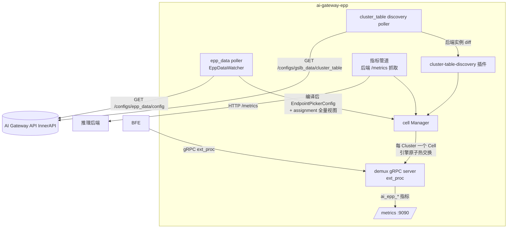
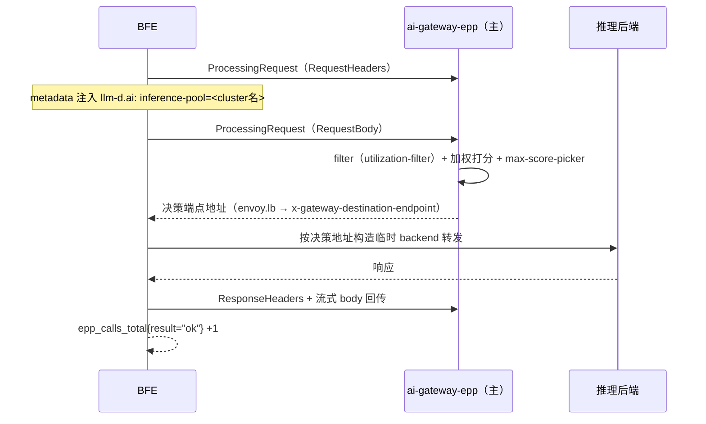

# 第三十六章 EPP组件实现

## 本章目标

EPP 智能调度横跨三个代码仓库：控制面 ai-gateway-api、数据面 BFE、调度器 ai-gateway-epp。本章从实现视角逐一讲解三侧的代码组织与关键路径：

- ai-gateway-epp 的进程结构：命令行参数、双 poller + Cell 引擎架构、与 AI Gateway API InnerAPI 的交互；
- ai-gateway-api 的控制面实现：实例池与分配的模型层、编译器、OpenAPI 与 InnerAPI 接口层、cluster 集成与配置导出；
- BFE 的数据面实现：`GslbBasic` EPP 字段解析、ext_proc gRPC 客户端、EPPCheck 滞回切换、失败回退与指标埋点。

设计语义与运维操作分别见 [第十六章 EPP智能调度设计](../design/chapter16-epp-scheduling-design.md) 与 [第二十六章 EPP调度配置与运维](../operation/chapter26-epp-scheduling-operation.md)。

---

## ai-gateway-epp 组件概览

ai-gateway-epp 是基于 llm-d EPP 的多 Cluster 调度器：它以配置驱动方式运行（不依赖 Kubernetes CRD），消费 AI Gateway API InnerAPI 导出的调度配置与分配视图，经 gRPC ext_proc 协议向 BFE 提供后端选择决策。代码位于 `ai-gateway-epp/` 仓库。

### 命令行参数

入口为 `cmd/epp/main.go`，参数解析在 `cmd/epp/config.go` 的 `parseConfig`：

| 参数 | 默认值 | 说明 |
|------|--------|------|
| `-api-addr` | `http://127.0.0.1:8181/inner-api/v1` | InnerAPI 基础地址 |
| `-api-token` | 环境变量 `AI_GATEWAY_EPP_TOKEN` | InnerAPI 鉴权 Token |
| `-instance-id` | 环境变量 `AI_GATEWAY_EPP_INSTANCE_ID`，缺省 hostname | 实例 id，与 `/epp-pool` 登记的实例 id 匹配定位角色 |
| `-poll-interval` / `-poll-timeout` | `5s` / `3s` | InnerAPI 轮询间隔与单次超时 |
| `-grpc-port` / `-health-port` / `-metrics-port` | `9002` / `9003` / `9090` | ext_proc、健康检查、指标三个服务端口号 |
| `-grpc-tls-cert` / `-grpc-tls-key` | 空（明文） | ext_proc 与 health gRPC 服务端 TLS |
| `-bind-address` | 空（全部网卡） | 监听地址 |
| `-default-pool` | 空 | 请求缺失 inference-pool metadata 时的兜底 Cluster（空 = 拒绝） |
| `-engine-drain-timeout` | `60s` | 引擎热交换时旧引擎的在飞请求 drain 上限 |
| `-refresh-metrics-interval` | `50ms` | 后端 `/metrics` 指标抓取周期 |

### 双 poller + Cell 引擎架构

进程内运行两个 poller，均基于 `pkg/poller/poller.go` 的 `Source[T]` 增量轮询框架（version 协商、`Data==null` 跳过、失败退避、fail-static 保留本地已知配置）：

两个 poller 的分工：

- **epp_data poller**（`pkg/poller/epp_data.go` 的 `EppDataWatcher`）：单次拉取同时获得两段配置。对 assignment 全量视图以 `-instance-id` 自匹配角色（`resolveRole` 纯函数：primary 命中 → `RolePrimary`，standby 命中 → `RoleStandby`，均未命中 → `RoleNone` 跳过），再与本地 Cell 集合 diff，驱动 `pkg/cell/manager.go` 的 `Ensure` / `Promote` / `Demote` / `Drop`。`epp_config` 段与 assignment 段在同一 version 快照内处理，两段天然一致。本实例无任何角色时置 `ai_epp_assignment_no_match` 指标，便于部署排查 id 配错。
- **cluster_table discovery poller**（`pkg/poller/discovery.go`）：把 cluster_table 导出的后端实例列表 diff 为各 Cluster 的端点集合；`Weight==0` 的实例视为摘流直接跳过，已从导出中消失的实例随之摘除。

Cell 引擎的热交换在 `pkg/cell/manager.go`：epp_config 变化时按 Cluster 重新编译引擎（`pkg/cell/compile.go`，llm-d loader 加载完整 `EndpointPickerConfig`），hash 比对后原子换指针，旧引擎 drain（默认 60 秒）后销毁；单个 Cluster 编译失败只影响该 Cluster（沿用旧引擎），不波及其他 Cluster。

demux（`pkg/demux/server.go`）是 ext_proc gRPC 服务端：从首个消息的 `MetadataContext` 提取 `llm-d.ai → inference-pool`（即 Cluster 名）路由到对应 Cell；非 primary Cell 返回 `ErrCellDraining`（BFE 据此把 `cell is not serving` 归类为 draining 错误并在下一地址重试）；决策结果经响应 `dynamic_metadata` 的 `envoy.lb → x-gateway-destination-endpoint` 返回。

---

## 控制面实现：ai-gateway-api

### model/epp_pool：实例池、分配器与编译器

模型层代码集中在 `ai-gateway-api/model/epp_pool/`，存储层在 `ai-gateway-api/storage/rdb/epp_pool/`（DAO 操作 `epp_instances`、`epp_assignments` 两张表）：

| 文件 | 职责 |
|------|------|
| `epp_pool.go` | 实例池读写：`/epp-pool` 的 GET/PATCH 语义（全量替换 `epp_instances`）与字段校验（组名唯一、id 唯一、`(host,port)` 唯一、组规模） |
| `epp_config.go` | `epp_config` 简化形态的结构定义与字段校验（枚举、范围、秒数取值、session 亲和成对规则） |
| `compiler.go` | 编译器：把简化 `epp_config` 确定性展开为完整 `EndpointPickerConfig`——固定注入 `cluster-table-discovery` / `utilization-filter` / scorer / `max-score-picker` / `openai-parser`，按档位与 `cache_affinity` 映射 (kv, queue) 权重，按开关条件注入亲和 scorer，展开 `flowControl` 段与 `featureGates`；规则以代码模板固化并有单测覆盖 |
| `assignment.go` | 分配器：贪心 + 确定性 tie-break 的选组选主算法，upsert `epp_assignments`（只存 primary_instance_id） |
| `reconciler.go` | 周期对账（30 秒，可配）：扫描全部 `balance_mode=EPP` 的 Cluster，对无有效分配或分配悬空者自动修复（组内重选 → 跨组重分配 → 清除分配），幂等，大部分轮次零写入 |
| `epp_data.go` | epp_data generator：导出时合并两段配置——epp_config 段（按 Cluster 编译）+ assignment 段（`epp_assignments` 与 `epp_instances` 读时 join 的全量视图，单实例组 `standby=null`），走 `VersionControlManager.ExportConfig` 框架（topic `ConfigTopicEppData`，MD5 签名 + version 增量） |

### 接口层

| 目录 | 端点 | 实现 |
|------|------|------|
| `endpoints/openapi_v1/epp_pool/` | `GET` / `PATCH /open-api/v1/epp-pool` | `get.go`、`patch.go`；单例资源，池名取自配置项 `RunTime.DefaultEPPInstancePoolName`（默认 `EPP.pool`）；PATCH 校验后全量替换并触发分配悬空自动修复 |
| `endpoints/openapi_v1/epp_assignments/` | `GET /open-api/v1/epp-assignments`、`PUT /open-api/v1/epp-assignments/{cluster}` | `get.go`、`put.go`；GET 返回读时 join 的展开视图（含 `degraded` 标记、`unassigned_clusters`、`idle_groups`）；PUT 手工覆写并校验 primary 存在于组实例列表，bump server_data_conf version |
| `endpoints/innerapi_v1/epp_data/` | `GET /inner-api/v1/configs/epp_data/config` | `export.go`；鉴权沿用 `FeatureRoute + ActionExport`，`version` 增量（未变化返回 `Data: null`） |
| `endpoints/openapi_v1/product_cluster/` | `POST/PUT /open-api/v1/clusters` | `create.go`、`update_basic.go`；请求体解析 `balance_mode` 与 `epp_config` 并执行条件必填与字段校验 |

### cluster 集成与配置导出

- `model/icluster_conf/cluster.go`：创建路径按 `balance_mode` 生成 `Role=EPP` 类型的实例池，并照常把 Provider `instance_pool` 实例灌入池中（供 cluster_table 导出与 BFE 兜底 WRR）；`getBalanceMode()` 直读 `balance_mode` 字段，是 EPP 模式的唯一判定来源；`ProviderInstancePoolSyncer` 在 Provider 实例池变更（如某实例 `weight=0`）时同步到所有引用该 Provider 的 Cluster，含 EPP 池。
- `model/icluster_conf/exporter.go`：cluster_table 导出，EPP 池实例照常进入导出列表（`Weight=0` 即摘流）。
- `model/iroute_conf/exporter.go`：server_data_conf 导出。EPP 模式 Cluster 有有效分配时导出 `GslbBasic.BalanceMode=EPP` 与有序 `EPPAddr=[主,备]`（地址由 `epp_assignments` 驱动、经 `net.JoinHostPort` 拼接）；无有效分配时该 Cluster 降级导出为 `BalanceMode=WRR`、不生成 `EPPAddr`，同时输出 error 级日志（含 Cluster 名与原因），不阻塞整份下发。

---

## 数据面实现：BFE

BFE 侧的实现集中在配置解析、负载均衡与反向代理三个位置。

### 配置解析与校验

`bfe/bfe_config/bfe_cluster_conf/cluster_conf/cluster_conf_load.go`：

- `BalanceModeEPP = "EPP"` 枚举（`:66`）；`GslbBasicConf` 携带 `EPPAddr *[]string`（有序主备）与 `EPPCheck` / `EPPTimeout` / `EPPTLS` / `EPPBreaker` 四个可选结构（`:423-432`），全部带缺省值；
- EPP 模式校验（`:785` 起）：`BalanceMode=EPP` 时 `EPPAddr` 非空（`:786`），`checkEPPAddrs` 校验元素为 `host:port` 且列表内去重（`:822`），`EPPCheckConfCheck` / `EPPTimeoutConfCheck` / `EPPTLSConfCheck` 填充缺省并校验（`Insecure=false` 时 `CAFile` 必须可读）；
- 校验失败走 fail-fast：该次 reload 报错拒绝、保留旧配置生效，不静默降级。

### ext_proc 调用与调度接入

- `bfe/bfe_util/epp/epp_client.go`：ext_proc gRPC 客户端。每 EPP 地址维护长连接（stream 按请求建立）；首个 `ProcessingRequest` 由 `BuildEnvoyGRPCHeaders` 构造请求头，并注入 `MetadataContext.FilterMetadata["llm-d.ai"] = {"inference-pool": <cluster名>}`；响应路径经 `EppResponseBodyFilter` 流式回传 body，回传采用有界缓冲，溢出时整流放弃并计数打点，保证 EndOfStream 一定送达。
- `bfe/bfe_balance/bal_gslb/bal_gslb.go`：`BalanceGslb` 持有 `eppAddrs` 有序地址表与活跃索引。`initEPP` / `closeEPP`（`:124-168`）管理连接与每个地址的后台健康检查 goroutine（gRPC health，参数来自 `EPPCheck`）；`chooseBackendFromEPP`（`:173-277`）构造并发送首个 ext_proc 消息，等待决策；`BalanceEpp`（`:492-528`）把 EPP 决策地址映射为本地后端构造临时 backend；`SetGslbBasic`（`:88-111`）按 `BalanceMode` 分发——EPP 构建/刷新地址状态机，非 EPP 关闭 EPP 连接。
- `bfe/bfe_server/reverseproxy.go`（`:345-355`）：请求侧接入。EPP 模式调 `BalanceEpp`；失败回退本地 `Balance()`（WRR）；重试复用同连接建新 stream。
- 滞回状态机：活跃地址连续失败 `FailThreshold` 次 failover 到下一地址，进入 `Cooldown` 冷却期不回切；冷却期后更高优先级地址连续通过 `SuccessThreshold` 次检查才 failback。对 `Unavailable / cell is not serving` 与 `unknown inference pool` 错误不等健康检查周期，直接在同 Cluster 的下一地址重试该请求。

一次 EPP 调用的时序如下：

### 指标埋点

`bfe/bfe_balance/bal_gslb/epp_metrics.go` 以 Prometheus CounterVec/GaugeVec 实现带 label 指标，经 `bfe/bfe_server/web_server.go` 注册的 `/monitor/epp_metrics` 输出文本格式：

- `epp_calls_total{cluster,result}`：result ∈ `ok` / `no_pool` / `unknown_pool` / `draining` / `transport`；
- `epp_fallback_local_total{cluster}`：回退本地 WRR 次数；
- `epp_failover_total{cluster}` / `epp_failback_total{cluster}` / `epp_active_addr_index{cluster}`。

---

## EPP 侧实现：ai-gateway-epp

| 位置 | 职责 |
|------|------|
| `pkg/poller/poller.go` | `Source[T]` 轮询框架：version 增量、失败退避、fail-static；指标 `ai_epp_poller_last_sync_timestamp` / `ai_epp_poller_failures_total` / `ai_epp_poller_backoff_state` |
| `pkg/poller/epp_data.go` | `EppDataWatcher`：消费 `/configs/epp_data/config` 两段配置；`resolveRole` 以 `-instance-id` 自匹配角色；assignment diff 驱动 `Manager.Ensure/Promote/Demote/Drop`；`ai_epp_assignment_no_match` 指标 |
| `pkg/poller/discovery.go` | cluster_table 轮询与后端实例 diff；`Weight==0` 跳过（摘流），消失实例摘除 |
| `pkg/innerapi/client.go` | InnerAPI HTTP 客户端：`{ErrNum, ErrMsg, Data, WorkMode}` envelope、`?version=` 增量、`Data==null` 语义；`EppDataConfigPath = "/configs/epp_data/config"` |
| `pkg/cell/manager.go` | Cell 生命周期与引擎原子热交换（hash 比对 → 编译 → 换指针 → 旧引擎 drain 销毁）；`ai_epp_engine_reloads_total` / `ai_epp_cell_state` |
| `pkg/cell/compile.go` | 以 llm-d loader 加载编译后的 `EndpointPickerConfig`；单 Cluster 编译失败沿用旧引擎（防御兜底） |
| `pkg/demux/server.go` | ext_proc gRPC server：`extractPool` 从 metadata 提取 inference-pool 路由 Cell；非 primary 返回 `ErrCellDraining`；决策地址写入 `envoy.lb → x-gateway-destination-endpoint` |
| `cmd/epp/plugins.go` | 插件注册：`prefix-cache-scorer`、`session-affinity-scorer`、`flowcontrol` 插件族、`approx-prefix-cache` producer、`cluster-table-discovery`；`flowControl` feature gate 默认关闭，由配置 `featureGates` 启用 |
| `cmd/epp/main.go` | 组装：解析配置 → 建 InnerAPI client → 启动 epp_data 与 cluster_table 两个 poller → 起 demux/health/metrics 服务 |

调度插件的语义要点：utilization-filter 先于打分执行（fail-closed），后端指标缺失时中性化（kv 得分视为 1.0、filter 不生效）；prefix-cache-scorer 的索引是本地 per-endpoint LRU；session-affinity-scorer 从 `session_affinity_header` 解析 session id，binding 状态为本地内存；亲和 scorer 均为加权求和中的普通一项（输出 clamp [0,1] × 固定权重 1.0），属于软亲和。

---

## 本章小结

- ai-gateway-epp 以双 poller（epp_data + cluster_table discovery）+ Cell 引擎为骨架：配置与角色经 version 增量轮询获得，角色由 `-instance-id` 在分配全量视图中自匹配，引擎原子热交换，standby Cell 热数据冷准入。
- ai-gateway-api 的 `model/epp_pool/` 集中实现实例池、编译器、分配器、reconciler 与 epp_data 生成器；`model/icluster_conf` 与 `model/iroute_conf` 完成 cluster 集成与双向下发，无有效分配时降级导出 WRR + error 日志。
- BFE 侧 `cluster_conf_load.go` 解析校验 `GslbBasic` EPP 字段，`bal_gslb.go` 实现有序地址表、EPPCheck 滞回与 `BalanceEpp` 决策转发，`reverseproxy.go` 完成接入与失败回退，`epp_metrics.go` 输出带 label 指标。

---

## 参考文档

- `ai-gateway-api/design-docs/modifications/2026-09-08-epp-scheduling-integration/change-summary.md`
- `ai-gateway-api/design-docs/modifications/2026-09-08-epp-scheduling-integration/design-changes.md`
- `ai-gateway-api/design-docs/modifications/2026-09-08-epp-scheduling-integration/api-changes.md`
- `ai-gateway-api/design-docs/sys-design/details/EPP调度对接.md`
- `ai-gateway-api/model/epp_pool/`（`compiler.go`、`assignment.go`、`reconciler.go`、`epp_data.go`）
- `ai-gateway-api/endpoints/openapi_v1/epp_pool/`、`endpoints/openapi_v1/epp_assignments/`、`endpoints/innerapi_v1/epp_data/`
- `ai-gateway-epp/docs/zh_cn/modifications/2026-09-08-epp-scheduling-integration/design-changes.md`
- `ai-gateway-epp/pkg/poller/epp_data.go`、`pkg/poller/discovery.go`、`pkg/cell/manager.go`、`pkg/demux/server.go`
- `bfe/docs/zh_cn/modifications/2026-09-06-epp-ai-gateway-integration/design-changes.md`
- `bfe/bfe_config/bfe_cluster_conf/cluster_conf/cluster_conf_load.go`
- `bfe/bfe_balance/bal_gslb/bal_gslb.go`、`bfe/bfe_balance/bal_gslb/epp_metrics.go`
