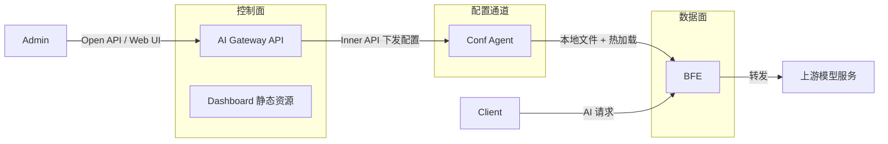
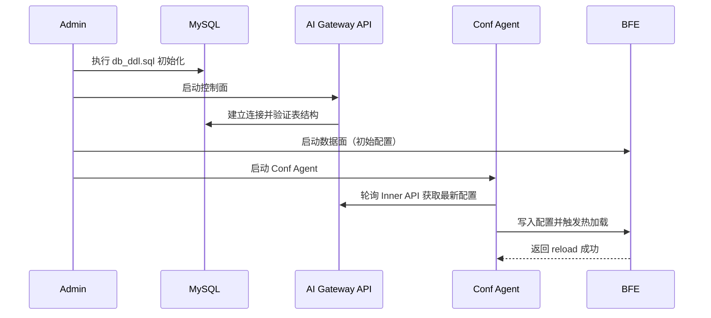

# 第十八章 安装部署

## 本章目标

本章介绍壬远 AI 网关（Rainway AI Gateway）生产可用的安装部署方式。阅读本章后，读者将能够：

- 准备 AI Gateway 运行所需的硬件、软件与依赖环境。
- 通过源码编译出可执行二进制并完成本地启动。
- 初始化 MySQL 或 SQLite 数据库，配置 Redis 依赖与最小可运行的控制面参数。
- 构建 Docker 镜像并在容器环境中运行 AI Gateway API。
- 在 Kubernetes 集群中部署控制面与数据面组件。
- 理解 AI Gateway API、BFE 与 Conf Agent 的启动顺序与协作关系。
- 排查常见的部署启动问题。

## 核心概念

壬远 AI 网关采用**控制面（Control Plane）+ 数据面（Data Plane）**的分层架构：

- **AI Gateway API**：控制面核心，负责策略与配置的创建、存储和下发。对应仓库为 `rainway-ai-gateway/ai-gateway-api`。
- **BFE**：数据面转发引擎，负责 AI 流量的路由、鉴权、限流和转发。对应仓库为 `bfenetworks/bfe`。
- **Conf Agent**：配置代理（Config Agent），与控制面通信并触发 BFE 配置热加载。对应仓库为 `bfenetworks/conf-agent`。
- **Dashboard**：可视化管理控制台，通常以静态资源形式挂载到 AI Gateway API 中运行。
- **Service Controller**：Kubernetes 服务发现组件，可选部署。
- **Log Reader**：访问日志采集组件，随 BFE 部署在数据面，将 BFE 访问日志输出到 Kafka 或 MySQL，供报表与可观测链路消费。对应仓库为 `rainway-ai-gateway/log-reader`。

此外，报表标准形态（Doris + Grafana）依赖一组可选的外部组件：Kafka 承接 log-reader 输出的日志消息，Doris 存储明细与聚合数据，Grafana 展示监控大盘。这组可观测组件不属于 AI 网关本体，其存储层与展示层的一键部署脚本由 `rainway-ai-gateway/ai-gateway-observability` 仓库提供，部署步骤见下文「报表标准形态部署（Doris + Grafana）」。



图 16-1：AI Gateway 控制面、配置通道与数据面关系

## 环境要求

部署 AI Gateway 前，请确认环境满足以下最低要求。建议将控制面组件与数据面组件部署在不同的主机或不同的容器组中，以便独立扩缩容和故障隔离。

### 控制面 AI Gateway API

| 依赖 | 版本 | 说明 |
|---|---|---|
| Go | 1.22 或更高 | 源码编译需要 |
| MySQL | 8.0 | 生产环境推荐；亦支持 SQLite |
| Redis | 6.2 | 配额余额、限流计数、会话缓存等运行时状态 |

MySQL 用于持久化存储 API 配置、租户、路由、证书、API-Key 等核心数据。Redis 是 AI 网关运行时的关键依赖：配额余额、RPM/TPM 限流计数、会话缓存等高频状态都直接读写 Redis。在单机验证场景中，可以使用 SQLite 替代 MySQL，但 SQLite 不支持高并发写入，请勿用于生产环境；Redis 不建议用 SQLite 替代。

### 数据面 BFE

| 依赖 | 版本 | 说明 |
|---|---|---|
| Go | 1.22 或更高 | 源码编译需要 |
| Linux / macOS / Windows | 64 位 | BFE 支持多平台运行 |

BFE 作为数据面组件，对网络吞吐和延迟较为敏感。生产部署时建议为其分配独立的 CPU 与内存资源，并开启内核参数优化，例如调整 `net.core.somaxconn`、`tcp_tw_reuse` 等。

### 配置代理 Conf Agent

| 依赖 | 版本 | 说明 |
|---|---|---|
| Go | 1.22 或更高 | 源码编译需要 |
| 与 BFE 同机部署 | — | Conf Agent 需将配置写入 BFE 所在机器 |

Conf Agent 是控制面与数据面之间的配置通道。它周期性地向 AI Gateway API 拉取最新配置，将配置写入本地版本化目录，并调用 BFE 的监控端口触发配置热加载。因此 Conf Agent 必须与 BFE 运行在同一台机器或同一个 Pod 中，以便共享配置目录。

## 源码编译与二进制启动

### 获取源码

```bash
git clone https://github.com/rainway-ai-gateway/ai-gateway-api.git
cd ai-gateway-api
```

### 编译

项目使用 Makefile 管理构建流程。执行 `make` 将自动下载依赖、编译二进制并打包到 `output/` 目录：

```bash
make
```

`ai-gateway-api/Makefile` 中定义了如下关键目标：

- `make build`：编译生成 `./ai-gateway-api` 二进制。
- `make package`：将 `conf/`、`static/`、`db_ddl.sql` 等复制到 `output/`。
- `make docker`：构建本地容器镜像。
- `make docker-push REGISTRY=...`：多架构构建并推送镜像。

在首次编译前，建议确认 Go 环境已正确设置，并且 `GOPROXY` 能够访问公共模块仓库。如果网络受限，可配置国内镜像：

```bash
export GOPROXY=https://goproxy.cn,direct
export GO111MODULE=on
```

编译完成后，`output/` 目录结构如下：

```text
output/
├── ai-gateway-api      # 可执行文件
├── conf/               # 配置文件
├── static/             # Dashboard 静态资源
├── db_ddl.sql          # MySQL 初始化脚本
└── db_ddl_sqlite.sql   # SQLite 初始化脚本
```

### 启动服务

进入 `output/` 目录并执行：

```bash
./ai-gateway-api -c ./conf -sc ai_gateway_api.toml -l ./log
```

启动参数说明：

- `-c`：配置文件根目录，对应 `ai-gateway-api/conf/`。
- `-sc`：主配置文件名，默认 `ai_gateway_api.toml`。
- `-l`：日志输出目录。

默认监听端口：

- API 服务端口：`8183`
- 监控端口：`8284`

启动成功后，可通过以下命令验证服务健康：

```bash
curl http://localhost:8284/monitor/health
```

访问 `http://localhost:8183` 可进入 Dashboard，默认用户名和密码均为 `admin`。首次登录后请立即修改密码，避免使用默认凭据运行在生产环境。

## 数据库初始化

AI Gateway API 使用关系型数据库存储配置。目前支持 MySQL 8 与 SQLite 两种后端。

### MySQL 初始化

1. 安装 MySQL 8 并创建数据库。建议设置字符集为 `utf8mb4`，以支持多语言字符和表情符号：

```sql
CREATE DATABASE IF NOT EXISTS open_bfe
  DEFAULT CHARACTER SET utf8mb4
  DEFAULT COLLATE utf8mb4_unicode_ci;
```

2. 执行项目根目录下的 `db_ddl.sql`：

```bash
mysql -u{user} -p{password} < db_ddl.sql
```

3. 在主配置 `conf/ai_gateway_api.toml` 中填写数据库连接信息：

```toml
[Databases.bfe_db]
DBName               = "open_bfe"
Addr                 = "127.0.0.1:3306"
Net                  = "tcp"
User                 = "{user}"
Passwd               = "{password}"
MultiStatements      = true
MaxAllowedPacket     = 67108864
ParseTime            = true
AllowNativePasswords = true
Driver               = "mysql"
MaxOpenConns         = 100
MaxIdleConns         = 100
ConnMaxIdleTimeInMs  = 50000
ConnMaxLifetimeInMs  = 50000
```

生产环境建议为 AI Gateway 单独创建数据库账号，并限制访问源 IP。

### SQLite 初始化

测试或单机环境可使用 SQLite，省去安装 MySQL 的步骤。执行 SQLite 初始化脚本：

```bash
sqlite3 open_bfe.db < db_ddl_sqlite.sql
```

然后在 `ai_gateway_api.toml` 中调整数据库驱动与地址：

```toml
[Databases.bfe_db]
DBName = "open_bfe"
Addr   = "./open_bfe.db"
Driver = "sqlite3"
```

SQLite 适用于功能验证与开发调试，不建议用于生产高并发场景。

## 报表轻量形态部署（可选）

若需要在控制台查看用量报表而不引入 Kafka/Doris/Grafana，可启用报表轻量形态：访问日志由 log-reader `mod_log_mysql` 插件直写 MySQL，AI Gateway API 提供 `/report/*` 查询与内置聚合 JOB，控制台直接展示。标准形态（Doris + Grafana）无需本步骤，其部署方式见下文「报表标准形态部署（Doris + Grafana）」，完成后仅需在 `[Report]` 中配置 `Backend = "doris"`。

部署遵循 schema-first 顺序：

1. **执行报表 DDL**：在 ai-gateway-api 仓库取 `db_ddl_report_mysql.sql`，替换 `${INIT_DATE}` 为建表日之后（建议 +3 天）后在 report 库执行，创建明细表 `bfe_ai_request_log` 与聚合表 `bfe_ai_metrics_1m`：

   ```bash
   mysql -ureport -p bfe_report < db_ddl_report_mysql.sql
   ```

2. **创建最小权限账号**：log-reader 写入账号仅授予目标表 INSERT/UPDATE（幂等覆盖需要 UPDATE），无 DDL/DELETE；api 查询/聚合账号授予明细表/聚合表 SELECT、聚合表 INSERT/DELETE、明细表 DELETE（非分区降级清理）与 ALTER TABLE（分区管理）。

3. **启用 log-reader 插件**：在 log-reader `conf/config.conf` 中配置 `Modules = mod_log_mysql`（与 `mod_kafka` 二选一），并按 `conf/mod_log_mysql/mod_log_mysql.conf` 样例填写 MySQL 地址、库表与攒批参数（QueueSize/BatchSize/FlushIntervalMs/MaxRetries）。

4. **配置 AI Gateway API**：在 `ai_gateway_api.toml` 中新增报表数据源与 `[Report]` 段：

   ```toml
   [Databases.report_db]
   Driver = "mysql"
   DBName = "bfe_report"
   Addr = "127.0.0.1:3306"
   User = "report_read"
   Passwd = "******"

   [Report]
   Backend = "mysql"        # mysql | doris；缺省则报表模块不装配，/report/* 返回 404
   Datasource = "report_db"
   EnableAggregateJob = true
   AggregateIntervalSec = 60
   RetentionDays = 7        # 明细保留天数（分区 DROP / DELETE 窗口）
   EnablePartitionMgmt = true
   ```

5. **验证**：重启 log-reader 后观察 `http://<log-reader>:8992/monitor/mod_log_mysql`，`SENT_TO_MYSQL` 持续增长且 `SEND_MYSQL_FAILED`/`SENT_MYSQL_CHN_FULL` 为零；登录控制台打开报表页确认总览指标有数据。

注意事项：

- **单集群单形态**：同一集群不要同时启用 `mod_kafka`（→ Doris）与 `mod_log_mysql`（→ MySQL），两条链路各自的数据缺口窗口会导致两套报表口径不一致。
- **分区先于数据**：MySQL 无动态分区，分区管理 JOB 先于数据到达建好分区（缺分区写入直接报错）；JOB 每 6h 巡检并在启动时立即补建一次。
- **容量建议**：MySQL 形态面向日均百万级以下日志量，超量请使用 Doris 标准形态。
- MySQL 后端不提供 P50/P90/P99 分位数延迟，控制台对应卡片自动降级隐藏。

## 报表标准形态部署（Doris + Grafana）

报表标准形态面向生产环境：BFE 访问日志经 log-reader `mod_kafka` 插件写入 Kafka，由 Doris Routine Load 实时落入明细表，再由 Doris INSERT JOB 每分钟聚合到分钟表；控制台报表页与 Grafana Dashboard 查询同一份 Doris 数据。存储层（Doris 建库/建表/Routine Load/INSERT JOB）与展示层（Grafana 数据源 + Dashboard）的一键部署脚本由 `rainway-ai-gateway/ai-gateway-observability` 仓库提供，数据链路如下：

```text
BFE（数据面）──访问日志──▶ log-reader (mod_kafka) ──JSON──▶ Kafka ──Routine Load──▶ Doris
                                                                                  ├─ bfe_ai_request_log  （明细表，单请求粒度）
                                                                                  └─ bfe_ai_metrics_1m   （聚合表，INSERT JOB 每分钟聚合）
                                                                                            │
                                                                                            ▼
                                                                              Grafana（MySQL 协议直连 Doris FE:9030）
```

端到端延迟在 1 分钟以内（Routine Load 批量提交 1~5 秒，INSERT JOB 每分钟执行），满足分钟级报表与看板需求。

### 前提条件

| 组件 | 版本 | 说明 |
|---|---|---|
| Doris | 4.0+ | FE 已启动且 query_port（默认 9030）可访问 |
| Kafka | 2.8+ | Broker 可访问，`bfe_ai_log` Topic 已创建（按实际规模调整分区数与保留策略） |
| Grafana | — | 已安装，且已知其安装根目录（含 `bin/` 与 `conf/provisioning/`） |
| mysql 客户端 | 任意 | 用于连接 Doris FE 执行部署 SQL |
| log-reader | v1.4.0 | 随 BFE 部署，启用 `mod_kafka` 插件 |

### 步骤 1：部署 Doris 侧对象

```bash
cd ai-gateway-observability/doris

# 生产环境（数据库 bfe_observability）：先编辑 setup.conf 填入 Doris FE 与 Kafka 连接信息
vim setup.conf
bash setup.sh

# 测试环境（数据库 bfe_observability_test，Kafka Topic 使用 bfe_ai_log_test 的 _test 后缀）
bash setup.sh ./setup_test.conf
```

`doris/setup.sh` 依次自动创建：数据库（默认 `bfe_observability`）、明细表 `bfe_ai_request_log`、聚合表 `bfe_ai_metrics_1m`、Routine Load `bfe_ai_log_load`（消费 Kafka 实时写明细表）、INSERT JOB `bfe_ai_metrics_1m_job`（每分钟把上一分钟明细聚合到分钟表）。数据库名、Kafka 地址、Topic、初始分区日期等均在 `setup.conf` / `setup_test.conf` 中参数化，无需改动 SQL。

部署失败需要清空重试时，使用 `doris/cleanup.sh` 删除指定库下的两张表、Routine Load 与 INSERT JOB 后重新执行 `setup.sh`：

```bash
bash cleanup.sh              # 清空生产库（默认 setup.conf）
bash cleanup.sh ./setup_test.conf   # 清空测试库
```

注意：Doris 的 INSERT JOB 名称全局唯一（不按库隔离），`bfe_ai_metrics_1m_job` 在生产与测试之间共享，清理测试库也会删除同名 Job；如需生产/测试完全隔离，请在各自配置中设置不同的 `JOB_NAME`。详细步骤与端到端验证清单见 `ai-gateway-observability/doris/docs/user/HOWTO.md`，表结构语义见同目录 `docs/design/TABLE_DESIGN.md`。

### 步骤 2：部署 Grafana 侧

```bash
cd ai-gateway-observability/grafana

# 生产环境：编辑 setup.conf，填写 GRAFANA_DIR、Doris FE 连接信息与数据源名称/UID
vim setup.conf
bash setup.sh

# 测试环境（例如连接 bfe_observability_test）
bash setup.sh ./setup_test.conf
```

`grafana/setup.sh` 基于 Grafana 的 provisioning（文件式配置）机制依次完成：写入 Doris 数据源（MySQL 协议直连 Doris FE 9030，指向目标库）、生成 Dashboard 供给配置并导入 `grafana/dashboards/bfe-ai-gateway-observability.json`（「BFE AI Gateway 可观测仪表盘」）、重启 Grafana 使配置生效。脚本会把 Dashboard 中的 `${DS_DORIS}` 占位符替换为数据源 UID，且每次执行都会覆盖目标配置文件，重复执行是安全的（重新配置并重启）。若 Grafana 由 systemd 管理，可将脚本内的重启步骤替换为 `systemctl restart grafana-server`。详细步骤见 `ai-gateway-observability/grafana/docs/user/HOWTO.md`，面板与 SQL 设计见同目录 `docs/design/DASHBOARD_DESIGN.md`。

### 步骤 3：配置 log-reader 与 AI Gateway API

1. **启用 log-reader 插件**：在 log-reader `conf/config.conf` 中配置 `Modules = mod_kafka`（与 `mod_log_mysql` 二选一，同一集群不要同时启用两种形态），并按 `conf/mod_kafka/mod_kafka.conf` 样例填写 Kafka Broker 地址与 Topic（生产 `bfe_ai_log`，测试 `bfe_ai_log_test`）。
2. **配置 AI Gateway API**：在 `ai_gateway_api.toml` 中新增指向 Doris FE 的报表数据源与 `[Report]` 段：

   ```toml
   [Databases.report_db]
   Driver = "mysql"         # 经 MySQL 协议连接 Doris FE
   DBName = "bfe_observability"
   Addr = "127.0.0.1:9030"
   User = "report_read"
   Passwd = "******"

   [Report]
   Backend = "doris"        # 缺省则报表模块不装配，/report/* 返回 404
   Datasource = "report_db"
   Database = ""            # 表名所属 schema 覆盖（可选）
   ```

   Doris 形态的分钟聚合由 Doris INSERT JOB `bfe_ai_metrics_1m_job` 完成，`EnableAggregateJob` / `EnablePartitionMgmt` 等 MySQL 形态专用的聚合与分区管理项仅对 `Backend = "mysql"` 生效。

### 步骤 4：验证

```bash
# Routine Load 状态应为 RUNNING
mysql -h127.0.0.1 -P9030 -uroot -e "SHOW ROUTINE LOAD FOR bfe_ai_log_load\G"

# INSERT JOB 与两张表
mysql -h127.0.0.1 -P9030 -uroot -e "SHOW JOBS FROM bfe_observability;"
mysql -h127.0.0.1 -P9030 -uroot -e "USE bfe_observability; SHOW TABLES;"
```

随后登录控制台打开数据报表页确认总览指标有数据，并检查 Grafana「BFE AI Gateway 可观测仪表盘」各面板正常出图。

注意事项：

- **单集群单形态**：同一集群不要同时启用 `mod_kafka`（→ Doris）与 `mod_log_mysql`（→ MySQL），两条链路各自的数据缺口窗口会导致两套报表口径不一致。
- **聚合表设计参考**：仓库示例中的聚合表 `bfe_ai_metrics_1m` 仅用于演示链路打通；生产环境可按查询场景拆分多张聚合表、调整为 5/15 分钟粒度，详见 `doris/docs/user/HOWTO.md` 的提示。

## 配置文件说明与最小可运行配置

AI Gateway API 的主配置文件为 `conf/ai_gateway_api.toml`，该文件由启动参数 `-sc` 指定。配置文件根路径下还需要包含 `nav_tree.toml` 与 `i18n/` 目录。

### 最小可运行配置

仅修改数据库用户名和密码即可启动：

```toml
[Server]
ServerPort          = 8183
GracefulTimeoutInMs = 5000
MonitorPort         = 8284

[Loggers.access]
LogName     = "access"
LogLevel    = "INFO"
RotateWhen  = "MIDNIGHT"
BackupCount = 1
Format      = "[%D %T] [%L] [%S] %M"
StdOut      = false

[Databases.bfe_db]
DBName               = "open_bfe"
Addr                 = "127.0.0.1:3306"
Net                  = "tcp"
User                 = "root"
Passwd               = "your_password"
MultiStatements      = true
MaxAllowedPacket     = 67108864
ParseTime            = true
AllowNativePasswords = true
Driver               = "mysql"
MaxOpenConns         = 100
MaxIdleConns         = 100
ConnMaxIdleTimeInMs  = 50000
ConnMaxLifetimeInMs  = 50000

[Depends]
NavTreeFile = "${conf_dir}/nav_tree.toml"
I18nDir     = "${conf_dir}/i18n"

[RunTime]
SkipTokenValidate  = false
RecordSQL          = false
SessionExpireInDay = 10
StaticFilePath     = "./static"
Debug              = false

[RedisConf]
# Redis 逻辑名，需在 name_conf.data 中解析为真实地址
Bns            = "example.redis.cluster"
ConnectTimeout = 10
ReadTimeout    = 5
WriteTimeout   = 5
MaxIdle        = 10
```

### 关键配置项说明

| 配置节 | 关键项 | 说明 |
|---|---|---|
| `[Server]` | `ServerPort` | API 服务端口，默认 8183 |
| `[Server]` | `MonitorPort` | 监控端口，默认 8284 |
| `[Loggers.access]` | `LogLevel` | 访问日志级别 |
| `[Databases.bfe_db]` | `Addr`、`User`、`Passwd` | 数据库连接 |
| `[RedisConf]` | `Bns` | Redis 逻辑名，由 `name_conf.data` 解析为真实地址 |
| `[RedisConf]` | `ConnectTimeout`、`ReadTimeout`、`WriteTimeout` | Redis 连接与读写超时（毫秒） |
| `[Depends]` | `NavTreeFile`、`I18nDir` | 导航与国际化路径，支持 `${conf_dir}` 变量 |
| `[RunTime]` | `StaticFilePath` | Dashboard 静态资源路径 |
| `[RunTime]` | `SkipTokenValidate` | 调试用途，生产环境必须设为 `false` |

在实际部署时，建议将配置文件纳入版本控制进行管理，但应通过环境变量或 Secret 注入数据库密码等敏感信息，避免在配置文件中直接写入明文密码。详细参数说明请参考 `ai-gateway-api/docs/zh_cn/config_param.md`。

### Redis 地址解析

`[RedisConf].Bns` 填写的是 Redis 逻辑名，真实地址需要在 `conf/name_conf.data` 中配置。该文件采用 BFE 命名服务格式：

```json
{
    "Version": "init version",
    "Config": {
        "example.redis.cluster": [
            {
                "Host": "127.0.0.1",
                "Port": 6379,
                "Weight": 10
            }
        ]
    }
}
```

启动时，AI Gateway API 根据 `Bns` 查找 `name_conf.data` 中对应的主机列表，建立 Redis 连接。如果 Redis 使用集群或哨兵模式，可在此配置多个地址并分配权重；生产环境建议配合 Redis 密码与 TLS 连接，并通过网络策略限制访问源。

## Docker 镜像构建与容器部署

### 构建镜像

项目根目录已包含 Dockerfile，可通过 Makefile 直接构建：

```bash
make docker
```

构建完成后查看本地镜像：

```bash
docker images | grep ai-gateway-api
```

默认镜像名为 `ai-gateway-api:v{Version}` 与 `ai-gateway-api:latest`，版本号读取自 `version/version.go`。

如需禁用缓存或指定 Dashboard 版本：

```bash
make docker NO_CACHE=true DASHBOARD_VERSION=v0.0.3
```

### 单容器运行

将配置文件、数据库初始化脚本与日志目录挂载到容器：

```bash
docker run -d \
  --name ai-gateway-api \
  -p 8183:8183 \
  -p 8284:8284 \
  -v $(pwd)/conf:/app/conf \
  -v $(pwd)/log:/app/log \
  -v $(pwd)/static:/app/static \
  ai-gateway-api:latest \
  ./ai-gateway-api -c ./conf -sc ai_gateway_api.toml -l ./log
```

如果 MySQL 不在容器网络中，请确保容器可访问数据库地址，或使用 Docker 网络/主机网络模式。生产环境建议使用自定义 Docker 网络，将 AI Gateway API 与 MySQL、Redis 放入同一网络命名空间，便于服务发现和访问控制。

### 容器内时区数据（tzdata）注意事项

BFE 的 Dockerfile 在 conf-agent、log-reader 构建阶段与最终 alpine 运行镜像均执行 `apk add tzdata`。alpine 基础镜像本身不含 `/usr/share/zoneinfo`，若镜像内缺少时区数据，会影响日志时间戳、配额周期（`reset_period` weekly/monthly）计算以及分时段定价（tier）匹配等依赖本地时区的功能。

若使用自定义镜像或不包含上述改动的镜像二次构建，请确保镜像内已安装 `tzdata`，或运行时挂载宿主机的时区文件：

```bash
docker run -d -v /etc/localtime:/etc/localtime:ro ...
```

## Kubernetes 部署示例

以下示例展示如何在 Kubernetes 中部署 AI Gateway API。示例假设 MySQL 与 Redis 已在外部或同集群中可用。

### ConfigMap

将 `ai_gateway_api.toml` 以 ConfigMap 形式挂载：

```yaml
apiVersion: v1
kind: ConfigMap
metadata:
  name: ai-gateway-api-config
data:
  ai_gateway_api.toml: |
    [Server]
    ServerPort          = 8183
    GracefulTimeoutInMs = 5000
    MonitorPort         = 8284

    [Loggers.access]
    LogName     = "access"
    LogLevel    = "INFO"
    RotateWhen  = "MIDNIGHT"
    BackupCount = 1
    Format      = "[%D %T] [%L] [%S] %M"
    StdOut      = false

    [Databases.bfe_db]
    DBName               = "open_bfe"
    Addr                 = "mysql:3306"
    Net                  = "tcp"
    User                 = "root"
    Passwd               = "$(MYSQL_PASSWORD)"
    MultiStatements      = true
    MaxAllowedPacket     = 67108864
    ParseTime            = true
    AllowNativePasswords = true
    Driver               = "mysql"
    MaxOpenConns         = 100
    MaxIdleConns         = 100
    ConnMaxIdleTimeInMs  = 50000
    ConnMaxLifetimeInMs  = 50000

    [Depends]
    NavTreeFile = "${conf_dir}/nav_tree.toml"
    I18nDir     = "${conf_dir}/i18n"

    [RunTime]
    SkipTokenValidate  = false
    RecordSQL          = false
    SessionExpireInDay = 10
    StaticFilePath     = "./static"
    Debug              = false

    [RedisConf]
    Bns            = "example.redis.cluster"
    ConnectTimeout = 10
    ReadTimeout    = 5
    WriteTimeout   = 5
    MaxIdle        = 10
```

同时需要在 ConfigMap 中挂载 `name_conf.data`，将 `example.redis.cluster` 解析到实际 Redis 地址。

### Deployment

```yaml
apiVersion: apps/v1
kind: Deployment
metadata:
  name: ai-gateway-api
spec:
  replicas: 2
  selector:
    matchLabels:
      app: ai-gateway-api
  template:
    metadata:
      labels:
        app: ai-gateway-api
    spec:
      containers:
        - name: ai-gateway-api
          image: ai-gateway-api:latest
          imagePullPolicy: IfNotPresent
          ports:
            - containerPort: 8183
            - containerPort: 8284
          env:
            - name: MYSQL_PASSWORD
              valueFrom:
                secretKeyRef:
                  name: ai-gateway-api-secret
                  key: mysql-password
          volumeMounts:
            - name: config
              mountPath: /app/conf
          command:
            - ./ai-gateway-api
            - -c
            - ./conf
            - -sc
            - ai_gateway_api.toml
            - -l
            - ./log
      volumes:
        - name: config
          configMap:
            name: ai-gateway-api-config
```

### Service

```yaml
apiVersion: v1
kind: Service
metadata:
  name: ai-gateway-api
spec:
  selector:
    app: ai-gateway-api
  ports:
    - name: api
      port: 8183
      targetPort: 8183
    - name: monitor
      port: 8284
      targetPort: 8284
```

### BFE 与 Conf Agent 的 DaemonSet 示例

BFE 与 Conf Agent 需要同机部署。以下 DaemonSet 示例在一个 Pod 中运行两个容器，共享配置目录：

```yaml
apiVersion: apps/v1
kind: DaemonSet
metadata:
  name: bfe-conf-agent
spec:
  selector:
    matchLabels:
      app: bfe-conf-agent
  template:
    metadata:
      labels:
        app: bfe-conf-agent
    spec:
      containers:
        - name: bfe
          image: bfe:latest
          ports:
            - containerPort: 8080
            - containerPort: 8421
          volumeMounts:
            - name: bfe-conf
              mountPath: /bfe/conf
        - name: conf-agent
          image: conf-agent:latest
          volumeMounts:
            - name: bfe-conf
              mountPath: /bfe/conf
          command:
            - ./conf-agent
            - -c
            - ./conf
            - -cf
            - conf-agent.toml
      volumes:
        - name: bfe-conf
          emptyDir: {}
```

实际生产环境应将 `conf-agent.toml` 中的 API Server 地址指向 `ai-gateway-api` Service 的集群 DNS：`http://ai-gateway-api:8183`。

在 Kubernetes 中部署时，还需要注意以下几点：

- 使用 Secret 管理数据库密码、Redis 密码等敏感信息，不要直接写入 ConfigMap。
- 为 AI Gateway API 配置 LivenessProbe 与 ReadinessProbe，监控端口建议复用 `8284`。
- BFE 作为数据面通常以 DaemonSet 形式部署在每个边缘节点，或使用 Deployment 配合负载均衡器暴露入口。
- Conf Agent 与 BFE 同 Pod 部署时，使用 `emptyDir` 共享配置目录即可；如需持久化历史版本，可改为 `hostPath` 或 PVC。

## 多组件启动顺序

完整生产部署涉及三个核心组件：AI Gateway API、BFE、Conf Agent。推荐按以下顺序启动：



图 16-2：多组件启动顺序

### 启动顺序说明

1. **初始化数据库**：先执行 `db_ddl.sql`，确保表结构就绪。数据库是控制面的状态来源，必须在 AI Gateway API 启动前完成初始化。
2. **启动 AI Gateway API**：等待数据库连接成功，API 服务与监控服务开始监听。此时可通过 Dashboard 或 Open API 创建路由、API-Key 等配置。
3. **启动 BFE**：BFE 可携带一份兜底配置启动，避免在 Conf Agent 拉取配置前无配置可用。兜底配置应包含最少的监听端口和产品线定义。
4. **启动 Conf Agent**：Conf Agent 向 AI Gateway API 轮询配置，发现新版本后写入本地并触发 BFE 热加载。热加载完成后，BFE 即使用控制面下发的最新配置处理流量。

在生产环境中，建议将 AI Gateway API 部署为多副本，并在其前方配置负载均衡器。BFE 与 Conf Agent 则按边缘节点规模水平扩展。

### 配置文件目录约定

- AI Gateway API 配置目录：`/app/conf`，包含 `ai_gateway_api.toml`、`nav_tree.toml`、`i18n/`。
- BFE 配置目录：通常为 `/bfe/conf`。
- Conf Agent 配置目录：与 BFE 同机，可放在 `/bfe/conf-agent/conf`。

Conf Agent 启动命令示例：

```bash
./conf-agent -c ./conf -cf conf-agent.toml
```

Conf Agent 配置文件中需指定 AI Gateway API 地址、BFE 配置目录、BFE 监控端口等参数。详细说明请参考 `conf-agent/docs/zh_cn/config/config.md`。

## 生产部署检查清单

在将系统上线前，建议按以下清单逐项确认：

- [ ] 数据库已初始化，字符集为 `utf8mb4`，并创建了独立业务账号。
- [ ] `ai_gateway_api.toml` 中的数据库密码已替换为强密码，且未提交到代码仓库。
- [ ] Redis 已启用访问密码或通过网络策略限制访问源。
- [ ] AI Gateway API 运行在非 root 用户下，日志目录权限正确。
- [ ] Dashboard 默认密码 `admin/admin` 已修改。
- [ ] `[RunTime]` 中的 `SkipTokenValidate` 为 `false`。
- [ ] BFE 与 Conf Agent 同机部署，配置目录可读写。
- [ ] 生产环境的 TLS 证书和密钥已配置，测试证书已替换。
- [ ] 监控告警已接入 `8284` 端口指标或日志采集系统。
- [ ] 已制定回滚方案：保留上一版本的 BFE 配置目录，必要时可手动回退。

## 常见部署问题排查

### 1. 启动时数据库连接失败

**现象**：日志中出现 `dial tcp 127.0.0.1:3306: connect: connection refused`。

**排查步骤**：

- 确认 MySQL 已启动且监听 `3306` 端口。
- 检查 `ai_gateway_api.toml` 中 `Addr`、`User`、`Passwd` 是否正确。
- 确认 AI Gateway API 进程到 MySQL 的网络可达（防火墙、安全组、容器网络）。
- 使用命令行测试连接：

```bash
mysql -u{user} -p{password} -h127.0.0.1 -P3306 -e "USE open_bfe; SHOW TABLES;"
```

### 2. Dashboard 访问 404

**现象**：访问 `http://localhost:8183` 返回 404。

**排查步骤**：

- 确认 `static/` 目录存在且包含 Dashboard 构建产物。
- 检查 `[RunTime]` 中 `StaticFilePath` 是否指向正确的静态资源目录。
- 若使用 Docker/Kubernetes，确认 `static/` 已正确挂载到容器。

### 3. Conf Agent 无法获取配置

**现象**：Conf Agent 日志中出现 `http error` 或 `config version not changed` 但 BFE 未生效。

**排查步骤**：

- 确认 Conf Agent 配置的 API Server 地址可达。
- 检查 AI Gateway API 的监控端口与 Inner API 路由是否正常。
- 查看 Conf Agent 的轮询间隔与超时配置是否合理。
- 确认 BFE 监控端口（默认 8421）可被 Conf Agent 访问。

### 4. BFE 热加载 TLS 配置报错

**现象**：Conf Agent 触发 reload 时报 `tls_rule_conf.data` 关联检查失败。

**原因**：默认 `tls_rule_conf.data` 依赖 `example.org` 证书。若未配置该证书，将出现关联错误。

**解决方案**：

在 `tls_rule_conf.data` 中将 `Config` 置为空对象：

```json
{
    "Version": "12",
    "DefaultNextProtos": ["http/1.1"],
    "Config": {}
}
```

更多细节请参考 `ai-gateway-api/docs/zh_cn/deploy.md` 中“可能需要手动维护的 BFE 配置文件”一节。

### 5. 权限不足导致启动失败

**现象**：无法写入日志目录或配置文件目录。

**排查步骤**：

- 确保 `-l` 指定的日志目录存在且进程有写入权限。
- 容器运行时使用非 root 用户时，确认挂载目录的 UID/GID 匹配。
- 使用 `chmod` 或 `chown` 调整目录权限：

```bash
mkdir -p log conf static
chmod -R 755 log conf static
```

### 6. 端口冲突

**现象**：启动时报 `bind: address already in use`。

**排查步骤**：

- 使用 `netstat` 或 `ss` 检查 `8183`、`8284` 是否被其他进程占用。
- 如需同时运行多个实例，可在 `ai_gateway_api.toml` 中修改 `ServerPort` 与 `MonitorPort`。

### 7. Redis 连接失败

**现象**：登录后提示会话异常、配额余额不更新、限流策略不生效，或日志中出现 Redis 连接错误。

**排查步骤**：

- 检查 Redis 服务是否启动并监听正确端口。
- 确认 `ai_gateway_api.toml` 中 `[RedisConf]` 配置正确，特别是 `Bns` 逻辑名。
- 确认 `conf/name_conf.data` 中存在 `Bns` 对应的地址映射，且 `Host` / `Port` 与实际 Redis 实例一致。
- 测试 Redis 连通性：

```bash
redis-cli -h 127.0.0.1 -p 6379 ping
```

## 本章小结

本章系统介绍了壬远 AI 网关的安装部署流程：

- 控制面依赖 Go 1.22、MySQL 8 与 Redis 6.2；Redis 用于配额余额、限流计数和会话缓存，是运行时关键依赖。数据面 BFE 与 Conf Agent 需同机部署。
- 使用 `make` 即可完成 AI Gateway API 的源码编译与打包。
- 数据库支持 MySQL 与 SQLite，生产环境推荐使用 MySQL，并设置字符集为 `utf8mb4`。
- 最小可运行配置需调整数据库连接与 Redis 逻辑名；Redis 真实地址通过 `name_conf.data` 解析。
- 可通过 `make docker` 构建容器镜像，并采用 Kubernetes Deployment、Service 与 DaemonSet 进行集群化部署。
- 多组件启动顺序为：数据库初始化 → AI Gateway API → BFE → Conf Agent，确保数据面能够及时获得控制面下发的最新配置。
- BFE 镜像内置 tzdata；使用自定义镜像时需自行保证容器内时区数据完整。
- 报表有两种部署形态：轻量形态由 log-reader `mod_log_mysql` 插件直写 MySQL；标准形态（Doris + Grafana）由 ai-gateway-observability 仓库的脚本一键部署 Doris 存储层与 Grafana 展示层，控制台经 `[Report].Backend = "doris"` 查询同一份数据。
- 常见部署问题主要集中于数据库连接、静态资源挂载、Conf Agent 通信、TLS 配置关联检查、端口冲突与 Redis 连接失败。
- 上线前应完成生产部署检查清单，重点检查密码安全、权限配置和回滚方案。

## 参考文档

本章内容参考了以下项目文档与代码：

- `ai-gateway-api/README.md`：项目概览、快速开始与容器化部署入口。
- `ai-gateway-api/docs/zh_cn/deploy.md`：BFE 控制面组件部署步骤与 TLS 配置注意事项。
- `ai-gateway-api/docs/zh_cn/config_param.md`：`ai_gateway_api.toml` 完整配置参数说明。
- `ai-gateway-api/Makefile`：构建、打包、Docker 镜像构建与推送目标。
- `conf-agent/AGENTS.md`：Conf Agent 架构、构建方式与本地启动命令。
- `conf-agent/docs/zh_cn/config/config.md`：Conf Agent 配置文件详细说明。
- `ai-gateway-observability/README.md`：可观测性（Doris + Grafana）仓库概览与数据链路。
- `ai-gateway-observability/doris/docs/user/HOWTO.md`：Doris 建库/建表/Routine Load/INSERT JOB 部署与验证步骤。
- `ai-gateway-observability/grafana/docs/user/HOWTO.md`：Grafana 数据源与 Dashboard 一键配置步骤。
- [BFE 安装部署官方文档](https://www.bfe-networks.net/en_us/installation/install/)：BFE 数据面独立部署指南。
- [ai-gateway-demo 部署示例仓库](https://github.com/rainway-ai-gateway/ai-gateway-demo)：Kubernetes 与 Docker Compose 完整示例。
