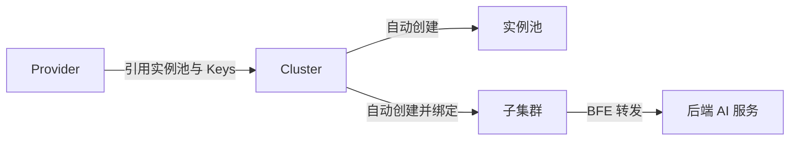

# 第二十章 Cluster 与路由配置

## 本章目标

通过本章，读者将掌握壬远 AI 网关中 **Cluster（集群）** 与 **AI 路由规则** 的核心配置方法。具体包括：理解 Cluster 与 Provider 的关系并独立完成创建；配置转发策略、模型映射、Key 策略与会话亲和性；配置 Global、Entity、API-Key 三级路由规则；理解路由优先级与 Fallback 机制；使用表达式校验工具排查条件语法问题；并通过实际请求验证路由是否生效。

## Cluster 的概念与创建步骤

### 什么是 Cluster

在壬远 AI 网关中，**Cluster（集群）** 是数据面 BFE 转发流量的逻辑后端单元。一个 Cluster 引用已存在的 **Provider**，继承其 `instance_pool`（后端实例池）与 `keys`（API-Key 明文），并在此基础上声明该 Cluster 可服务的模型列表、模型映射、Key 选择策略等。



与 Provider 不同，Cluster 面向“如何使用某个 Provider”：

- Provider 回答“后端是谁、有哪些模型、有哪些 Key”。
- Cluster 回答“本次请求使用哪些模型、如何映射模型名、如何在多 Key 间加权选择、是否启用会话亲和性”。

### 创建前的准备工作

在创建 Cluster 之前，需要确认以下前置条件已经满足：

1. 已创建产品线（Product）和对应的 Provider，Provider 中至少配置了一个后端实例与一个模型。
2. 若 Cluster 需要使用 API-Key，必须先在 Provider 的 `keys` 中定义好 Key，并记录每个 Key 的 `name`。
3. 明确该 Cluster 需要对外暴露哪些模型，以及是否需要模型映射、多 Key 分流等高级能力。

准备工作完成后，可以通过 Dashboard 可视化向导或 OpenAPI 直接提交配置。

### 创建 Cluster 的步骤

创建 Cluster 前，必须先创建好对应的 Provider，并确认 `llm_config.provider` 引用存在。典型创建流程如下：

1. 通过 `POST /clusters` 提交 Cluster 配置。
2. 控制面校验 `name` 全局唯一、`provider` 存在、`models` 是 Provider 模型子集、`keys` 引用 Provider 中已定义的 Key。
3. 系统自动：
   - 创建实例池，名称格式为 `{product_name}.{cluster_name}`；
   - 创建子集群，名称为 `{cluster_name}`；
   - 将子集群绑定到 Cluster。
4. `llm_config.model_table` 由 InnerAPI 根据 Provider 信息自动生成并下发给 BFE，不在 OpenAPI 中展示。

创建请求示例：

```json
{
    "name": "cluster-deepseek-prod",
    "description": "生产环境 DeepSeek 集群",
    "basic": {
        "protocol": "https",
        "connection": {
            "max_idle_conn_per_rs": 0,
            "cancel_on_client_close": false
        },
        "retries": {
            "max_retry_in_cluster": 2
        },
        "buffers": {
            "req_write_buffer_size": 512
        },
        "timeouts": {
            "timeout_conn_serv": 50000,
            "timeout_response_header": 50000,
            "timeout_readbody_client": 30000,
            "timeout_read_client_again": 30000,
            "timeout_write_client": 60000
        }
    },
    "llm_config": {
        "models": ["deepseek-chat", "deepseek-coder"],
        "model_mappings": [
            {"source_model": "gpt-4", "target_model": "deepseek-chat"}
        ],
        "keys": [
            {"name": "key-prod-01", "weight": 70},
            {"name": "key-prod-02", "weight": 30}
        ],
        "key_policy": {
            "strategy": "weighted_random",
            "max_retries": 3,
            "retry_backoff_initial": 500,
            "retry_backoff_max": 5000
        },
        "provider": "deepseek"
    }
}
```

> 注意：Cluster 创建后，实例池和子集群由系统自动维护，**不要直接修改** `instance_pool`；如需调整后端实例，请更新对应 Provider。

### 更新与删除 Cluster

更新 Cluster 时使用 `PATCH /clusters/{cluster_name}`，可修改描述、`basic`、`sticky_sessions`、`passive_health_check` 以及 `llm_config` 等字段。需要特别注意：

- `name` 不允许修改；
- `llm_config.keys` 按**全量替换**处理，调用方需传入完整的 Key 引用列表；
- `sub_clusters` 与 `scheduler` 为系统内部自动生成，不支持手动修改。

删除 Cluster 时，系统会先检查该 Cluster 是否被 Global、Entity 或 API-Key 级别的 AI 路由规则引用。若存在引用，删除将失败，需先解除引用或删除对应路由规则。通过引用检查后，系统会级联解绑子集群、删除子集群、删除实例池，最后删除 Cluster。

## 配置转发策略、模型映射、Key 策略、会话亲和性

### 基本转发策略

`basic` 段控制 BFE 与后端交互的传输层行为，常用字段如下：

| 字段 | 含义 | 典型值 |
|------|------|--------|
| `protocol` | 后端协议 | `http` / `https` |
| `connection.max_idle_conn_per_rs` | 每个实例空闲长连接数 | `0`（默认，AI 场景推荐） |
| `connection.cancel_on_client_close` | 客户端断连时是否级联关闭后端连接 | `false` |
| `retries.max_retry_in_cluster` | 同一集群内转发失败后的重试次数 | `2` |
| `buffers.req_write_buffer_size` | 请求写缓冲区大小 | `512` |
| `timeouts.timeout_conn_serv` | 连接后端超时（ms） | `50000` |
| `timeouts.timeout_response_header` | 读取响应头超时（ms） | `50000` |
| `timeouts.timeout_readbody_client` | 读取请求 Body 超时（ms） | `30000` |
| `timeouts.timeout_write_client` | 写响应超时（ms） | `60000` |

### 模型映射

`llm_config.model_mappings` 用于将用户请求中的模型名映射为后端实际使用的模型名。例如将用户习惯的 `gpt-4` 映射为后端的 `deepseek-chat`：

```json
{
    "source_model": "gpt-4",
    "target_model": "deepseek-chat"
}
```

规则要求：

- `source_model` 在同一张映射表中不能重复；
- 映射后的 `target_model` 必须属于该 Cluster `models` 列表，且存在于 Provider 的模型列表中。

### Key 策略

`llm_config.keys` 引用 Provider 中定义的 Key，并为其分配权重，实现多 Key 加权随机选择：

```json
{
    "keys": [
        {"name": "key-prod-01", "weight": 70},
        {"name": "key-prod-02", "weight": 30}
    ]
}
```

`key_policy` 控制 Key 选择算法与失败重试行为：

| 字段 | 含义 |
|------|------|
| `strategy` | 选择算法，当前仅支持 `weighted_random` |
| `max_retries` | 当前请求在 Key 层面的总额外重试次数 |
| `retry_backoff_initial` | 首次重试退避时间（ms） |
| `retry_backoff_max` | 退避时间上限（ms） |

`key_affinity` 基于 Redis 实现会话级 Key 亲和性：同一 `ClientKeyId` 在一定时间内（`ttl`，默认 600 秒）持续命中同一 Key；若开启 `penalty_enable`，近期返回 `429/401/403` 的 Key 会被跳过。

### 会话亲和性

`sticky_sessions` 控制是否将同一客户端长期绑定到同一后端实例，常用策略：

- `CLIENT_IP_ONLY`：基于客户端 IP 哈希（默认）。
- `CLIENT_ID_ONLY`：基于指定 Header 哈希，需在 `hash_header` 中指定，如 `X-Client-Id` 或 `Cookie:session_id`。
- `CLIENT_ID_PREFERED`：优先使用 Header，不存在时回退到 IP。

AI 场景通常无需会话保持，保持默认关闭即可。

## Global / Entity / API-Key 级路由规则配置

AI 路由规则统一存储在 `route_rules` 表中，面向三个层级：

| 层级 | 类型 | 所有者 | 管理入口 |
|------|------|--------|----------|
| Global | `global` | `global` | `PUT /global-route-rules` |
| Entity | `entity` | `entity_id` | Entity 创建/更新接口内嵌 |
| API-Key | `apikey` | `api_key_id` | API-Key 创建/更新接口内嵌 |

每条规则包含：

- `name`：规则名称，同一张路由表中唯一；
- `Cond`：BFE 条件表达式；
- `targets`：目标 Cluster + 模型 + 权重列表，权重之和必须等于 100；
- `fallbacks`：可选的 Fallback 目标列表。

AI 路由规则工作在 API-Key 鉴权之后，决定请求最终转发到哪个目标模型与后端 Cluster。需要特别说明的是，在 AI 网关模式下，BFE 通过独立的 `ServeHTTPForAI()` 路径处理请求；`findProduct()` 仅用于产品线识别和配置上下文加载，传统产品级 BFE 路由规则（`route_basic_rules` / `route_advance_rules` / `route_default_rules`）不参与 AI 请求的 Cluster 选择。

### Global 路由表

Global 路由表是全局兜底规则，所有 API-Key 最终都会绑定它。系统初始化时会自动创建默认记录（`enabled=false`、`rules=[]`），首次使用前应配置为启用状态。一条好的 Global 兜底规则通常使用 `default_t()` 作为条件，并将所有未命中的流量导向默认 Cluster。

```json
{
    "enabled": true,
    "rules": [
        {
            "name": "global-default",
            "cond": "default_t()",
            "targets": [
                {"cluster_name": "cluster-global", "model": "", "weight": 100}
            ],
            "fallbacks": [
                {"cluster_name": "cluster-global-fallback", "model": ""}
            ]
        }
    ]
}
```

### Entity 与 API-Key 路由表

Entity 和 API-Key 的路由表在创建/更新对应资源时作为内嵌对象写入。例如，在 Entity 配置中附带 `route_rules`，即可实现部门级路由策略；在 API-Key 中附带 `route_rules`，则可实现用户级精细化路由。创建时若未显式传入 `route_rules`，系统会默认生成一条 `enabled=false`、`rules=[]` 的空记录，方便后续再启用。

`GET /route-tables` 用于分页查看所有路由表元信息，返回字段仅包含 `id`、`type`、`owner`、`enabled`，不包含规则详情。若需要查看或修改规则内容，需要访问对应层级的管理接口，例如 Global 路由表使用 `GET /global-route-rules` 与 `PUT /global-route-rules`。

## 路由规则优先级与 Fallback

### 绑定顺序

对于每个 API-Key，BFE 会按以下顺序获得一张路由表列表：

1. `apikey_<key>`：API-Key 级路由表；
2. `entity_<entity_name>`：API-Key 直接挂载的 Entity 路由表；
3. 沿 `parent_id` 向上遍历的所有祖先 Entity 路由表；
4. `global_default`：Global 路由表。

BFE 按该顺序依次匹配，命中即停止。因此优先级为：

**API-Key 级 > 直接 Entity 级 > 父 Entity 级 > Global 级**

### 规则内匹配

在同一张路由表内部，规则按数组顺序依次匹配，命中后根据 `targets` 权重选择目标 Cluster 与模型。

### Fallback 机制

若某条规则的 `targets` 全部失败，BFE 会尝试该规则的 `fallbacks` 列表。Fallback 目标按顺序使用，不计算权重。建议在 Global 层至少保留一条 `default_t()` 兜底规则，避免请求无目标可转。

> 注意：被禁用的路由表（`enabled=false`）不会导出到 BFE，也不会加入绑定列表。

## 表达式校验工具的使用

AI 路由规则的 `Cond` 字段使用 BFE 条件表达式语法。常见表达式示例：

| 条件含义 | 表达式示例 |
|----------|------------|
| 全匹配 | `default_t()` |
| 按请求 Host | `req_host_in("api.example.com")` |
| 按路径前缀 | `req_path_prefix_in("/v1/chat", true)` |
| 按请求方法 | `req_method_in("POST")` |
| 按请求体 JSON 字段 | `req_body_json_in("model", "gpt-4", false)` |
| 多条件组合 | `req_host_in("api.example.com") && req_body_json_in("model", "gpt-4", false)` |

> 注意：保存阶段控制面仅校验表达式非空，**不会校验语法**。语法错误的表达式下发到 BFE 后会导致解析失败。建议在 Dashboard 或调用 `RouteRuleManager.ExpressionVerify` 完成校验后再保存。

在 Dashboard 中，通常提供“条件表达式校验”按钮，点击后系统会返回表达式是否合法。若使用 OpenAPI 直接管理，可在本地先用 BFE 的条件表达式解析工具验证，再写入控制面。

常用校验建议：

1. 任何使用请求体 JSON 的条件，都要注意第三个参数表示是否区分大小写，`false` 表示不区分大小写，通常用于模型名匹配。
2. 组合条件时，使用 `&&` 连接，避免遗漏括号或转义字符。
3. 对于包含中文、斜杠等特殊字符的模型名，应使用正确的 JSON 转义，确保控制面存储的值与 BFE 解析的值一致。
4. 配置完成后，建议先在测试环境用真实请求验证一次，再同步到生产环境。

## 验证路由是否生效

路由配置完成后，建议按以下步骤验证：

1. **确认 Cluster 健康**：检查对应 Provider 的实例可达，Cluster 被动健康检查状态正常。可以通过 BFE 状态接口或控制面查看 Cluster 的健康状态。
2. **确认路由表启用**：通过 `GET /route-tables` 确认相关路由表 `enabled=true`。若路由表被禁用，即使规则内容正确也不会下发到 BFE。
3. **确认绑定关系正确**：检查 API-Key 是否挂载到了预期的 Entity，以及 `ApikeyRouteTableBindings` 中是否包含期望的路由表顺序。
4. **发起测试请求**：使用已配置路由规则的 API-Key 发起对话请求，观察返回模型与目标 Cluster。建议在请求中显式指定模型名，以便验证模型映射是否生效。
5. **查看日志与指标**：在 BFE 日志中确认命中了预期的路由表与规则；通过响应头或监控指标确认模型已被正确替换。如果命中了 Fallback，也应在日志中看到对应的 Fallback 标记。

例如，可通过如下请求验证 Global 兜底规则：

```bash
curl -i https://api.example.com/v1/chat/completions \
  -H "Authorization: Bearer ak-test-001" \
  -H "Content-Type: application/json" \
  -d '{"model":"gpt-4","messages":[{"role":"user","content":"hello"}]}'
```

若返回的模型被映射为 `deepseek-chat`，且请求日志显示命中 `global-default` 规则，则路由生效。

## 完整配置示例

以下示例展示了一个完整 AI 路由场景，覆盖 Cluster、Global 路由表与 API-Key 路由表的协同：

- `cluster-deepseek-prod`：引用 `deepseek` Provider，支持模型映射与多 Key 加权；
- `cluster-azure-fallback`：作为 Fallback 集群，当主集群不可用时承接流量；
- Global 兜底规则：为未配置专属规则的 API-Key 提供默认转发目标；
- API-Key 级精细化规则：为 `ak_user_a` 单独指定 `gpt-4` 模型请求的转发路径。

在这个场景中，`ak_user_a` 请求 `gpt-4` 时，会优先命中 API-Key 级规则，模型被映射为 `deepseek-chat` 并转发到 `cluster-deepseek-prod`；若该请求失败，则 fallback 到 `cluster-azure-fallback`。对于其他模型或没有 API-Key 级规则的情况，则命中 Global 兜底规则。

### Cluster 配置

```json
{
    "name": "cluster-deepseek-prod",
    "description": "DeepSeek 生产集群",
    "basic": {
        "protocol": "https",
        "connection": {"max_idle_conn_per_rs": 0, "cancel_on_client_close": false},
        "retries": {"max_retry_in_cluster": 2},
        "buffers": {"req_write_buffer_size": 512},
        "timeouts": {
            "timeout_conn_serv": 50000,
            "timeout_response_header": 50000,
            "timeout_readbody_client": 30000,
            "timeout_read_client_again": 30000,
            "timeout_write_client": 60000
        }
    },
    "sticky_sessions": {"enabled": false},
    "passive_health_check": {
        "interval": 1000,
        "failnum": 3,
        "host": "",
        "uri": "/",
        "statuscode": 0
    },
    "llm_config": {
        "models": ["deepseek-chat", "deepseek-coder"],
        "model_mappings": [
            {"source_model": "gpt-4", "target_model": "deepseek-chat"}
        ],
        "keys": [
            {"name": "key-prod-01", "weight": 70},
            {"name": "key-prod-02", "weight": 30}
        ],
        "key_policy": {
            "strategy": "weighted_random",
            "max_retries": 3,
            "retry_backoff_initial": 500,
            "retry_backoff_max": 5000
        },
        "key_affinity": {
            "enabled": true,
            "ttl": 600,
            "redis_prefix": "bfe:ai:key_affinity",
            "penalty_enable": true
        },
        "provider": "deepseek"
    }
}
```

### AI 路由配置（BFE `ai_route.data`）

```json
{
    "Version": "20260720150000",
    "route_rules": {
        "apikey_ak_user_a": {
            "type": "apikey",
            "owner": "ak_user_a",
            "rules": [
                {
                    "name": "user_a-gpt4",
                    "Cond": "req_body_json_in(\"model\", \"gpt-4\", false)",
                    "targets": [
                        {"ClusterName": "cluster-deepseek-prod", "Model": "deepseek-chat", "Weight": 100}
                    ],
                    "fallbacks": [
                        {"ClusterName": "cluster-azure-fallback", "Model": "gpt-4"}
                    ]
                }
            ]
        },
        "global_default": {
            "type": "global",
            "owner": "global",
            "rules": [
                {
                    "name": "global-default",
                    "Cond": "default_t()",
                    "targets": [
                        {"ClusterName": "cluster-deepseek-prod", "Model": "", "Weight": 100}
                    ],
                    "fallbacks": [
                        {"ClusterName": "cluster-azure-fallback", "Model": ""}
                    ]
                }
            ]
        }
    },
    "ApikeyRouteTableBindings": {
        "ak_user_a": [
            "apikey_ak_user_a",
            "global_default"
        ]
    }
}
```

## 本章小结

- **Cluster** 是 BFE 转发的逻辑后端，引用 Provider 并声明模型、Key、转发策略等；创建时系统自动生成实例池和子集群。
- Cluster 支持丰富的配置项：基本转发策略、`model_mappings` 模型映射、多 Key 加权与 `key_policy`、基于 Redis 的 `key_affinity`、以及 `sticky_sessions` 会话亲和性。
- AI 路由规则分为 **Global、Entity、API-Key** 三级，分别用于全局兜底、部门级策略和用户级精细化控制。
- 路由绑定顺序为 **API-Key > Entity > 父 Entity > Global**；同一张表内规则按顺序匹配；`targets` 失败后使用 `fallbacks` 兜底。
- `Cond` 表达式必须在保存前完成语法校验，避免下发到 BFE 后解析失败。
- 通过测试请求、BFE 日志与监控指标可以验证路由是否按预期生效。

## 参考文档

- `ai-gateway-api/design-docs/api-define/OpenAPI接口定义/clusters.md`
- `ai-gateway-api/design-docs/api-define/OpenAPI接口定义/global-route-rules.md`
- `ai-gateway-api/design-docs/api-define/OpenAPI接口定义/route-tables.md`
- `ai-gateway-api/design-docs/sys-design/details/路由规则管理.md`
- `bfe/docs/zh_cn/configuration/mod_ai_route/ai_route.data.md`
