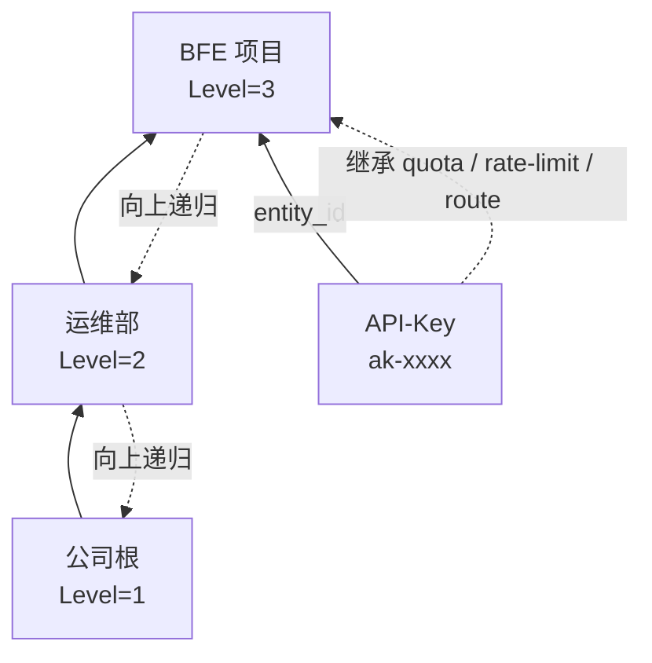

# 第二十一章 API-Key 与配额配置

## 本章目标

通过本章，读者将学会在壬远 AI 网关控制面中完成以下操作：

- 创建、查询、更新、删除 API-Key，以及从外部系统导入已有 Key；
- 为 API-Key 或 Entity 配置 `QuotaPlan`，并理解 `total_token` 与 `RMB` 两种配额单位的适用场景；
- 查询实时余额，并在必要时手动重置配额；
- 利用 Entity 层级结构实现配额与策略的继承；
- 将 API-Key 绑定到 Entity、配额计划、限流策略与路由规则；
- 通过 OpenAPI 完成典型配置流程，并排查常见配置问题。

本章面向运维工程师与平台工程师，假设控制面（AI Gateway API）已部署并可访问，默认监听端口为 `8183`，且读者已具备有效的 Session Key 或长期 Token 用于认证。

---

## 核心概念与配置入口

在壬远 AI 网关中，API-Key 是业务方调用大模型服务的最终凭证，而 Entity 是承载组织层级与策略继承的业务单元。控制面通过 `/open-api/v1/api-keys` 与 `/open-api/v1/entities` 两组接口管理它们。

API-Key 与 Entity 均可以绑定三类策略资源：

- **QuotaPlan（配额计划）**：控制周期内可消耗的资源总量；
- **RateLimitPolicy（限流策略）**：控制单位时间内的 Token、请求与并发；
- **RouteRules（路由规则）**：控制请求应转发到哪个后端 Cluster。

当 API-Key 挂载到 Entity 时，数据面 BFE 会同时考虑 API-Key 自身策略与 Entity 层级向上的策略，形成最终生效规则。理解这一继承关系，是正确配置配额与权限的前提。

---

## API-Key 生命周期管理

API-Key（应用编程接口密钥）是业务方调用 AI 网关时使用的凭证。控制面提供完整的 CRUD 接口，端点统一为 `/open-api/v1/api-keys`。

### 创建 API-Key

创建 API-Key 时，系统会自动生成一个全局唯一的 Key 值，并级联创建其专属的配额计划、限流策略与路由规则。若这些资源未显式传入，则使用默认值：

- `quota_plan` 默认 `unlimited=true`，即不限制配额；
- `rate_limit_policy` 默认 `enabled=false`，即不限流；
- `route_rules` 默认 `enabled=false`，规则为空，即不启用专用路由。

`description` 为必填字段，长度不超过 512 字符。`expired_time` 为 `-1` 表示永不过期，否则应传入不早于当前时间的 Unix 时间戳秒。

以下请求创建一个按月重置、1 亿 Token 配额、挂载到指定 Entity 的 API-Key：

```bash
curl -X POST http://localhost:8183/open-api/v1/api-keys \
  -H "Authorization: Session <your_session_key>" \
  -H "Content-Type: application/json" \
  -d '{
    "description": "BFE 项目测试 Key",
    "expired_time": -1,
    "enabled": true,
    "unlimited_quota": false,
    "models": ["*"],
    "subnet": ["*"],
    "quota_plan": {
      "unlimited": false,
      "pass_when_no_enough_quota": false,
      "quota": 100000000,
      "unit": "total_token",
      "reset_period": "monthly"
    },
    "rate_limit_policy": {
      "enabled": true,
      "rules": {
        "tpm": [
          {"name": "tpm_1min", "model": "*", "window_minutes": 1, "max_tokens": 10000, "step_minutes": 1}
        ],
        "rpm": [
          {"name": "rpm_1min", "model": "*", "window_minutes": 1, "max_requests": 100}
        ],
        "max_concurrency": 50
      }
    },
    "route_rules": {
      "enabled": true,
      "rules": [
        {
          "name": "apikey-default",
          "cond": "default_t()",
          "targets": [
            {"cluster_name": "cluster_apikey", "model": "", "weight": 100}
          ],
          "fallbacks": []
        }
      ]
    },
    "entity_id": "ent-zhangsan-001"
  }'
```

返回中包含 `id`（内部标识）与 `key`（鉴权值），请妥善保存 `key`，控制面不会再次明文返回。若丢失 Key 值，通常需要删除并重新创建 API-Key。

### 查询 API-Key

列表查询支持按启用状态、挂载 Entity、是否无限配额过滤。详情查询会返回完整的嵌套结构，其中 `quota_plan` 包含实时 `balance`。

```bash
# 列表查询，支持 page、page_size、enabled、entity_id、unlimited_quota 等过滤条件
curl "http://localhost:8183/open-api/v1/api-keys?page=1&page_size=20&enabled=true" \
  -H "Authorization: Session <your_session_key>"

# 详情查询，quota_plan 中包含 balance
curl http://localhost:8183/open-api/v1/api-keys/apikey-001 \
  -H "Authorization: Session <your_session_key>"
```

返回的 `quota_plan.balance` 直接来自 Redis，反映当前剩余配额与已用量。若 Redis 不可用，查询接口会返回错误，管理面不再降级到数据库冷数据。

### 更新 API-Key

控制面提供全量更新（`PUT`）与部分更新（`PATCH`）两种方式。更新时 `key` 字段会被忽略，无法修改 Key 值本身；如需更换 Key，应删除旧 Key 并创建新 Key。

例如，仅禁用某个 API-Key：

```bash
curl -X PATCH http://localhost:8183/open-api/v1/api-keys/apikey-001 \
  -H "Authorization: Session <your_session_key>" \
  -H "Content-Type: application/json" \
  -d '{"enabled": false}'
```

修改 `quota_plan.quota`（单位不变）时，系统会保留历史 `used`，按 `remaining = max(0, 新 quota - used)` 调整余额，并通过 `IncrBy(delta)` 原子调整 Redis。这种设计避免了普通调额时清空历史用量。修改 `unit` 或 `unlimited` 时，由于新旧单位无法换算，会重置 `used = 0`、`remaining = 新 quota`，并将 Redis 同步为新值。

若将 API-Key 挂载到新的 Entity，且 `unlimited_quota=false` 且 `quota_plan.unlimited=false`，则要求新 Entity 或其祖先链上至少存在一个有效的 Quota Plan，否则更新会被拒绝。

### 删除 API-Key

删除会级联清理其专属的 `quota_plan`、`rate_limit_policy`、`route_rules` 以及底层资源（若未被其他对象引用），同时删除 Redis 中的配额 Key：

```bash
curl -X DELETE http://localhost:8183/open-api/v1/api-keys/apikey-001 \
  -H "Authorization: Session <your_session_key>"
```

> 注意：删除操作可能影响正在处理中的请求，建议在业务低峰期执行。删除后，原 Key 值立即失效，业务方调用会收到认证失败响应。

---

## 外部 Key 导入

若业务方已在其他系统中持有 API-Key，可通过创建接口的 `key` 参数将其导入壬远 AI 网关，实现平滑迁移。导入后，原 Key 值即可继续用于请求，但配额、限流、路由与模型权限由控制面统一接管。

导入约束：

- 长度 1–128 字符；
- 仅允许大小写字母、数字、连字符 `-`、下划线 `_`；
- 全局唯一，重复会返回 422；
- 更新时 `key` 字段会被忽略，不能通过更新接口修改 Key 值。

典型迁移场景包括：旧网关下线、多网关合并、密钥统一管理。导入时建议同时配置描述、配额与挂载 Entity，以便后续审计与策略继承。

```bash
curl -X POST http://localhost:8183/open-api/v1/api-keys \
  -H "Authorization: Session <your_session_key>" \
  -H "Content-Type: application/json" \
  -d '{
    "key": "ak-migrate-2024q3",
    "description": "从旧系统迁移的 Key",
    "quota_plan": {
      "unlimited": false,
      "quota": 50000000,
      "unit": "total_token",
      "reset_period": "monthly"
    }
  }'
```

导入完成后，应立即验证该 Key 在数据面的可用性，并确认旧系统中的对应配额已停用，避免重复计费或双写。

---

## QuotaPlan 配置：total_token 与 RMB

`QuotaPlan`（配额计划）用于控制 API-Key 或 Entity 在周期内可消耗的资源总量，支持两种单位。选择哪种单位取决于企业的计费模式与管理诉求。

### total_token 配额

`unit = total_token` 适用于按 Token 计费的模型（如 OpenAI、Anthropic）。系统直接统计输入与输出 Token 的总量，并从余额中扣减。该方式直观、易于理解，适合模型单价相对固定或按 Token 采购的场景。

```json
{
  "quota_plan": {
    "unlimited": false,
    "pass_when_no_enough_quota": false,
    "quota": 100000000,
    "unit": "total_token",
    "reset_period": "monthly"
  }
}
```

### RMB 配额

`unit = RMB` 适用于需要按成本统一预算管理的场景。当企业同时使用多种模型、多种价格时，系统会根据模型单价与 Token 消耗量，实时折算为人民币并扣减余额。该方式便于财务部门按月度预算控制总成本。

```json
{
  "quota_plan": {
    "unlimited": false,
    "pass_when_no_enough_quota": false,
    "quota": 5000.00,
    "unit": "RMB",
    "reset_period": "monthly"
  }
}
```

RMB 配额在 Redis 内部以 `1e-8` 元为单位的定点整数存储，对外统一按 4 位小数展示，避免浮点误差。若使用分时段定价，BFE 会根据请求发生时刻匹配当前 tier 价格，再折算为成本扣减。

### 关键字段说明

| 字段 | 说明 |
|------|------|
| `unlimited` | 是否无限配额。为 `true` 时不执行配额检查，余额展示为 sentinel 值。 |
| `pass_when_no_enough_quota` | 配额不足时是否仍放行请求，常用于灰度或测试，生产环境建议关闭。 |
| `quota` | 配额总量。`total_token` 为整数，`RMB` 可带小数。 |
| `unit` | 单位，可选 `total_token` 或 `RMB`，创建后修改会导致余额重置。 |
| `reset_period` | 重置周期，可选 `never`、`weekly`、`monthly`。 |

### 单位选择建议

- 若企业对每种模型分别采购额度，或主要使用单一模型，优先使用 `total_token`；
- 若企业需要跨模型统一成本预算，或模型价格差异大、波动频繁，优先使用 `RMB`；
- 同一 Entity 层级中可同时存在 `total_token` 与 `RMB` 配额，BFE 会分别校验。

---

## 余额查询与手动重置

### 查询配额余额

OpenAPI 查询 API-Key 详情时，`quota_plan` 中已包含实时 `balance`。也可通过独立接口获取：

```bash
curl http://localhost:8183/open-api/v1/api-keys/apikey-001/quota-plan \
  -H "Authorization: Session <your_session_key>"
```

返回示例（Token 配额）：

```json
{
  "ErrNum": 200,
  "ErrMsg": "success",
  "Data": {
    "unlimited": false,
    "pass_when_no_enough_quota": false,
    "quota": 100000000,
    "unit": "total_token",
    "reset_period": "monthly",
    "balance": {
      "used": 12345679,
      "remaining": 87654321
    }
  }
}
```

余额直接读取 Redis，是实时数据；Redis 不可用时查询接口会报错。无限配额返回 sentinel balance（`used=0`，`remaining=100000000`）。

### 手动重置配额

当需要提前恢复额度、修正配额总量或修复 Redis 异常时，可调用重置接口：

```bash
curl -X POST http://localhost:8183/open-api/v1/api-keys/apikey-001/quota-plan/reset \
  -H "Authorization: Session <your_session_key>" \
  -H "Content-Type: application/json" \
  -d '{
    "quota": 100000000,
    "reason": "月初手动清零"
  }'
```

- 若传入 `quota`，则同时更新配额总量并重置余额；
- 若不传 `quota`，则按当前配额总量重置；
- 重置后 `used = 0`，`remaining = quota`；
- 手动重置不会更新 `last_reset_at`，避免干扰周期调度器对自然周/月的判断。

Entity 的余额查询与重置接口为 `/entities/{id}/quota-plan` 与 `/entities/{id}/quota-plan/reset`，行为与 API-Key 一致。

### 周期重置与手动重置的关系

系统每分钟执行一次 `ResetExpiredBalances`，对 `reset_period` 为 `weekly` 或 `monthly` 且非无限配额的计划进行周期重置。周期重置会同时更新 Redis 与 `quota_plans.last_reset_at`。

手动重置仅重置 Redis 余额，不更新 `last_reset_at`。例如，管理员在月中临时将某项目配额从 5000 元调整为 8000 元并手动重置，周期调度器仍会在下月 1 日按新的 `quota` 自动重置，不会受到本次手动操作的干扰。

---

## Entity 层级与配额继承

Entity（实体）是业务组织单元，例如公司、部门、项目、个人。API-Key 通过 `entity_id` 挂载到 Entity 后，会继承该 Entity 及其父级 Entity 的策略。



### 模型白名单与黑名单继承

- `allow_models`（白名单）：取层级交集。非空且不含 `*` 的配置才参与交集；若交集为空且双方均有非空非 `*` 配置，则该 API-Key 导出时被禁用。
- `block_models`（黑名单）：取层级并集。

示例：

| 层级 | allow_models | block_models |
|------|-------------|--------------|
| 公司根 | `["*"]` | `[]` |
| 运维部 | `["gpt-4", "gpt-3.5-turbo"]` | `["gpt-4-32k"]` |
| BFE 项目 | `["gpt-4", "claude-3"]` | `["davinci"]` |
| API-Key | `[]`（未设置） | `[]` |

最终允许模型为 `gpt-4`，禁止模型为 `gpt-4-32k` 与 `davinci`。若 API-Key 自身也设置了非空白名单，则再与上述结果取交集。

### 配额计划的层级收集

导出到 BFE 时，系统会收集 API-Key 自身及 Entity 层级向上的所有**非无限**配额计划。每个计划对应一个 Redis Key：

- API-Key 自身：`QUOTA_<api_key_value>`
- Entity：`QUOTA_<entity_id>`

因此，单个 API-Key 可能同时受多个 Redis Key 的配额控制。例如，某 API-Key 自身有 2000 万 Token 配额，挂载的项目有 1 亿 Token 配额，部门有 5000 元 RMB 预算，则该 Key 必须同时满足这三项约束。

### 限流策略与路由规则的层级合并

- 限流策略：向上递归收集所有**启用**的策略，导出为 `rlp-<policy_id>` 并绑定到 API-Key。收集顺序不影响最终限制，因为各策略独立生效，任一策略触发都会返回 429。
- 路由规则：按 `API-Key 级 → 直接 Entity 级 → 父 Entity 级 → Global 级` 的优先级绑定，BFE 按此顺序匹配。这意味着 API-Key 级规则优先级最高，适合为特定业务方指定专属集群。

---

## API-Key 绑定到 Entity、配额、限流、路由规则

API-Key 创建后即可绑定各类策略。通常推荐先创建 Entity，再创建 API-Key 并指定 `entity_id`。这样可以在组织层面统一配置模型权限与预算，在 API-Key 层面叠加细粒度控制。

### 创建 Entity 并配置策略

```bash
curl -X POST http://localhost:8183/open-api/v1/entities \
  -H "Authorization: Session <your_session_key>" \
  -H "Content-Type: application/json" \
  -d '{
    "name": "bfe-project",
    "type": "team",
    "parent_id": "ent-ops-001",
    "allow_models": ["gpt-4", "claude-3"],
    "block_models": ["gpt-4-32k"],
    "quota_plan": {
      "unlimited": false,
      "quota": 200000000,
      "unit": "total_token",
      "reset_period": "monthly"
    },
    "rate_limit_policy": {
      "enabled": true,
      "rules": {
        "tpm": [
          {"name": "tpm_team", "model": "*", "window_minutes": 1, "max_tokens": 50000, "step_minutes": 1}
        ],
        "rpm": [
          {"name": "rpm_team", "model": "*", "window_minutes": 1, "max_requests": 500}
        ],
        "max_concurrency": 100
      }
    }
  }'
```

### 创建 API-Key 并挂载到 Entity

```bash
curl -X POST http://localhost:8183/open-api/v1/api-keys \
  -H "Authorization: Session <your_session_key>" \
  -H "Content-Type: application/json" \
  -d '{
    "description": "BFE 项目只读 Key",
    "entity_id": "ent-bfe-project-001",
    "unlimited_quota": false,
    "models": ["gpt-4"],
    "quota_plan": {
      "unlimited": false,
      "quota": 50000000,
      "unit": "total_token",
      "reset_period": "monthly"
    },
    "rate_limit_policy": {
      "enabled": true,
      "rules": {
        "tpm": [
          {"name": "tpm_key", "model": "*", "window_minutes": 1, "max_tokens": 10000, "step_minutes": 1}
        ],
        "rpm": [
          {"name": "rpm_key", "model": "*", "window_minutes": 1, "max_requests": 100}
        ],
        "max_concurrency": 20
      }
    },
    "route_rules": {
      "enabled": true,
      "rules": [
        {
          "name": "apikey-default",
          "cond": "default_t()",
          "targets": [
            {"cluster_name": "cluster_bfe", "model": "", "weight": 100}
          ],
          "fallbacks": []
        }
      ]
    }
  }'
```

挂载后，该 API-Key 将受到自身配额（5000 万 Token）与 Entity 配额（2 亿 Token）的双重约束，同时继承 Entity 的模型白名单与黑名单。其最终可用模型为自身 `models` 与 Entity 继承结果的交集，即 `gpt-4`。

---

## 客户端调用示例

业务方获得 API-Key 后，在请求头中携带 `Authorization: Bearer <key>` 调用 AI 网关。以下以 OpenAI 兼容接口为例：

```bash
curl http://localhost:8080/v1/chat/completions \
  -H "Authorization: Bearer ak-2v8x9k3m7p" \
  -H "Content-Type: application/json" \
  -d '{
    "model": "gpt-4",
    "messages": [
      {"role": "user", "content": "Hello"}
    ]
  }'
```

若 API-Key 已禁用、已过期、子网受限或配额耗尽，BFE 会返回相应的 401 / 403 / 429 错误。运维人员可通过查询 API-Key 详情或配额余额接口定位问题。

---

## 完整配置示例

以下为一个完整的部门级预算配置：部门拥有 5000 元/月的 RMB 预算，子项目拥有独立的 Token 配额，API-Key 挂载到项目并配置专用限流与路由。

### 创建部门 Entity

```bash
curl -X POST http://localhost:8183/open-api/v1/entities \
  -H "Authorization: Session <your_session_key>" \
  -H "Content-Type: application/json" \
  -d '{
    "name": "ai-lab",
    "type": "dep",
    "parent_id": null,
    "allow_models": ["*"],
    "block_models": [],
    "quota_plan": {
      "unlimited": false,
      "pass_when_no_enough_quota": false,
      "quota": 5000.00,
      "unit": "RMB",
      "reset_period": "monthly"
    }
  }'
```

### 创建项目 Entity

```bash
curl -X POST http://localhost:8183/open-api/v1/entities \
  -H "Authorization: Session <your_session_key>" \
  -H "Content-Type: application/json" \
  -d '{
    "name": "chatbot-proj",
    "type": "team",
    "parent_id": "ent-ai-lab-001",
    "allow_models": ["gpt-4", "gpt-3.5-turbo", "claude-3"],
    "block_models": [],
    "quota_plan": {
      "unlimited": false,
      "pass_when_no_enough_quota": false,
      "quota": 100000000,
      "unit": "total_token",
      "reset_period": "monthly"
    },
    "rate_limit_policy": {
      "enabled": true,
      "rules": {
        "tpm": [
          {"name": "tpm_proj", "model": "*", "window_minutes": 1, "max_tokens": 20000, "step_minutes": 1}
        ],
        "rpm": [
          {"name": "rpm_proj", "model": "*", "window_minutes": 1, "max_requests": 200}
        ],
        "max_concurrency": 30
      }
    }
  }'
```

### 创建 API-Key 并挂载

```bash
curl -X POST http://localhost:8183/open-api/v1/api-keys \
  -H "Authorization: Session <your_session_key>" \
  -H "Content-Type: application/json" \
  -d '{
    "description": "chatbot-prod-key",
    "entity_id": "ent-chatbot-proj-001",
    "unlimited_quota": false,
    "models": ["gpt-4", "claude-3"],
    "subnet": ["10.0.0.0/8"],
    "quota_plan": {
      "unlimited": false,
      "pass_when_no_enough_quota": false,
      "quota": 20000000,
      "unit": "total_token",
      "reset_period": "monthly"
    },
    "rate_limit_policy": {
      "enabled": true,
      "rules": {
        "tpm": [
          {"name": "tpm_key", "model": "*", "window_minutes": 1, "max_tokens": 5000, "step_minutes": 1}
        ],
        "rpm": [
          {"name": "rpm_key", "model": "*", "window_minutes": 1, "max_requests": 50}
        ],
        "max_concurrency": 10
      }
    },
    "route_rules": {
      "enabled": true,
      "rules": [
        {
          "name": "chatbot-route",
          "cond": "default_t()",
          "targets": [
            {"cluster_name": "cluster_chatbot", "model": "", "weight": 100}
          ],
          "fallbacks": [
            {"cluster_name": "cluster_chatbot_fallback", "model": "", "weight": 100}
          ]
        }
      ]
    }
  }'
```

上述配置生效后，该 API-Key 将同时受到：

- 部门级 5000 元/月 RMB 预算控制；
- 项目级 1 亿 Token/月配额控制；
- 自身 2000 万 Token/月配额控制；
- 项目级与自身限流策略；
- 自身路由规则优先、项目级路由规则兜底；
- 仅允许来自 `10.0.0.0/8` 子网的请求。

---

## 常见问题与排查

| 现象 | 可能原因 | 排查方法 |
|------|---------|---------|
| 请求返回 401 | Key 不存在、已删除或格式错误 | 查询 `/api-keys` 确认 Key 状态 |
| 请求返回 403 | API-Key 已禁用、已过期、子网受限或模型不在白名单 | 检查 `enabled`、`expired_time`、`subnet`、`models` 及 Entity 继承结果 |
| 请求返回 429 | 配额耗尽或限流触发 | 查询 `/api-keys/{id}/quota-plan` 与限流策略 |
| 余额显示为 0 但请求仍通过 | `pass_when_no_enough_quota=true` | 检查 quota_plan 配置 |
| 配额未按月重置 | `reset_period` 为 `never` 或 `last_reset_at` 已更新 | 检查 quota_plan 与调度器日志 |
| 模型权限与预期不符 | Entity 层级 `allow_models` 交集为空 | 逐级检查 Entity 与 API-Key 的 `models` 配置 |

---

## 本章小结

- API-Key 是业务方调用壬远 AI 网关的凭证，支持创建、查询、全量/部分更新、删除及外部 Key 导入；删除时会级联清理专属配置与 Redis Key。
- `QuotaPlan` 支持 `total_token` 与 `RMB` 两种单位，分别适用于按 Token 总量和按成本预算的场景；RMB 配额在 Redis 内部以定点整数存储，对外按 4 位小数展示。
- 余额直接读取 Redis，OpenAPI 详情与独立 `quota-plan` 接口均返回实时 `used` / `remaining`；手动重置接口可按当前或新配额恢复余额，且不干扰周期调度。
- Entity 支持层级结构，API-Key 挂载后继承模型白名单（交集）、黑名单（并集）、配额计划、限流策略与路由规则；策略按 API-Key 级 → Entity 级 → Global 级优先级生效。
- 实际配置时，建议先规划 Entity 层级，再为 API-Key 挂载并叠加细粒度策略，以实现组织级预算控制与项目级资源隔离。遇到异常时，应结合 API-Key 状态、配额余额、Entity 继承结果与 BFE 日志综合排查。

---

## 参考文档

- `ai-gateway-api/design-docs/api-define/OpenAPI接口定义/api-keys.md`
- `ai-gateway-api/design-docs/api-define/OpenAPI接口定义/entities.md`
- `ai-gateway-api/design-docs/sys-design/details/API-Key与Entity关联及模型继承.md`
- `ai-gateway-api/design-docs/sys-design/details/配额余额同步机制.md`
- `rainway-book/design/chapter08-auth-and-apikey.md`
- `rainway-book/design/chapter12-quota-and-rate-limit.md`
- `ai-gateway-api/model/quotacache/quotacache.go`
- `ai-gateway-api/model/quota/quota_plan_manager.go`
