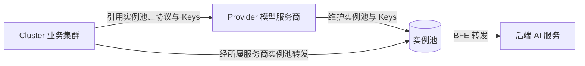

# 第二十一章 Cluster 与路由配置

## 本章目标

通过本章，读者将掌握壬远 AI 网关中 **Cluster（业务集群）** 与 **AI 路由规则** 的核心配置方法。具体包括：理解 Cluster 与 Provider（模型服务商）的关系并独立完成创建；通过 Dashboard 五步向导配置基础项、超时重传、被动健康检查与大模型配置（转发模型、模型重定向、服务鉴权 Keys、Key 路由策略、Key 亲和性、均衡模式）；配置 Global、Entity、API-Key 三级路由表与规则，理解编辑模式下「本地保存」与「提交并生效」的两步保存语义；理解路由优先级与 Fallback 机制；使用表达式构造器与校验工具排查条件语法问题；并通过实际请求验证路由是否生效。

## Cluster 的概念与创建步骤

### 什么是 Cluster

在壬远 AI 网关中，**Cluster（业务集群）** 是数据面 BFE 转发流量的逻辑后端单元。一个 Cluster 引用已创建的 **Provider（模型服务商）**，使用其 `instance_pool`（后端实例池）、协议与 `keys`（API-Key），并在此基础上声明该 Cluster 可服务的模型列表、模型映射、Key 选择策略等。请求经 Cluster 转发到**所属服务商**的实例池。



与 Provider 不同，Cluster 面向“如何使用某个 Provider”：

- Provider 回答“后端是谁、有哪些模型、有哪些 Key”。
- Cluster 回答“本次请求使用哪些模型、如何映射模型名、如何在多 Key 间加权选择、是否启用 Key 亲和性与会话保持”。

### 创建前的准备工作

在创建 Cluster 之前，需要确认以下前置条件已经满足：

1. 已创建产品线（Product）和对应的 Provider，并在 Provider 中维护好实例池、协议，至少配置了一个后端实例与一个模型（参见 [第二十章 Provider 与模型配置](./chapter20-provider-and-model-config.md)）。
2. 若 Cluster 需要使用 API-Key，必须先在 Provider 的 `keys` 中定义好 Key，并记录每个 Key 的 `name`；集群侧只引用 Key 名称，不填写明文。
3. 明确该 Cluster 需要对外暴露哪些模型，以及是否需要模型重定向、多 Key 分流、Key 亲和性、EPP 均衡等高级能力。

> **版本变化**：0.0.7 及更早版本的集群向导包含「实例配置」步骤，现已移除；实例池改在**模型服务商**模块维护，集群向导中选择「所属服务商」即引用其全部实例。

准备工作完成后，可以通过 Dashboard 可视化向导或 OpenAPI 直接提交配置。

### 通过 Dashboard 向导创建集群

进入 资源管理 → AI 业务集群，点击「创建集群」，右侧弹出 **5 步向导**：

1. 基础配置 → 2. 超时和重传 → 3. 被动健康检查 → 4. 大模型配置 → 5. 复查&检查

首次接入可按最小配置创建，其余步骤保持默认直接下一步：

| 向导步骤 | 必填项 |
| ------ | ------ |
| 1 基础配置 | 集群名称、协议（http / https，与后端实际一致） |
| 4 大模型配置 | 所属服务商、转发模型（至少 1 个）；多 Key 时配置权重 |
| 2 / 3 / 5 | 保持默认，直接下一步 |

#### 步骤 1：基础配置

| 字段 | 必填 | 默认值 | 校验规则 | 说明 |
| --- | --- | --- | --- | --- |
| 集群名称 | 是 | 空 | 1-64 字符；仅允许字母、数字、点、下划线、中划线；不能以点、下划线、中划线开头或结尾；不能与已有集群重名 | 唯一标识，创建后不可修改 |
| 集群说明 | 否 | 空 | 不超过 256 字符；不能包含控制字符 | 描述用途 |
| 协议 | 是 | `https` | — | http / https，按后端实际选择 |
| 单个后端最大空闲连接数 | 否 | `0` | 非负整数；不超过 99999999 | 每个后端实例维持的空闲长连接数；0 表示不特别维持 |
| 会话保持 | 否 | 停用 | — | 启用 / 停用 |
| 哈希策略 | 条件必填 | `CLIENT_IP_ONLY` | — | 会话保持启用时显示 |
| 哈希头部 | 条件必填 | 空 | 策略为 CLIENT_ID_ONLY / CLIENT_ID_PREFERED 时必填 | Header 名称或 `Cookie:{key}` |
| 请求写缓存大小（Byte） | 否 | `512` | 正整数 | 向后端写请求时的缓存大小 |
| 后端连接随客户端连接关闭 | 否 | 停用 | — | 启用后客户端断开时同步关闭后端连接 |

**哈希策略**（会话保持启用后可选）：

| 策略 | 含义 | 哈希头部 |
| --- | --- | --- |
| CLIENT_IP_ONLY | 仅根据客户端 IP 做会话保持 | 不需要 |
| CLIENT_ID_ONLY | 仅根据哈希头部做会话保持 | 必填 |
| CLIENT_ID_PREFERED | 优先哈希头部，无头部时回退到客户端 IP | 必填 |

AI 场景通常无需会话保持，保持默认停用即可。

#### 步骤 2：超时和重传

| 字段 | 默认值（ms） | 说明 |
| --- | --- | --- |
| 客户端连接空闲超时 | `30000` | 长连接空闲回收 |
| 读客户端请求Body超时 | `30000` | 读 body + 等待后端 + 写响应的总超时 |
| 连接后端超时 | `50000` | 建连超时 |
| 读后端响应头部超时 | `50000` | 首包超时，流式场景关键 |
| 写响应超时 | `60000` | 向客户端写完全部响应的超时 |
| 集群内重试次数 | `2` | 同集群内转发失败重试次数 |

> 大模型推理首包耗时较长，「读后端响应头部超时」建议按服务商 SLA 放宽。

#### 步骤 3：被动健康检查

| 字段 | 必填 | 默认值 | 说明 |
| --- | --- | --- | --- |
| 故障阈值 | 否 | `3` | 连续转发失败超过该值后实例置为不健康并启动探测 |
| 健康检查间隔（ms） | 否 | `1000` | 探测间隔 |
| 健康检查Host | 否 | 空 | 留空时使用**所属服务商首个实例**地址 |
| 健康检查Uri | 否 | `/` | 必须以 `/` 开头 |
| 健康检查期望的状态码 | 否 | `0` | 0 表示忽略状态码，有响应即健康 |

#### 步骤 4：大模型配置

选择所属服务商后，系统加载该服务商的模型列表与 Key 名称，集群侧只配置**选用哪些模型、各 Key 权重及转发策略**。

**模型服务配置**

| 字段 | 必填 | 说明 |
| --- | --- | --- |
| 所属服务商 | 是 | 下拉选择已创建的服务商；集群引用其实例池、协议与 Keys |
| 转发模型 | 是 | 多选，仅能选所属服务商已配置的模型；下拉首项提供「全选」 |
| 裁剪前缀 | 否 | 开关；用于 OpenRouter 等聚合场景 |
| 匹配前缀 | 条件必填 | 开启裁剪前缀时必填，须以 `/` 结尾，如 `openrouter/` |

裁剪前缀用于 OpenRouter 等聚合服务商场景：开启后，转发给下游前会从请求 `model` 字段中去掉匹配前缀。例如匹配前缀为 `openrouter/` 时，客户端请求模型名 `openrouter/anthropic/claude-3` 会裁剪为 `anthropic/claude-3` 再转发。

**模型重定向**

将客户端请求的模型名映射为转发到后端的模型名。选择「转发的后端模型名称」后，若「原请求的模型名称」为空，会自动填入同名，之后仍可修改。规则要求：

- 原模型名不能重复；
- 目标模型须从「转发模型」已选项中选择；
- API-Key 允许/禁止模型按**重定向后**的目标模型判定。例如原模型名 `glm-5.2-abc`、目标模型 `glm-5.2` 时，Key 允许模型配置 `glm-5.2` 即可放行客户端发送的 `model=glm-5.2-abc` 请求。

**服务鉴权 Keys**

| 字段 | 必填 | 说明 |
| --- | --- | --- |
| Key | 否 | 从所属服务商已配置的 Key **名称**中选择（**不填写 Key 明文**） |
| 权重 | 条件必填 | 0-100；有配置 Key 时所有行权重之和须等于 100 |

- 非必填：不配置时由网关按服务商 Keys 默认策略处理。
- 空行不参与校验；有值的 Key 名称须属于所选服务商。
- 同一 Key 不可选两次：已选名称会从其他行的下拉中过滤掉。

**Key 路由策略**

| 字段 | 默认值 | 说明 |
| --- | --- | --- |
| 策略 | `weighted_random` | 本版仅支持加权随机 |
| 最大重试次数 | `0` | 请求失败后的 Key 级重试 |
| 退避初始值（ms） | `500` | 重试退避初始等待 |
| 退避最大值（ms） | `5000` | 须 ≥ 退避初始值 |

**Key 亲和性**

| 字段 | 默认值 | 说明 |
| --- | --- | --- |
| 是否启用 | 启用 | 开启后同一会话请求绑定同一 Key，避免会话内 Key 漂移 |
| 空闲超时（秒） | — | 启用时必填，须为大于 0 的整数 |
| Key 惩罚 | 停用 | 开启后失败 Key 被临时降权 |
| Redis Key 前缀 | `bfe:ai:key_affinity` | 启用时必填；依赖数据面 Redis 配置 |

> Key 亲和性需数据面配置可用 Redis；Redis 不可用时自动降级为加权随机。

**均衡模式配置**

用于选择集群的后端负载均衡模式：

| 字段 | 必填 | 默认值 | 说明 |
| --- | --- | --- | --- |
| 负载均衡模式 | 否 | `WRR（加权轮询）` | `WRR`：BFE 本地加权轮询；`EPP`：由 EPP 调度器接管后端选择（实例分配见 [第二十六章 EPP 调度运维](./chapter26-epp-scheduling-operation.md)） |

选择 `EPP` 时展示以下配置项（`epp_config`）：

| 字段 | 必填 | 默认值 | 校验规则 | 说明 |
| --- | --- | --- | --- | --- |
| 调度策略 | 否 | `平衡（balanced）` | 枚举 | 延迟优先（latency-first）/ 平衡（balanced）/ 吞吐优先（throughput-first），预设的调度激进程度与优化目标组合 |
| 缓存亲和性 | 否 | `中（medium）` | 枚举 | 低 / 中 / 高；显式指定 KV cache 亲和强度，覆盖调度策略的默认权重 |
| 前缀缓存亲和性 | 否 | 启用 | — | 相同 prompt 前缀的请求尽力收敛到同一后端，提升 KV cache 复用（软亲和，不保证命中） |
| 会话亲和性 | 否 | 停用 | — | 同一会话的请求尽力路由到同一后端；绑定端点摘除后自动迁移重粘 |
| 会话亲和性 Header | 条件必填 | 空 | 非空 Header 名 | 启用会话亲和性时必填，如 `x-session-id`；从该 Header 解析 session id |
| KV 缓存利用率上限 | 否 | `0.9` | 大于 0 且 ≤ 1 | KV cache 利用率超过该值的端点被过滤 |
| 流控配置 | 否 | 见下表 | — | 可折叠卡片，见下表 |

流控配置（`flow_control`）：

| 字段 | 默认值 | 校验规则 | 说明 |
| --- | --- | --- | --- |
| 最大请求数 | `不限` | 不限 / 限制（大于 0 的整数） | 全局并发上限；选「限制」后须填写大于 0 的整数 |
| 队列 TTL（秒） | `60` | ≥ 0 的整数 | 池有端点时的排队预算，超期以可重试背压错误拒绝；`0` 为禁用 |
| 无端点队列 TTL（秒） | 跟随队列 TTL | ≥ 0 的整数 | 池无端点（冷启动扩容）时的排队预算 |
| 启用驱逐 | 停用 | — | 高优先级请求被饱和阻塞时终止低优先级在飞请求，回收容量 |

> **WRR ↔ EPP 切换**：`epp_config` 仅在 `EPP` 模式下生效；切回 `WRR` 时配置**保留但不生效**（休眠），再切回 `EPP` 继续生效，来回切换不丢配置。

#### 步骤 5：复查&检查

汇总展示前 4 步配置，确认后点「提交」。复查面板覆盖：

- **基础配置**：名称、说明、协议、连接与会话保持相关项；
- **超时和重传**：各项超时与集群内重试；
- **被动健康检查**：阈值、间隔、Host（为空时展示「为空时使用所属服务商首个实例地址」）、Uri、状态码；
- **大模型配置**：所属服务商、转发模型、裁剪前缀、模型重定向、Keys 权重、Key 路由策略、Key 亲和性、均衡模式配置。

### 查看、编辑与删除集群

- **查看详情**：集群列表中点击「详情」，右侧弹出抽屉，以只读方式展示全部配置（与复查&检查汇总面板一致），**不展示**服务商实例池（实例池归属服务商资源）。
- **编辑**：点击「编辑」，同一抽屉以编辑模式打开，字段预填充；集群名称创建后不可修改。修改集群会影响所有引用该集群的路由规则，建议低峰期操作。
- **删除**：点击「删除」，弹出确认框。**被路由规则引用时**删除失败，提示会说明被哪张路由表、哪条规则引用，并提供「前往处理」链接，需先在路由表中解除引用（API 层对应 `409 Conflict`，响应中会指明引用规则名）。

其余注意事项：

- 健康检查 Host 留空时，使用所属服务商实例池首个实例地址。
- 转发模型必须是所属服务商模型列表的子集；更换服务商后须重新选择模型与 Keys。
- EPP 模式集群的后端选择由 EPP 调度器接管；若实例池中无有效分配（未分配态），该集群导出配置时会**降级为 WRR**。分配关系在「EPP调度」页查看与覆写，见 [第二十六章 EPP 调度运维](./chapter26-epp-scheduling-operation.md)。

### 通过 OpenAPI 创建 Cluster

创建 Cluster 前，必须先创建好对应的 Provider，并确认 `llm_config.provider` 引用存在。典型创建流程如下：

1. 通过 `POST /clusters` 提交 Cluster 配置。
2. 控制面校验 `name` 全局唯一、长度 1-64 字符（允许单字符名，单查/删除/ready 接口对单字符名同样兼容）、`provider` 存在、`models` 是 Provider 模型子集、`keys` 引用 Provider 中已定义的 Key。
3. 系统根据 `llm_config.provider` 查找对应 Provider、读取其实例信息，自动创建 BFE 侧实例池（名称格式 `{product_name}.{cluster_name}`）、创建子集群（名称 `{cluster_name}`）并绑定到 Cluster。
4. `llm_config.model_table` 由 InnerAPI 根据 Provider 信息自动生成并下发给 BFE，不在 OpenAPI 中展示。

创建请求示例：

```json
{
    "name": "cluster-deepseek-prod",
    "description": "生产环境 DeepSeek 集群",
    "basic": {
        "protocol": "https",
        "connection": {
            "max_idle_conn_per_rs": 0,
            "cancel_on_client_close": false
        },
        "retries": {
            "max_retry_in_cluster": 2
        },
        "buffers": {
            "req_write_buffer_size": 512
        },
        "timeouts": {
            "timeout_conn_serv": 50000,
            "timeout_response_header": 50000,
            "timeout_readbody_client": 30000,
            "timeout_read_client_again": 30000,
            "timeout_write_client": 60000
        }
    },
    "llm_config": {
        "models": ["deepseek-chat", "deepseek-coder"],
        "model_mappings": [
            {"source_model": "gpt-4", "target_model": "deepseek-chat"}
        ],
        "keys": [
            {"name": "key-prod-01", "weight": 70},
            {"name": "key-prod-02", "weight": 30}
        ],
        "key_policy": {
            "strategy": "weighted_random",
            "max_retries": 3,
            "retry_backoff_initial": 500,
            "retry_backoff_max": 5000
        },
        "provider": "deepseek"
    }
}
```

> 注意：控制面为每个 Cluster 自动生成的实例池与子集群是 BFE 侧配置，由系统维护，**不要直接修改** `instance_pool`；实例池的源数据在模型服务商（Provider）中维护，如需调整后端实例，请更新对应 Provider。

### 更新与删除 Cluster

更新 Cluster 时使用 `PATCH /clusters/{cluster_name}`，可修改描述、`basic`、`sticky_sessions`、`passive_health_check` 以及 `llm_config` 等字段。需要特别注意：

- `name` 不允许修改；
- `llm_config.keys` 按**全量替换**处理，调用方需传入完整的 Key 引用列表；
- `sub_clusters` 与 `scheduler` 为系统内部自动生成，不支持手动修改。

删除 Cluster 时，系统会先检查该 Cluster 是否被 Global、Entity 或 API-Key 级别的 AI 路由规则引用。若存在引用，删除将失败并返回 `409 Conflict`（响应中会指明引用规则名），需先解除引用或删除对应路由规则。通过引用检查后，系统会级联解绑子集群、删除子集群、删除实例池，最后删除 Cluster。

同样地，更新 Cluster 模型列表时，若被移除的模型仍被某条路由规则的 `targets` 或 `fallbacks` 引用，更新也会返回 `409 Conflict`；需要先调整对应的路由规则，再修改 Cluster 的模型列表。

## 配置转发策略、模型映射、Key 策略、会话亲和性

上一节按向导步骤介绍了各字段，本节从配置语义角度说明这些字段在 API 层的名称与约束，便于通过 OpenAPI 或配置文件管理。

### 基本转发策略（`basic`）

`basic` 段控制 BFE 与后端交互的传输层行为，与向导「基础配置」「超时和重传」对应：

| 字段 | 含义 | 默认值 |
|------|------|--------|
| `protocol` | 后端协议 | `https` |
| `connection.max_idle_conn_per_rs` | 单个后端最大空闲连接数（每个 BFE 实例为每个后端维持的空闲长连接数） | `0`（不特别维持，AI 场景推荐） |
| `connection.cancel_on_client_close` | 后端连接随客户端连接关闭 | `false` |
| `buffers.req_write_buffer_size` | 请求写缓存大小（Byte） | `512` |
| `timeouts.timeout_read_client_again` | 客户端连接空闲超时（ms） | `30000` |
| `timeouts.timeout_readbody_client` | 读客户端请求 Body 超时（ms） | `30000` |
| `timeouts.timeout_conn_serv` | 连接后端超时（ms） | `50000` |
| `timeouts.timeout_response_header` | 读后端响应头部超时（ms，首包超时） | `50000` |
| `timeouts.timeout_write_client` | 写响应超时（ms） | `60000` |
| `retries.max_retry_in_cluster` | 集群内重试次数 | `2` |

### 会话保持（`sticky_sessions`）

`sticky_sessions` 控制是否将同一客户端长期绑定到同一后端实例：

| 字段 | 含义 | 默认值 |
|------|------|--------|
| `enabled` | 是否开启会话保持 | `false` |
| `hash_strategy` | 哈希策略：`CLIENT_IP_ONLY` / `CLIENT_ID_ONLY` / `CLIENT_ID_PREFERED` | `CLIENT_IP_ONLY` |
| `hash_header` | 哈希头部；策略为 `CLIENT_ID_ONLY` / `CLIENT_ID_PREFERED` 时必填，取 Cookie 时格式为 `Cookie:${key}` | 空 |

AI 场景通常无需会话保持，保持默认关闭即可。

### 被动健康检查（`passive_health_check`）

| 字段 | 含义 | 默认值 |
|------|------|--------|
| `failnum` | 故障阈值：连续转发失败超过该值后实例置为不健康并启动探测 | `3` |
| `interval` | 健康检查间隔（ms） | `1000` |
| `host` | 健康检查 Host；留空时使用所属服务商 `instance_pool` 首个实例地址 | 空 |
| `uri` | 健康检查 Uri，须以 `/` 开头 | `/` |
| `statuscode` | 期望状态码；`0` 表示忽略状态码，有响应即健康 | `0` |

### 模型映射与裁剪前缀（`model_mappings` / `strip_prefix` / `match_prefix`）

`llm_config.model_mappings` 用于将用户请求中的模型名映射为后端实际使用的模型名（Dashboard 称「模型重定向」）。例如将用户习惯的 `gpt-4` 映射为后端的 `deepseek-chat`：

```json
{
    "source_model": "gpt-4",
    "target_model": "deepseek-chat"
}
```

规则要求：

- `source_model` 在同一张映射表中不能重复；
- 映射后的 `target_model` 必须属于该 Cluster `models` 列表，且存在于 Provider 的模型列表中；
- API-Key 允许/禁止模型按**重定向后**的目标模型判定。

`llm_config.strip_prefix` / `match_prefix` 对应向导「裁剪前缀 / 匹配前缀」：`strip_prefix=true` 时 `match_prefix` 必填且须以 `/` 结尾，转发给下游前会从请求 `model` 字段中去掉该前缀。

### Key 策略（`llm_config.keys` 与 `key_policy`）

`llm_config.keys` 引用 Provider 中定义的 Key，并为其分配权重，实现多 Key 加权随机选择：

```json
{
    "keys": [
        {"name": "key-prod-01", "weight": 70},
        {"name": "key-prod-02", "weight": 30}
    ]
}
```

约束：每个 `name` 必须对应 Provider `keys` 中已存在的 name 且同一数组内唯一；`weight` 取值 `[0,100]`（0 表示该 Key 不接收流量）；所有 Key 的 `weight` 之和必须等于 100。

`key_policy` 控制 Key 选择算法与失败重试行为：

| 字段 | 含义 | 默认值 |
|------|------|--------|
| `strategy` | 选择算法，本版仅支持 `weighted_random` | `weighted_random` |
| `max_retries` | 当前请求在 Key 层面的总额外重试次数 | `0` |
| `retry_backoff_initial` | 首次重试退避时间（ms） | `500` |
| `retry_backoff_max` | 退避时间上限（ms），须 ≥ 初始值 | `5000` |

### Key 亲和性（`llm_config.key_affinity`）

`key_affinity` 基于 Redis 实现会话级 Key 亲和性：同一 `ClientKeyId` 在绑定有效期内持续命中同一 Key，避免会话内 Key 漂移。

| 字段 | 含义 | 默认值 |
|------|------|--------|
| `enabled` | 是否开启 Key 亲和性 | `true` |
| `ttl` | 绑定空闲超时时间（秒），命中绑定后 BFE 会刷新 TTL，持续请求则绑定保持 | `600` |
| `redis_prefix` | Redis Key 前缀 | `"bfe:ai:key_affinity"` |
| `penalty_enable` | Key 惩罚：开启后近期返回 `429/401/403` 的 Key 会被临时降权、跳过 | `true` |

> Key 亲和性依赖数据面 Redis 配置；Redis 不可用时自动降级为加权随机。

### 均衡模式（`balance_mode` 与 `epp_config`）

| 字段 | 含义 | 默认值 |
|------|------|--------|
| `balance_mode` | 集群均衡模式：`WRR`（BFE 本地加权轮询）/ `EPP`（由 EPP 调度器接管后端选择）；是 EPP 模式的唯一判定来源 | `WRR` |
| `epp_config` | EPP 调度配置（简化用户形态），仅 `balance_mode=EPP` 时必填并生效 | 见下表 |

`epp_config` 各字段（与向导「均衡模式配置」对应）：

| 字段 | 含义 | 默认值 |
|------|------|--------|
| `scheduling_profile` | 调度策略档位：`latency-first`（延迟优先）/ `balanced`（平衡）/ `throughput-first`（吞吐优先） | `balanced` |
| `cache_affinity` | 缓存亲和性：`low` / `medium` / `high`，显式指定 KV cache 亲和强度，覆盖调度策略的默认权重 | 缺省（跟随调度策略） |
| `prefix_cache_affinity` | 前缀缓存亲和：相同 prompt 前缀的请求尽力收敛到同一后端（软亲和，不保证命中） | `true` |
| `session_affinity_enabled` | 会话亲和：同一会话的请求尽力路由到同一后端；绑定端点摘除后自动迁移重粘 | `false` |
| `session_affinity_header` | session id 来源 Header（如 `x-session-id`），启用会话亲和时必填 | 空 |
| `kv_cache_utilization_max` | KV 缓存利用率上限，利用率超过该值的端点被过滤，取值 `(0,1]` | `0.9` |
| `flow_control.max_requests` | 全局并发上限；缺省或 `-1` 表示不限 | 不限 |
| `flow_control.queue_ttl` | 池有端点时的排队预算（秒），超期以可重试背压错误拒绝；`0` 为禁用 | `60` |
| `flow_control.no_endpoint_queue_ttl` | 池无端点（冷启动扩容）时的排队预算（秒） | 跟随 `queue_ttl` |
| `flow_control.enable_eviction` | 需求驱动驱逐：高优先级请求被饱和阻塞时终止低优先级在飞请求，回收容量 | `false` |

EPP 集群配置示例：

```json
{
    "name": "cluster-epp-gpu",
    "description": "EPP 调度集群示例",
    "balance_mode": "EPP",
    "epp_config": {
        "scheduling_profile": "balanced",
        "cache_affinity": "medium",
        "prefix_cache_affinity": true,
        "session_affinity_enabled": true,
        "session_affinity_header": "x-session-id",
        "kv_cache_utilization_max": 0.9,
        "flow_control": {
            "max_requests": -1,
            "queue_ttl": 60,
            "no_endpoint_queue_ttl": 60,
            "enable_eviction": false
        }
    },
    "llm_config": {
        "models": ["deepseek-chat"],
        "provider": "deepseek"
    }
}
```

> 语义要点：`epp_config` 为简化用户形态，导出时由控制面确定性编译为完整 `EndpointPickerConfig`；仅 `balance_mode=EPP` 时编译下发，`WRR` 时保留但不生效（休眠），来回切换不丢配置。实例分配关系在「EPP调度」页维护，见 [第二十六章 EPP 调度运维](./chapter26-epp-scheduling-operation.md)。

## Global / Entity / API-Key 级路由规则配置

AI 路由规则决定“请求按什么规则、以什么比例转发到哪些集群 + 模型”。系统预置三种作用域的路由表：

| 路由表类型 | 作用范围 |
| --- | --- |
| Global | 全局兜底，未命中 API-Key / Entity 路由表时使用 |
| Entity | 命中指定组织的请求，该组织下所有 Key 共享 |
| API-Key | 命中指定 API-Key 的请求，专属规则互不干扰 |

匹配优先级：**API-Key > Entity > Global**。同一路由表内，规则按列表顺序依次匹配表达式，**命中第一条即停止**，请求按该规则的目标权重转发；全部规则未命中时回落下一优先级路由表 / 走系统默认转发。因此更具体的规则应排在前面。

AI 路由规则工作在 API-Key 鉴权之后，决定请求最终转发到哪个目标模型与后端 Cluster。需要特别说明的是，在 AI 网关模式下，BFE 通过独立的 `ServeHTTPForAI()` 路径处理请求；`findProduct()` 仅用于产品线识别和配置上下文加载，传统产品级 BFE 路由规则（`route_basic_rules` / `route_advance_rules` / `route_default_rules`）不参与 AI 请求的 Cluster 选择。

### 路由表列表

进入 路由管理 → 路由表，展示所有路由表列表：

| 列名 | 说明 |
| --- | --- |
| 路由表类型 | Global / Entity / API-Key，支持下拉筛选 |
| 路由表属主 | global 显示 `global`；entity 显示组织名称；apikey 显示 Key ID |
| 状态 | 启用 / 停用，支持下拉筛选 |
| 操作 | 查看、启用 / 停用 |

- **状态切换**：点击「启用」或「停用」按钮可切换路由表状态。路由表停用后该表规则不再生效，流量回落到下一优先级路由表。停用路由表前请确认回落路径可用，避免流量中断。
- **自动创建**：API-Key 创建后会自动生成属主为该 Key 的 apikey 路由表，无需手工建表。

### 编辑模式：本地保存与提交并生效

点击路由表行「查看」按钮进入该路由表的路由规则页面。规则的新增、编辑、删除需在**编辑模式**下进行，注意有两个“保存”步骤，缺一不可：

| 步骤 | 操作 | 作用 | 是否影响线上 |
| ------ | ------ | ------ | ------------ |
| 1 | 点击「进入编辑模式」 | 进入可编辑状态 | 不影响 |
| 2 | 添加/编辑/删除规则 | 修改规则内容 | 不影响 |
| 3 | 点击「本地保存」 | 把本条规则暂存到页面列表中 | **仍不影响** |
| 4 | 点击「提交并生效」 | 把所有修改真正下发到网关 | **正式生效** |

关键提醒：

- 只有第 4 步「提交并生效」才会让规则真正生效；如果只点「本地保存」就离开，修改不会生效。
- 提交并生效后系统自动退出编辑模式，回到查看模式，列表显示最新规则。
- 规则变更尚未提交时，点击「返回」、面包屑或切换其他菜单，会弹出丢失确认提示（「当前规则变更尚未提交并生效，离开页面后修改将丢失，是否确认离开？」）；确认离开则放弃修改。
- 提交并生效后，配置通常在**数秒到数十秒**内同步到数据面（依赖 Conf Agent / conf-agent）。若 curl 立即失败，可等待 10～30 秒后重试。

### 规则表单

编辑模式下点击「添加规则」，或在操作列点击「编辑」，右侧弹出规则抽屉：

| 字段 | 必填 | 默认值 | 格式要求 | 说明 |
| --- | --- | --- | --- | --- |
| 规则名称 | 是 | 空 | 1-64 字符；仅允许字母、数字、`-`、`_`、`.`；不能以 `-`、`_`、`.` 开头或结尾 | 表内唯一 |
| 表达式 | 是 | 空 | 合法的 BFE 条件表达式 | 构造器点选生成或直接编辑，保存时服务端校验 |
| 目标集群和模型 | 是 | 至少 1 项目标 | 见下方目标与权重 | 多个目标时按权重分配 |
| 备用集群和模型 | 否 | 空 | 见下方备用集群 | 转发失败时的回落目标；可为空 |

规则抽屉底部提供「本地保存」（校验名称、表达式、目标权重和重复性，通过后暂存到规则列表）与「重置」（清空当前规则内容，恢复到打开抽屉前的状态）。

规则列表展示当前路由表下的所有规则（规则名称、表达式、目标集群和模型，悬停可查看完整内容），按列表顺序依次匹配；查看模式下操作列为「查看」，编辑模式下为「编辑 / 删除」。列表支持搜索和排序。

### 表达式构造器

表达式即“条件判断语句”——当请求满足条件时，就按本条规则转发。不用手写代码，点击构造器按钮即可生成。表达式为 BFE 条件表达式，构造器按维度提供按钮点选生成，点击后自动插入到表达式文本中；逻辑连接符提供 `(`、`)`、`&&`、`||`、`!`。

条件维度与操作符：

| 维度 | 操作符 | 生成表达式示例 |
| --- | --- | --- |
| host | in | `req_host_in("www.a.com\|www.b.com")` |
| port | in | `req_port_in("80\|8080")` |
| method | in | `req_method_in("GET")` |
| path | in / prefix_in / suffix_in | `req_path_prefix_in("/v1/", false)` |
| query | exist / key_in / key_prefix_in / value_in / value_prefix_in / value_suffix_in / value_hash_in | `req_query_value_in("search", "flower", false)` |
| cookie | key_in / value_in / value_prefix_in / value_suffix_in / value_hash_in | `req_cookie_value_in("ssp-web-version", "v0", true)` |
| header | key_in / value_in / value_prefix_in / value_suffix_in / value_hash_in | `req_header_value_in("api_version", "v1\|v2", true)` |
| clientIP | range / trusted / hash_in | `req_cip_range("1.1.1.1", "2.2.2.2")` |
| proto | secure | `req_proto_secure()` |
| system | bfe_time_range / bfe_cluster_in | `bfe_time_range("20190204203000H", "20190204204500H")` |
| body | req_body_json_in | `req_body_json_in("level1.level2.level3", "pat1\|pat2", false)` |
| body | req_body_json_prefix_in | `req_body_json_prefix_in("level1.level2", "prefix1\|prefix2", false)` |

参数说明：表达式末尾的 `true` / `false` 表示“是否忽略大小写”：`true` = 忽略大小写（更灵活），`false` = 区分大小写（严格匹配）。

最简兜底：若只想让所有请求都走同一个集群，在构造器中点击 `path` 行的 `prefix_in`、参数填 `/`，得到 `req_path_prefix_in("/", false)`（等价于 `default_t()`），即“匹配所有以 `/` 开头的请求”。这是最常见的兜底规则。

常用场景示例：

| 场景 | 表达式示例 |
| --- | --- |
| 兜底匹配所有请求 | `req_path_prefix_in("/", false)`（或 `default_t()`） |
| 按路径前缀分流 | `req_path_prefix_in("/v1/", false)` |
| 按 Header + 方法分流 | `req_header_value_in("api_version", "v1\|v2", true) && req_method_in("POST")` |
| 按查询参数灰度 | `req_query_value_in("gray", "1", false)` |
| 按请求体模型字段 | `req_body_json_in("model", "gpt-4", false)` |

### 目标与权重

每个目标包含以下字段：

| 字段 | 必填 | 默认值 | 说明 |
| --- | --- | --- | --- |
| 集群 | 是 | 空 | 下拉选择已创建的业务集群 |
| 模型 | 否 | 空 | 下拉选择该集群下的模型；留空表示透传请求中的模型名 |
| 权重 | 是 | `0` | 0-100 的整数；多目标时流量分配比例，所有目标权重之和必须等于 100 |

- **指定模型**：无论客户端请求什么 model，都转发到该模型（适合统一出口）。指定模型是**目标模型解析的第一步**，其后依次为集群「裁剪前缀」、「模型重定向」；API-Key 的允许/禁止模型按最终解析出的目标模型判定。
- **留空**：使用请求体中的 model 字段（适合客户端自选模型；需与后端实际模型名一致）。

点击「+ 添加目标」增加目标行；规则至少需要保留 1 项目标。

### 备用集群

除正常目标外，还可配置 **fallbacks（备用集群）**：请求按正常目标转发失败时，回落到备用集群继续尝试。备用集群字段与目标类似，但**不含权重**（集群必填、模型可留空表示透传）。点击「+ 添加备用集群」增加行，备用集群列表可为空。同一规则内，备用集群之间、备用集群与目标集群之间的**「集群 + 模型」组合均不能重复**。

### 校验规则

保存和提交时系统会进行以下校验：

- 同一规则内**目标权重之和必须等于 100**；
- 同一规则内**目标集群 + 模型**组合不能重复；
- 同一规则内**备用集群 + 模型**组合不能重复，且**不能与目标集群组合重复**；
- 同一张路由表内**规则名称**不能重复；
- 表达式语法错误会在保存时提示（服务端校验 BFE 条件表达式语法）；
- 规则至少包含 1 项目标。

### 规则存储与 OpenAPI 管理

AI 路由规则统一存储在 `route_rules` 表中，面向三个层级：

| 层级 | 类型 | 所有者 | 管理入口 |
|------|------|--------|----------|
| Global | `global` | `global` | `PUT /global-route-rules` |
| Entity | `entity` | `entity_id` | Entity 创建/更新接口内嵌 |
| API-Key | `apikey` | `api_key_id` | API-Key 创建/更新接口内嵌 |

每条规则包含：

- `name`：规则名称，同一张路由表中唯一；
- `Cond`：BFE 条件表达式；
- `targets`：目标 Cluster + 模型 + 权重列表，权重之和必须等于 100；
- `fallbacks`：可选的 Fallback 目标列表。

#### Global 路由表

Global 路由表是全局兜底规则，所有 API-Key 最终都会绑定它。系统初始化时会自动创建默认记录（`enabled=false`、`rules=[]`），首次使用前应配置为启用状态。一条好的 Global 兜底规则通常使用 `default_t()` 作为条件，并将所有未命中的流量导向默认 Cluster。

```json
{
    "enabled": true,
    "rules": [
        {
            "name": "global-default",
            "cond": "default_t()",
            "targets": [
                {"cluster_name": "cluster-global", "model": "", "weight": 100}
            ],
            "fallbacks": [
                {"cluster_name": "cluster-global-fallback", "model": ""}
            ]
        }
    ]
}
```

#### Entity 与 API-Key 路由表

Entity 和 API-Key 的路由表在创建/更新对应资源时作为内嵌对象写入。例如，在 Entity 配置中附带 `route_rules`，即可实现部门级路由策略；在 API-Key 中附带 `route_rules`，则可实现用户级精细化路由。创建时若未显式传入 `route_rules`，系统会默认生成一条 `enabled=false`、`rules=[]` 的空记录，方便后续再启用；API-Key 创建后 Dashboard 会自动生成其 apikey 路由表。

`GET /route-tables` 用于分页查看所有路由表元信息，返回字段仅包含 `id`、`type`、`owner`、`enabled`，不包含规则详情。其中 API-Key 级路由表的 `type` 对外取值为 `api_key`（内部存储与 BFE 导出配置仍使用 `apikey`，控制面自动做双向映射），`type` 查询参数也接受 `api_key`。若需要查看或修改规则内容，需要访问对应层级的管理接口，例如 Global 路由表使用 `GET /global-route-rules` 与 `PUT /global-route-rules`。

## 路由规则优先级与 Fallback

### 绑定顺序

对于每个 API-Key，BFE 会按以下顺序获得一张路由表列表：

1. `apikey_<key>`：API-Key 级路由表；
2. `entity_<entity_name>`：API-Key 直接挂载的 Entity 路由表；
3. 沿 `parent_id` 向上遍历的所有祖先 Entity 路由表；
4. `global_default`：Global 路由表。

BFE 按该顺序依次匹配，命中即停止。因此优先级为：

**API-Key 级 > 直接 Entity 级 > 父 Entity 级 > Global 级**

### 规则内匹配

在同一张路由表内部，规则按数组顺序依次匹配，命中第一条即停止，命中后根据 `targets` 权重选择目标 Cluster 与模型。因此更具体的规则应排在前面。

### Fallback 机制

若某条规则的 `targets` 全部失败，BFE 会尝试该规则的 `fallbacks` 列表。Fallback 目标按顺序使用，不计算权重。建议在 Global 层至少保留一条 `default_t()` 兜底规则，避免请求无目标可转。

> 注意：被禁用的路由表（`enabled=false`）不会导出到 BFE，也不会加入绑定列表；路由表停用或表达式不匹配时，请求回落下一优先级路由表。

## 表达式校验工具的使用

AI 路由规则的 `Cond` 字段使用 BFE 条件表达式语法。常见表达式示例：

| 条件含义 | 表达式示例 |
|----------|------------|
| 全匹配 | `default_t()` |
| 按请求 Host | `req_host_in("api.example.com")` |
| 按路径前缀 | `req_path_prefix_in("/v1/chat", false)` |
| 按请求方法 | `req_method_in("POST")` |
| 按请求头 | `req_header_value_in("api_version", "v1\|v2", true)` |
| 按请求体 JSON 字段 | `req_body_json_in("model", "gpt-4", false)` |
| 多条件组合 | `req_host_in("api.example.com") && req_body_json_in("model", "gpt-4", false)` |

> 注意：保存阶段控制面除校验表达式非空外，还会通过 `validate.ConditionExpression` 对表达式做 BFE 语法校验（内部调用 `condition.Build`），语法错误的表达式无法写入数据库。Dashboard 的表达式构造器可点选生成表达式，规则抽屉「本地保存」时也会做服务端校验，便于提前发现问题。

若使用 OpenAPI 直接管理，控制面会在写入前完成校验；如需在本地提前验证，也可调用 `RouteRuleManager.ExpressionVerify` 或直接使用 BFE 的条件表达式解析工具。

常用校验建议：

1. 任何使用请求体 JSON 的条件，都要注意第三个参数表示是否忽略大小写：`true` 表示忽略大小写（更灵活），`false` 表示区分大小写；模型名匹配通常使用 `false` 严格匹配。
2. 组合条件时，使用 `&&` 连接，避免遗漏括号或转义字符。
3. 对于包含中文、斜杠等特殊字符的模型名，应使用正确的 JSON 转义，确保控制面存储的值与 BFE 解析的值一致。
4. 配置完成后，建议先在测试环境用真实请求验证一次，再同步到生产环境。

## 验证路由是否生效

路由配置完成后，建议按以下步骤验证：

1. **确认 Cluster 健康**：检查对应 Provider 的实例可达，Cluster 被动健康检查状态正常。可以通过 BFE 状态接口或控制面查看 Cluster 的健康状态。
2. **确认路由表启用**：通过 `GET /route-tables` 确认相关路由表 `enabled=true`。若路由表被禁用，即使规则内容正确也不会下发到 BFE。
3. **确认绑定关系正确**：检查 API-Key 是否挂载到了预期的 Entity，以及 `ApikeyRouteTableBindings` 中是否包含期望的路由表顺序。
4. **等待配置同步**：Dashboard「提交并生效」后，配置通常在数秒到数十秒内经 Conf Agent（conf-agent）同步到数据面。若立即验证失败，可等待 10～30 秒后重试。
5. **发起测试请求**：使用已配置路由规则的 API-Key 发起对话请求，观察返回模型与目标 Cluster。建议在请求中显式指定模型名，以便验证模型映射是否生效。
6. **查看日志与指标**：在 BFE 日志中确认命中了预期的路由表与规则；通过响应头或监控指标确认模型已被正确替换。如果命中了 Fallback，也应在日志中看到对应的 Fallback 标记。

例如，可通过如下请求验证 Global 兜底规则：

```bash
curl -i https://api.example.com/v1/chat/completions \
  -H "Authorization: Bearer ak-test-001" \
  -H "Content-Type: application/json" \
  -d '{"model":"gpt-4","messages":[{"role":"user","content":"hello"}]}'
```

若返回的模型被映射为 `deepseek-chat`，且请求日志显示命中 `global-default` 规则，则路由生效。

## 完整配置示例

以下示例展示了一个完整 AI 路由场景，覆盖 Cluster、Global 路由表与 API-Key 路由表的协同：

- `cluster-deepseek-prod`：引用 `deepseek` Provider，支持模型映射与多 Key 加权；
- `cluster-azure-fallback`：作为 Fallback 集群，当主集群不可用时承接流量；
- Global 兜底规则：为未配置专属规则的 API-Key 提供默认转发目标；
- API-Key 级精细化规则：为 `ak_user_a` 单独指定 `gpt-4` 模型请求的转发路径。

在这个场景中，`ak_user_a` 请求 `gpt-4` 时，会优先命中 API-Key 级规则，模型被映射为 `deepseek-chat` 并转发到 `cluster-deepseek-prod`；若该请求失败，则 fallback 到 `cluster-azure-fallback`。对于其他模型或没有 API-Key 级规则的情况，则命中 Global 兜底规则。

EPP 均衡模式集群的配置示例见前文「均衡模式（`balance_mode` 与 `epp_config`）」一节。

### Cluster 配置

```json
{
    "name": "cluster-deepseek-prod",
    "description": "DeepSeek 生产集群",
    "basic": {
        "protocol": "https",
        "connection": {"max_idle_conn_per_rs": 0, "cancel_on_client_close": false},
        "retries": {"max_retry_in_cluster": 2},
        "buffers": {"req_write_buffer_size": 512},
        "timeouts": {
            "timeout_conn_serv": 50000,
            "timeout_response_header": 50000,
            "timeout_readbody_client": 30000,
            "timeout_read_client_again": 30000,
            "timeout_write_client": 60000
        }
    },
    "sticky_sessions": {"enabled": false},
    "passive_health_check": {
        "interval": 1000,
        "failnum": 3,
        "host": "",
        "uri": "/",
        "statuscode": 0
    },
    "llm_config": {
        "models": ["deepseek-chat", "deepseek-coder"],
        "model_mappings": [
            {"source_model": "gpt-4", "target_model": "deepseek-chat"}
        ],
        "keys": [
            {"name": "key-prod-01", "weight": 70},
            {"name": "key-prod-02", "weight": 30}
        ],
        "key_policy": {
            "strategy": "weighted_random",
            "max_retries": 3,
            "retry_backoff_initial": 500,
            "retry_backoff_max": 5000
        },
        "key_affinity": {
            "enabled": true,
            "ttl": 600,
            "redis_prefix": "bfe:ai:key_affinity",
            "penalty_enable": true
        },
        "provider": "deepseek"
    }
}
```

### AI 路由配置（BFE `ai_route.data`）

```json
{
    "Version": "20260720150000",
    "route_rules": {
        "apikey_ak_user_a": {
            "type": "apikey",
            "owner": "ak_user_a",
            "rules": [
                {
                    "name": "user_a-gpt4",
                    "Cond": "req_body_json_in(\"model\", \"gpt-4\", false)",
                    "targets": [
                        {"ClusterName": "cluster-deepseek-prod", "Model": "deepseek-chat", "Weight": 100}
                    ],
                    "fallbacks": [
                        {"ClusterName": "cluster-azure-fallback", "Model": "gpt-4"}
                    ]
                }
            ]
        },
        "global_default": {
            "type": "global",
            "owner": "global",
            "rules": [
                {
                    "name": "global-default",
                    "Cond": "default_t()",
                    "targets": [
                        {"ClusterName": "cluster-deepseek-prod", "Model": "", "Weight": 100}
                    ],
                    "fallbacks": [
                        {"ClusterName": "cluster-azure-fallback", "Model": ""}
                    ]
                }
            ]
        }
    },
    "ApikeyRouteTableBindings": {
        "ak_user_a": [
            "apikey_ak_user_a",
            "global_default"
        ]
    }
}
```

## 本章小结

- **Cluster** 是 BFE 转发的逻辑后端，引用 Provider（模型服务商）并声明模型、Key、转发策略等；0.0.7 及更早版本向导中的「实例配置」步骤已移除，实例池归属模型服务商。
- Dashboard 通过 **5 步向导**创建集群：基础配置 → 超时和重传 → 被动健康检查 → 大模型配置 → 复查&检查；超时默认值 30000/30000/50000/50000/60000ms、集群内重试 2 次，健康检查阈值 3、间隔 1000ms。
- 大模型配置涵盖：转发模型（服务商模型子集）、模型重定向（API-Key 模型访问控制按重定向后目标模型判定）、服务鉴权 Keys（权重和 = 100）、Key 路由策略（`weighted_random`）、Key 亲和性（依赖数据面 Redis，不可用时降级加权随机）以及均衡模式（`WRR` 默认 / `EPP`，`epp_config` 休眠保留、来回切换不丢配置）。
- AI 路由规则分为 **Global、Entity、API-Key** 三级，优先级 **API-Key > Entity > Global**；API-Key 创建后自动生成其 apikey 路由表，路由表停用后流量回落下一优先级。
- Dashboard 编辑模式有**两步保存**语义：「本地保存」仍不影响线上，「提交并生效」才真正下发，提交后数秒到数十秒经 Conf Agent 同步到数据面；未提交离开页面有丢失确认提示。
- 规则校验包括：目标权重和 = 100、「集群 + 模型」组合不重复、规则名称表内唯一、表达式服务端语法校验、至少 1 项目标；同表内规则按顺序匹配，命中第一条即停止。
- `Cond` 表达式末尾参数 `true` = 忽略大小写、`false` = 区分大小写；最简兜底为 `req_path_prefix_in("/", false)` 或 `default_t()`。
- 通过测试请求、BFE 日志与监控指标可以验证路由是否按预期生效。

## 参考文档

- `ai-gateway-web/docs/zh-cn/04-ai-business-cluster.md`（Dashboard 控制台手册：AI 业务集群）
- `ai-gateway-web/docs/zh-cn/10-route.md`（Dashboard 控制台手册：路由管理）
- `ai-gateway-api/design-docs/api-define/OpenAPI接口定义/clusters.md`
- `ai-gateway-api/design-docs/api-define/OpenAPI接口定义/global-route-rules.md`
- `ai-gateway-api/design-docs/api-define/OpenAPI接口定义/route-tables.md`
- `ai-gateway-api/design-docs/sys-design/details/路由规则管理.md`
- `bfe/docs/zh_cn/configuration/mod_ai_route/ai_route.data.md`
