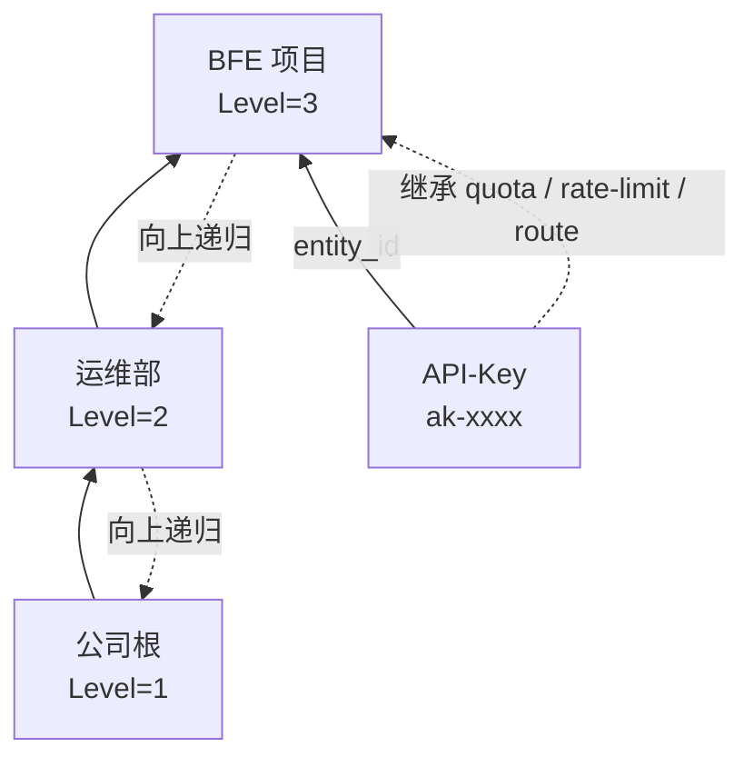

# 第二十二章 API-Key 与配额配置

## 本章目标

通过本章，读者将学会在壬远 AI 网关控制面（AI Gateway API）与 Dashboard 控制台中完成以下操作：

- 在 Dashboard 中管理 Entity 类型与 Entity 组织，包括创建、编辑、删除与查看详情；
- 创建、查询、更新、删除 API-Key，以及从外部系统导入已有 Key；
- 为 API-Key 或 Entity 配置 `QuotaPlan`，并理解 `total_token` 与 `RMB` 两种配额单位的适用场景；
- 查询实时余额，并在必要时通过 Dashboard 或 OpenAPI 手动重置配额；
- 理解请求运行时「模型访问控制 → 限流检查 → 配额扣减」的生效机制，以及 API-Key 两阶段检查的位置差异；
- 利用 Entity 层级结构实现配额与策略的继承；
- 将 API-Key 绑定到 Entity、配额计划、限流策略与路由规则；
- 通过 OpenAPI 完成典型配置流程，并排查常见配置问题。

本章面向运维工程师与平台工程师，假设控制面（AI Gateway API）已部署并可访问，默认监听端口为 `8183`，且读者已具备有效的 Session Key 或长期 Token 用于认证。本章控制台操作均基于 Dashboard v0.0.10，相关入口集中在「消费者管理」模块。

---

## 核心概念与配置入口

在壬远 AI 网关中，API-Key 是业务方调用大模型服务的最终凭证，而 Entity 是承载组织层级与策略继承的业务单元。控制面通过 `/open-api/v1/api-keys` 与 `/open-api/v1/entities` 两组接口管理它们。

API-Key 与 Entity 均可以绑定三类策略资源：

- **QuotaPlan（配额计划）**：控制周期内可消耗的资源总量；
- **RateLimitPolicy（限流策略）**：控制单位时间内的 Token、请求与并发；
- **RouteRules（路由规则）**：控制请求应转发到哪个后端 Cluster。

当 API-Key 挂载到 Entity 时，数据面 BFE 会同时考虑 API-Key 自身策略与 Entity 层级向上的策略，形成最终生效规则。理解这一继承关系，是正确配置配额与权限的前提。

在 Dashboard v0.0.10 中，本章涉及对象的入口如下：

| 对象 | Dashboard 入口 |
|------|----------------|
| Entity 类型 | 消费者管理 → Entity 管理 → Entity 类型管理页签 |
| Entity 组织 | 消费者管理 → Entity 管理 → Entity 组织管理页签（默认页签） |
| API-Key | 消费者管理 → API Key 管理 |

以下各节先介绍 Dashboard 控制台操作，再给出对应的 OpenAPI 用法。

---

## Entity 类型管理

Entity 类型是对调用方组织的一种分类维度（如部门、团队、个人），用于定义组织的层级关系。在 Dashboard 中进入「消费者管理 → Entity 管理」，切换到 **Entity 类型管理** 页签即可维护类型。

### 类型列表

列表展示类型名、描述、级别、创建时间与操作（编辑、删除）：

- **类型名**：类型标识，支持按名称搜索；
- **级别**：取值 1-5 的整数，**数字越小代表层级越高**（1 = 公司级，2 = 部门级，3 = 团队级，4 = 小组级，5 = 个人级），支持下拉筛选；
- 列表右上角为「创建类型」按钮。

### 创建类型

点击「创建类型」按钮，右侧弹出创建抽屉，字段如下：

| 字段 | 必填 | 默认值 | 格式要求 | 说明 |
|------|------|--------|----------|------|
| 类型名 | 是 | 空 | 1-32 字符；仅含小写字母、数字、下划线（`_`）、连字符（`-`）；不能以下划线或连字符开头或结尾 | 全局唯一，创建后不可修改，如 `dep`、`team` |
| 描述 | 否 | 空 | 最多 1024 字符 | 类型说明，如「一级部门」 |
| 级别 | 是 | `1` | 1-5 的整数 | 数字越小层级越高。例如 1 对应公司、2 对应部门、3 对应团队；高级别（数字小）可作为低级别（数字大）的父级 |

创建成功后关闭抽屉并刷新列表。

### 编辑与删除类型

点击操作列「编辑」按钮弹出编辑抽屉：类型名置灰不可修改，描述与级别可编辑。点击「删除」按钮，确认后立即删除；**类型下存在组织时无法删除，需先清理该类型下的全部组织**。

### 类型设计的注意事项

- 类型名创建后不可修改，命名应简洁且有业务含义（如 `dep`、`team`）。
- 层级规则：**父组织的类型级别数字必须小于当前组织的级别数字**。例如当前组织类型为「团队」（级别 3），其父组织只能来自级别 1（公司）或级别 2（部门）的类型，不能反过来。

---

## Entity 组织管理

Entity 组织是调用方的分组抽象（公司 / 部门 / 团队 / 个人），API-Key 可挂载到某个组织并继承其治理策略。在 Dashboard 中进入「消费者管理 → Entity 管理」，默认即 **Entity 组织管理** 页签。

### 组织列表与详情

列表列说明：

| 列名 | 说明 |
|------|------|
| ID | 组织唯一标识 |
| 名称 | 组织名称，支持搜索和排序 |
| 描述 | 组织说明，支持搜索和排序；未填写时显示 `-` |
| 类型 | 所属 Entity 类型，支持搜索 |
| 父Entity | 父组织名称，无父级时显示 `-` |
| 配额 | 有限配额时显示 `已用 / 总量`，后接单位（`tokens` 或 `RMB`）；无限配额时显示 `-` |
| 限流状态 | 已启用 / 未启用，支持下拉筛选 |
| 操作 | 管理路由规则、编辑、删除 |

点击列表中任意一行，右侧弹出详情抽屉，以只读方式展示组织的全部配置：

- **基本信息**：名称、描述、类型、父Entity、创建时间、更新时间、允许模型、禁止模型；
- **配额信息**：配额类型（无限 / 有限）、配额总量、已使用（含百分比）、剩余量、使用进度条、重置周期；有限配额时可点击「重置配额」按钮；
- **限流配置**：限流状态、最大并发、TPM 规则列表、RPM 规则列表。

操作列「管理路由规则」跳转到路由规则页面，并自动筛选出属主为该组织的路由规则。

### 创建组织

点击列表右上角「创建Entity」按钮，右侧弹出创建抽屉，表单分为基本信息、配额信息、限流配置三个区域。基本信息字段：

| 字段 | 必填 | 默认值 | 格式要求 | 说明 |
|------|------|--------|----------|------|
| 名称 | 是 | 空 | 1-64 字符；仅含小写字母、数字、`_`、`-`、`@`；不能以 `_`、`-`、`@` 开头或结尾；不包含控制字符与首尾空格 | 全局唯一，创建后不可修改；支持 `用户名@项目名` 形式 |
| 描述 | 否 | 空 | 最多 255 字符 | 组织说明，可留空 |
| 类型 | 是 | 空 | — | 下拉选择，选项来自 Entity 类型管理；创建后不可修改 |
| 父Entity | 否 | 无 | 父组织的类型级别必须小于当前类型的级别 | 下拉选择，可筛选；选择后当前组织成为其子组织 |
| 允许模型 | 否 | `*`（全部模型） | — | 选 `*` 表示允许所有模型（最宽松）；选具体模型表示只允许这些模型（更严格）。二者只能二选一：选了 `*` 就不能再选具体模型，选了具体模型则 `*` 自动取消 |
| 禁止模型 | 否 | 空 | — | 禁止访问的模型列表，命中即拒绝（403），优先级高于允许模型 |

配额信息区域与 API-Key 的配额表单字段一致，见「QuotaPlan 配置」一节；限流配置区域启用后可配置 TPM 规则、RPM 规则与最大并发，限流规则的详细字段与适用场景见[第二十三章 限流策略配置](./chapter23-rate-limit-config.md)。

### 编辑与删除组织

点击操作列「编辑」按钮弹出编辑抽屉：名称与类型置灰不可修改，其余字段均可编辑；描述为非必填字段，清空已有描述后保存会显式提交空字符串。点击「删除」按钮，确认后立即删除；**组织存在子组织或被 API-Key 挂载时无法删除**，需先清理关联数据。

修改组织策略实时生效，会影响挂载到该组织及其后代的全部 Key，请在业务低峰期操作。

---

## API-Key 生命周期管理

API-Key（应用编程接口密钥）是业务方调用 AI 网关时使用的凭证。Dashboard 提供完整的界面操作，控制面同时提供完整的 CRUD 接口，端点统一为 `/open-api/v1/api-keys`。

### Key 列表与查看 Key 值

在「API Key 管理」中，列表展示 Key ID、Key 值、描述、状态（启用 / 停用，支持下拉筛选）、配额类型（无限 / 有限，支持下拉筛选）、配额（有限配额时显示 `已用 / 总量`，后接 `tokens` 或 `RMB` 单位；无限配额时显示 `-`）、限流状态、挂载Entity（未挂载显示 `-`）与操作（管理路由规则、编辑、删除）。点击任意一行可打开详情抽屉，查看基本信息、配额信息（含使用进度条）与限流配置。

列表中的 **Key 值脱敏显示**（前 8 位 + `****` + 后 4 位），点击 Key 值文本弹出详情弹窗，展示完整明文并可一键复制到剪贴板。Key 值由系统在创建时自动生成，**创建后不可修改**，请妥善保存。

操作列中：

- **管理路由规则**：跳转到路由规则页面，并自动筛选出属主为该 Key 的路由规则。Key 创建后系统会自动生成属主为该 Key 的 apikey 路由表；
- **编辑**：弹出编辑抽屉，所有字段预填充当前值，除 Key 值外均可编辑；
- **删除**：确认后删除 Key，并级联清理其专属配额与限流策略。

### 通过 Dashboard 创建 API-Key

点击列表右上角「创建」按钮，右侧弹出创建抽屉，表单分为基本信息、配额信息、限流配置三个区域。基本信息字段：

| 字段 | 必填 | 默认值 | 格式要求 | 说明 |
|------|------|--------|----------|------|
| 描述 | 是 | 空 | 最多 512 字符 | Key 用途说明 |
| 过期时间 | 是 | 永不过期 | 勾选「永不过期」则无需选择日期；不勾选时需选择日期，且不可选择今天之前的日期 | 凭证有效期 |
| 启用状态 | 否 | 启用 | 启用 / 停用 | Key 是否可用 |
| 执行配额检查 | 否 | 是 | 是 / 否 | 选「是」时请求参与配额扣减（配合「有限配额」生效）；选「否」时不执行配额检查，即使配置了有限配额也不会因配额不足拒绝请求，适合调试阶段 |
| 允许模型 | 否 | `*`（全部模型） | — | Key 自身的模型访问控制；`*` 与具体模型二选一：选了 `*` 就不能再选具体模型，选了具体模型则 `*` 自动取消 |
| 允许子网 | 否 | `*`（不限制） | CIDR 格式，每行一个；`*` 与其他网段不可混用 | 允许访问的客户端 IP 网段 |
| 挂载Entity | 否 | 空 | — | 关联到某个组织，挂载后同时受该组织及全部祖先组织的策略约束 |

允许子网的常见填法：不限制 IP 时保持默认 `*`；只允许公司内网填 `10.0.0.0/8`；只允许某个办公室填 `192.168.1.0/24`；只允许特定服务器填 `172.16.5.10/32`。其中 `/8`、`/24`、`/32` 是子网掩码简写，表示允许的 IP 范围大小，不确定时可咨询网络管理员。

配额信息区域与组织的配额表单一致（见「在 Dashboard 中配置配额」）；限流配置区域启用后同样可配置 TPM / RPM 规则与最大并发，限流规则配置详见[第二十三章 限流策略配置](./chapter23-rate-limit-config.md)。点击底部「提交」按钮创建，创建成功后 Key 值由系统自动生成。

### 创建 API-Key（OpenAPI）

创建 API-Key 时，系统会自动生成一个全局唯一的 Key 值，并级联创建其专属的配额计划、限流策略与路由规则。若这些资源未显式传入，则使用默认值：

- `quota_plan` 默认 `unlimited=true`，即不限制配额；
- `rate_limit_policy` 默认 `enabled=false`，即不限流；
- `route_rules` 默认 `enabled=false`，规则为空，即不启用专用路由。

`description` 为必填字段，长度不超过 512 字符。`expired_time` 为 `-1` 表示永不过期，否则应传入不早于当前时间的 Unix 时间戳秒。

以下请求创建一个按月重置、1 亿 Token 配额、挂载到指定 Entity 的 API-Key：

```bash
curl -X POST http://localhost:8183/open-api/v1/api-keys \
  -H "Authorization: Session <your_session_key>" \
  -H "Content-Type: application/json" \
  -d '{
    "description": "BFE 项目测试 Key",
    "expired_time": -1,
    "enabled": true,
    "unlimited_quota": false,
    "models": ["*"],
    "subnet": ["*"],
    "quota_plan": {
      "unlimited": false,
      "pass_when_no_enough_quota": false,
      "quota": 100000000,
      "unit": "total_token",
      "reset_period": "monthly"
    },
    "rate_limit_policy": {
      "enabled": true,
      "rules": {
        "tpm": [
          {"name": "tpm_1min", "model": "*", "window_minutes": 1, "max_tokens": 10000, "step_minutes": 1}
        ],
        "rpm": [
          {"name": "rpm_1min", "model": "*", "window_minutes": 1, "max_requests": 100}
        ],
        "max_concurrency": 50
      }
    },
    "route_rules": {
      "enabled": true,
      "rules": [
        {
          "name": "apikey-default",
          "cond": "default_t()",
          "targets": [
            {"cluster_name": "cluster_apikey", "model": "", "weight": 100}
          ],
          "fallbacks": []
        }
      ]
    },
    "entity_id": "ent-zhangsan-001"
  }'
```

返回中包含 `id`（内部标识）与 `key`（鉴权值）。Key 值创建后不可修改；在 Dashboard 列表中脱敏显示，点击即可查看完整值并复制（见「Key 列表与查看 Key 值」）。建议创建成功后立即将完整 Key 保存到安全的凭证管理位置；如需更换 Key，应删除旧 Key 并创建新 Key。

### 查询 API-Key

列表查询支持按启用状态、挂载 Entity、是否无限配额过滤。详情查询会返回完整的嵌套结构，其中 `quota_plan` 包含实时 `balance`。

```bash
# 列表查询，支持 page、page_size、enabled、entity_id、unlimited_quota 等过滤条件
curl "http://localhost:8183/open-api/v1/api-keys?page=1&page_size=20&enabled=true" \
  -H "Authorization: Session <your_session_key>"

# 详情查询，quota_plan 中包含 balance
curl http://localhost:8183/open-api/v1/api-keys/apikey-001 \
  -H "Authorization: Session <your_session_key>"
```

返回的 `quota_plan.balance` 直接来自 Redis，反映当前剩余配额与已用量。若 Redis 不可用，查询接口会返回错误，管理面不再降级到数据库冷数据。

### 更新 API-Key

在 Dashboard 中，点击操作列「编辑」按钮弹出编辑抽屉，字段预填充当前值，除 Key 值外所有字段均可编辑。

控制面提供全量更新（`PUT`）与部分更新（`PATCH`）两种方式。更新时 `key` 字段会被忽略，无法修改 Key 值本身；如需更换 Key，应删除旧 Key 并创建新 Key。

例如，仅禁用某个 API-Key：

```bash
curl -X PATCH http://localhost:8183/open-api/v1/api-keys/apikey-001 \
  -H "Authorization: Session <your_session_key>" \
  -H "Content-Type: application/json" \
  -d '{"enabled": false}'
```

修改 `quota_plan.quota`（单位不变）时，系统会保留历史 `used`，按 `remaining = max(0, 新 quota - used)` 调整余额，并通过 `IncrBy(delta)` 原子调整 Redis。这种设计避免了普通调额时清空历史用量。修改 `unit` 或 `unlimited` 时，由于新旧单位无法换算，会重置 `used = 0`、`remaining = 新 quota`，并将 Redis 同步为新值。

若将 API-Key 挂载到新的 Entity，控制面只校验目标 Entity 存在，对 Entity 及其祖先链上是否存在有效 Quota Plan 没有要求。

### 删除 API-Key

在 Dashboard 中，点击操作列「删除」按钮，确认后立即删除，并级联清理该 Key 的专属配额与限流策略。

删除会级联清理其专属的 `quota_plan`、`rate_limit_policy`、`route_rules` 以及底层资源（若未被其他对象引用），同时删除 Redis 中的配额 Key：

```bash
curl -X DELETE http://localhost:8183/open-api/v1/api-keys/apikey-001 \
  -H "Authorization: Session <your_session_key>"
```

> 注意：删除操作可能影响正在处理中的请求，建议在业务低峰期执行。删除后，原 Key 值立即失效，业务方调用会收到认证失败响应。

---

## 外部 Key 导入

若业务方已在其他系统中持有 API-Key，可通过创建接口的 `key` 参数将其导入壬远 AI 网关，实现平滑迁移。导入后，原 Key 值即可继续用于请求，但配额、限流、路由与模型权限由控制面统一接管。

导入约束：

- 长度 1–128 字符；
- 仅允许大小写字母、数字、连字符 `-`、下划线 `_`；
- 全局唯一，重复会返回 422；
- 更新时 `key` 字段会被忽略，不能通过更新接口修改 Key 值。

典型迁移场景包括：旧网关下线、多网关合并、密钥统一管理。导入时建议同时配置描述、配额与挂载 Entity，以便后续审计与策略继承。

```bash
curl -X POST http://localhost:8183/open-api/v1/api-keys \
  -H "Authorization: Session <your_session_key>" \
  -H "Content-Type: application/json" \
  -d '{
    "key": "ak-migrate-2024q3",
    "description": "从旧系统迁移的 Key",
    "quota_plan": {
      "unlimited": false,
      "quota": 50000000,
      "unit": "total_token",
      "reset_period": "monthly"
    }
  }'
```

导入完成后，应立即验证该 Key 在数据面的可用性，并确认旧系统中的对应配额已停用，避免重复计费或双写。

---

## QuotaPlan 配置：total_token 与 RMB

`QuotaPlan`（配额计划）用于控制 API-Key 或 Entity 在周期内可消耗的资源总量，支持两种单位。选择哪种单位取决于企业的计费模式与管理诉求。

### 在 Dashboard 中配置配额

在组织或 API-Key 的创建、编辑抽屉中，「配额信息」区域的字段一致：

| 字段 | 必填 | 默认值 | 说明 |
|------|------|--------|------|
| 无限配额 | — | 是 | 选「否」后展开以下字段 |
| 配额不足时放行 | 否 | 否 | 选「是」时，即使配额用完，请求仍会被放行（不会拒绝），但系统继续统计用量，适合「先观察实际消耗、暂不拦截」的试运行阶段；选「否」时配额用完直接拒绝请求（返回配额不足错误） |
| 配额单位 | — | `total_token` | 可选 `total_token`（按 Token 计数）或 `RMB`（按金额计费） |
| 配额总量 | 是 | `100000000` | 非负数；`total_token` 模式下必须为整数，取值范围 0 ~ 9,999,999,999；`RMB` 模式下取值范围 0 ~ 90,000,000.00，最多保留 4 位小数 |
| 重置周期 | — | 永不重置 | 永不重置 / 每周 / 每月 |

在详情抽屉的配额信息区域，有限配额显示配额类型、总量、已使用（含百分比）、剩余量与使用进度条（`total_token` 模式显示 `xxx tokens`，`RMB` 模式显示 `¥xxx`，保留 4 位小数），并可点击「重置配额」按钮：在弹窗中填写「新的配额总量」（必填，取值范围同上）与「重置原因」（选填），重置后已使用量归零，配额总量更新为新设置的值。对应的 OpenAPI 余额查询与重置接口见下文。

### total_token 配额

`unit = total_token` 适用于按 Token 计费的模型（如 OpenAI、Anthropic）。系统直接统计输入与输出 Token 的总量，并从余额中扣减。该方式直观、易于理解，适合模型单价相对固定或按 Token 采购的场景。

`total_token` 配额允许配置为 `0`，表示**无余额计划**：控制面校验只要求 `quota >= 0`（`ai-gateway-api/lib/validate/validate.go` 中的 `QuotaValue`），绑定该计划的 API-Key/Entity 发起的请求在数据面直接被拒（429 QuotaExhausted）。如需临时放行，可设置 `pass_when_no_enough_quota=true`；RMB 配额同样允许为 0，语义一致。

```json
{
  "quota_plan": {
    "unlimited": false,
    "pass_when_no_enough_quota": false,
    "quota": 100000000,
    "unit": "total_token",
    "reset_period": "monthly"
  }
}
```

### RMB 配额

`unit = RMB` 适用于需要按成本统一预算管理的场景。当企业同时使用多种模型、多种价格时，系统会根据模型单价与 Token 消耗量，实时折算为人民币并扣减余额。该方式便于财务部门按月度预算控制总成本。

```json
{
  "quota_plan": {
    "unlimited": false,
    "pass_when_no_enough_quota": false,
    "quota": 5000.00,
    "unit": "RMB",
    "reset_period": "monthly"
  }
}
```

RMB 配额在 Redis 内部以 `1e-8` 元为单位的定点整数存储，对外统一按 4 位小数展示，避免浮点误差。若使用分时段定价，BFE 会根据请求发生时刻匹配当前 tier 价格，再折算为成本扣减。

### 关键字段说明

| 字段 | 说明 |
|------|------|
| `unlimited` | 是否无限配额。为 `true` 时不执行配额检查，余额展示为 sentinel 值。 |
| `pass_when_no_enough_quota` | 配额不足时是否仍放行请求，常用于灰度或测试，生产环境建议关闭。 |
| `quota` | 配额总量。`total_token` 为整数，`RMB` 可带小数。 |
| `unit` | 单位，可选 `total_token` 或 `RMB`，创建后修改会导致余额重置。 |
| `reset_period` | 重置周期，可选 `never`、`weekly`、`monthly`。 |

### 单位选择建议

- 若企业对每种模型分别采购额度，或主要使用单一模型，优先使用 `total_token`；
- 若企业需要跨模型统一成本预算，或模型价格差异大、波动频繁，优先使用 `RMB`；
- 同一 Entity 层级中可同时存在 `total_token` 与 `RMB` 配额，BFE 会分别校验。

---

## 余额查询与手动重置

### 查询配额余额

OpenAPI 查询 API-Key 详情时，`quota_plan` 中已包含实时 `balance`。也可通过独立接口获取：

```bash
curl http://localhost:8183/open-api/v1/api-keys/apikey-001/quota-plan \
  -H "Authorization: Session <your_session_key>"
```

返回示例（Token 配额）：

```json
{
  "ErrNum": 200,
  "ErrMsg": "success",
  "Data": {
    "unlimited": false,
    "pass_when_no_enough_quota": false,
    "quota": 100000000,
    "unit": "total_token",
    "reset_period": "monthly",
    "balance": {
      "used": 12345679,
      "remaining": 87654321
    }
  }
}
```

余额直接读取 Redis，是实时数据；Redis 不可用时查询接口会报错。无限配额返回 sentinel balance（`used=0`，`remaining=100000000`）。

> 注意：数据面将 Redis 中**缺失的余额 key 视为余额耗尽**而非内部错误：`QuotaPlan.HasBalance`（`bfe/bfe_modules/mod_ai_token_auth/token.go`）通过 `IsKeyNotFound`（`bfe/bfe_util/redis_client/client.go`）识别 key 不存在的情况，按余额 0 处理并返回 QuotaExhausted（429），不再返回 500。例如配额配置为 0 且从未同步过 Redis 的 key，即属于此场景。

### 手动重置配额

当需要提前恢复额度、修正配额总量或修复 Redis 异常时，可调用重置接口。Dashboard 中的等价操作是在 Key 或组织的详情抽屉中点击「重置配额」按钮（见「在 Dashboard 中配置配额」）：

```bash
curl -X POST http://localhost:8183/open-api/v1/api-keys/apikey-001/quota-plan/reset \
  -H "Authorization: Session <your_session_key>" \
  -H "Content-Type: application/json" \
  -d '{
    "quota": 100000000,
    "reason": "月初手动清零"
  }'
```

- 若传入 `quota`，则同时更新配额总量并重置余额；
- 若不传 `quota`，则按当前配额总量重置；
- 重置后 `used = 0`，`remaining = quota`；
- 手动重置不会更新 `last_reset_at`，避免干扰周期调度器对自然周/月的判断。

Entity 的余额查询与重置接口为 `/entities/{id}/quota-plan` 与 `/entities/{id}/quota-plan/reset`，行为与 API-Key 一致。

### 周期重置与手动重置的关系

系统每分钟执行一次 `ResetExpiredBalances`，对 `reset_period` 为 `weekly` 或 `monthly` 且非无限配额的计划进行周期重置。周期重置会同时更新 Redis 与 `quota_plans.last_reset_at`。

手动重置仅重置 Redis 余额，不更新 `last_reset_at`。例如，管理员在月中临时将某项目配额从 5000 元调整为 8000 元并手动重置，周期调度器仍会在下月 1 日按新的 `quota` 自动重置，不会受到本次手动操作的干扰。

### 手动触发周期重置（Inner API）

除等待每分钟一次的定时任务外，控制面还提供 Inner API 可立即触发一次周期重置（与定时任务执行同一入口 `QuotaResetScheduler.resetQuotas`，`ai-gateway-api/model/quota/scheduler.go`）：

```bash
curl -X POST http://localhost:8183/inner-api/v1/quota/trigger-reset \
  -H "Authorization: Token <inner_token>"
```

成功时返回 `{"status":"ok"}`。该接口带分布式锁保护：Redis 锁 key 为 `quota:reset:scheduler:lock`，TTL 5 分钟并在持有期间自动续期，多副本部署下只有一个实例实际执行重置，与定时任务互斥，不会重复重置。手动触发不影响定时任务的后续执行节奏。

典型使用场景：月初业务高峰前提前恢复额度、修复 Redis 异常后的余额恢复验证等。注意该接口为 Inner API，仅供内部管理与测试调用，鉴权方式与 Conf Agent 一致（`Authorization: Token <token>`）。

---

## Entity 层级与配额继承

Entity（实体）是业务组织单元，例如公司、部门、项目、个人。API-Key 通过 `entity_id` 挂载到 Entity 后，会继承该 Entity 及其父级 Entity 的策略。



### 模型白名单与黑名单继承

- `allow_models`（白名单）：取层级交集。非空且不含 `*` 的配置才参与交集；若交集为空且双方均有非空非 `*` 配置，则该 API-Key 导出时被禁用。
- `block_models`（黑名单）：取层级并集。

示例：

| 层级 | allow_models | block_models |
|------|-------------|--------------|
| 公司根 | `["*"]` | `[]` |
| 运维部 | `["gpt-4", "gpt-3.5-turbo"]` | `["gpt-4-32k"]` |
| BFE 项目 | `["gpt-4", "claude-3"]` | `["davinci"]` |
| API-Key | `[]`（未设置） | `[]` |

最终允许模型为 `gpt-4`，禁止模型为 `gpt-4-32k` 与 `davinci`。若 API-Key 自身也设置了非空白名单，则再与上述结果取交集。

### 配额计划的层级收集

导出到 BFE 时，系统会收集 API-Key 自身及 Entity 层级向上的所有**非无限**配额计划。每个计划对应一个 Redis Key：

- API-Key 自身：`QUOTA_<api_key_value>`
- Entity：`QUOTA_<entity_id>`

因此，单个 API-Key 可能同时受多个 Redis Key 的配额控制。例如，某 API-Key 自身有 2000 万 Token 配额，挂载的项目有 1 亿 Token 配额，部门有 5000 元 RMB 预算，则该 Key 必须同时满足这三项约束。

### 限流策略与路由规则的层级合并

- 限流策略：向上递归收集所有**启用**的策略，导出为 `rlp-<policy_id>` 并绑定到 API-Key。收集顺序不影响最终限制，因为各策略独立生效，任一策略触发都会返回 429。
- 路由规则：按 `API-Key 级 → 直接 Entity 级 → 父 Entity 级 → Global 级` 的优先级绑定，BFE 按此顺序匹配。这意味着 API-Key 级规则优先级最高，适合为特定业务方指定专属集群。

---

## 运行时生效机制

前文「Entity 层级与配额继承」描述的是配置导出时的层级合并规则，本节说明请求到达数据面 BFE 后这些策略的实际执行顺序。

### 挂载组织的请求：三道检查

对挂载到组织的 API-Key，请求进入网关后按固定顺序执行三道检查：**模型访问控制 → 限流检查 → 配额扣减**，任一环节失败立即拒绝。

1. **模型访问控制**：先检查 API-Key 自身的「允许模型」——不含 `*` 且请求模型不在列表中即拒绝；若 Key 挂载了组织，则自挂载组织开始向上遍历全部祖先（含自身）逐层检查：禁止模型优先，命中 `*` 或请求模型即拒绝（403）；允许模型逐层取交集，任一层不允许即拒绝。
2. **限流检查**：收集 Key 自身、挂载组织与全部祖先组织中所有「启用限流」的策略，全部通过才放行，任一策略触发即限流（429）。TPM / RPM 规则的「适用模型」按**转发后的目标模型**匹配，而非请求体原始模型名。
3. **配额扣减**：收集 Key 自身与组织链上所有「有限配额」的计划逐一扣减；任一计划余额不足且未开启「配额不足时放行」→ 拒绝，且已扣减部分原子回滚；开启「配额不足时放行」时，余额扣到 0 仍放行本次请求。

### API-Key 的两阶段执行

API-Key 的运行时检查分两个阶段执行：**限流检查 → 配额扣减**在请求鉴权阶段按固定顺序执行，任一环节失败立即拒绝；**模型访问控制**在转发阶段、目标模型解析完成后执行。

目标模型解析链路为：路由「指定模型」→ 集群「裁剪前缀」→ 集群「模型重定向」，依次解析出最终模型名（与后端实际收到的模型一致）。因此：

- 限流规则的「适用模型」与模型访问控制的校验对象均为**转发后的目标模型**，而非请求体原始模型名；仅当未启用重定向 / 裁剪 / 目标覆盖时，填客户端请求模型名才与旧行为等价；
- 允许 / 禁止模型应填写 provider 上真实存在的模型名；启用模型重定向时，客户端可用原模型名请求，白名单按重定向后的模型判定；
- 配置备用集群（fallback）时，每个集群尝试按各自解析出的目标模型独立校验。

> 路由表优先级 API-Key > Entity > Global。

---

## API-Key 绑定到 Entity、配额、限流、路由规则

API-Key 创建后即可绑定各类策略。通常推荐先创建 Entity，再创建 API-Key 并指定 `entity_id`。这样可以在组织层面统一配置模型权限与预算，在 API-Key 层面叠加细粒度控制。

### 创建 Entity 并配置策略

```bash
curl -X POST http://localhost:8183/open-api/v1/entities \
  -H "Authorization: Session <your_session_key>" \
  -H "Content-Type: application/json" \
  -d '{
    "name": "bfe-project",
    "description": "BFE 研发团队",
    "type": "team",
    "parent_id": "ent-ops-001",
    "allow_models": ["gpt-4", "claude-3"],
    "block_models": ["gpt-4-32k"],
    "quota_plan": {
      "unlimited": false,
      "quota": 200000000,
      "unit": "total_token",
      "reset_period": "monthly"
    },
    "rate_limit_policy": {
      "enabled": true,
      "rules": {
        "tpm": [
          {"name": "tpm_team", "model": "*", "window_minutes": 1, "max_tokens": 50000, "step_minutes": 1}
        ],
        "rpm": [
          {"name": "rpm_team", "model": "*", "window_minutes": 1, "max_requests": 500}
        ],
        "max_concurrency": 100
      }
    }
  }'
```

`description` 为可选的组织描述字段：0-255 字符，不允许包含控制字符，控制台列表支持按该字段搜索与排序。更新语义为：`PUT` 全量更新省略 `description` 时将其清空，`PATCH` 部分更新省略时保持原值，显式传 `""` 则清空。

### 创建 API-Key 并挂载到 Entity

```bash
curl -X POST http://localhost:8183/open-api/v1/api-keys \
  -H "Authorization: Session <your_session_key>" \
  -H "Content-Type: application/json" \
  -d '{
    "description": "BFE 项目只读 Key",
    "entity_id": "ent-bfe-project-001",
    "unlimited_quota": false,
    "models": ["gpt-4"],
    "quota_plan": {
      "unlimited": false,
      "quota": 50000000,
      "unit": "total_token",
      "reset_period": "monthly"
    },
    "rate_limit_policy": {
      "enabled": true,
      "rules": {
        "tpm": [
          {"name": "tpm_key", "model": "*", "window_minutes": 1, "max_tokens": 10000, "step_minutes": 1}
        ],
        "rpm": [
          {"name": "rpm_key", "model": "*", "window_minutes": 1, "max_requests": 100}
        ],
        "max_concurrency": 20
      }
    },
    "route_rules": {
      "enabled": true,
      "rules": [
        {
          "name": "apikey-default",
          "cond": "default_t()",
          "targets": [
            {"cluster_name": "cluster_bfe", "model": "", "weight": 100}
          ],
          "fallbacks": []
        }
      ]
    }
  }'
```

挂载后，该 API-Key 将受到自身配额（5000 万 Token）与 Entity 配额（2 亿 Token）的双重约束，同时继承 Entity 的模型白名单与黑名单。其最终可用模型为自身 `models` 与 Entity 继承结果的交集，即 `gpt-4`。

---

## 客户端调用示例

业务方获得 API-Key 后，在请求头中携带 `Authorization: Bearer <key>` 调用 AI 网关。以下以 OpenAI 兼容接口为例：

```bash
curl http://localhost:8080/v1/chat/completions \
  -H "Authorization: Bearer ak-2v8x9k3m7p" \
  -H "Content-Type: application/json" \
  -d '{
    "model": "gpt-4",
    "messages": [
      {"role": "user", "content": "Hello"}
    ]
  }'
```

若 API-Key 已禁用、已过期、子网受限或配额耗尽，BFE 会返回相应的 401 / 403 / 429 错误。运维人员可通过查询 API-Key 详情或配额余额接口定位问题。

---

## 完整配置示例

以下为一个完整的部门级预算配置：部门拥有 5000 元/月的 RMB 预算，子项目与 API-Key 均拥有独立的 RMB 预算，并配置专用限流与路由。

### 创建部门 Entity

```bash
curl -X POST http://localhost:8183/open-api/v1/entities \
  -H "Authorization: Session <your_session_key>" \
  -H "Content-Type: application/json" \
  -d '{
    "name": "ai-lab",
    "description": "AI 实验室（部门级预算）",
    "type": "dep",
    "parent_id": null,
    "allow_models": ["*"],
    "block_models": [],
    "quota_plan": {
      "unlimited": false,
      "pass_when_no_enough_quota": false,
      "quota": 5000.00,
      "unit": "RMB",
      "reset_period": "monthly"
    }
  }'
```

### 创建项目 Entity

```bash
curl -X POST http://localhost:8183/open-api/v1/entities \
  -H "Authorization: Session <your_session_key>" \
  -H "Content-Type: application/json" \
  -d '{
    "name": "chatbot-proj",
    "description": "智能客服项目",
    "type": "team",
    "parent_id": "ent-ai-lab-001",
    "allow_models": ["gpt-4", "gpt-3.5-turbo", "claude-3"],
    "block_models": [],
    "quota_plan": {
      "unlimited": false,
      "pass_when_no_enough_quota": false,
      "quota": 3000.00,
      "unit": "RMB",
      "reset_period": "monthly"
    },
    "rate_limit_policy": {
      "enabled": true,
      "rules": {
        "tpm": [
          {"name": "tpm_proj", "model": "*", "window_minutes": 1, "max_tokens": 20000, "step_minutes": 1}
        ],
        "rpm": [
          {"name": "rpm_proj", "model": "*", "window_minutes": 1, "max_requests": 200}
        ],
        "max_concurrency": 30
      }
    }
  }'
```

### 创建 API-Key 并挂载

```bash
curl -X POST http://localhost:8183/open-api/v1/api-keys \
  -H "Authorization: Session <your_session_key>" \
  -H "Content-Type: application/json" \
  -d '{
    "description": "chatbot-prod-key",
    "entity_id": "ent-chatbot-proj-001",
    "unlimited_quota": false,
    "models": ["gpt-4", "claude-3"],
    "subnet": ["10.0.0.0/8"],
    "quota_plan": {
      "unlimited": false,
      "pass_when_no_enough_quota": false,
      "quota": 1000.00,
      "unit": "RMB",
      "reset_period": "monthly"
    },
    "rate_limit_policy": {
      "enabled": true,
      "rules": {
        "tpm": [
          {"name": "tpm_key", "model": "*", "window_minutes": 1, "max_tokens": 5000, "step_minutes": 1}
        ],
        "rpm": [
          {"name": "rpm_key", "model": "*", "window_minutes": 1, "max_requests": 50}
        ],
        "max_concurrency": 10
      }
    },
    "route_rules": {
      "enabled": true,
      "rules": [
        {
          "name": "chatbot-route",
          "cond": "default_t()",
          "targets": [
            {"cluster_name": "cluster_chatbot", "model": "", "weight": 100}
          ],
          "fallbacks": [
            {"cluster_name": "cluster_chatbot_fallback", "model": "", "weight": 100}
          ]
        }
      ]
    }
  }'
```

上述配置生效后，该 API-Key 将同时受到：

- 部门级 5000 元/月 RMB 预算控制；
- 项目级 3000 元/月 RMB 预算控制；
- 自身 1000 元/月 RMB 预算控制；
- 项目级与自身限流策略；
- 自身路由规则优先、项目级路由规则兜底；
- 仅允许来自 `10.0.0.0/8` 子网的请求。

---

## 常见问题与排查

| 现象 | 可能原因 | 排查方法 |
|------|---------|---------|
| 请求返回 401 | Key 不存在、已删除或格式错误 | 查询 `/api-keys` 确认 Key 状态 |
| 请求返回 403 | API-Key 已禁用、已过期、子网受限或模型不在白名单 | 检查 `enabled`、`expired_time`、`subnet`、`models` 及 Entity 继承结果 |
| 请求返回 429 | 配额耗尽或限流触发 | 查询 `/api-keys/{id}/quota-plan` 与限流策略 |
| 余额显示为 0 但请求仍通过 | `pass_when_no_enough_quota=true` | 检查 quota_plan 配置 |
| 配额未按月重置 | `reset_period` 为 `never` 或 `last_reset_at` 已更新 | 检查 quota_plan 与调度器日志 |
| 模型权限与预期不符 | Entity 层级 `allow_models` 交集为空 | 逐级检查 Entity 与 API-Key 的 `models` 配置 |
| 创建后找不到 Key 明文 | 列表默认脱敏显示 | 在 Dashboard 列表点击该 Key 的 Key 值，弹窗展示完整值并可复制 |

---

## 本章小结

- 在 Dashboard「消费者管理」模块可完成 Entity 类型、Entity 组织与 API-Key 的全生命周期管理：Entity 类型定义组织层级（级别 1-5，数字越小层级越高），Entity 组织承载配额、限流与模型访问控制，API-Key 挂载组织后同时受该组织及全部祖先组织的策略约束。
- API-Key 是业务方调用壬远 AI 网关的凭证，支持创建、查询、全量/部分更新、删除及外部 Key 导入；Key 值创建后不可修改，Dashboard 列表脱敏显示（前 8 位 + `****` + 后 4 位）、可点击查看完整值并复制；删除时会级联清理专属配置与 Redis Key。
- `QuotaPlan` 支持 `total_token` 与 `RMB` 两种单位，分别适用于按 Token 总量和按成本预算的场景；RMB 配额在 Redis 内部以定点整数存储，对外按 4 位小数展示。Dashboard 中可选无限 / 有限配额，并配置「配额不足时放行」、配额单位、配额总量与重置周期。
- 余额直接读取 Redis，OpenAPI 详情与独立 `quota-plan` 接口均返回实时 `used` / `remaining`；数据面将缺失的 Redis 余额 key 视为余额耗尽（429）而非 500；Dashboard 详情抽屉支持一键「重置配额」，OpenAPI 手动重置接口可按当前或新配额恢复余额，且不干扰周期调度；Inner API `POST /inner-api/v1/quota/trigger-reset` 可在分布式锁保护下立即触发一次周期重置。
- 运行时请求按「模型访问控制 → 限流检查 → 配额扣减」的顺序执行；对 API-Key 而言，限流检查与配额扣减在请求鉴权阶段执行，模型访问控制在转发阶段、目标模型解析完成后执行；限流「适用模型」与模型访问控制均按转发后的目标模型匹配，fallback 时每个集群按各自解析出的目标模型独立校验。
- Entity 支持层级结构，API-Key 挂载后继承模型白名单（交集）、黑名单（并集）、配额计划、限流策略与路由规则；策略按 API-Key 级 → Entity 级 → Global 级优先级生效。
- 实际配置时，建议先规划 Entity 层级，再为 API-Key 挂载并叠加细粒度策略，以实现组织级预算控制与项目级资源隔离。遇到异常时，应结合 API-Key 状态、配额余额、Entity 继承结果与 BFE 日志综合排查。

---

## 参考文档

- `ai-gateway-web/docs/zh-cn/07-entity-type.md`（Dashboard Entity 类型手册）
- `ai-gateway-web/docs/zh-cn/08-entity.md`（Dashboard Entity 组织手册）
- `ai-gateway-web/docs/zh-cn/09-api-key.md`（Dashboard API Key 手册）
- `ai-gateway-api/design-docs/api-define/OpenAPI接口定义/api-keys.md`
- `ai-gateway-api/design-docs/api-define/OpenAPI接口定义/entities.md`
- `ai-gateway-api/design-docs/sys-design/details/API-Key与Entity关联及模型继承.md`
- `ai-gateway-api/design-docs/sys-design/details/配额余额同步机制.md`
- `rainway-book/design/chapter08-auth-and-apikey.md`
- `rainway-book/design/chapter12-quota-and-rate-limit.md`
- `ai-gateway-api/model/quotacache/quotacache.go`
- `ai-gateway-api/model/quota/quota_plan_manager.go`
