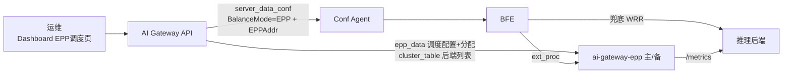
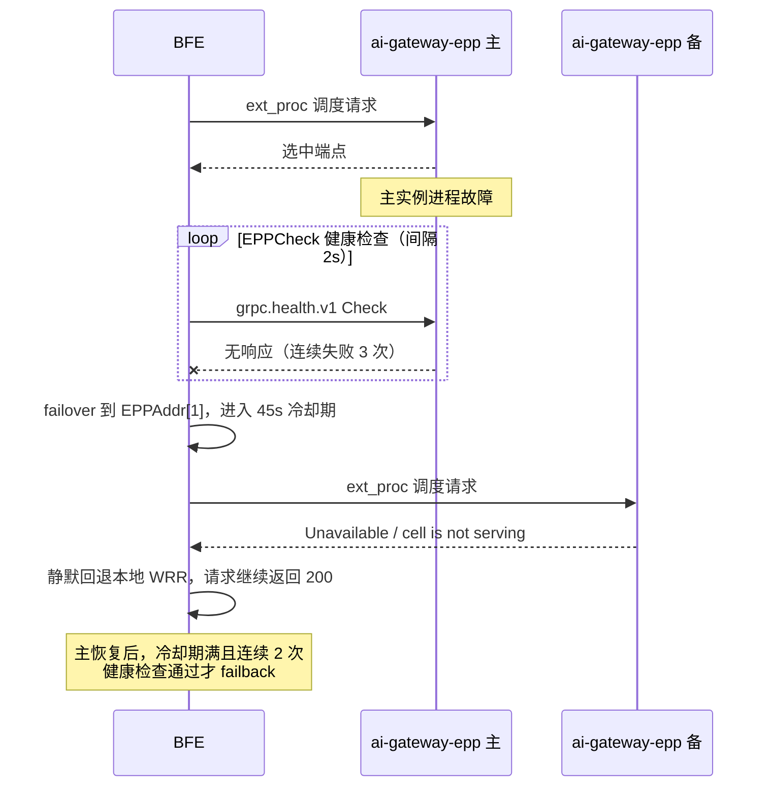

# 第二十六章 EPP调度配置与运维

## 本章目标

通过本章，读者将掌握：

- 使用 EPP 智能调度的前提条件与部署形态；
- 如何在 Dashboard 的「EPP调度」页面配置 EPP 实例池，并创建 EPP 模式 Cluster（`balance_mode=EPP` + `epp_config`）；
- 如何查看与手工覆写 Cluster→实例组分配（EPP 调度分配页签）；
- 摘流后端、上下线 EPP 实例、EPP 故障切换、全过载兜底、关闭 EPP 调度等日常运维场景的操作方法；
- EPP 链路的观测指标与告警要点；
- `epp_config` 与实例池的校验规则速查。

EPP 调度的工作原理与设计语义见 [第十六章 EPP智能调度设计](../design/chapter16-epp-scheduling-design.md)。本章控制台操作以 Dashboard v0.0.10 为准，权威用户手册见 `ai-gateway-web/docs/zh-cn/05-epp-schedule.md`。

---

## 前提与部署形态

使用 EPP 智能调度前，确认以下组件已随部署安装并运行：

- **ai-gateway-epp（EPP 组件）**：以实例组为单位部署，每组 1~2 个实例：生产环境每组 2 实例互为主备，测试环境可单实例组（仅主、无备）；超过 2 个实例的组在实例池校验时返回 422。实例经命令行参数运行，关键参数如下：

| 参数 | 默认值 | 说明 |
|------|--------|------|
| `-instance-id` | hostname | 实例 id，必须与实例池中登记的实例 id 一致；K8s StatefulSet 部署时缺省即为 Pod 名 |
| `-api-addr` | `http://127.0.0.1:8181/inner-api/v1` | AI Gateway API 的 InnerAPI 基础地址 |
| `-api-token` | 环境变量 `AI_GATEWAY_EPP_TOKEN` | InnerAPI 鉴权 Token |
| `-poll-interval` | `5s` | InnerAPI 轮询间隔 |
| `-poll-timeout` | `3s` | 单次轮询请求超时 |
| `-grpc-port` | `9002` | ext_proc gRPC 服务端口（BFE 通过 `EPPAddr` 访问此端口） |
| `-health-port` | `9003` | gRPC 健康检查端口（BFE `EPPCheck` 探活来源） |
| `-metrics-port` | `9090` | Prometheus 指标端口 |
| `-grpc-tls-cert` / `-grpc-tls-key` | 空（明文） | ext_proc 与 health gRPC 服务端 TLS 证书；生产环境建议开启，BFE 侧以 `EPPTLS.CAFile` 校验 |
| `-refresh-metrics-interval` | `50ms` | 后端 `/metrics` 指标抓取周期 |
| `-local-config-dir` | 环境变量 `AI_GATEWAY_EPP_LOCAL_CONFIG_DIR`（缺省空） | 非空时从本地目录的 JSON 文件（`cluster_table.json`、`epp_data_config.json`）加载集群级调度配置，不连接 InnerAPI，用于本地调试与集成测试；每个轮询周期重读文件，修改在下一个周期生效（无需重启），文件缺失或 JSON 非法时沿用上一份成功配置 |

发布二进制可通过 `ai-gateway-epp` 仓库的 `make release` 交叉编译并打包 linux/amd64 与 linux/arm64 的 tarball。

- **BFE**：经 `GslbBasic.BalanceMode=EPP` 与有序 `EPPAddr=[主,备]` 访问 EPP，相关配置由 AI Gateway API 经 server_data_conf 自动下发，Conf Agent 完成热加载，无需手工编辑。
- **AI Gateway API**：OpenAPI 与 InnerAPI 正常运行；EPP 实例经 InnerAPI 轮询 `epp_data` 与 `cluster_table`，鉴权与版本增量机制与其他数据面组件一致。

链路关系如下图：


```mermaid
flowchart LR
    OP[运维<br/>Dashboard EPP调度页] --> API[AI Gateway API]
    API -->|server_data_conf<br/>BalanceMode=EPP + EPPAddr| CA[Conf Agent]
    CA --> BFE[BFE]
    API -->|epp_data 调度配置+分配<br/>cluster_table 后端列表| EPP[ai-gateway-epp 主/备]
    BFE -->|ext_proc| EPP
    BFE -->|兜底 WRR| RS[推理后端]
    EPP -->|/metrics| RS
```

---

## 控制台入口：资源管理 → EPP调度

Dashboard 中 EPP 调度的入口为 **资源管理 → EPP调度**。页面分为两个页签：

- **EPP 实例池**：登记 EPP 调度器自身的部署实例（按组组织，组内主备）；
- **EPP 调度分配**：查看 / 覆写「EPP 模式集群 ↔ 实例组」的分配关系。

以下两节分别说明两个页签的操作。

---

## 配置 EPP 实例池（EPP 实例池页签）

### 查看模式

页签顶部显示统计信息：**池名称**（如 `EPP.pool`，由服务端配置提供）、**实例组数**、**实例总数**。

主体为树形表格，按「实例组」一行一组：

| 列名 | 说明 |
|------|------|
| 实例组 | 组名 |
| 实例数 | 组内实例数量，显示格式 `N / 2`（如 `1 / 2`、`2 / 2`） |
| 实例列表 | 摘要展示 `实例ID(host:port)`，灰色小字 |

点击行首箭头展开组，内嵌表格显示每个实例的**实例 ID / 主机 / 端口**。

### 编辑模式

点击右上角「编辑」进入行内编辑。「保存」全量提交——注意其为**全量替换**语义，未列出的组与实例会被删除；「取消」还原本次全部修改。

| 操作 | 说明 |
|------|------|
| 编辑组名 | 行内输入，组名非空且**池内唯一** |
| + 添加组 | 在表格下方新增空组（须至少添加 1 个实例才能保存） |
| 删除组 | 需确认「删除实例组及其所有实例」；至少保留 1 个组（仅剩 1 组时按钮禁用） |
| +添加实例 | 在展开区内添加实例行，端口默认 `9002`；组内实例 ≥ 2 时按钮禁用，右侧灰色提示「每组最多 2 个（主+备）」 |
| 删除 | 移除组内实例行 |

**校验规则**（控制台与 OpenAPI 共用同一套服务端校验）：

| 规则 | 说明 |
|------|------|
| 组 | 至少 1 个组；组名非空、池内唯一；每组 1–2 个实例（拒绝空组与 3+ 实例） |
| 实例 ID | 非空且**池内全局唯一**；对应 EPP 启动参数 `-instance-id`（K8s StatefulSet 部署时取 Pod 名，如 `epp-0`） |
| 主机 | 合法主机名或 IPv4 / IPv6 地址 |
| 端口 | 1-65535 整数 |
| 地址唯一 | `主机:端口` 组合池内全局唯一 |

> **部署形态**：生产环境每组通常为 **2 个实例（主备）**；测试环境允许单实例组（仅主、无备）。

### 保存后的自动修复

实例池保存为全量替换。若既有分配的**主实例已被移出池**，系统自动修复悬空分配：

- 组仍存在时，在同组剩余实例中重选主实例；
- 组已不存在时，对整个实例池重跑分配器重新选组；
- 池内无可分配候选组时，清除该分配（集群进入「未分配」态，见下节）。

### 附录：OpenAPI 等价操作

实例池是单例资源，提供 `GET`（详情）与 `PATCH`（全量替换）两个操作，与页签的查看 / 保存一一对应。实例组与实例列表的权威来源是部署流程，扩缩容、换机后由部署流程 reconcile 调用 `PATCH`。

以下示例登记一个实例组 `g1`，含两个实例 `epp-0`、`epp-1`（host 为实例 IP，`port` 为 EPP 的 ext_proc gRPC 端口）：

```bash
curl -X PATCH "https://control-plane.example.com/open-api/v1/epp-pool" \
  -H "Content-Type: application/json" \
  -d '{
    "groups": [
        {
            "name": "g1",
            "instances": [
                { "id": "epp-0", "host": "10.0.0.1", "port": 9002 },
                { "id": "epp-1", "host": "10.0.0.2", "port": 9002 }
            ]
        }
    ]
}'
```

查看当前实例池：

```bash
curl -X GET "https://control-plane.example.com/open-api/v1/epp-pool"
```

---

## 创建 EPP 模式 Cluster

集群的负载均衡模式在集群向导步骤 4 的「均衡模式配置」卡片中设置（`WRR` / `EPP` 切换及 `epp_config` 参数），控制台操作流程见 [第二十一章 Cluster与路由配置](./chapter21-cluster-and-route-config.md) 与 `ai-gateway-web/docs/zh-cn/04-ai-business-cluster.md` 的「均衡模式配置」小节。选择 `EPP` 后按需填写负载画像、亲和强度、前缀缓存亲和性、会话亲和性、准入水位、坏后端剔除与流控配置。

等价地，经 OpenAPI 创建 Cluster 时指定 `balance_mode=EPP` 并携带 `epp_config`：

```bash
curl -X POST "https://control-plane.example.com/open-api/v1/clusters" \
  -H "Content-Type: application/json" \
  -d '{
    "name": "llm-cluster-a",
    "basic": { "protocol": "http" },
    "llm_config": { "provider": "p1", "models": ["m1"] },
    "balance_mode": "EPP",
    "epp_config": {
        "load_profile": "balanced",
        "affinity": "medium",
        "kv_cache_utilization_max": 0.9,
        "waiting_queue_max": 32,
        "running_requests_max": 256,
        "fallback_on_empty": false,
        "metrics_staleness_threshold_ms": 200,
        "prefix_cache_affinity": true,
        "session_affinity_enabled": true,
        "session_affinity_header": "x-session-id",
        "flow_control": {
            "max_requests": 1000,
            "queue_ttl": 30,
            "no_endpoint_queue_ttl": 600
        }
    }
}'
```

创建成功后，系统自动完成：校验 `epp_config` → 贪心分配器选组选主 → 写入 `epp_assignments` → 下次导出时 server_data_conf 带出 `BalanceMode=EPP` 与有序 `EPPAddr`，epp_data 带出编译后的调度配置与分配条目。

`epp_config` 字段说明：

| 字段 | 默认值 | 说明 |
|------|--------|------|
| `load_profile` | `balanced` | 负载画像：`queue-first` / `balanced` / `kv-first` |
| `affinity` | `medium` | 亲和强度：`off` / `low` / `medium` / `high`，映射为前缀/会话亲和 scorer 权重 0 / 0.3 / 0.6 / 1.0；取 `off` 时不注入亲和 scorer |
| `prefix_cache_affinity` | `true` | 前缀缓存亲和开关（软亲和，不保证命中匹配后端） |
| `session_affinity_enabled` | `false` | 会话亲和开关 |
| `session_affinity_header` | - | session id 来源请求头；`enabled=true` 时必填，二者成对配置 |
| `kv_cache_utilization_max` | `0.9` | KV cache 利用率过滤阈值 `(0,1]` |
| `waiting_queue_max` | `0`（不启用） | 等待队列长度阈值 `≥0`，大于 0 时启用对应过滤条件 |
| `running_requests_max` | `0`（不启用） | 在跑请求数阈值 `≥0`，大于 0 时启用对应过滤条件 |
| `fallback_on_empty` | `false` | 全部端点被过滤时是否回退放行（透传 utilization-filter 的 fallbackOnEmpty） |
| `metrics_staleness_threshold_ms` | `200` | 坏后端剔除阈值（毫秒 `>0`）：指标抓取连续失败、数据过期超过该值的后端被剔除 |
| `flow_control.max_requests` | 不限 | 全局并发上限；`>0` 或 `-1`（显式不限） |
| `flow_control.queue_ttl` | EPP 默认 60 秒 | 池有端点时的排队预算（秒），超期以可重试背压错误拒绝 |
| `flow_control.no_endpoint_queue_ttl` | 跟随 `queue_ttl` | 池无端点时的排队预算（秒） |
| `flow_control.enable_eviction` | `false` | 仅接受 `false`（写入 `true` 校验拒绝 422） |

注意事项：

- `balance_mode=EPP` 时 `epp_config` 必填且须通过字段校验，否则创建返回 422；
- EPP 模式 Cluster 不创建 `Role=COMMON` 的 BFE 实例池，但池实例列表照常同步 Provider 的 `instance_pool`——这些实例经 cluster_table 供 EPP 发现后端，并作为 EPP 全挂时 BFE 兜底 WRR 的后端；
- `llm_config`（provider/models/keys）的校验与均衡模式无关，照常执行；
- `epp_config` 非空即须字段合法，与 `balance_mode` 无关：`WRR → EPP` 须同时提供合法配置，`EPP → WRR` 后配置休眠保留（不编译、不导出），再切回 `EPP` 时继续生效。

---

## 查看与覆写分配（EPP 调度分配页签）

「集群 ↔ 实例组」的分配由**分配器自动生成**：集群切入 EPP 模式时自动选择实例组与主实例；实例池变更后自动修复悬空分配。本页签提供**查询视图**与**手工覆写**（运维干预入口）。

### 统计与分配视图

页签顶部显示统计：**已分配集群** / **未分配集群**（数量大于 0 时红色告警）/ **空闲实例组**。

分配视图表格：

| 列名 | 说明 |
|------|------|
| 集群名称 | 支持搜索、排序 |
| 实例组 | 分配到的组名；未分配时显示 `-` |
| 主实例 | 主实例 ID；未分配或降级时显示 `-` |
| 备实例 | 同组内除主实例外的实例（查询时实时展开）；单实例组显示「无」 |
| 状态 | `正常` / `降级`（主实例已被移出池或组不存在） |
| 操作 | 「编辑」打开手动覆写抽屉 |

### 未分配集群 / 空闲实例组

- **未分配集群**（红色卡片）：EPP 模式但无有效分配的集群，提示「服务降级为 WRR」。这些集群导出配置时会**降级为 WRR** 转发，属需尽快处理的异常态。
- **空闲实例组**：实例池中未承担任何集群分配的组（如扩容新组后、完成分配前）。

> 实例在多个集群间互为主备是**合法**的——分配以集群为单位，不做组与集群的一对一约束。

### 手动覆写

点击行内「编辑」打开抽屉：

| 字段 | 说明 |
|------|------|
| 实例组 | 下拉选择，选项来自当前实例池中的组 |
| 主实例 ID | 下拉选择该组内的实例 |

确认后仅覆写该集群的分配：主实例取所选实例，备实例自动为同组内另一实例。覆写后 server_data_conf 版本即时 bump，BFE 下一次拉取即切换到新的主备地址。

### 附录：OpenAPI 等价操作

查看分配全量视图：

```bash
curl -X GET "https://control-plane.example.com/open-api/v1/epp-assignments"
```

返回示例：

```json
{
    "ErrNum": 200,
    "ErrMsg": "success",
    "Data": {
        "clusters": [
            {
                "cluster": "llm-cluster-a",
                "group": "g1",
                "primary":   { "id": "epp-0", "host": "10.0.0.1", "port": 9002 },
                "standby":   { "id": "epp-1", "host": "10.0.0.2", "port": 9002 }
            }
        ],
        "unassigned_clusters": [],
        "idle_groups": []
    }
}
```

字段含义：`primary`/`standby` 为主备实例详情（standby 为同组除主外的实例，单实例组为 `null`）；`unassigned_clusters` 列出 EPP 模式但无有效分配的 Cluster（属需尽快处理的异常态，导出 server_data_conf 时降级为 WRR）；`idle_groups` 列出未承担任何分配的组。也可用 `?cluster=<name>` 过滤单个 Cluster。

需要运维干预（如故障转移确认、特殊布局）时，可手工覆写某个 Cluster 的分配：

```bash
curl -X PUT "https://control-plane.example.com/open-api/v1/epp-assignments/llm-cluster-a" \
  -H "Content-Type: application/json" \
  -d '{
    "group_name": "g1",
    "primary_instance_id": "epp-0"
}'
```

`group_name` 必须存在于当前实例池，`primary_instance_id` 必须存在于该组实例列表中。

---

## 注意事项

- 手工覆写要求：实例组存在于实例池中；主实例存在于该组内，且与备实例不同地址。
- 集群由 `EPP` 切回 `WRR` 后，分配记录**休眠保留**，再切回 `EPP` 时继续生效。
- EPP 模式生效前提：已部署 EPP 调度器并在实例池登记实例。未分配集群会降级为 WRR，请在「EPP 调度分配」页签巡检未分配告警。
- 实例池「保存」为**全量替换**语义，未列出的组与实例会被删除，请整表核对后提交。

---

## 日常运维场景

### 摘流某个后端

将 Provider 对应实例的 `weight` 置 0，实例即从所有引用该 Provider 的 Cluster（含 EPP 池）中摘除：

```bash
curl -X PATCH "https://control-plane.example.com/open-api/v1/providers/p1" \
  -H "Content-Type: application/json" \
  -d '{ "instance_pool": [ ... 目标实例 weight=0 ... ] }'
```

链路：`ProviderInstancePoolSyncer` 同步实例池 → cluster_table 导出更新 → EPP 的 cluster-table-discovery 在下一个轮询周期摘除（秒级，跳过 `Weight=0` 实例）→ BFE 兜底 WRR 同样不再选中该实例。恢复时把 weight 置回正数即可。摘流期间 EPP 的 utilization-filter 与亲和逻辑不受影响，流量自动收敛到剩余后端。

### 上下线 EPP 实例

在「EPP 实例池」页签进入编辑模式，调整组与实例后保存（**全量替换**语义，未列出的组与实例会被删除，请整表核对）；等价地，也可经 `PATCH /epp-pool` 全量替换实例列表：

- **下线实例**：从所在组的实例列表中移除该实例并保存。若它是某 Cluster 的 primary，分配器自动修复——组内剩余实例重选 primary（不换组）；组已不存在则跨组重分配；池无可分配候选组时清除分配（该 Cluster 进入未分配态，导出降级 WRR + error 日志）。
- **上线实例**：在组中追加实例条目（生产组保持 2 实例）。新实例启动后以 `-instance-id` 在 assignment 全量视图中匹配角色：被分配为 standby 时加载配置热待命，被分配为 primary 时立即承担调度。
- 周期对账 reconciler（30 秒）会兜底扫描无有效分配的 EPP Cluster 并自动补分配，大部分轮次零写入。

### EPP 实例故障

EPP 实例故障时无需人工介入：

1. BFE 的 `EPPCheck` 后台健康检查发现主实例连续失败达到 `FailThreshold`（默认 3 次，探测间隔默认 2 秒，检测约 6~10 秒），滞回切换到 `EPPAddr[1]`（备）。
2. 备实例的 Cell 处于 standby 状态、拒绝调度请求（`cell is not serving`），BFE 对该错误的处理是继续在本 Cluster 的下一地址尝试，最终 EPP 路径失败，**静默回退本地 WRR**，请求仍返回 200。
3. 主实例恢复后，冷却期（`Cooldown`，默认 45 秒）满且连续通过 `SuccessThreshold`（默认 2 次）健康检查才回切，防止 flapping。

注意：standby 不自动承担调度——分配为配置驱动，本期不提供 rebalance 接口。failover 后的正确做法是让 BFE 回切主实例，或经「EPP 调度分配」页签手工覆写（`PUT /epp-assignments/{cluster}`）把主切到健康实例（覆写后 BFE 拉取新 `EPPAddr` 即切换）。

故障切换的时序如下：


```mermaid
sequenceDiagram
    participant BFE
    participant E0 as ai-gateway-epp 主
    participant E1 as ai-gateway-epp 备

    BFE->>E0: ext_proc 调度请求
    E0-->>BFE: 选中端点
    Note over E0: 主实例进程故障
    loop EPPCheck 健康检查（间隔 2s）
        BFE->>E0: grpc.health.v1 Check
        E0--xBFE: 无响应（连续失败 3 次）
    end
    BFE->>BFE: failover 到 EPPAddr[1]，进入 45s 冷却期
    BFE->>E1: ext_proc 调度请求
    E1-->>BFE: Unavailable / cell is not serving
    BFE->>BFE: 静默回退本地 WRR，请求继续返回 200
    Note over BFE: 主恢复后，冷却期满且连续 2 次<br/>健康检查通过才 failback
```

### 全过载兜底

所有后端 KV cache 利用率都超过 `kv_cache_utilization_max` 时，EPP 的 utilization-filter 过滤全部端点（fail-closed），无候选返回，BFE 回退本地 WRR 继续服务，业务不中断。可通过 `epp_fallback_local_total` 增长确认兜底发生。指标管道有抓取周期（`RefreshMetricsInterval`），利用率恢复后 EPP 在下一周期重新放行端点。

### 关闭 EPP 调度

将 Cluster 的 `balance_mode` 改回 `WRR` 即可（控制台在集群向导「均衡模式配置」卡片切换，或经 OpenAPI 修改），无需清空 `epp_config`（休眠保留，随时可切回）：

```bash
curl -X PUT "https://control-plane.example.com/open-api/v1/clusters/llm-cluster-a" \
  -H "Content-Type: application/json" \
  -d '{ "balance_mode": "WRR" }'
```

导出语义：`BalanceMode=WRR`、`EPPAddr` 为空；epp_config 与分配记录保留但不进 epp_data 导出；分配记录休眠保留，再切回 `EPP` 时原配置原分配继续生效。

---

## 观测与告警

| 观测点 | 位置 | 关键指标/日志 | 告警建议 |
|--------|------|--------------|----------|
| 未分配告警 | Dashboard「EPP 调度分配」页签 | 顶部「未分配集群」统计大于 0 时红色告警 | 定期巡检未分配集群卡片，出现即处理 |
| 降级导出 | AI Gateway API error 日志 | EPP 模式 Cluster 无有效分配时输出 error 级日志（含 Cluster 名与原因），导出降级为该 Cluster `BalanceMode=WRR` | error 日志出现即告警；配合未分配集群巡检 |
| BFE EPP 调用 | BFE 监控端口 `/monitor/epp_metrics` | `epp_calls_total{cluster,result}`（result ∈ ok/no_pool/unknown_pool/draining/transport）、`epp_fallback_local_total{cluster}`、`epp_failover_total{cluster}`、`epp_failback_total{cluster}`、`epp_active_addr_index{cluster}` | `epp_calls_total{result!="ok"}` 突增、failover 计数增长、`epp_fallback_local_total` 持续增长均提示 EPP 链路异常 |
| EPP 实例 | EPP `/metrics`（默认 `:9090`） | `ai_epp_assignment_no_match`（本实例在分配中无任何角色）、`ai_epp_poller_failures_total` / `ai_epp_poller_backoff_state`（轮询失败与退避）、`ai_epp_engine_reloads_total`（引擎热加载次数）、`ai_epp_cell_state`（Cell 角色与状态） | `assignment_no_match=1` 说明 `-instance-id` 与实例池登记不一致，部署核对；poller 失败持续非零说明控制面不可达 |
| 请求链路关联 | EPP 日志（demux） | EPP 日志携带 `x-request-id`：demux 从首个 ext_proc 消息的请求头读取该值（网关注入则透传），未携带时生成 UUID 并回写到请求头，llm-d 引擎日志使用同一 request ID | 排障时按 `x-request-id` 串联 BFE → EPP → llm-d 引擎三方日志，定位单请求全链路 |

判断请求是否真正经过 EPP 调度（而非兜底 WRR）：BFE 对 EPP 失败静默回退也返回 200，因此应以 `epp_calls_total{result="ok"}` 是否增长为准，不能只看响应码。

---

## 校验规则速查

**实例池（控制台「EPP 实例池」页签 / `PATCH /epp-pool`）**

- 至少 1 个组；组名非空、池内唯一；拒绝空组；
- 每组 1~2 个实例（生产 2 实例互为主备，测试允许单实例组），拒绝 3+ 实例，超过 2 实例/组 OpenAPI 返回 422；
- 实例 id 非空、池内全局唯一；
- `host` 为合法主机名或 IPv4 / IPv6 地址，`port` 为 1-65535 整数；
- `(host, port)` 组合池内全局唯一；
- 保存为全量替换语义，未列出的组与实例会被删除。

**`/clusters`（balance_mode 与 epp_config）**

- `balance_mode` 枚举 `WRR` / `EPP`，默认 `WRR`；
- `balance_mode=EPP` 时 `epp_config` 必填；`epp_config` 非空即须通过字段校验（与 balance_mode 无关）；
- `epp_config` 按严格字段解析，未知字段返回 422；
- `load_profile` ∈ `queue-first` / `balanced` / `kv-first`，默认 `balanced`；
- `affinity` ∈ `off` / `low` / `medium` / `high`，默认 `medium`；
- `prefix_cache_affinity` / `session_affinity_enabled` / `fallback_on_empty` 为 bool；
- `session_affinity_enabled=true` 时 `session_affinity_header` 必填（合法 HTTP header 名），二者成对；
- `kv_cache_utilization_max` ∈ `(0, 1]`，默认 `0.9`；
- `waiting_queue_max` / `running_requests_max` ≥ 0，默认 `0`（不启用）；
- `metrics_staleness_threshold_ms` > 0，默认 `200`；
- `flow_control.max_requests` `>0` 或 `-1`（缺省不限）；
- `flow_control.queue_ttl` / `no_endpoint_queue_ttl` 为 ≥0 整数（秒）；
- `flow_control.enable_eviction` 仅接受 `false`，写入 `true` 返回 422。

**手工覆写（「EPP 调度分配」页签 / `PUT /epp-assignments/{cluster}`）**

- 实例组必须存在于当前实例池；
- 主实例必须存在于该组实例列表中，且与备实例不同地址。

---

## 本章小结

- EPP 调度入口为 Dashboard「资源管理 → EPP调度」，分「EPP 实例池」与「EPP 调度分配」两个页签；实例池保存为全量替换语义，实例 id 与 EPP 的 `-instance-id` 一致；EPP 组件以 `-api-addr`、`-poll-interval`、`-grpc-tls-cert` 等参数运行。
- 「EPP 实例池」页签提供树形表格的查看与行内编辑：每组 1~2 实例（主备），校验组名唯一、实例 id 与 `主机:端口` 全局唯一；保存时自动修复悬空分配（同组重选主 / 重跑分配器重选组 / 清除分配）。
- 「EPP 调度分配」页签展示分配器自动生成的「集群 ↔ 实例组」分配：顶部统计已分配 / 未分配（红色告警）/ 空闲组，表格展示主备实例与状态，支持手工覆写；未分配集群导出降级为 WRR。
- 创建 EPP 模式 Cluster 即在集群向导「均衡模式配置」卡片选择 `EPP` 并填写 `epp_config`（OpenAPI：`POST /clusters` 携带 `balance_mode=EPP`）；系统自动分配实例组。
- 摘流后端 = Provider 实例 `weight=0`，cluster_table 导出与 EPP discovery 秒级摘除；上下线 EPP 实例 = 在「EPP 实例池」页签编辑保存，悬空分配自动修复。
- EPP 实例故障由 BFE `EPPCheck` 滞回切换；standby 不自动承担调度，兜底流量由 BFE 本地 WRR 承接；全过载时 EPP 无候选、BFE 兜底，业务不中断。
- 关闭 EPP 调度只需切回 `WRR`，epp_config 与分配休眠保留，可再切回。
- 观测覆盖三层：Dashboard 未分配告警、AI Gateway API error 日志（降级导出）、BFE `/monitor/epp_metrics`（`epp_calls_total` / `epp_fallback_local_total`）、EPP `/metrics`（`ai_epp_assignment_no_match` 等）；EPP 日志携带 `x-request-id`，可按 request ID 串联 BFE → EPP → llm-d 引擎三方日志。

---

## 参考文档

- `ai-gateway-web/docs/zh-cn/05-epp-schedule.md`（EPP 调度控制台用户手册，本章控制台操作的权威依据）
- `ai-gateway-web/docs/zh-cn/04-ai-business-cluster.md`（「均衡模式配置」小节）
- `ai-gateway-api/design-docs/api-define/OpenAPI接口定义/epp-pool.md`
- `ai-gateway-api/design-docs/api-define/OpenAPI接口定义/epp-assignments.md`
- `ai-gateway-api/design-docs/api-define/OpenAPI接口定义/clusters.md`
- `ai-gateway-api/design-docs/api-define/InnerAPI接口定义/epp-data.md`
- `ai-gateway-api/design-docs/api-define/InnerAPI接口定义/server-data-conf.md`
- `ai-gateway-api/design-docs/modifications/2026-09-08-epp-scheduling-integration/api-changes.md`
- `ai-gateway-api/design-docs/sys-design/details/EPP调度对接.md`
- `ai-gateway-epp/cmd/epp/config.go`
- `ai-gateway-epp/docs/zh_cn/modifications/2026-09-14-local-config-file/design.md`
- `integration-test/test-cases/测试设计文档/scenario-SC28-EPP调度端到端/场景说明.md`
- [第十六章 EPP智能调度设计](../design/chapter16-epp-scheduling-design.md)
- [第二十一章 Cluster与路由配置](./chapter21-cluster-and-route-config.md)
