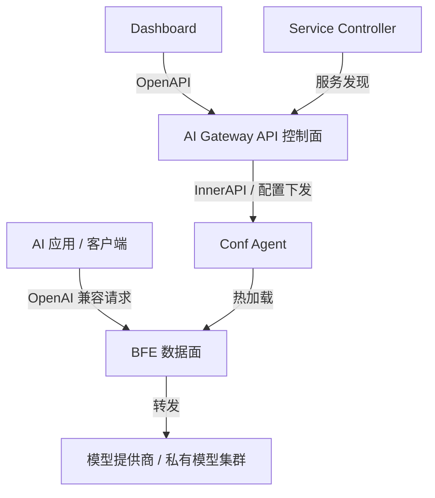

# 第二章 AI 网关技术概述

## 本章目标

AI 网关是近两年随着大模型服务化而快速兴起的一类基础设施。本章将从概念、能力边界、与相邻系统的差异以及主流产品对比等角度，帮助读者建立对 AI 网关的整体认知，并明确壬远 AI 网关在 AI 网关领域中的定位与核心差异点。阅读完本章后，读者将能够：

- 准确描述 AI 网关的定义与典型使用场景；
- 区分 AI 网关与传统 API 网关、传统七层负载均衡在职责和能力上的差异；
- 掌握 AI 网关的六大核心能力模型；
- 了解 LiteLLM、Kong AI Gateway、Apache APISIX、Higress、AWS API Gateway 等主流产品的特点；
- 理解壬远 AI 网关基于 BFE 数据面 + AI Gateway API 控制面的架构定位。

## 什么是 AI 网关

AI 网关（AI Gateway）是部署在 AI 应用与各类大模型服务之间的流量入口与治理层。它向上为应用提供统一的模型调用端点，向下对接 OpenAI、Anthropic、Google Gemini、DeepSeek、通义千问等异构模型提供商，屏蔽不同厂商在协议、认证、计费、限流等方面的差异，使应用能够以一致的方式消费大模型能力。

从技术本质上看，AI 网关仍然是一个七层流量代理，但其设计重心从“通用 HTTP 路由”转向了“AI 请求生命周期治理”。一个典型的大模型调用请求会经过以下环节：

1. 客户端以 OpenAI 兼容格式发送请求；
2. AI 网关进行身份认证（API-Key 校验）和权限检查；
3. 根据路由规则选择目标模型与后端集群；
4. 在必要时进行协议转换或模型参数重写；
5. 执行限流、配额、成本核算等治理策略；
6. 将请求转发至后端模型服务；
7. 收集 token 用量、延迟、首 token 时间等指标并返回响应。

因此，AI 网关不仅是“连接点”，更是 AI 应用与模型供应商之间的**统一接入面、安全控制面、成本治理面和可观测面**。

## AI 网关与传统 API 网关的区别

传统 API 网关（如 Kong、Apache APISIX、AWS API Gateway）主要解决通用 REST/HTTP 流量的路由、认证、限流、转换和可观测问题。AI 网关继承了这些基础能力，但针对大模型场景做了显著增强。

| 对比维度 | 传统 API 网关 | AI 网关 |
|---|---|---|
| 核心流量 | REST/HTTP/gRPC 通用 API 请求 | 大模型推理请求（Chat Completions、Embeddings、文生图、语音等） |
| 路由依据 | 路径、Host、Header、参数 | 模型名（model）、API-Key、Entity、请求内容、成本、延迟 |
| 限流维度 | QPS/TPS、连接数、带宽 | Token 速率（TPM）、请求速率（RPM）、并发、上下文长度 |
| 协议转换 | JSON/XML/gRPC 互转 | OpenAI、Claude、Gemini、Azure OpenAI 等协议互转 |
| 成本治理 | 弱或无 | 模型定价、Token/RMB 配额、成本扣减、用量审计 |
| 可观测重点 | 延迟、错误率、吞吐量 | TTFT（首 token 延迟）、TPOT、input/output token、模型维度指标 |
| 流式响应 | 透传为主 | 需支持 SSE 流式解析、流式配额扣减、流式日志 |
| API-Key 管理 | 简单 Key 鉴权 | Virtual Key、多 Key 轮换、Key 亲和、配额绑定 |

从表中可以看出，AI 网关并非要取代传统 API 网关，而是在其之上叠加了面向大模型的语义理解、成本核算和模型级治理能力。在企业落地中，AI 网关通常与 API 网关共存：API 网关负责南北向接入、通用安全与流量整形，AI 网关负责模型路由、配额计费和 AI 专属可观测。

## AI 网关与传统负载均衡的区别

Nginx、BFE 等传统七层负载均衡器擅长基于 Host、Path、Header 等条件进行内容路由和负载均衡，并提供 TLS 终止、连接管理、访问日志等企业级能力。AI 网关可以构建在负载均衡之上，也可以由负载均衡扩展而来，但二者关注的层次不同。

| 对比维度 | 传统负载均衡（Nginx/BFE） | AI 网关 |
|---|---|---|
| 主要定位 | 流量接入、转发、高可用 | 模型服务治理、成本与安全控制 |
| 路由粒度 | Host/Path/Header 级别 | API-Key / Entity / Global 三级 + 模型级 |
| 请求体感知 | 通常不解析请求体 | 需解析请求体以提取 model、messages、token 用量 |
| 协议生态 | HTTP/HTTPS/HTTP2/WebSocket/gRPC 等 | 在通用协议之上理解 OpenAI/Claude/Gemini 等 AI 协议 |
| 限流算法 | 漏桶、令牌桶、连接限流 | 基于 Redis 的 TPM/RPM/并发分布式限流 |
| 配额与计费 | 一般不支持 | Token 配额、RMB 成本配额、模型定价表 |
| 后端管理 | 静态 upstream 或服务发现 | Provider / Cluster / Model / Key 多层级管理 |
| 可观测字段 | 通用访问日志 | 增加 ai_apikey、ai_model、ai_tokens、ai_ttft_us 等字段 |

以 BFE 为例，BFE 是百度开源的现代七层负载均衡器，支持基于条件表达式的高级路由、全局/分布式负载均衡和灵活的模块框架（`bfe_modules/mod_*`）。壬远 AI 网关正是在 BFE 的基础上，新增了 `mod_ai_route`、`mod_ai_token_auth`、`mod_ai_rate_limit`、`mod_body_process` 等模块，将 BFE 从通用负载均衡扩展为企业级 AI 网关数据面。详细设计可参考 `bfe/docs/zh_cn/introduction/overview.md`。

## AI 网关的核心能力模型

一个完整的 AI 网关通常包含六大核心能力：统一接入、协议转换、认证授权、路由调度、成本治理、可观测。下面逐一说明。

### 统一接入

统一接入是指为上层应用提供一个与后端模型厂商无关的标准化调用入口。无论后端是 OpenAI、DeepSeek 还是私有部署的模型，应用都可以使用统一的 OpenAI 兼容格式发起请求。AI 网关负责将请求分发到正确的后端，并将响应统一返回给客户端。统一接入的价值在于降低应用集成成本，避免应用直接持有大量不同厂商的 API-Key 和端点地址。

### 协议转换

不同模型厂商的接口在请求格式、认证方式、错误码、流式响应等方面存在差异。AI 网关需要具备协议转换能力，使客户端以一种协议接入，后端以另一种协议转发。例如，客户端使用 OpenAI 格式请求，后端实际调用 Claude Messages API；或者客户端请求 `gpt-4o`，网关将其映射到后端的 `qwen-max`。协议转换通常包括模型名映射（`ModelMapping`）、前缀裁剪（`StripPrefix`/`MatchPrefix`）、请求体重写和响应体格式转换。

### 认证授权

AI 网关需要为每一次模型调用确认调用方身份，并校验其是否有权限访问指定模型或集群。认证方式包括传统的 API-Key、JWT、OAuth 等。在 AI 场景中，更强调 **Virtual Key（虚拟 Key）** 机制：客户端持有网关发放的虚拟 Key，网关再将其映射为后端 Provider 的真实 Key。这样既可以保护上游 Key 不被泄露，又可以实现按调用方细粒度授权、配额和审计。

### 路由调度

路由调度是 AI 网关最核心的能力之一。壬远 AI 网关采用 **API-Key → Entity → Global 三级路由表** 结构：

- **API-Key 级路由**：为单个 API-Key 绑定专属路由规则，适合为某个应用或用户定制模型访问策略；
- **Entity 级路由**：按实体（如部门、项目、产品线）组织路由规则，实现层级化管理；
- **Global 级路由**：全局默认路由表，作为兜底策略。

每张路由表内按顺序匹配条件表达式，命中后返回目标集群列表（`targets`）和降级列表（`fallbacks`）。转发阶段按权重随机选择目标，失败后再依次尝试降级目标。该设计详见 `ai-gateway-api/design-docs/sys-design/总体设计文档.md`。

### 成本治理

成本治理是 AI 网关区别于通用网关的关键能力。它通常包括：

- **模型定价管理**：维护不同 provider、不同模型的 input/output token 单价；
- **配额管理**：为 API-Key 或 Entity 分配 Token 配额或 RMB 货币配额，并实时扣减；
- **限流策略**：按 RPM（每分钟请求数）、TPM（每分钟 Token 数）、并发数进行限流；
- **成本核算与审计**：基于实际 token 用量和定价表计算每次请求成本，输出用量报表。

壬远 AI 网关同时支持 `total_token` 和 `RMB` 两种配额单位，并通过 `go-lib/quota` 统一处理定点数转换，避免浮点误差。控制面通过 `/model-prices` 管理模型定价，数据面通过 `AIConf.ModelTable` 填充价格信息，实现按成本扣减。

### 可观测

AI 场景的可观测需要覆盖模型调用全链路。关键指标包括：

- **延迟类**：首 token 时间（TTFT，Time To First Token）、每 token 生成时间（TPOT，Time Per Output Token）、总延迟；
- **用量类**：input token、output token、total token、缓存命中 token；
- **业务类**：按 apikey、entity、model、provider、cluster 聚合的请求量、成功率、成本；
- **日志字段**：壬远 AI 网关在 `bfe-access-pb` 中扩展了 `ai_apikey`、`ai_model`、`ai_tokens`、`ai_ttft_us`、`ai_tpot_us` 等字段，便于后续分析与告警。

## 主流 AI 网关产品对比

当前市场上存在多种形态的 AI 网关产品，从开源工具到云托管服务，从专用 AI 网关到传统网关的 AI 扩展。下表对几款代表性产品进行简要对比。

| 产品 | 定位 | 部署形态 | 核心优势 | 主要不足 |
|---|---|---|---|---|
| **LiteLLM** | 开源 AI 路由与成本管理框架 | Python 库 / 代理服务 | 支持 100+ provider，统一 OpenAI 接口，强大的成本与配额管理 | 企业级高可用、流量治理能力弱于专用网关 |
| **Kong AI Gateway** | 企业级 API 网关的 AI 扩展 | 企业版插件 / 云服务 | 与 Kong 生态无缝集成，AI 语义路由、可观测 | 高级功能依赖企业版，成本较高 |
| **Apache APISIX** | 云原生 API 网关 + AI 插件 | 开源 / 云服务 | 丰富的 AI 插件（proxy、rate limit、cache、guard），生态活跃 | 企业级配额计费、RMB 成本治理需二次开发 |
| **Higress** | AI Native API Gateway | K8s + Envoy + Istio + WASM | 插件生态丰富，协议适配能力强，metric/log/trace 一体化 | 架构较重，缺少原生 Virtual Key 层，配额仅支持 token |
| **AWS API Gateway** | 云托管 API 网关 | 全托管云服务 | 与 AWS 生态深度集成，Serverless 弹性 | AI 专属能力有限，成本按调用计费，厂商锁定 |
| **壬远 AI 网关** | 企业级私有化 AI 网关 | 控制面 + 数据面分离，BFE 数据面 | 三级路由、Virtual Key、Token/RMB 配额、高性能转发、企业级可运维 | AI 缓存、内容安全、MCP 等能力仍在建设中 |

从对比中可以看出，主流开源 AI 网关在协议适配和插件生态上各有优势，但在企业级配额计费、多租户路由隔离和高性能私有化部署方面存在差异。壬远 AI 网关的选择是：以经过百度大流量验证的 BFE 为数据面，以 AI Gateway API 为控制面，构建控制面与数据面分离、配置可热加载、支持企业级计费与限流的开源 AI 网关方案。

## 壬远 AI 网关在 AI 网关领域的定位

壬远 AI 网关的整体架构由五大核心组件构成：

- **AI Gateway API**：控制面核心组件，负责策略/配置的创建、存储、版本控制和下发；
- **Dashboard**：管理控制台，通过 OpenAPI 完成可视化操作；
- **BFE**：数据面，负责流量转发、AI 路由、认证、限流和访问日志；
- **Conf Agent**：配置代理，从 InnerAPI 拉取最新配置并触发 BFE 热加载；
- **Service Controller**：服务发现组件，同步 Kubernetes 后端服务。

与 Higress、OmniRoute 等产品相比，壬远 AI 网关在以下方面具有差异化定位：

- **企业级多租户路由**：采用 `API-Key → Entity → Global` 三级路由表，天然适配企业按部门、项目、应用分级管理模型访问权限的场景。
- **领先的配额与计费能力**：同时支持 Token 配额和 RMB 货币配额，内置模型定价表（`ModelTable`），可按模型差异化定价并精确扣减成本。
- **高性能与稳定性**：数据面基于 Go 语言自研的 BFE，经过大规模流量验证，适合高并发在线推理场景。
- **控制面与数据面分离**：配置管理、服务发现与流量转发独立部署，故障隔离、横向扩展和灰度发布更加可控。
- **开源与私有化友好**：Apache-2.0 协议，支持二进制、容器、Kubernetes 等多种部署形态，满足金融、政务等对数据主权要求较高的场景。

当然，壬远 AI 网关也需要持续补齐 AI 缓存、内容安全、MCP 支持、更完善的可观测指标等能力，以覆盖更广泛的 AI 应用场景。

## 本章小结

本章围绕 AI 网关的概念、边界、能力和产品格局展开了系统性介绍：

- AI 网关是 AI 应用与模型服务之间的统一接入、治理与可观测层；
- 与传统 API 网关相比，AI 网关在路由粒度、限流维度、协议转换、成本治理和可观测方面都有显著差异；
- 与传统负载均衡相比，AI 网关更关注请求体语义、模型级路由、配额计费和 AI 专属日志；
- AI 网关的六大核心能力模型为：统一接入、协议转换、认证授权、路由调度、成本治理、可观测；
- 主流产品在协议生态、插件能力、部署形态上各有侧重，壬远 AI 网关选择以 BFE 数据面 + AI Gateway API 控制面构建企业级私有化 AI 网关，在三级路由、Virtual Key、Token/RMB 配额和高性能转发方面形成差异化优势。

后续章节将在此基础上，深入讲解壬远 AI 网关的架构设计、控制面实现、数据面模块以及运维部署实践。

## 参考文档

- `ai-gateway-api/README.md`
- `ai-gateway-api/design-docs/sys-design/总体设计文档.md`
- `bfe/docs/zh_cn/introduction/overview.md`
- `document-ai-gateway/竞品分析/higress/bfe-vs-higress-ai-gateway-comparison.md`
- `document-ai-gateway/竞品分析/OmniRoute/OmniRoute-vs-bfe-AI网关能力对比分析.md`
- `document-ai-gateway/竞品分析/higress/Higress AI网关配额管理功能分析.md`
- `document-ai-gateway/竞品分析/tokenHub/control-data-plane-analysis.md`
