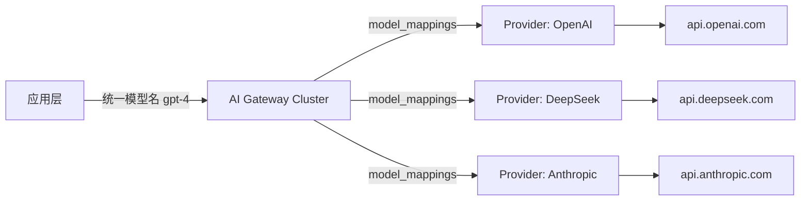
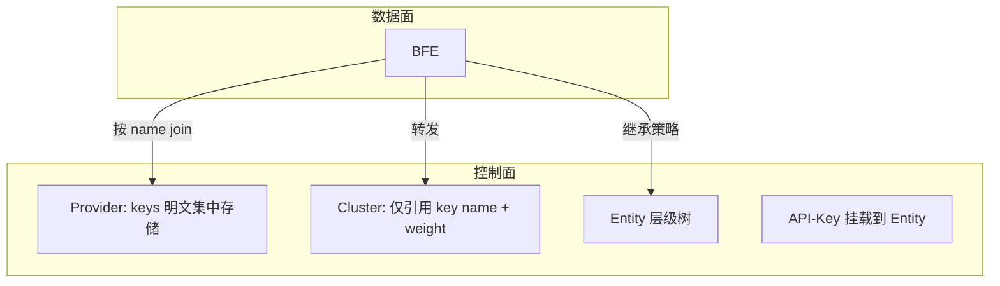

# 第三章 大模型服务接入的挑战

## 本章目标

本章从企业实际接入大模型服务（Large Language Model Service）的场景出发，系统梳理在多云、多模型、多团队环境下，直接使用模型提供商 API 所面临的主要挑战。读者将了解以下问题的根源、风险以及壬远 AI 网关（Rainway AI Gateway）提供的对应解决思路：

- 多模型提供商（Provider）的协议、端点与模型命名差异；
- API-Key 分散管理带来的安全与运维风险；
- Token 配额、RPM/TPM 限流与成本控制需求；
- 安全审计与合规要求；
- 高可用与故障转移需求。

本章内容将直接对应后续第九章“Provider 与 Cluster 设计”、第十一章“配额与限流设计”以及第十七章“控制台基础操作”的实现细节，为理解 AI 网关的整体架构奠定基础。

## 多模型提供商与协议差异

当前企业接入的大模型服务来源日益多元，既包括 OpenAI、DeepSeek、Anthropic、Google Gemini 等公有云模型提供商，也可能包括自托管的开源模型或私有化部署的推理集群。每个提供商在接口协议、鉴权方式、模型命名、请求/响应格式上均存在显著差异。

### 协议与端点差异

- **OpenAI**：采用 `/v1/chat/completions` 端点，`Authorization: Bearer <api_key>` 鉴权，请求体使用 `messages`、`model`、`temperature` 等字段，流式响应通过 SSE（Server-Sent Events）返回。
- **DeepSeek**：接口风格与 OpenAI 高度兼容，但模型名（如 `deepseek-chat`、`deepseek-coder`）、端点域名与错误码存在差异。
- **Anthropic Claude**：采用独立的 Messages API，请求体字段为 `model`、`max_tokens`、`messages`，响应结构、错误码与 OpenAI 不同。
- **Google Gemini**：使用 Vertex AI 或 Gemini API 的独立 SDK/REST 路径，模型名形如 `gemini-1.5-pro`，鉴权与参数格式亦不同。

### 模型命名与能力映射差异

同一能力模型在不同提供商处命名各异。例如：

| 能力定位 | OpenAI | DeepSeek | Anthropic | Google |
|---------|--------|----------|-----------|--------|
| 长上下文推理 | `gpt-4-turbo` | `deepseek-chat` | `claude-3-opus` | `gemini-1.5-pro` |
| 轻量对话 | `gpt-3.5-turbo` | `deepseek-chat` | `claude-3-haiku` | `gemini-1.0-pro` |

如果应用层直接面向某一家提供商的 API 编程，一旦需要切换或扩展模型，就必须修改业务代码、重新测试并重新发布，导致模型引入周期长达数天甚至数周。

### 对应的 AI 网关解决思路

壬远 AI 网关通过 **Provider 与 Cluster 概念分离** 解决上述问题。Provider 负责表达“我是谁、我能访问哪些模型、我的后端和密钥是什么”，包含 `model_endpoint`、`models`、`keys`、`instance_pool` 与 `model_protocols` 等字段；Cluster 则负责表达“我如何转发、用哪些模型、key 权重如何分配”，只保留转发策略。具体设计详见 `ai-gateway-api/design-docs/sys-design/details/provider与cluster概念分离.md`。

通过引入 Provider 抽象，AI 网关可以在 Cluster 中通过 `llm_config.provider` 字段引用已注册的 Provider，并支持 `model_mappings` 将应用传入的统一模型名映射到目标 Provider 的真实模型名。BFE 数据面在请求到达时，根据 `AIConf.ModelProtocols` 自动匹配请求协议风格，使应用在调用侧无需关心下游是 OpenAI、DeepSeek 还是其他协议。

上图展示了应用层只需面向 AI 网关暴露的统一模型名发起请求，网关内部根据 Cluster 与 Provider 配置完成模型名映射、协议转换与后端路由。

## API Key 分散管理的风险

在典型的直接使用模型 API 的架构中，每个业务应用、每个微服务、每个测试环境都可能独立持有若干 API-Key。这种分散管理模式会带来以下风险：

### 密钥泄露面扩大

API-Key 明文散落在应用配置中心、CI/CD 流水线、测试脚本、开发者本地环境甚至日志文件中。任何一处泄露都可能导致未经授权的模型调用、配额被刷或账单激增。

### 权限与生命周期难以统一

当某个员工离职、某个项目下线或某个 API-Key 疑似泄露时，管理员需要在多处查找并轮换密钥。由于缺乏统一目录，经常出现“旧 Key 未清理、新 Key 已上线”的叠加状态，进一步扩大了攻击面。

### 成本归属不清晰

分散的 API-Key 无法与业务组织单元（如部门、项目）建立稳定关联，导致模型调用成本难以按团队分摊，也给预算控制与异常消费定位带来困难。

### 对应的 AI 网关解决思路

壬远 AI 网关将 API-Key 与 Entity（业务组织单元）关联，并集中管理 Provider 层密钥，具体设计详见 `ai-gateway-api/design-docs/sys-design/details/API-Key与Entity关联及模型继承.md`。

- **Provider 层 Key 集中化**：Provider 的 `keys` 字段集中存储下游模型提供商的明文密钥，Cluster 中仅通过 `name` 引用，不再在 Cluster 配置中重复存放 Key 明文。这显著减少了 Key 在配置层面的暴露点。
- **API-Key 与 Entity 关联**：应用侧使用的 API-Key 可以挂载到某个 Entity，从而继承该 Entity 及其父级 Entity 的模型白名单、配额计划、限流策略与路由规则。Entity 支持层级结构（`parent_id`），便于与企业组织架构对齐。
- **生命周期统一管理**：API-Key 的创建、启用、禁用、删除、配额重置均在 AI Gateway API 控制面完成，并可通过 Dashboard 集中查看，避免了密钥在应用配置中“野蛮生长”。

上图说明了 Provider Key 在控制面集中管理、Cluster 仅做引用、BFE 数据面在导出配置时按 name join 生成带权重的密钥列表，从而在满足转发需求的同时降低密钥扩散风险。

## Token 配额、RPM/TPM 限流、成本控制需求

大模型调用通常按 Token 数量或调用次数计费，成本敏感且波动大。企业在接入过程中面临三类核心控制需求。

### Token 配额管理

企业需要为不同团队、项目或应用分配 Token 配额，并在自然周/自然月等周期自动重置。传统做法是各业务自行统计使用量，既容易重复计算，也难以做到实时拦截。

### RPM/TPM 限流

模型提供商通常对每分钟内请求数（Requests Per Minute, RPM）和 Token 数（Tokens Per Minute, TPM）设置上限。一旦超过阈值，请求会被拒绝或触发降级。企业需要在网关侧对内部调用方进行精细限流，避免单一阵营的流量打满共享的提供商额度。

### 成本控制

不同模型单价差异巨大（例如 `gpt-4` 与 `gpt-3.5-turbo` 的成本可相差一个数量级）。企业需要：

- 按模型设置预算上限；
- 按组织单元分摊成本；
- 在余额不足时选择拦截或仅告警（`pass_when_no_enough_quota`）。

### 对应的 AI 网关解决思路

壬远 AI 网关通过 **QuotaPlan**、**RateLimitPolicy** 与 **RMB 配额** 三种机制满足上述需求，配额余额同步机制详见 `ai-gateway-api/design-docs/sys-design/details/配额余额同步机制.md`。

- **QuotaPlan 配额计划**：支持 `unit = total_token` 与 `unit = RMB` 两种单位，可配置总量、重置周期（`weekly`/`monthly`/`never`）以及余额不足时是否放行。RMB 配额内部精度为 8 位小数，对外统一按 4 位小数展示，配合 `model-prices` 数据实现成本核算。
- **RateLimitPolicy 限流策略**：支持 TPM、RPM 与最大并发数限制，可绑定到 API-Key 或 Entity，并与 Entity 层级向上递归合并，实现组织层面的统一限流。
- **Redis 作为余额唯一真实来源**：请求链路直接对 `QUOTA_<key>` 做原子扣减，管理面查询余额时直接读取 Redis，不再维护 `quota_balances` 冷数据副本。周期重置通过 `IncrBy(delta)` 原子调整剩余量，避免并发场景下 `SET` 操作覆盖刚刚扣减的计数。

| 需求 | AI 网关机制 | 关键配置 |
|------|------------|---------|
| Token 配额 | QuotaPlan | `quota`、`unit=total_token`、`reset_period` |
| 成本预算 | QuotaPlan | `unit=RMB`、`pass_when_no_enough_quota` |
| RPM/TPM 限流 | RateLimitPolicy | `rpm`、`tpm`、`max_concurrency` |
| 周期重置 | QuotaResetScheduler | `weekly` / `monthly` |

上表总结了不同控制需求与 AI 网关机制的对应关系，帮助管理员快速选择配置项。

## 安全审计与合规要求

企业将大模型服务纳入生产环境后，安全审计与合规成为刚性要求，主要包括：

### 调用可追溯

需要记录“谁在什么时间、通过哪个 API-Key、调用了哪个模型、消耗了多少 Token、是否命中限流或配额”。如果缺乏统一的入口，审计数据将分散在多个提供商控制台，难以关联。

### 权限最小化

不同团队应只能访问被允许的模型。例如，财务团队不应访问代码生成模型，客服团队不应访问高成本的推理模型。直接持有提供商 Key 的应用难以实施这种细粒度模型级权限。

### 数据合规

部分行业对数据出境、敏感字段处理有明确要求。统一网关可以在请求转发前进行请求体处理、敏感信息脱敏或路由到合规区域部署的模型集群。

### 对应的 AI 网关解决思路

- **Entity 层级与模型白/黑名单**：Entity 支持 `allow_models` 与 `block_models`，API-Key 挂载后继承父级策略。`allow_models` 在层级中取交集，`block_models` 取并集，确保最终生效模型集合满足最小权限原则。
- **标签与审计**：API-Key 导出时会根据 Entity 类型与名称生成 `ApikeyTag`（`TagName = Entity.Type`、`TagValue = Entity.Name`、`TagLevel = EntityType.Level`），便于在日志与监控中按组织维度聚合。
- **请求体处理与路由**：BFE 的 `mod-body-process` 模块可在数据面对请求体进行改写、脱敏或添加水印，配合 AI 路由规则将敏感流量导向合规集群。

## 高可用与故障转移需求

大模型服务本身存在波动：提供商可能限流、某个区域可能故障、某个模型可能临时不可用。业务系统直接调用单一提供商时，一旦后端异常，只能被动等待或紧急修改代码切换模型。

### 典型故障场景

- 某个 Provider 返回 429（Rate Limit Exceeded）或 503；
- 某个模型因容量不足临时不可用；
- 跨洋链路抖动导致延迟升高；
- 单一 API-Key 达到使用上限，需要切换到备用 Key。

### 对应的 AI 网关解决思路

壬远 AI 网关通过多 Provider、多 Key、Cluster 级转发策略与 BFE 数据面模块协同实现高可用。

- **多 Provider 接入**：在控制面注册多个 Provider（例如同一模型的国内镜像与海外官方端点），不同 Cluster 可引用不同 Provider，实现地理就近与故障隔离。
- **多 Key 与权重**：Cluster 的 `llm_config.keys` 支持配置多个 Key 及其权重，配合 `key_policy` 的 `weighted_random`、`max_retries`、`retry_backoff` 策略，在单个 Key 限流或失效时自动重试其他 Key。
- **Key 亲和性**：`key_affinity` 基于 Redis 与 `ClientKeyId` 实现会话级 Key 亲和，避免同一用户会话在多个 Key 之间跳变导致上下文不一致，同时具备失败惩罚机制。
- **路由规则兜底**：Global 级 AI 路由规则作为默认兜底，API-Key 级与 Entity 级规则可按优先级覆盖，确保异常场景下流量可以切换到备用 Cluster。

## 本章小结

企业在接入大模型服务时，面临的挑战可归纳为五个层面：

1. **协议差异**：多提供商接口协议、模型命名与鉴权方式不统一；
2. **密钥管理**：API-Key 分散导致泄露面扩大、生命周期难以统一；
3. **配额与成本**：Token 配额、RPM/TPM 限流与成本分摊缺乏实时、统一手段；
4. **安全合规**：调用可追溯、权限最小化与数据合规要求难以落地；
5. **高可用**：单一 Provider 或 Key 故障时缺乏快速切换能力。

壬远 AI 网关通过 **Provider/Cluster 分离** 统一接入差异，通过 **API-Key 与 Entity 关联** 实现集中授权，通过 **QuotaPlan + RateLimitPolicy + Redis 余额同步** 实现实时配额与成本控制，通过 **Entity 层级白/黑名单 + 标签 + 请求体处理** 满足安全审计与合规，通过 **多 Provider、多 Key、路由规则与 Key 亲和性** 实现高可用与故障转移。

这些解决思路将在本书后续章节中逐一展开：第九章详解 Provider 与 Cluster 设计，第十一章详解配额与限流设计，第十七章介绍控制台基础操作。

## 参考文档

- `ai-gateway-api/design-docs/sys-design/总体设计文档.md`
- `ai-gateway-api/design-docs/sys-design/details/provider与cluster概念分离.md`
- `ai-gateway-api/design-docs/sys-design/details/API-Key与Entity关联及模型继承.md`
- `ai-gateway-api/design-docs/sys-design/details/配额余额同步机制.md`
