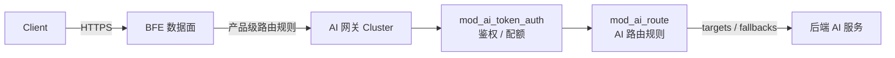
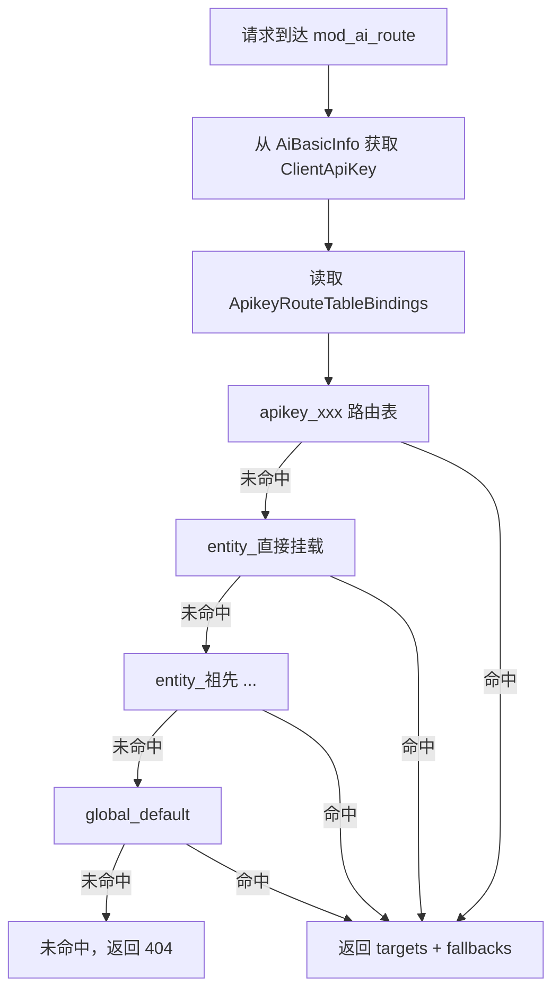
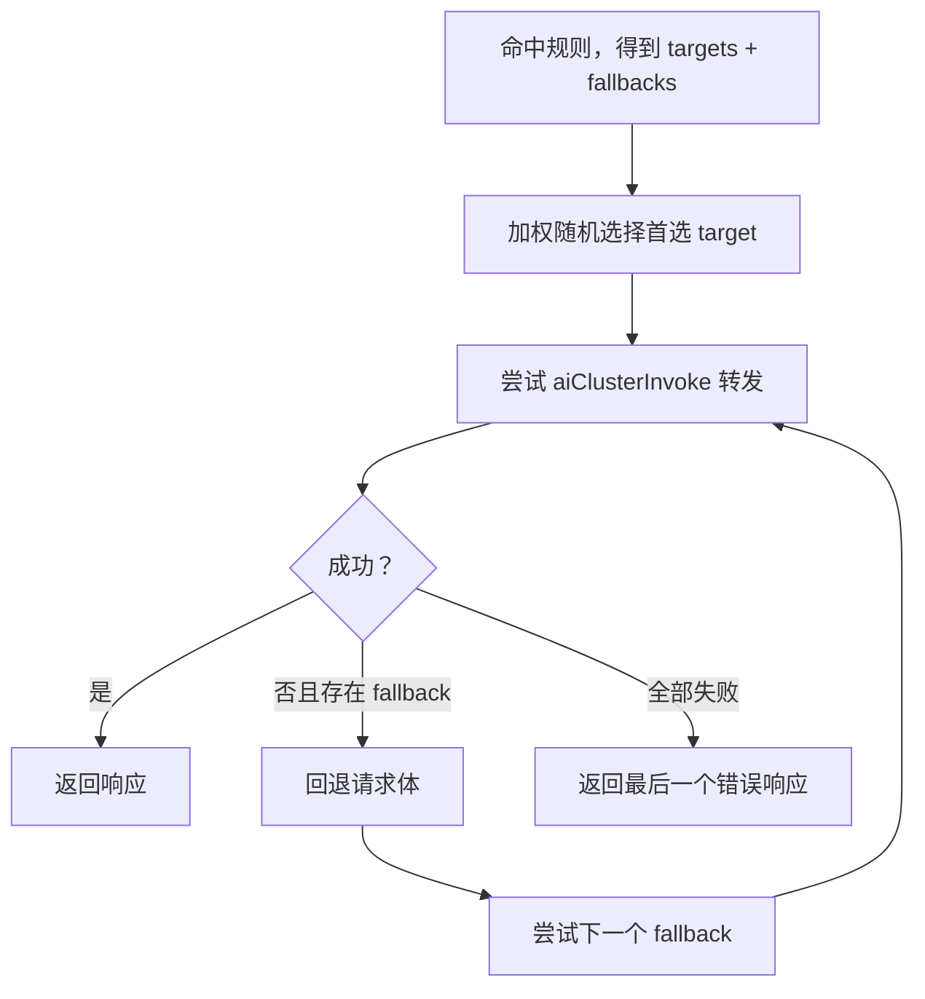
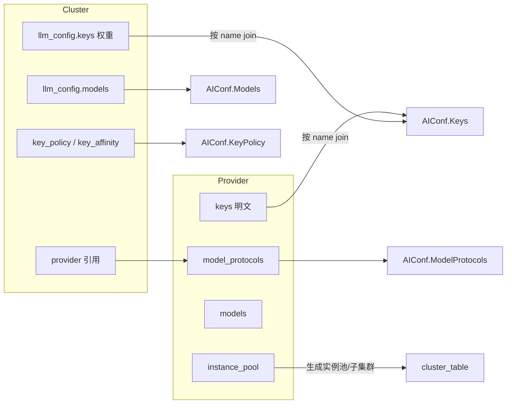
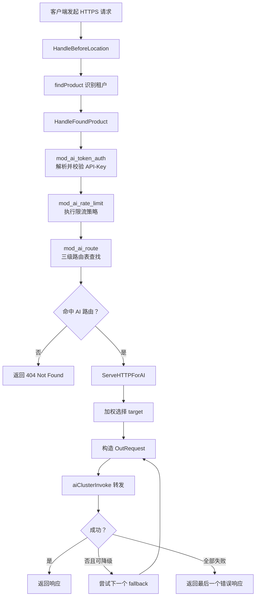

# 第四章 AI 网关的路由与调度原理

## 本章目标

AI 网关每天需要把成千上万条请求准确地送达到正确的模型与集群。与传统七层负载均衡只关心“域名 + 路径 → 后端集群”不同，AI 请求还携带调用方身份（API-Key）、目标模型（model）、配额计划、降级策略等元信息。本章将帮助读者理解壬远 AI 网关如何把这些信息组织成可执行的路由与调度策略：

- 区分产品级入口路由与 AI 层路由的职责边界；
- 掌握 API-Key / Entity / Global 三级路由表的优先级与绑定顺序；
- 理解模型级别的加权选择与 Fallback 降级机制；
- 了解 Provider 与 Cluster 解耦后各自承担的职责；
- 认识 BFE 条件表达式在 AI 路由中的典型用法；
- 跟踪一条 AI 请求从接入到转发的完整调度流程。

## AI 请求路由的基本概念

在传统负载均衡场景中，路由（Routing）通常指根据请求的 Host、Path、Header 等字段，把流量分发到某个后端集群（Cluster）。进入大模型时代后，同一条 `/v1/chat/completions` 路径可能对应 `gpt-4`、`deepseek-chat`、`claude-3-opus` 等数十种模型，不同调用方（API-Key）还可能拥有不同的可用模型列表、配额与优先级。因此，AI 网关需要在原有 L7 路由之上再增加一层面向“调用方 + 模型”的语义路由。

壬远 AI 网关把路由拆成两个层次：

1. **产品级路由规则（Product Route Rules）**：由 BFE 原生路由模型承载，决定外部请求是否进入 AI 网关 Cluster。它关心 Host、Path、HTTP Method、Header、BFE 条件表达式等入口信息，输出结果是单个 ClusterName。
2. **AI 路由规则（AI Route Rules）**：存储在控制面的 `route_rules` 表中，决定 API-Key 鉴权之后请求应转发到哪个目标模型与集群。它输出的是一组 `targets`（集群 + 模型 + 权重）以及可选的 `fallbacks`（降级目标）。

两层路由的协作关系可以用下图概括：



产品级规则解决“请求是否进入 AI 网关”的问题，AI 路由规则解决“进入网关后送到哪个模型/集群”的问题。二者共同构成 AI 网关的完整路由体系。

## API-Key、Entity、Global 三级路由表

AI 路由规则的载体是**路由表（Route Table）**。控制面通过 `route_rules` 表统一管理，按 `type` 和 `owner` 两个字段区分三级：

| 层级 | 表记录标识 | 导出到 BFE 的 Key | 适用场景 |
|------|-----------|------------------|---------|
| API-Key 级 | `type=apikey, owner=<apikey_id>` | `apikey_<api_key_value>` | 单个调用方的特殊路由，例如指定测试模型 |
| Entity 级 | `type=entity, owner=<entity_id>` | `entity_<entity_name>` | 部门、项目或应用层面的统一策略 |
| Global 级 | `type=global, owner=global` | `global_default` | 全系统兜底策略 |

对每个 API-Key，控制面会生成一条**绑定列表（ApikeyRouteTableBindings）**，决定 BFE 中的查找顺序：

1. `apikey_<key>`（API-Key 级）
2. `entity_<entity_name>`（直接挂载的 Entity）
3. `entity_<parent_name>` ……（沿 `parent_id` 向上遍历的所有祖先 Entity）
4. `global_default`（Global 级）

BFE 严格按该顺序依次匹配：只要在某张路由表中命中任意一条规则，就立即返回结果，不再继续后续查找。这种设计符合组织管理习惯——API-Key 级最细粒度，Entity 级承上启下，Global 级作为最后兜底。

三级路由表的查找流程如下图所示：



需要注意，只有 `enabled=true` 的路由表才会被导出并加入绑定列表。如果 Global 路由表被禁用，而 API-Key 与 Entity 级规则又全部未命中，请求将因无规则可匹配而返回 404。因此生产环境通常会在 Global 路由表中配置一条 `default_t()` 规则作为兜底。

## 模型级别的负载均衡与 Fallback 机制

命中一条 AI 路由规则后，得到的是一组 `targets`。每个 target 包含 `ClusterName`、`Model` 和 `Weight`。其中 `Model` 为空表示透传请求体中的原始模型名；非空则会在转发前覆盖请求体的 `model` 字段。

### 加权选择

同一条规则内的所有 target 权重之和必须等于 100。BFE 在 `ServeHTTPForAI()` 中按权重做加权随机选择，核心逻辑与以下伪代码一致：

```go
func SelectTarget(targets []AiRouteTarget) AiRouteTarget {
    r := rand.Intn(100)
    sum := 0
    for _, t := range targets {
        sum += t.Weight
        if r < sum {
            return t
        }
    }
    return targets[len(targets)-1]
}
```

加权选择使运维人员可以在多个同模型集群之间按容量或成本比例分流，例如把 70% 流量发往 `cluster_deepseek_a`，30% 发往 `cluster_deepseek_b`。需要注意的是，这里的负载均衡发生在“模型级别”：先由 AI 路由规则选中一组同语义模型目标，再在这些目标之间加权分配；它不等于集群内部的实例负载均衡，后者仍由 BFE 的 `bfe_balance` 模块负责。

选定 target 的 `ClusterName` 后，BFE 会进入该集群的转发路径。如果集群配置了多个 Provider Key，`AIConf.KeyPolicy` 会进一步决定 Key 级别的选择策略与重试退避；`key_affinity` 则可在同一 `ClientKeyId` 上维持会话级 Key 亲和。因此，完整调度链是“路由表 → 规则 → target → Key → 后端实例”的多层决策。

### Fallback 降级

`fallbacks` 是一个有序的备用目标列表。当加权选中的首选 target 不可用时，BFE 会按顺序尝试 fallback，直到某个尝试成功或全部失败。触发 Fallback 的典型错误包括：

- 连接失败或超时；
- 后端返回 5xx；
- 配置中额外指定的降级状态码（如 429）。

不触发 Fallback 的场景包括客户端 4xx、鉴权失败、限流拒绝等。Fallback 列表本身不再做加权选择，而是严格按数组顺序线性尝试。

降级流程示意如下：



在实际配置中，Fallback 通常指向成本更低或容量更充裕的集群，以便在主目标异常时快速承接流量。例如主目标是 `gpt-4`，fallback 可以是 `gpt-3.5-turbo`。

## Provider 与 Cluster 的解耦

在 AI 网关的控制面中，**Provider（提供商）**与 **Cluster（集群）**是两个独立的概念。Provider 回答“下游是谁、能访问哪些模型、后端在哪里、密钥是什么”；Cluster 回答“流量如何转发、用哪些模型、Key 权重如何分配”。

解耦前的 `/clusters` 资源同时承担了两类职责，导致同一 provider 被多个 cluster 引用时，`instance_pool`、`keys`、`model_endpoint` 需要重复配置，且 cluster 接口暴露 API-Key 明文。解耦后：

- Provider 成为 API-Key 明文的唯一持有者；
- Cluster 通过 `llm_config.provider` 引用 Provider，通过 `llm_config.keys` 按 `name` 引用 Key 并设置权重；
- 控制面在生成 BFE 配置时，按 Key 名称把 Provider 中的明文与 Cluster 中的权重做 join，得到最终 `AIConf.Keys`。

Provider 与 Cluster 的关系如下图所示：



这种解耦带来的核心收益包括：职责清晰、配置复用、Cluster 不再暴露 key 明文、BFE 侧配置结构保持不变。删除 Provider 前必须确认无 Cluster 引用；删除 Cluster 前也必须确认未被任何 AI 路由规则引用，防止路由指向不存在的集群。

更详细的数据模型与 AIConf 生成过程可参考 [第九章 Provider 与 Cluster 设计](../design/chapter09-provider-and-cluster.md)。

## BFE 条件表达式在 AI 路由中的应用

BFE 提供了一套条件表达式（Condition）语言，AI 路由规则通过 `Cond` 字段描述命中条件。控制面在保存规则时会将条件字符串下发到 BFE，BFE 在启动或热加载时调用 `condition.Build()` 把字符串编译成可执行的 `Condition` 对象，避免每次请求重复解析。

AI 路由常用的条件维度包括：

| 维度 | 示例表达式 |
|------|-----------|
| 请求体 JSON 精确匹配 | `req_body_json_in("model", "gpt-4", false)` |
| 请求体 JSON 前缀匹配 | `req_body_json_prefix_in("model", "openrouter/", false)` |
| 域名 | `req_host_in("api.example.com")` |
| Header | `req_header_value_in("X-Model", "gpt-4", true)` |
| 请求体大小 | `req_body_larger_than(8192)` |
| 默认命中 | `default_t()` |

多个条件可以通过 `&&` 组合，例如：

```text
req_host_in("api.example.com") && req_body_json_in("model", "gpt-4", false)
```

其中 `default_t()` 通常用于 Global 路由表的兜底规则，确保所有未被前面规则命中的请求都有目标。需要特别注意的是，`req_body_larger_than` / `req_body_less_than` 基于 `Content-Length` 头判断请求体字节数；如果请求没有 `Content-Length`，该条件不会匹配。

条件表达式在配置加载阶段被编译为内部可执行对象，请求处理时只做匹配判断，因此规则数量较多时也不会显著增加单次请求的 CPU 开销。但过于复杂的组合条件或大量基于请求体 JSON 的匹配，仍可能带来一定的解析成本，建议在生产环境中对高频规则做优先级排序，把命中率高的规则放在前面。

当前控制面在保存阶段未强制对 `Cond` 做 BFE 表达式语法校验，因此建议通过 `RouteRuleManager.ExpressionVerify` 等工具提前校验，避免下发到 BFE 后解析失败。

## 请求调度流程

一条 AI 请求从进入 BFE 到最终到达后端，需要经过产品级路由、AI 路由、加权选择、Fallback 降级等多个阶段。完整流程如下图所示：



关键说明：

1. `mod_ai_token_auth` 将解析出的 `ClientApiKey` 写入 `AiBasicInfo`，供 `mod_ai_route` 作为查找键；
2. `mod_ai_route` 只负责查找并写入 `AiRouteResult`，不直接构造响应；
3. `ServeHTTPForAI()` 根据 `AiRouteResult` 是否存在决定是否返回 404，并完成 target 加权选择、模型覆盖、Fallback 降级；
4. 如果 target 或 fallback 的 `Model` 字段非空，BFE 会通过 `condition.ReqBodyJsonSet()` 修改请求体中的 `model` 字段，并同步更新 `Content-Length` 或采用 chunked 编码；
5. 每次 Fallback 前都需要把请求体回退到起始位置，因此请求体不可回退或超出缓冲区限制时会主动禁用 Fallback。

模块注册顺序也至关重要：`mod_ai_route` 必须排在 `mod_ai_token_auth` 之后，确保 `ClientApiKey` 已经就绪。该顺序在 `bfe/bfe_modules/bfe_modules.go` 中明确约束。

## 本章小结

本章从原理层面介绍了壬远 AI 网关的路由与调度机制：

- AI 请求路由被拆分为产品级入口路由与 AI 层路由，前者决定请求是否进入网关，后者决定请求最终访问哪个模型与集群；
- AI 路由表分为 API-Key、Entity、Global 三级，BFE 按 `apikey → entity → global` 的顺序依次匹配，命中即返回；
- 模型级别通过 `targets` 加权选择实现多集群分流，通过 `fallbacks` 有序降级提升可用性；
- Provider 与 Cluster 解耦后，Provider 负责后端能力与密钥，Cluster 负责转发策略，控制面通过 name join 生成 BFE 所需的 `AIConf`；
- BFE 条件表达式是 AI 路由规则的核心匹配手段，常用 `req_body_json_in`、`req_header_value_in`、`default_t()` 等函数；
- 完整请求调度流程涉及 `mod_ai_token_auth`、`mod_ai_rate_limit`、`mod_ai_route` 与 `ServeHTTPForAI` 的协同，模块顺序与请求体可回退性是实现 Fallback 的关键。

理解这些原理，有助于在后续配置 Provider/Cluster、编写路由规则以及排查“请求被转发到错误模型”或“未命中路由返回 404”等问题时快速定位根因。

## 参考文档

- `ai-gateway-api/design-docs/sys-design/details/路由规则管理.md`
- `ai-gateway-api/design-docs/sys-design/details/provider与cluster概念分离.md`
- `bfe/docs/zh_cn/sys_design/mod_ai_route.md`
- `bfe/docs/zh_cn/configuration/mod_ai_route/ai_route.data.md`
- `bfe/docs/zh_cn/modules/mod_ai_route/mod_ai_route.md`
- `bfe/bfe_modules/mod_ai_route/mod_ai_route.go`
- `bfe/bfe_modules/mod_ai_route/route_table.go`
- `bfe/bfe_modules/mod_ai_route/route_rule.go`
- `bfe/bfe_basic/request_ai_route.go`
- [第九章 Provider 与 Cluster 设计](../design/chapter09-provider-and-cluster.md)
- [第十章 AI 路由规则设计](../design/chapter10-ai-route-rules.md)
- [第二十八章 AI 路由模块实现：mod_ai_route](../implementation/chapter28-mod-ai-route.md)
